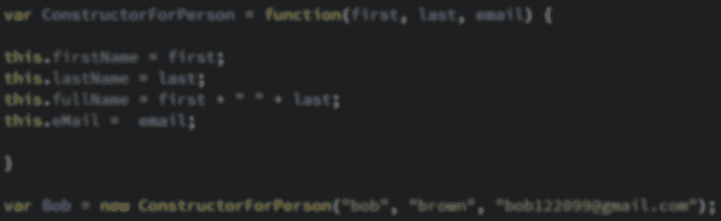

# 用 JavaScript 学习面向对象编程的基础知识(并增强您的编码能力…

> 原文：<https://www.freecodecamp.org/news/intro-to-object-oriented-programming-oop-with-javascript-made-easy-a317b87d6943/>

克里斯·拜拉吉翁

# 用 JavaScript 学习面向对象编程的基础知识(并增强您的编码能力！)



作为 [freeCodeCamp](https://www.freecodecamp.org/) 聊天室的版主，我花了很多时间和新开发人员在一起。好家伙，他们渴望学习。对我们很多人来说，这可能是一个相当具有挑战性的品质。

在面向对象编程(OOP)的情况下，这尤其正确。到底什么是方法，为什么它如此特别？方法和属性*有什么区别？*为什么我们甚至使用面向对象编程，为什么它对我这个开发人员来说是必不可少的？这些是我在学习 OOP 时问自己的一些问题，因为你在这里，可以很安全地假设你也有。

### 在 JavaScript 中使用面向对象编程

JavaScript 中的几乎所有东西都是对象。在幕后的某个地方，你写的每一段代码要么是用 OOP 写的，要么是用 OOP 存储的。这也是理解它如此重要的原因之一。如果你不这样做，那么你很可能永远无法阅读其他开发人员的代码。最重要的是，你的代码永远不会发挥其全部潜力！

在 JavaScript 中，通过将一个变量赋给两个花括号来创建一个新对象，如下所示:

```
var myObject = {};
```

```
// var myObject = new Object();  // Non recommended version, but it works
```

就这么简单！现在您有了一个对象，它可以存储您将存储在变量中的任何类型的数据。有许多方法可以将数据插入到对象中，但是我们现在将坚持使用最简单的方法。

### 快速语法课

要结束 JavaScript 中的一行，在创建这样的变量时:

其中 a = 5；

“行”结束于分号。当你在制作一个物体时，“线”将以逗号结束，就像这样:

```
myObject = { myProp: 5,  myOtherProp: 10,}
```

*   Property/Key:对象变量的名称。上面代码中的`myProp` 就是一个例子。||作业的左侧
*   方法:对象内部的函数，只对该对象可用。这是一种财产。
*   Value:对象变量的值。一个例子是 10，它是`myOtherProp.`的值，可以是任何有效的 JavaScript 数据类型。

只有对象*中的最后一个属性*可以不使用逗号。

注意:您可以用单引号或双引号将您的属性括起来。如果属性名中有空格，必须始终使用引号。当使用 [JSON](https://developer.mozilla.org/en-US/docs/Learn/JavaScript/Objects/JSON) 时，使用引号不是可选的。

### 引用对象属性

#### 点符号

引用一个对象有两种方式，都有一个名字作为引用。最常用的点符号*，*是主要使用的符号。看起来是这样的:

```
var myObject = {
```

```
otherObject: {            one: 1,        two: 2      },
```

```
addFunction: function(x,y){ return x+y }
```

```
}
```

```
var dot = myObject.otherObject;console.log(dot);//evaluates to otherObject: {..props:vals..}
```

上面的代码进入`myObject` 并通过点符号添加另一个对象`otherObject` 。任何可以作为变量使用的名字都适用于点符号。点符号是引用任何不包含空格的属性的最佳实践。

#### 括号符号

```
var myObject = {  "Other Obj": {          one: 1,      two: 2    }}
```

```
var bracket = myObject["Other Obj"];
```

```
bracket.newProperty = "This is a new property in myObject";
```

```
console.log(bracket.newProperty);
```

```
//evaluates to myObject["Other Obj"].newProperty
```

引用对象的另一种方式是通过括号符号。只有当对象的属性包含一个空格时，例如属性`myObject[“Other Object”];`，才建议这样做。在这种情况下，使用括号符号是必须的。当命名*方法时，*不要使用空格——否则函数不能被调用。此外，您可以使用引号来命名任何属性。

### 使用 JavaScript IRL

构造函数值得一提，因为我们将在本文后面制作我们自己形式的构造函数。要做到这一点，我们首先要学习两个 JavaScript 关键词——**new*T5**this**。当引用构造函数时，使用 new 关键字。***

*对于 this 关键字，它基本上是最后调用的函数父对象的一个花哨的关键字。如果它没有父对象，窗口将是它的父对象。您可以使用 Function.bind **()，将函数绑定到这个关键字。**在这里了解更多**。但是那更高级一点。有意义吗？让我们看一些代码:***

```
*`var ConstructorForPerson = function(first, last, email) {  this.firstName = first;this.lastName = last;this.fullName = first + " " + last;this.eMail =  email;`*
```

```
*`}`*
```

```
*`var Bob = new ConstructorForPerson("bob", "brown", "bob122099@gmail.com");`*
```

```
*`console.log(Bob.eMail);`*
```

```
*`//evals "bob122099@gmail.com"`*
```

*上面的代码将返回一个新的对象，`Bob.`是构造函数的结果，它将具有属性`Bob.firstName`、`Bob.lastName`、**、、`Bob.fullName`和`*Bob.eMail*`、*、**。******

*请注意，在构造函数内部，一行不是以逗号结尾，而是以分号结尾，就像您在函数内部所期望的那样。或者，为了简单起见，您可以创建自己的构造函数，而不使用 **new** 或 **this** *。这就是我们今天要做的，这样我们可以更好地看到所有移动的部分。**

### *简单地说*

*面向对象编程是一种为了最佳可读性、易用性和可维护性而组织代码的方法。考虑到这一点，让我们试着将 Google 编码成一个企业，包括一个普通公司的一些功能。*

*   *对象——建筑/管理*。*这将包含任何类型的员工的所有信息，可以对员工做的任何事情，包括制作新员工。*
*   *物业——员工*。*这可以是经理或前台职员。这可以是员工列表。这可以是你今年的毛利。几乎任何事情。*
*   *方法——谷歌能做什么？员工能做什么？新员工就是这样炼成的，也是他们将如何“执行任务”。*

### *我们来编码吧！*

*首先，让我们看看我们的最终结果:*

```
*`var google = { //create {google}`*
```

```
*`employees: {           management: {            },`*
```

```
*`developers: {                 },`*
```

```
*`maintenance: {            }   },      NewEmployee: function(name, role, phone, idNumber) {  //create NewExployee()            var newEmployeeData = {        name: name,        role: role,        phone: phone,        idNumber: idNumber,        working: false,        hours: [],       }     //make new object to append to google.employees[role]        google.employees[role][name] = newEmployeeData;    //assign object to google.employees[role][name]`*
```

```
*`return  google.employees[role][name];  //return the new object directly from google.employees[role][name]        } //end NewEmployee  } //end {google}`*
```

```
*`google.NewEmployee("james", "maintenance", "2035555555", "1234521"); //create {google:employees:maintenance["james"]} from NewEmployee()`*
```

```
*`google.employees["maintenance"]["james"].clockInOut = function() { //create clockInOut() - default false         if(this.working) {         this.hours[this.hours.length - 1].push(Date.now());         this.working = false;         return this.name + " clocked out at " + Date.now();        }       else{         this.hours.push([Date.now()]);         this.working = true;         return this.name + " clocked in at " + Date.now();        }`*
```

```
*`return "Error"     //if above doesn't work, "Error" }`*
```

```
*`google.employees["maintenance"]["james"].clockInOut(); //clock James in or out, returns a string w/ the time & state`*
```

*令人生畏？*

*让我们把它分成小块。首先，我们将创建一个名为`Google`的全局对象。它将包含另一个 employees 对象，该对象将包含每个角色及其单个雇员的更多对象。*

*那么这在代码中会是什么样子呢？为了简单起见，我们将使用一个普通函数创建一个构造函数。它会有 7 个属性:`name`、**、*、***、*、`role,`、**、**、*、**、*、*、**、*、`idNumber`、、*、**、*、*、**和`hours`。*

*此外，它将有 1 个方法:`clockInOut(),`，该方法将查看`*working*`属性来更新`hours.`*

*我们来分解一下。*

*首先，我们将使用`NewEmployee()`构造函数更新我们的`Google`对象。记住，我们将使用自己的函数，而不是使用常规的 JavaScript 构造函数。*

**注意:注意语法，因为它会根据你正在做的事情而有所变化**

*还要注意:这些例子将不能正常运行，因为它们没有正确的依赖/属性/变量。最终产品的大部分(如果不是全部)功能都将返回错误。然而，如果您运行最终产品，一切都应该运行良好。*

```
*`var google = { //create {google}`*
```

```
*`employees: {           management: {`*
```

```
*`},           developers: {`*
```

```
*`},`*
```

```
*`maintenance: {`*
```

```
*`}         }, //<--this comma is unnecessary right now but when we add more object properties it will be necessary}`*
```

*`employees`持有公司各种角色的其他对象:`management`、`developers`、`maintenance`。我们将通过员工的角色添加一名员工，在本例中为维护。*

```
*`var google = {  NewEmployee: function(name, role, phone, idNumber) {    var newEmployeeData = {      name: name,      role: role,      phone: phone,      idNumber: idNumber,      working: false,      hours: [],     }     //make new object to append to google.employees[role]        google.employees[role][name] = newEmployeeData;    //assign object to google.employees[role][name]`*
```

```
*`return  google.employees[role][name];  //return the new object directly from google.employees[role][name]  }}`*
```

*我们的“构造函数”。非常简单，它接受一个新对象并将其附加到相应的角色。*

```
*`google.employees["maintenance"]["james"].clockInOut = function() { //create clockInOut() - default false         if(this.working) {         this.hours[this.hours.length - 1].push(Date.now());         this.working = false;         return this.name + " clocked out at " + Date.now();        }       else{         this.hours.push([Date.now()]);         this.working = true;         return this.name + " clocked in at " + Date.now();        }`*
```

```
*`return "Error" //if above doesn't work, "Error" }`*
```

```
*`google.employees["maintenance"]["james"].clockInOut(); //call clockInOut()`*
```

*这可能会让人感到困惑。还记得关键字 this 只是调用函数的父对象的一种滑稽说法吗？在上面的代码中，我们添加了方法`clockInOut***()***`。我们只是通过调用它来调用它。如果 working 为 false，它将在索引 0 处创建一个带有 Unix 时间戳的新数组。如果您已经在工作了，它会将一个 Unix 时间戳添加到最后创建的数组中，创建一个如下所示的数组:[1518491647421，1518491668453]，第一个时间戳是员工“打卡上班”的时间，第二个时间戳是员工“打卡下班”的时间。*

*现在我们已经看到了使用 OOP 是如何可行的！每个员工都可以通过一个简单的函数调用来“打卡上班”和“打卡下班”，您只需要知道他们的姓名和角色就可以了！*

*当然，这可以进行优化，比如查看 ID 号，而不是他们的角色和姓名，但是不要把事情搞得太复杂。下面我们把所有的东西都放回一个程序中。稍微不那么可怕，对吧？*

```
*`var google = { //create {google}`*
```

```
*`employees: {           management: {      },      developers: {      },`*
```

```
*`maintenance: {      }         },      NewEmployee: function(name, role, phone, idNumber) { //create NewExployee()            var newEmployeeData = {        name: name,        role: role,        phone: phone,        idNumber: idNumber,        working: false,        hours: [],       }     //make new object to append to google.employees[role]        google.employees[role][name] = newEmployeeData;    //assign object to google.employees[role][name]`*
```

```
*`return  google.employees[role][name];  //return the new object directly from google.employees[role][name]        }//end NewEmployee  } //end {google}`*
```

```
*`google.NewEmployee("james", "maintenance", "2035555555", "1234521"); //create {google:employees:maintenance["james"]} from NewEmployee()`*
```

```
*`google.employees["maintenance"]["james"].clockInOut = function() { //create clockInOut() - default false         if(this.working) {         this.hours[this.hours.length - 1].push(Date.now());         this.working = false;         return this.name + " clocked out at " + Date.now();        }       else{         this.hours.push([Date.now()]);         this.working = true;         return this.name + " clocked in at " + Date.now();        }`*
```

```
*`return "Error" //if above doesn't work, "Error" }`*
```

```
*`google.employees["maintenance"]["james"].clockInOut(); //call clockInOut()`*
```

*使用面向对象编程不仅能使你的代码更强大，而且对其他开发人员来说可读性更好。欢迎通过 [Github](https://github.com/krisb1220/) 获取项目、[自由代码营](http://www.freecodecamp.org/) info、Javascript/HTML/CSS 帮助联系我，鼓励我写一篇关于使用 JSON 和 API 的教程，或者谈谈猫！*

*顺便说一句，如果你不知道本教程中教授的所有内容，以及你需要知道的关于普通 Javascript、HTML、CSS 等的任何内容，你可以指望 [MDN](https://developer.mozilla.org/) 在这方面有大量的知识。这基本上是网络开发者的谷歌！也是 1220%免费开源。*

*如果你喜欢，不要忘记鼓掌和跟随！更多文章即将发布！:)*

*在 Instagram 上关注我 [@krux.io](http://instagram.com/krux.io)*

*关于 [MDN](https://developer.mozilla.org/) 的进一步学习:*

*[**面向初学者的 OOP**](https://developer.mozilla.org/en-US/docs/Learn/JavaScript/Objects/Object-oriented_JS)*

*[**全局对象**](https://developer.mozilla.org/en-US/docs/Web/JavaScript/Reference/Global_Objects/)*

*[**JSON 教程**](https://developer.mozilla.org/en-US/docs/Learn/JavaScript/Objects/JSON)*

*[**在 JAVASCRIPT 中使用 JSON—全局 JSON 对象**](https://developer.mozilla.org/en-US/docs/Web/JavaScript/Reference/Global_Objects/JSON)*

*[**关键词*本***](https://developer.mozilla.org/en-US/docs/Web/JavaScript/Reference/Operators/this)*

*[**构造函数**](https://developer.mozilla.org/en-US/docs/Web/JavaScript/Reference/Global_Objects/Object/constructor)*