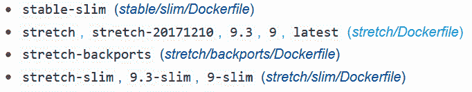

# Docker 标签快速介绍

> 原文：<https://www.freecodecamp.org/news/an-introduction-to-docker-tags-9b5395636c2a/>

如果你和 Docker 一起工作过一段时间，我敢打赌你一定遇到过 tags。它们通常看起来像“my_image_name:1 ”,其中冒号后面的部分称为标记。标记图像时并不总是指定标签，但我们稍后会深入了解这一点。

自从开始使用 Docker，我就对标签非常困惑。文档并没有很好地解释它们，而且在这个主题上也没有任何透彻的解释。这也是我决定写这篇帖子的原因。

### 什么是 Docker 标签？

那么，Docker 标签到底是什么？简而言之，Docker 标签传达了关于特定图像版本/变体的有用信息。它们是图像 ID 的别名，通常看起来像这样:`f1477ec11d12`。只是一种参照自己形象的方式。一个很好的类比是 Git 标签如何引用历史中的一个特定提交。

标签发挥作用的两种最常见的情况是:

1.  构建映像时，我们使用以下命令:

```
docker build -t username/image_name:tag_name .
```

让我们试着解释一下这个命令的作用。我们告诉 Docker 守护进程获取当前目录中的 Docker 文件(这就是最后的`.`所做的)。接下来，我们告诉 Docker 守护进程构建图像并给它指定标签。如果您运行`docker images`，您应该看到一个图像，它的存储库是`username/image_name`，标签是`tag_name`。

`username/image_name` 不是指定图像名称的强制格式。这只是一个有用的约定，以避免当您需要将图像推送到注册表时，再次标记您的图像。

你的形象可以被命名为任何你想要的。对于公共 Docker 注册表，在命名图像时，您只能使用两级层次结构。例如，你的图像不能有名字`a/b/c:1.`,这种限制通常不存在于私有注册中。如前所述，指定一个`tag_name.`并不是强制性的，我们很快就会看到在这种情况下会发生什么。

2.通过`tag`命令显式标记图像。

```
docker tag SOURCE_IMAGE[:TAG] TARGET_IMAGE[:TAG]
```

这个命令只是通过引用`SOURCE_IMAGE.`的`TARGET_IMAGE` 的名称创建一个别名(引用),这就是它所做的全部工作。这就像给现有的图像指定另一个名称来引用它。注意标签在这里是如何被`[:TAG]`指定为可选的。

### 如果不指定标签会发生什么？

好了，现在让我们来看看当你在标记一张图片时没有指定标签会发生什么。这就是`latest`标签出现的地方。每当一个图像被加上标签而没有明确的标签时，默认情况下它会被赋予`latest` 标签。这是一个不幸的命名选择，引起了很多混乱。但是我喜欢把它想象成**默认标签**，当你没有指定一个标签时，它就会被赋予图像。

由于期望它是图像的最新版本，尤其是在 docker 文件中，导致了围绕`latest`的许多混乱。让我们通过一个示例来考虑各种场景:

#### 场景 1:

假设我们的 docker 文件中有以下语句:

```
FROM debian
```

由于我们没有指定任何标签，Docker 将添加`latest`标签并尝试拉取图像`debian:latest`。

#### 场景 2:

```
FROM debian:9.3
```

由于这里明确提到了标记，Docker 将提取标记为 9.3 的 Debian 映像

另一件要记住的事情是，没有规则规定一个图像只需要一个标签。一个图像可以有多个标签，它们通常用于指定主要版本和次要版本。例如，考虑以下情况:



[Docker Hub page for Debian](https://hub.docker.com/r/library/debian/)

在写这篇文章的时候，Debian 镜像的`latest`标签指向`9.3`版本**和**版本`9`。这种情况很可能会在将来映像的主版本或次版本发生变化时发生。

请注意，用于语义版本控制的标签是一个遵循的惯例，但是标签不是为了这个目的而设计的*而仅仅是*。

### 总之，latest 不是一个特殊的标签

到目前为止，从我们所讨论的内容中，主要的收获是 **latest 就像任何其他标签**一样。开发者有责任正确地标记图像，以便`latest`总是指向图像的最新稳定版本。

因此，在提取图像时，我们不会在 docker 文件中显式地指定标签，因为我们可能会得到一个与我们以前使用的完全不同的基本图像版本。无法保证这将是一个大的颠簸还是小的颠簸。即使是旧版本也可以标记为`latest`。

附言:如果你在帖子中发现任何误解/错误，请随时发推文给我 [@ScribbingOn](https://twitter.com/ScribblingOn) 。

感谢 jérme Petazzoni 帮助我理解了这些。