# 关于 CSS 变量你需要知道的一切

> 原文：<https://www.freecodecamp.org/news/everything-you-need-to-know-about-css-variables-c74d922ea855/>

大多数编程语言都支持变量。但可悲的是，CSS 从一开始就缺乏对原生变量的支持。

你写 CSS？那你就没有变数了。嗯，除非你使用像 Sass 这样的预处理程序。

像 Sass 这样的预处理程序将变量的使用作为一个大的附加功能。尝试它们的理由。你知道吗？这是一个非常好的理由。

网络发展很快。我很高兴地报告 **CSS 现在终于支持变量**。

虽然预处理程序支持更多的特性，但是增加 CSS 变量是一个很好的特性。这使得网络离未来更近了。

在本指南中，我将向您展示变量如何在 CSS 中自然地工作，以及如何使用它们来使您的生活变得更加轻松。

### 你会学到什么

我将首先向您介绍 CSS 变量的基础知识。我相信任何理解 CSS 变量的体面尝试都必须从这里开始。

学习基本面很酷。更酷的是应用这些基本原理来构建真实世界的应用程序。

因此，我将通过展示如何构建 3 个展示 CSS 变量及其易用性的项目来结束本文。下面是这 3 个项目的快速预览。

#### 项目 1:使用 CSS 变量创建组件变体

您今天可能已经在构建组件变体了。无论你使用 React，Angular，还是 Vue，CSS 变量都会让这个过程变得更简单。

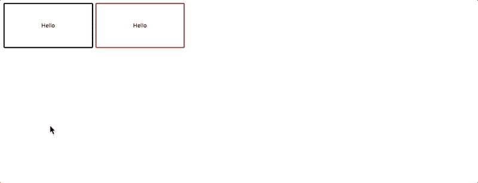

Creating Component Variations using CSS variables

在 [Codepen](https://codepen.io/ohansemmanuel/full/PQYzvv/) 上查看项目。

#### 项目 2:带有 CSS 变量的主题样式

你可能在什么地方见过这个。我将展示 CSS 变量使创建站点范围的主题样式变得多么容易。


Site-wide theme styles using CSS variables

在 [Codepen](https://codepen.io/ohansemmanuel/full/xYKgwE/) 上查看项目。

#### 项目三:搭建 CSS 变量展台？

这是最后一个项目。不介意名字。我想不出更好的名字了。

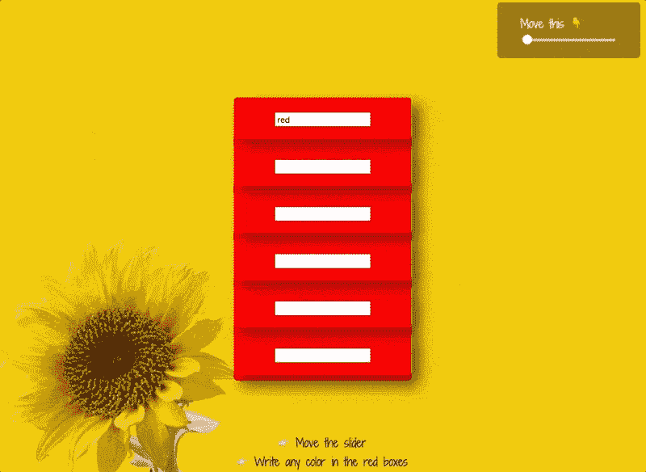

The color of the boxes are dynamically updated

请注意框的颜色是如何动态更新的，以及随着范围输入的改变，框容器是如何在 3D 空间中旋转的。


这个项目展示了用 JavaScript 更新 CSS 变量的简易性，以及用它获得的反应性好处。

#### 这会很有趣的！

花些时间在 [Codepen](https://codepen.io/ohansemmanuel/full/EoBLgd/) 上享受它的乐趣。

注意:本文假设您已经很好地掌握了 CSS。如果你不太了解 CSS，或者想学习创建令人瞠目结舌的 ui，我推荐你参加我的[高级 CSS 课程](https://bit.ly/learn_css)(包括 85 节课的付费课程)。这篇文章是本课程的摘录。</不要脸塞>？

### 为什么变量如此重要

如果您不熟悉预处理程序或原生 CSS 中的变量，这里有一些为什么变量很重要的原因。

#### **原因#1:更可读的代码**

不用多说，您可以很快看出任何代码基的可读性和可维护性。

#### **原因#2:跨大型文档更改的便利性**

如果你把所有的常量保存在一个单独的文件中，当你想改变一个变量的时候，你就不需要跳过成千上万行代码。

它变得超级简单。只要换一个地方，瞧。

#### **原因 3:你可以更快地发现错别字**

搜索一行行代码试图找出错误是一件痛苦的事情。如果错误是由于一个简单的打字错误，那就更令人恼火了。他们很难被发现。变量的良好使用消除了这些麻烦。

为此，可读性和可维护性是最大的优势。

感谢 CSS 变量，现在我们也可以在原生 CSS 中使用它们了。

### 定义 CSS 变量

让我从您可能已经熟悉的东西开始:JavaScript 中的变量。

一个简单的 JavaScript 变量可以这样声明:

```
var amAwesome;
```

然后你可以给它赋值，如下所示:

```
amAwesome = "awesome string"
```

在 CSS 中，CSS 变量是任何名称以两个破折号开头的“属性”。

```
/*can you spot the variable here? */.block { color: #8cacea;--color: blue}
```

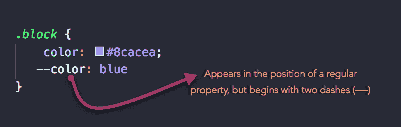

CSS Variables are also called “Custom Properties”

### 界定 CSS 变量的范围

还有一件事需要你注意。

记住在 JavaScript 中，变量是有范围的。它们可能有一个`global`或`local`范围。

CSS 变量也是如此。

考虑下面的例子:

```
:root {  --main-color: red}
```

`:root`选择器允许您定位 DOM 或文档树中最高级别的元素。

所以，以这种方式声明的变量的作用域是全局的。

明白了吗？

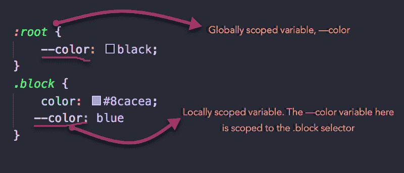

Local and Globally scoped variables

### 示例 1

假设您想要创建一个 CSS 变量来存储主题站点的主要颜色。

你会怎么做？

1.  您创建了作用域选择器。使用`:root`作为“全局”变量

```
:root { }
```

2.定义变量

```
:root { --primary-color: red}
```

记住，CSS 变量是任何名称以两个破折号开头的“属性”，例如`--color`

这很简单。

### 使用 CSS 变量

一旦变量被定义并赋值，您就可以在属性值中使用它了。

不过还是有一点小问题。

如果您来自预处理程序的世界，您必须习惯于通过引用变量的名称来使用变量。例如:

```
$font-size: 20px.test {  font-size: $font-size}
```

对于原生 CSS 变量，情况略有不同。通过使用`var()`函数引用一个变量。

在上面的例子中，使用 CSS 变量会产生这样的结果:

```
:root {  --font-size: 20px}.test {  font-size: var(--font-size)}
```

很不一样。


Remember to use the var function

一旦你解决了这个问题，你就会开始喜欢 CSS 变量——非常喜欢！

另一个重要的注意事项是，与 Sass(或其他预处理程序)中的变量不同——在 Sass(或其他预处理程序)中，您可以在很多地方使用变量，并且可以随心所欲地进行数学运算——您需要小心使用 CSS 变量。您通常会将它们设置为属性值。

```
/*this is wrong*/.margin {--side: margin-top;var(--side): 20px;}
```

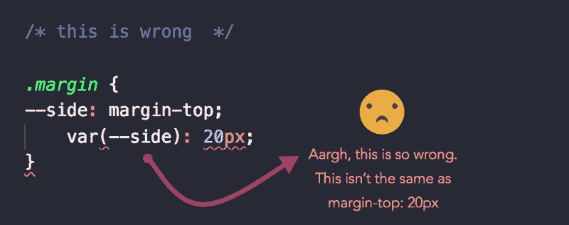

The declaration is thrown away as a syntax error for having an invalid property name

你也不会做数学。为此你需要 CSS `calc()`函数。在我们继续进行的过程中，我将讨论一些例子。

```
/*this is wrong */.margin {--space: 20px * 2;font-size:  var(--space);  //not 40px}
```

如果您必须做数学，那么使用 calc()函数，如下所示:

```
.margin {--space: calc(20px * 2);font-size:  var(--space);  /*equals 40px*/}
```

### 值得一提的特性

以下是一些值得一提的行为。

#### 1.自定义属性是普通属性，因此可以在任何元素上声明。

在段落元素、节、旁注、根甚至伪元素上声明它们。他们会像预期的那样工作。

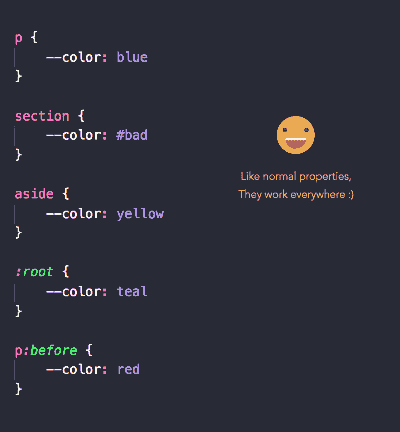

They behave like normal properties

#### 2.CSS 变量用正常的继承和级联规则来解析

考虑下面的代码块:

```
div {  --color: red;}div.test {  color: var(--color)}div.ew {  color: var(--color)}
```

与普通变量一样，`--color`值将由 div 继承。

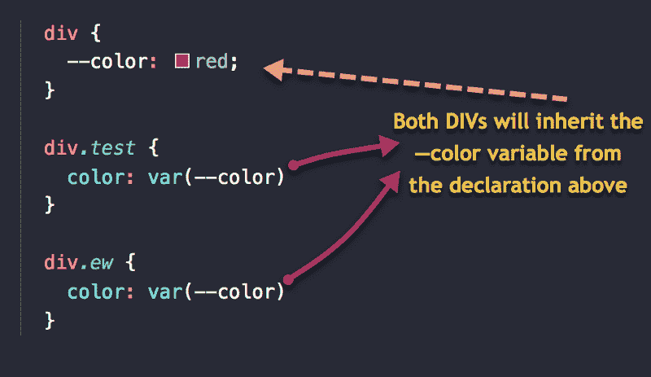

#### 3.CSS 变量可以通过`@media`和其他条件规则进行条件化

与其他属性一样，您可以在`@media`块或其他条件规则中更改 CSS 变量的值。

例如，下面的代码在较大的设备上更改变量 gutter 的值。

```
:root { --gutter: 10px }@media screen and (min-width: 768px) {    --gutter: 30px}
```

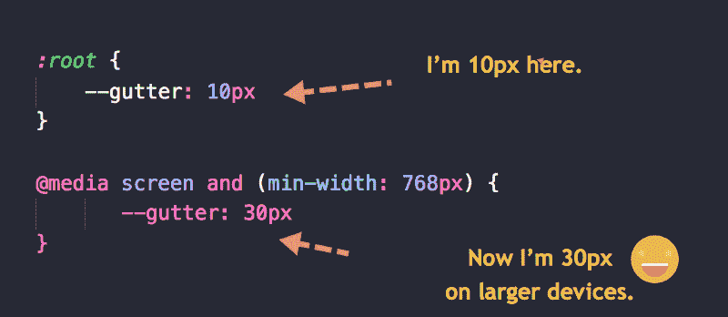

Useful bit for responsive design

#### 4.CSS 变量可以在 HTML 的样式属性中使用。

您可以选择内联设置变量的值，它们仍然会像预期的那样工作。

```
<!--HTML--><html style="--color: red"><!--CSS-->;body {  color: var(--color)}
```

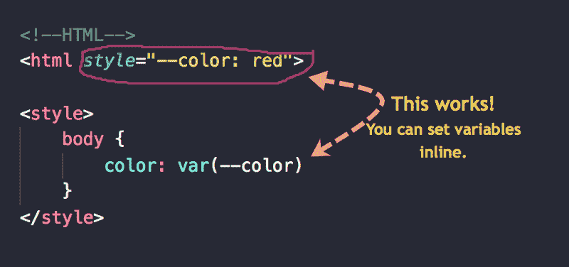

Set variables inline

CSS 变量区分大小写。小心这个。我节省了压力，用小写字母写变量。您的里程可能不同。

```
/*these are two different variables*/:root { --color: blue;--COLOR: red;}
```

### 解析多个声明

与其他属性一样，使用标准级联解析多个声明。

让我们看一个例子:

```
/*define the variables*/:root { --color: blue; }div { --color: green; }#alert { --color: red; }/*use the variable */* { color: var(--color); }
```

有了上面的变量声明，下面的元素会是什么颜色？

```
<;p>What's my color?</p><div>and me?</div><div id='alert'>  What's my color too?  <p>color?</p></div>
```

你能弄明白吗？

第一段会是`blue`。在`p`选择器上没有直接的`--color`定义集，所以它从`:root`继承值

```
:root { --color: blue; }
```

第一个`div`将是`green`。这很清楚了。在`div`上有一个直接变量定义集

```
div { --color: green; }
```

ID 为`alert`的`div`不会为绿色。那将是`red`

```
#alert { --color: red; }
```

该 ID 具有直接变量作用域。因此，定义中的值将覆盖其他值。选择器`#alert`更具体。

最后，`#alert`中的`p`将会是……`red`

段落元素上没有变量声明。由于对`:root`元素的声明，您可能期望颜色是`blue`。

```
:root { --color: blue; }
```

与其他属性一样，CSS 变量是继承的。该值继承自父项`#alert`

```
#alert { --color: red; }
```

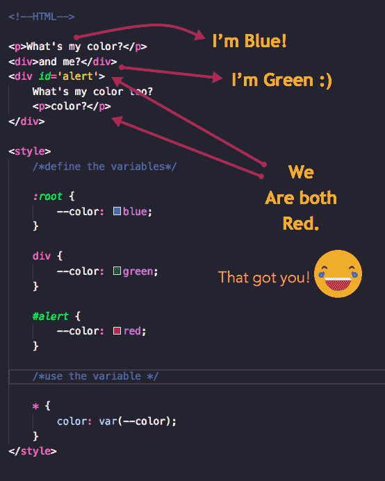

The solution to the Quiz

### 解决循环依赖关系

循环依赖以下列方式出现:

1.  当变量依赖于自身时。也就是说，它使用一个引用自身的`var()`。

```
:root {  --m: var(--m)}body {  margin: var(--m)}
```

2.当两个或多个变量相互引用时。

```
:root {  --one: calc(var(--two) + 10px);  --two: calc(var(--one) - 10px);}
```

注意不要在代码中创建循环依赖。

### 无效变量会发生什么？

语法错误会被丢弃，但是无效的`var()`替换会默认为相关属性的初始值或继承值。

请考虑以下情况:

```
:root { --color: 20px; }p { background-color: red; }p { background-color: var(--color); }
```

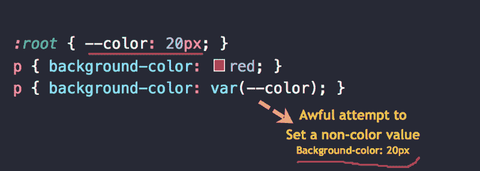

不出所料，`--color`被替换为`var()`，但是属性值`background-color: 20px`在替换后无效。由于`background-color`不是可继承的属性，该值将默认为其`initial`值`transparent`。

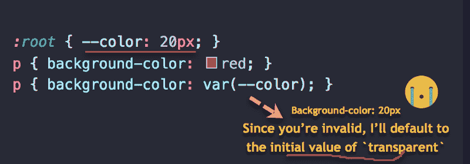

请注意，如果您编写的`background-color: 20px`没有任何变量替代，那么特定的后台声明将是无效的。然后将使用以前的声明。

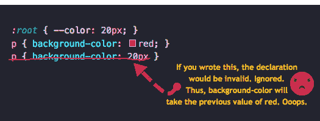

The case is differrent when you write the declaration yourself

### 构建单个令牌时要小心

当您设置如下所示的属性值时，`20px`被解释为单个令牌。

```
font-size: 20px
```

一种简单的说法是，值`20px`被视为单个“实体”

在用 CSS 变量构建单个令牌时，您需要小心。

例如，考虑下面的代码块:

```
:root { --size: 20}div {  font-size: var(--size)px /*WRONG*/}
```

你可能期望`font-size`的值产生`20px`，但这是错误的。

浏览器将其解释为`20 px`

注意`20`后面的空格

因此，如果您必须创建单个令牌，请使用一个变量来表示整个令牌。例如`--size: 20px`，或者使用`calc`函数，例如`calc(var(--size) * 1px)`，其中`--size`等于`20`

如果你还没明白，不要担心。我将在接下来的例子中更详细地解释它。

### 让我们建造东西吧！

这是我们一直在等待的文章的一部分。

我将通过构建几个有用的项目向您展示所讨论概念的实际应用。

让我们开始吧。

### 项目 1:使用 CSS 变量创建组件变体

考虑需要构建两个不同按钮的情况。相同的基本款式，只是有一点点不同。


在这种情况下，不同的属性是变量的`background-color`和`border-color`。

那么，你会怎么做呢？

下面是典型的解决方案。

创建一个基类，比如`.btn`并添加变体类。下面是一个标记示例:

```
<button class="btn">Hello</button&gt;<button class="btn red">Hello</button>
```

`.btn`将包含按钮上的基本样式。例如:

```
.btn {  padding: 2rem 4rem;  border: 2px solid black;  background: transparent;  font-size: 0.6em;  border-radius: 2px;}
```

```
/*on hover */.btn:hover {  cursor: pointer;  background: black;  color: white;}
```

那么，变种是从哪里来的呢？

这里:

```
/* variations */.btn.red {  border-color: red}.btn.red:hover {  background: red}
```

你看到我们是如何到处复制代码的吗？这很好，但是我们可以用 CSS 变量做得更好。

第一步是什么？

用 CSS 变量替换不同的颜色，不要忘记为变量添加默认值！

```
.btn {   padding: 2rem 4rem;   border: 2px solid var(--color, black);   background: transparent;   font-size: 0.6em;   border-radius: 2px; }
```

```
 /*on hover*/  .btn:hover {  cursor: pointer;   background: var(--color, black);   color: white; }
```

当你这么做的时候:`background: **var(--color, black)**` 你在说，把背景设置为变量`--color`的值。但是，如果变量不存在，使用默认值`**black**`

这就是设置默认变量值的方式。就像在 JavaScript 或任何其他编程语言中一样。

好的部分来了。

对于变量，您只需提供 CSS 变量的新值，如下所示:

```
.btn.red {   --color: red }
```

仅此而已。现在，当使用`.red`类时，浏览器会注意到不同的`--color`变量值，并立即更新按钮的外观。

如果你花很多时间构建可重用的组件，这真的很好。

这里有一个并列比较:

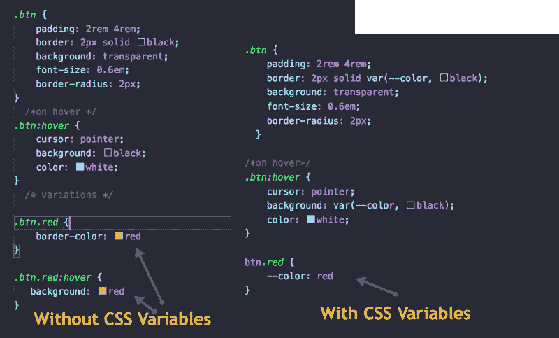

Without CSS Variables VS with CSS Variables

哦，如果你有更多的变体，你就可以省去很多额外的打字工作。

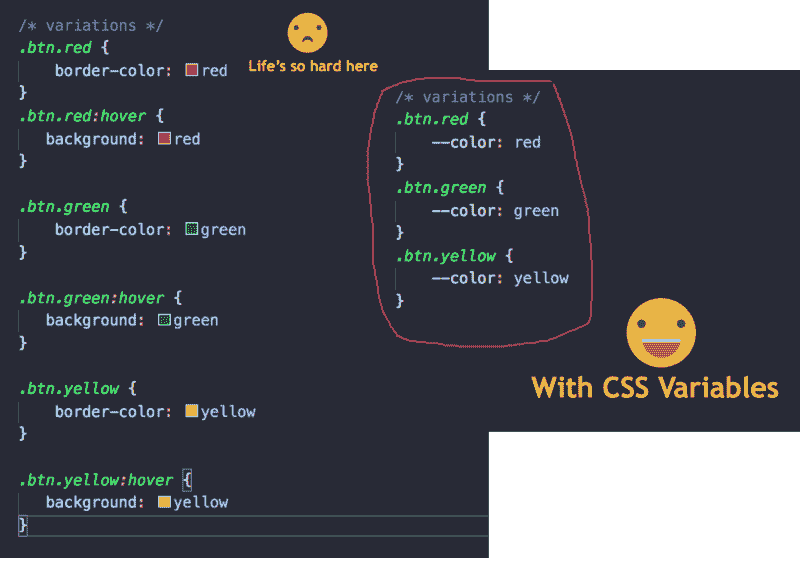

See the difference??

### 项目 2:带有 CSS 变量的主题站点

我肯定你以前遇到过他们。主题网站给用户定制的感觉。好像一切都在他们掌控之中。

下面是我们将要构建的基本示例。

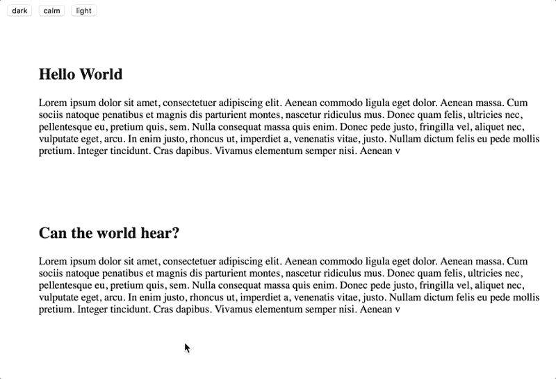

那么，CSS 变量有多简单呢？

我们去看看。

就在这之前，我想提一下这个例子相当重要。通过这个例子，我将介绍用 JavaScript 更新 CSS 变量的概念。

很好玩！

你会喜欢的。

### 我们真正想做的事。

CSS 变量的美妙之处在于它们的反应性质。一旦它们被更新，任何具有 CSS 变量值的属性也会被更新。

从概念上讲，这里有一张图片解释了与手头的例子相关的过程。

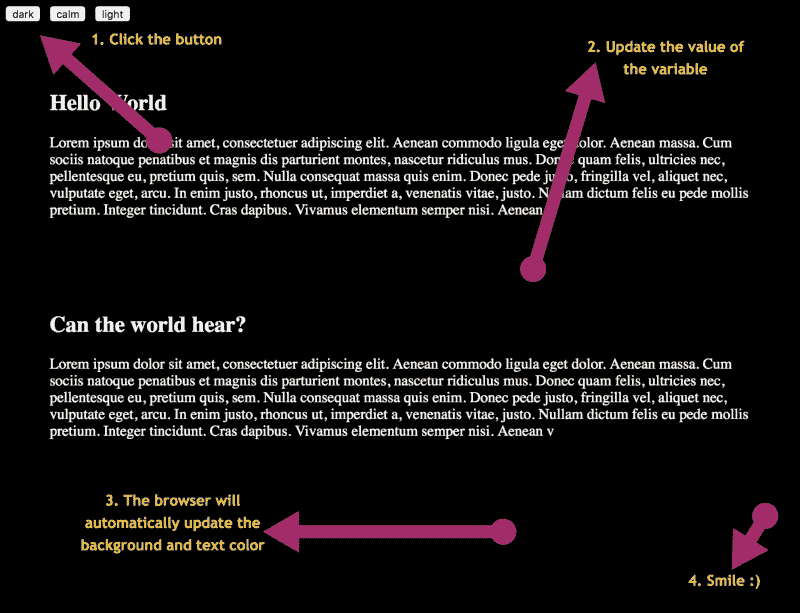

The process

因此，我们需要为点击监听器准备一些 JavaScript。

对于这个简单的例子，整个页面文本的背景和颜色是基于 CSS 变量的。

当你点击上面的任何一个按钮时，它们会将 CSS 变量设置为其他颜色。结果，页面的背景被更新。

嘿，就这些了。

呃，还有一件事。

当我说 CSS 变量被设置为其他值时，是怎么做到的呢？

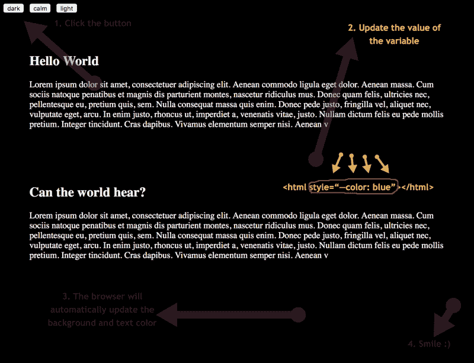

Set the variable inline

CSS 变量即使内联设置也会生效。使用 JavaScript，我们获得根文档，并为 CSS 变量内联设置新值。

明白了吗？

说得太多了，让我们做点实际的事情吧。

### 初始标记

需要的初始标记如下:

```
<div class="theme">  <button value="dark">dark</button>  <button value="calm">calm</button>  <button value="light">light</button></div><article>...</article>
```

标记由一个`.theme`父元素中的三个按钮组成。为了保持简洁，我截断了`article`元素中的内容。在这个`article`元素中是页面的内容。

### 设计页面样式

这个项目的成功始于页面的样式。诀窍很简单。

我们不是一成不变地设置页面的`background-color`和`color`，而是基于变量来设置它们。

我的意思是。

```
body {  background-color: var(--bg, white);  color: var(--bg-text, black)}
```

原因很明显。每当点击一个按钮时，我们将改变文档中两个变量的值。

根据这一变化，页面的整体风格将被更新。很简单。

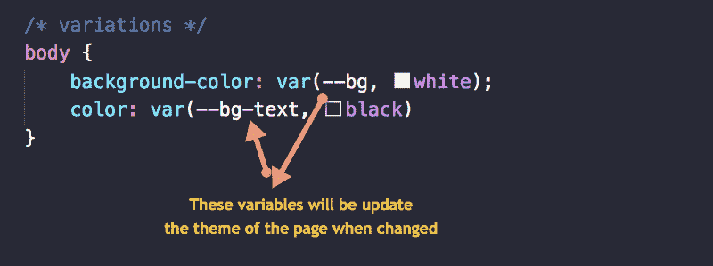

因此，让我们继续处理来自 JavaScript 的更新。

#### 了解 JavaScript

我将继续并吐出这个项目所需的所有 JavaScript。

```
const root = document.documentElement const themeBtns = document.querySelectorAll('.theme > button')themeBtns.forEach((btn) => {  btn.addEventListener('click', handleThemeUpdate)})function handleThemeUpdate(e) {  switch(e.target.value) {    case 'dark':       root.style.setProperty('--bg', 'black')      root.style.setProperty('--bg-text', 'white')      break    case 'calm':        root.style.setProperty('--bg', '#B3E5FC')       root.style.setProperty('--bg-text', '#37474F')      break    case 'light':      root.style.setProperty('--bg', 'white')      root.style.setProperty('--bg-text', 'black')      break  }}
```

不要让这吓到你。这比你想象的要容易得多。

首先，保留对根元素的引用，`const root = document.documentElement`

这里的根元素是`HTML`元素。过一会儿你就会明白为什么这很重要。如果你很好奇，需要设置 CSS 变量的新值。

此外，还要保留对按钮的引用

产生一个我们可以循环的类似数组的数据结构。遍历每个按钮，并在单击时向它们添加一个事件侦听器。

方法如下:

```
themeBtns.forEach((btn) => {  btn.addEventListener('click', handleThemeUpdate)})
```

`handleThemeUpdate`功能在哪里？我接下来会讨论这个问题。

每个被点击的按钮都有一个`handleThemeUpdate`作为它的回调函数。记下点击了什么按钮，然后执行正确的操作变得很重要。

有鉴于此，使用开关`operator`，并且基于被点击的按钮的值来执行一些操作。

继续，再看一下 JavaScript 代码块。你现在会明白得多。

### 项目三:搭建 CSS 变量展台？

如果你错过了，这里是我们将建立的:


请记住，框的颜色是动态更新的，并且随着范围输入的改变，框容器在 3d 空间中旋转。

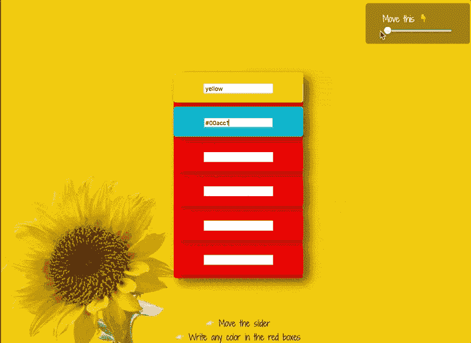

你可以在 [Codepen](https://codepen.io/ohansemmanuel/full/EoBLgd/) 上继续玩。

这是一个用 JavaScript 更新 CSS 变量以及随之而来的反应的极好例子。

让我们看看如何建立这个。

#### 加价

这里是需要的组件。

1.  范围输入
2.  存放说明的容器
3.  保存其他框列表的部分，每个框都包含输入字段


标记结果很简单。

这是:

```
<main class="booth">  <aside class="slider">    <label>Move this ? </label>    <input class="booth-slider" type="range" min="-50" max="50" value="-50" step="5"/>  </aside>    <section class="color-boxes">    <div class="color-box" id="1"><input value="red"/></div>    <div class="color-box" id="2"><input/></div>    <div class="color-box" id="3"><input/></div>    <div class="color-box" id="4"><input/&gt;</div&gt;    <div class="color-box" id="5"><input/></div>    <div class="color-box" id="6">;<input/>&lt;/div>  </section>  <footer class="instructions">    ?? Move the slider<br/>    ?? Write any color in the red boxes   </footer></main> 
```

这里有几件事需要你注意。

1.  范围输入代表从`-50`到`50`的值，步长值为`5`。此外，范围输入的值为最小值`-50`
2.  如果你不确定范围输入是如何工作的，可以查看一下 [w3schools](https://www.w3schools.com/jsref/dom_obj_range.asp)
3.  注意带有类`.color-boxes`的部分如何包含其他`.color-box`容器。在这些容器内存在输入字段。
4.  值得一提的是，第一个输入的默认值是红色。

理解了文档的结构后，继续按如下方式设计它:

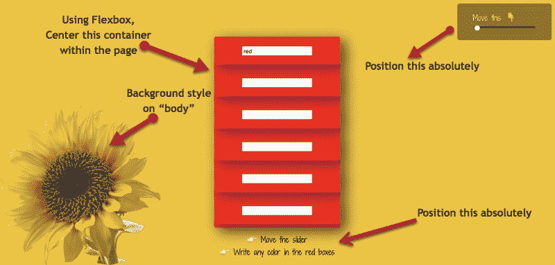

1.  从文档流中取出`.slider`和`.instructions`容器。绝对定位。
2.  给`body`元素一个日出的背景色，在左下角用一朵花装饰背景
3.  将`color-boxes`容器放在中间
4.  样式化`color-boxes`容器

让我们停止这些。

下面将解决第一个任务。

```
/* Slider */.slider,.instructions {  position: absolute;  background: rgba(0,0,0,0.4);  padding: 1rem 2rem;  border-radius: 5px}.slider {  right: 10px;  top: 10px;}.slider > * {  display: block;}/* Instructions */.instructions {  text-align: center;  bottom: 0;  background: initial;  color: black;}
```

代码片段没有您想象的那么复杂。希望你能通读并理解。如果没有，请发表评论或推文。

设计`body`的样式有点复杂。希望你能很好地理解 CSS。

因为我们希望用背景颜色和背景图像来设计元素的样式，所以最好使用`background`速记属性来设置多个背景。

这是:

```
body {  margin: 0;  color: rgba(255,255,255,0.9);  background: url('http://bit.ly/2FiPrRA') 0 100%/340px no-repeat, var(--primary-color);  font-family: 'Shadows Into Light Two', cursive;}
```

`url`位是日出花的链接。

下一组属性`0 100%`表示图像的背景位置。

下面是 CSS 背景定位的工作原理:


From: [the advanced guide to CSS](http://bit.ly/learn_css)

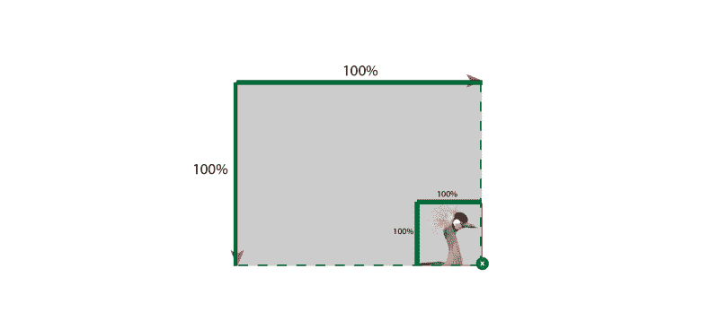

From: [the advanced guide to CSS](http://bit.ly/learn_css)

正斜杠后面的另一位代表`background-size`，它已经被设置为`340px`，如果你把它变小，图像也会变小。

你可能会知道那是做什么的。它防止背景重复出现。

最后，逗号后面的任何内容都是第二个后台声明。这次我们只设置了`background-color`到`var(primary-color)`

哎呀，那是一个变量。

这意味着你必须定义变量。方法如下:

```
:root {  --primary-color: rgba(241,196,15 ,1)}
```

那里的原色是日出的黄色。没什么大不了的。我们很快会在里面设置更多的变量。

现在，让我们将`color-boxes`居中

```
main.booth {  min-height: 100vh;    display: flex;  justify-content: center;  align-items: center;}
```

主容器充当 flex 容器，并将直接子容器正确地放置在页面的中央。这恰好是我们心爱的`color-box`容器

让我们把颜色盒容器和它的子元素做得漂亮些。

首先，子元素:

```
.color-box {  padding: 1rem 3.5rem;  margin-bottom: 0.5rem;  border: 1px solid rgba(255,255,255,0.2);  border-radius: 0.3rem;  box-shadow: 10px 10px 30px rgba(0,0,0,0.4); }
```

那就行了。还有一个美丽的阴影。这会给我们带来一些很酷的效果。

这还不是全部。让我们来设计整个`container-boxes`容器的样式:

```
/* Color Boxes */.color-boxes {  background: var(--secondary-color);  box-shadow: 10px 10px 30px rgba(0,0,0,0.4);  border-radius: 0.3rem;    transform: perspective(500px) rotateY( calc(var(--slider) * 1deg));  transition: transform 0.3s}
```

我的天啊。

里面有很多。

让我来分解一下。

这是简单的一点:

```
.color-boxes {   background: var(--secondary-color);   box-shadow: 10px 10px 30px rgba(0,0,0,0.4);   border-radius: 0.3rem;}
```

你知道那是什么吗？

这里有一个新的变量。应该通过将它添加到根选择器中来解决这个问题。

```
:root {  --primary-color: rgba(241,196,15 ,1);  --secondary-color: red;}
```

第二种颜色是红色。这将给容器一个红色的背景。

现在到了可能让你困惑的部分:

```
/* Color Boxes */.color-boxes {  transform: perspective(500px) rotateY( calc(var(--slider) * 1deg));  transition: transform 0.3s}
```

我们可以暂时简化上面的 transform 属性的值。


例如:

```
transform: perspective(500px) rotateY( 30deg);
```

转换速记应用了两个不同的函数。一个是透视，另一个是沿 Y 轴的旋转。

嗯，那么`perspective`和`rotateY`函数是怎么回事呢？

perspective()函数应用于正在 3D 空间中进行变换的元素。它激活三维空间并给出沿 z 轴的元素深度。

你可以在 [codrops](https://tympanus.net/codrops/css_reference/transform/#section_perspective) 上阅读更多关于透视功能的信息。

`rotateY`功能，那是怎么回事？

激活 3d 空间后，元素具有平面 x、y、z。`rotateY`功能沿`Y`平面旋转元素。

下面这张来自 [codrops](https://tympanus.net/codrops/css_reference/transform/#section_rotate3d) 的图表对于形象化这一点非常有帮助。

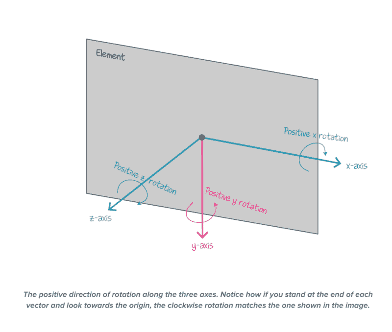

[Codrops](https://tympanus.net/codrops/css_reference/transform/#section_rotate3d)

我希望这能消除一些压力。

回到我们开始的地方。

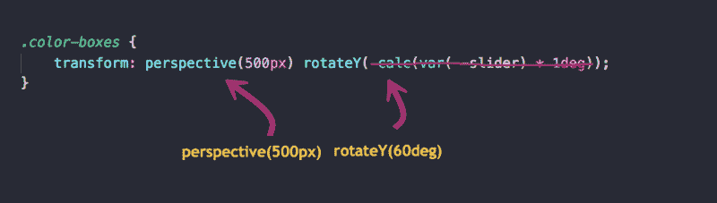

当你移动滑块时，你知道什么功能会影响`.container-box`的旋转吗？

它是被调用的 rotateY 函数。该框沿 Y 轴旋转。

因为传递给 rotateY 函数的值将通过 JavaScript 更新，所以该值用一个变量表示。

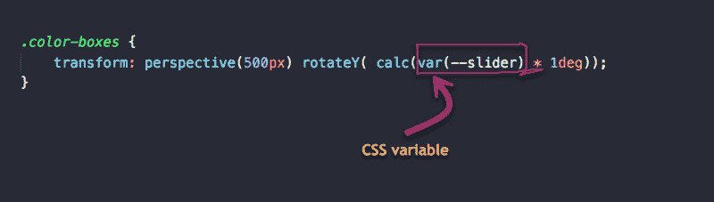

那么，为什么要用变量乘以 1deg 呢？

作为一般的经验法则，并且为了显式的自由，建议在构建单个令牌时，将值存储在没有单位的变量中。

您可以通过`calc`函数进行乘法运算，将它们转换成您想要的任何单位。

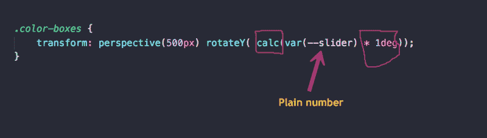

这允许你在拥有这些值的时候做任何你想做的事情。想要转换成`deg`或者用户的视口`vw`的比例，你可以随心所欲。

在这种情况下，我们通过将“数字”值乘以 1 度来将数字转换为度数

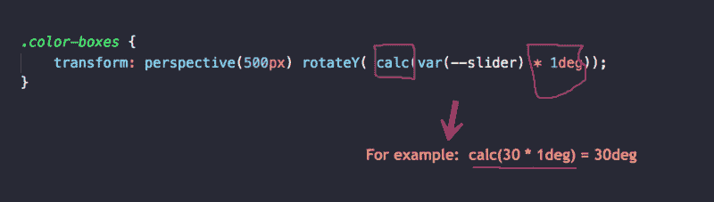

因为 CSS 不懂数学，所以你必须把这个算法传递给 calc 函数，以便 CSS 正确地计算。

一旦完成，我们就可以走了。这个变量的值可以在 JavaScript 中随意更新。

现在，只剩下一点 CSS 了。

这是:

```
/* Handle colors for each color box */.color-box:nth-child(1) {  background: var(--bg-1)}.color-box:nth-child(2) {  background: var(--bg-2)}.color-box:nth-child(3) {  background: var(--bg-3)}.color-box:nth-child(4) {  background: var(--bg-4)}.color-box:nth-child(5) {  background: var(--bg-5)}.color-box:nth-child(6) {  background: var(--bg-6)}
```

这是什么巫术？

首先，第 n 个子选择器选择每个子框。

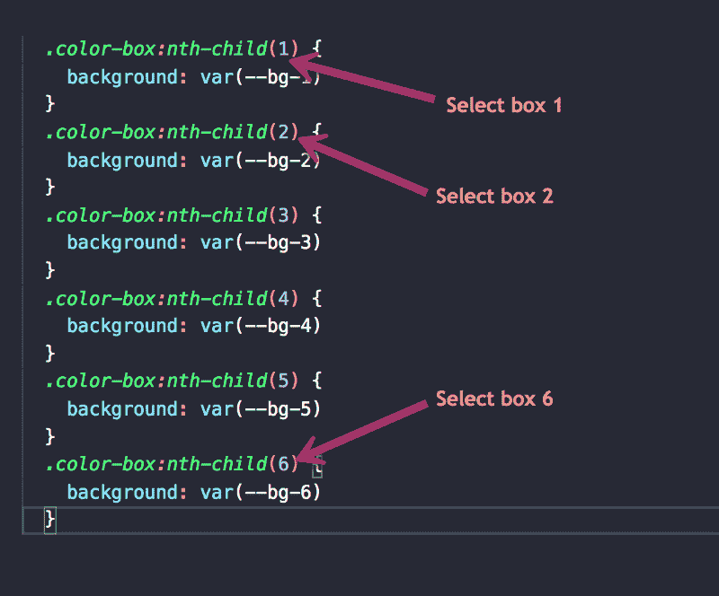

这里需要一点远见。我们知道我们将更新每个盒子的背景颜色。我们还知道这个背景颜色必须用一个变量来表示，这样就可以通过 JavaScript 访问它。对吗？

我们可以继续这样做:

```
.color-box:nth-child(1) {  background: var(--bg-1)}
```

简单。

但是有一个问题。如果这个变量不存在，会发生什么？

我们需要退路。

这是可行的:

```
.color-box:nth-child(1) {  background: var(--bg-1, red)}
```

在这种特殊情况下，我选择不提供任何退路。

如果属性值中使用的变量无效，该属性将采用其初始值。

因此，当`--bg-1`无效或不可用时，背景将默认为其初始值透明。

初始值指的是未显式设置的属性值。例如，如果你不设置一个元素的`background-color`，它将默认为`transparent`

初始值是一种默认的属性值。

### 让我们写一些 JavaScript

在 JavaScript 方面，我们需要做的事情很少。

首先让我们来处理滑块。

我们只需要 5 行就够了！

```
const root = document.documentElementconst range = document.querySelector('.booth-slider')//as slider range's value changes, do something range.addEventListener('input', handleSlider)function handleSlider (e) {  let value = e.target.value   root.style.setProperty('--slider', value)}
```

很简单，是吧？

让我解释一下以防我失去你。

首先，保持对滑块元素的引用，`const range = document.querySelector('.booth-slider')`

设置一个事件监听器，当范围输入值改变时，`range.addEventListener('input', handleSlider)`

写回调，`handleSlider`

```
function handleSlider (e) {  let value = e.target.value   root.style.setProperty('--slider', value)}
```

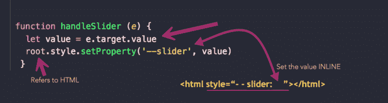

`root.style.setProperty('--slider', value)`表示，获取`root`元素(HTML)，抓取其样式，并在其上设置一个属性。

### 处理颜色变化

这就像处理滑块值的变化一样简单。

方法如下:

```
const inputs = document.querySelectorAll('.color-box > input')
```

```
//as the value in the input changes, do something.inputs.forEach(input => {  input.addEventListener('input', handleInputChange)})function handleInputChange (e) {  let value = e.target.value  let inputId = e.target.parentNode.id   let inputBg = `--bg-${inputId}`   root.style.setProperty(inputBg, value)}
```

保留对所有文本输入的引用，`const inputs = document.querySelectorAll('.color-box > inpu`t’)

在所有输入上设置事件监听器:

```
inputs.forEach(input => {   input.addEventListener('input', handleInputChange)})
```

编写`handleInputChange`函数:

```
function handleInputChange (e) {  let value = e.target.value  let inputId = e.target.parentNode.id   let inputBg = `--bg-${inputId}`   root.style.setProperty(inputBg, value)}
```

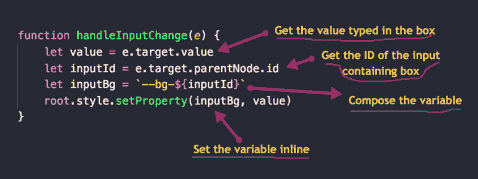

唷…

就是这样！

项目完成了。

### 我怎么会错过这个？

我已经完成并编辑了这篇文章的初稿，这时我注意到我没有在任何地方提到浏览器支持。所以，让我来收拾我的烂摊子。

浏览器对 CSS 变量(又名自定义属性)的支持一点也不差。它非常好，在所有现代浏览器上都有不错的支持(在撰写本文时超过 87%)。

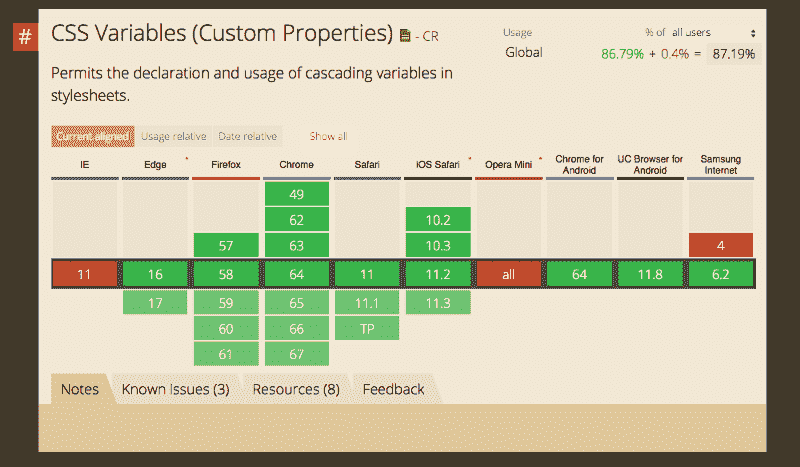

[caniuse](https://caniuse.com/#search=css%20var)

那么，你能在今天的生产中使用 CSS 变量吗？我会答应的！但是，一定要检查一下你自己的采用率。

从好的方面来说，你可以使用类似于[神话](http://www.myth.io)的预处理器。它将把你“未来”的 CSS 预处理成你今天使用的东西。多酷啊。

如果你有一些使用 [postCSS](http://postcss.org) 的经验，这同样是今天使用未来 CSS 的一个好方法。这里有一个 CSS 变量的 [postCSS 模块。](https://www.npmjs.com/package/postcss-css-variables)

就是这样。我受够了。

### 哎呀，但是我有问题！

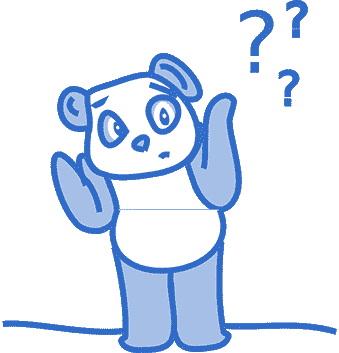

[获得电子书](https://gum.co/lwaUh)进行离线阅读，还可以获得**私人** slack 邀请，在那里你可以问我任何问题。

这是个公平的交易，对吧？

回头见！？