# 理解胶囊网络——人工智能诱人的新架构

> 原文：<https://www.freecodecamp.org/news/understanding-capsule-networks-ais-alluring-new-architecture-bdb228173ddc/>

尼克·布尔达科斯

# 理解胶囊网络——人工智能诱人的新架构

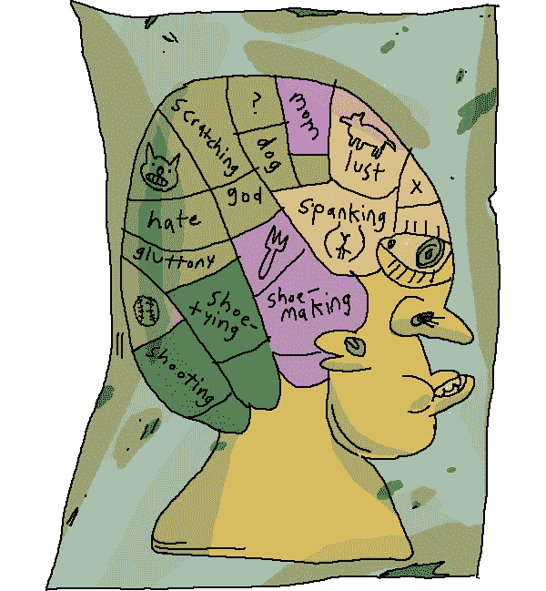

“[Science](https://www.instagram.com/p/BaIocBQl-H_/?taken-by=areynolds_illo)” by [Alex Reynolds](https://alex-reynolds-art.squarespace.com)

卷积神经网络做了一项惊人的工作，但根源在于问题。是我们开始思考新的解决方案或改进的时候了——现在，进入胶囊。

之前，我简要讨论过[胶囊网络](https://hackernoon.com/capsule-networks-are-shaking-up-ai-heres-how-to-use-them-c233a0971952)如何对抗这些传统问题。在过去的几个月里，我一直沉浸在胶囊里。我认为现在是我们都努力更深入了解胶囊实际工作原理的时候了。

为了更容易理解，我构建了一个可视化工具，让您可以看到每一层发生了什么。这与网络的简单实现是成对的。所有这些都可以在 GitHub [这里](https://github.com/bourdakos1/CapsNet-Visualization)找到。

这是 CapsNet 架构。如果你还不明白它的意思，不要担心。我会一层一层地浏览，尽可能多的展现细节。

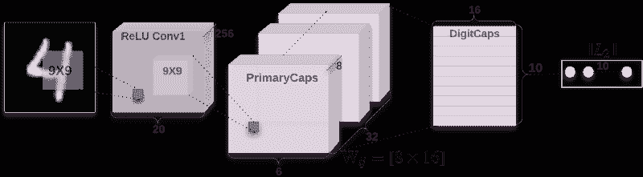

### 第 0 部分:输入

CapsNet 的输入是提供给神经网络的实际图像。在这个例子中，输入图像是 28 像素高和 28 像素宽。但是图像实际上是三维的，第三维包含颜色通道。

我们示例中的图像只有一个颜色通道，因为它是黑白的。你所熟悉的大多数图像有 3 或 4 个通道，用于红-绿-蓝，可能还有一个额外的通道用于 Alpha，或透明度。


这些像素中的每一个都被表示为从 0 到 255 的值，并存储在 28x28x1 矩阵[28，28，1]中。像素越亮，值越大。

### 第 1a 部分:卷积

CapsNet 的第一部分是传统的卷积层。什么是卷积层，它是如何工作的，其目的是什么？

目标是从输入图像中提取一些非常基本的特征，如边缘或曲线。

我们如何做到这一点？

让我们考虑一个优势:


如果我们观察图像上的几个点，我们可以开始获得一个模式。将注意力集中在我们正在观察的点的左边和右边的颜色上:


您可能会注意到，如果该点是一条边，它们会有更大的差异:

```
255 - 114 = 141
114 - 153 = -39
153 - 153 = 0
255 - 255 = 0
```

如果我们遍历图像中的每个像素，并用它左右两侧像素的差值替换它的值，会怎么样？理论上，除了边缘，图像应该变成全黑。

我们可以通过遍历图像中的每个像素来做到这一点:

```
for pixel in image {
  result[pixel] = image[pixel - 1] - image[pixel + 1]
}
```

但是这不是很有效率。我们可以用一种叫做“卷积”的东西来代替从技术上讲，这是一种“互相关”，但每个人都喜欢称之为卷积。

卷积本质上与我们的循环做同样的事情，但是它利用了矩阵数学。

卷积是通过在图像的角落排列一个小“窗口”来完成的，这个窗口只能让我们看到该区域的像素。然后，我们在图像的所有像素上滑动窗口，将每个像素乘以一组权重，然后将该窗口中的所有值相加。

这个窗口是一个权重矩阵，称为“内核”

我们只关心 2 个像素，但是当我们将窗口包围在它们周围时，它将封装它们之间的像素。

```
Window:
┌─────────────────────────────────────┐
│ left_pixel middle_pixel right_pixel │
└─────────────────────────────────────┘
```

你能想出一组权重吗？我们可以用这些像素乘以这些权重，这样它们的总和就是我们要寻找的值。

```
Window:
┌─────────────────────────────────────┐
│ left_pixel middle_pixel right_pixel │
└─────────────────────────────────────┘
(w1 * 255) + (w2 * 255) + (w3 * 114) = 141
```

**下面剧透！**

```
 │            │            │
 │            │            │
 │            │            │
 │            │            │
 │            │            │
\│/          \│/          \│/
 V            V            V
```

我们可以这样做:

```
Window:
┌─────────────────────────────────────┐
│ left_pixel middle_pixel right_pixel │
└─────────────────────────────────────┘
(1 * 255) + (0 * 255) + (-1 * 114) = 141
```

有了这些权重，我们的内核将如下所示:

```
kernel = [1  0 -1]
```

然而，内核通常是方形的，所以我们可以用更多的零填充它，如下所示:

```
kernel = [
  [0  0  0]
  [1  0 -1]
  [0  0  0]
]
```

这里有一个很好的 gif 来看看卷积的作用:

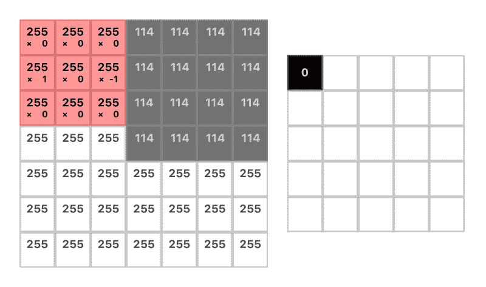

**注意:**输出的维数减少了内核的大小加 1。例如:`(7 — 3) + 1 = 5`(下一节将详细介绍)

这是原始图像与我们精心制作的内核进行卷积后的样子:

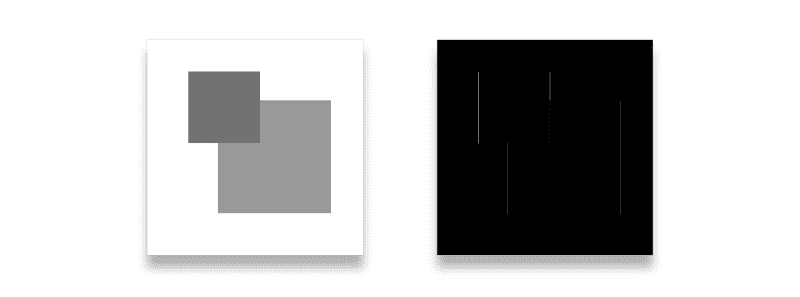

你可能会注意到有几条边不见了。具体来说，横向的。为了突出这些，我们需要另一个内核来查看上面和下面的像素。像这样:

```
kernel = [
  [0  1  0]
  [0  0  0]
  [0 -1  0]
]
```

此外，这两种内核都不能很好地处理其他角度的边缘或模糊的边缘。因此，我们使用许多内核(在我们的 CapsNet 实现中，我们使用 256 个内核)。内核通常更大，以便有更多的回旋余地(我们的内核将是 9x9)。

这是一个内核在训练模型后的样子。这不是很明显，但这只是我们的边缘检测器的一个更大的版本，更健壮，只发现从亮到暗的边缘。

```
kernel = [
  [ 0.02 -0.01  0.01 -0.05 -0.08 -0.14 -0.16 -0.22 -0.02]
  [ 0.01  0.02  0.03  0.02  0.00 -0.06 -0.14 -0.28  0.03]
  [ 0.03  0.01  0.02  0.01  0.03  0.01 -0.11 -0.22 -0.08]
  [ 0.03 -0.01 -0.02  0.01  0.04  0.07 -0.11 -0.24 -0.05]
  [-0.01 -0.02 -0.02  0.01  0.06  0.12 -0.13 -0.31  0.04]
  [-0.05 -0.02  0.00  0.05  0.08  0.14 -0.17 -0.29  0.08]
  [-0.06  0.02  0.00  0.07  0.07  0.04 -0.18 -0.10  0.05]
  [-0.06  0.01  0.04  0.05  0.03 -0.01 -0.10 -0.07  0.00]
  [-0.04  0.00  0.04  0.05  0.02 -0.04 -0.02 -0.05  0.04]
]
```

**注意:**我对数值进行了四舍五入，因为它们相当大，例如`0.01783941`

幸运的是，我们不必手工挑选这些内核。这就是训练的作用。内核开始时都是空的(或者处于随机状态),然后不断调整，使输出更接近我们想要的结果。

这就是 256 个内核最终的样子(我把它们涂成了像素，这样更容易理解)。数字越负，就越蓝。0 为绿色，正数为黄色:

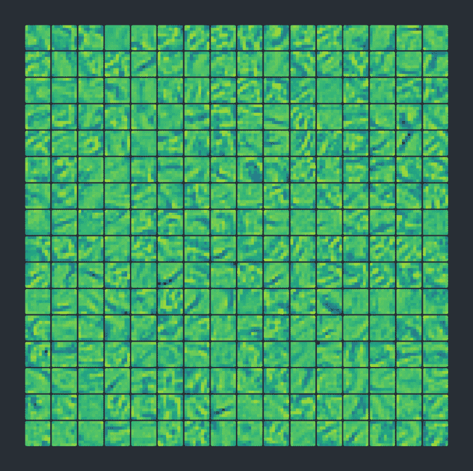

256 kernels (9x9)

在我们用所有这些内核过滤图像之后，我们最终得到了一个由 256 个输出图像组成的大堆栈。

### 第 1b 部分:继电器

ReLU(正式名称为整流线性单元)听起来可能很复杂，但实际上非常简单。ReLU 是一个接受值的激活函数。如果是负的，它变为零，如果是正的，它保持不变。

在代码中:

```
x = max(0, x)
```

作为一张图表:

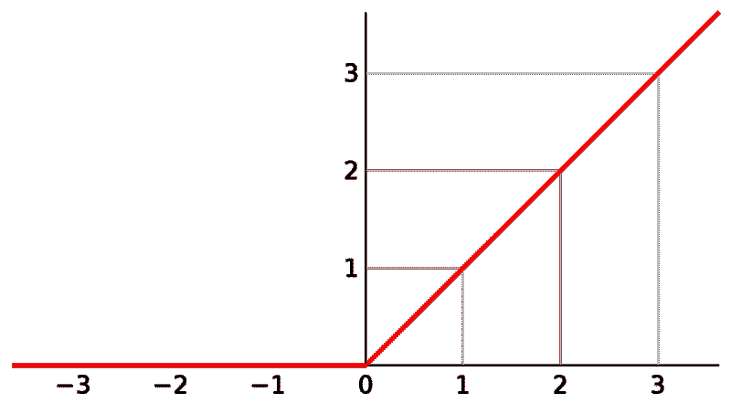

我们将这个函数应用于卷积的所有输出。

我们为什么要这样做？如果我们不对各层的输出应用某种激活函数，那么整个神经网络可以被描述为一个线性函数。这意味着我们所做的一切都是毫无意义的。

增加一个非线性可以让我们描述各种各样的函数。我们可以应用许多不同类型的函数，但 ReLU 是最受欢迎的，因为它执行起来非常便宜。

以下是 ReLU Conv1 层的输出:

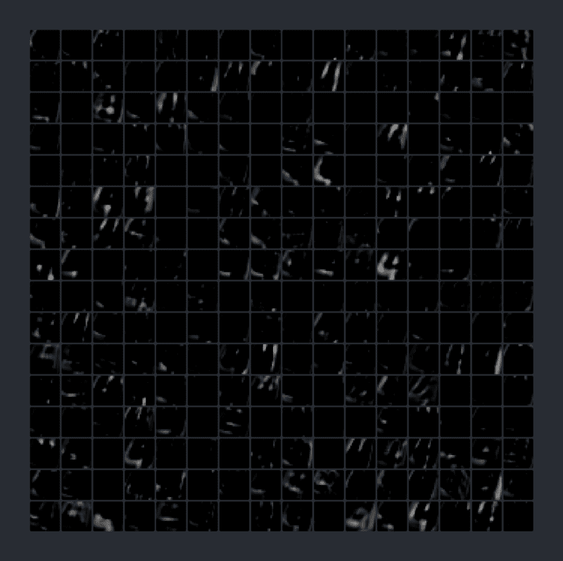

256 outputs (20x20 pixels)

### 第 2a 部分:主要大写字母

PrimaryCaps 层开始时是一个普通的卷积层，但这一次我们对之前卷积的 256 个输出进行卷积。因此，我们没有使用 9x9 内核，而是使用了 9x9x256 内核。

我们到底在找什么？

在第一层卷积中，我们寻找简单的边缘和曲线。现在，我们从之前发现的边缘中寻找稍微复杂一点的形状。

这次我们的“步幅”是 2。这意味着我们不是一次移动一个像素，而是两步。选择较大的步幅，以便我们可以更快地减小输入的大小:


**注意:**输出的维数通常是 12，但是我们将它除以 2，因为跨度的缘故。例如:`*((20 — 9) + 1) / 2 = 6*`

我们将对输出再进行 256 次卷积。因此，我们最终会得到 256 个 6x6 输出的堆栈。

但是这一次，我们不满足于仅仅一些糟糕的普通的旧数字。

我们将把这叠牌分成 32 副，每副 8 张。

我们可以称这个甲板为“胶囊层”

每个胶囊层有 36 个“胶囊”

如果你能跟上(并且是一个数学奇才)，这意味着每个胶囊有一个 8 值数组。这就是我们所说的“矢量”

我要说的是:

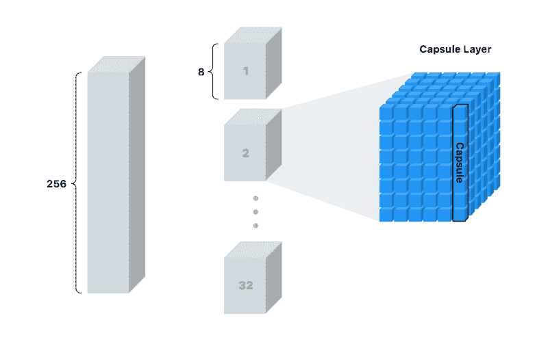

这些“胶囊”是我们的新像素。

对于单个像素，我们只能存储是否在该点找到边缘的置信度。数字越高，置信度越高。

使用胶囊，我们可以在每个位置存储 8 个值！这给了我们存储更多信息的机会，而不仅仅是我们是否在那个地方找到了一个形状。但是我们还想存储什么样的信息呢？

当看到下面的形状时，你能告诉我关于它的什么？如果你要告诉别人怎么重画，而他们又看不到，你会怎么说？

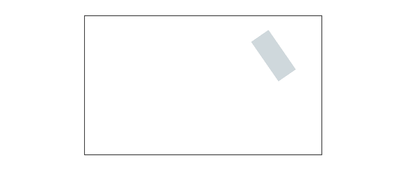

这张图片非常简单，所以我们只需要一些细节来描述它的形状:

*   形状类型
*   位置
*   旋转
*   颜色
*   大小

我们可以称之为“实例化参数”对于更复杂的图像，我们最终需要更多的细节。它们可以包括姿态(位置、大小、方向)、变形、速度、反照率、色调、纹理等等。

你可能还记得，当我们为边缘检测制作内核时，它只能在特定的角度上工作。我们需要为每个角度添加一个内核。在处理边的时候，我们可以避开它，因为描述边的方式很少。一旦我们达到了形状的层次，我们不希望矩形、椭圆形、三角形等等的每个角都有一个内核。它会变得笨拙，并且在处理具有三维旋转和照明等特征的更复杂的形状时会变得更糟。

这就是为什么传统神经网络不能很好地处理看不见的旋转的原因之一:

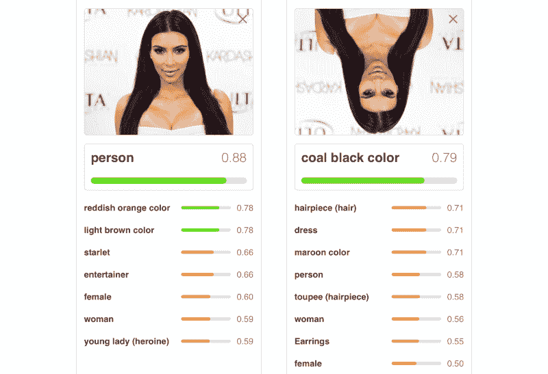

随着我们从边缘到形状，从形状到物体，如果我们有更多的空间来存储这些额外的有用信息，那该多好。

以下是 2 个胶囊层(一个用于矩形，另一个用于三角形)与 2 个传统像素输出的简单比较:

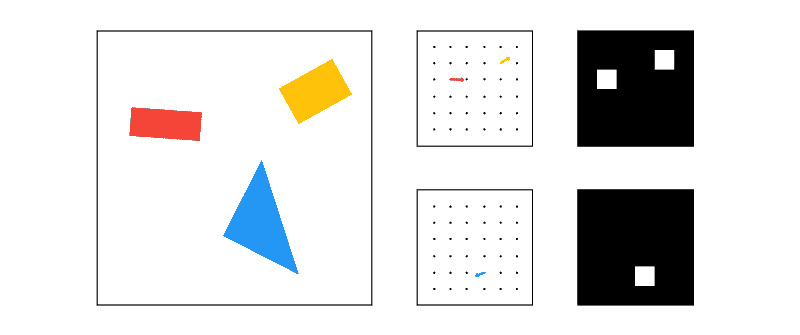

像传统的 2D 或三维向量，这个向量有一个角度和一个长度。长度描述概率，角度描述实例化参数。在上面的例子中，角度实际上与形状的角度相匹配，但通常情况并非如此。

实际上，像上面那样可视化向量是不可行的(或者至少不容易)，因为这些向量是 8 维的。

因为我们在一个胶囊中有所有这些额外的信息，所以我们应该能够从这些信息中重建图像。

听起来很棒，但我们如何哄网络真正想要学习这些东西？

当训练传统的 CNN 时，我们只关心模型是否预测正确的分类。有了胶囊网络，我们就有了所谓的“重建”重建采用我们创建的向量，并尝试在只给定该向量的情况下重建原始输入图像。然后，我们根据重建图像与原始图像的匹配程度对模型进行分级。

我将在接下来的章节中更详细地介绍这一点，但这里有一个简单的例子:

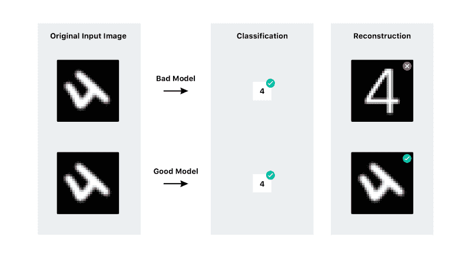

### 第 2b 部分:挤压

有了胶囊后，我们将对它执行另一个非线性函数(如 ReLU ),但这一次方程有点复杂。该函数缩放向量的值，以便只改变向量的长度，而不改变角度。这样我们可以得到 0 和 1 之间的向量，所以这是一个实际概率。


这是挤压后胶囊向量的**长度**的样子。在这一点上，几乎不可能猜测每个胶囊在寻找什么。

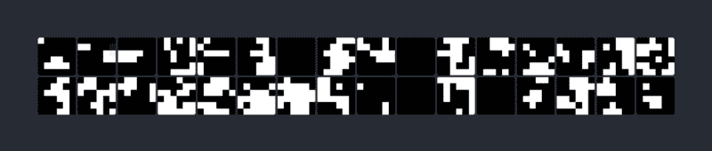

Keep in mind that each pixel is actually a vector of length 8

### 第 3 部分:协议路由

下一步是决定向下一级发送什么信息。在传统网络中，我们可能会做一些类似“最大池”的事情最大池是一种通过仅将区域中最高激活像素传递给下一层来减小大小的方法。

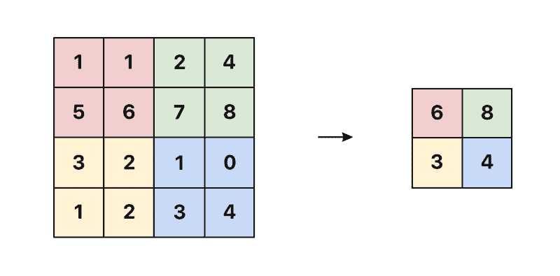

然而，对于胶囊网络，我们将做一些被称为协议路由的事情。最好的例子是 Aurélien Géron 在[这个精彩的视频](https://www.youtube.com/watch?v=pPN8d0E3900)中展示的船和房子的例子。每个胶囊试图基于自身预测下一层的激活:

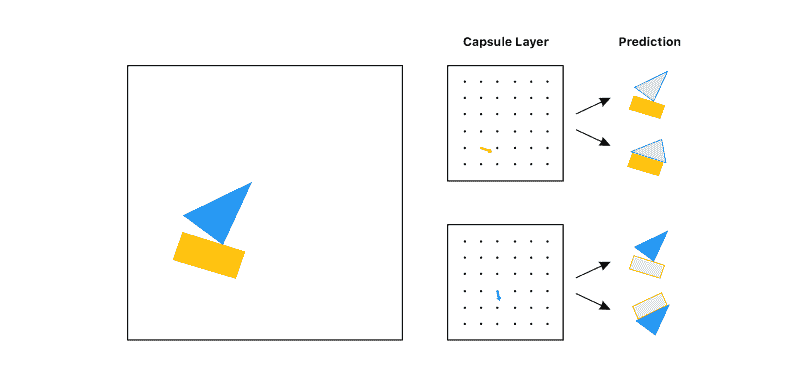

看看这些预测，你会选择哪个对象传递给下一层(不知道输入)？可能是船，对吧？矩形太空舱和三角形太空舱都同意船的样子。但是他们不同意房子的样子，所以这个物体不太可能是房子。

使用协议路由，我们只传递有用的信息，而丢弃只会给结果增加噪声的数据。这给了我们一个比像 max pooling 那样选择最大值更聪明的选择。

对于传统网络，错位的功能不会困扰它:


有了胶囊网络，各种功能就不一致了:

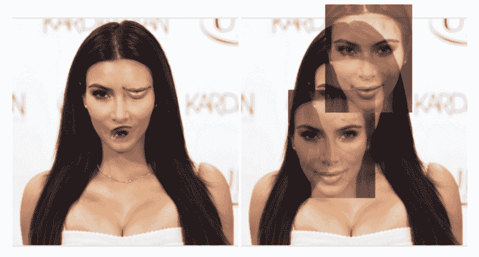

希望这能直观地起作用。然而，数学是如何工作的呢？

我们预测了 10 种不同的数字类别:

```
0, 1, 2, 3, 4, 5, 6, 7, 8, 9
```

**注意:**在船和房子的例子中，我们预测了 2 个对象，但现在我们预测了 10 个。

不像在船和房子的例子中，预测实际上不是图像。相反，我们试图预测描述图像的向量。

胶囊对每个类别的预测是通过将其向量乘以我们试图预测的每个类别的权重矩阵来实现的。

记住我们有 32 个胶囊层，每个胶囊层有 36 个胶囊。这意味着我们总共有 1152 个胶囊。

```
cap_1 * weight_for_0 = prediction
cap_1 * weight_for_1 = prediction
cap_1 * weight_for_2 = prediction
cap_1 * ...
cap_1 * weight_for_9 = prediction

cap_2 * weight_for_0 = prediction
cap_2 * weight_for_1 = prediction
cap_2 * weight_for_2 = prediction
cap_2 * ...
cap_2 * weight_for_9 = prediction

...

cap_1152 * weight_for_0 = prediction
cap_1152 * weight_for_1 = prediction
cap_1152 * weight_for_2 = prediction
cap_1152 * ...
cap_1152 * weight_for_9 = prediction
```

您将得到一个包含 11，520 个预测的列表。

每个权重实际上是一个 16×8 的矩阵，因此每个预测是胶囊向量和这个权重矩阵之间的矩阵乘法:


如你所见，我们的预测是一个 16 度的向量。

16 从何而来？这是一个任意的选择，就像 8 是我们最初的胶囊一样。

但应该注意的是，我们越深入网络，就越想增加胶囊的维度数量。这在直觉上应该是有意义的，因为我们越深入，我们的特征变得越复杂，我们需要更多的参数来重新创建它们。例如，你需要更多的信息来描述整张脸，而不仅仅是一只眼睛。

下一步是找出这 11520 个预测中哪一个彼此最一致。

当我们从高维向量的角度思考时，很难想象一个解决方案。为了清楚起见，让我们从假设我们的向量只是二维空间中的点开始:

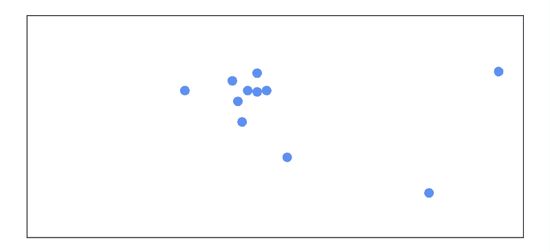

我们从计算所有点的平均值开始。每一点一开始都同等重要:


然后，我们可以从平均值测量每一点之间的距离。该点离平均值越远，该点就变得越不重要:


然后我们重新计算平均值，这一次考虑了该点的重要性:

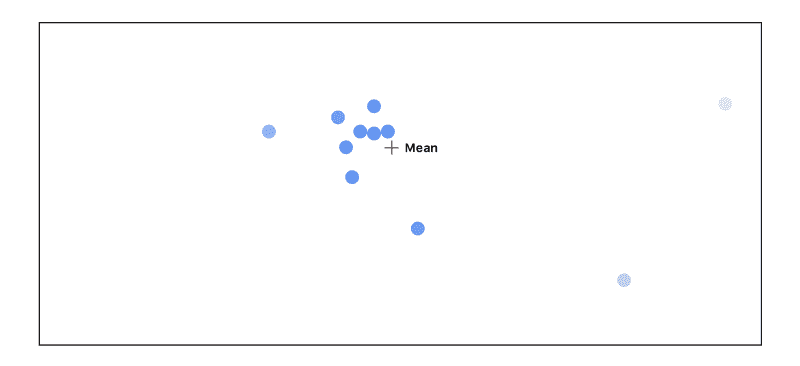

我们最终会经历三次这样的循环:

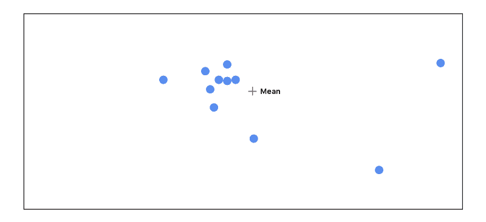

如你所见，当我们经历这个循环时，与他人不一致的点开始消失。最高同意点最终被传递到具有最高激活的下一层。

### 第 4 部分:DigitCaps

达成一致后，我们得到 10 个 16 维向量，每个向量代表一个数字。这个矩阵是我们的最终预测。向量的长度是被找到的数字的置信度，越长越好。该向量也可以用于生成输入图像的重建。

这是输入为 4 时向量的长度:


第五块最亮，表示置信度高。记住 0 是第一类，意味着 4 是我们预测的类。

### 第五部分:重建

实现的重建部分不是很有趣。它只是几个完全连接的层。但是重建本身非常酷，玩起来很有趣。

如果我们从它的向量中重建我们的 4 输入，这是我们得到的:

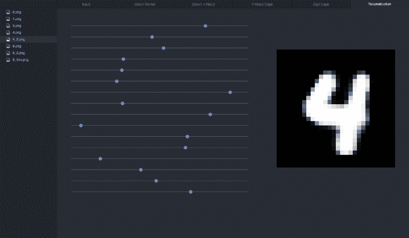

如果我们操作滑块(向量)，我们可以看到每个维度如何影响 4:

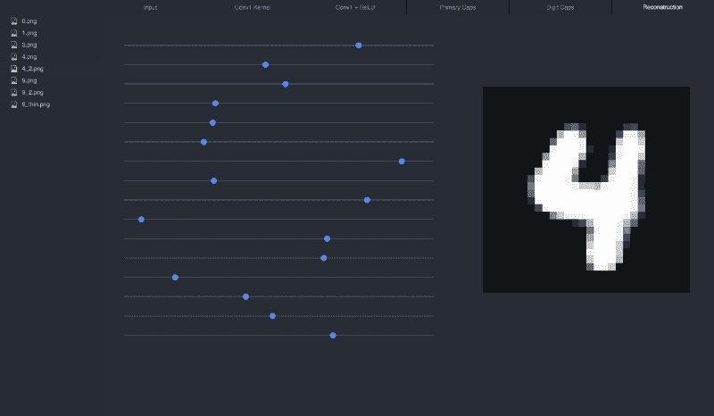

我建议克隆可视化 repo，使用不同的输入进行试验，并观察滑块如何影响重建:

```
git clone https://github.com/bourdakos1/CapsNet-Visualization.git
cd CapsNet-Visualization
pip install -r requirements.txt
```

运行工具:

```
python run_visualization.py
```

然后将浏览器指向: [http://localhost:5000](http://localhost:5000/)

### 最后的想法

我认为胶囊网络的重建是惊人的。尽管当前的模型只在简单的数字上训练过，但它让我的头脑充满了在更大的数据集上训练的成熟架构所能实现的可能性。

我非常好奇，想看看操纵一个更复杂的图像的重建向量会对它产生什么影响。出于这个原因，我的下一个项目是让胶囊网络与 CIFAR 和 smallNORB 数据集一起工作。

感谢阅读！如果您有任何问题，请随时联系 bourdakos1@gmail.com，通过 [LinkedIn](https://www.linkedin.com/in/nicholasbourdakos) 与我联系，或者通过 [Medium](https://medium.com/@bourdakos1) 和 [Twitter](https://twitter.com/bourdakos1) 关注我。

如果你觉得这篇文章很有帮助，给它点掌声会很有意义？并分享出来帮别人找！并欢迎在下方发表评论。