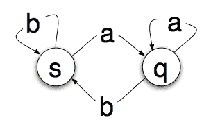
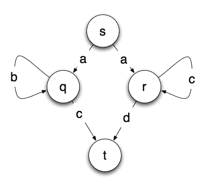
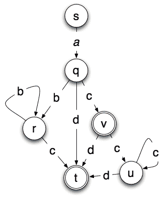

# 了解状态机

> 原文：<https://www.freecodecamp.org/news/state-machines-basics-of-computer-science-d42855debc66/>

马克·谢德

# 了解状态机

#### 计算机科学概念介绍

计算机科学使我们能够编程，但在不理解底层计算机科学概念的情况下进行大量编程是可能的。

这并不总是一件坏事。当我们编程时，我们在更高的抽象层次上工作。

当我们开车时，我们只关心两三个踏板、一个变速排挡和一个方向盘。你可以安全地驾驶一辆汽车，而不必清楚它是如何工作的。

然而，如果你想在极限状态下驾驶一辆汽车，你需要了解的不仅仅是三个踏板、变速排挡和方向盘。

编程也是如此。很多日常工作可以在对计算机科学了解很少或没有了解的情况下完成。你不需要理解计算理论来用 PHP 建立一个“联系我们”的表单。

然而，如果您计划编写需要大量计算的代码，您将需要更多地了解计算是如何工作的。

本文的目的是为计算提供一些基本的背景知识。如果有兴趣，我可能会跟进一些更高级的主题，但现在我想看看最简单的抽象计算设备之一背后的逻辑——一个**有限状态机**。

### 有限状态机

有限状态机是用于设计算法的数学抽象。

简单来说，状态机将读取一系列输入。当它读取输入时，它将切换到不同的状态。对于给定的输入，每个状态指定要切换到哪个状态。这听起来很复杂，但实际上很简单。

想象一下，一个设备可以读取一张很长的纸。每一英寸的纸上都印着一个字母——要么是字母“a ”,要么是字母“b”。


A paper tape, with eight letters printed on it

当状态机读取每个字母时，它会改变状态。这是一个非常简单的状态机:



圆圈表示机器可能处于的状态。箭头是**转换**。因此，如果你处于状态 *s* 并读出一个‘a’，你将转换到状态 *q* 。如果你读一个‘b’，你将停留在状态 *s* 。

因此，如果我们从 *s* 开始，从左到右阅读上面的纸带，我们将读到‘a’并转到状态 *q* 。

然后，我们将读取“b”并返回到状态 *s* 。

另一个“b”将使我们保持在*的*状态，后面跟着一个“a”——这将我们移回到 *q* 状态。很简单，但是有什么意义呢？

事实证明，你可以在状态机中运行一段磁带，通过检查你最终所处的状态，告诉我们一些关于字母序列的事情。

在我们上面的简单状态机中，如果我们以状态 *s* 结束，那么磁带必须以字母‘b’结束。如果我们以状态 *q* 结束，磁带以字母‘a’结束。

这听起来可能毫无意义，但是有很多问题可以用这种方法解决。一个非常简单的例子是确定一个 HTML 页面是否按顺序包含这些标签:

```
<html>   <head> </head>   <body> </body> </html>
```

状态机可以移动到显示它已经读取 html 标签的状态，循环直到它到达 head 标签，循环直到它到达 head close 标签，等等。

如果它成功地进入最终状态，那么这些特定的标签就有了正确的顺序。

有限状态机也可以用来表示许多其他系统——例如停车计时器、pop 机、自动气泵和其他各种各样的东西。

### 确定性有限状态机

到目前为止，我们看到的状态机都是**确定性的**状态机。从任何状态，对于任何允许的输入，只有一个*转换。换句话说，当你读字母“a”时，不可能有两条路径从一个状态引出。起初，做出这种区分听起来很傻。*

如果相同的输入可以导致转移到多个状态，那么一组决策有什么用呢？你不能告诉一台计算机，`if x == true`然后执行`doSomethingBig`或者执行`doSomethingSmall`，对吧？

嗯，你可以用状态机来实现。

状态机的输出是它的最终状态。它经历所有的处理，然后读取最终状态，然后**然后**采取行动。当状态机从一个状态移动到另一个状态时，它不做**任何事情。**

它进行处理，当处理结束时，状态被读取，外部的东西触发期望的动作(例如，分发汽水罐)。当涉及到**非确定性**有限状态机时，这是一个重要的概念。

### 非确定性有限状态机

非确定性有限状态机是有限状态机，其中来自特定状态的给定输入可以导致**多于一个**不同的状态。

例如，假设我们想要构建一个有限状态机，它可以识别字母字符串:

*   从字母“a”开始
*   然后后面跟着零个或更多个字母“b”
*   或者，字母“c”的零次或多次出现
*   由字母表中的下一个字母终止。

有效字符串包括:

*   abbbbbbbbbc
*   abbbc
*   acccd
*   acccccc
*   AC(b 的零出现)
*   ad(c 的零出现)

因此，它将识别字母“a ”,后面跟着零个或多个相同的字母“b”或“c ”,后面跟着字母表中的下一个字母。

表示这一点的一个非常简单的方法是使用如下所示的状态机，其中一个最终状态 *t* 意味着字符串被接受并与模式匹配。



Pattern matching finite state machine

你看出问题了吗？从起点 *s* ，我们不知道该走哪条路。如果我们读字母‘a’，我们不知道是去状态 *q* 还是 *r.*

有几种方法可以解决这个问题。一种是回溯。你只需选择所有可能的路径，忽略或退出那些你陷入困境的路径。

这基本上是大多数下棋电脑的工作方式。他们着眼于所有的可能性——以及这些可能性中的所有可能性——并选择能给他们带来比对手更多优势的道路。

另一种选择是将非确定性机器转换成确定性机器。

非确定性机器的一个有趣的属性是，存在一种将任何非确定性机器转变为确定性机器的算法。然而，它通常要复杂得多。

幸运的是，上面的例子只是稍微复杂一点。事实上，这个很简单，我们可以在大脑中将其转换为确定性的机器，而无需正式算法的帮助。

下面的机器是上面的非确定性机器的确定性版本。在下面的机器中，机器接受的任何字符串都会达到最终状态 *t* 或 *v* 。



A deterministic finite state machine

非确定性模型有四个状态和六个转换。确定性模型具有六个状态、十个转变和两个可能的最终状态。

这没有那么多，但复杂性通常呈指数增长。中等大小的非确定性机器可以产生绝对*巨大的*确定性机器。

### 正则表达式

如果你做过任何类型的编程，你可能会遇到正则表达式。正则表达式和有限状态机在功能上是等价的。任何可以用正则表达式接受或匹配的东西，都可以用状态机接受或匹配。

例如，上面描述的模式可以与正则表达式匹配:`a(b*c|c*d)`

正则表达式和有限状态机也有同样的限制。特别是，它们都只能匹配或接受有限内存可以处理的模式。

那么他们不能匹配什么类型的模式呢？假设您只想匹配字符串“a”和“b ”,其中有许多“a ”,后面跟有相同数量的“b”。或者说*n*a 后跟*n*b，其中 *n* 是某个数字。

例如:

*   腹肌
*   aabb
*   aaaaaabbbbbb
*   aaaaaaaaaaaaaaaaaaaaaaaaaabbbbbbbbbbbbbbbbbbbbbbbbbb

起初，对于有限状态机来说，这看起来很容易。问题是你将很快耗尽状态，或者你将不得不假设无限数量的状态——此时它不再是一个*有限*状态机。

假设您创建了一个有限状态机，它最多可以接受 20 个“a”后跟 20 个“b”。这很好，直到你得到一串 21 'a 后跟 21 ' b 's 这时你需要重写你的机器来处理一个更长的字符串。

对于你能识别的任何字符串，有一个稍微长一点的字符串你的机器不能识别，因为它耗尽了内存。

这就是所谓的**泵引理**，它基本上是说:“如果你的模式有一个可以重复的部分(就像上面的那个)，那么这个模式就是不规则的”。

换句话说，无论是正则表达式还是有限状态机都无法识别所有与模式匹配的字符串。

如果你仔细观察，你会注意到这种模式，其中每个“a”都有一个匹配的“b ”,看起来非常类似于 HTML。在任何一对标签中，您可能有任意数量的其他匹配标签对。

因此，虽然您可以使用正则表达式或有限状态机来识别 HTML 页面是否具有`<ht`ml`>,` h`ead>`；和<主体>元素的正确顺序，你不能用一个正则表达式来判断整个 HTML 页面是否有效——因为 HTML 不是一个正则模式。

### 图灵机

那么如何识别**非规则模式**？

有一种类似于状态机的理论设备，叫做图灵机。它类似于有限状态机，因为它有一个可以读取的纸条。但是，图灵机可以在纸带上擦除和写入。

解释图灵机将占用我们这里更多的空间，但有几个要点与我们对有限状态机和正则表达式的讨论相关。

图灵机**在计算上是完全的**——意思是任何可以计算的东西，都可以在图灵机上计算。

由于图灵机可以读写纸带，所以它不局限于有限的状态。纸带可以假定为无限长。当然，实际的计算机没有无限的内存。但是，它们通常包含足够的内存，所以它们处理的问题类型不会达到极限。

图灵机给了我们一个想象中的机械装置，让我们可视化并理解计算过程是如何工作的。这对理解计算的极限特别有用。如果有兴趣的话，我会在未来写另一篇关于图灵机的文章。

### 为什么这很重要？

那么，有什么意义呢？这对您创建下一个 PHP 表单有什么帮助？

不管它们的局限性如何，状态机是计算的一个非常核心的概念。尤其重要的是，对于您可以设计的任何非确定性状态机，都有一个确定性状态机做同样的事情。

这是一个关键点，因为这意味着你可以用最容易想到的方式来设计你的算法。一旦你有了一个有效的算法，你就可以把它转换成任何最有效的形式。

有限状态机和正则表达式在功能上是等价的，这种理解为正则表达式引擎开辟了一些非常有趣的用途——特别是在创建无需重新编译系统就可以更改的业务规则时。

计算机科学的基础允许你拿一个你不知道如何解决的问题进行推理:“我不知道如何解决 X，但我知道如何解决 Y。我知道如何将 Y 的解决方案转换为 X 的解决方案。因此，我现在知道如何解决 X。”

如果你喜欢这篇文章，你可能会喜欢我的 [YouTube 频道](https://www.youtube.com/markshead),在那里我偶尔会制作一些关于软件开发的视频或漫画。我还有一个[邮件列表](http://eepurl.com/uPj05)，给那些希望在我创作新作品时偶尔收到邮件的人。

最初发表于 2018 年 2 月 11 日[blog.markshead.com](https://blog.markshead.com/869/state-machines-computer-science/)。