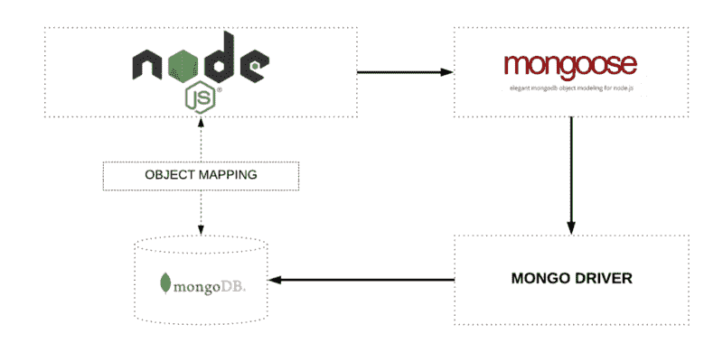
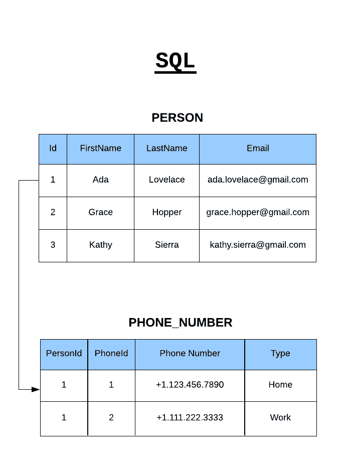
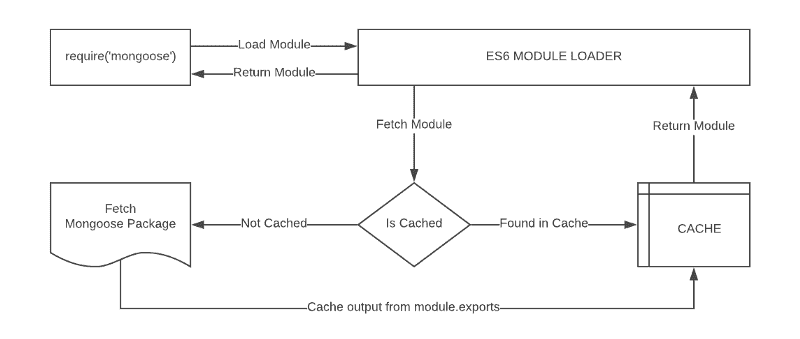
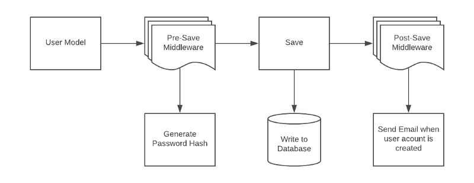

# Mongoose for MongoDB 简介

> 原文：<https://www.freecodecamp.org/news/introduction-to-mongoose-for-mongodb-d2a7aa593c57/>

尼克·卡尼克

# Mongoose for MongoDB 简介


Mongoose 是 MongoDB 和 Node.js 的对象数据建模(ODM)库，它管理数据之间的关系，提供模式验证，并用于在代码中的对象和 MongoDB 中这些对象的表示之间进行翻译。



Object Mapping between Node and MongoDB managed via Mongoose

MongoDB 是一个无模式的 NoSQL 文档数据库。这意味着您可以在其中存储 JSON 文档，并且这些文档的结构可以变化，因为它不像 SQL 数据库那样强制执行。这是使用 NoSQL 的优势之一，因为它加快了应用程序开发并降低了部署的复杂性。

下面是 Mongo 与 SQL 数据库中数据存储方式的对比示例:



NoSQL Documents vs. Relational Tables in SQL

### 术语

#### 收集

Mongo 中的“集合”相当于关系数据库中的表。它们可以保存多个 JSON 文档。

#### 文档

“文档”相当于 SQL 中的记录或数据行。虽然一个 SQL 行可以引用其他表中的数据，但 Mongo 文档通常将这些数据合并到一个文档中。

#### 菲尔茨

字段或属性类似于 SQL 表中的列。

#### (计划或理论的)纲要

虽然 Mongo 是无模式的，但是 SQL 通过表定义来定义模式。Mongoose 的“模式”是一个文档数据结构(或文档的形状),它是通过应用层实现的。

#### 模型

“模型”是高阶构造函数，它采用模式并创建一个文档实例，相当于关系数据库中的记录。

### 入门指南

#### Mongo 装置

在我们开始之前，让我们设置一下 Mongo。您可以从以下选项中选择**(本文中我们使用选项#1):**

1.  从 [MongoDB 网站](https://www.mongodb.com/download-center#community)下载适用于您的操作系统的 MongoDB 版本，并遵循其安装说明
2.  [在 mLab 上创建免费沙盒数据库](http://docs.mlab.com/)订阅
3.  如果您喜欢使用 Docker，请使用 Docker 安装 Mongo

让我们通过实现一个表示简化地址簿数据的模型来浏览一下 Mongoose 的一些基础知识。

我使用的是 Visual Studio 代码、Node 8.9 和 NPM 5.6。启动您最喜欢的 IDE，创建一个空白项目，让我们开始吧！我们将在 Node 中使用有限的 ES6 语法，所以我们不会配置 Babel。

#### NPM 安装

让我们转到项目文件夹并初始化我们的项目

```
npm init -y
```

让我们用下面的命令安装 Mongoose 和一个验证库:

```
npm install mongoose validator
```

上面的 install 命令将安装最新版本的库。本文中的 mongose 语法特定于 Mongoose v5 及更高版本。

#### 数据库连接

在项目根目录下创建一个文件`./src/database.js` 。

接下来，我们将添加一个简单的类，其中包含一个连接到数据库的方法。

您的连接字符串将根据您的安装而有所不同。

```
let mongoose = require('mongoose');

const server = '127.0.0.1:27017'; // REPLACE WITH YOUR DB SERVER
const database = 'fcc-Mail';      // REPLACE WITH YOUR DB NAME

class Database {
  constructor() {
    this._connect()
  }

_connect() {
     mongoose.connect(`mongodb://${server}/${database}`)
       .then(() => {
         console.log('Database connection successful')
       })
       .catch(err => {
         console.error('Database connection error')
       })
  }
}

module.exports = new Database()
```

上面的`require(‘mongoose’)` 调用返回一个 Singleton 对象。这意味着您第一次调用`require(‘mongoose’)`时，它正在创建一个 Mongoose 类的实例并返回它。由于 ES6 中模块导入/导出的工作方式，在后续调用中，它将返回与第一次创建并返回给您的实例相同的实例。



Module import/require work-flow

类似地，我们通过在`module.exports`语句中返回类的一个实例，将我们的数据库类变成了单例类，因为我们只需要一个到数据库的连接。

由于模块加载器通过缓存先前导入的文件的响应来工作，ES6 使得我们可以非常容易地创建单例(单实例)模式。

### 猫鼬模式与模型

mongose 模型是 mongose 模式的包装器。Mongoose 模式定义了文档的结构、默认值、验证器等。，而 Mongoose 模型提供了一个到数据库的接口，用于创建、查询、更新、删除记录等。

创建一个猫鼬模型主要包括三个部分:

#### **1。参考猫鼬**

```
let mongoose = require('mongoose')
```

该引用将与我们连接到数据库时返回的引用相同，这意味着模式和模型定义不需要显式连接到数据库。

#### 2.定义模式

架构通过对象定义文档属性，其中键名称对应于集合中的属性名称。

```
let emailSchema = new mongoose.Schema({
  email: String
})
```

这里我们定义了一个名为 **email** 的属性，它带有一个模式类型**字符串**，该字符串映射到一个内部验证器，当模型保存到数据库时，该验证器将被触发。如果值的数据类型不是字符串类型，它将失败。

允许以下模式类型:

*   排列
*   布尔代数学体系的
*   缓冲器
*   日期
*   混合(通用/灵活的数据类型)
*   数字
*   ObjectId
*   线

Mixed 和 ObjectId 在`require(‘mongoose’).Schema.Types`下定义。

#### **3。导出模型**

我们需要调用 Mongoose 实例上的模型构造函数，并向它传递集合的名称和对模式定义的引用。

```
module.exports = mongoose.model('Email', emailSchema)
```

让我们将上面的代码组合成`./src/models/email.js` 来定义一个基本邮件模型的内容:

```
let mongoose = require('mongoose')

let emailSchema = new mongoose.Schema({
  email: String
})

module.exports = mongoose.model('Email', emailSchema)
```

模式定义应该是简单的，但是它的复杂性通常基于应用程序的需求。模式可以重用，也可以包含几个子模式。在上面的例子中，email 属性的值是一个简单的值类型。但是，它也可以是具有附加属性的对象类型。

我们可以创建上面定义的模型的实例，并使用以下语法填充它:

```
let EmailModel = require('./email')

let msg = new EmailModel({
  email: 'ada.lovelace@gmail.com'
})
```

让我们增强 email 模式，使 Email 属性成为惟一的必填字段，并在保存之前将值转换为小写。我们还可以添加一个验证函数，确保该值是一个有效的电子邮件地址。我们将引用和使用之前安装的验证器库。

```
let mongoose = require('mongoose')
let validator = require('validator')

let emailSchema = new mongoose.Schema({
  email: {
    type: String,
    required: true,
    unique: true,
    lowercase: true,
    validate: (value) => {
      return validator.isEmail(value)
    }
  }
})

module.exports = mongoose.model('Email', emailSchema)
```

### 基本操作

Mongoose 有一个灵活的 API，并提供了许多方法来完成一项任务。我们不会关注变化，因为这超出了本文的范围，但是请记住，大多数操作都可以通过多种方式完成，无论是从语法上还是通过应用程序架构。

#### 创建记录

让我们创建一个电子邮件模型的实例，并将其保存到数据库中:

```
let EmailModel = require('./email')

let msg = new EmailModel({
  email: 'ADA.LOVELACE@GMAIL.COM'
})

msg.save()
   .then(doc => {
     console.log(doc)
   })
   .catch(err => {
     console.error(err)
   })
```

结果是在成功保存时返回一个文档:

```
{ 
  _id: 5a78fe3e2f44ba8f85a2409a,
  email: 'ada.lovelace@gmail.com',
  __v: 0 
}
```

返回以下字段(内部字段以下划线为前缀):

1.  `_id`字段由 Mongo 自动生成，是集合的主键。它的值是文档的唯一标识符。
2.  返回`email`字段的值。注意，它是小写的，因为我们在模式中指定了`lowercase:true`属性。
3.  `__v`是 Mongoose 第一次创建文档时在每个文档上设置的 versionKey 属性。它的值包含文档的内部修订。

如果您尝试重复上面的保存操作，您将会得到一个错误，因为我们已经指定电子邮件字段应该是唯一的。

#### 获取记录

让我们尝试检索之前保存到数据库中的记录。模型类公开了几个静态和实例方法来对数据库执行操作。现在，我们将尝试使用 find 方法查找之前创建的记录，并将电子邮件作为搜索词传递。

```
EmailModel
  .find({
    email: 'ada.lovelace@gmail.com'   // search query
  })
  .then(doc => {
    console.log(doc)
  })
  .catch(err => {
    console.error(err)
  })
```

返回的文档将类似于我们创建记录时显示的内容:

```
{ 
  _id: 5a78fe3e2f44ba8f85a2409a,
  email: 'ada.lovelace@gmail.com',
  __v: 0 
}
```

#### 更新记录

让我们通过更改电子邮件地址并向其添加另一个字段来修改上面的记录，所有这些都在一个操作中完成。出于性能原因，Mongoose 不会返回更新的文档，所以我们需要传递一个额外的参数来请求它:

```
EmailModel
  .findOneAndUpdate(
    {
      email: 'ada.lovelace@gmail.com'  // search query
    }, 
    {
      email: 'theoutlander@live.com'   // field:values to update
    },
    {
      new: true,                       // return updated doc
      runValidators: true              // validate before update
    })
  .then(doc => {
    console.log(doc)
  })
  .catch(err => {
    console.error(err)
  })
```

返回的文档将包含更新的电子邮件:

```
{ 
  _id: 5a78fe3e2f44ba8f85a2409a,
  email: 'theoutlander@live.com',
  __v: 0 
}
```

#### 删除记录

我们将使用`findOneAndRemove`调用来删除一个记录。它返回被删除的原始文档:

```
EmailModel
  .findOneAndRemove({
    email: 'theoutlander@live.com'
  })
  .then(response => {
    console.log(response)
  })
  .catch(err => {
    console.error(err)
  })
```

### 助手

我们已经了解了一些基本功能，如 CRUD(创建、读取、更新、删除)操作，但是 Mongoose 还提供了配置多种类型的助手方法和属性的能力。这些可用于进一步简化数据处理。

让我们用字段`firstName`和`lastName`在`./src/models/user.js`中创建一个用户模式:

```
let mongoose = require('mongoose')

let userSchema = new mongoose.Schema({
  firstName: String,
  lastName: String
})

module.exports = mongoose.model('User', userSchema)
```

#### 虚拟财产

虚拟属性不会持久保存到数据库中。我们可以将它添加到我们的模式中，作为获取和设置值的助手。

让我们创建一个名为`fullName`的虚拟属性，它可以用来设置`firstName`和`lastName`的值，并在读取时以组合值的形式检索它们:

```
userSchema.virtual('fullName').get(function() {
  return this.firstName + ' ' + this.lastName
})

userSchema.virtual('fullName').set(function(name) {
  let str = name.split(' ')

  this.firstName = str[0]
  this.lastName = str[1]
})
```

get 和 set 的回调必须使用 function 关键字，因为我们需要通过`this` 关键字访问模型。使用粗箭头功能将改变`this`所指的内容。

现在，我们可以通过给`fullName`赋值来设置`firstName`和`lastName`:

```
let model = new UserModel()

model.fullName = 'Thomas Anderson'

console.log(model.toJSON())  // Output model fields as JSON
console.log()
console.log(model.fullName)  // Output the full name
```

上面的代码将输出以下内容:

```
{ _id: 5a7a4248550ebb9fafd898cf,
  firstName: 'Thomas',
  lastName: 'Anderson' }

Thomas Anderson
```

#### 实例方法

我们可以在模式上创建定制的助手方法，并通过模型实例访问它们。这些方法可以访问模型对象，并且可以非常有创造性地使用它们。例如，我们可以创建一个方法来查找与当前实例同名的所有人。

在这个例子中，让我们创建一个函数来返回当前用户的姓名首字母。让我们向模式中添加一个名为`getInitials`的自定义助手方法:

```
userSchema.methods.getInitials = function() {
  return this.firstName[0] + this.lastName[0]
}
```

该方法可通过模型实例访问:

```
let model = new UserModel({
  firstName: 'Thomas',
  lastName: 'Anderson'
})

let initials = model.getInitials()

console.log(initials) // This will output: TA
```

#### 静态方法

类似于实例方法，我们可以在模式上创建静态方法。让我们创建一个方法来检索数据库中的所有用户:

```
userSchema.statics.getUsers = function() {
  return new Promise((resolve, reject) => {
    this.find((err, docs) => {
      if(err) {
        console.error(err)
        return reject(err)
      }

      resolve(docs)
    })
  })
}
```

在模型类上调用`getUsers`将返回数据库中的所有用户:

```
UserModel.getUsers()
  .then(docs => {
    console.log(docs)
  })
  .catch(err => {
    console.error(err)
  })
```

添加实例和静态方法是在集合和记录上实现数据库交互接口的好方法。

#### **中间件**

中间件是在管道的特定阶段运行的功能。Mongoose 支持以下操作的中间件:

*   总计
*   文件
*   模型
*   询问

例如，模型有带两个参数的`pre`和`post`函数:

1.  事件的类型(“初始化”、“验证”、“保存”、“删除”)
2.  使用引用模型实例的 **this** 执行回调



Example of Middleware (a.k.a. pre and post hooks)

让我们通过向我们的模式添加两个名为`createdAt`和`updatedAt`的字段来尝试一个例子:

```
let mongoose = require('mongoose')

let userSchema = new mongoose.Schema({
  firstName: String,
  lastName: String,
  createdAt: Date,
  updatedAt: Date
})

module.exports = mongoose.model('User', userSchema)
```

当`model.save()`被调用时，有一个`pre(‘save’, …)`和`post(‘save’, …)`事件被触发。对于第二个参数，您可以传递一个在事件被触发时调用的函数。这些函数将参数传递给中间件链中的下一个函数。

让我们添加一个预保存挂钩，并为`createdAt`和`updatedAt`设置值:

```
userSchema.pre('save', function (next) {
  let now = Date.now()

  this.updatedAt = now
  // Set a value for createdAt only if it is null
  if (!this.createdAt) {
    this.createdAt = now
  }

  // Call the next function in the pre-save chain
  next()    
})
```

让我们创建并保存我们的模型:

```
let UserModel = require('./user')

let model = new UserModel({
  fullName: 'Thomas Anderson'
}

msg.save()
   .then(doc => {
     console.log(doc)
   })
   .catch(err => {
     console.error(err)
   })
```

当打印所创建的记录时，您应该会看到`createdAt`和`updatedAt`的值:

```
{ _id: 5a7bbbeebc3b49cb919da675,
  firstName: 'Thomas',
  lastName: 'Anderson',
  updatedAt: 2018-02-08T02:54:38.888Z,
  createdAt: 2018-02-08T02:54:38.888Z,
  __v: 0 }
```

#### 插件

假设我们希望跟踪数据库中每个集合的记录的创建和最后更新时间。我们可以创建一个插件并将其应用到每个模式，而不是重复上述过程。

让我们创建一个文件`./src/model/plugins/timestamp.js`并将上述功能复制为一个可重用模块:

```
module.exports = function timestamp(schema) {

  // Add the two fields to the schema
  schema.add({ 
    createdAt: Date,
    updatedAt: Date
  })

  // Create a pre-save hook
  schema.pre('save', function (next) {
    let now = Date.now()

    this.updatedAt = now
    // Set a value for createdAt only if it is null
    if (!this.createdAt) {
      this.createdAt = now
    }
   // Call the next function in the pre-save chain
   next()    
  })
}
```

要使用这个插件，我们只需将它传递给应该被赋予这个功能的模式:

```
let timestampPlugin = require('./plugins/timestamp')

emailSchema.plugin(timestampPlugin)
userSchema.plugin(timestampPlugin)
```

### 查询构建

Mongoose 有一个非常丰富的 API，可以处理 MongoDB 支持的许多复杂操作。考虑一个查询，其中我们可以增量地构建查询组件。

在本例中，我们将:

1.  查找所有用户
2.  跳过前 100 条记录
3.  将结果限制为 10 条记录
4.  按名字字段对结果进行排序
5.  选择名字
6.  执行该查询

```
UserModel.find()                   // find all users
         .skip(100)                // skip the first 100 items
         .limit(10)                // limit to 10 items
         .sort({firstName: 1}      // sort ascending by firstName
         .select({firstName: true} // select firstName only
         .exec()                   // execute the query
         .then(docs => {
            console.log(docs)
          })
         .catch(err => {
            console.error(err)
          })
```

### 关闭

我们仅仅触及了 Mongoose 的一些功能。它是一个丰富的库，充满了有用和强大的特性，使在应用层使用数据模型成为一种乐趣。

虽然您可以使用 Mongo Driver 直接与 Mongo 交互，但 Mongoose 将通过允许您对数据之间的关系进行建模并轻松验证它们来简化这种交互。

**趣闻:** [**猫鼬**](http://mongoosejs.com) 是由 [**瓦列里·卡尔波夫**](https://www.freecodecamp.org/news/introduction-to-mongoose-for-mongodb-d2a7aa593c57/undefined) 这位才华横溢的工程师创造的！他创造了术语 [**意思是堆栈**](http://thecodebarbarian.com/2013/04/29//easy-web-prototyping-with-mongodb-and-nodejs) 。

#### 如果这篇文章是有帮助的？？？在推特上关注我。


[You may also like my workshop on youtube:](https://twitter.com/intent/follow?screen_name=theoutlander) [How to Build a REST API with Node | Express | Mongo](https://youtu.be/egeHq-lYyxo)