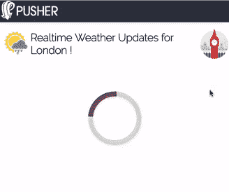

# 如何使用 JavaScript 和 Pusher 构建实时图形

> 原文：<https://www.freecodecamp.org/news/how-to-build-a-real-time-graph-using-javascript-pusher-d15ccb7a4b82/>

作者拉哈特·卡纳

# 如何使用 JavaScript 和 Pusher 构建实时图形


这个世界现在需要一切超快的东西。不同的系统每天都会产生大量的数据流。他们为许多行业的决策服务。如今，实时监控和分析变得非常重要。数据流包括网站流量、服务器性能、天气更新和 IOT 传感器的实时监控。分析和解释这些数据非常重要，而交互式图表是一个很好的解决方案。

在本文中，我们将构建一个 Node.js 服务器来公开 API，为一个指标(在本例中是伦敦的天气)提供历史数据。它还将提供一个 API 来接收新的数据点。我们还将建立一个前端应用程序，用折线图实时显示伦敦天气的温度变化。我们构建的应用程序将如下所示:


### 推广员注册

开始本教程的第一步是[在 Pusher](https://pusher.com/signup) 注册，或者如果你已经有一个帐户，用你现有的凭证登录。登录后，您需要创建一个新的应用程序，并为前端选择 Vanilla JavaScript，为后端选择 Node.js。然后，您将进入一个登录页面，其中包含前端和后端的“入门”代码，我们将在本教程的后面使用这些代码。

### 用于监控和分析系统的 Node.js 服务器 API

任何指标或实体的任何分析系统的基本 API 包括:

1.  摄取 API —为任何特定实体摄取新数据点的 API。在这篇博文的服务器中，我们将制作一个 API 来接收伦敦特定时间的新温度数据。这个 API 可以被任何全球天气系统或任何 IOT 传感器调用。
2.  历史数据 API —该 API 将返回从该日期开始的一个时间范围内的所有数据。对于我们的服务器，我们将创建一个简单的 API。它将返回一些静态历史数据，其中包含伦敦任一天的气温值的有限数据点。

### Node.js Express 服务器框架

我们将创建一个基本的 Express 服务器，并实例化 Pusher 库服务器实例。我们将为我们的项目创建一个新文件夹，并创建一个新文件 **server.js** 。将以下代码添加到该文件中:

#### **获取历史温度数据的 API**

现在，我们将添加一些关于伦敦一天中特定时间的温度的静态数据，并将其存储在任何 JavaScript 变量中。我们还将公开一个路由，以便每当有人使用 GET HTTP 调用来调用它时返回该数据。

#### **API 摄取温度数据点**

现在，我们将添加公开 API 的代码，以便在特定时间接收温度。我们将公开一个以温度和时间作为查询参数的 GET HTTP API。我们将验证它们不是空参数。我们通过推入静态 JavaScript 变量 **londonTempData** 的**数据点**数组来存储它们。请将以下代码添加到 **server.js** 文件中

在上面的代码中，除了存储在数据源中，我们还将在一个新的通道**‘伦敦温度图表’**上触发一个事件**‘新温度’**。对于每个唯一的数据源或图表，您可以创建一个新的通道。

由我们的服务器触发的事件将由前端处理，以实时更新图表/图形。事件可以包含图表正确显示数据点所需的所有重要数据。在我们的例子中，我们将把新时间的温度发送到我们的前端。

### 使用普通 JavaScript 和 Chart.js 构建前端应用程序

现在，我们将构建前端应用程序。它将显示一个折线图，代表伦敦市一天中不同时间的温度变化。显示实时图表的主要方法是:

1.  我们必须进行一次初始 Ajax 调用来获取历史数据，并用现有数据呈现图形。
2.  我们将订阅存储在特定通道上的新数据点的任何事件。

### 基本 HTML 模板

我们将在我们的项目根目录中创建一个名为 **public** 的新文件夹，然后在这个文件夹中创建一个新文件【index.html**。该文件将包含基本的 HTML 代码，以呈现一个简单的标题和一个带有应用程序名称的子标题以及几个图标。我们还将从其 CDN URL 导入 **Pusher JavaScript** 库。**

### **添加图表库**

**在 JavaScript 和 HTML 应用程序中，我们必须使用 SVG 或 Canvas 来构建图形组件来表示数学图形。有许多开源库可以帮助您呈现不同的图表类型。这些图表包括条形图、饼图、折线图和散点图。**

**对于我们的项目，我们将选择 [Chart.js](http://www.chartjs.org/) ,因为它有相当简单的 API，并使用 Canvas HTML 标签呈现健壮的图表。您可以选择任何图表库，但请记住，该库应该能够更新图表，而无需完全重新呈现它。Chart.js 在任何实例化的图表上提供一个方法来更新它。**

**将以下代码添加到 index.html 文件的适当位置**

### **添加 JavaScript 文件并实例化 Pusher 客户端库**

**现在，我们将在我们的公共文件夹中创建一个新文件 **app.js** ，并添加以下代码来实例化 Pusher 客户端库。**

**在上面的代码中，我们还添加了一些实用方法来进行 Ajax 调用，并显示或隐藏 DOM API 中的元素。**

### **添加代码以获取历史数据**

**现在，我们将添加代码来获取历史温度数据，以显示带有初始值的图表。我们还将使用特定的配置实例化一个新的图表对象，以呈现折线图。您可以在 [Chart.js 文档](http://www.chartjs.org/docs/)中阅读更多关于如何构建这些配置的信息。**

**请将以下代码添加到 app.js 文件中:**

**在上面的代码中，我们添加了一个名为 **renderWeatherChart 的函数。**这将用于使用最新数据呈现图表，该数据嵌入在关键字**数据集**下的 **chartConfig** 变量中。如果我们想在同一个画布上绘制多个折线图，我们可以向这个数组添加更多的元素。**

**数组中每个元素的**数据**键将显示图形上的不同点。我们将向 **/getTemperature** api 发出一个 ajax 请求，获取所有的数据点，并将它们放入这个键中。我们将调用 rendering 方法来显示图形。现在我们可以运行命令`node server.js`，然后使用下面的 URL 进入浏览器，查看使用数据呈现的初始图表。**

```
`http://localhost:9000/`
```

**为了正确设置我们的应用程序的样式，请将以下 CSS 添加到 public 文件夹中的新 style.css 文件中。将以下代码添加到该文件中:**

### **接收到新事件时更新图形的代码**

**现在，我们希望订阅我们的服务器将在其上发送该图的更新事件的唯一通道。在我们的项目中，频道被命名为**伦敦气温图表**，事件被命名为**新气温**。请添加以下代码来处理事件，然后实时更新图表:**

**为了看到这段代码的运行，您必须刷新浏览器，您将看到初始图表。现在我们必须接收一个新的数据点。您需要通过使用一些模拟 API 调用工具或者在浏览器中使用以下具有不同值的 URL 来调用以下 API。**

```
`http://localhost:9000/addTemperature?temperature=17&time=1500`
```

**为了测试您的图表更新代码，您可以在您的 **app.js** 文件中使用下面的临时代码。它将在特定的时间间隔后向上述 URL 发出虚拟 Ajax 请求。**

**这里是 [GitHub](https://github.com/mappmechanic/realtime-analytics) repo，供参考完整代码。**

### **结论**

**最后，我们的实时分析应用程序已经准备就绪。我们将看到伦敦市的天气温度图实时更新。**

****

**我们可以将这篇博客文章中的代码用于任何图表库。它还可以呈现任何类型的图表，如条形图、散点图或饼图，以进行实时更新。**

**这段代码也可以在多个企业应用中使用。例如，监控仪表板、分析报告、传感器监管应用和金融应用。Pusher 库帮助我们向所有连接的客户端应用发送实时事件。这些应用程序可以使用这些数据来实时更新图表。**

**本文原载于 [Pusher 的博客。](https://blog.pusher.com/build-realtime-graph-using-javascript/)**