# 如何预测租金并优化租赁期限，以便节省资金

> 原文：<https://www.freecodecamp.org/news/https-medium-freecodecamp-org-how-to-predict-rent-and-select-the-best-lease-duration-to-save-money-5cf35145d398/>

作者:刘臻

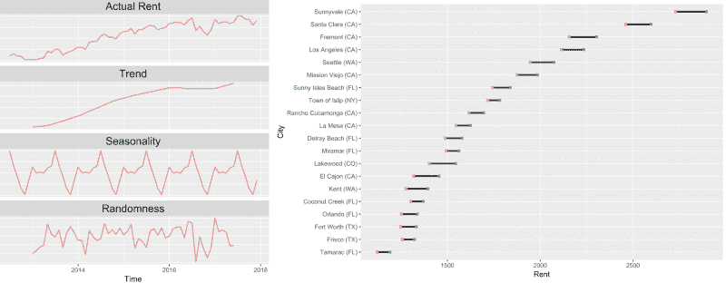

# 如何预测租金并优化租赁期限，以便节省资金

在我的[上一篇文章](https://medium.freecodecamp.org/how-to-analyze-seasonality-and-trends-to-save-money-on-your-apartment-lease-714d1d82771a)中，我们讨论了如何根据季节选择最佳月份签订租约。现在，当面临 12 个月、15 个月、18 个月或更长时间的不同选择时，您应该签订多长时间的租约？选择省钱的最佳方案有什么策略吗？

为了分析这一点，我从 Zillow(一居室的城市级数据)中模拟了 353 个城市的租金数据。在这篇文章中，我将告诉你如何进行时间序列预测，以及哪些城市的租金上涨幅度最大！

#### 首先，租赁期限如何帮助您省钱？

如下所示，如果你预测你所在城市的租金会上涨，你可以通过签订更长的租约来省钱。如果下一年的月租金增加了 100 美元，你可以通过签订两年的租约来节省 1200 美元，然后逐年续租。

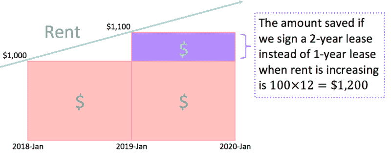

#### 你怎么预测房租会不会涨？

我们观察到租金是一个附加的时间序列，由季节性、趋势和一些随机噪声组成。

加法模型:Y(t)=季节性(t) +趋势性(t) +随机性(t)

我们可以通过应用 R 的`stl()`函数(stl 代表“使用局部加权散点图平滑的季节性和趋势分解”)将时间序列分解到上述等式的右侧。

```
# Decompose the additive time seriesdecomposed_rent <- stl(rent.series, s.window="periodic") #periodic means the seasonality factor is same for every year
```

```
# Extract the components from time seriesseasonal   <- decomposed_rent$time.series[,1]trend	   <- decomposed_rent$time.series[,2]random     <- decomposed_rent$time.series[,3]
```

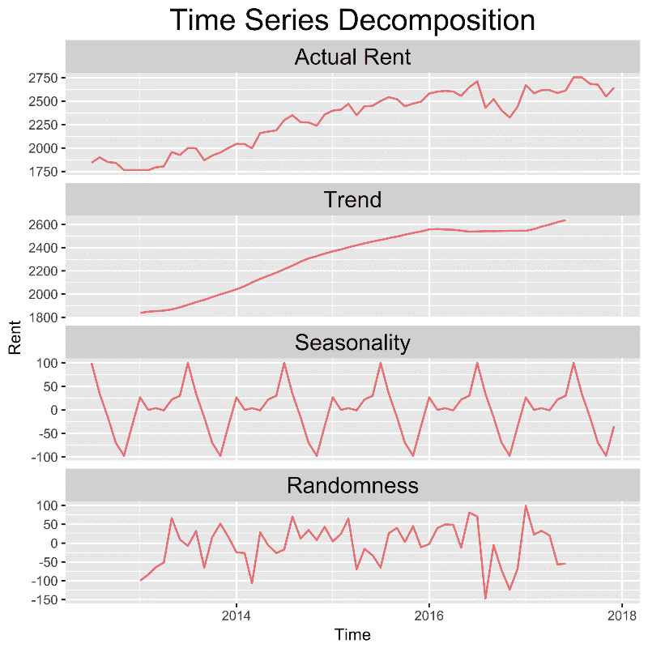

The plot of the decomposed time series of rent verified that the components are additive, where rent = Seasonality + Trend + Randomness

你可以简单的在租金数据的时间序列格式上应用 R 中的`st()`函数来预测未来 2 年的租金。

```
# Forecast rent for the next 24 months with 95% Confidence Intervalfore_rent<-stlf(rent.series, s.window="period",h=24, level = 95) 
```

#### 哪些城市有房租的预测涨幅？

**如何解读地块:2018 年后的**浅绿色** **带**区域为租金预测的 95%置信区间。紫色的**文字**告诉你，根据紫色的矩形区域，如果你签订 2 年的租金和 1 年的租金，你可以节省多少。所有的剧情我都用了* `ggplot2` *。*

### 1.海湾地区

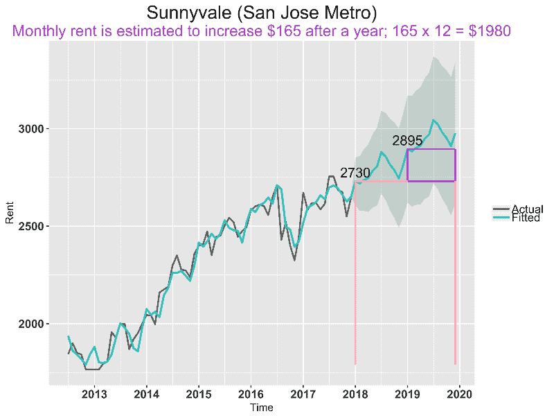

桑尼维尔的预计月租金涨幅是我分析的所有 246 个城市中最大的，为 165 美元(对比 2018–01 年的租金和 2019–01 年的预计租金)。因此，在 2018 年 1 月签订两年的租约，第二年可以节省 165 * 12 =**$ 1980**；签订 18 个月的租约可以节省 165 * 6 =**【990 美元**。鉴于桑尼维尔的季节性效应，你也应该尽量避免在 7 月份左右续签租约。

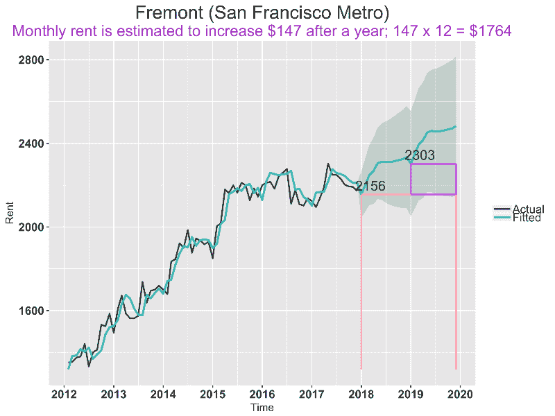

### 2.丹佛

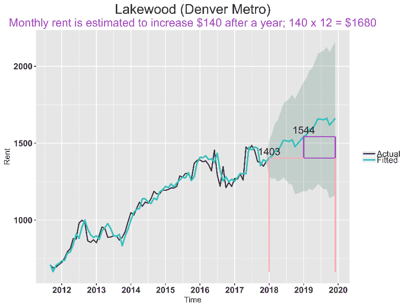

### 3.南加州

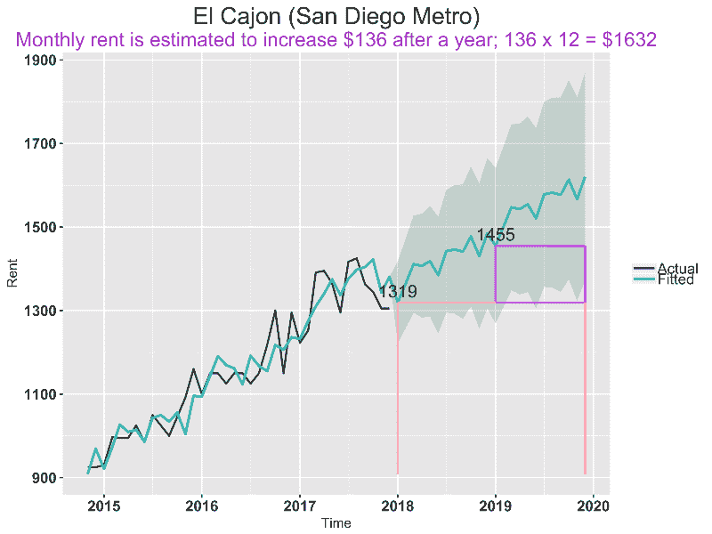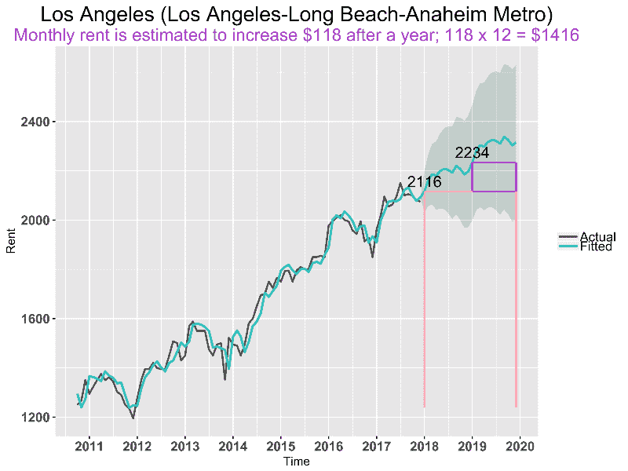

### 4.西雅图地区

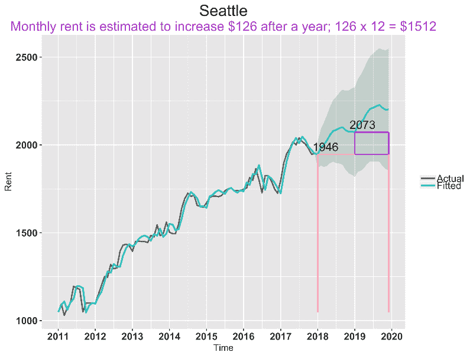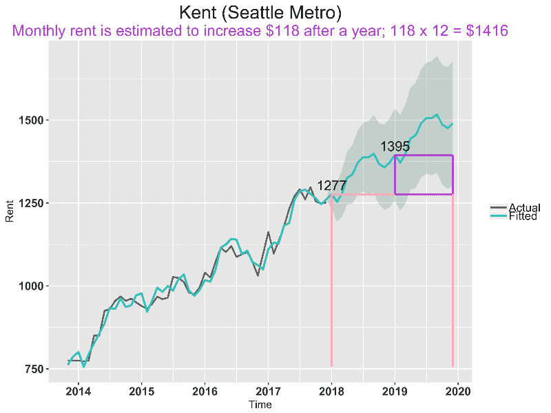

### 5.佛罗里达州

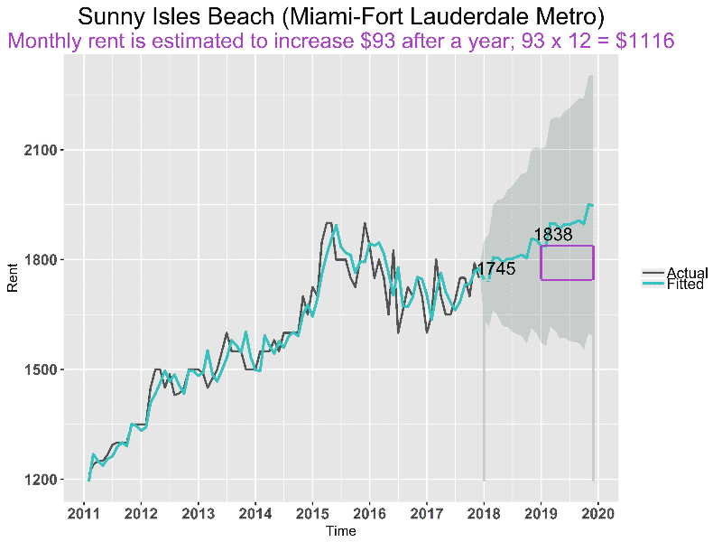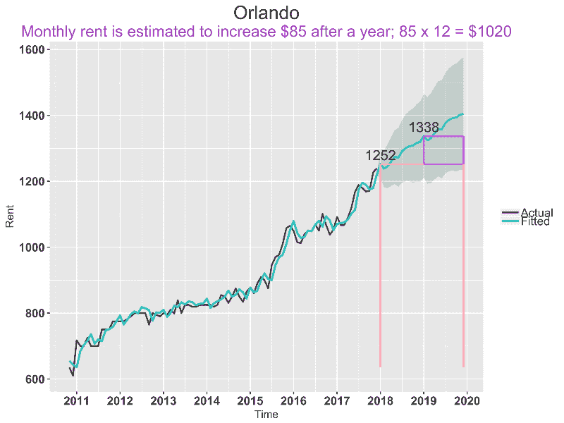

### 6.得克萨斯州

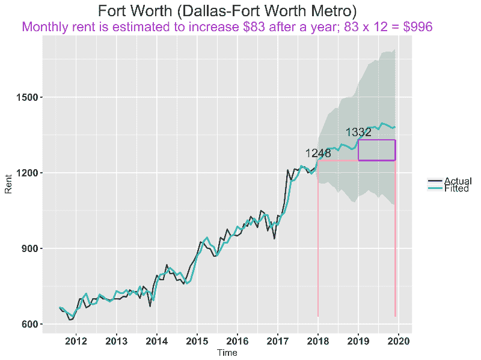

对于上面的 11 个城市，如果 2 年的租赁不是一个选择，18 个月仍然可以比每年更新增加的租金节省很多。

还有哪些城市的房租出现了大幅上涨？我绘制了 20 个城市(包括上面提到的城市)的租金对比，以及更多城市的租金涨幅。

每个城市的 ***线段*** 长度是租金的增长，其中红点是 2018-01 年的租金，绿色是 2019 -01 年的预测租金。

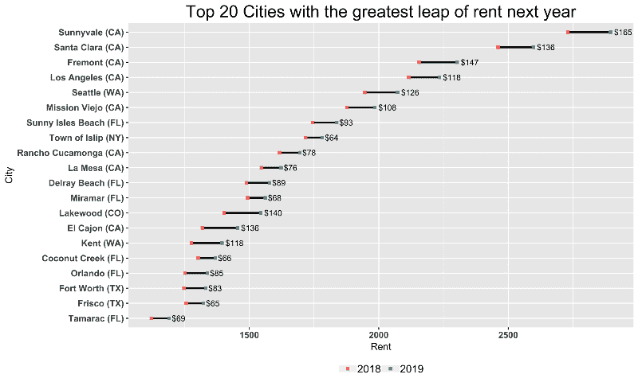

从上面的图中可以看出，莱克伍德(科罗拉多州丹佛地铁)和埃尔卡洪(加利福尼亚州圣地亚哥地铁)的租金在 20 个城市中并不算高，但与租金范围类似的其他城市相比，其上涨的“幅度”更大。

房租> 2000 美元且预测涨幅较大的城市都在 CA(图中前 4)。那里的房租已经很贵了，而且越来越贵，越来越快。

前 20 名中，CA 8 名，FL 6 名，WA 2 名，TX 2 名，NY 1 名，co 1 名。

#### 有哪些城市的房租没有太大的趋势？

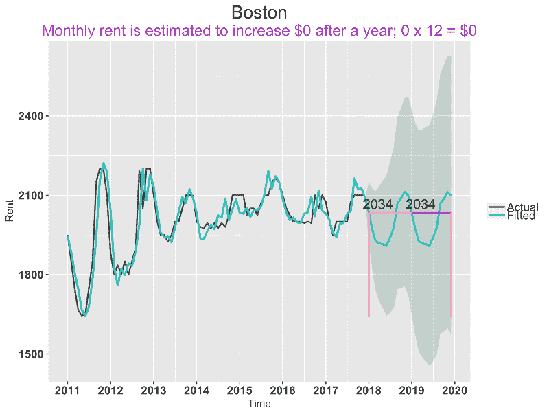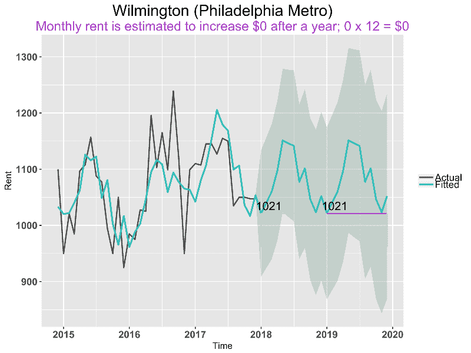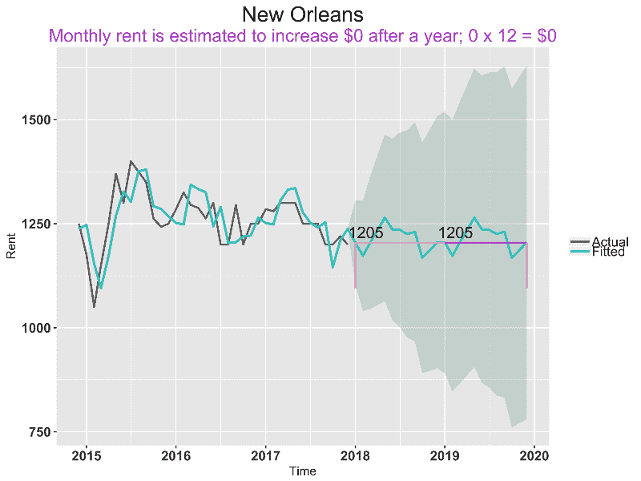

对于上面的城市，没有预测的增长。所以对于像波士顿和威尔明顿这样季节性效应非常显著的城市来说，*你签多长时间的租约其实并不重要；但是 ***你是哪个月*** 的星座。*

*波士顿房租最高的月份是 11 月，而在威尔明顿是 4 月。*

*如果你很好奇还有哪些城市是这样的，在我的 [*上一篇*](https://medium.freecodecamp.org/how-to-analyze-seasonality-and-trends-to-save-money-on-your-apartment-lease-714d1d82771a) *里多看看有季节性的城市吧！**

**在这里找到用 ggplot2 [进行时间序列模型和可视化的 R 代码。](https://github.com/zhendata/Medium_Posts/blob/master/Rent%20Prediction_zhendata.R)**

*给我几个掌声如果觉得有帮助就跟我来吧！*