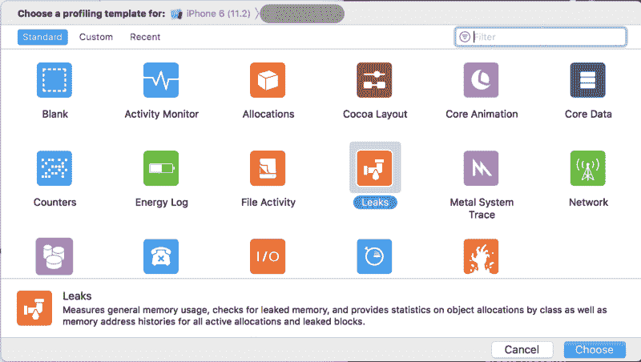
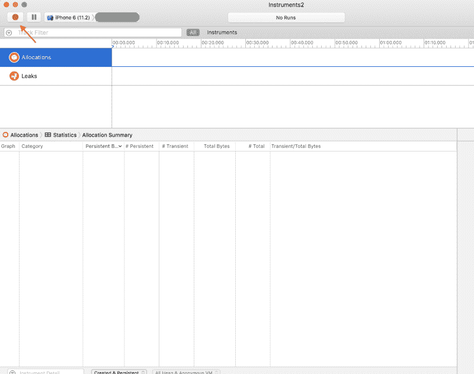
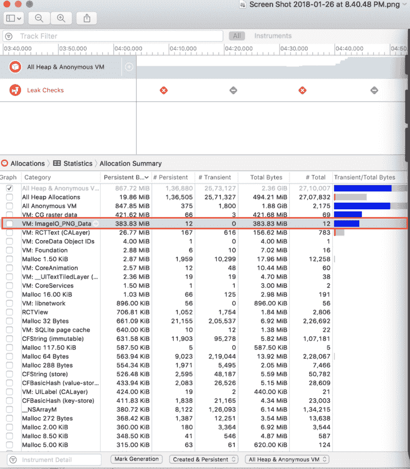
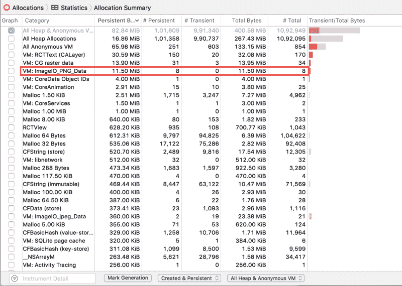

# 查找内存泄漏反应-本机应用程序(iOS)

> 原文：<https://www.freecodecamp.org/news/finding-memory-leaks-react-native-app-ios-46e6eeb50c8c/>

作者 Jignesh Kakadiya

# 查找内存泄漏反应-本机应用程序(iOS)

问题:
我们的 react-native 应用在所有设备上都运行良好，除了 iPhone 6，它导致了崩溃。经过高级分析后，我们发现这是一个内存问题。在应用程序中使用一些沉重的功能时，内存高达 600 多 MB。而且由于 iPhone 6 有 1GB 的 ram，iPhone 会自动杀死这个应用。

**解决方案:**
这是我为了把 app 总内存使用量从 600MB 降到 60MB 而做的。

1.  在分析内存泄漏时，我们需要确保应用程序是按照发布方案构建的。由于 dev build 包含日志/警告、热重装特性，所以在检查泄漏时我们不需要它们。这就是你如何用 xcode 改变发布版本的方法。
2.  **开始追踪泄漏**
    进入 XCode → Product → Profile (⌘ + i)
    会弹出概要模板。请选择需要的选项。
    选择`Leaks`并点击`choose`。

Profilers list

3.这将在您的屏幕上打开泄漏分析器。然后你可以点击左上角的“红点”,这将**重启模拟器**中的应用程序，你可以开始玩这个应用程序。

4.这是它在屏幕上执行一些滑动和旋转操作后的样子。我意识到，当我跳进轮播屏幕，从轮播的 12 幅图像中选择一幅图像时，每一幅图像的记忆都会迅速增长。下面的结果向我们展示了“内存中”图像对象所占用的内存。

5.**查找原因。**
我们使用 [react-native-fast-image](https://github.com/DylanVann/react-native-fast-image) 包来缓存屏幕上的图像，由于 react-native 没有“更好”的方式来缓存获取的图像，我们最终使用了`react-native-fast-image`。所以我决定从我的应用程序中删除这个奇妙的包，结果令人震惊。这是去掉后的结果。

PS:就像你知道的那样，我们最终使用了[react-native-cached-image](https://github.com/kfiroo/react-native-cached-image)，它不在内存中存储图像。

如果你正在用 react-native 构建一些东西并且需要帮助。请让我知道。