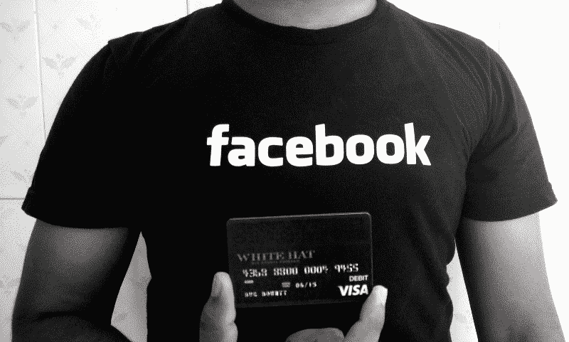

# 我想出了破解脸书 20 亿账户中任何一个的方法，他们付给我 15000 美元的赏金…

> 原文：<https://www.freecodecamp.org/news/responsible-disclosure-how-i-could-have-hacked-all-facebook-accounts-f47c0252ae4d/>

通过 AppSecure

# 我找到了破解脸书 20 亿账户的方法，他们为此付给我 15000 美元的赏金

根据负责任的披露政策，我在脸书的许可下发表这篇文章。他们已经修复了这个漏洞。

这篇文章是关于我在脸书上发现的一个简单的漏洞，我可以利用这个漏洞在没有任何用户互动的情况下轻松侵入其他用户的脸书账户。

这使我可以通过设置新密码来完全访问其他用户的帐户。我可以查看信息，他们的信用卡/借记卡存储在他们的支付部分，个人照片和其他私人信息。

脸书立即承认了这个问题，并修复了它，并根据这个漏洞的严重性和影响奖励了我 15000 美元。

### 黑客是如何工作的

每当用户在脸书忘记密码时，他们可以通过在[https://www.facebook.com/login/identify?ctx=recover&lwv = 110](https://www.facebook.com/login/identify?ctx=recover&lwv=110&__mref=message)上输入他们的电话号码和电子邮件地址来重置密码。

然后，脸书将发送一个 6 位数的代码到这个电话号码或电子邮件地址，用户必须输入，以设置一个新的密码。

我试图强行破解 www.facebook.com 上的 6 位数密码，在 10-12 次无效尝试后被阻止。

然后，我在 beta.facebook.com 和 mbasic.beta.facebook.com 寻找同样的问题。有趣的是，忘记密码端点中没有速率限制。

我试图接管我自己的账户(根据脸书的政策，你不能损害任何其他用户的账户)，并成功地为我的账户设置了新密码。然后我可以用这个密码登录我自己被黑的账户。

### 黑客的概念验证视频

正如你在视频中看到的，我可以通过暴力破解发送到用户电子邮件地址和电话号码的代码来为用户设置新密码。

### **易受攻击的请求**

`POST /recover/as/code/ HTTP/1.1`

`Host: beta.facebook.com`

`lsd=AVoywo13&n=XXXXX`

强行输入“n”成功地让我为任何脸书用户设置了新密码。

### **披露时间表**

2016 年 2 月 22 日:报告已发送至脸书团队。

2016 年 2 月 23 日:从我这边验证修复。

2016 年 3 月 2 日:脸书悬赏 15000 美元