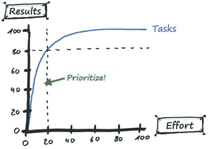

# 如何在你的职业和生活中把限制变成机遇

> 原文：<https://www.freecodecamp.org/news/on-turning-constraints-into-opportunities-in-your-career-404cbc937f18/>

作者塞缪尔·帕斯

# 如何在你的职业和生活中把限制变成机遇

Hmm yummy ?

前几天我一直有一个挥之不去的话题。所以我知道我必须写一篇关于它的文章。

这个想法很简单:对于学业和职业生涯中的大多数外部约束，我选择看到光明的一面，并充分利用它们，将它们转化为机遇。我们很容易陷入困境，整天抱怨自己不走运的状态。但是几乎总是有可能把我们看似酸酸的柠檬变成美味的柠檬蛋糕。

对我来说，向你展示我的意思的最好方式是分享我生活中的四个例子，按时间顺序。

### 1.缺少时间导致了注意力和生产力的提高

我是在大学四年级的夏天结婚的，当时我正在学习计算机科学。我的妻子是一名医学院学生，工作时间长且辛苦。对于我们的婚礼，我们想邀请对我们来说最重要的人，举办一个盛大而难忘的派对。

由于我妻子太忙，我们决定由我来组织婚礼的所有实际工作。对于那些经历过这些的人来说，你知道这会变得相当沉重。婚礼策划开始占用我大部分的空闲时间，以至于我很难找到时间来学习和完成我的学位项目。

这迫使我认真审视学习中哪些是必不可少的，哪些是多余的，哪些是可以优化的。我决定翘掉大部分的课，因为我觉得老师并没有给仅仅学习手册增加实质性的价值。我开始只关注一个给定项目的基本要点。我的目标不是做毕业生代表。它只是无忧无虑地度过。

这是我发现帕累托法则的时候，也叫做 80/20 定律。它指出，在大多数领域，20%的原因导致了 80%的结果。所以，一旦我的目标被清楚地陈述出来，我就开始关注为了达到我的目标需要做的最少的事情。

感受到时间压力迫使我集中精力，学习许多生产率技巧，这些技巧跟随了我多年。

哦，顺便说一下，婚礼是一个爆炸，我通过了一年没有太多的麻烦。我甚至比几个比我有更多时间但没有被迫集中注意力的朋友成绩更好。

Please tell me you’re scared ?

### 2.缺乏流动性让我加入了一家优秀的公司

毕业后，我加入了 IT 服务公司 Atos，担任软件顾问。和大多数服务公司一样，他们可以派我去他们客户的地方工作。这些地点可能在该地区的任何地方，单程通勤时间长达两个小时。

我开始为大型国有公司做一些蹩脚的 Java 项目，那里没有人关心这些项目。在 Atos，我周围的人似乎都不关心写好软件。你知道，只要冷漠的客户付钱…

我觉得卡住了。我所有的毕业热情开始消退。这就是编写软件的全部意义吗？如果我学习成为一名面包师，至少人们会关心我的面包…？

Hmmm the smell of good software ?

然后一号宝宝出生了。因为我的妻子仍在她的医学研究项目中长时间工作，这意味着我将是一个在早上为我们的女儿准备日托的人。我也会在晚上去接她，然后在妈妈回家前准备好一切。但是潜在的两小时通勤时间，这将是不可能的！

这迫使我去寻找其他机会，那些不会提前两小时通知就让员工离开的公司。这让我在一家名为 ESKER 的公司找到了一份很好的工作，这是一家优秀的雇主(字面上的优秀，男孩，我真幸运！).

如果不是外部环境所迫，我不会去找一份更好的工作。这是我职业生涯中迄今为止最好的决定之一。

### 3.缺乏全职工作的能力让我成为了一名开发人员

当第二个宝宝出生时，我妻子开始了她的住院医师/实习(在那里她会工作更疯狂的时间！)，我们意识到我们不可能同时全职工作。

所以我决定做兼职，以便能够处理大部分家庭后勤工作。当时，我在[管理岗位](http://www.samuelpath.com/management-why/)工作，但是[正在编写代码](http://www.samuelpath.com/back2dev/)。尽管如此，我还是觉得自己没有时间去学习，为职业转型做准备。

最棒的是，在我转为兼职的几个月后，我处理日常事务的效率越来越高。我开始每周找几个小时回到代码中。那时我意识到我喜欢它，我想回到软件开发。

我决定每周花 10 个小时用 [freeCodeCamp](http://www.samuelpath.com/fcc/) 学习 web 开发(在那之前我大部分时间都在用 Java、C/C++和 Python，但从来没有真正接触过任何与 web 相关的东西)。几个月后，我通过了测试，成为了公司的一名软件开发员。

/me wannabe hacker when the kids are asleep ?

成为一名开发人员是我迄今为止在职业生涯中最有成就感的一步。我可以真诚地说，我喜欢这份工作及其提供的可能性。

如果没有家庭的约束，这是不可能的，家庭的约束首先迫使我去兼职！

### 4.缺乏现场工作的能力让我成为了一名远程自由职业者

后来，第三个孩子出生了，我的妻子仍然是一名内科住院医师/实习生。由于我的大女儿需要在午休时得到照顾，我越来越难以在传统工作时间(如上午 9 点至下午 6 点)的办公室工作。

以我当时的水平，我认为不可能找到一份工作时间灵活的远程工作。所以我跟公司说，我要休两年育儿假，直到我老婆实习期/实习期结束。

然后奇迹发生了:他们让我考虑创建自己的公司，这样我就可以在家作为承包商为他们工作。然后我可以只开我工作的天数的账单。

Of course, this is my daily work environment. Tell me you’re not jealous ?.

我接受了，这也是我职业生涯中最好的决定之一。我现在每周工作 15 到 25 小时，这取决于我客户的需求和我的时间。学校放假期间，我不用请假。我只是告诉他们我不能做承包商。我每天都和女儿一起享用午餐。

### TL；速度三角形定位法(dead reckoning)

我很高兴能够作为一名自由职业者，以灵活的时间远程工作，做我真正喜欢并感到满足的事情(比如编写 JavaScript 以满足现实世界的业务需求)。我是真心的)。

但是，如果我没有在学生时代学会高效和专注，这是不可能的，所以我可以在没有家庭干扰和监督的情况下工作。

如果我没有带着这种打破常规的想法加入这家杰出的公司，这是不可能的。

如果我没有利用兼职工作的时间学习网络开发，这是不可能的。

如果我没有决定休育儿假来照顾我的孩子，这是不可能的…

你明白了。我职业生涯中最大的机遇是在我试图最大限度地利用外部约束，而不是与之斗争或抱怨它们的时候出现的。

所以下一次你感到被生活和事业束缚时，不要诅咒酸柠檬。直视他们，直截了当地告诉他们:我要把你变成史上最棒的柠檬蛋糕！

PS。如果你不喜欢柠檬蛋糕，试试柠檬水？

*最初发布于[www.samuelpath.com](http://www.samuelpath.com/on-turning-constraints-into-opportunities-in-your-career/)2018 年 2 月 9 日。*

*请不要犹豫在推特上分享你的想法，我在:[@ smlpth](http://www.twitter.com/smlpth)*