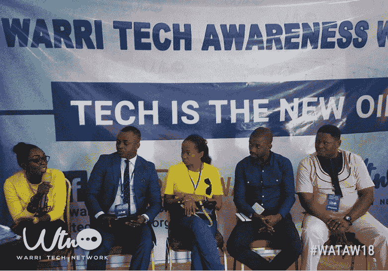

# 我参加了第一次 Warri Tech 认知活动。以下是我学到的。

> 原文：<https://www.freecodecamp.org/news/i-attended-the-first-ever-warri-tech-awareness-event-heres-what-i-learned-fcc8d584cb0a/>

在尼日利亚三角洲的瓦里市，有一句谚语说“瓦里也不是最后一名，如果我们努力做得好，那就打平”。这翻译成“*瓦里在事情(事件)的计划中从不落后”。*

没有忘记技术正在改变城市、国家和世界的事件进程这一事实，一群技术爱好者(代号为 [Warri Tech Network](https://twitter.com/warritechnetwok) )在 [Paul Okoro](https://twitter.com/okoropaul) 的领导下，组织了 2018 年 Warri Tech Awareness week， [#wataw18](https://twitter.com/hashtag/wataw18?src=hash) 。

瓦里技术网络的主要目标是:

1.  在城市中发展充满活力的技术生态系统。

2.向世界展示瓦里的技术解决方案。

3.激励瓦里的年轻人选择科技职业，比如成为软件开发人员。

4.通过与三角洲州政府的合作，鼓励在城市和州内采用技术。

有了这些目标，他们开始了为期一周的宣传活动。这场运动始于 2018 年 1 月 29 日，于 2018 年 2 月 3 日以一场峰会——瓦里科技活动——达到高潮。

在这一周中，该小组组织了宣传活动，如访问一家广播电台、一些企业主，以及与三角洲州埃富伦石油培训学院的大学生举行互动会议。

#### 2018 年 2 月 3 日星期六——瓦里技术认知活动

一场有超过 50 人参加的技术意识活动吸引了大学生、软件开发人员和来自三角洲州政府的代表，令人激动和鼓舞。

特别令人鼓舞的是，科学和技术专员的代表发表了主旨演讲。

关于在瓦里创造一个有利于技术的环境的小组会议证明了这样一个事实，即每个城市都有经验丰富的专业人士。例如，我见到了小组成员之一，Omawumi Eyekpimi，一位来自瓦里的 Android 开发者和作家。

L-R [Omawumi Eyekpimi](https://twitter.com/LeBelleAmi) Android Developer, Barr. Austin Ngwu, Benedicta Orioko**,** [Tobore Adakaraza](https://twitter.com/tobyadaz), [Victor Otaigho](https://twitter.com/votaigho)

#### 关键要点

1.  建立一个技术社区只需要几个愿意贡献时间和资源的热情的人。其余的将成为历史。
2.  人们在寻找知识和方向。如果你有这方面的知识，你可以让他们站在你的肩膀上，让他们看得更远。
3.  原来，瓦里有一些了不起的软件开发人员。在技术产品展览期间，我听他们谈论他们的解决方案，度过了一段美好的时光。

学习编程是你转行从事技术职业的主要步骤之一。充满活力的技术社区有助于加速您的发展。你可以注册 [freeCodeCamp](https://www.freecodecamp.org) ，开始成为一名网页开发者的旅程。

可以加入 [freeCodeCamp Warri 学习小组](https://web.facebook.com/groups/112469779363884/)。我前段时间创建了这个小组，我期待着与在瓦里的营员们一起喝咖啡。

关注[瓦里科技网](https://twitter.com/warritechnetwok)的 twitter 账号，参与瓦里科技生态系统的诞生。你也可以联系到[保罗·奥科罗](https://twitter.com/okoropaul/)和[奥马乌米·艾克皮米](https://twitter.com/LeBelleAmi)。

这里有一个活动照片的[链接。](http://techtins.com/post/wataw18-summit-gallery/)