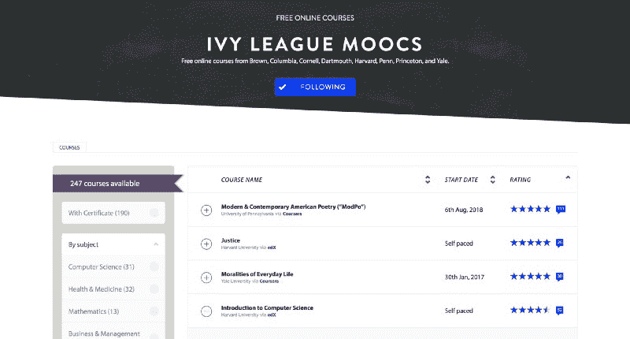

# 这里有 330 门常青藤联盟的课程，你现在可以在网上免费选修

> 原文：<https://www.freecodecamp.org/news/here-are-330-ivy-league-courses-you-can-take-online-right-now-for-free-58147bb7adcf/>

这 8 所常春藤盟校是世界上最负盛名的大学之一。这些大学包括布朗大学、哈佛大学、康奈尔大学、普林斯顿大学、达特茅斯大学、耶鲁大学、哥伦比亚大学和宾夕法尼亚大学。

所有八所学校都在《美国新闻与世界报道》2017 年全国大学排名中排名前十五。

这些常春藤盟校也是高选择性的，极难进入。但好消息是，所有这些大学现在都提供跨多个在线课程平台的免费在线课程。

到目前为止，他们已经创建了超过 430 个课程，其中大约 330 个仍然有效。[课中央](https://www.class-central.com/)把这些都做了一个收集，下面你可以探究一下。我将这些课程分为以下几类:

*   计算机科学
*   商业和管理
*   人文学科
*   艺术与设计
*   科学
*   健康与医学
*   数学
*   教育和教学
*   和工程

我还在班级中心的收藏页面上为常春藤盟校 mooc 收集了这些课程。随着新课程的增加，该集合会自动更新。您可以点击蓝色的“关注”按钮订阅接收更新。

请注意，有些 Coursera 有点难以访问，所以我[写了这个指南来告诉你如何](https://www.classcentral.com/report/coursera-signup-for-free/)。

[Ivy League MOOCs collection](https://www.classcentral.com/collection/ivy-league-moocs) on Class Central

### 人文学科(63)

*   [现代&当代美国诗歌【ModPo】](https://www.classcentral.com/mooc/356/coursera-modern-contemporary-american-poetry-modpo?utm_source=fcc_medium&utm_medium=web&utm_campaign=ivy_league_moocs_2018)来自*宾夕法尼亚大学*★★★★(180)
*   [日常生活的道德观](https://www.classcentral.com/mooc/911/coursera-moralities-of-everyday-life?utm_source=fcc_medium&utm_medium=web&utm_campaign=ivy_league_moocs_2018)来自*耶鲁大学*★★★★(36)
*   [希腊罗马神话](https://www.classcentral.com/mooc/353/coursera-greek-and-roman-mythology?utm_source=fcc_medium&utm_medium=web&utm_campaign=ivy_league_moocs_2018)来自*宾夕法尼亚大学*★★★☆(15)
*   [古代哲学:柏拉图&他的前辈](https://www.classcentral.com/mooc/5237/coursera-ancient-philosophy-plato-his-predecessors?utm_source=fcc_medium&utm_medium=web&utm_campaign=ivy_league_moocs_2018)来自*宾夕法尼亚大学*★★★★(11)
*   [中国(上):政治和思想基础:从圣王到孔子和法家](https://www.classcentral.com/mooc/941/edx-china-part-1-political-and-intellectual-foundations-from-the-sage-kings-to-confucius-and-the-legalists?utm_source=fcc_medium&utm_medium=web&utm_campaign=ivy_league_moocs_2018)来自*哈佛大学*★★★★(9)
*   [古代哲学:亚里斯多德及其后继者](https://www.classcentral.com/mooc/5238/coursera-ancient-philosophy-aristotle-and-his-successors?utm_source=fcc_medium&utm_medium=web&utm_campaign=ivy_league_moocs_2018)来自*宾夕法尼亚大学*★★★☆(9)
*   [中国(第六部):满族人和清朝](https://www.classcentral.com/mooc/1986/edx-china-part-6-the-manchus-and-the-qing-dynasty?utm_source=fcc_medium&utm_medium=web&utm_campaign=ivy_league_moocs_2018)来自*哈佛大学*★★★★(6)
*   [中国(第四部):文人中国:考试与理学](https://www.classcentral.com/mooc/1845/edx-china-part-4-literati-china-examinations-and-neo-confucianism?utm_source=fcc_medium&utm_medium=web&utm_campaign=ivy_league_moocs_2018)来自*哈佛大学*★★★★(6)
*   [中国(下):中央集权帝国的创建与终结](https://www.classcentral.com/mooc/1617/edx-china-part-2-the-creation-and-end-of-centralized-empire?utm_source=fcc_medium&utm_medium=web&utm_campaign=ivy_league_moocs_2018)来自*哈佛大学*★★★★(6)
*   [可视化日本(19 世纪 50 年代-30 年代):西化、抗议、现代性](https://www.classcentral.com/mooc/2159/edx-visualizing-japan-1850s-1930s-westernization-protest-modernity?utm_source=fcc_medium&utm_medium=web&utm_campaign=ivy_league_moocs_2018)来自*哈佛大学*★★★★(5)
*   [宗教素养:传统与经文](https://www.classcentral.com/mooc/5844/edx-religious-literacy-traditions-and-scriptures?utm_source=fcc_medium&utm_medium=web&utm_campaign=ivy_league_moocs_2018)来自*哈佛大学*★★★☆(5)
*   [中国(第八部分):创造现代中国:一个国家的诞生](https://www.classcentral.com/mooc/2468/edx-china-part-8-creating-modern-china-the-birth-of-a-nation?utm_source=fcc_medium&utm_medium=web&utm_campaign=ivy_league_moocs_2018)来自*哈佛大学*★★★★(5)
*   [南北战争与重建——1850–1861:一座从*分裂出来的房子*](https://www.classcentral.com/mooc/2172/edx-the-civil-war-and-reconstruction-1850-1861-a-house-divided?utm_source=fcc_medium&utm_medium=web&utm_campaign=ivy_league_moocs_2018)哥大★★★★(5)
*   [内战与重建——1865–1890:未完成的革命](https://www.classcentral.com/mooc/2439/edx-the-civil-war-and-reconstruction-1865-1890-the-unfinished-revolution?utm_source=fcc_medium&utm_medium=web&utm_campaign=ivy_league_moocs_2018)来自*哥大* ★★★★★(5)
*   [中国(第九部分):中国和共产主义](https://www.classcentral.com/mooc/2469/edx-china-part-9-china-and-communism?utm_source=fcc_medium&utm_medium=web&utm_campaign=ivy_league_moocs_2018)来自*哈佛大学*★★★★(4)
*   [中国(第三部):国际化的唐:贵族文化](https://www.classcentral.com/mooc/1773/edx-china-part-3-cosmopolitan-tang-aristocratic-culture?utm_source=fcc_medium&utm_medium=web&utm_campaign=ivy_league_moocs_2018)来自*哈佛大学*★★★★(4)
*   [中国(第七部分):入侵、叛乱和中华帝国的衰落](https://www.classcentral.com/mooc/2467/edx-china-part-7-invasions-rebellions-and-the-fall-of-imperial-china?utm_source=fcc_medium&utm_medium=web&utm_campaign=ivy_league_moocs_2018)来自*哈佛大学*★★★★(4)
*   [中国(第五部):从蒙古人统治下的全球帝国到明朝统治下的全球经济](https://www.classcentral.com/mooc/1988/edx-china-part-5-from-a-global-empire-under-the-mongols-to-a-global-economy-under-the-ming-dynasty?utm_source=fcc_medium&utm_medium=web&utm_campaign=ivy_league_moocs_2018)来自*哈佛大学*★★★★(4)
*   [中国(第十部分):今日大中华:中华人民共和国、台湾和香港](https://www.classcentral.com/mooc/2470/edx-china-part-10-greater-china-today-the-people-s-republic-taiwan-and-hong-kong?utm_source=fcc_medium&utm_medium=web&utm_campaign=ivy_league_moocs_2018)来自*哈佛大学*★★★★(4)
*   [宾夕法尼亚大学*的新闻英语*](https://www.classcentral.com/mooc/6009/coursera-english-for-journalism?utm_source=fcc_medium&utm_medium=web&utm_campaign=ivy_league_moocs_2018)★★★☆(4)
*   [有效的利他主义](https://www.classcentral.com/mooc/3446/coursera-effective-altruism?utm_source=fcc_medium&utm_medium=web&utm_campaign=ivy_league_moocs_2018)来自*普林斯顿大学*★★★☆(4)
*   [内战与重建——1861-1865:自由的新生](https://www.classcentral.com/mooc/2297/edx-the-civil-war-and-reconstruction-1861-1865-a-new-birth-of-freedom?utm_source=fcc_medium&utm_medium=web&utm_campaign=ivy_league_moocs_2018)来自*哥大*★★★★(4)
*   [职业发展英语](https://www.classcentral.com/mooc/6011/coursera-english-for-career-development?utm_source=fcc_medium&utm_medium=web&utm_campaign=ivy_league_moocs_2018)来自*宾夕法尼亚大学*★★★★(3)
*   [宇宙之旅:生命的展开](https://www.classcentral.com/mooc/6947/coursera-journey-of-the-universe-the-unfolding-of-life?utm_source=fcc_medium&utm_medium=web&utm_campaign=ivy_league_moocs_2018)来自*耶鲁大学* ★★★☆☆(3)
*   [吃的伦理](https://www.classcentral.com/mooc/3043/edx-the-ethics-of-eating?utm_source=fcc_medium&utm_medium=web&utm_campaign=ivy_league_moocs_2018)来自*康乃尔大学*★★★☆(3)
*   [美国资本主义:一部历史](https://www.classcentral.com/mooc/1562/edx-american-capitalism-a-history?utm_source=fcc_medium&utm_medium=web&utm_campaign=ivy_league_moocs_2018)来自*康乃尔大学*★★★★(3)
*   [质疑现实！科学、哲学和寻找意义](https://www.classcentral.com/mooc/6851/edx-question-reality-science-philosophy-and-the-search-for-meaning?utm_source=fcc_medium&utm_medium=web&utm_campaign=ivy_league_moocs_2018)来自*达特茅斯*★★★☆(3)
*   [古希腊英雄](https://www.classcentral.com/mooc/609/edx-the-ancient-greek-hero?utm_source=fcc_medium&utm_medium=web&utm_campaign=ivy_league_moocs_2018)来自*哈佛大学* ★★★☆☆(2)
*   [书:中世纪时之书:中世纪后期的艺术与虔诚](https://www.classcentral.com/mooc/3838/edx-the-book-the-medieval-book-of-hours-art-and-devotion-in-the-later-middle-ages?utm_source=fcc_medium&utm_medium=web&utm_campaign=ivy_league_moocs_2018)来自*哈佛大学* ★★★☆☆(2)
*   [基督教通过它的经文](https://www.classcentral.com/mooc/5858/edx-christianity-through-its-scriptures?utm_source=fcc_medium&utm_medium=web&utm_campaign=ivy_league_moocs_2018)从*哈佛大学*★★★☆(2)
*   [世界文学名著](https://www.classcentral.com/mooc/6844/edx-masterpieces-of-world-literature?utm_source=fcc_medium&utm_medium=web&utm_campaign=ivy_league_moocs_2018)来自*哈佛大学*★★★☆(2)
*   约翰·斯诺和 1854 年的霍乱疫情来自*哈佛大学*★★★★(2)
*   [诗歌在美国:艾米莉·狄金森](https://www.classcentral.com/mooc/3061/edx-poetry-in-america-emily-dickinson?utm_source=fcc_medium&utm_medium=web&utm_campaign=ivy_league_moocs_2018)来自*哈佛大学*★★★★(2)
*   [佛教经其经文](https://www.classcentral.com/mooc/5857/edx-buddhism-through-its-scriptures?utm_source=fcc_medium&utm_medium=web&utm_campaign=ivy_league_moocs_2018)来自*哈佛大学*★★★★(2)
*   [古埃及及其文明介绍](https://www.classcentral.com/mooc/7326/coursera-introduction-to-ancient-egypt-and-its-civilization?utm_source=fcc_medium&utm_medium=web&utm_campaign=ivy_league_moocs_2018)来自*宾夕法尼亚大学*★★★★(2)
*   [哈姆雷特的鬼魂](https://www.classcentral.com/mooc/7016/edx-hamlet-s-ghost?utm_source=fcc_medium&utm_medium=web&utm_campaign=ivy_league_moocs_2018)来自*哈佛大学*★★★★(1)
*   [书:中世纪礼仪中的书](https://www.classcentral.com/mooc/3839/edx-the-book-books-in-the-medieval-liturgy?utm_source=fcc_medium&utm_medium=web&utm_campaign=ivy_league_moocs_2018)来自*哈佛大学*★★★★(1)
*   [商务与创业英语](https://www.classcentral.com/mooc/6010/coursera-english-for-business-and-entrepreneurship?utm_source=fcc_medium&utm_medium=web&utm_campaign=ivy_league_moocs_2018)来自*宾夕法尼亚大学*★★★★(1)
*   [古埃及奇观](https://www.classcentral.com/mooc/9577/coursera-wonders-of-ancient-egypt?utm_source=fcc_medium&utm_medium=web&utm_campaign=ivy_league_moocs_2018)来自*宾夕法尼亚大学*★★★★(1)
*   [西方基督教之旅:从被迫害的信仰到全球宗教(200–1650)](https://www.classcentral.com/mooc/8106/coursera-a-journey-through-western-christianity-from-persecuted-faith-to-global-religion-200-1650?utm_source=fcc_medium&utm_medium=web&utm_campaign=ivy_league_moocs_2018)来自*耶鲁大学*★★★★(1)
*   [女人总是在工作:美国 1700-1920 年的经历](https://www.classcentral.com/mooc/8110/edx-women-have-always-worked-the-u-s-experience-1700-1920?utm_source=fcc_medium&utm_medium=web&utm_campaign=ivy_league_moocs_2018)来自*哥大*★★★★(1)
*   [美国文艺复兴:19 世纪的经典文学](https://www.classcentral.com/mooc/4916/edx-the-american-renaissance-classic-literature-of-the-19th-century?utm_source=fcc_medium&utm_medium=web&utm_campaign=ivy_league_moocs_2018)来自*达特茅斯*★★★★(1)
*   [权力与责任:与来自*哈佛大学*的超级英雄一起做哲学](https://www.classcentral.com/mooc/9708/edx-power-and-responsibility-doing-philosophy-with-superheroes?utm_source=fcc_medium&utm_medium=web&utm_campaign=ivy_league_moocs_2018)
*   [伊斯兰教经](https://www.classcentral.com/mooc/5818/edx-islam-through-its-scriptures?utm_source=fcc_medium&utm_medium=web&utm_campaign=ivy_league_moocs_2018)来自*哈佛大学*
*   [印度教通过它的经文](https://www.classcentral.com/mooc/5819/edx-hinduism-through-its-scriptures?utm_source=fcc_medium&utm_medium=web&utm_campaign=ivy_league_moocs_2018)来自*哈佛大学*
*   书籍:书籍侦探:关于阅读大众的兴起，19 世纪的书籍能告诉我们什么？来自*哈佛大学*
*   [夏洛克的债券](https://www.classcentral.com/mooc/8536/edx-shylock-s-bond?utm_source=fcc_medium&utm_medium=web&utm_campaign=ivy_league_moocs_2018)来自*哈佛大学*
*   [宗教、冲突与和平](https://www.classcentral.com/mooc/9452/edx-religion-conflict-and-peace?utm_source=fcc_medium&utm_medium=web&utm_campaign=ivy_league_moocs_2018)来自*哈佛大学*
*   [犹太教通过它的经文](https://www.classcentral.com/mooc/5820/edx-judaism-through-its-scriptures?utm_source=fcc_medium&utm_medium=web&utm_campaign=ivy_league_moocs_2018)从*哈佛大学*
*   [美国诗歌:早期新英格兰的诗歌](https://www.classcentral.com/mooc/933/edx-poetry-in-america-the-poetry-of-early-new-england?utm_source=fcc_medium&utm_medium=web&utm_campaign=ivy_league_moocs_2018)来自*哈佛大学*
*   [美国诗歌:自然与国家，1700-1850](https://www.classcentral.com/mooc/2315/edx-poetry-in-america-nature-and-nation-1700-1850?utm_source=fcc_medium&utm_medium=web&utm_campaign=ivy_league_moocs_2018)来自*哈佛大学*
*   [美国诗歌:惠特曼](https://www.classcentral.com/mooc/2816/edx-poetry-in-america-whitman?utm_source=fcc_medium&utm_medium=web&utm_campaign=ivy_league_moocs_2018)来自*哈佛大学*
*   [美国诗歌:现代主义](https://www.classcentral.com/mooc/5346/edx-poetry-in-america-modernism?utm_source=fcc_medium&utm_medium=web&utm_campaign=ivy_league_moocs_2018)来自*哈佛大学*
*   [美国诗歌:内战及其后果](https://www.classcentral.com/mooc/3355/edx-poetry-in-america-the-civil-war-and-its-aftermath?utm_source=fcc_medium&utm_medium=web&utm_campaign=ivy_league_moocs_2018)来自*哈佛大学*
*   [中国人文:中国文化中的个体](https://www.classcentral.com/mooc/9256/edx-china-humanities-the-individual-in-chinese-culture?utm_source=fcc_medium&utm_medium=web&utm_campaign=ivy_league_moocs_2018)来自*哈佛大学*
*   [古代世界文学名著](https://www.classcentral.com/mooc/9423/edx-ancient-masterpieces-of-world-literature?utm_source=fcc_medium&utm_medium=web&utm_campaign=ivy_league_moocs_2018)来自*哈佛大学*
*   [现代世界文学名著](https://www.classcentral.com/mooc/9424/edx-modern-masterpieces-of-world-literature?utm_source=fcc_medium&utm_medium=web&utm_campaign=ivy_league_moocs_2018)来自*哈佛大学*
*   [科技、工程和数学英语](https://www.classcentral.com/mooc/6538/coursera-english-for-science-technology-engineering-and-mathematics?utm_source=fcc_medium&utm_medium=web&utm_campaign=ivy_league_moocs_2018)来自*宾夕法尼亚大学*
*   [托马斯·贝里的世界观:地球社区的繁荣](https://www.classcentral.com/mooc/6946/coursera-the-worldview-of-thomas-berry-the-flourishing-of-the-earth-community?utm_source=fcc_medium&utm_medium=web&utm_campaign=ivy_league_moocs_2018)来自*耶鲁大学*
*   [撰写案例研究:交付科学](https://www.classcentral.com/mooc/4908/edx-writing-case-studies-science-of-delivery?utm_source=fcc_medium&utm_medium=web&utm_campaign=ivy_league_moocs_2018)来自*普林斯顿大学*
*   [女性总是在工作:美国 1920-2016 年的经历](https://www.classcentral.com/mooc/8523/edx-women-have-always-worked-the-u-s-experience-1920-2016?utm_source=fcc_medium&utm_medium=web&utm_campaign=ivy_league_moocs_2018)来自*哥伦比亚大学*
*   神奇的地方，非人类:通过文学探索人性来自*布朗大学*
*   [记忆的伦理](https://www.classcentral.com/mooc/8538/edx-the-ethics-of-memory?utm_source=fcc_medium&utm_medium=web&utm_campaign=ivy_league_moocs_2018)来自*布朗大学*

### 计算机科学(25)

*   [CS50 的计算机科学入门](https://www.classcentral.com/mooc/442/edx-cs50-s-introduction-to-computer-science?utm_source=fcc_medium&utm_medium=web&utm_campaign=ivy_league_moocs_2018)来自*哈佛大学*★★★★(65)
*   [算法，第一部分](https://www.classcentral.com/mooc/339/coursera-algorithms-part-i?utm_source=fcc_medium&utm_medium=web&utm_campaign=ivy_league_moocs_2018)来自*普林斯顿大学*★★★★(58)
*   [算法，第二部分](https://www.classcentral.com/mooc/340/coursera-algorithms-part-ii?utm_source=fcc_medium&utm_medium=web&utm_campaign=ivy_league_moocs_2018)来自*普林斯顿大学*★★★★(21)
*   [比特币和加密货币技术](https://www.classcentral.com/mooc/3655/coursera-bitcoin-and-cryptocurrency-technologies?utm_source=fcc_medium&utm_medium=web&utm_campaign=ivy_league_moocs_2018)来自*普林斯顿大学*★★★☆(15)
*   [数据科学和分析的机器学习](https://www.classcentral.com/mooc/4912/edx-machine-learning-for-data-science-and-analytics?utm_source=fcc_medium&utm_medium=web&utm_campaign=ivy_league_moocs_2018)来自*哥伦比亚大学* ★★★☆☆(15)
*   [人工智能(AI)](https://www.classcentral.com/mooc/7230/edx-artificial-intelligence-ai?utm_source=fcc_medium&utm_medium=web&utm_campaign=ivy_league_moocs_2018) 来自*哥大*★★★☆(9)
*   [强化学习](https://www.classcentral.com/mooc/1849/udacity-reinforcement-learning?utm_source=fcc_medium&utm_medium=web&utm_campaign=ivy_league_moocs_2018)来自*布朗大学*★★☆☆(6)
*   [计算机架构](https://www.classcentral.com/mooc/342/coursera-computer-architecture?utm_source=fcc_medium&utm_medium=web&utm_campaign=ivy_league_moocs_2018)来自*普林斯顿大学*★★★☆(6)
*   [机器学习](https://www.classcentral.com/mooc/1020/udacity-machine-learning?utm_source=fcc_medium&utm_medium=web&utm_campaign=ivy_league_moocs_2018)来自布朗大学★★★★(5)
*   [数据科学和分析的使能技术:物联网](https://www.classcentral.com/mooc/4911/edx-enabling-technologies-for-data-science-and-analytics-the-internet-of-things?utm_source=fcc_medium&utm_medium=web&utm_campaign=ivy_league_moocs_2018)来自*哥伦比亚大学*★☆☆☆(5)
*   [机器学习](https://www.classcentral.com/mooc/7231/edx-machine-learning?utm_source=fcc_medium&utm_medium=web&utm_campaign=ivy_league_moocs_2018)来自*哥大*★★★★(4)
*   [使用 Python 进行研究](https://www.classcentral.com/mooc/7204/edx-using-python-for-research?utm_source=fcc_medium&utm_medium=web&utm_campaign=ivy_league_moocs_2018)来自*哈佛大学* ★★★☆☆(3)
*   [用 JavaScript 为 Web 编程](https://www.classcentral.com/mooc/8518/edx-programming-for-the-web-with-javascript?utm_source=fcc_medium&utm_medium=web&utm_campaign=ivy_league_moocs_2018)来自*宾夕法尼亚大学*★★★★(2)
*   [智能手机内部的计算技术](https://www.classcentral.com/mooc/2809/edx-the-computing-technology-inside-your-smartphone?utm_source=fcc_medium&utm_medium=web&utm_campaign=ivy_league_moocs_2018)来自*康乃尔大学*★★★★(2)
*   [宾夕法尼亚大学*的软件开发基础*](https://www.classcentral.com/mooc/8516/edx-software-development-fundamentals?utm_source=fcc_medium&utm_medium=web&utm_campaign=ivy_league_moocs_2018)★★★☆☆(1)
*   [网络画报:没有微积分的原理](https://www.classcentral.com/mooc/891/coursera-networks-illustrated-principles-without-calculus?utm_source=fcc_medium&utm_medium=web&utm_campaign=ivy_league_moocs_2018)来自*普林斯顿大学*★★★☆(3)
*   [机器学习:无监督学习](https://www.classcentral.com/mooc/1848/udacity-machine-learning-unsupervised-learning?utm_source=fcc_medium&utm_medium=web&utm_campaign=ivy_league_moocs_2018)来自*布朗大学*★★★★(2)
*   [网络:朋友、金钱和字节](https://www.classcentral.com/mooc/359/coursera-networks-friends-money-and-bytes?utm_source=fcc_medium&utm_medium=web&utm_campaign=ivy_league_moocs_2018)来自*普林斯顿大学* ★★★☆☆(1)
*   [HI-FIVE:健康信息学促进创新，价值&丰富(行政/IT 视角)](https://www.classcentral.com/mooc/8099/coursera-hi-five-health-informatics-for-innovation-value-enrichment-administrative-it-perspective?utm_source=fcc_medium&utm_medium=web&utm_campaign=ivy_league_moocs_2018)来自*哥大*★★★★(1)
*   [CS50 的 AP 计算机科学原理](https://www.classcentral.com/mooc/7017/edx-cs50-s-ap-computer-science-principles?utm_source=fcc_medium&utm_medium=web&utm_campaign=ivy_league_moocs_2018)来自*哈佛大学*
*   [CS50 的理解技术](https://www.classcentral.com/mooc/10142/edx-cs50-s-understanding-technology?utm_source=fcc_medium&utm_medium=web&utm_campaign=ivy_league_moocs_2018)来自*哈佛大学*
*   来自*哈佛大学*的
*   [数据结构和软件设计](https://www.classcentral.com/mooc/8517/edx-data-structures-and-software-design?utm_source=fcc_medium&utm_medium=web&utm_campaign=ivy_league_moocs_2018)来自*宾夕法尼亚大学*
*   [算法设计与分析](https://www.classcentral.com/mooc/8520/edx-algorithm-design-and-analysis?utm_source=fcc_medium&utm_medium=web&utm_campaign=ivy_league_moocs_2018)来自*宾夕法尼亚大学*
*   [动画和 CGI 动作](https://www.classcentral.com/mooc/7242/edx-animation-and-cgi-motion?utm_source=fcc_medium&utm_medium=web&utm_campaign=ivy_league_moocs_2018)来自*哥大*

### 艺术与设计(19)

*   [游戏化](https://www.classcentral.com/mooc/343/coursera-gamification?utm_source=fcc_medium&utm_medium=web&utm_campaign=ivy_league_moocs_2018)来自*宾夕法尼亚大学*★★★★(57)
*   [古典音乐入门](https://www.classcentral.com/mooc/2987/coursera-introduction-to-classical-music?utm_source=fcc_medium&utm_medium=web&utm_campaign=ivy_league_moocs_2018)来自*耶鲁大学*★★★★(17)
*   [设计:社会中的造物](https://www.classcentral.com/mooc/371/coursera-design-creation-of-artifacts-in-society?utm_source=fcc_medium&utm_medium=web&utm_campaign=ivy_league_moocs_2018)来自*宾夕法尼亚大学*★★★★(14)
*   [罗马建筑](https://www.classcentral.com/mooc/910/coursera-roman-architecture?utm_source=fcc_medium&utm_medium=web&utm_campaign=ivy_league_moocs_2018)来自*耶鲁大学*★★★☆(12)
*   [初夜——韩德尔的弥赛亚](https://www.classcentral.com/mooc/4548/edx-first-nights-handel-s-messiah?utm_source=fcc_medium&utm_medium=web&utm_campaign=ivy_league_moocs_2018)来自*哈佛大学*★★★★(3)
*   [听世界音乐](https://www.classcentral.com/mooc/355/coursera-listening-to-world-music?utm_source=fcc_medium&utm_medium=web&utm_campaign=ivy_league_moocs_2018)来自*宾夕法尼亚大学*★★★☆(3)
*   [重塑钢琴](https://www.classcentral.com/mooc/3778/kadenze-reinventing-the-piano?utm_source=fcc_medium&utm_medium=web&utm_campaign=ivy_league_moocs_2018)来自*普林斯顿大学*★★★★(3)
*   [好莱坞:历史、工业、艺术](https://www.classcentral.com/mooc/5643/edx-hollywood-history-industry-art?utm_source=fcc_medium&utm_medium=web&utm_campaign=ivy_league_moocs_2018)来自*宾夕法尼亚大学*★★★★(2)
*   [意大利歌剧简介](https://www.classcentral.com/mooc/3840/edx-introduction-to-italian-opera?utm_source=fcc_medium&utm_medium=web&utm_campaign=ivy_league_moocs_2018)来自*达特茅斯* ★★★☆☆(2)
*   [曝光数码摄影](https://www.classcentral.com/mooc/8091/exposing-digital-photography?utm_source=fcc_medium&utm_medium=web&utm_campaign=ivy_league_moocs_2018)来自*哈佛大学*★★★★(1)
*   [斯特拉文斯基的《春之祭:现代主义、芭蕾和骚乱](https://www.classcentral.com/mooc/7319/edx-stravinsky-s-rite-of-spring-modernism-ballet-and-riots?utm_source=fcc_medium&utm_medium=web&utm_campaign=ivy_league_moocs_2018)来自*哈佛大学*★★★☆(1)
*   [来自*哈佛大学的建筑想象力*](https://www.classcentral.com/mooc/7836/edx-the-architectural-imagination?utm_source=fcc_medium&utm_medium=web&utm_campaign=ivy_league_moocs_2018)★★★★(1)
*   [初夜:蒙特威尔第的《奥菲欧》和歌剧的诞生](https://www.classcentral.com/mooc/6365/edx-first-nights-monteverdi-s-l-orfeo-and-the-birth-of-opera?utm_source=fcc_medium&utm_medium=web&utm_campaign=ivy_league_moocs_2018)来自*哈佛大学*★★★★(1)
*   [初夜:柏辽兹 19 世纪的交响幻想曲和程序音乐](https://www.classcentral.com/mooc/6612/edx-first-nights-berlioz-s-symphonie-fantastique-and-program-music-in-the-19th-century?utm_source=fcc_medium&utm_medium=web&utm_campaign=ivy_league_moocs_2018)来自*哈佛大学*★★★★(1)
*   [初夜——贝多芬第九首](https://www.classcentral.com/mooc/5383/edx-first-nights-beethoven-s-9th?utm_source=fcc_medium&utm_medium=web&utm_campaign=ivy_league_moocs_2018)来自*哈佛大学*★★★★(1)
*   [音乐与社会行动](https://www.classcentral.com/mooc/5842/coursera-music-and-social-action?utm_source=fcc_medium&utm_medium=web&utm_campaign=ivy_league_moocs_2018)来自*耶鲁大学*★★★☆(1)
*   [大教堂的年代](https://www.classcentral.com/mooc/9671/coursera-age-of-cathedrals?utm_source=fcc_medium&utm_medium=web&utm_campaign=ivy_league_moocs_2018)来自*耶鲁大学*
*   [音乐制作技术的历史](https://www.classcentral.com/mooc/6803/kadenze-the-history-of-music-production-techniques?utm_source=fcc_medium&utm_medium=web&utm_campaign=ivy_league_moocs_2018)来自*哥大*
*   [德国歌剧简介](https://www.classcentral.com/mooc/7474/edx-introduction-to-german-opera?utm_source=fcc_medium&utm_medium=web&utm_campaign=ivy_league_moocs_2018)来自*达特茅斯*

### 商业与管理(68)

*   [市场营销入门](https://www.classcentral.com/mooc/1137/coursera-introduction-to-marketing?utm_source=fcc_medium&utm_medium=web&utm_campaign=ivy_league_moocs_2018)来自*宾夕法尼亚大学*★★★☆(53)
*   [财务会计入门](https://www.classcentral.com/mooc/769/coursera-introduction-to-financial-accounting?utm_source=fcc_medium&utm_medium=web&utm_campaign=ivy_league_moocs_2018)来自*宾夕法尼亚大学*★★★☆(42)
*   [运营管理入门](https://www.classcentral.com/mooc/372/coursera-introduction-to-operations-management?utm_source=fcc_medium&utm_medium=web&utm_campaign=ivy_league_moocs_2018)来自*宾夕法尼亚大学沃顿商学院*★★★☆(31)
*   [金融市场](https://www.classcentral.com/mooc/912/coursera-financial-markets?utm_source=fcc_medium&utm_medium=web&utm_campaign=ivy_league_moocs_2018)来自*耶鲁大学*★★★☆(24)
*   [宾夕法尼亚大学*沃顿商学院*★★★☆(19)公司金融入门](https://www.classcentral.com/mooc/625/coursera-introduction-to-corporate-finance?utm_source=fcc_medium&utm_medium=web&utm_campaign=ivy_league_moocs_2018)
*   [客户分析](https://www.classcentral.com/mooc/4353/coursera-customer-analytics?utm_source=fcc_medium&utm_medium=web&utm_campaign=ivy_league_moocs_2018)来自*宾夕法尼亚大学* ★★★☆☆(15)
*   [病毒式营销和如何制作有感染力的内容](https://www.classcentral.com/mooc/5034/coursera-viral-marketing-and-how-to-craft-contagious-content?utm_source=fcc_medium&utm_medium=web&utm_campaign=ivy_league_moocs_2018)来自*宾夕法尼亚大学*★★★☆(13)
*   [全球金融危机](https://www.classcentral.com/mooc/4893/coursera-the-global-financial-crisis?utm_source=fcc_medium&utm_medium=web&utm_campaign=ivy_league_moocs_2018)来自*耶鲁大学*★★★☆(11)
*   [金融工程与风险管理第一部分](https://www.classcentral.com/mooc/1014/coursera-financial-engineering-and-risk-management-part-i?utm_source=fcc_medium&utm_medium=web&utm_campaign=ivy_league_moocs_2018)来自*哥大*★★★☆(10)
*   [全球人力资本趋势](https://www.classcentral.com/mooc/6532/canvas-network-global-human-capital-trends?utm_source=fcc_medium&utm_medium=web&utm_campaign=ivy_league_moocs_2018)来自*哥大*★★★☆(8)
*   [创业 2:启动你的创业](https://www.classcentral.com/mooc/5468/coursera-entrepreneurship-2-launching-your-start-up?utm_source=fcc_medium&utm_medium=web&utm_campaign=ivy_league_moocs_2018)来自*宾夕法尼亚大学*★★★☆(6)
*   [运营分析](https://www.classcentral.com/mooc/4204/coursera-operations-analytics?utm_source=fcc_medium&utm_medium=web&utm_campaign=ivy_league_moocs_2018)来自*宾夕法尼亚大学*★★★☆(6)
*   [会计分析](https://www.classcentral.com/mooc/4166/coursera-accounting-analytics?utm_source=fcc_medium&utm_medium=web&utm_campaign=ivy_league_moocs_2018)来自*宾夕法尼亚大学*★★★☆(5)
*   [创业 1:发展机遇](https://www.classcentral.com/mooc/5467/coursera-entrepreneurship-1-developing-the-opportunity?utm_source=fcc_medium&utm_medium=web&utm_campaign=ivy_league_moocs_2018)来自*宾夕法尼亚大学*★★★☆(4)
*   [宾夕法尼亚大学*的量化建模基础*](https://www.classcentral.com/mooc/5448/coursera-fundamentals-of-quantitative-modeling?utm_source=fcc_medium&utm_medium=web&utm_campaign=ivy_league_moocs_2018)★★★☆(4)
*   [社会影响战略:企业家和创新者的工具](https://www.classcentral.com/mooc/2136/coursera-social-impact-strategy-tools-for-entrepreneurs-and-innovators?utm_source=fcc_medium&utm_medium=web&utm_campaign=ivy_league_moocs_2018)来自*宾夕法尼亚大学*★★★☆(4)
*   [更多财务会计介绍](https://www.classcentral.com/mooc/3539/coursera-more-introduction-to-financial-accounting?utm_source=fcc_medium&utm_medium=web&utm_campaign=ivy_league_moocs_2018)来自*宾夕法尼亚大学*★★★☆(4)
*   [企业风险管理五大黑仔风险预习课程](https://www.classcentral.com/mooc/6533/canvas-network-a-preview-course-on-the-5-killer-risks-of-enterprise-risk-management?utm_source=fcc_medium&utm_medium=web&utm_campaign=ivy_league_moocs_2018)来自*哥大*★★★★(4)
*   [谈判入门:成为有原则、有说服力的谈判者的战略剧本](https://www.classcentral.com/mooc/4336/coursera-introduction-to-negotiation-a-strategic-playbook-for-becoming-a-principled-and-persuasive-negotiator?utm_source=fcc_medium&utm_medium=web&utm_campaign=ivy_league_moocs_2018)来自*耶鲁大学*★★★★(3)
*   [创业四:融资与盈利](https://www.classcentral.com/mooc/5476/coursera-entrepreneurship-4-financing-and-profitability?utm_source=fcc_medium&utm_medium=web&utm_campaign=ivy_league_moocs_2018)来自*宾夕法尼亚大学*★★★☆(3)
*   [创业 3:成长策略](https://www.classcentral.com/mooc/5466/coursera-entrepreneurship-3-growth-strategies?utm_source=fcc_medium&utm_medium=web&utm_campaign=ivy_league_moocs_2018)来自*宾夕法尼亚大学*★★★☆(3)
*   [来自*宾夕法尼亚大学的沃顿商学院基础顶点*](https://www.classcentral.com/mooc/4002/coursera-wharton-business-foundations-capstone?utm_source=fcc_medium&utm_medium=web&utm_campaign=ivy_league_moocs_2018)★★★☆(3)
*   [金融工程与风险管理第二部分](https://www.classcentral.com/mooc/1015/coursera-financial-engineering-and-risk-management-part-ii?utm_source=fcc_medium&utm_medium=web&utm_campaign=ivy_league_moocs_2018)来自*哥大*★★★☆(3)
*   [新兴经济体创业](https://www.classcentral.com/mooc/7829/edx-entrepreneurship-in-emerging-economies?utm_source=fcc_medium&utm_medium=web&utm_campaign=ivy_league_moocs_2018)来自*哈佛大学*★★★☆(2)
*   [从*宾夕法尼亚大学引进 al Marketing*](https://www.classcentral.com/mooc/4685/coursera-introduccion-al-marketing?utm_source=fcc_medium&utm_medium=web&utm_campaign=ivy_league_moocs_2018)★★★★(2)
*   [艺术文化战略](https://www.classcentral.com/mooc/2678/coursera-arts-and-culture-strategy?utm_source=fcc_medium&utm_medium=web&utm_campaign=ivy_league_moocs_2018)来自*宾夕法尼亚大学*★★★★(2)
*   [全球酒店管理入门](https://www.classcentral.com/mooc/2818/edx-introduction-to-global-hospitality-management?utm_source=fcc_medium&utm_medium=web&utm_campaign=ivy_league_moocs_2018)来自*康乃尔大学*★★★☆(2)
*   [来自*哥大*★★★★(2)的协作知识服务预习课程](https://www.classcentral.com/mooc/6075/canvas-network-a-preview-course-on-collaborative-knowledge-services?utm_source=fcc_medium&utm_medium=web&utm_campaign=ivy_league_moocs_2018)
*   [成功](https://www.classcentral.com/mooc/6893/coursera-success?utm_source=fcc_medium&utm_medium=web&utm_campaign=ivy_league_moocs_2018)来自*宾夕法尼亚大学*★★★★(1)
*   [提高沟通技巧](https://www.classcentral.com/mooc/8235/coursera-improving-communication-skills?utm_source=fcc_medium&utm_medium=web&utm_campaign=ivy_league_moocs_2018)来自*宾夕法尼亚大学*
*   [市场营销概论（中文版)](https://www.classcentral.com/mooc/3900/coursera--?utm_source=fcc_medium&utm_medium=web&utm_campaign=ivy_league_moocs_2018)来自*宾夕法尼亚大学* ★★★☆☆(1)
*   [企业社会责任(CSR):一种战略方法](https://www.classcentral.com/mooc/9510/edx-corporate-social-responsibility-csr-a-strategic-approach?utm_source=fcc_medium&utm_medium=web&utm_campaign=ivy_league_moocs_2018)来自*宾夕法尼亚大学*★★★★(1)
*   [财务会计概论](https://www.classcentral.com/mooc/4686/coursera-introduccion-a-la-contabilidad-financiera?utm_source=fcc_medium&utm_medium=web&utm_campaign=ivy_league_moocs_2018)来自*宾夕法尼亚大学*【1)
*   [企业财务概论](https://www.classcentral.com/mooc/4688/coursera-introduccion-a-las-finanzas-corporativas?utm_source=fcc_medium&utm_medium=web&utm_campaign=ivy_league_moocs_2018)来自*宾夕法尼亚大学*【1)
*   [过你想要的生活](https://www.classcentral.com/mooc/8228/coursera-leading-the-life-you-want?utm_source=fcc_medium&utm_medium=web&utm_campaign=ivy_league_moocs_2018)来自*宾夕法尼亚大学*★★★☆(1)
*   [建筑工程管理](https://www.classcentral.com/mooc/7105/coursera-construction-project-management?utm_source=fcc_medium&utm_medium=web&utm_campaign=ivy_league_moocs_2018)来自*哥大*★☆☆☆(1)
*   [建筑金融](https://www.classcentral.com/mooc/7107/coursera-construction-finance?utm_source=fcc_medium&utm_medium=web&utm_campaign=ivy_league_moocs_2018)来自*哥大*★★★☆(1)
*   [Python 中的分析](https://www.classcentral.com/mooc/8210/edx-analytics-in-python?utm_source=fcc_medium&utm_medium=web&utm_campaign=ivy_league_moocs_2018)来自*哥大*★★☆☆(1)
*   [施工进度](https://www.classcentral.com/mooc/7114/coursera-construction-scheduling?utm_source=fcc_medium&utm_medium=web&utm_campaign=ivy_league_moocs_2018)来自*哥大*★★★★(1)
*   [新兴经济体的企业家精神和医疗保健](https://www.classcentral.com/mooc/2104/edx-entrepreneurship-and-healthcare-in-emerging-economies?utm_source=fcc_medium&utm_medium=web&utm_campaign=ivy_league_moocs_2018)来自*哈佛大学*
*   [建模风险和现实](https://www.classcentral.com/mooc/5546/coursera-modeling-risk-and-realities?utm_source=fcc_medium&utm_medium=web&utm_campaign=ivy_league_moocs_2018)来自*宾夕法尼亚大学*
*   [决策和情景](https://www.classcentral.com/mooc/5481/coursera-decision-making-and-scenarios?utm_source=fcc_medium&utm_medium=web&utm_campaign=ivy_league_moocs_2018)来自*宾夕法尼亚大学*
*   [管理客户关系的价值](https://www.classcentral.com/mooc/6766/edx-managing-the-value-of-customer-relationships?utm_source=fcc_medium&utm_medium=web&utm_campaign=ivy_league_moocs_2018)来自*宾夕法尼亚大学*
*   [打造高绩效团队](https://www.classcentral.com/mooc/7121/coursera-building-high-performing-teams?utm_source=fcc_medium&utm_medium=web&utm_campaign=ivy_league_moocs_2018)来自*宾夕法尼亚大学*
*   [沃顿创业巅峰](https://www.classcentral.com/mooc/5607/coursera-wharton-entrepreneurship-capstone?utm_source=fcc_medium&utm_medium=web&utm_campaign=ivy_league_moocs_2018)来自*宾夕法尼亚大学*
*   宾夕法尼亚大学*的沃顿商学院项目*
*   [来自*宾夕法尼亚大学*的沃顿商学院商业和金融建模顶点](https://www.classcentral.com/mooc/5547/coursera-wharton-business-and-financial-modeling-capstone?utm_source=fcc_medium&utm_medium=web&utm_campaign=ivy_league_moocs_2018)
*   [优化团队的多样性](https://www.classcentral.com/mooc/7123/coursera-optimizing-diversity-on-teams?utm_source=fcc_medium&utm_medium=web&utm_campaign=ivy_league_moocs_2018)来自*宾夕法尼亚大学*
*   [社会影响的商业策略](https://www.classcentral.com/mooc/9743/coursera-business-strategies-for-social-impact?utm_source=fcc_medium&utm_medium=web&utm_campaign=ivy_league_moocs_2018)来自*宾夕法尼亚大学*
*   [众筹](https://www.classcentral.com/mooc/9664/coursera-crowdfunding?utm_source=fcc_medium&utm_medium=web&utm_campaign=ivy_league_moocs_2018)来自*宾夕法尼亚大学*
*   [影响力](https://www.classcentral.com/mooc/9072/coursera-influence?utm_source=fcc_medium&utm_medium=web&utm_campaign=ivy_league_moocs_2018)来自*宾夕法尼亚大学*
*   [创造持续学习的团队文化](https://www.classcentral.com/mooc/7120/coursera-creating-a-team-culture-of-continuous-learning?utm_source=fcc_medium&utm_medium=web&utm_campaign=ivy_league_moocs_2018)来自*宾夕法尼亚大学*
*   [团队文化的力量](https://www.classcentral.com/mooc/7122/coursera-the-power-of-team-culture?utm_source=fcc_medium&utm_medium=web&utm_campaign=ivy_league_moocs_2018)来自*宾夕法尼亚大学*
*   [全球商业和社会趋势](https://www.classcentral.com/mooc/9800/coursera-global-trends-for-business-and-society?utm_source=fcc_medium&utm_medium=web&utm_campaign=ivy_league_moocs_2018)来自*宾夕法尼亚大学*
*   [管理社会和人力资本](https://www.classcentral.com/mooc/6887/coursera-managing-social-and-human-capital?utm_source=fcc_medium&utm_medium=web&utm_campaign=ivy_league_moocs_2018)来自*宾夕法尼亚大学*
*   [商业分析顶点](https://www.classcentral.com/mooc/5093/coursera-business-analytics-capstone?utm_source=fcc_medium&utm_medium=web&utm_campaign=ivy_league_moocs_2018)来自*宾夕法尼亚大学*
*   [Wharton Business Foundation Graduation Project (Chinese version)](https://www.classcentral.com/mooc/5002/coursera--?utm_source=fcc_medium&utm_medium=web&utm_campaign=ivy_league_moocs_2018) from *University of Pennsylvania*
*   [企业金融概论（中文版)](https://www.classcentral.com/mooc/3903/coursera--?utm_source=fcc_medium&utm_medium=web&utm_campaign=ivy_league_moocs_2018)来自*宾夕法尼亚大学*
*   [运营管理概论（中文版)](https://www.classcentral.com/mooc/3901/coursera--?utm_source=fcc_medium&utm_medium=web&utm_campaign=ivy_league_moocs_2018)来自*宾夕法尼亚大学*
*   [营运管理简介](https://www.classcentral.com/mooc/4687/coursera-introduccion-a-la-gestion-de-operaciones?utm_source=fcc_medium&utm_medium=web&utm_campaign=ivy_league_moocs_2018)来自*宾夕法尼亚大学*
*   [财务会计概论（中文版)](https://www.classcentral.com/mooc/3902/coursera--?utm_source=fcc_medium&utm_medium=web&utm_campaign=ivy_league_moocs_2018)来自*宾夕法尼亚大学*
*   [需求和供给分析](https://www.classcentral.com/mooc/8206/edx-demand-and-supply-analytics?utm_source=fcc_medium&utm_medium=web&utm_campaign=ivy_league_moocs_2018)来自*哥伦比亚大学*
*   [工程成本估算和成本控制](https://www.classcentral.com/mooc/7106/coursera-construction-cost-estimating-and-cost-control?utm_source=fcc_medium&utm_medium=web&utm_campaign=ivy_league_moocs_2018)来自*哥伦比亚大学*
*   [来自*哥伦比亚大学*的营销分析](https://www.classcentral.com/mooc/8214/edx-marketing-analytics?utm_source=fcc_medium&utm_medium=web&utm_campaign=ivy_league_moocs_2018)
*   [来自*哥大*的企业财务介绍](https://www.classcentral.com/mooc/9060/edx-introduction-to-corporate-finance?utm_source=fcc_medium&utm_medium=web&utm_campaign=ivy_league_moocs_2018)
*   [沃顿商学院的商业战略:竞争优势](https://www.classcentral.com/mooc/6829/edx-business-strategy-from-wharton-competitive-advantage?utm_source=fcc_medium&utm_medium=web&utm_campaign=ivy_league_moocs_2018)来自*宾夕法尼亚大学沃顿商学院*
*   [全渠道战略和管理](https://www.classcentral.com/mooc/8519/edx-omnichannel-strategy-and-management?utm_source=fcc_medium&utm_medium=web&utm_campaign=ivy_league_moocs_2018)来自*达特茅斯*
*   [零售基本面](https://www.classcentral.com/mooc/8513/edx-retail-fundamentals?utm_source=fcc_medium&utm_medium=web&utm_campaign=ivy_league_moocs_2018)来自*达特茅斯*

### 健康与医学(23)

*   [生命体征:了解身体在告诉我们什么](https://www.classcentral.com/mooc/1887/coursera-vital-signs-understanding-what-the-body-is-telling-us?utm_source=fcc_medium&utm_medium=web&utm_campaign=ivy_league_moocs_2018)来自*宾夕法尼亚大学*★★★★(39)
*   [宾夕法尼亚大学*药理学基础*](https://www.classcentral.com/mooc/348/coursera-fundamentals-of-pharmacology?utm_source=fcc_medium&utm_medium=web&utm_campaign=ivy_league_moocs_2018)★★★☆(7)
*   [改善全球健康:关注质量和安全](https://www.classcentral.com/mooc/1950/edx-improving-global-health-focusing-on-quality-and-safety?utm_source=fcc_medium&utm_medium=web&utm_campaign=ivy_league_moocs_2018)来自*哈佛大学*★★★★(4)
*   [口腔医学入门](https://www.classcentral.com/mooc/2902/coursera-introduction-to-dental-medicine?utm_source=fcc_medium&utm_medium=web&utm_campaign=ivy_league_moocs_2018)来自*宾夕法尼亚大学*★★★☆(4)
*   [乳腺癌简介](https://www.classcentral.com/mooc/6044/coursera-introduction-to-breast-cancer?utm_source=fcc_medium&utm_medium=web&utm_campaign=ivy_league_moocs_2018)来自*耶鲁大学*★★★★(4)
*   [人道主义应对冲突和灾难](https://www.classcentral.com/mooc/6569/edx-humanitarian-response-to-conflict-and-disaster?utm_source=fcc_medium&utm_medium=web&utm_campaign=ivy_league_moocs_2018)来自*哈佛大学*★★★★(3)
*   [美国卫生政策](https://www.classcentral.com/mooc/1616/edx-united-states-health-policy?utm_source=fcc_medium&utm_medium=web&utm_campaign=ivy_league_moocs_2018)来自*哈佛大学*★★★★(2)
*   [四肢外出:上肢解剖](https://www.classcentral.com/mooc/4520/edx-going-out-on-a-limb-anatomy-of-the-upper-limb?utm_source=fcc_medium&utm_medium=web&utm_campaign=ivy_league_moocs_2018)来自*宾夕法尼亚大学*★★★☆(2)
*   [生物社会学视角下的全球健康案例研究](https://www.classcentral.com/mooc/1619/edx-global-health-case-studies-from-a-biosocial-perspective?utm_source=fcc_medium&utm_medium=web&utm_campaign=ivy_league_moocs_2018)来自*哈佛大学*★★★★(1)
*   [健康与社会](https://www.classcentral.com/mooc/923/edx-health-and-society?utm_source=fcc_medium&utm_medium=web&utm_campaign=ivy_league_moocs_2018)来自*哈佛大学*★★★★(1)
*   [来自*哈佛大学的全球健康阅读*](https://www.classcentral.com/mooc/5178/edx-readings-in-global-health?utm_source=fcc_medium&utm_medium=web&utm_campaign=ivy_league_moocs_2018)★★★★(1)
*   [美国阿片危机](https://www.classcentral.com/mooc/7830/edx-the-opioid-crisis-in-america?utm_source=fcc_medium&utm_medium=web&utm_campaign=ivy_league_moocs_2018)来自*哈佛大学*★★★★(1)
*   [全球健康要义](https://www.classcentral.com/mooc/7337/coursera-essentials-of-global-health?utm_source=fcc_medium&utm_medium=web&utm_campaign=ivy_league_moocs_2018)来自*耶鲁大学*★★★☆(1)
*   [HI-FIVE:健康信息学创新，价值&浓缩(临床视角)](https://www.classcentral.com/mooc/7456/coursera-hi-five-health-informatics-for-innovation-value-enrichment-clinical-perspective?utm_source=fcc_medium&utm_medium=web&utm_campaign=ivy_league_moocs_2018)来自*哥大*★☆☆☆(1)
*   [转基因生物的科学与政治](https://www.classcentral.com/mooc/6501/edx-the-science-and-politics-of-the-gmo?utm_source=fcc_medium&utm_medium=web&utm_campaign=ivy_league_moocs_2018)来自*康乃尔大学*★★★☆(1)
*   [埃博拉的教训:防止下一个疫情](https://www.classcentral.com/mooc/4879/edx-lessons-from-ebola-preventing-the-next-pandemic?utm_source=fcc_medium&utm_medium=web&utm_campaign=ivy_league_moocs_2018)来自*哈佛大学*
*   [医疗保健创新](https://www.classcentral.com/mooc/1614/edx-innovating-in-health-care?utm_source=fcc_medium&utm_medium=web&utm_campaign=ivy_league_moocs_2018)来自*哈佛大学*
*   [临床试验基础](https://www.classcentral.com/mooc/924/edx-fundamentals-of-clinical-trials?utm_source=fcc_medium&utm_medium=web&utm_campaign=ivy_league_moocs_2018)来自*哈佛大学*
*   [PH556X:医疗保健中的实用改进科学:获得结果的路线图](https://www.classcentral.com/mooc/5003/edx-ph556x-practical-improvement-science-in-health-care-a-roadmap-for-getting-results?utm_source=fcc_medium&utm_medium=web&utm_campaign=ivy_league_moocs_2018)来自*哈佛大学*
*   [供养世界](https://www.classcentral.com/mooc/3913/coursera-feeding-the-world?utm_source=fcc_medium&utm_medium=web&utm_campaign=ivy_league_moocs_2018)来自*宾夕法尼亚大学*
*   [口腔:健康与疾病的门户](https://www.classcentral.com/mooc/9263/coursera-the-oral-cavity-portal-to-health-and-disease?utm_source=fcc_medium&utm_medium=web&utm_campaign=ivy_league_moocs_2018)来自*宾夕法尼亚大学*
*   [HI-FIVE:健康信息促进创新，价值&丰富(社会/同伴视角)](https://www.classcentral.com/mooc/8303/coursera-hi-five-health-informatics-for-innovation-value-enrichment-social-peer-perspective?utm_source=fcc_medium&utm_medium=web&utm_campaign=ivy_league_moocs_2018)来自*哥大*
*   [艺术医学:艺术丰富病人护理的力量](https://www.classcentral.com/mooc/8541/edx-artful-medicine-art-s-power-to-enrich-patient-care?utm_source=fcc_medium&utm_medium=web&utm_campaign=ivy_league_moocs_2018)来自*布朗大学*

### 社会科学(53)

*   [正义](https://www.classcentral.com/mooc/610/edx-justice?utm_source=fcc_medium&utm_medium=web&utm_campaign=ivy_league_moocs_2018)来自*哈佛大学*★★★★(31)
*   [佛教与现代心理学](https://www.classcentral.com/mooc/1355/coursera-buddhism-and-modern-psychology?utm_source=fcc_medium&utm_medium=web&utm_campaign=ivy_league_moocs_2018)来自*普林斯顿大学*★★★☆(23)
*   [宾夕法尼亚大学*的美国法律简介*](https://www.classcentral.com/mooc/2872/coursera-an-introduction-to-american-law?utm_source=fcc_medium&utm_medium=web&utm_campaign=ivy_league_moocs_2018)★★★★(15)
*   [政治的道德基础](https://www.classcentral.com/mooc/2986/coursera-moral-foundations-of-politics?utm_source=fcc_medium&utm_medium=web&utm_campaign=ivy_league_moocs_2018)来自*耶鲁大学*★★★☆(13)
*   [战争的悖论](https://www.classcentral.com/mooc/1361/coursera-paradoxes-of-war?utm_source=fcc_medium&utm_medium=web&utm_campaign=ivy_league_moocs_2018)来自*普林斯顿大学*★★★☆(10)
*   [美国成文宪法](https://www.classcentral.com/mooc/2677/coursera-america-s-written-constitution?utm_source=fcc_medium&utm_medium=web&utm_campaign=ivy_league_moocs_2018)来自*耶鲁大学*★★★☆(9)
*   [合同法:从信任到承诺再到契约](https://www.classcentral.com/mooc/2633/edx-contract-law-from-trust-to-promise-to-contract?utm_source=fcc_medium&utm_medium=web&utm_campaign=ivy_league_moocs_2018)来自*哈佛大学*★★★☆(8)
*   [设计城市](https://www.classcentral.com/mooc/1047/coursera-designing-cities?utm_source=fcc_medium&utm_medium=web&utm_campaign=ivy_league_moocs_2018)来自*宾夕法尼亚大学*★★★☆(7)
*   [有形的东西:通过艺术品、文物、科学标本和你身边的东西发现历史](https://www.classcentral.com/mooc/1870/edx-tangible-things-discovering-history-through-artworks-artifacts-scientific-specimens-and-the-stuff-around-you?utm_source=fcc_medium&utm_medium=web&utm_campaign=ivy_league_moocs_2018)来自*哈佛大学*★★★★(6)
*   [关键宪法概念和最高法院案例介绍](https://www.classcentral.com/mooc/2082/coursera-introduction-to-key-constitutional-concepts-and-supreme-court-cases?utm_source=fcc_medium&utm_medium=web&utm_campaign=ivy_league_moocs_2018)来自*宾夕法尼亚大学*★★★★(6)
*   [微观经济学:市场的力量](https://www.classcentral.com/mooc/624/coursera-microeconomics-the-power-of-markets?utm_source=fcc_medium&utm_medium=web&utm_campaign=ivy_league_moocs_2018)来自*宾夕法尼亚大学*★★★☆(5)
*   [美国政府](https://www.classcentral.com/mooc/3828/edx-american-government?utm_source=fcc_medium&utm_medium=web&utm_campaign=ivy_league_moocs_2018)来自*哈佛大学*★★★★(4)
*   [革命思想:功利、正义、平等、自由](https://www.classcentral.com/mooc/4234/coursera-revolutionary-ideas-utility-justice-equality-freedom?utm_source=fcc_medium&utm_medium=web&utm_campaign=ivy_league_moocs_2018)来自*宾夕法尼亚大学*★★★☆(4)
*   [法学院学生的工具包](https://www.classcentral.com/mooc/4897/coursera-a-law-student-s-toolkit?utm_source=fcc_medium&utm_medium=web&utm_campaign=ivy_league_moocs_2018)来自*耶鲁大学*★★★☆(4)
*   [社会学入门](https://www.classcentral.com/mooc/354/coursera-introduction-to-sociology?utm_source=fcc_medium&utm_medium=web&utm_campaign=ivy_league_moocs_2018)来自*普林斯顿大学*★★★☆(4)
*   [书:中世纪手稿中的制作和意义](https://www.classcentral.com/mooc/3873/edx-the-book-making-and-meaning-in-the-medieval-manuscript?utm_source=fcc_medium&utm_medium=web&utm_campaign=ivy_league_moocs_2018)来自*哈佛大学*★★★★(3)
*   [这本书:修道院、学校和公证人，第一部分:阅读中世纪晚期马赛档案](https://www.classcentral.com/mooc/3878/edx-the-book-monasteries-schools-and-notaries-part-1-reading-the-late-medieval-marseille-archive?utm_source=fcc_medium&utm_medium=web&utm_campaign=ivy_league_moocs_2018)来自*哈佛大学*★★★☆(3)
*   [美国不成文的宪法](https://www.classcentral.com/mooc/3008/coursera-america-s-unwritten-constitution?utm_source=fcc_medium&utm_medium=web&utm_campaign=ivy_league_moocs_2018)来自*耶鲁大学*★★★★(3)
*   [生物伦理:生殖技术和遗传学的法律、医学和伦理](https://www.classcentral.com/mooc/6649/edx-bioethics-the-law-medicine-and-ethics-of-reproductive-technologies-and-genetics?utm_source=fcc_medium&utm_medium=web&utm_campaign=ivy_league_moocs_2018)来自*哈佛大学*★★★☆(2)
*   这本书:修道院、学校和公证人，第二部分:过渡哥特式手稿简介*哈佛大学*★★★★(2)
*   [JuryX:对社会变革的思考](https://www.classcentral.com/mooc/3188/edx-juryx-deliberations-for-social-change?utm_source=fcc_medium&utm_medium=web&utm_campaign=ivy_league_moocs_2018)来自*哈佛大学*★★★★(2)
*   [积极心理学:韧性技能](https://www.classcentral.com/mooc/8331/coursera-positive-psychology-resilience-skills?utm_source=fcc_medium&utm_medium=web&utm_campaign=ivy_league_moocs_2018)来自*宾夕法尼亚大学*★★★★(2)
*   [通过犹太手稿了解中世纪医学史](https://www.classcentral.com/mooc/6301/edx-the-history-of-medieval-medicine-through-jewish-manuscripts?utm_source=fcc_medium&utm_medium=web&utm_campaign=ivy_league_moocs_2018)来自*宾夕法尼亚大学*★★★★(2)
*   [网络、人群和市场](https://www.classcentral.com/mooc/1565/edx-networks-crowds-and-markets?utm_source=fcc_medium&utm_medium=web&utm_campaign=ivy_league_moocs_2018)来自*康乃尔大学*★★★☆(2)
*   [美国国家安全、战略和新闻界的核心挑战](https://www.classcentral.com/mooc/1231/edx-central-challenges-of-american-national-security-strategy-and-the-press?utm_source=fcc_medium&utm_medium=web&utm_campaign=ivy_league_moocs_2018)来自*哈佛大学* ★★★☆☆(1)
*   [书:书卷时代](https://www.classcentral.com/mooc/3508/edx-the-book-scrolls-in-the-age-of-the-book?utm_source=fcc_medium&utm_medium=web&utm_campaign=ivy_league_moocs_2018)来自*哈佛大学*★★★★(1)
*   [书:17、18 世纪欧洲的书的历史](https://www.classcentral.com/mooc/3880/edx-the-book-the-history-of-the-book-in-the-17th-and-18th-century-europe?utm_source=fcc_medium&utm_medium=web&utm_campaign=ivy_league_moocs_2018)来自*哈佛大学*★★★★(1)
*   [书:西欧、亚洲和中东的印刷品和手稿(1450-1650)](https://www.classcentral.com/mooc/3872/edx-the-book-print-and-manuscript-in-western-europe-asia-and-the-middle-east-1450-1650?utm_source=fcc_medium&utm_medium=web&utm_campaign=ivy_league_moocs_2018)来自*哈佛大学*★★★★(1)
*   [革命思想:边界、选举、宪法、监狱](https://www.classcentral.com/mooc/4171/coursera-revolutionary-ideas-borders-elections-constitutions-prisons?utm_source=fcc_medium&utm_medium=web&utm_campaign=ivy_league_moocs_2018)来自*宾夕法尼亚大学*★★★★(1)
*   [社会规范，社会变革 II](https://www.classcentral.com/mooc/7429/coursera-social-norms-social-change-ii?utm_source=fcc_medium&utm_medium=web&utm_campaign=ivy_league_moocs_2018) 来自*宾夕法尼亚大学* ★★☆☆☆(1)
*   [腐败](https://www.classcentral.com/mooc/6888/coursera-corruption?utm_source=fcc_medium&utm_medium=web&utm_campaign=ivy_league_moocs_2018)来自*宾夕法尼亚大学*★★★★(1)
*   [积极心理学:应用与干预](https://www.classcentral.com/mooc/8332/coursera-positive-psychology-applications-and-interventions?utm_source=fcc_medium&utm_medium=web&utm_campaign=ivy_league_moocs_2018)来自*宾夕法尼亚大学*★★★★(1)
*   [积极心理学:马丁·e·p·塞利格曼的视觉科学](https://www.classcentral.com/mooc/8337/coursera-positive-psychology-martin-e-p-seligman-s-visionary-science?utm_source=fcc_medium&utm_medium=web&utm_campaign=ivy_league_moocs_2018)来自*宾夕法尼亚大学*★★★★(1)
*   [社会规范，社会变革 I](https://www.classcentral.com/mooc/5910/coursera-social-norms-social-change-i?utm_source=fcc_medium&utm_medium=web&utm_campaign=ivy_league_moocs_2018) 来自*宾夕法尼亚大学*★★★☆(1)
*   [知识产权法律与政策:第二部分](https://www.classcentral.com/mooc/6490/edx-intellectual-property-law-and-policy-part-2?utm_source=fcc_medium&utm_medium=web&utm_campaign=ivy_league_moocs_2018)来自*宾夕法尼亚大学*★★★☆(1)
*   [微观经济学:当市场失灵](https://www.classcentral.com/mooc/5295/coursera-microeconomics-when-markets-fail?utm_source=fcc_medium&utm_medium=web&utm_campaign=ivy_league_moocs_2018)来自*宾夕法尼亚大学*★★★★(1)
*   [知识产权法律与政策:第一部分](https://www.classcentral.com/mooc/5001/edx-intellectual-property-law-and-policy-part-1?utm_source=fcc_medium&utm_medium=web&utm_campaign=ivy_league_moocs_2018)来自*宾夕法尼亚大学*★★★★(1)
*   [日常育儿:育儿基础知识](https://www.classcentral.com/mooc/8875/coursera-everyday-parenting-the-abcs-of-child-rearing?utm_source=fcc_medium&utm_medium=web&utm_campaign=ivy_league_moocs_2018)来自*耶鲁大学*★★★★(1)
*   [让政府在艰苦的地方工作](https://www.classcentral.com/mooc/4562/edx-making-government-work-in-hard-places?utm_source=fcc_medium&utm_medium=web&utm_campaign=ivy_league_moocs_2018)来自*普林斯顿大学*★★★★(1)
*   [开垦破碎的地方:城市生态学导论](https://www.classcentral.com/mooc/2811/edx-reclaiming-broken-places-introduction-to-civic-ecology?utm_source=fcc_medium&utm_medium=web&utm_campaign=ivy_league_moocs_2018)来自*康乃尔大学* ★★★☆☆(1)
*   [窃听大数据:互联时代的隐私和监控](https://www.classcentral.com/mooc/1492/edx-wiretaps-to-big-data-privacy-and-surveillance-in-the-age-of-interconnection?utm_source=fcc_medium&utm_medium=web&utm_campaign=ivy_league_moocs_2018)来自*康乃尔大学* ★★★☆☆(1)
*   来自*哈佛大学*的
*   [CitiesX:城市生活的过去、现在和未来](https://www.classcentral.com/mooc/9738/edx-citiesx-the-past-present-and-future-of-urban-life?utm_source=fcc_medium&utm_medium=web&utm_campaign=ivy_league_moocs_2018)来自*哈佛大学*
*   [积极心理学专业项目:为幸福设计你的生活](https://www.classcentral.com/mooc/8330/coursera-positive-psychology-specialization-project-design-your-life-for-well-being?utm_source=fcc_medium&utm_medium=web&utm_campaign=ivy_league_moocs_2018)来自*宾夕法尼亚大学*
*   [社会行为的网络动力学](https://www.classcentral.com/mooc/9306/coursera-network-dynamics-of-social-behavior?utm_source=fcc_medium&utm_medium=web&utm_campaign=ivy_league_moocs_2018)来自*宾夕法尼亚大学*
*   [积极心理学:性格、勇气和研究方法](https://www.classcentral.com/mooc/8335/coursera-positive-psychology-character-grit-and-research-methods?utm_source=fcc_medium&utm_medium=web&utm_campaign=ivy_league_moocs_2018)来自*宾夕法尼亚大学*
*   [总统上任 100 天的十大社会问题](https://www.classcentral.com/mooc/7586/edx-top-10-social-issues-for-the-president-s-first-100-days?utm_source=fcc_medium&utm_medium=web&utm_campaign=ivy_league_moocs_2018)来自*宾夕法尼亚大学*
*   [全球资本主义史](https://www.classcentral.com/mooc/10307/edx-global-history-of-capitalism?utm_source=fcc_medium&utm_medium=web&utm_campaign=ivy_league_moocs_2018)来自*普林斯顿大学*
*   全球化时代的言论自由来自*哥伦比亚大学*
*   [风险与回报和加权平均资本成本](https://www.classcentral.com/mooc/9062/edx-risk-and-return-and-the-weighted-average-cost-of-capital?utm_source=fcc_medium&utm_medium=web&utm_campaign=ivy_league_moocs_2018)来自*哥伦比亚大学*
*   [全球揭发丑闻:调查性新闻和全球媒体](https://www.classcentral.com/mooc/8029/edx-global-muckraking-investigative-journalism-and-global-media?utm_source=fcc_medium&utm_medium=web&utm_campaign=ivy_league_moocs_2018)来自*哥伦比亚大学*
*   [货币和银行经济学](https://www.classcentral.com/mooc/6632/coursera-economics-of-money-and-banking?utm_source=fcc_medium&utm_medium=web&utm_campaign=ivy_league_moocs_2018)来自*哥伦比亚大学*
*   [构建成功的商业协议](https://www.classcentral.com/mooc/8285/edx-structuring-business-agreements-for-success?utm_source=fcc_medium&utm_medium=web&utm_campaign=ivy_league_moocs_2018)来自*康乃尔大学*

### 数据科学(13)

*   [数据科学和分析的统计思维](https://www.classcentral.com/mooc/4913/edx-statistical-thinking-for-data-science-and-analytics?utm_source=fcc_medium&utm_medium=web&utm_campaign=ivy_league_moocs_2018)来自*哥伦比亚大学* ★★☆☆☆(18)
*   [统计和 R](https://www.classcentral.com/mooc/2960/edx-statistics-and-r?utm_source=fcc_medium&utm_medium=web&utm_campaign=ivy_league_moocs_2018) 来自*哈佛大学*★★★☆(15)
*   [电子表格和模型介绍](https://www.classcentral.com/mooc/5451/coursera-introduction-to-spreadsheets-and-models?utm_source=fcc_medium&utm_medium=web&utm_campaign=ivy_league_moocs_2018)来自*宾夕法尼亚大学*★★★☆(6)
*   [人物分析](https://www.classcentral.com/mooc/4264/coursera-people-analytics?utm_source=fcc_medium&utm_medium=web&utm_campaign=ivy_league_moocs_2018)来自*宾夕法尼亚大学*★★★☆(5)
*   [高维数据分析](https://www.classcentral.com/mooc/2949/edx-high-dimensional-data-analysis?utm_source=fcc_medium&utm_medium=web&utm_campaign=ivy_league_moocs_2018)来自*哈佛大学*★★★☆(3)
*   [功能基因组学案例研究](https://www.classcentral.com/mooc/2976/edx-case-studies-in-functional-genomics?utm_source=fcc_medium&utm_medium=web&utm_campaign=ivy_league_moocs_2018)来自*哈佛大学* ★★★☆☆(1)
*   [bio conductor 简介:基因组注释与分析和基因组测定](https://www.classcentral.com/mooc/2970/edx-introduction-to-bioconductor-annotation-and-analysis-of-genomes-and-genomic-assays?utm_source=fcc_medium&utm_medium=web&utm_campaign=ivy_league_moocs_2018)来自*哈佛大学*★★★☆(1)
*   [因果图:得出结论前先得出假设](https://www.classcentral.com/mooc/9097/edx-causal-diagrams-draw-your-assumptions-before-your-conclusions?utm_source=fcc_medium&utm_medium=web&utm_campaign=ivy_league_moocs_2018)来自*哈佛大学*★★★★(1)
*   [大数据与教育](https://www.classcentral.com/mooc/968/edx-big-data-and-education?utm_source=fcc_medium&utm_medium=web&utm_campaign=ivy_league_moocs_2018)来自*哥大* ★★★☆☆(1)
*   [数据科学:R 基础知识](https://www.classcentral.com/mooc/9253/edx-data-science-r-basics?utm_source=fcc_medium&utm_medium=web&utm_campaign=ivy_league_moocs_2018)来自*哈佛大学*
*   [用于可再生基因组学的高性能计算](https://www.classcentral.com/mooc/2973/edx-high-performance-computing-for-reproducible-genomics?utm_source=fcc_medium&utm_medium=web&utm_campaign=ivy_league_moocs_2018)来自*哈佛大学*
*   [可再生科学的原理、统计和计算工具](https://www.classcentral.com/mooc/9489/edx-principles-statistical-and-computational-tools-for-reproducible-science?utm_source=fcc_medium&utm_medium=web&utm_campaign=ivy_league_moocs_2018)来自*哈佛大学*
*   [商业分析中的数据、模型和决策](https://www.classcentral.com/mooc/8218/edx-data-models-and-decisions-in-business-analytics?utm_source=fcc_medium&utm_medium=web&utm_campaign=ivy_league_moocs_2018)来自*哥伦比亚大学*

### 教育与教学(16)

*   [学术领袖](https://www.classcentral.com/mooc/2027/edx-leaders-of-learning?utm_source=fcc_medium&utm_medium=web&utm_campaign=ivy_league_moocs_2018)来自*哈佛大学*★★★☆(13)
*   [申请美国大学](https://www.classcentral.com/mooc/1620/coursera-applying-to-u-s-universities?utm_source=fcc_medium&utm_medium=web&utm_campaign=ivy_league_moocs_2018)来自*宾夕法尼亚大学*★★★☆(10)
*   [美国教育改革:历史、政策、实践](https://www.classcentral.com/mooc/2793/coursera-american-education-reform-history-policy-practice?utm_source=fcc_medium&utm_medium=web&utm_campaign=ivy_league_moocs_2018)来自*宾夕法尼亚大学*★★★★(8)
*   [拯救学校，迷你课程 1:美国教育的历史和政治](https://www.classcentral.com/mooc/2365/edx-saving-schools-mini-course-1-history-and-politics-of-u-s-education?utm_source=fcc_medium&utm_medium=web&utm_campaign=ivy_league_moocs_2018)来自*哈佛大学*★★★☆(3)
*   [拯救学校，迷你课程 3:问责制和国家标准](https://www.classcentral.com/mooc/2695/edx-saving-schools-mini-course-3-accountability-and-national-standards?utm_source=fcc_medium&utm_medium=web&utm_campaign=ivy_league_moocs_2018)来自*哈佛大学*★★★☆(1)
*   [拯救学校，迷你课程 2:教师政策](https://www.classcentral.com/mooc/2812/edx-saving-schools-mini-course-2-teacher-policies?utm_source=fcc_medium&utm_medium=web&utm_campaign=ivy_league_moocs_2018)来自*哈佛大学*★★★☆(1)
*   [拯救学校，迷你课程 4:择校](https://www.classcentral.com/mooc/2696/edx-saving-schools-mini-course-4-school-choice?utm_source=fcc_medium&utm_medium=web&utm_campaign=ivy_league_moocs_2018)来自*哈佛大学*★★★☆(1)
*   [策划整个课堂讨论](https://www.classcentral.com/mooc/7421/coursera-orchestrating-whole-classroom-discussion?utm_source=fcc_medium&utm_medium=web&utm_campaign=ivy_league_moocs_2018)来自*宾夕法尼亚大学*★★★☆(1)
*   [在线和混合教学介绍](https://www.classcentral.com/mooc/8856/edx-introduction-to-online-and-blended-teaching?utm_source=fcc_medium&utm_medium=web&utm_campaign=ivy_league_moocs_2018)来自*宾夕法尼亚大学*★★★☆(1)
*   [拯救学校:改革美国教育体系](https://www.classcentral.com/mooc/8616/edx-saving-schools-reforming-the-u-s-education-system?utm_source=fcc_medium&utm_medium=web&utm_campaign=ivy_league_moocs_2018)来自*哈佛大学*
*   [Data Wise 简介:改善学习的协作过程&授课](https://www.classcentral.com/mooc/3395/edx-introduction-to-data-wise-a-collaborative-process-to-improve-learning-teaching?utm_source=fcc_medium&utm_medium=web&utm_campaign=ivy_league_moocs_2018)来自*哈佛大学*
*   [家庭参与教育简介](https://www.classcentral.com/mooc/6513/edx-introduction-to-family-engagement-in-education?utm_source=fcc_medium&utm_medium=web&utm_campaign=ivy_league_moocs_2018)来自*哈佛大学*
*   [如何从*宾夕法尼亚大学*申请大学](https://www.classcentral.com/mooc/7504/coursera-how-to-apply-to-college?utm_source=fcc_medium&utm_medium=web&utm_campaign=ivy_league_moocs_2018)
*   [理解课堂互动](https://www.classcentral.com/mooc/7198/edx-understanding-classroom-interaction?utm_source=fcc_medium&utm_medium=web&utm_campaign=ivy_league_moocs_2018)来自*宾夕法尼亚大学*
*   [创新教学:用技术重新想象教学](https://www.classcentral.com/mooc/8019/edx-innovating-instruction-reimagining-teaching-with-technology?utm_source=fcc_medium&utm_medium=web&utm_campaign=ivy_league_moocs_2018)来自*哥伦比亚大学*
*   来自*哥伦比亚大学*的退伍学生

### 科学(24)

*   [可持续发展的时代](https://www.classcentral.com/mooc/1533/coursera-the-age-of-sustainable-development?utm_source=fcc_medium&utm_medium=web&utm_campaign=ivy_league_moocs_2018)来自*哥大*★★★★(12)
*   [科学&烹饪:从高级料理到软物质科学(上)](https://www.classcentral.com/mooc/811/edx-science-cooking-from-haute-cuisine-to-soft-matter-science-part-1?utm_source=fcc_medium&utm_medium=web&utm_campaign=ivy_league_moocs_2018)来自*哈佛大学*★★★★(10)
*   [神经科学基础第一部分:神经元的电特性](https://www.classcentral.com/mooc/942/edx-fundamentals-of-neuroscience-part-1-electrical-properties-of-the-neuron?utm_source=fcc_medium&utm_medium=web&utm_campaign=ivy_league_moocs_2018)来自*哈佛大学*★★★★(10)
*   [神经科学基础第二部分:神经元和网络](https://www.classcentral.com/mooc/2430/edx-fundamentals-of-neuroscience-part-2-neurons-and-networks?utm_source=fcc_medium&utm_medium=web&utm_campaign=ivy_league_moocs_2018)来自*哈佛大学*★★★★(6)
*   [环境科学入门](https://www.classcentral.com/mooc/2637/edx-introduction-to-environmental-science?utm_source=fcc_medium&utm_medium=web&utm_campaign=ivy_league_moocs_2018)来自*达特茅斯*★★★☆(6)
*   [生物化学原理](https://www.classcentral.com/mooc/3462/edx-principles-of-biochemistry?utm_source=fcc_medium&utm_medium=web&utm_campaign=ivy_league_moocs_2018)来自*哈佛大学*★★★★(5)
*   [超级地球和生命](https://www.classcentral.com/mooc/1874/edx-super-earths-and-life?utm_source=fcc_medium&utm_medium=web&utm_campaign=ivy_league_moocs_2018)来自*哈佛大学*★★★★(5)
*   [相对论和天体物理学](https://www.classcentral.com/mooc/1334/edx-relativity-and-astrophysics?utm_source=fcc_medium&utm_medium=web&utm_campaign=ivy_league_moocs_2018)来自*康乃尔大学*★★★☆(5)
*   [基础行为神经病学](https://www.classcentral.com/mooc/346/coursera-basic-behavioral-neurology?utm_source=fcc_medium&utm_medium=web&utm_campaign=ivy_league_moocs_2018)来自*宾夕法尼亚大学*★★☆☆(4)
*   鲨鱼！全球生物多样性、生物学和保护来自*康乃尔大学*★★★★(3)
*   [量子世界](https://www.classcentral.com/mooc/8358/edx-the-quantum-world?utm_source=fcc_medium&utm_medium=web&utm_campaign=ivy_league_moocs_2018)来自*哈佛大学*★★★★(2)
*   [AnatomyX:肌肉骨骼病例](https://www.classcentral.com/mooc/2024/edx-anatomyx-musculoskeletal-cases?utm_source=fcc_medium&utm_medium=web&utm_campaign=ivy_league_moocs_2018)来自*哈佛大学*★★★★(2)
*   [想象其他地球](https://www.classcentral.com/mooc/1271/coursera-imagining-other-earths?utm_source=fcc_medium&utm_medium=web&utm_campaign=ivy_league_moocs_2018)来自*普林斯顿大学*★★★☆(2)
*   [神经科学基础第三部分:大脑](https://www.classcentral.com/mooc/3927/edx-the-fundamentals-of-neuroscience-part-3-the-brain?utm_source=fcc_medium&utm_medium=web&utm_campaign=ivy_league_moocs_2018)来自*哈佛大学*★★★★(1)
*   [来自*哈佛大学的气候能源挑战*](https://www.classcentral.com/mooc/9626/edx-the-climate-energy-challenge?utm_source=fcc_medium&utm_medium=web&utm_campaign=ivy_league_moocs_2018)★★★☆☆(1)
*   [细胞生物学:线粒体](https://www.classcentral.com/mooc/6022/edx-cell-biology-mitochondria?utm_source=fcc_medium&utm_medium=web&utm_campaign=ivy_league_moocs_2018)来自*哈佛大学*★★★★(1)
*   [生物医学研究数据管理的最佳实践](https://www.classcentral.com/mooc/10172/canvas-network-best-practices-for-biomedical-research-data-management?utm_source=fcc_medium&utm_medium=web&utm_campaign=ivy_league_moocs_2018)来自*哈佛医学院*
*   [科学&烹饪:从高级烹饪到软物质科学(物理)](https://www.classcentral.com/mooc/8383/edx-science-cooking-from-haute-cuisine-to-soft-matter-science-physics?utm_source=fcc_medium&utm_medium=web&utm_campaign=ivy_league_moocs_2018)来自*哈佛大学*
*   [MalariaX:从基因到全球战胜疟疾](https://www.classcentral.com/mooc/8413/edx-malariax-defeating-malaria-from-the-genes-to-the-globe?utm_source=fcc_medium&utm_medium=web&utm_campaign=ivy_league_moocs_2018)来自*哈佛大学*
*   [宇宙之旅：展现生命(宇宙之旅:生命的展开)](https://www.classcentral.com/mooc/9462/coursera---journey-of-the-universe-the-unfolding-of-life?utm_source=fcc_medium&utm_medium=web&utm_campaign=ivy_league_moocs_2018)来自*耶鲁大学*
*   [旅途对话:编织知识与行动](https://www.classcentral.com/mooc/6945/coursera-journey-conversations-weaving-knowledge-and-action?utm_source=fcc_medium&utm_medium=web&utm_campaign=ivy_league_moocs_2018)来自*耶鲁大学*
*   [宇宙之旅：对话(宇宙之旅:编织知识与行动)](https://www.classcentral.com/mooc/9460/coursera---journey-of-the-universe-weaving-knowledge-and-action?utm_source=fcc_medium&utm_medium=web&utm_campaign=ivy_league_moocs_2018)来自*耶鲁大学*
*   托马斯·贝里的世界观：地球社区的繁荣(托马斯·贝里的世界观:地球社区的繁荣)来自*耶鲁大学*
*   [两足行走:直立行走的科学](https://www.classcentral.com/mooc/8493/edx-bipedalism-the-science-of-upright-walking?utm_source=fcc_medium&utm_medium=web&utm_campaign=ivy_league_moocs_2018)来自*达特茅斯*

### 工程(16)

*   [机器人学:空中机器人学](https://www.classcentral.com/mooc/5025/coursera-robotics-aerial-robotics?utm_source=fcc_medium&utm_medium=web&utm_campaign=ivy_league_moocs_2018)来自*宾夕法尼亚大学*★★★☆(9)
*   [机器人学:计算运动规划](https://www.classcentral.com/mooc/5029/coursera-robotics-computational-motion-planning?utm_source=fcc_medium&utm_medium=web&utm_campaign=ivy_league_moocs_2018)来自*宾夕法尼亚大学*★★★☆(4)
*   [环境约束下的能源](https://www.classcentral.com/mooc/6021/edx-energy-within-environmental-constraints?utm_source=fcc_medium&utm_medium=web&utm_campaign=ivy_league_moocs_2018)来自*哈佛大学*★★★★(3)
*   [机器人:感知](https://www.classcentral.com/mooc/5033/coursera-robotics-perception?utm_source=fcc_medium&utm_medium=web&utm_campaign=ivy_league_moocs_2018)来自*宾夕法尼亚大学* ★★★☆☆(3)
*   [结构工程的艺术:桥梁](https://www.classcentral.com/mooc/4561/edx-the-art-of-structural-engineering-bridges?utm_source=fcc_medium&utm_medium=web&utm_campaign=ivy_league_moocs_2018)来自*普林斯顿大学*★★★★(3)
*   [机器人学:机动性](https://www.classcentral.com/mooc/5032/coursera-robotics-mobility?utm_source=fcc_medium&utm_medium=web&utm_campaign=ivy_league_moocs_2018)来自*宾夕法尼亚大学* ★★★☆☆(2)
*   [来自*康乃尔大学*的工程模拟实践介绍](https://www.classcentral.com/mooc/5850/edx-a-hands-on-introduction-to-engineering-simulations?utm_source=fcc_medium&utm_medium=web&utm_campaign=ivy_league_moocs_2018)★★★★(2)
*   [我们身边的建筑工程](https://www.classcentral.com/mooc/3208/edx-the-engineering-of-structures-around-us?utm_source=fcc_medium&utm_medium=web&utm_campaign=ivy_league_moocs_2018)来自*达特茅斯*★★★★(2)
*   [机器人学:估计和学习](https://www.classcentral.com/mooc/5030/coursera-robotics-estimation-and-learning?utm_source=fcc_medium&utm_medium=web&utm_campaign=ivy_league_moocs_2018)来自*宾夕法尼亚大学* ★★☆☆☆(1)
*   [MOS 晶体管](https://www.classcentral.com/mooc/547/coursera-mos-transistors?utm_source=fcc_medium&utm_medium=web&utm_campaign=ivy_league_moocs_2018)来自*哥大*★★★★(1)
*   [机器人:来自*宾夕法尼亚大学*的顶点](https://www.classcentral.com/mooc/5129/coursera-robotics-capstone?utm_source=fcc_medium&utm_medium=web&utm_campaign=ivy_league_moocs_2018)
*   [机器人学:基础](https://www.classcentral.com/mooc/8197/edx-robotics-fundamentals?utm_source=fcc_medium&utm_medium=web&utm_campaign=ivy_league_moocs_2018)来自*宾夕法尼亚大学*
*   [机器人:视觉智能和机器学习](https://www.classcentral.com/mooc/8203/edx-robotics-vision-intelligence-and-machine-learning?utm_source=fcc_medium&utm_medium=web&utm_campaign=ivy_league_moocs_2018)来自*宾夕法尼亚大学*
*   [机器人学:动力学和控制](https://www.classcentral.com/mooc/8196/edx-robotics-dynamics-and-control?utm_source=fcc_medium&utm_medium=web&utm_campaign=ivy_league_moocs_2018)来自*宾夕法尼亚大学*
*   [机器人学:宾夕法尼亚大学*的移动工程*](https://www.classcentral.com/mooc/8204/edx-robotics-locomotion-engineering?utm_source=fcc_medium&utm_medium=web&utm_campaign=ivy_league_moocs_2018)
*   [机器人](https://www.classcentral.com/mooc/7241/edx-robotics?utm_source=fcc_medium&utm_medium=web&utm_campaign=ivy_league_moocs_2018)来自*哥大*

### 数学(10)

*   [线性模型与矩阵代数入门](https://www.classcentral.com/mooc/2963/edx-introduction-to-linear-models-and-matrix-algebra?utm_source=fcc_medium&utm_medium=web&utm_campaign=ivy_league_moocs_2018)来自*哈佛大学*★★★★(8)
*   [微积分:单变量第一部分——函数](https://www.classcentral.com/mooc/5066/coursera-calculus-single-variable-part-1-functions?utm_source=fcc_medium&utm_medium=web&utm_campaign=ivy_league_moocs_2018)来自*宾夕法尼亚大学*★★★★(7)
*   [微积分:单变量第二部分—微分](https://www.classcentral.com/mooc/5068/coursera-calculus-single-variable-part-2-differentiation?utm_source=fcc_medium&utm_medium=web&utm_campaign=ivy_league_moocs_2018)来自*宾夕法尼亚大学*★★★★(4)
*   [微积分:单变量第三部分—积分](https://www.classcentral.com/mooc/5069/coursera-calculus-single-variable-part-3-integration?utm_source=fcc_medium&utm_medium=web&utm_campaign=ivy_league_moocs_2018)来自*宾夕法尼亚大学*★★★☆(4)
*   [高通量实验的统计推断和建模](https://www.classcentral.com/mooc/2967/edx-statistical-inference-and-modeling-for-high-throughput-experiments?utm_source=fcc_medium&utm_medium=web&utm_campaign=ivy_league_moocs_2018)来自*哈佛大学*★★★★(3)
*   [微积分:单变量第四部分——应用](https://www.classcentral.com/mooc/5070/coursera-calculus-single-variable-part-4-applications?utm_source=fcc_medium&utm_medium=web&utm_campaign=ivy_league_moocs_2018)来自*宾夕法尼亚大学*★★★★(3)
*   [胖几率:从零开始的概率](https://www.classcentral.com/mooc/10159/edx-fat-chance-probability-from-the-ground-up?utm_source=fcc_medium&utm_medium=web&utm_campaign=ivy_league_moocs_2018)来自*哈佛大学*
*   [微积分应用！](https://www.classcentral.com/mooc/8778/edx-calculus-applied?utm_source=fcc_medium&utm_medium=web&utm_campaign=ivy_league_moocs_2018)来自*哈佛大学*
*   [宾夕法尼亚大学*的单变量微积分*](https://www.classcentral.com/mooc/5067/coursera-single-variable-calculus?utm_source=fcc_medium&utm_medium=web&utm_campaign=ivy_league_moocs_2018)
*   [因果关系速成班:从观察数据推断因果关系](https://www.classcentral.com/mooc/8425/coursera-a-crash-course-in-causality-inferring-causal-effects-from-observational-data?utm_source=fcc_medium&utm_medium=web&utm_campaign=ivy_league_moocs_2018)来自*宾夕法尼亚大学*