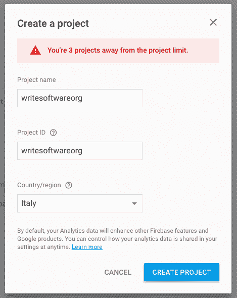
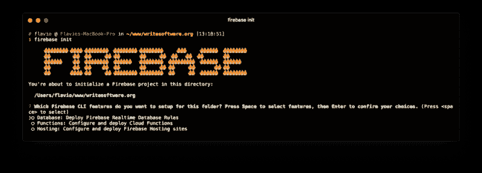
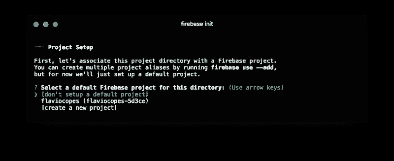
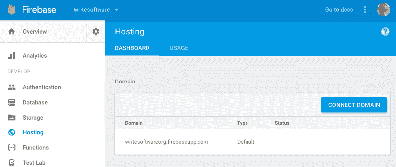
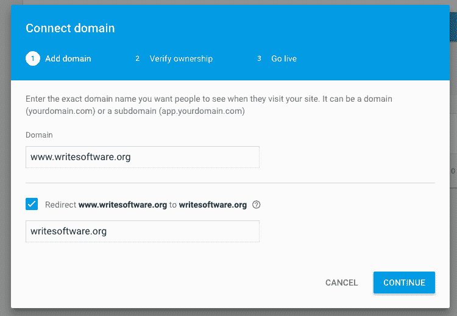

# 如何开始使用 Firebase 托管

> 原文：<https://www.freecodecamp.org/news/how-to-get-started-using-firebase-hosting-439d4bd45cb6/>

> 对学习 JavaScript 感兴趣？在 jshandbook.com 获得我的电子书

Firebase 是一个移动和 web 应用程序开发平台，由 Firebase，Inc .于 2011 年开发。它于 2014 年被谷歌收购，并被纳入谷歌云服务。现在，它是谷歌云产品的旗舰产品。

Firebase 是一个复杂的产品，主要面向移动应用。

我们将在本文中讨论的一个鲜为人知的特性是 Firebase 高级虚拟主机服务。

### Firebase 托管功能

Firebase 托管为静态网站提供托管，例如

*   可以使用静态站点生成器生成的站点
*   使用服务器端 CMS 平台构建的网站，您可以从中生成网站的静态副本

你可以托管任何东西，只要它不是动态的。举例来说，如果你使用 Disqus 或者脸书评论，WordPress 博客几乎总是一个不错的静态站点。

Firebase Hosting 通过 Fastly CDN 提供文件，使用 HTTPS，并提供自动 SSL 证书，支持自定义域。

它的**免费层是慷慨的**,如果你不再需要它，还有便宜的计划。它对开发人员非常友好，提供了一个 CLI 界面工具、一个简单的部署过程和一键回滚。

### 为什么应该使用 Firebase 托管？

Firebase 是部署静态网站和单页面应用程序的好选择。

我喜欢使用 Firebase 托管，主要是因为我测试了许多不同的提供商，Firebase 在多个地理位置提供了令人敬畏的速度，而不需要在顶部安装单独的 CDN，因为 CDN 是免费内置的。

虽然拥有自己的 VPS 是一个非常好的选择，但是为一个简单的网站管理自己的服务器的开销是不值得的。我更喜欢关注内容而不是运营，就像我在 Heroku 上部署一个应用程序一样。

Firebase 比 Heroku 更容易安装。

### 安装 Firebase CLI 工具

使用以下命令安装 Firebase CLI

```
npm install -g firebase-tools
```

或者

```
yarn global add firebase-tools
```

运行以下命令，使用 Google 帐户进行身份验证(我假设您已经有了一个 Google 帐户)

```
firebase login
```

### 在 Firebase 中创建一个项目

转到[https://console.firebase.google.com/](https://console.firebase.google.com/)并创建一个新项目。



现在，在控制台中，从您正在工作的站点的根文件夹运行以下命令:

```
firebase init
```



firebase init

按空格键选择“托管”选项，然后回车确认您的选择。

现在，您需要选择要将站点部署到的项目。



选择“创建新项目”。

现在，您可以选择包含站点静态版本的文件夹。比如`public`。

你会被问到两个关于应用程序配置的问题。对他们两个回复“**否**”:

*   配置为单页 app(将所有 URL 重写为/index.html)？
*   文件 public/index.html 已经存在。覆盖？

这将阻止 Firebase 添加自己的默认 index.html 文件。

现在，你可以走了:


### 配置站点

Firebase CLI 应用程序在根站点文件夹中创建了`firebase.json`文件。

在本文中，我将通过在`firebase.json`文件中添加一点配置来讲述如何在 Firebase 主机中配置一个简单的特性。

我想在所有的站点资产上设置 Cache-Control header 指令——图像、CSS 和 JS 文件。

一个干净的`firebase.json`文件包含以下内容:

```
{   "hosting": {    "public": "public",     "ignore": [       "firebase.json", "**/.*",       "**/node_modules/**"     ]   } }
```

它告诉 Firebase 站点内容在哪里，以及应该忽略哪些文件。随意添加您拥有的所有文件夹，除了`public`。

我们将在那里添加一个新属性，名为`headers`:

```
{   "hosting": {     "public": "public",     "ignore": [       "firebase.json",      "**/.*",       "**/node_modules/**"    ],     "headers": [       {         "source" : "**/*.@(jpg|jpeg|gif|png|css|js)",         "headers" : [ {           "key" : "Cache-Control",           "value" : "max-age=1000000" //1 week+         } ]       }     ]   } }
```

正如你所看到的，我们告诉所有以`jpg|jpeg|gif|png|css|js`结尾的文件，Firebase 应该应用`Cache-Control:max-age=1000000`指令，这意味着所有资产都被缓存超过 1 周。

### 发布网站

当您准备好发布站点时，您只需运行以下命令，Firebase 就会处理好一切。

```
firebase deploy
```

你现在可以打开[https://yourproject.firebaseapp.com](https://yourproject.firebaseapp.com/)，你应该看到网站运行。

### 自定义域

下一个合乎逻辑的步骤是让您的站点使用自定义域。

前往[https://console.firebase.google.com/project/_/hosting/main](https://console.firebase.google.com/project/_/hosting/main)并点击“连接域”按钮:



该向导将要求您输入域名，然后它会提供一个 TXT 记录，您需要添加到您的主机 DNS 面板，以验证该域。

如果域是全新的，可能需要一段时间才能通过这一步。

一旦完成，界面会给你两个 **A 记录**添加到你的主机 DNS 面板。

如果你设置了`yourdomain.com`，不要忘记通过重定向来设置`www.yourdomain.com`。



现在你只需要等待你的主机更新 DNS 记录和 DNS 缓存刷新。

此外，请记住，您的 SSL 证书是自动提供的，但需要一些时间才能生效。

> 对学习 JavaScript 感兴趣？在 jshandbook.com 获得我的电子书