# 如何使用你的 API 优先平台让你的原型产品化

> 原文：<https://www.freecodecamp.org/news/how-to-use-api-first-platforms-to-build-your-websites-faster-part-2-68085d7cdf36/>

作者:迈克·塞齐勒夫斯基

# 如何使用你的 API 优先平台让你的原型产品化

在本文的第一部分中，我们展示了一种使用 API 优先平台构建静态但动态网站的方法。这是您可以用来快速构建业务应用程序原型的许多方法之一。

在这篇文章中，我们将把它带到下一个层次。我们希望强化原型，以便它可以投入生产环境。


Photo by [Patrick Hendry](https://unsplash.com/photos/1ow9zrlldJU?utm_source=unsplash&utm_medium=referral&utm_content=creditCopyText) on [Unsplash](https://unsplash.com/search/photos/mountain-bike?utm_source=unsplash&utm_medium=referral&utm_content=creditCopyText)

但是要做到这一点，我们需要克服一些静态网站中不存在的安全问题。我们如何连接我们的应用程序的四个不同的构建块来实现业务流程的自动化？我们如何在不降低现有迭代速度的情况下实现这一点？见见扎皮尔。

### 但是首先——到目前为止我们已经建立了什么

如果你不记得，我们已经创建了一个工作框架[怀旧。io](http://nostalgia.glitch.me)——过去技术专家的市场。这是一个由一些轻量级 UI 和功能组合而成的静态网站，建立在四个 API 优先的平台(Contentful、Algolia、Timekit 和 Voucherify)之上。

简而言之，该应用程序允许你浏览技术，(全文)搜索专家，在他们的日历中找到并预订咨询时段，最后让结账页面验证并接受唯一的优惠券代码。

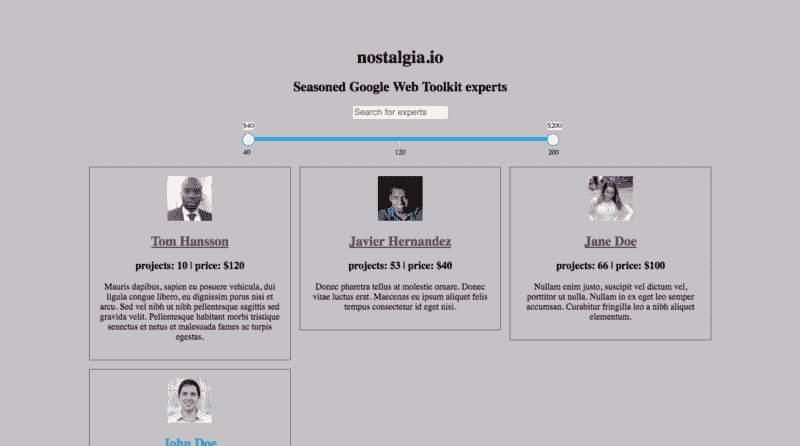

快乐之路——当任何一个汤姆、迪克或哈利带着他的促销代码进入市场，并最终以折扣价确认预订——运作得相当顺利。请记住，您可以在这个[故障存储库](https://glitch.com/edit/#!/nostalgia)上看到它的运行并摆弄源代码。

但是，我们仍然有许多不愉快的道路。其中最痛苦的是增加一个新的专家。现在，它需要几个手动步骤:

*   向 Contentful 添加专家实体
*   传播到 Algolia 搜索
*   在 Timekit 中分配日历资源
*   将优惠券标记为已使用，因此它不再有效

问题是，你不能使用我们当前的“静态网站”方法来自动化这些操作。这是因为我们的 API 提供者不允许(谢天谢地)使用公开可用的 API 密钥进行这种类型的数据管理。每个 SaaS 平台提供两种授权模式:

*   客户端:在网络和移动应用上使用的有限功能集(每个人都可以看到 API 密钥)
*   秘密:完全控制访问只能在后端层使用

因为我们还没有后端，所以我们需要找出如何避开这些限制，而不需要配置后端框架和 web 服务器基础设施。

### 见见扎皮尔

> “Zapier 是一个工具，它可以让你连接每天使用的应用程序，以自动化任务并节省时间。”—扎皮尔入门教程

事实上，当你想自动化一些个人操作时，比如“将我批准的迷因存储在我的 Dropbox 文件夹中”，你可能已经尝试过 [Zaps wonderland](https://zapier.com/apps/integrations) 然而，你可能已经错过了，今天，扎皮尔不仅仅是这样。自 2011 年启动以来，它已经走过了漫长的道路。

他们投入了大量精力来提供一个企业级平台，该平台提供了以可扩展的方式将软件平台的各个部分粘合在一起的构建块。

你可以在他们的市场上找到数以千计的插件，这使得 Zapier 成为一个强大的工具。在一个小时之内，您可以快速地将众多流行的软件供应商、不同的部门以及最终的企业连接成一个整体。在下一节中，我们将向您展示如何通过使怀旧市场更加强大和安全来利用 zaps 的力量。

### 向 Contentful 和 Algolia 添加新专家

第一件事是自动创建一个新实体。为此，我们需要一个在线表格。我们可以构建并托管一个简单的 web 应用程序，将 HTML 表单与 Contentful 连接起来，但是我们能以某种方式更快地获得它吗？让我们敲开扎皮尔目录的门。键入“forms”后，列表的第一个位置被 Typeform 占据。我们检查描述，它有我们需要的一切，所以让我们试一试。

#### 简而言之，扎皮尔是如何工作的？

在幕后，都是关于调用 HTTP 请求和捕获 webhooks。Zapier 提供的是一个认证层和一个直观的 UI，用于将一种数据格式映射到另一种数据格式。映射过程归结为调用一系列连接器(zap ),这些连接器获取、转换数据，并沿管道向下推送数据。每个管道都以一个被 webhook 激活的所谓触发器开始。让我们建造一个。

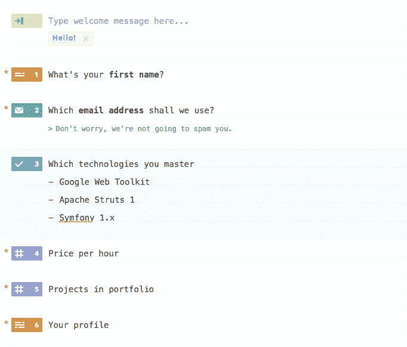

Typeform editor

### 第一个微小的障碍

现在，我们计划展示 Typeform 如何收集创建专家所需的数据，但我们不会这样做。原因很奇怪。webhook 正确地命中了 Zapier，但是数据格式不知何故被破坏了。

尽管文本输入处理得很好，但我们还是被该技术的多选输入卡住了。当请求有效负载出现在 Zapier 中时，我们放入表单的值没有出现。当我们从多选改为一组三个布尔值时，也出现了同样的问题。

因此，我们决定将提供者改为 survey monkey——结果发现向 Zapier 发送表单内容可以在年度保费计划中使用。最后，我们给了 WuFoo forms 一个机会，它们非常有效。

虽然我们花了一些时间来定位问题，但获得工作表单仍然比从头构建 webapp 更快。作为一条一般性建议，我们建议现在计划使用官方 Zaps 时要更加谨慎——即使是来自知名提供商。

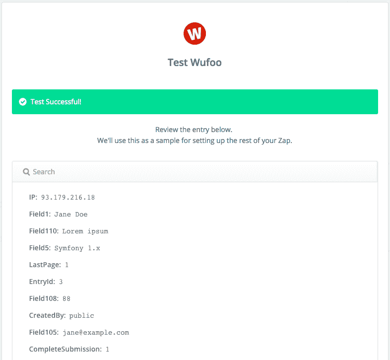

A successful WuFoo form submit handling

### 主要障碍是…

在完成 WuFoo Zap 配置之后，我们让我们的设置监听专家表单提交事件。让我们转换数据，使其符合内容模型。

使用官方的 Contentful Zap，转换非常简单:只需从表单中取出一个字段，并将其映射到相应的实体字段，如下图所示:

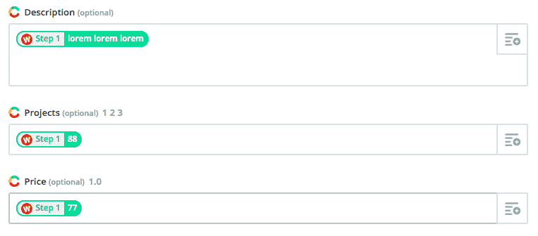

直到我们想要描绘科技。你可能记得，每个专家都能掌握许多技术。为了正确地映射这种一对多的关系，我们应该在特定的对象结构中提供技术的内容丰富的实体 id，类似于:

```
{ sys: { type: “Link”, linkType: “Entry”, id: “5oKmKwfdjGO2cCaCkwamKW”}}
```

而不仅仅是来自五福形式的普通名字。有人可能会建议我们可以将这项技术映射到一个 JSON 对象中，但不幸的是，这是不可能的。Contentful Zap 将每个字段作为一个字符串发送。因此，实际命中内容丰富的 API 的有效负载看起来像:

```
{
  "fields": {
    "technologies": {
      "en-US": ["   { \n     \"sys\": {\n        \"type\": \"Link\",\n        \"linkType\": \"Entry\",\n        \"id\": \"5oKmKwfdjGO2cCaCkwamKW\"\n      }\n    }"]
    },
    "name": {
      "en-US": "Test Testowicz"
    }
  }
}
```

并在内容端导致 422 错误。

### …以及如何克服它

此时，我们决定检查管道中的下一个 Zap，看看是否有我们没有预见到的其他障碍。事实证明，Algolia 的连接器不是很成熟。由于业务正在推进原型交付，我们得出的结论是，我们不想浪费更多的时间来测试这些 zap。我们决定切换到手动飞行模式。

幸运的是，Zapier 带有[代码](https://zapier.com/help/code/) zap。[在 2 年前推出了](https://zapier.com/blog/zapier-code/)，它的意思是使用 JavaScript 和 Python 中的**自定义代码来执行非标准操作——包括调用第三方 API！**

这对我们的“快速迭代”方法来说是完美的。我们获得了良好的旧脚本功能，我们仍然不需要设置后端。让我们看看它如何帮助我们解决有争议的问题。

### 代码 Zap 正在运行

让我们删除内容丰富的 Zap，将代码放在适当的位置。选择 JavaScript 后，您应该会进入“编辑模板”视图。现在我们需要做三件事:

*   将来自数据管道前一阶段的数据映射到可以在代码中直接使用的变量中
*   使用变量以适当的格式准备有效负载
*   通过 HTTP 调用将有效负载发送给 Contentful

第一件事非常简单，因为输入数据管理器会神奇地建议相应的字段:

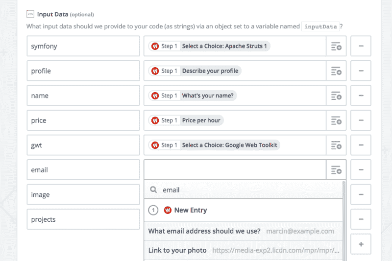

一旦我们有了输入，没有什么可以阻止我们手动发送请求。快速浏览 Contentful 的 [API 参考](https://www.contentful.com/developers/docs/references/content-management-api/)，我们看到:

```
var technologies = [];

if (inputData.gwt) {
  technologies.push({
    sys: {
      type: "Link",
      linkType: "Entry",
      id: "7Dtej0GnXqw6cSIMmA6Cko"
    }
  });
}

if (inputData.symfony) {
  technologies.push({
    sys: {
      type: "Link",
      linkType: "Entry",
      id: "5S2iYV7inK6KyokCkwu4ss"
    }
  });
}

if (inputData.struts) {
  technologies.push({
    sys: {
      type: "Link",
      linkType: "Entry",
      id: "5oKmKwfdjGO2cCaCkwamKW"
    }
  });
}

fetch('https://api.contentful.com/spaces/n763nxcwuf4y/entries',{
  method: 'post',
  headers: {
    "Authorization": "Bearer <hidden>",
    "Content-Type": "application/vnd.contentful.management.v1+json",
    "X-Contentful-Content-Type": "expert"
  },
  body: JSON.stringify({
    fields: {
      name: {
        'en-US': inputData.name
      },
      price: {
        'en-US': parseInt(inputData.price)
      },
      projects: {
        'en-US': parseInt(inputData.projects)
      },
      description: {
        'en-US': inputData.profile
      },
      technologies: {
        'en-US': technologies
      }
    }
  })
})
.then(function(res) {
  return res.json();
})
.then(function(json) {
  var output = { expert: json } 
  callback(null, output);
})
.catch(callback);
```

contentful.js

要注意三件事:

*   Zapier 支持 fetch，但这是唯一的现代 JS 特性。在引擎盖下，它运行节点 v4
*   你必须调用“callback ”,否则 Zapier 不知道异步过程何时结束
*   有 1 秒的超时限制

现在，您可以启动测试来查看实体是否在 Contentful 中持久化。

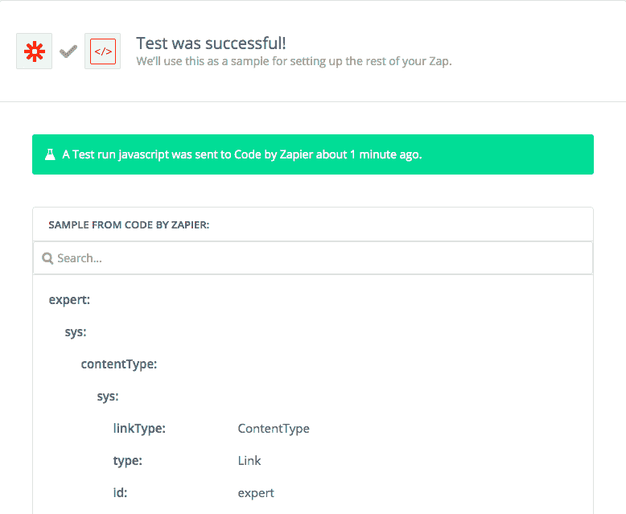

### 将专家照片上传到 Contentful

到目前为止，我们已经设法添加了一个专家实体，并将他们分配到各自的技术中。一件重要的东西不见了——照片。

Contentful 将照片(和其他文件)存储在一个称为资产的独立抽象中。它的棘手之处在于，你不能在创建实体时只上传一张照片(就像我们在上一步中所做的那样)。上传过程如下所示:

*   创建一个提供资源链接的资产对象
*   触发资源处理(对于图像，它只是下载文件)
*   将资产分配给专家实体

可悲的是，虽然官方 Zap 似乎有这个选项，但它在我们的情况下不可用。这背后的原因是 Zap 在上传后不会返回资产 id 或任何链接。实际上，我们不知道如何将专家与资产联系起来。现在怎么办？代码 zap 又来了！

实际上，我们必须使用它两次:

*   创建资产的第一个请求

```
fetch('https://api.contentful.com/spaces/n763nxcwuf4y/assets',{
  method: 'post',
  headers: {
    "Authorization": "Bearer <hidden>",
    "Content-Type": "application/vnd.contentful.management.v1+json"
  },
  body: JSON.stringify({
    fields: {
      title: {
        'en-US': inputData.name
      },
      file: {
        'en-US': {
          "fileName": inputData.name+".jpg",
          "upload": inputData.pictureLink,
          "contentType": "image/jpeg"
        }
      }
    }
  })
})
.then(function(res) {
  return res.json();
})
.then(function(json) {
  callback(null, json)
})
.catch(callback);
```

*   第二个下载图像的

```
var assetURL = "https://api.contentful.com/spaces/n763nxcwuf4y/assets/" + inputData.assetId + "/files/en-US/process";

fetch(assetURL, {
  method: 'put',
  headers: {
    "Authorization": "Bearer <hidden>",
    "X-Contentful-Version": "1"
  }
})
.then(function(res) {
  callback(null, []);
})
.catch(callback);
```

在您分别测试了这些请求之后，您最终可以使用 InputData 将它们粘合起来，并将其放在创建实体的 Zap 之前和 WuFoo zap 之后。总而言之，我们得到以下管道:

*Wufoo >代码(创建资产)>代码(处理资产)>代码(创建* g 实体)

您可能已经注意到，每个 zap 中的代码都遵循复制、粘贴和修改方案。很容易改变请求细节和打乱调用顺序。这不是你所习惯的动力，但对原型阶段来说已经足够好了。

### 创建 Timekit 日历

实施预订的时刻终于到来了。由于 Timekit 不提供任何官方频道，我们被迫再次邀请我们的老朋友。您可能记得，要获得专家的日历，您应该在 Timekit 中创建一个资源，然后获得分配给它的日历实例。猜猜看，Timekit API 对开发人员非常友好，他们允许您通过一个请求来实现它:

```
var email = inputData.email;

fetch('https://api.timekit.io/v2/resources?include=calendars', // notice the include param
{
  method: 'post',
  headers: {
    "Authorization" : "Basic <hidden>",
    "Content-Type": "application/json"
  },
  body: JSON.stringify({
    name: email,
    timezone: 'Europe/Warsaw'
  })
})
.then(function(res) {
  return res.json();
})
.then(function(resource) {
  callback(null, resource);
})
.catch(callback);
```

timekit.js

现在你可能已经知道接下来会发生什么了。我们只需要将 zap 放在正确的顺序中，以确保业务流程被覆盖。由于我们希望在专家实体中存储 Timekit 链接，我们应该将这个 Zap 放在下面的管道中:

*Wufoo >代码(创建资产)>代码(处理资产)>代码(创建日历)>代码(创建实体*

### 普及全文搜索

自动化这一步骤的最后一部分是让专家可以被搜索到。如果你不记得我们是如何在 Algolia 的帮助下接近它的，请前往[第一部分](https://medium.freecodecamp.org/how-to-use-api-first-platforms-to-build-your-websites-faster-e917e8318ee)来刷新你的记忆。然后，您可以直接跳到代码:

```
var objects = {
	requests: []
};

if (inputData.gwt) {
	objects.requests.push({
		action: "addObject",
		body: {
			name: inputData.name,
			description: inputData.description,
			projects: inputData.projects,
			price: inputData.price,
			contentfulID: inputData.contentfulID,
			technologies: { name: "Google Web Toolkit" }
		}
	});	
}

if (inputData.struts) {
	objects.requests.push({
		action: "addObject",
		body: {
			name: inputData.name,
			description: inputData.description,
			projects: inputData.projects,
			price: inputData.price,
			contentfulID: inputData.contentfulID,
			technologies: { name: "Apache Struts 1" }
		}
	});	
}

if (inputData.symfony) {
	objects.requests.push({
		action: "addObject",
		body: {
			name: inputData.name,
			description: inputData.description,
			projects: inputData.projects,
			price: inputData.price,
			contentfulID: inputData.contentfulID,
			technologies: { name: "Symfony 1.x" }
		}
	});	
}

fetch('https://N675AF3ESI.algolia.net/1/indexes/experts/batch',{
  method: 'post',
  headers: {
    "X-Algolia-API-Key" : "<hidden>",
    "X-Algolia-Application-Id" : "N675AF3ESI"
  },
  body: JSON.stringify(objects)
})
.then(function(res) {
  return res.json();
})
.then(function(resource) {
  callback(null, resource)
})
.catch(callback);
```

algolia.js

当您配置此步骤时，您将涵盖整个过程:

*   有人通过表单添加了一个专家
*   我们的“软件”会在 Timekit 中创建一个相应的日历
*   专家实体存储在 Contentful 中(与照片一起)
*   通过添加到 Algolia 索引，专家变得可搜索

说到怀旧过程的内部部分，就是这样。现在，让我们给我们的优惠券一个机会来做这项工作，并推动一些客户向我们走来！

### 兑换优惠券

让我们从回忆怀旧优惠券是如何运作的开始。营销团队想出了两个不同的活动，有数千个独特的优惠券代码:

*   25%的折扣—例如:nstlg-CCAMIDFf、nstlg-wZK4CoLs、nstlg-V8eV9A3p
*   5 美元折扣—例如 uub-nstlg、afl-nstlg、yeq-nstlg

现在，当您将其中一个放入优惠券框时，代码将根据 Voucherify API 进行验证，并应用相应的折扣。当您最终选择了该时间段并将预订请求发送到 Timekit 时，代码会随有效负载一起发送，并保存在 Timekit 实体中。

为了防止唯一代码被再次使用，我们需要在 Voucherify 中将它标记为已兑现。我们可以使用 Voucherify 小部件来实现这一点(只需将 [validate](https://docs.voucherify.io/reference#vouchers-validate) 方法替换为[redempt](https://docs.voucherify.io/reference#redeem-voucher-client-side)方法)，但是我们希望只有在运营团队确认了预订(在 Timekit dashboard 中完成)后，才将其标记为 used **。由于企业希望从自动确认切换到手动确认，我们被迫离开愉快的静态网站环境，再次求助于 Zapier。**

### 抓网钩

如前所述，你会徒劳地在 Zap 的目录中寻找 Timekit。我们必须找到另一种方式来通知预订确认。幸运的是，Webook zap 在这方面帮了大忙。

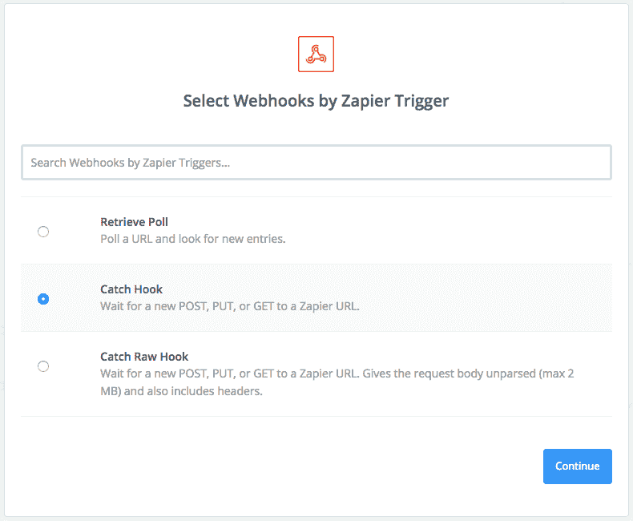

当您完成 5 步配置流程时，您将获得一个唯一的端点 URL，它可用于通过 HTTP 请求发送通知。您的下一个任务是将它放在特定事件下的 Timekit 中的 webhook 标注中——在我们的例子中，它是一个预订确认。

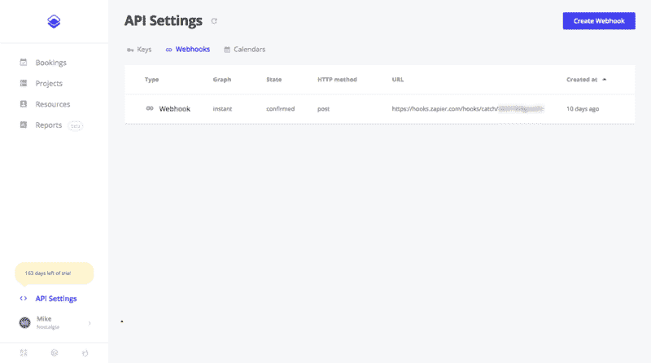

### 最后一笔——处理赎回

最后一步是调用 redempt 方法将优惠券标记为已使用。为此，我们可以使用官方的[vouchi fy Zap](https://zapier.com/developer/invite/62387/cdcdf9275d825dff01c4da836b4c445f/)。您需要做的就是授权 Zapier 调用赎回，并将 webhook zap 捕获的客户详细信息映射到适当的结构中:

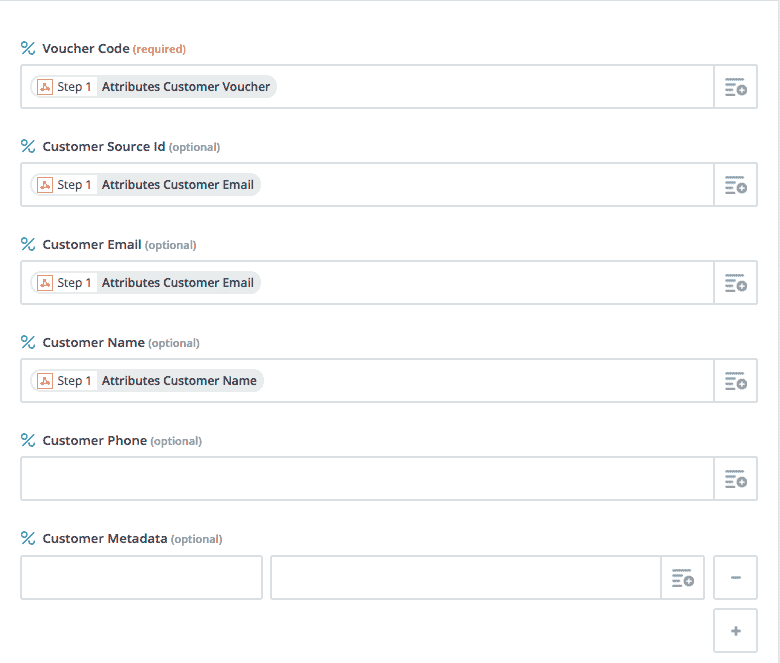

运行一些测试后，我们可以看到 Voucherify 正在跟踪优惠券的兑现:

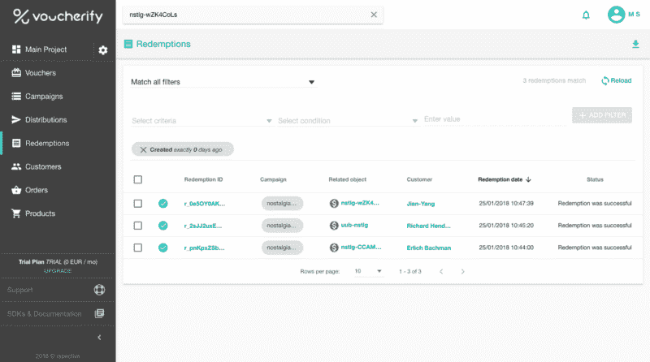

既然兑换得到了妥善处理，营销部门就可以立即推出新的活动，而开发人员也不必参与生成、分发和接受新的优惠券代码。

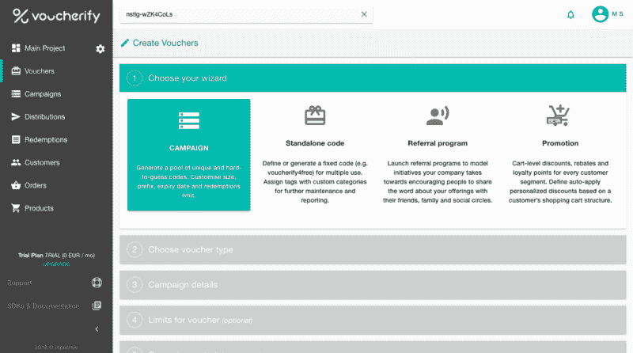

### 快速和肮脏

恭喜你。仅在这两条 Zapier 管道中，我们就以一种安全且可投入生产的方式构建了四个构件。我们承认这个解决方案看起来又快又脏，但是它确实有效，而且已经在合理的时间内交付了。

当然，我们可以通过删除重复等方式来改进代码。但不管怎样，这只是一个原型，当企业认为他们希望早期客户遵循的方向有意义时，它将被重写。

当你第一次进入 Zapier 插件目录时，一切看起来都很明亮。但是魔鬼就像他们说的，存在于细节中。老实说，在我们开始写这篇文章之前，我们对 Zapier 的设置非常乐观。但是当我们越来越深入细节的时候，我们面临着我们计划使用的 zaps 的问题。我们突出显示了它们，以便您可以在途中避免它们。我们希望教会你如何利用鲜为人知的 Zapier 特性来弥补差距。

请，请，请记住“API 第一平台<> Zapier”串联不是一个闪亮的锤子，你可以用它来敲每一个可能的钉子。我们想强调的是，有时有比从头开始编写代码更快、同样可靠的方法来交付业务成果。

—

如果你喜欢这些想法，并且想学习如何使用 API wonderland 来发布真实的、经过实战检验的业务应用程序，你可能会对我们的 [**最近的系列**](https://hackernoon.com/building-an-online-marketplace-from-scratch-introduction-738839e4e76) 感兴趣。

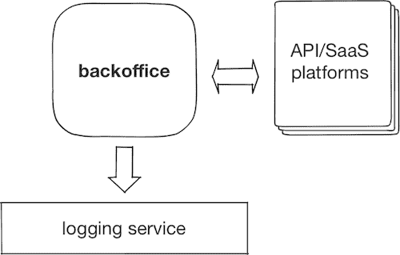