# 如何利用数据科学了解是什么让葡萄酒好喝

> 原文：<https://www.freecodecamp.org/news/using-data-science-to-understand-what-makes-wine-taste-good-669b496c67ee/>

数据科学。它被吹捧为 21 世纪最性感的工作。每个人——从公司到个人——都在试图理解它并采用它。如果你是一名程序员，你肯定正在经历 FoMo(害怕错过)！只要看看这个术语随着时间的推移有多流行就知道了:

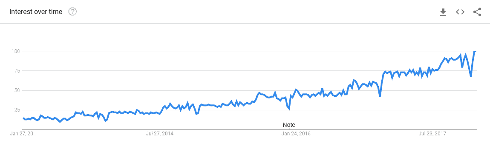

Data Science popularity level in last 5 years

根据 Indeed 的数据，美国数据科学家的平均工资超过 12 万美元。他们目前也拥有收入最高的工作，中位数为 6 万美元。Glassdoor 还将其命名为“2016 年最佳工作”，它也在 Glassdoor 上排名第一。

但是他们一直在谈论的科学是什么？继续读！

### 目录

*   [对数据科学的需求](https://medium.com/p/669b496c67ee#9877)
*   谁将从本教程中获益最多
*   [入门](https://medium.com/p/669b496c67ee#9b0b)
*   [数据分析](https://medium.com/p/669b496c67ee#5572)
*   [探索特征和数据可视化技术之间的关系](https://medium.com/p/669b496c67ee#7772)
*   [异常值检测](https://medium.com/p/669b496c67ee#67c8)

### 数据科学有什么需求？

简单来说，数据科学帮助你成为**数据驱动的**。数据驱动的决策有助于公司更好地了解他们的客户，并建立伟大的企业。

我们生活在信息爆炸的时代。公司根据其经营的业务类型收集不同种类的数据。例如，对于一家零售店来说，数据可能是顾客在一段时间内购买的产品种类以及他们的消费金额。对网飞来说，这可能是关于他们的大多数用户观看或喜欢什么节目，以及他们的人口统计数据。

商业决策通常依赖于大量的直觉和领域知识。现在，随着数据变得越来越大，我们很难理解它。我们只是没有足够的心智能力来处理充满大量信息的大型数据集。

数据科学的目的是告诉你一个故事，并帮助你将它可视化。

使用它，您可以:

*   从数据中获得大量洞察力，否则可能无法发现
*   做出更快的决定，因为计算机毕竟比人快！
*   消除决策背后的大量偏见。纵观历史，人类总是倾向于让他们的感觉和偏见影响他们的判断…


但与人类不同，计算机不需要坐在商务会议上，争论为什么某个决定比其他的好。

既然我们已经明白了这是怎么回事，是时候学习它了！

### 谁将从本教程中获益最多:

*   有一些编程基础知识，想了解数据科学及其应用的人。
*   刚开始觉得数学和统计学有点让人不知所措的人。
*   如果你对葡萄酒有一点点兴趣，那就去读读吧——只是为了好玩！

### 我们开始吧！

在本教程中，您将了解如何分析葡萄酒数据集，观察其特征，并从中提取不同的见解。完成本教程后，您将:

*   了解如何使用数据科学来分析数据并从中获得洞察力。
*   对葡萄酒有所了解。；-)


即使你不喝酒，也没关系——你仍然会成为一个崭露头角的侍酒师，或者葡萄酒爱好者(是的，这是一个真实的术语！).

在下一篇博文中，你会看到机器学习形式的应用数据科学:

*   什么是 ML，使用它可以解决什么样的问题？
*   如何使用 ML 训练分类器来识别好酒和坏酒？
*   不同的性能指标

#### 阅读前了解:

我假设你已经掌握了一些编程知识。 **Python** 的一些编程知识是必要的，所以如果你懂的话，你会发现这个教程相对简单。如果你不知道，我强烈推荐你去看看这个关于 Python 的[介绍的免费课程。](https://in.udacity.com/course/introduction-to-python--ud1110)

**为什么是 Python？**因为它正迅速成为[数据科学](https://www.quora.com/Why-is-Python-a-language-of-choice-for-data-scientists)的首选语言。它非常容易掌握和学习，Python 生态系统有很多工具和库，可以虚拟地构建任何东西——从 web 服务器、机器学习包、统计、深度学习到物联网。Python 也是互联网上最活跃的社区之一，比如[栈溢出](https://medium.freecodecamp.org/a-path-for-you-to-learn-analytics-and-data-skills-bd48ccde7325)。

一些像 numpy 和 pandas 这样的图书馆的基础知识也会有所帮助，虽然不是强制的。

#### **本教程需要的内容:**

*   最好是安装了 [Python](https://askubuntu.com/questions/865554/how-do-i-install-python-3-6-using-apt-get) 的基于 Linux 的发行版(Ubuntu 或 Linux Mint)。
*   安装[蟒蛇](https://conda.io/docs/user-guide/install/linux.html)。这是一个开源的包管理系统和环境管理系统，主要用于 Python 程序。为了训练和测试我们的机器学习模型，您将使用一个非常流行的开源库 scikit-learn。
*   从[这个库](https://github.com/booleanhunter/ML-supervised-learning/tree/master/game-of-wines)下载项目文件到你的机器上。然后打开一个终端，`cd` 到你的项目文件夹，运行 `*pip install -r requirements.txt*` 来安装依赖项。
*   **或者**，你也可以上传项目文件到 [FloydHub](http://floydhub.com) 并运行你的代码，没有设置的麻烦。如果你没有基于 Linux 的系统，我推荐它。

您将使用 IPython(交互式 Python)笔记本文件来运行您的代码。下载完项目文件后，打开你的终端，`cd` 到你的项目文件夹，运行`**jupyter-notebook**` *。*这将在端口 8888 上的默认浏览器中打开一个新窗口。如果您使用的是 FloydHub，同样的笔记本文件也可以从那里运行。

你会发现两个 IPython 笔记本文件。从列表中选择一个名为`**game-of-wines.ipynb**`的。另一个笔记本文件包含本教程的完整源代码。

#### **如何使用这款笔记本**

笔记本的单元格中已经有了一些模板代码和解释，供您开始使用。在一些地方，你会发现代码已经为你写好了，只是为了让它更容易。您还可以在任何需要的地方找到评论和链接。

要执行单元格中的代码，用鼠标点击它，然后选择书的标题栏上的`*run*` 选项。

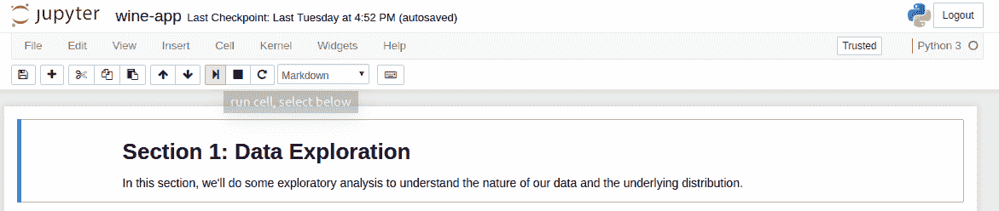

### 好吧，干杯！让我们啜饮…哎呦，研究我们的葡萄酒数据。

前几天我在网上搜索一些有趣的开源数据。Kaggle 有一个非常活跃的社区，在那里你可以很容易地搜索不同种类的数据集并解决挑战。另一个寻找数据集的好地方是加州大学欧文分校的机器学习库。

[UCI 机器学习库](http://archive.ics.uci.edu/ml/machine-learning-databases/wine/)有两套[葡萄酒数据](https://archive.ics.uci.edu/ml/datasets/wine+quality)。一个数据集包含红葡萄酒的信息，另一个包含白葡萄酒的信息。您的项目文件夹已经包含这两个文件。这些葡萄酒产自葡萄牙北部的地区 [Vinho Verde](http://www.vinhoverde.pt/en/about-vinho-verde) 。

首先，您将导入我们的数据分析所需的一些库。点击单元块，然后选择`run`命令加载所有单元块。

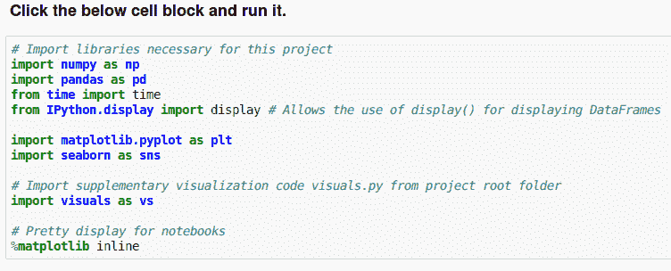

接下来，我们将数据集加载到笔记本中，并显示前 5 行。在笔记本的单元块中键入此代码，然后运行它:

```
# Load the Red Wines dataset
data = pd.read_csv("data/winequality-red.csv", sep=';')

# Display the first five records
display(data.head(n=5)) 
```

它将打印以下输出:

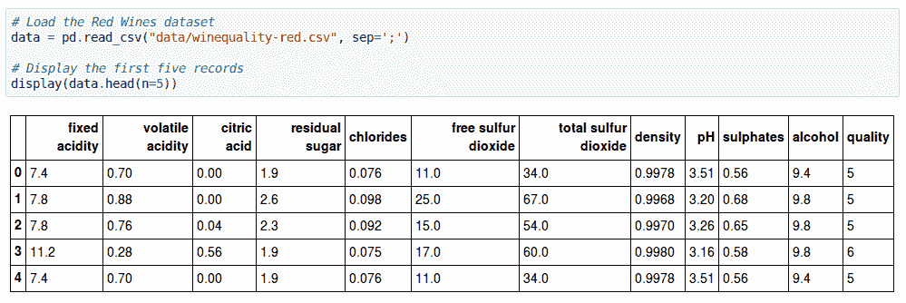

正如你所看到的，在数据集中每种酒有大约 12 种不同的特征。最后一栏，**质量，**是对一种特定葡萄酒的评价，从 1 到 10。

让我们看看这些列中是否有缺失的信息。在单元格块中键入以下内容:

```
data.isnull().any() 
```

输出显示没有任何列是空的。

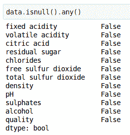

通过运行以下命令，我们可以获得更多关于数据集的信息:

```
data.info() 
```

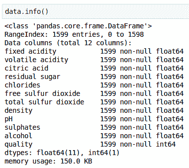

让我们试着对我们的葡萄酒进行一些初步分析。就我们的目的而言，让我们将所有评级为 7 及以上的葡萄酒视为非常好的质量，评级为 5 和 6 的葡萄酒为一般质量，评级低于 5 的葡萄酒为平淡质量:

```
n_wines = data.shape[0]

# Number of wines with quality rating above 6
quality_above_6 = data.loc[(data['quality'] > 6)]
n_above_6 = quality_above_6.shape[0]

# Number of wines with quality rating below 5
quality_below_5 = data.loc[(data['quality'] < 5)]
n_below_5 = quality_below_5.shape[0]

# Number of wines with quality rating between 5 to 6
quality_between_5 = data.loc[(data['quality'] >= 5) & (data['quality'] <= 6)]
n_between_5 = quality_between_5.shape[0]

# Percentage of wines with quality rating above 6
greater_percent = n_above_6*100/n_wines

# Print the results
print("Total number of wine data: {}".format(n_wines))
print("Wines with rating 7 and above: {}".format(n_above_6))
print("Wines with rating less than 5: {}".format(n_below_5))
print("Wines with rating 5 and 6: {}".format(n_between_5))
print("Percentage of wines with quality 7 and above: {:.2f}%".format(greater_percent))

# Some more additional data analysis
display(np.round(data.describe())) 
```

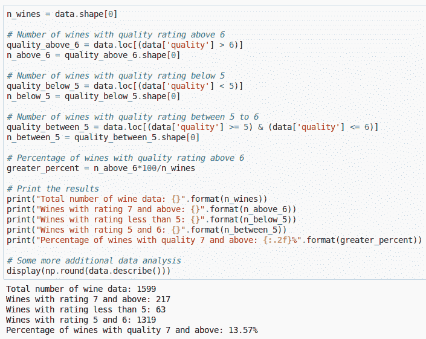

您也可以在图表上查看质量分布:

```
# Visualize skewed continuous features of original data
vs.distribution(data, "quality") 
```

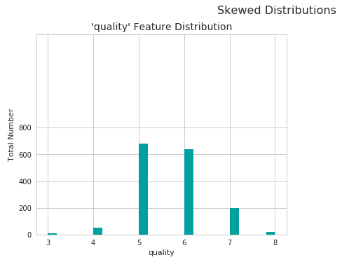

正如你所看到的，大多数葡萄酒属于中等质量。有很少的葡萄酒是非常高的质量和伟大的品尝，也很少有葡萄酒不是那么好。

我们还可以使用 pandas `**describe**`方法获得有用的统计数据，例如我们数据中特征的平均值、中值和标准差:

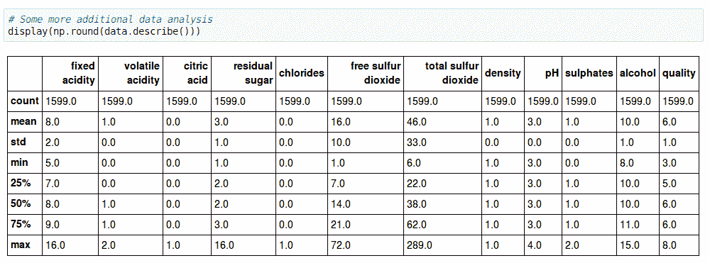

你应该知道的一些有用的统计数据:

*   **Mean(平均):**可能是大家最熟悉的一个。只需将给定特征的所有样本值相加，然后除以样本数。
*   **Median:** 首先你把所有的样本值按数字顺序排列在一个列表里。此列表中的中间数字将是中值。
*   **模式:**样本列表中出现次数最多的值。
*   **范围:**列表中最高值与最低值之差。
*   **标准差:**用来衡量一个集合中数值的离散程度。首先计算平均值，然后用平均值减去列表中的每个数字，并对结果求平方。然后计算那些平方差的平均值，最后计算它的平方根。

#### 现在，下一步是更详细地研究我们数据集中的特征。

葡萄酒的质量取决于一系列影响其味道、香气和风味的化学性质。所以，是的，即使酿酒被认为是一门艺术，如果你仔细想想，它实际上是相当科学的。

**在数据科学中，拥有领域知识可能是区分平庸和卓越见解的关键因素。**

### 是时候了解我们的葡萄酒词汇了！

葡萄酒含有不同比例的糖、酒精、有机酸、矿物和有机酸盐、[酚类化合物](https://en.wikipedia.org/wiki/Phenolic_content_in_wine)、色素、含氮物质、果胶、树胶、粘液、挥发性芳香化合物(酯、醛和酮)、维生素、盐和二氧化硫。

在葡萄酒品尝中，术语**酸度**指的是葡萄酒的新鲜、酸味和酸味。酿酒葡萄中有三种主要的酸——酒石酸、苹果酸和柠檬酸。它们的评价与酸度如何平衡葡萄酒中的甜味和苦味成分有关，如单宁。

*   **固定酸度**

    可滴定酸度，有时也称为固定酸度，是对葡萄酒中可滴定酸和游离氢离子总浓度的测量。一张[石蕊试纸](https://en.wikipedia.org/wiki/Litmus)可以用来鉴别给定的溶液是酸性还是碱性。最常见的可滴定酸是酒石酸、苹果酸、柠檬酸和碳酸。这些酸，以及更多数量较少的酸，要么自然存在于葡萄中，要么通过发酵过程产生。

*   **挥发性酸度**

    挥发性酸度主要是由葡萄酒中的细菌产生的乙酸及其副产品乙酸乙酯造成的，乙酸是醋特有的风味和香气的来源。挥发性酸度可能是腐败的指标，或者是制造过程中的错误——由受损的葡萄、暴露在空气中的葡萄酒等引起的。这导致醋酸细菌进入并繁殖，并产生令人不快的味道和气味。葡萄酒专家往往只需闻一闻就能分辨出这一点！
*   **柠檬酸**

    柠檬酸一般在酿酒葡萄中含量非常少。它作为一种防腐剂，被添加到葡萄酒中以增加酸度，补充特殊的味道或防止铁雾。它可以被添加到成品酒中，以增加酸度，给人一种“新鲜”的味道。然而，过量的添加会破坏味道。

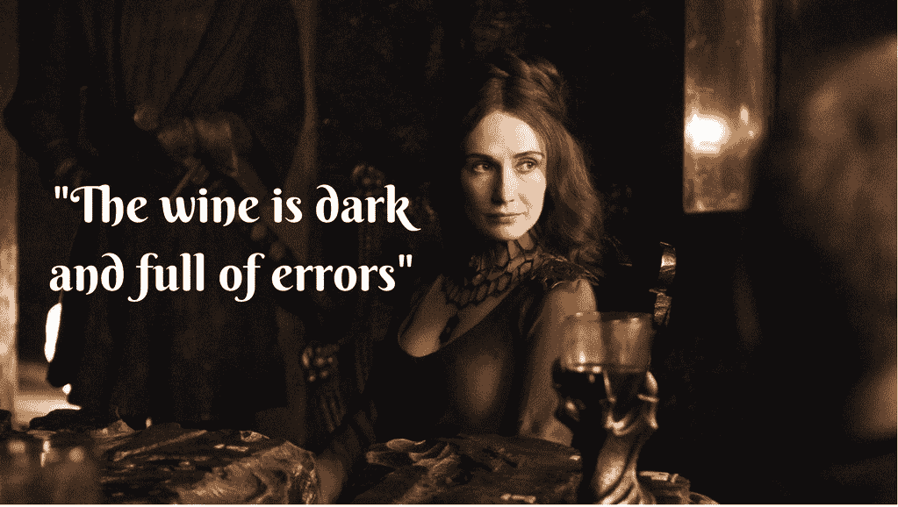

*   **残糖**

    **残糖**，简称 rs，是指发酵停止后剩余的任何天然葡萄**糖**(无论是否有意)。葡萄汁开始时非常甜，发酵会消耗掉糖分，因为酵母会尽情享用。

    在酿酒过程中，酵母通常会将所有的糖分转化为酒精，制成**干**酒。然而，有时并非所有的糖都被酵母发酵，留下一些剩余的甜味。

*   **氯化物**

    葡萄酒中氯化物的含量通常是其“[咸味](http://www.aromadictionary.com/articles/salt_article.html)的指标这通常受到酿酒葡萄生长地区、栽培方法以及葡萄种类的影响。太咸被认为是不可取的。合适的比例可以让酒[更香](http://wineoscope.com/2015/10/02/when-a-wine-is-salty-and-why-it-shouldnt-be/)。

*   **二氧化硫含量**

    二氧化硫以游离态和结合态存在于葡萄酒中，这两种形式的组合称为*总 SO2* 。这是最常见的防腐剂，通常由葡萄酒制造商添加，以保护葡萄酒免受空气和氧气的负面影响。添加了二氧化硫的葡萄酒通常会在标签上标明“含有亚硫酸盐”。它起着消毒剂的作用——添加它通常会杀死可能进入葡萄酒并破坏其味道和香气的有害细菌或酵母。当罗马人发现在空的葡萄酒器皿中燃烧硫磺蜡烛可以保持新鲜和没有醋味时，它首先被用于酿酒。很整洁，是吧？

*   **密度**

    又称比重，它可以用来测量葡萄酒中的酒精浓度。在发酵过程中，果汁中的糖转化为乙醇，二氧化碳作为废气。在生产过程中监控密度可以对这一转换步骤进行最佳控制，从而获得最高品质的葡萄酒。较甜的葡萄酒通常密度较高。

*   **pH**
    pH 代表氢的幂，是溶液中氢离子浓度的度量。通常，pH 值小于 7 的溶液被认为是酸性的，一些最强的酸接近 0。高于 7 的溶液被认为是碱性的。水的 pH 值是 7，因为它既不是酸也不是碱。

*   **硫酸盐**

    硫酸盐是硫酸的盐。他们不参与葡萄酒生产，但一些啤酒制造商使用硫酸钙——也被称为酿酒师的石膏——来纠正酿造过程中水中的矿物质缺乏。也增添了几分“犀利”的味道。

*   **酒精**

    啊，对了，酒精——派对成功的关键！酒精饮料至少从新石器时代(公元前 10，000 年)就存在了。少量饮用会给你内心温暖模糊的感觉，让你更善于交际。当然，更高的剂量也会让你昏过去。

#### 努力喝酒，我的数据科学家朋友！

### 探索特征和可视化之间的关系

现在你已经有了一些关于葡萄酒的领域知识，是时候探索更多了。我们的数据集包含一系列我们在上面看到的特征，例如酒精含量、残糖量和 pH 值。其中一些功能可能依赖于其他功能，一些可能不依赖。其中一些可能会影响我们的质量评级。

在数据科学或机器学习中，研究组成我们数据的特征并查看它们之间是否存在任何相互关系非常重要。

例如，pH 值会影响固定酸度水平吗？挥发性酸度水平与质量有关系吗？人们觉得酒精含量高的葡萄酒更好喝还是质量更好？

幸运的是，Python 有很棒的库，可以提供不同种类的可视化。让我们试着用我们的数据画一个散点图，观察它向我们展示了什么。

```
pd.plotting.scatter_matrix(data, alpha = 0.3, figsize = (40,40), diagonal = 'kde'); 
```

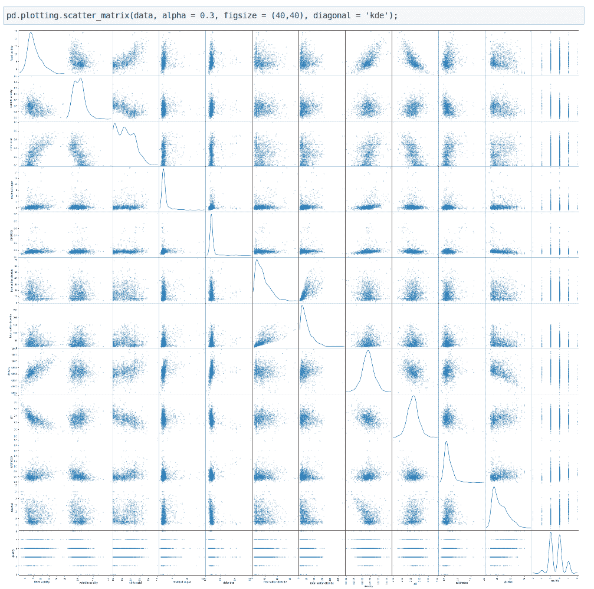

从上面的散点图我们可以得到一些有趣的细节。对于某些特征，分布看起来相当线性。对其他一些人来说，分布似乎是负偏态的。所以这证实了我们最初的怀疑——在一些特征之间确实存在一些有趣的相互依赖关系。

我们可以绘制特征之间相互关系的热图，这将有助于我们获得更多的见解。

```
correlation = data.corr()
# display(correlation)
plt.figure(figsize=(14, 12))
heatmap = sns.heatmap(correlation, annot=True, linewidths=0, vmin=-1, cmap="RdBu_r") 
```

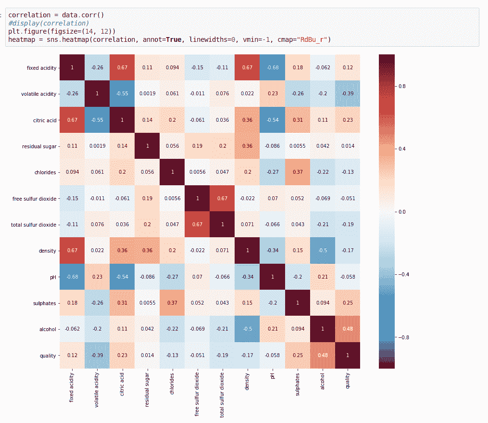

如您所见，正值的方块显示了要素之间的直接相互关系。值越高，这些关系就越强——它们会更红。这意味着，如果一个特性增加，另一个也会增加，反之亦然。

具有负值的正方形显示出相反的相互关系。这些值越负，它们的反比例就越大，它们就越蓝。这意味着，如果一个特性的值较高，另一个特性的值会变低。

最后，接近零的方块表示这些特征集之间几乎没有相关性。

很有趣吧？让我们更详细地探讨这些相互关系。

*   **pH 与固定酸度**

```
#Visualize the co-relation between pH and fixed Acidity

#Create a new dataframe containing only pH and fixed acidity columns to visualize their co-relations
fixedAcidity_pH = data[['pH', 'fixed acidity']]

#Initialize a joint-grid with the dataframe, using seaborn library
gridA = sns.JointGrid(x="fixed acidity", y="pH", data=fixedAcidity_pH, size=6)

#Draws a regression plot in the grid 
gridA = gridA.plot_joint(sns.regplot, scatter_kws={"s": 10})

#Draws a distribution plot in the same grid
gridA = gridA.plot_marginals(sns.distplot) 
```

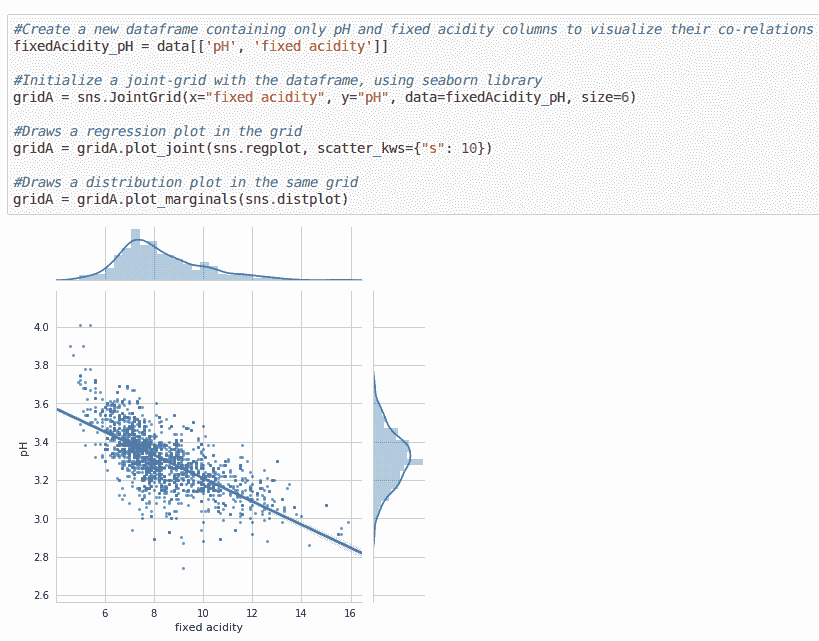

该散点图显示了 pH 值如何随着固定酸度水平的变化而变化。我们可以看到，随着固定酸度水平的增加，pH 值水平下降。有道理不是吗？毕竟，较低的 pH 值是高酸度的标志。

*   **固定酸度与柠檬酸**

```
fixedAcidity_citricAcid = data[['citric acid', 'fixed acidity']]
g = sns.JointGrid(x="fixed acidity", y="citric acid", data=fixedAcidity_citricAcid, size=6)
g = g.plot_joint(sns.regplot, scatter_kws={"s": 10})
g = g.plot_marginals(sns.distplot) 
```

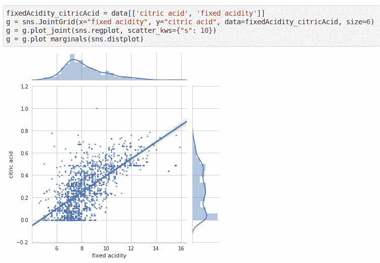

随着柠檬酸量的增加，固定酸度水平也增加。

*   **挥发性酸度与质量**

```
fig, axs = plt.subplots(ncols=1,figsize=(10,6))
sns.barplot(x='quality', y='volatile acidity', data=volatileAcidity_quality, ax=axs)
plt.title('quality VS volatile acidity')

plt.tight_layout()
plt.show()
plt.gcf().clear() 
```

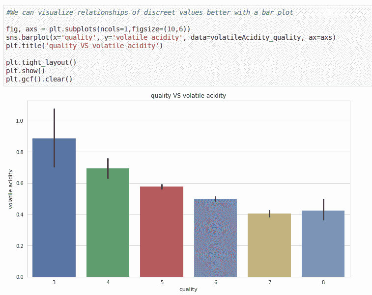

高品质通常与低挥发性酸度水平相关。这是有道理的，因为挥发性酸度是腐败的一个指标，可能会产生令人不快的香味——这符合我们的领域知识。

*   **酒精与质量**

```
fig, axs = plt.subplots(ncols=1,figsize=(10,6))
sns.barplot(x='quality', y='alcohol', data=quality_alcohol, ax=axs)
plt.title('quality VS alcohol')

plt.tight_layout()
plt.show()
plt.gcf().clear() 
```

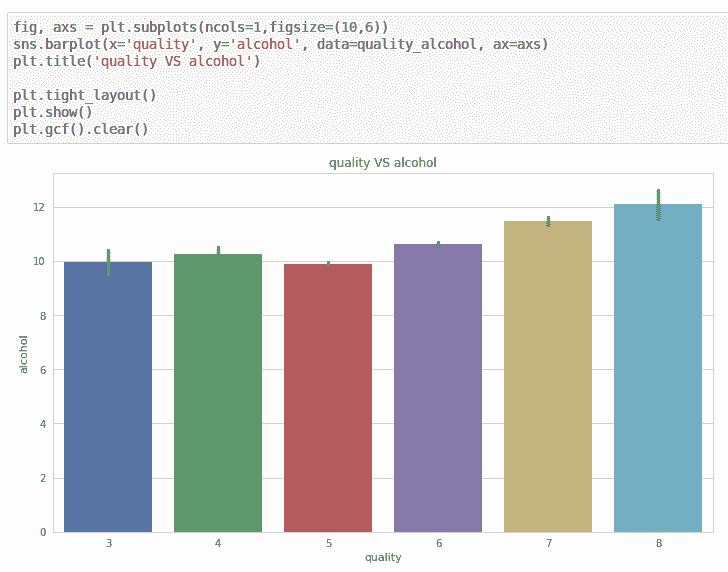

嗯。似乎大多数人都喜欢酒精含量较高的葡萄酒，那种让他们感觉头晕的酒！

尝试在笔记本上自己尝试更多的功能，看看它们是否能揭示什么。如果它们有某种联系，你认为原因是什么？探索会发现更多隐藏的洞见。

记住**关联并不总是意味着因果关系**是有帮助的。有时，当你为两个特征绘制图表时，它可能会显示一个可能只是同时发生的模式。这里有一个例子—

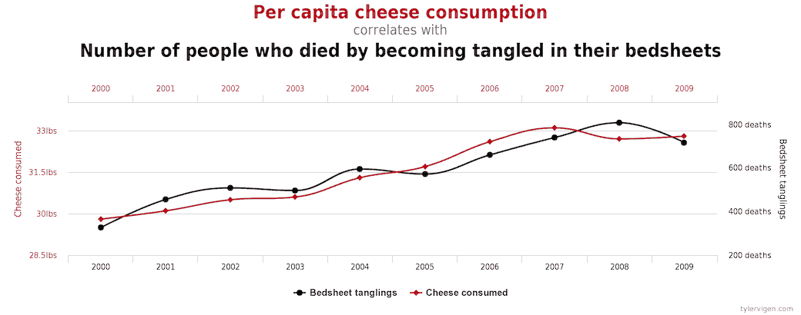

[http://philosophy.hku.hk/think/sci/inference.php](http://philosophy.hku.hk/think/sci/inference.php). You can check out more examples [here](http://tylervigen.com/spurious-correlations).

那么，我们为什么要这样做呢？这有助于了解我们数据集的完整性是否完好无损！

例如，我们知道，如果酸度增加，pH 值肯定会降低。但是，如果我们的图表显示相反的情况，那么这是一个指标，有些不对劲——我们的数据集是不可靠的。这可能会使我们的预测出错！在这里，拥有领域知识再次证明是有帮助的。

## 离群点检测

假设在兰尼斯特王国，大约有一万名成年人。他们中的大多数都是平均身高(5 英尺以上)，但大约有 100 人是侏儒。这些也称为异常值，因为它们是超出预期高度范围的极值。换句话说，异常值是指与大多数其他数据点相距甚远的数据点。

为什么它们很重要？因为它们有时会给数据分析带来很多问题。假设你正试图计算你房间里 10 个随机选择的物体的平均温度，其中 9 个在 20 到 25 摄氏度之间。但是您让烤箱开着，温度为 175°C。中间温度将在 20°C 和 25°C 之间，但平均温度将在 35.5 和 40°C 之间。在这种情况下，中间温度更好地反映了随机采样对象的温度，因为它低于您房间的预期温度。

因此，找出异常值是至关重要的，因为非常小或非常大的值会对我们的数据分析产生负面影响，从而影响我们的预测。所以有时候，有必要移除它们。


### 检测异常值的 Tukey 方法

我读了一篇关于这个方法的非常好的文章，你可以以后再看。简而言之，这项技术是这样工作的:

*   首先，你开始将排序后的数据分成四个区间，每个区间包含大约 25%的数据点。这些区间被分割的值被称为**四分位数**。
*   然后从第一个四分位数减去第三个四分位数，得到**四分位数间距(IQR)** 。这是中间的 50%，它包含了大部分数据。
*   任何超过 IQR 的 1.5 倍的数据点都将被视为异常值。

在下一个代码块中运行以下代码，打印出数据集中所有要素的异常值。

```
# For each feature find the data points with extreme high or low values
for feature in data.keys():
    # TODO: Calculate Q1 (25th percentile of the data) for the given feature
    Q1 = np.percentile(data[feature], q=25)

    # TODO: Calculate Q3 (75th percentile of the data) for the given feature
    Q3 = np.percentile(data[feature], q=75)

    # TODO: Use the interquartile range to calculate an outlier step (1.5 times the interquartile range)
    interquartile_range = Q3 - Q1
    step = 1.5 * interquartile_range

    # Display the outliers
    print("Data points considered outliers for the feature '{}':".format(feature))
    display(data[~((data[feature] >= Q1 - step) & (data[feature] <= Q3 + step))])

    # OPTIONAL: Select the indices for data points you wish to remove
    outliers = []
    # Remove the outliers, if any were specified
    good_data = data.drop(data.index[outliers]).reset_index(drop = True) 
```

然后……我们完成了！

我希望你喜欢这个教程。现在你比以前更了解数据科学了！

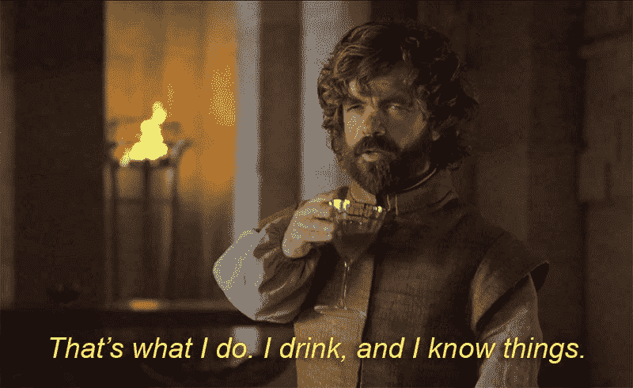

The only time you’ll actually feel like Tyrion Lannister

当然，事情并不像看上去那样简单。如果您想了解更多信息，我强烈建议您查看以下内容:

*   [统计与概率课程](https://medium.freecodecamp.org/if-you-want-to-learn-data-science-take-a-few-of-these-statistics-classes-9bbabab098b9)
*   [面向数据科学的 Python 简介](https://www.datacamp.com/tracks/python-programming?tap_a=5644-dce66f&tap_s=93618-a68c98)
*   [互联网上最好的数据科学课程](https://medium.freecodecamp.org/the-best-data-science-courses-on-the-internet-ranked-by-your-reviews-6dc5b910ea40)
*   [如何成为数据科学家](https://medium.freecodecamp.org/how-to-become-a-data-scientist-2d829fa33aba)

但是现在，休息一下，然后进入下一个教程，在那里你将深入一些核心的机器学习的东西。你将学习建立一个机器学习模型，如果你给它葡萄酒的属性，它会给你一个准确的质量评级！

[**利用机器学习预测葡萄酒质量**](https://medium.freecodecamp.org/using-machine-learning-to-predict-the-quality-of-wines-9e2e13d7480d)

> 也发表在我的[科技博客](https://blog.booleanhunter.com/using-data-science-to-understand-what-makes-wine-taste-good/)上。*喜欢你读的书吗？头那边还有[订阅](https://forum.booleanhunter.com/)！我不会浪费你的时间。*

如果你有任何问题，或者你想要一个很酷的话题的教程，请在下面留下你的评论。