# 如何训练人工智能将你的设计模型转换成 HTML 和 CSS

> 原文：<https://www.freecodecamp.org/news/how-you-can-train-an-ai-to-convert-your-design-mockups-into-html-and-css-cc7afd82fed4/>

作者:emailwallner

# 如何训练人工智能将你的设计模型转换成 HTML 和 CSS

三年内，深度学习将改变前端开发。它将提高原型开发速度，降低构建软件的门槛。

去年，当托尼·贝尔特拉梅利推出了 pix2code paper 和 Airbnb 推出了 T2 sketch 2 code 时，这个领域开始腾飞。


Photo by [Wesson Wang](https://unsplash.com/photos/y0_vFxOHayg?utm_source=unsplash&utm_medium=referral&utm_content=creditCopyText) on [Unsplash](https://unsplash.com/search/photos/tech-maker?utm_source=unsplash&utm_medium=referral&utm_content=creditCopyText)

目前，自动化前端开发的最大障碍是计算能力。然而，我们可以使用当前的深度学习算法，以及合成的训练数据，现在就开始探索人工前端自动化。

在这篇文章中，我们将教神经网络如何根据设计模型的图片编写一个基本的 HTML 和 CSS 网站。以下是该过程的简要概述:

#### 1)给训练好的神经网络一个设计图像


#### 2)神经网络将图像转换成 HTML 标记

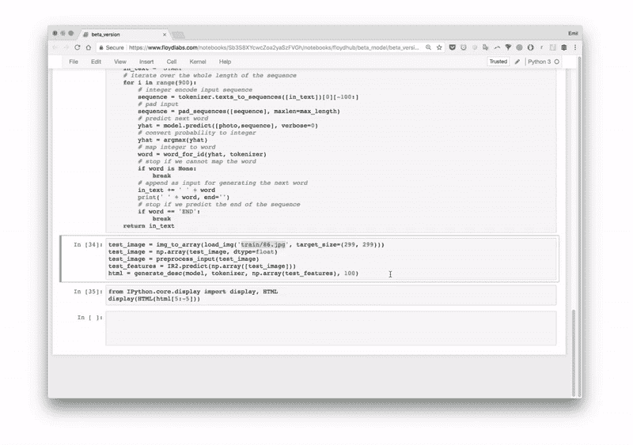

#### 3)渲染输出

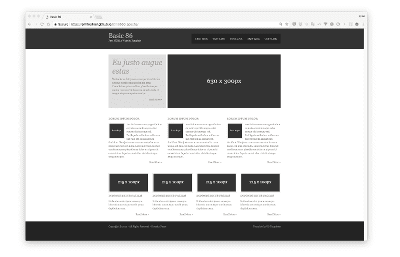

我们将分三次迭代建立神经网络。

首先，我们将制作一个最简单的版本来掌握运动部件。第二个版本，HTML，将专注于自动化所有的步骤，并解释神经网络层。在最终版本 Bootstrap 中，我们将创建一个能够概化和探索 LSTM 图层的模型。

所有代码都准备在 Jupyter 笔记本的 [GitHub](https://github.com/emilwallner/Screenshot-to-code-in-Keras/blob/master/README.md) 和 [FloydHub](https://www.floydhub.com/emilwallner/projects/picturetocode) 上。所有的 FloydHub 笔记本都在`floydhub`目录下，本地的笔记本在`local`下。

这些模型基于贝尔特拉梅利的[pix 2 代码论文](https://arxiv.org/abs/1705.07962)和杰森布朗利的[图像字幕教程](https://machinelearningmastery.com/blog/page/2/)。代码是用 Python 和 Keras 写的，Keras 是 TensorFlow 上面的一个框架。

如果你是深度学习的新手，我建议你体验一下 Python、反向传播和卷积神经网络。我之前在 FloydHub 博客上的三篇文章将会帮助你开始:

*   [我深度学习的第一个周末](https://blog.floydhub.com/my-first-weekend-of-deep-learning/)
*   [编码深度学习的历史](https://blog.floydhub.com/coding-the-history-of-deep-learning/)
*   [用神经网络给 B & W 照片上色](https://blog.floydhub.com/colorizing-b&w-photos-with-neural-networks/)

### 核心逻辑

让我们回顾一下我们的目标。我们希望建立一个神经网络，它将生成对应于屏幕截图的 HTML/CSS 标记。

当你训练神经网络时，你给它几个带有匹配 HTML 的截图。

它通过逐个预测所有匹配的 HTML 标记标签来学习。当它预测下一个标记标签时，它会收到屏幕截图以及到那时为止所有正确的标记标签。

这里有一个简单的[训练数据示例](https://docs.google.com/spreadsheets/d/1xXwarcQZAHluorveZsACtXRdmNFbwGtN3WMNhcTdEyQ/edit?usp=sharing)在一个 Google 表单中。

创建一个逐字预测的模型是当今最常见的方法。还有其他的方法，但这是我们在本教程中使用的方法。

请注意，对于每个预测，它都获得了相同的屏幕截图。因此，如果它必须预测 20 个单词，它将得到 20 次相同的设计模型。目前，不要担心神经网络如何工作。重点把握神经网络的输入和输出。


让我们把重点放在前面的标记上。假设我们训练网络来预测句子“我能编码”当它接收到“我”时，它会预测“可以”下一次它将接收“我能”并预测“代码”它接收所有前面的单词，并且只需要预测下一个单词。

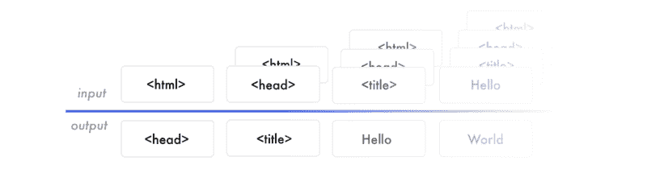

神经网络从数据中创建特征。网络构建要素以将输入数据与输出数据关联起来。它必须创建表示来理解每个截图中的内容，HTML 语法，它已经预测到了。这建立了预测下一个标签的知识。

当您希望将训练好的模型用于现实世界时，这与您训练模型时的情况类似。文字是一个一个生成的，每次都是同一个截图。它不是向它提供正确的 HTML 标签，而是接收它到目前为止生成的标记。然后，它预测下一个标记标签。预测以“开始标签”开始，并在预测到“结束标签”或达到最大限制时停止。这里有另一个例子，在谷歌表单中。

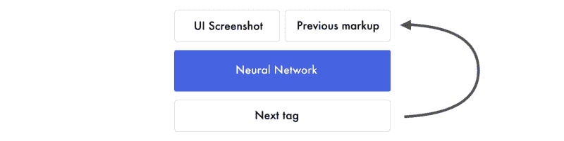

### “你好世界”版本

让我们建立一个“hello world”版本。我们会给神经网络一个显示“你好，世界！”的网页截图并教它生成标记。

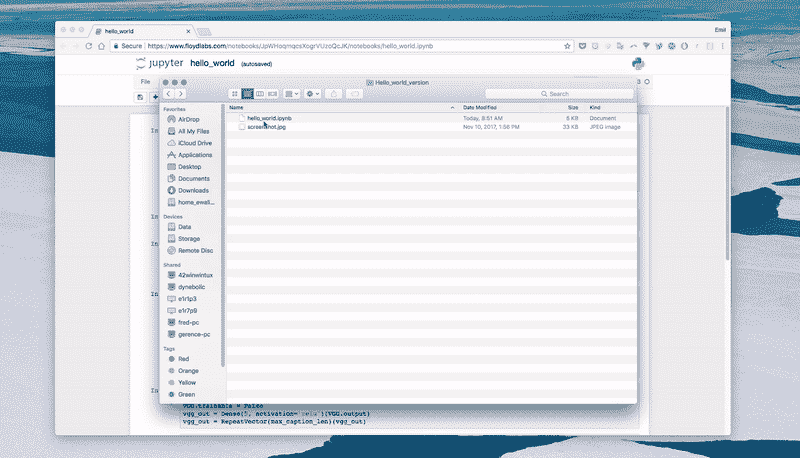

首先，神经网络将设计模型映射到像素值列表中。红色、蓝色和绿色三个通道的范围为 0–255。

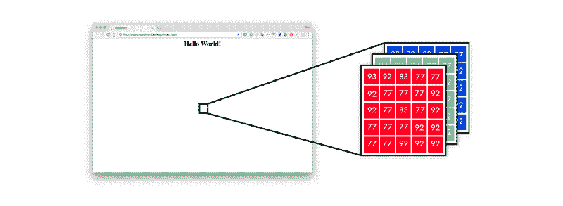

为了以神经网络理解的方式表示标记，我使用了[一个热编码](https://machinelearningmastery.com/how-to-one-hot-encode-sequence-data-in-python/)。因此，句子“我能编码”可以映射如下。

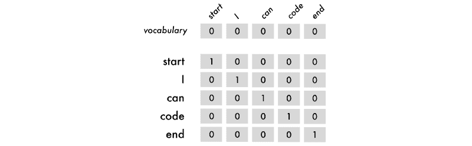

在上图中，我们包括了开始和结束标记。这些标签是网络何时开始预测以及何时停止预测的线索。

对于输入的数据，我们将使用句子，从第一个单词开始，然后逐个添加每个单词。输出数据总是一个字。

句子和单词遵循同样的逻辑。它们也需要相同的输入长度。它们不是被词汇量限制，而是被最大句子长度限制。如果它比最大长度短，你就用空单词来填充它，一个只有零的单词。

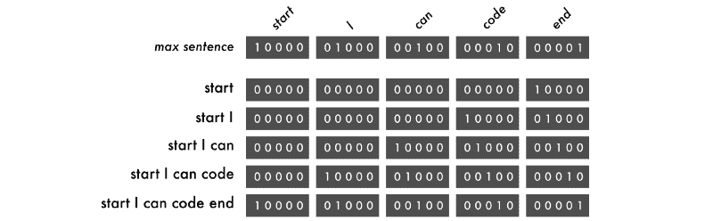

如你所见，单词是从右向左打印的。这迫使每个单词在每轮训练中改变位置。这使得模型可以学习序列，而不是记住每个单词的位置。

下图中有四种预测。每一行都是一个预测。左边是用三种颜色通道表示的图像:红色、绿色和蓝色以及前面的单词。括号外是一个接一个的预测，以红色方块结束，标志结束。


green blocks = start tokens | red block = end token

```
#Length of longest sentencemax_caption_len = 3#Size of vocabulary vocab_size = 3
```

```
# Load one screenshot for each word and turn them into digits images = []for i in range(2):    images.append(img_to_array(load_img('screenshot.jpg', target_size=(224, 224))))images = np.array(images, dtype=float)# Preprocess input for the VGG16 modelimages = preprocess_input(images)
```

```
#Turn start tokens into one-hot encodinghtml_input = np.array(            [[[0., 0., 0.], #start             [0., 0., 0.],             [1., 0., 0.]],             [[0., 0., 0.], #start <HTML>Hello World!</HTML>             [1., 0., 0.],             [0., 1., 0.]]])
```

```
#Turn next word into one-hot encodingnext_words = np.array(            [[0., 1., 0.], # <HTML>Hello World!</HTML>             [0., 0., 1.]]) # end
```

```
# Load the VGG16 model trained on imagenet and output the classification featureVGG = VGG16(weights='imagenet', include_top=True)# Extract the features from the imagefeatures = VGG.predict(images)
```

```
#Load the feature to the network, apply a dense layer, and repeat the vectorvgg_feature = Input(shape=(1000,))vgg_feature_dense = Dense(5)(vgg_feature)vgg_feature_repeat = RepeatVector(max_caption_len)(vgg_feature_dense)# Extract information from the input seqence language_input = Input(shape=(vocab_size, vocab_size))language_model = LSTM(5, return_sequences=True)(language_input)
```

```
# Concatenate the information from the image and the inputdecoder = concatenate([vgg_feature_repeat, language_model])# Extract information from the concatenated outputdecoder = LSTM(5, return_sequences=False)(decoder)# Predict which word comes nextdecoder_output = Dense(vocab_size, activation='softmax')(decoder)# Compile and run the neural networkmodel = Model(inputs=[vgg_feature, language_input], outputs=decoder_output)model.compile(loss='categorical_crossentropy', optimizer='rmsprop')
```

```
# Train the neural networkmodel.fit([features, html_input], next_words, batch_size=2, shuffle=False, epochs=1000)
```

在 hello world 版本中，我们使用三个令牌:`start`、`<HTML><center><H1>Hello World!<`；/H1&`gt;`</居中> < /HTML >并结束。令牌可以是任何东西。它可以是一个字符、单词或句子。字符版本需要较小的词汇表，但会限制神经网络。单词级标记往往表现最好。

在这里我们做出预测:

```
# Create an empty sentence and insert the start tokensentence = np.zeros((1, 3, 3)) # [[0,0,0], [0,0,0], [0,0,0]]start_token = [1., 0., 0.] # startsentence[0][2] = start_token # place start in empty sentence    # Making the first prediction with the start tokensecond_word = model.predict([np.array([features[1]]), sentence])    # Put the second word in the sentence and make the final predictionsentence[0][1] = start_tokensentence[0][2] = np.round(second_word)third_word = model.predict([np.array([features[1]]), sentence])    # Place the start token and our two predictions in the sentence sentence[0][0] = start_tokensentence[0][1] = np.round(second_word)sentence[0][2] = np.round(third_word)    # Transform our one-hot predictions into the final tokensvocabulary = ["start", "<HTML><center><H1>Hello World!</H1></center></HTML>", "end"]for i in sentence[0]:print(vocabulary[np.argmax(i)], end=' ')
```

### 输出

*   **10 个纪元:** `start start start`
*   **100 个纪元:**`start <HTML><center><H1>Hello World!</H1></center></HTML> <HTML><`；中心> < H1 >你好世界！</H1>/居中>/HTML>
*   **300 个历元:**`start <HTML><center><H1>Hello World!</H1`></中心> < /HTML >结束

### 我犯的错误:

*   在收集数据之前构建第一个工作版本。在这个项目的早期，我设法得到了一份 Geocities 托管网站的旧档案。它有 3800 万个网站。由于被潜力所蒙蔽，我忽略了减少 100K 大小的词汇表所需的巨大工作量。
*   处理 1tb 的数据需要良好的硬件或极大的耐心。在我的 mac 遇到几个问题后，我最终使用了一个强大的远程服务器。期望租用一个配备 8 个现代 CPU 内核和 1 个 GPS 互联网连接的钻机，以拥有一个体面的工作流程。
*   在我理解输入和输出数据之前，一切都没有意义。输入 X 是一个截图和之前的标记。输出 Y 是下一个标记标签。当我明白了这一点，就更容易理解他们之间的一切。尝试不同的架构也变得更加容易。
*   小心兔子洞。因为这个项目与深度学习的很多领域交叉，所以一路上我陷入了大量的兔子洞。我花了一周时间从头开始编程 RNNs，对嵌入向量空间太着迷了，并被奇异的实现所诱惑。
*   **图码网是变相的图像字幕模型。**即使当我了解到这一点时，我仍然忽略了许多图像说明文件，只是因为它们不太酷。一旦我有了一些观点，我就加快了对问题空间的学习。

### 在 FloydHub 上运行代码

FloydHub 是一个深度学习的训练平台。当我第一次开始学习深度学习时，我遇到了它们，从那以后我一直用它们来训练和管理我的深度学习实验。您可以通过点击此按钮在 30 秒内运行您的第一个模型:


它会在 [FloydHub](https://www.floydhub.com/?utm_medium=readme&utm_source=pix2code&utm_campaign=aug_2018) 上打开一个[工作区](https://blog.floydhub.com/workspaces/)，在这里你会发现与*引导版本*使用的相同的环境和数据集。也可以找训练好的模型进行测试。

或者你可以按照以下步骤进行手动安装: [2 分钟安装](https://www.floydhub.com/)或[我的 5 分钟演练。](https://www.youtube.com/watch?v=byLQ9kgjTdQ&t=21s)

#### **克隆存储库**

```
git clone https://github.com/emilwallner/Screenshot-to-code-in-Keras.git
```

#### **登录并启动 FloydHub 命令行工具**

```
cd Screenshot-to-code-in-Kerasfloyd loginfloyd init s2c
```

#### **在 FloydHub 云 GPU 机器上运行 Jupyter 笔记本:**

```
floyd run --gpu --env tensorflow-1.4 --data emilwallner/datasets/imagetocode/2:data --mode jupyter
```

所有的笔记本都在 FloydHub 目录中准备好了。本地对等项在本地下。一旦运行，你可以在这里找到第一个笔记本:floydhub/Hello*world/Hello*world . ipynb。

如果你想要更多关于这些标志的详细说明和解释，请查看我之前的帖子。

### HTML 版本

在这个版本中，我们将自动化 Hello World 模型中的许多步骤。这一节将着重于创建一个可扩展的实现和神经网络中的移动部分。

这个版本将不能预测来自随机网站的 HTML，但它仍然是一个探索问题动态的很好的设置。

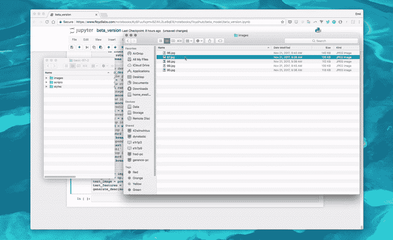

### 概观

如果我们展开上图中的组件，它看起来像这样。

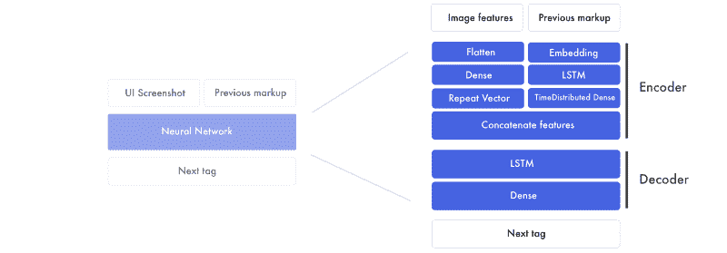

有两个主要部分。首先是编码器。这是我们创建图像特征和先前标记特征的地方。特征是网络创建的将设计模型与标记连接起来的构建块。在编码器的最后，我们将图像特征粘附到前面标记中的每个单词。

然后，解码器采用组合的设计和标记特征，并创建下一个标签特征。这个功能通过一个完全连接的神经网络来预测下一个标签。

#### **设计模型特征**

由于我们需要为每个单词插入一个截图，这就成为了训练网络时的一个瓶颈([例](https://docs.google.com/spreadsheets/d/1xXwarcQZAHluorveZsACtXRdmNFbwGtN3WMNhcTdEyQ/edit#gid=0))。我们提取生成标记所需的信息，而不是使用图像。

信息被编码成图像特征。这是通过使用已经预先训练好的卷积神经网络(CNN)来完成的。该模型在 Imagenet 上进行了预训练。

在最终分类之前，我们从图层中提取特征。


我们最终得到 1536 个 8×8 像素的图像，称为特征。虽然它们对我们来说很难理解，但神经网络可以从这些特征中提取元素的对象和位置。

#### 标记功能

在 hello world 版本中，我们使用一次性编码来表示标记。在这个版本中，我们将对输入使用单词嵌入，对输出保持一次性编码。

我们构建每个句子的方式保持不变，但是我们映射每个标记的方式发生了变化。一键编码将每个单词视为一个独立的单元。相反，我们将输入数据中的每个单词转换成数字列表。这些表示标记标签之间的关系。

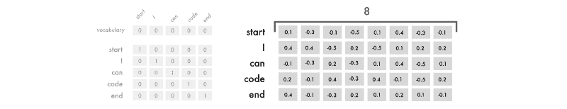

这个单词嵌入的维度是 8，但通常根据词汇量的大小在 50-500 之间变化。

每个单词的八个数字是类似于普通神经网络的权重。它们被调整为映射单词之间的关系( [Mikolov 等人，2013](https://arxiv.org/abs/1301.3781) )。

这就是我们开始开发标记特性的方式。特征是神经网络为将输入数据与输出数据联系起来而开发的。现在，不要担心它们是什么，我们将在下一节中对此进行更深入的探讨。

### 编码器

我们将获取单词 embeddings，并通过 LSTM 运行它们，然后返回一系列标记特性。这些是通过一个时间分布的密集层运行的，可以把它想象成一个具有多个输入和输出的密集层。

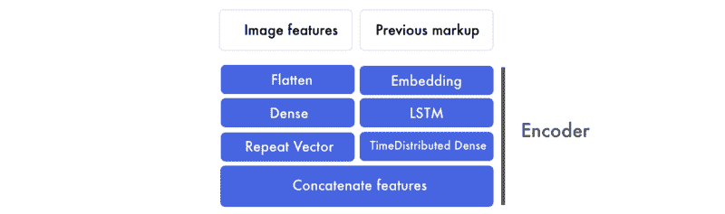

并行地，图像特征首先被展平。不管这些数字是如何构成的，它们都被转换成一个大的数字列表。然后我们在这个图层上应用一个密集图层，形成一个高级特征。这些图像特征然后被连接到标记特征。

这可能很难让你接受——所以让我们来分析一下。

#### 标记功能

在这里，我们通过 LSTM 层运行单词嵌入。在此图中，所有句子都被填充以达到三个标记的最大大小。

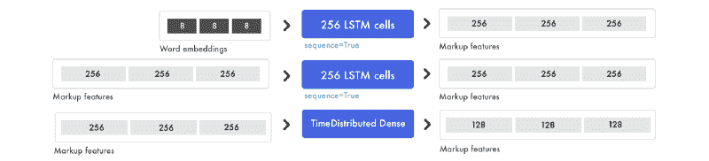

为了混合信号并找到更高层次的模式，我们将时间分布的密集层应用于标记特征。时间分布式密集与密集层相同，但具有多个输入和输出。

#### 图像特征

同时，我们准备图像。我们将所有的迷你图像特征转换成一个长列表。信息没有改变，只是重组了。

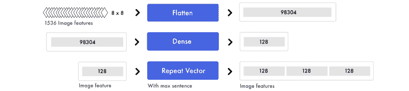

同样，为了混合信号和提取更高层次的概念，我们应用了密集层。因为我们只处理一个输入值，所以可以使用普通的密集图层。为了将图像特征连接到标记特征，我们复制图像特征。

在这种情况下，我们有三个标记特性。因此，我们最终得到了等量的图像特征和标记特征。

#### 连接图像和标记功能

所有的句子都被填充以创建三个标记特征。既然我们已经准备好了图像特性，现在我们可以为每个标记特性添加一个图像特性。

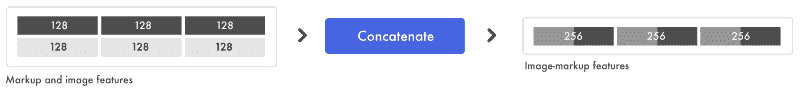

在将一个图像特征粘贴到每个标记特征之后，我们得到了三个图像标记特征。这是我们输入到解码器的输入。

#### 解码器

这里我们使用组合的图像标记特征来预测下一个标签。

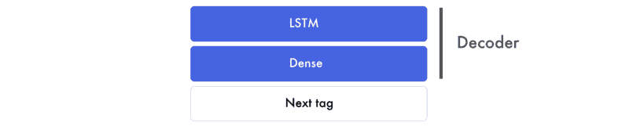

在下面的例子中，我们使用三个图像标记特征对，并输出一个下一个标签特征。

请注意，LSTM 层的序列设置为假。它不是返回输入序列的长度，而是只预测一个特征。在我们的例子中，它是下一个标签的特性。它包含最终预测的信息。

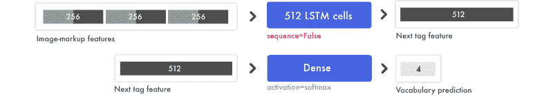

#### 最后的预测

密集层的工作方式类似于传统的前馈神经网络。它将下一个标签特征中的 512 位数字与 4 个最终预测连接起来。假设我们的词汇表中有 4 个单词:开始、你好、世界和结束。

词汇预测可以是[0.1，0.1，0.1，0.7]。密集层中的 softmax 激活分布从 0 到 1 的概率，所有预测的总和等于 1。在这种情况下，它预测第 4 个字是下一个标签。然后你把独热编码[0，0，0，1]翻译成映射值，比如说“end”。

```
# Load the images and preprocess them for inception-resnetimages = []all_filenames = listdir('images/')all_filenames.sort()for filename in all_filenames:    images.append(img_to_array(load_img('images/'+filename, target_size=(299, 299))))images = np.array(images, dtype=float)images = preprocess_input(images)
```

```
# Run the images through inception-resnet and extract the features without the classification layerIR2 = InceptionResNetV2(weights='imagenet', include_top=False)features = IR2.predict(images)
```

```
# We will cap each input sequence to 100 tokensmax_caption_len = 100# Initialize the function that will create our vocabulary tokenizer = Tokenizer(filters='', split=" ", lower=False)
```

```
# Read a document and return a stringdef load_doc(filename):    file = open(filename, 'r')    text = file.read()    file.close()    return text
```

```
# Load all the HTML filesX = []all_filenames = listdir('html/')all_filenames.sort()for filename in all_filenames:    X.append(load_doc('html/'+filename))
```

```
# Create the vocabulary from the html filestokenizer.fit_on_texts(X)
```

```
# Add +1 to leave space for empty wordsvocab_size = len(tokenizer.word_index) + 1# Translate each word in text file to the matching vocabulary indexsequences = tokenizer.texts_to_sequences(X)# The longest HTML filemax_length = max(len(s) for s in sequences)
```

```
# Intialize our final input to the modelX, y, image_data = list(), list(), list()for img_no, seq in enumerate(sequences):    for i in range(1, len(seq)):        # Add the entire sequence to the input and only keep the next word for the output        in_seq, out_seq = seq[:i], seq[i]        # If the sentence is shorter than max_length, fill it up with empty words        in_seq = pad_sequences([in_seq], maxlen=max_length)[0]        # Map the output to one-hot encoding        out_seq = to_categorical([out_seq], num_classes=vocab_size)[0]        # Add and image corresponding to the HTML file        image_data.append(features[img_no])        # Cut the input sentence to 100 tokens, and add it to the input data        X.append(in_seq[-100:])        y.append(out_seq)
```

```
X, y, image_data = np.array(X), np.array(y), np.array(image_data)
```

```
# Create the encoderimage_features = Input(shape=(8, 8, 1536,))image_flat = Flatten()(image_features)image_flat = Dense(128, activation='relu')(image_flat)ir2_out = RepeatVector(max_caption_len)(image_flat)
```

```
language_input = Input(shape=(max_caption_len,))language_model = Embedding(vocab_size, 200, input_length=max_caption_len)(language_input)language_model = LSTM(256, return_sequences=True)(language_model)language_model = LSTM(256, return_sequences=True)(language_model)language_model = TimeDistributed(Dense(128, activation='relu'))(language_model)
```

```
# Create the decoderdecoder = concatenate([ir2_out, language_model])decoder = LSTM(512, return_sequences=False)(decoder)decoder_output = Dense(vocab_size, activation='softmax')(decoder)
```

```
# Compile the modelmodel = Model(inputs=[image_features, language_input], outputs=decoder_output)model.compile(loss='categorical_crossentropy', optimizer='rmsprop')
```

```
# Train the neural networkmodel.fit([image_data, X], y, batch_size=64, shuffle=False, epochs=2)
```

```
# map an integer to a worddef word_for_id(integer, tokenizer):    for word, index in tokenizer.word_index.items():        if index == integer:            return word    return None
```

```
# generate a description for an imagedef generate_desc(model, tokenizer, photo, max_length):    # seed the generation process    in_text = 'START'    # iterate over the whole length of the sequence    for i in range(900):        # integer encode input sequence        sequence = tokenizer.texts_to_sequences([in_text])[0][-100:]        # pad input        sequence = pad_sequences([sequence], maxlen=max_length)        # predict next word        yhat = model.predict([photo,sequence], verbose=0)        # convert probability to integer        yhat = np.argmax(yhat)        # map integer to word        word = word_for_id(yhat, tokenizer)        # stop if we cannot map the word        if word is None:            break        # append as input for generating the next word        in_text += ' ' + word        # Print the prediction        print(' ' + word, end='')        # stop if we predict the end of the sequence        if word == 'END':            break    return
```

```
# Load and image, preprocess it for IR2, extract features and generate the HTMLtest_image = img_to_array(load_img('images/87.jpg', target_size=(299, 299)))test_image = np.array(test_image, dtype=float)test_image = preprocess_input(test_image)test_features = IR2.predict(np.array([test_image]))generate_desc(model, tokenizer, np.array(test_features), 100)
```

### 输出

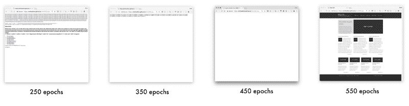

#### 链接到生成的网站

*   [250 个时期](https://emilwallner.github.io/html/250_epochs/)
*   [350 个时期](https://emilwallner.github.io/html/350_epochs/)
*   [450 个时期](https://emilwallner.github.io/html/450_epochs/)
*   [550 个纪元](https://emilwallner.github.io/html/550_epochs/)

如果你点击这些链接时看不到任何东西，你可以右击并点击“查看页面源代码”下面是[原网址](https://emilwallner.github.io/html/Original/)供参考。

### 我犯的错误:

*   与 CNN 相比，LSTMs 对我的认知影响更大。当我展开所有的列表时，它们变得更容易理解了。 [Fast.ai 在 RNNs](http://course.fast.ai/lessons/lesson6.html) 上的视频超级有用。此外，在尝试理解输入和输出功能的工作原理之前，先关注它们。
*   从头开始建立一个词汇比缩小一个庞大的词汇要容易得多。这包括从字体、div 大小、十六进制颜色到变量名和普通单词的所有内容。
*   大多数库是为了解析文本文档而不是代码而创建的。在文档中，一切都用空格隔开，但是在代码中，你需要自定义解析。
*   你可以用在 Imagenet 上训练的模型提取特征。这可能看起来违反直觉，因为 Imagenet 几乎没有网页图片。然而，与从头开始训练的 pix2code 模型相比，损失要高 30%。使用基于网页截图的预训练 inception-resnet 类型的模型会很有趣。

### 引导版本

在我们的最终版本中，我们将使用从 [pix2code 论文中生成的 bootstrap 网站数据集。](https://arxiv.org/abs/1705.07962)通过使用 Twitter 的 [bootstrap](https://getbootstrap.com/) ，我们可以将 HTML 和 CSS 结合起来，减少词汇量。

我们将使它能够为以前没有见过的屏幕截图生成标记。我们还将深入了解它如何构建关于屏幕截图和标记的知识。

我们将使用 17 个简化的标记，然后转化为 HTML 和 CSS，而不是在引导标记上训练它。[数据集](https://github.com/tonybeltramelli/pix2code/tree/master/datasets)包括 1500 张测试截图和 250 张验证图片。对于每个截屏，平均有 65 个令牌，产生 96925 个训练示例。

通过调整 pix2code 论文中的模型，该模型可以以 97%的准确率预测 web 组件(BLEU 4-ngram 贪婪搜索，稍后将详细介绍)。

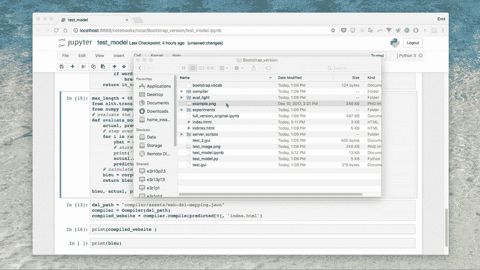

#### 端到端的方法

从预先训练的模型中提取特征在图像字幕模型中工作良好。但经过几次实验，我意识到 pix2code 的端到端方法对这个问题更有效。预训练模型没有在 web 数据上进行训练，是为分类而定制的。

在这个模型中，我们用一个轻型卷积神经网络代替预先训练的图像特征。我们没有使用最大池来增加信息密度，而是增加了步长。这将保持前端元素的位置和颜色。


有两个核心模型可以实现这一点:卷积神经网络(CNN)和递归神经网络(RNN)。最常见的递归神经网络是长短期记忆(LSTM)，所以这就是我要提到的。

有很多很棒的 CNN 教程，我在之前的文章中提到过。在这里，我将集中讨论 LSTMs。

#### 了解 LSTMs 中的时间步长

关于 LSTMs，最难理解的事情之一是时间步长。一个普通的神经网络可以被认为是两个时间步长。如果你对它说“你好”，它会预测“世界”但是它很难预测更多的时间步长。在下面的例子中，输入有四个时间步长，每个单词一个。

LSTMs 用于输入时间步长。这是一个为信息定制的神经网络。如果你展开我们的模型，它看起来像这样。每向下一步，你保持相同的重量。将一组权重应用于先前的输出，将另一组权重应用于新的输入。

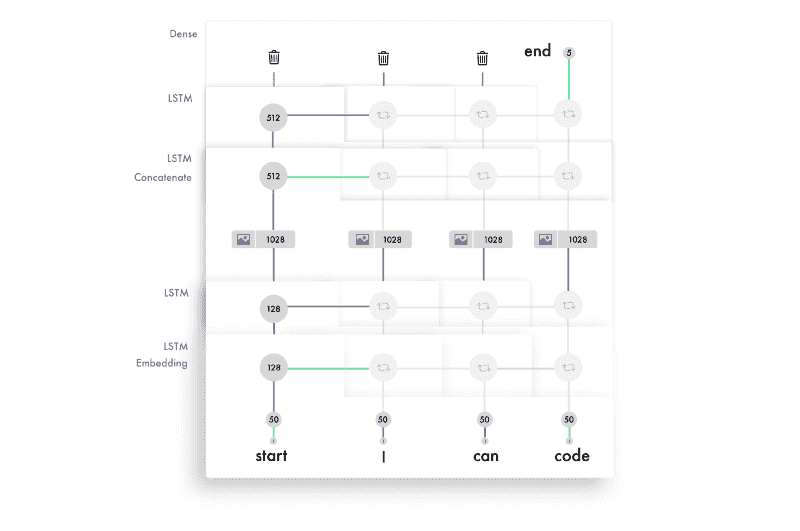

加权的输入和输出通过激活被连接和相加在一起。这是该时间步长的输出。由于我们重复使用权重，它们从几个输入中提取信息，并建立序列知识。

以下是 LSTM 中每个时间步长的简化流程。


为了感受这种逻辑，我推荐用 Andrew Trask 的[精彩教程](https://iamtrask.github.io/2015/11/15/anyone-can-code-lstm/)从头开始构建一个 RNN。

#### 了解 LSTM 图层中的单位

每个 LSTM 层的单元数量决定了它的记忆能力。这也对应于每个输出特征的大小。同样，功能是用于在各层之间传递信息的一长串数字。

LSTM 层中的每个单元学会跟踪语法的不同方面。下面是一个跟踪行 div 中信息的单元的可视化。这是我们用来训练引导模型的简化标记。

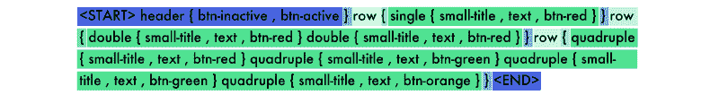

每个 LSTM 单元维护一个单元状态。把细胞状态想象成记忆。权重和激活用于以不同的方式修改状态。这使得 LSTM 图层能够微调每个输入要保留和丢弃的信息。

除了传递每个输入的输出要素之外，它还转发像元状态，即 LSTM 中每个单位的一个值。为了感受一下 LSTM 中的组件是如何交互的，我推荐 [Colah 的教程](https://colah.github.io/posts/2015-08-Understanding-LSTMs/)，Jayasiri 的 [Numpy 实现](http://blog.varunajayasiri.com/numpy_lstm.html)，以及 [Karphay 的讲座](https://www.youtube.com/watch?v=yCC09vCHzF8)和[文章。](https://karpathy.github.io/2015/05/21/rnn-effectiveness/)

```
dir_name = 'resources/eval_light/'
```

```
# Read a file and return a stringdef load_doc(filename):    file = open(filename, 'r')    text = file.read()    file.close()    return text
```

```
def load_data(data_dir):    text = []    images = []    # Load all the files and order them    all_filenames = listdir(data_dir)    all_filenames.sort()    for filename in (all_filenames):        if filename[-3:] == "npz":            # Load the images already prepared in arrays            image = np.load(data_dir+filename)            images.append(image['features'])        else:            # Load the boostrap tokens and rap them in a start and end tag            syntax = '<START> ' + load_doc(data_dir+filename) + ' <END>'            # Seperate all the words with a single space            syntax = ' '.join(syntax.split())            # Add a space after each comma            syntax = syntax.replace(',', ' ,')            text.append(syntax)    images = np.array(images, dtype=float)    return images, text
```

```
train_features, texts = load_data(dir_name)
```

```
# Initialize the function to create the vocabulary tokenizer = Tokenizer(filters='', split=" ", lower=False)# Create the vocabulary tokenizer.fit_on_texts([load_doc('bootstrap.vocab')])
```

```
# Add one spot for the empty word in the vocabulary vocab_size = len(tokenizer.word_index) + 1# Map the input sentences into the vocabulary indexestrain_sequences = tokenizer.texts_to_sequences(texts)# The longest set of boostrap tokensmax_sequence = max(len(s) for s in train_sequences)# Specify how many tokens to have in each input sentencemax_length = 48
```

```
def preprocess_data(sequences, features):    X, y, image_data = list(), list(), list()    for img_no, seq in enumerate(sequences):        for i in range(1, len(seq)):            # Add the sentence until the current count(i) and add the current count to the output            in_seq, out_seq = seq[:i], seq[i]            # Pad all the input token sentences to max_sequence            in_seq = pad_sequences([in_seq], maxlen=max_sequence)[0]            # Turn the output into one-hot encoding            out_seq = to_categorical([out_seq], num_classes=vocab_size)[0]            # Add the corresponding image to the boostrap token file            image_data.append(features[img_no])            # Cap the input sentence to 48 tokens and add it            X.append(in_seq[-48:])            y.append(out_seq)    return np.array(X), np.array(y), np.array(image_data)
```

```
X, y, image_data = preprocess_data(train_sequences, train_features)
```

```
#Create the encoderimage_model = Sequential()image_model.add(Conv2D(16, (3, 3), padding='valid', activation='relu', input_shape=(256, 256, 3,)))image_model.add(Conv2D(16, (3,3), activation='relu', padding='same', strides=2))image_model.add(Conv2D(32, (3,3), activation='relu', padding='same'))image_model.add(Conv2D(32, (3,3), activation='relu', padding='same', strides=2))image_model.add(Conv2D(64, (3,3), activation='relu', padding='same'))image_model.add(Conv2D(64, (3,3), activation='relu', padding='same', strides=2))image_model.add(Conv2D(128, (3,3), activation='relu', padding='same'))
```

```
image_model.add(Flatten())image_model.add(Dense(1024, activation='relu'))image_model.add(Dropout(0.3))image_model.add(Dense(1024, activation='relu'))image_model.add(Dropout(0.3))
```

```
image_model.add(RepeatVector(max_length))
```

```
visual_input = Input(shape=(256, 256, 3,))encoded_image = image_model(visual_input)
```

```
language_input = Input(shape=(max_length,))language_model = Embedding(vocab_size, 50, input_length=max_length, mask_zero=True)(language_input)language_model = LSTM(128, return_sequences=True)(language_model)language_model = LSTM(128, return_sequences=True)(language_model)
```

```
#Create the decoderdecoder = concatenate([encoded_image, language_model])decoder = LSTM(512, return_sequences=True)(decoder)decoder = LSTM(512, return_sequences=False)(decoder)decoder = Dense(vocab_size, activation='softmax')(decoder)
```

```
# Compile the modelmodel = Model(inputs=[visual_input, language_input], outputs=decoder)optimizer = RMSprop(lr=0.0001, clipvalue=1.0)model.compile(loss='categorical_crossentropy', optimizer=optimizer)
```

```
#Save the model for every 2nd epochfilepath="org-weights-epoch-{epoch:04d}--val_loss-{val_loss:.4f}--loss-{loss:.4f}.hdf5"checkpoint = ModelCheckpoint(filepath, monitor='val_loss', verbose=1, save_weights_only=True, period=2)callbacks_list = [checkpoint]
```

```
# Train the modelmodel.fit([image_data, X], y, batch_size=64, shuffle=False, validation_split=0.1, callbacks=callbacks_list, verbose=1, epochs=50)
```

### 测量精度

很难找到一种公平的方法来衡量准确性。说你逐字比较。如果你的预测有一个单词不同步，你的准确率可能是 0%。如果你去掉一个与预测同步的单词，你可能会得到 99/100。

我使用了机器翻译和图像字幕模型的最佳实践 BLEU 评分。它将句子分成四个 n 元语法，由 1-4 个单词序列组成。在下面的预测中,“猫”应该是“代码”


要得到最后的分数，你把每个分数乘以 25%，(4/5)* 0.25+(2/4)* 0.25+(1/3)* 0.25+(0/2)* 0.25 = 0.2+0.125+0.083+0 = 0.408。然后将总和乘以刑期惩罚。因为长度在我们的例子中是正确的，所以它成为我们的最终分数。

你可以增加 n-grams 的数量来增加难度。四个 n 元模型是最符合人类翻译的模型。我推荐用下面的代码运行几个例子，并阅读 [wiki 页面。](https://en.wikipedia.org/wiki/BLEU)

```
#Create a function to read a file and return its contentdef load_doc(filename):    file = open(filename, 'r')    text = file.read()    file.close()    return text
```

```
def load_data(data_dir):    text = []    images = []    files_in_folder = os.listdir(data_dir)    files_in_folder.sort()    for filename in tqdm(files_in_folder):        #Add an image        if filename[-3:] == "npz":            image = np.load(data_dir+filename)            images.append(image['features'])        else:        # Add text and wrap it in a start and end tag            syntax = '<START> ' + load_doc(data_dir+filename) + ' <END>'            #Seperate each word with a space            syntax = ' '.join(syntax.split())            #Add a space between each comma            syntax = syntax.replace(',', ' ,')            text.append(syntax)    images = np.array(images, dtype=float)    return images, text
```

```
#Intialize the function to create the vocabularytokenizer = Tokenizer(filters='', split=" ", lower=False)#Create the vocabulary in a specific ordertokenizer.fit_on_texts([load_doc('bootstrap.vocab')])
```

```
dir_name = '../../../../eval/'train_features, texts = load_data(dir_name)
```

```
#load model and weights json_file = open('../../../../model.json', 'r')loaded_model_json = json_file.read()json_file.close()loaded_model = model_from_json(loaded_model_json)# load weights into new modelloaded_model.load_weights("../../../../weights.hdf5")print("Loaded model from disk")
```

```
# map an integer to a worddef word_for_id(integer, tokenizer):    for word, index in tokenizer.word_index.items():        if index == integer:            return word    return Noneprint(word_for_id(17, tokenizer))
```

```
# generate a description for an imagedef generate_desc(model, tokenizer, photo, max_length):    photo = np.array([photo])    # seed the generation process    in_text = '<START> '    # iterate over the whole length of the sequence    print('\nPrediction---->\n\n<START> ', end='')    for i in range(150):        # integer encode input sequence        sequence = tokenizer.texts_to_sequences([in_text])[0]        # pad input        sequence = pad_sequences([sequence], maxlen=max_length)        # predict next word        yhat = loaded_model.predict([photo, sequence], verbose=0)        # convert probability to integer        yhat = argmax(yhat)        # map integer to word        word = word_for_id(yhat, tokenizer)        # stop if we cannot map the word        if word is None:            break        # append as input for generating the next word        in_text += word + ' '        # stop if we predict the end of the sequence        print(word + ' ', end='')        if word == '<END>':            break    return in_text
```

```
max_length = 48
```

```
# evaluate the skill of the modeldef evaluate_model(model, descriptions, photos, tokenizer, max_length):    actual, predicted = list(), list()    # step over the whole set    for i in range(len(texts)):        yhat = generate_desc(model, tokenizer, photos[i], max_length)        # store actual and predicted        print('\n\nReal---->\n\n' + texts[i])        actual.append([texts[i].split()])        predicted.append(yhat.split())    # calculate BLEU score    bleu = corpus_bleu(actual, predicted)    return bleu, actual, predicted
```

```
bleu, actual, predicted = evaluate_model(loaded_model, texts, train_features, tokenizer, max_length)
```

```
#Compile the tokens into HTML and cssdsl_path = "compiler/assets/web-dsl-mapping.json"compiler = Compiler(dsl_path)compiled_website = compiler.compile(predicted[0], 'index.html')
```

```
print(compiled_website )print(bleu)
```

### 输出

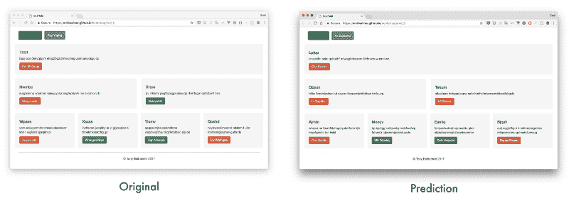

示例输出的链接

*   [生成网站 1](https://emilwallner.github.io/bootstrap/pred_1/) — [原创 1](https://emilwallner.github.io/bootstrap/real_1/)
*   [生成网站 2](https://emilwallner.github.io/bootstrap/pred_2/)——[原创 2](https://emilwallner.github.io/bootstrap/real_2/)
*   [生成网站 3](https://emilwallner.github.io/bootstrap/pred_3/)——[原创 3](https://emilwallner.github.io/bootstrap/real_3/)
*   [生成网站 4](https://emilwallner.github.io/bootstrap/pred_4/)——[原创 4](https://emilwallner.github.io/bootstrap/real_4/)
*   [生成网站 5](https://emilwallner.github.io/bootstrap/pred_5/)——[原创 5](https://emilwallner.github.io/bootstrap/real_5/)

### 我犯的错误:

*   了解模型的弱点，而不是测试随机模型。首先，我应用了一些随机的东西，比如批量标准化和双向网络，并尝试实现注意力。在查看了测试数据并看到它不能高精度地预测颜色和位置后，我意识到 CNN 有一个弱点。这导致我用更大的步幅来代替最大池。验证损失从 0.12 下降到 0.02，BLEU 得分从 85%上升到 97%。
*   **仅使用相关的预训练模型。**鉴于数据集较小，我认为预先训练的图像模型会提高性能。从我的实验来看，端到端模型的训练速度较慢，需要更多内存，但准确率提高了 30%。
*   当您在远程服务器上运行您的模型时，请为细微的差异做好准备。在我的 mac 上，它按照字母顺序读取文件。但是，在服务器上，它是随机定位的。这造成了截图和代码之间的不匹配。它仍然收敛，但验证数据比我修复时差了 50%。
*   确保你理解库函数。在你的词汇表中为空标记留出空间。当我没有添加它时，它不包括其中一个令牌。我只是在看了几遍最终输出并注意到它从未预测到一个“单个”令牌后才注意到它。快速查看后，我意识到它甚至不在词汇表中。此外，在训练和测试词汇表中使用相同的顺序。
*   实验时使用较轻的模型。使用 GRUs 代替 LSTMs 将每个历元周期减少了 30%，并且对性能没有大的影响。

### 后续步骤

前端开发是应用深度学习的理想空间。很容易生成数据，目前的深度学习算法可以映射大部分逻辑。

最令人兴奋的领域之一是[关注 lstm](https://arxiv.org/pdf/1502.03044.pdf)。这不仅能提高准确性，还能让我们看到 CNN 在生成标记时的关注点。

注意力也是标记、样式表、脚本以及最终后端之间交流的关键。注意层可以跟踪变量，使网络能够在编程语言之间进行通信。

但是在 near 特性中，最大的影响将来自于构建一种可扩展的方法来合成数据。然后，您可以逐步添加字体、颜色、文字和动画。

到目前为止，大多数进展都发生在获取草图并将其转化为模板应用程序的过程中。在不到两年的时间里，我们将能够在纸上绘制一个应用程序，并在不到一秒的时间内拥有相应的前端。Airbnb 的设计团队和 [Uizard](https://www.uizard.io/) 已经建造了两个工作原型。

这里有一些实验可以开始。

### 实验

**入门**

*   运行所有模型
*   尝试不同的超参数
*   测试不同的 CNN 架构
*   添加双向 LSTM 模型
*   用[不同的数据集](http://lstm.seas.harvard.edu/latex/)实现模型。(您可以使用此标志`--data emilwallner/datasets/100k-html:data`在 FloydHub 作业中轻松挂载此数据集)

**进一步的实验**

*   使用相应的语法创建一个可靠的随机应用程序/web 生成器。
*   应用模型草图的数据。将应用程序/网络截图自动转换为草图，并使用 GAN 创建各种样式。
*   应用一个关注层来可视化每个预测在图像上的焦点，[类似于这个模型](https://arxiv.org/abs/1502.03044)。
*   为模块化方法创建一个框架。比方说，有一个字体编码器模型，一个颜色编码器模型，一个布局编码器模型，然后用一个解码器将它们组合起来。一个好的开始可能是坚实的图像特征。
*   向网络提供简单的 HTML 组件，并教它使用 CSS 生成动画。拥有一种注意力的方法，并把注意力集中在两个输入源上是非常有趣的。

非常感谢 Tony Beltramelli 和 Jon Gold 的研究和想法，以及他们回答的问题。感谢 Jason Brownlee 的精彩 Keras 教程(我在核心 Keras 实现中包含了他的教程中的一些片段)，感谢 Beltramelli 提供的数据。同时感谢侯庆平、查理·哈灵顿、赛·索达拉吉、詹尼斯·克拉斯、克劳迪奥·卡布拉尔、阿兰·德梅内特和迪伦·吉安阅读了本文的草稿。

### 关于埃米尔·沃纳

这是 Emil 学习深度学习的多部分博客系列的第四部分。埃米尔花了十年时间探索人类的学习。他曾在牛津大学商学院工作，投资教育创业公司，并建立了一家教育技术公司。去年，他在第 42 大学注册，将他在人类学习方面的知识应用于机器学习。

如果你建立了一些东西或者遇到了困难，在下面或者 twitter 上 ping 我: [emilwallner](https://twitter.com/EmilWallner) 。我很想看看你在建什么。

这篇文章最初发表在 Floydhub 的博客上。