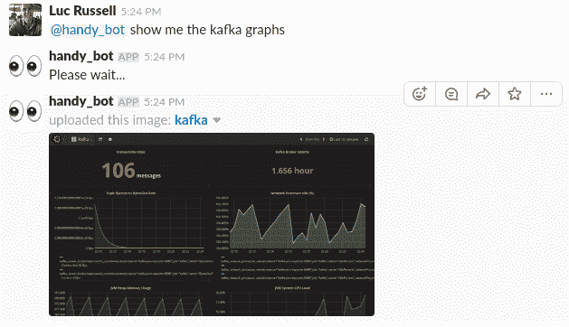
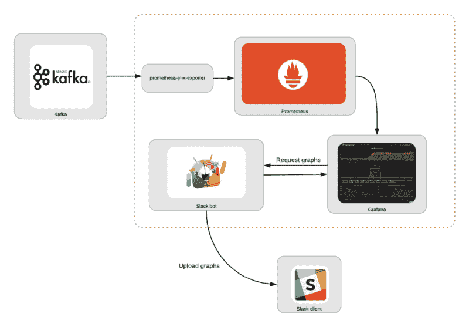
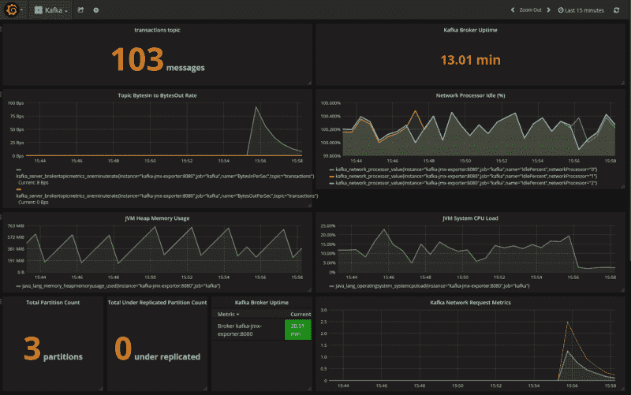
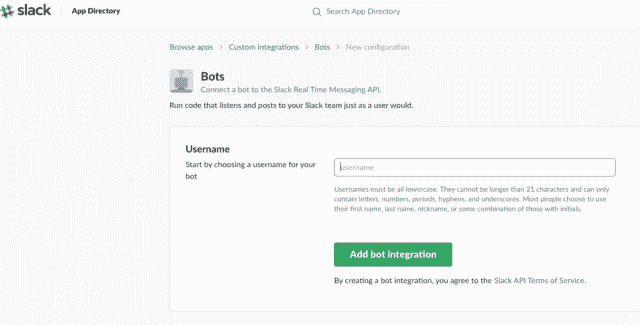
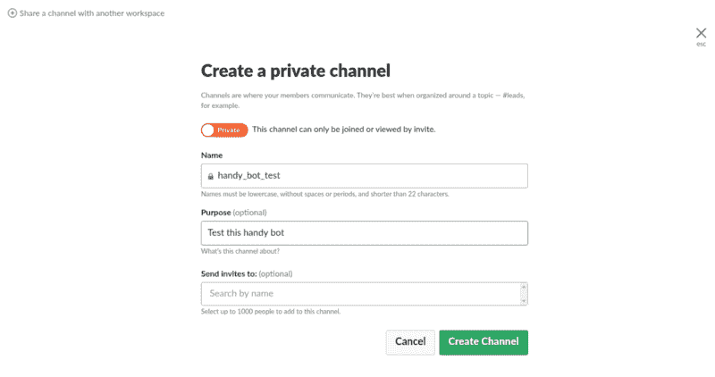
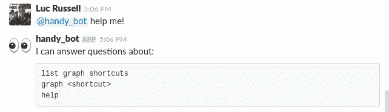

# 如何用 Kafka，Grafana，Prometheus 和 Slack 构建一个简单的聊天机器人

> 原文：<https://www.freecodecamp.org/news/simple-chatops-with-kafka-grafana-prometheus-and-slack-764ece59e707/>

吕克·拉塞尔

# 如何用 Kafka，Grafana，Prometheus 和 Slack 构建一个简单的聊天机器人

本教程描述了一种构建简单的 [ChatOps](https://en.wikipedia.org/wiki/ChatOps) bot 的方法，它使用 Slack 和 Grafana 来查询系统状态。其理念是，如果您不在办公桌旁，但仍能保持基本的连接，例如在手机上，您可以通过对话界面检查系统的状态:



本教程分为两部分:第一部分将使用 Prometheus 和 Grafana 建立监控 Kafka 的基础设施，第二部分将使用 Python 构建一个简单的 bot，它可以响应问题并通过 Slack 返回 Grafana 图。

通知是 Grafana 的一个固有特性，也就是说，如果条件被破坏，就能够向空闲通道发送警告消息。Slack bot 是一个稍微不同的工具。它将能够回答关于系统状态的简单问题，以帮助排除故障。

我们的目标是设计一些运行在防火墙环境中的东西，不需要代理访问，或者访问任何第三方服务，如亚马逊 S3。因此，图形图像在本地文件系统上生成，并作为附件上传到 Slack，以避免托管在公共基础设施上。



#### 成分

这里的主要组件是:

[**卡夫卡**](https://kafka.apache.org/) :一个消息流平台。这是我们感兴趣监控的系统。

[**普罗米修斯**](https://prometheus.io/) :以给定的时间间隔收集指标、评估规则并触发警报的监控系统。

[**普罗米修斯-jmx-exporter**](https://github.com/prometheus/jmx_exporter) :普罗米修斯收集器，可以抓取并曝光 jmx 数据，让我们从卡夫卡那里收集度量。

[**Grafana**](https://grafana.com/) :可视化平台，常用于可视化时间序列数据，用于基础设施和应用分析。这使我们能够以图形方式显示收集的指标。

[](https://slack.com/)**:消息应用程序，它将允许我们与我们的聊天机器人进行交互。**

**Slack bot :在下面的第二部分中描述了一个简单的 Python 脚本，它可以从 Grafana 检索图表并上传到 Slack。**

**这些步骤基于对 Kafka 的监控，但是也可以遵循相同的一般方法来与其他服务集成。**

### **我们开始吧**

**完整的源代码可在[这里](https://github.com/lucrussell/slack-chatops)获得。**

****先决条件****

*   **Python 基础知识:代码是为 Python 3.6 写的。**
*   **[Docker](https://www.docker.com) : docker-compose 用于运行 Kafka broker。**
*   **kafkacat :这是一个与 Kafka 交互的有用工具(例如发布消息到主题)**

**注意:如果你急着启动一切，只需从上面的链接中克隆项目并运行`docker-compose up -d`。**

**本教程的剩余部分分为两个部分。第一部分描述了如何设置监控基础设施，第二部分介绍了 Slack bot 的 Python 代码。**

### **第一部分:组装监控堆栈**

**我们将利用格拉夫纳和普罗米修斯建立一个监控栈。要监控的服务是 Kafka，这意味着我们需要一个桥来将 JMX 数据从 Kafka 导出到 Prometheus。这个[Prometheus-JMX-exporter](https://github.com/rama-nallamilli/kafka-prometheus-monitoring)docker 形象很好地完成了这个角色。该服务从 Kafka 的 JMX 服务器中提取指标，并通过 HTTP 将其公开，以便 Prometheus 可以对其进行轮询。**

**为了在 Kafka 服务器中启用 JMX 度量，我们需要对 Kafka 服务器应用一些配置设置，并将`kafka-jmx-exporter` 容器与 Kafka 服务器链接起来:**

1.  **确保在 **kafka** 容器上设置了`KAFKA_JMX_OPTS`和`JMX_PORT`环境变量**
2.  **确保 **kafka-jmx-exporter** 和 **kafka** 容器在同一个网络( `backend`)**
3.  **确保 **kafka-jmx-exporter** 容器的`JMX_HOST`值与 **kafka** 容器上的`KAFKA_ADVERTISED_HOST_NAME`值相匹配**
4.  **确保`KAFKA_ADVERTISED_HOST_NAME` 在`/etc/hosts`中有相应的条目。**
5.  **将`wurstmeister/kafka` 固定到版本`1.0.0`上。使用早期版本的`wurstmeister/kafka`映像配置 JMX 时可能会出现问题**
6.  **将`prom/prometheus` 固定到版本 `v2.0.0`**
7.  **那个升级需要一个兼容性的改变，就是把`prometheus.yml`文件中的`target_groups` 重命名为`static_configs`。**

**docker-compose.yml 的结果部分应该如下所示:**

```
 `kafka:
    image: wurstmeister/kafka:1.0.0
    ports:
      - "9092:9092"
      - "1099:1099"
    depends_on:
      - zookeeper
    environment:
      - KAFKA_ADVERTISED_PORT=9092
      - KAFKA_BROKER_ID=1
      - KAFKA_ZOOKEEPER_CONNECT=zookeeper
      - KAFKA_ADVERTISED_HOST_NAME=kafka
      - ZOOKEEPER_CONNECTION_TIMEOUT_MS=180000
      - KAFKA_CREATE_TOPICS=transactions:1:1
      - KAFKA_JMX_OPTS=-Dcom.sun.management.jmxremote -Dcom.sun.management.jmxremote.authenticate=false -Dcom.sun.management.jmxremote.ssl=false -Djava.rmi.server.hostname=kafka -Dcom.sun.management.jmxremote.rmi.port=1099
      - JMX_PORT=1099
    networks:
      - backend

  kafka-jmx-exporter:
    build: ./prometheus-jmx-exporter
    ports:
      - "8080:8080"
    links:
      - kafka
    environment:
      - JMX_PORT=1099
      - JMX_HOST=kafka
      - HTTP_PORT=8080
      - JMX_EXPORTER_CONFIG_FILE=kafka.yml
    networks:
        - backend

  prometheus:
    ports:
      - 9090:9090/tcp
    image: prom/prometheus:v2.0.0
    volumes:
      - ./etc:/etc/prometheus
      - prometheus_data:/prometheus
    links:
      - kafka-jmx-exporter
    restart: always
    networks:
        - backend`
```

**docker-compose.yml**

**Grafana 可以配置为在启动时读取 JSON dashboard 文件——`etc/Kafka.json`中提供了一个文件，预先配置了一些样本 Kafka 监控信息。**

### **启动监控堆栈**

**适当地配置好一切后，您应该能够用`docker-compose up -d`启动堆栈。然后用 kafkacat 给卡夫卡发几条信息:**

```
`for i in `seq 1 3`;
do
        echo "hello"  | kafkacat -b kafka:9092 -t transactions
done`
```

**查看位于 [http://localhost:3000](http://localhost:3000) 的 Kafka 仪表板，您应该会看到这样的内容:**

****

### **第二部分:构建 Slack Bot**

**有了监控基础设施，我们现在可以编写简单的 Slack bot 了。本节描述了创建 bot 的步骤，以及一些相关的代码片段。**

**第一步是在 Slack 网站上创建并注册机器人，你可以登录 Slack，进入[https://api.slack.com/bot-users](https://api.slack.com/bot-users)页面，然后在该页面上搜索“新机器人用户集成”:**

**

Create the bot** 

**在下一个屏幕上，您可以自定义详细信息，例如为机器人添加图标和描述。**

**当你的机器人被创建后，继续邀请它到某个地方。您可以创建一个专用通道进行测试:**

**

Create a channel for testing** 

**然后用`/invite @handy_bot`邀请 bot 进入测试频道:**

**

Invite the bot** 

**我们的机器人将回答几个简单的问题，我们将在第**行的第 1–3**行定义这些问题:**

```
 `self.respond_to = ['list graph shortcuts',
                           'graph <shortcut>',
                           'help']
        self.help_msg = '```\n'
        for answer in self.respond_to:
            self.help_msg += f'{answer}\n'
        self.help_msg += '```'`
```

**在`app.py`中，我们将读取我们的配置文件并启动机器人:**

```
`def main(arguments=None):
    if not arguments:
        arguments = docopt(__doc__)
    config = configure(arguments['--config-file'])
    mybot = SlackBot(config)
    mybot.start()`
```

**`start`方法如下所示:**

```
 `def start(self):
        if self.slack_client.rtm_connect():
            print("Bot is alive and listening for messages...")
            while True:
                events = self.slack_client.rtm_read()
                for event in events:
                    if event.get('type') == 'message':
                        # If we received a message, read it and respond if necessary
                        self.on_message(event)

                time.sleep(1)`
```

****第 2 行**:连接到 Slack API**

****第 5 行**:以给定的轮询频率(1 秒)，检查是否有新事件**

****第 7 行**:如果事件是一个消息，就放入`on_message`方法，如果我们从那个方法得到一个响应，就把它打印到发布消息的通道:**

```
 `def on_message(self, event):
       ...
        full_text = event.get('text', '') or ''

        if full_text.startswith(self.bot_id):
            question = full_text[len(self.bot_id):]
            if len(question) > 0:
                question = question.strip().lower()
                channel = event['channel']
                ...
                elif 'graph' in question:
                    self.respond(channel, 'Please wait...', True)`
```

**在`on_message`方法中，我们将决定如何响应机器人收到的消息。`generate_and_upload_graph`方法是最有趣的响应。这里的想法是启动一个临时 Docker 容器来捕获屏幕截图。**

**Grafana 确实能够将任何图形呈现为 PNG 文件。然而，在 Grafana 的最新版本中，内部用于图像生成的 [phantomjs](http://phantomjs.org/) 库似乎有一个错误。**

**一个更可靠的无头浏览工具是基于谷歌 Chrome 的[木偶师](https://github.com/GoogleChrome/puppeteer)，有人已经将它包装在 [Docker 图像](https://github.com/alekzonder/docker-puppeteer)中。这给了我们一个试验 [Docker Python API](https://docker-py.readthedocs.io/en/stable/) 的机会:**

```
 `def generate_and_upload_graph(self, filename, url, channel):
        dir_name = os.path.dirname(os.path.abspath(__file__))

        client = docker.APIClient()

        container = client.create_container(
            image='alekzonder/puppeteer:1.0.0',
            command=f'screenshot \'{url}\' 1366x768',
            volumes=[dir_name],

            host_config=client.create_host_config(binds={
                dir_name: {
                    'bind': '/screenshots'
                }
            }, network_mode='host')
        )

        files1 = prepare_dir(dir_name)

        client.start(container)

        # Poll for new files
        while True:
            time.sleep(2)
            files2 = os.listdir(dir_name)
            new = [f for f in files2 if all([f not in files1, f.endswith(".png")])]
            for f in new:
                with open(f, 'rb') as in_file:
                    ret = self.slack_client.api_call(
                        "files.upload",
                        filename=filename,
                        channels=channel,
                        title=filename,
                        file=io.BytesIO(in_file.read()))
                    if 'ok' not in ret or not ret['ok']:
                        print('File upload failed %s', ret['error'])
                os.remove(f)
            break`
```

****第 6:16 行**:使用 Docker Python API 基于`alekzonder/puppeteer`图像动态创建一个容器**

****第 13 行**:将当前目录绑定到容器中的`/screenshots`，这样我们就可以将文件写到某个可访问的地方**

****第 15 行**:设置`network_mode=host`以便容器可以访问本地主机上的 Grafana**

****line 23:38**将观察添加到目录中的新图像并上传它们**

### **启动机器人**

**随着监控栈的运行，您应该能够启动 bot。从`slackbot`目录:**

```
`$ python bot.py --config=config.yaml 
Bot is alive and listening for messages...`
```

**该机器人可以响应几个基本请求，如下所示，当然，您也可以针对您想要监控的特定系统定制机器人的功能。**

**

Respond to a help message** 

### **结论**

**ChatOps 机器人可以成为帮助您操作正在运行的系统的有用助手。这是一个简化的用例，但是一般概念可以扩展到支持更复杂的需求。**

**利用 Docker API 动态创建容器是捕获屏幕截图的一种复杂机制，但是当您需要快速向自己的应用程序添加一个已经包装为 Docker 映像的特性时，这种技术会特别有用。**