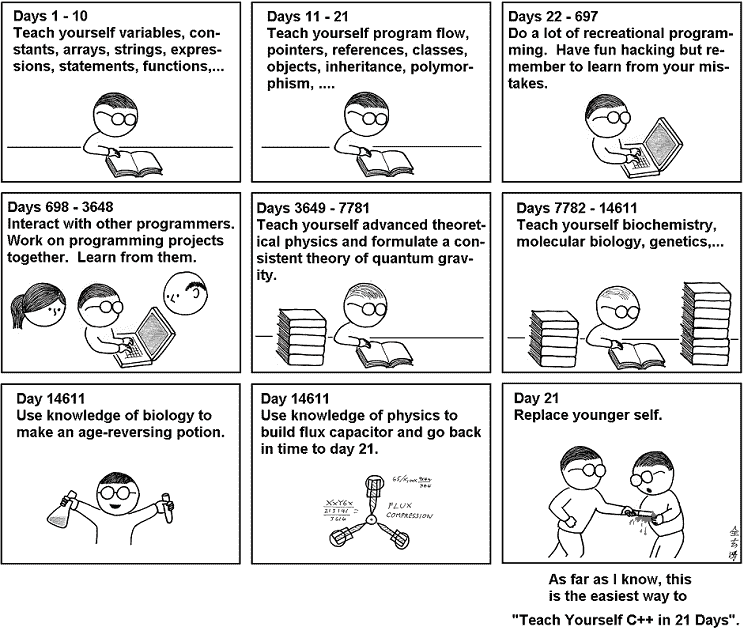
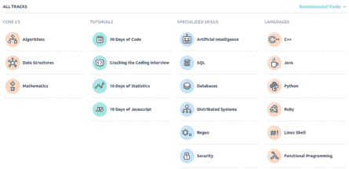

# 开始学习编码的可行建议

> 原文：<https://www.freecodecamp.org/news/actionable-advice-to-start-learning-to-code-256833f16f78/>

当我开始分享我关于[掌握编程](https://medium.com/the-renaissance-developer)和[黑我的教育](https://medium.com/the-renaissance-developer/how-i-hack-my-education-354fb5b8a025)的旅程时，人们真的很感兴趣，问了我很多关于如何开始学习编码的问题。

我真的很想帮助未来的开发者，关于如何开始的大量问题激发了我写这篇文章。

我有时间思考我的旅程，我向有经验的开发人员询问编码、他们是如何开始的、职业生涯以及所有人都想知道的有趣的事情。

这篇文章有很多故事和很多可行的建议，可以让你受到启发，受到激励，并在编程世界中迈出第一步。

希望这有所帮助！

### 心态

当我开始的时候，我爱上了编程。我的第一条建议是**因为你喜欢它，你觉得它有趣，或者可能觉得它有用而学习它**(确实如此！).

我为什么这么说？我是“做你热爱的事情”的忠实粉丝。这看起来很老套，但对我来说一直很有效。如果你开始编程，你会需要这种内在的动力。激情和兴趣有助于你在学习过程中保持一致性和纪律性。

记住:这不是短跑。这是一场漫长的马拉松。不要指望一夜之间学会所有的东西。事情不是这样的。

Teach Yourself C++ in 21 Days ([source](http://abstrusegoose.com/249))

#### **秘诀之二:不断学习**

作为一名软件工程师，我的挑战之一是始终跟踪我们世界正在出现的新事物:像 2013 年的 [ReactJS 这样的新库，像](https://en.wikipedia.org/wiki/React_(JavaScript_library)) [SPA](https://en.wikipedia.org/wiki/Single-page_application) 、 [PWA](https://en.wikipedia.org/wiki/Progressive_web_app) 这样的网络应用，像机器学习、人工智能、加密货币(区块链区块链区块链！)，等等。

我并不是说我们需要学习一切，压倒自己。我的观点是，在科技世界里，新事物产生得如此之快，所以我们需要拥抱终生学习的心态。

谈到压倒一切，这里有第三条建议:**尽量不要压倒自己。**不需要先从硬概念开始，也不需要从最重的算法书开始。

打个比方:当你想减肥的时候，你不会从马拉松开始。相反，你可以从 1 英里跑开始。

编程也是如此，你不需要在所有的空闲时间里编写代码和学习，完全改变你的时间表。

做一些小的改变，但是要有规律地做。一次一个代码。

不要拿自己和“有经验的工程师”比较，或者“程序员天才”是第四条建议。第一，一点都不公平。第二，你才刚刚开始。继续专注于你的学习。

很容易将自己与队友或编程天才进行比较，但这只会增加你内心的骗子综合症。不要让它停止你的编程之旅。

实践是关键。想办法学习概念并实践它。这是提示五个 ***。*** 用概念和理论建立基础很重要，但要实用。试试看。实验。我们稍后将深入探讨这一点，但实践是关键！

### 理论与概念

理解基本的编程概念，先打好基础，真的很重要。如果你现在在大学，你会很棒的！大学擅长教授基本概念和理论。如果你正在攻读计算机科学学位，你可能会有算法和数据结构课程。但是，如果你不在大学，互联网可以帮助你！

当我开始学习时，我学习了两个很棒的在线课程: [Codecademy](https://www.codecademy.com/) & [CS50 哈佛](https://cs50.harvard.edu/) **。**

在那里，我学习了 Codecademy 上的 Python 和 CS50 中的 C 的基础知识。但我的看法是:你只需要开始。选择一种编程语言，开始理解基本概念(变量、if-else、循环、数据结构)。

> [**成为语言不可知论者**](http://www.gayle.com/blog/2014/07/09/15-pieces-of-career-advice-software-developers-should-follow) 。语言只是一种工具。深入了解一门语言是有价值的，但学习新事物也是有价值的。最好的开发人员往往不认为自己是 _ _ _ _ _ 开发人员。— [盖尔·拉克曼·麦克道尔](https://www.freecodecamp.org/news/actionable-advice-to-start-learning-to-code-256833f16f78/undefined)

很可能，当你选择一门课程时，他们会用一种特定的编程语言来教你。但是不用担心！专注于基本概念(也许会爱上编程语言，就像我对 [Python](https://medium.freecodecamp.org/learning-python-from-zero-to-hero-120ea540b567) 和 [Ruby](https://medium.freecodecamp.org/learning-ruby-from-zero-to-hero-90ad4eecc82d) 一样)。

#### 我为什么选择这些课程？

当我开始寻找一些东西时，我想深入理解这些概念，并对它持实际态度。CS50 似乎是建立坚实基础的最佳资源。

大卫·j·马兰绝对是我遇到的最好的教授之一。Codecademy 对实用性帮助很大。训练自己对所学的一切进行编码。码码码。还记得第五条建议吗？想办法学习概念并实践它。

#### 其他内容丰富的资源包括:

[计算机科学导论](https://br.udacity.com/course/intro-to-computer-science--cs101/)uda city 著。它几乎涵盖了你开始理解编程所需要的一切。Udacity 课程在你学完每一个理论和概念之后，总会有“练习时间”。

麻省理工的[算法简介](http://courses.csail.mit.edu/6.006/fall11/notes.shtml)会教你算法思维。当你开始你的编码之旅时，理解算法和它们如何工作是你应该学习的最重要的事情。其他很棒的资源是算法书籍，如 CLRS 的《T2 算法简介》和 Robert Sedwick 的《T4 算法》。

在这里，你将开始被我们在互联网上的大量资源所淹没。但是**尽量不要压倒自己**。你不需要做每一门课程，专注于一门，学习，练习，建立自信。记住，这是一段旅程。一次一行代码:)

### 培训、实践、编码、构建

**练习练习练习**。当你开始学习编码时，实用性是多么重要，这一点我怎么说都不为过。

> 代码。很多……成为一名伟大的程序员的最好方法就是练习——很多。— [盖尔·拉克曼·麦克道尔](http://www.gayle.com/blog/2014/07/09/15-pieces-of-career-advice-software-developers-should-follow)

实践不仅让你成为一个更好的程序员，而且通过它你会获得很多自信。冒名顶替综合症是真事！

正如我在本文开头所说，我会努力为你写出可操作的条目。在你的学习之旅中，你可以做些更实际的选择。

正如我所做的，你可以从 [Codecademy](https://www.codecademy.com) 开始。它有很好的内容和很棒的体验来编码你正在学习的一切。

另一个很棒的站点是[黑客等级](https://www.hackerrank.com)。该网站有很多编程语言可供选择。但不仅如此，你还可以做其他领域的练习。我很喜欢 Hacker Rank 的解题练习。你会收到很多输入，你的算法需要通过所有的测试。

All Hacker Rank Track

我真正热衷的另一件事是竞争性编程。我在大学里做了两年，参加像 ACM ICPC 这样的比赛。

基本上，你有一堆问题，你需要实现一个算法来通过每一个。这样做帮助我对自己的编码技能获得了很多信心，我觉得在我的繁重训练和参加比赛之后，我是一个更强的开发人员。([这里是我在 GitHub 上的回购](https://github.com/LeandroTk/algorithms) —我解决了很多问题)。

我是 Quora 的忠实用户，有一天我读到了 Veni Johanna 的精彩回答“作为一名开发人员，竞争性编程真的有助于提高你的知识和技能吗？”

我将写下我们在学习竞争性编程中获得的一些技能:

1.  你已经养成了将具体问题转化/建模为抽象问题的习惯。
2.  您习惯于注册模式，并将模式与您的模式库进行匹配。
3.  你知道如何在压力下集中注意力和表现。
4.  作为一名程序员，你对自己的能力和缺点有意识和信心。
5.  你已经学会了管理时间，特别是在你的思维和编码习惯方面。
6.  你习惯于定义明确的问题。
7.  你习惯于心中有一个目标。
8.  你可能会陷入“解决问题”的模式。

我喜欢她的评论，并且百分之百同意每一条。看一看[完整回答](https://www.quora.com/Does-competitive-programming-really-help-in-improving-your-knowledge-and-skill-set-as-a-developer-Are-there-better-things-that-would-help-one-amass-greater-knowledge-in-less-time/answer/Veni-Johanna)。你应该。太棒了！

我在这里的意图是给你尽可能最可行的建议，所以我会列出一些很棒的网站供你从第 0 天开始学习和训练。

*   [Codeforces](http://codeforces.com) :真的是一个很好的培训学习的网站。它有很多很棒的问题集。社论在这里是加分项(*社论:问题作者写你应该如何接近和解决问题——使用哪种算法或数据结构)。
*   Topcoder :这个网站在问题质量和编辑方面与 Codeforces 非常相似。它也因其[教程](https://www.topcoder.com/community/data-science/data-science-tutorials/)而闻名。每个“教程”都教授一些技术、算法或数据结构。
*   [黑客等级](http://hackerrank.com):就像我上面说的，黑客等级有很多不同的领域，比如算法、数据结构、数学、编程语言等等。该网站的用户界面和 UX 是一个黑客排名加，它是美丽的，非常容易使用。我用了很多 Python 领域来为我的 Python 技能打下良好的基础。
*   [黑客地球](https://www.hackerearth.com)和[代码大厨](https://www.codechef.com/)也是不错的网站。

现在可以选择一个网站开始练习了:)

### 建筑项目

学了基础，编码，大量练习之后，感觉自己卡住了。我开始寻找如何才能进入下一个阶段。建筑项目是我的答案。所以我自学了网络基础知识:HTML、CSS、Javascript 和一个网络框架。那次我学了 Ruby on Rails (Ruby Web Framework)和 Django (Python Web Framework)。

我的第一个项目是我自己的网站。然后我为我妈妈的餐馆建了一个网站。然后两个游戏:井字游戏和贪吃蛇。所有静态网站。

我觉得我已经准备好开发一个完整的网站了。所以我建立了一个带有管理仪表板的在线书店(管理员可以添加新产品，编辑它们，删除它们…所有的 [CRUD](https://en.wikipedia.org/wiki/Create,_read,_update_and_delete) 东西)，和公共部分——客户可以注册/登录，搜索书籍，并购买它。我很高兴能完成这个项目。那时候对我来说真的很有挑战性，我学到了很多东西。

我开发的第一个现实产品是 [aLavadeira](https://www.alavadeira.com/) responsive 网站。现在，我为全球超过 90 万旅行者和东道主开发了 [Worldpackers](http://worldpackers.com) web 产品和移动应用程序 API。

> 开发新项目来构建您的编码基础。用 [Ruby](https://onemonth.com/courses/ruby?mbsy=lG6tt&discount_code=TKRuby1&campaignid=33446&mbsy_source=1c3d9863-622a-4e4c-8f4f-eb7e65d53fd4) 和 [Python 一个月训练营](https://onemonth.com/courses/python?mbsy=lG6tv&discount_code=TKPython1&campaignid=33447&mbsy_source=ad8dca5f-880b-4034-9e85-d7134d65e665)构建项目。

我的好朋友道格拉斯有一个关于他如何开始编码和开发应用程序的精彩故事。他在大学学习了基本概念，但构建移动应用是他一直好奇的事情。他试图开发许多 Android 应用程序，但很快就放弃了。

> “我根本不知道如何开始，因为我有很多东西要学，我也没有准备好建立一个 app。有那么多不同的东西要学，做同样的事情有那么多不同的方法，以至于我陷入了试图找出哪个是正确的或者最好的困境。这一阶段最重要的两件事是:1。设定一个简单的目标，并努力学习实现目标的基础知识。2.避免完美主义，只管去做。”—道格

听了道格的故事，我觉得每个开始做某事的人都会在过程的某个部分陷入困境。而感到沮丧或者不明白如何开始，是超级正常的。

> “我得到了一个朋友的帮助，他已经开发了一个简单的应用程序。我问他是否知道做一件具体事情的最佳方式，事实是:他不知道，但知道我们以同样的方式进行建设，我感到更有安全感。”—道格

如果你有更有经验的同事或朋友寻求帮助，他们可能会以某种方式提供帮助。这些“导师”是如何激励你重新开始并再次尝试的，这很酷。

我们可以从 Doug 的故事中得到的另一个教训是:他设定了一个目标，第一次做最简单的 app。

> “我构建了 [**第一个 app 版本**](https://play.google.com/store/apps/details?id=com.iacovelli.usp) 并发布到 Play Store。然后，我对 Java/Kotlin/Android 了解得越来越多，可以在这个应用程序上实现更多功能。但这是一个耗时的过程。我需要很大的毅力”——道格

当我们处于学习曲线的一部分时，感觉很好，我们感到自信，只是“在流中”继续学习和建设。但我完全同意道格的观点，当你开始学习新的东西时，你需要大量的坚持才能保持学习的一致性。

现在道格是一名安卓开发者。他在 Play Store 上发布了两个个人项目(移动应用程序)，并领导了 Worldpackers 的 Android 应用程序。

> “从很小的时候开始，我就通过参与许多不同的网站项目来学习如何编程。学习一项新技能的最好方法是练习，练习，再练习。你造什么并不重要，只要你挑个东西开始。”— [费罗斯·阿巴克哈迪贾](https://www.freecodecamp.org/news/actionable-advice-to-start-learning-to-code-256833f16f78/undefined)

在 [Quora](https://www.freecodecamp.org/news/actionable-advice-to-start-learning-to-code-256833f16f78/undefined) 上的 [Feross answer](https://www.quora.com/How-did-Feross-Aboukhadijeh-learn-to-program-And-if-he-could-do-it-over-again-what-would-he-do-different-What-language-would-he-start-with/answer/Feross-Aboukhadijeh?) 中，他讲述了他是如何通过构建大量兼职项目来学习编码的。他的故事如此鼓舞人心。你注意到他是如何一个项目一个项目地取得进展的。他对学习编程的建议是:

*   做副业。
*   购买和阅读编程书籍。
*   做副业。
*   参加计算机科学课程。
*   做副业。
*   阅读编程博客。
*   做副业。

在这里阅读他的完整故事！

### 这里有一份你可以做的副业清单。

是时候帮你开始构建东西了！

*   如果你是一个游戏玩家，也许你可以从井字游戏、数独或 Flappy Bird 开始。
*   如果你是一个数据爱好者，你可以做网络搜集或者使用股票交易 API 来构建和分析股票图表。
*   如果你想了解更好的前端，建立自己的网站/作品集。
*   如果你想建立一个完整的产品，从网上书店、产品目录或博客开始。

这个清单还在继续。这里[另一个可以帮你选择项目的清单](https://github.com/karan/Projects#networking)。但我同意 Feross 的观点，你造什么都不重要，只要你挑个东西开始。所以开始建设吧！你会有问题，你会被卡住。但是你会学到很多！

#### 我知道让你的项目继续下去很有挑战性。

为了让自己负责，我发现了一个你可以每天做的有趣的项目。叫做代码 100 天。这里是[模板](https://github.com/Kallaway/100-days-of-code)。很简单，你每天写日记，记录你正在做的项目的进展和想法。

而且真的管用。你要对自己负责，你要让你的项目继续下去，并跟踪你的进展。GitHub 上的公共存储库中的一切，所以你也可以与你的朋友分享。与 GitHub 社区合作。分享和激励他人。

搜索了 100 天的代码故事，我发现了[艾米丽](https://www.freecodecamp.org/news/actionable-advice-to-start-learning-to-code-256833f16f78/undefined)写的“[我如何在 365 天](https://hackernoon.com/how-i-coded-everyday-for-365-days-67ebb5fc7ae)中每天编码”。这是一个关于纪律和愿意学习编码的鼓舞人心的故事。

她写自己的项目以及这一年来她是如何学习的，这很酷。这些项目从使用 Swift 编程语言的 iOS 应用程序，到使用整个堆栈(HTML、CSS、JS、Flask — Python web 框架)的 web 开发。去阅读[全文](https://hackernoon.com/how-i-coded-everyday-for-365-days-67ebb5fc7ae)。

保持动力，继续构建，继续编码！:)

### 一些有用的资源

优秀的网站、文章和视频:

#### 网站

*   freeCodeCamp 是一个专注于 web 开发和 JavaScript 的伟大网站。完全免费(YEY！).
*   [Udemy](https://www.udemy.com/) 、 [CodeSchool](https://www.codeschool.com/) 和[可汗学院](https://www.khanacademy.org/)在课程品种上非常相似，但是 Udemy 有付费课程，可汗学院是免费的，CodeSchool 是两者的混合(付费和免费课程)。
*   别忘了 MOOC 的: [Udacity](https://www.udacity.com) 、 [Coursera](https://www.coursera.org/) 和 [edX](https://www.edx.org/) 。所有这些网站都有很棒的课程。试试看！:)

#### 在 Twitter 上关注人们

*   如果你对机器学习感兴趣，[吴恩达](https://www.freecodecamp.org/news/actionable-advice-to-start-learning-to-code-256833f16f78/undefined)就是那个人！
*   对于编程方面的东西，我喜欢阅读来自 [DHH](https://www.freecodecamp.org/news/actionable-advice-to-start-learning-to-code-256833f16f78/undefined) (Ruby on Rails 创建者)[丹·阿布拉莫夫](https://www.freecodecamp.org/news/actionable-advice-to-start-learning-to-code-256833f16f78/undefined) (Redux 合著者)[特雷西·周](https://www.freecodecamp.org/news/actionable-advice-to-start-learning-to-code-256833f16f78/undefined)(前 Quora，Pinterest)[昆西·拉森](https://www.freecodecamp.org/news/actionable-advice-to-start-learning-to-code-256833f16f78/undefined) (freeCodeCamp 创建者)[普瑞蒂·卡西雷迪](https://www.freecodecamp.org/news/actionable-advice-to-start-learning-to-code-256833f16f78/undefined)(区块链工程师)[丹·巴德](https://www.freecodecamp.org/news/actionable-advice-to-start-learning-to-code-256833f16f78/undefined)(运行真正的 Python)，等等。

#### 在媒体上记录他们旅程的人

*   [如何成功自学如何编码](https://medium.freecodecamp.org/successfully-teaching-yourself-how-to-code-f6aac23db44a)作者[莉迪亚·哈利](https://www.freecodecamp.org/news/actionable-advice-to-start-learning-to-code-256833f16f78/undefined)
*   [我如何在一年内从时装模特变成软件工程师](https://medium.freecodecamp.org/how-i-went-from-fashion-model-to-software-engineer-in-1-year-a7399a40d9e7)作者[麦迪森·卡纳](https://www.freecodecamp.org/news/actionable-advice-to-start-learning-to-code-256833f16f78/undefined)
*   [BaseCS](https://medium.com/basecs) 作者[瓦伊德希·乔希](https://www.freecodecamp.org/news/actionable-advice-to-start-learning-to-code-256833f16f78/undefined)
*   [这就是为什么学习如何编码如此困难](https://medium.com/the-mission/heres-why-learning-how-to-code-is-so-hard-and-what-to-do-about-it-3d6fda152409)作者[凯文·科诺年科](https://www.freecodecamp.org/news/actionable-advice-to-start-learning-to-code-256833f16f78/undefined)
*   [我想学编程，但不知道从哪里开始](https://codeburst.io/i-want-to-learn-programming-but-i-dont-know-where-to-start-80dd2d55e1fd)作者[罗宾·西尔伯](https://www.freecodecamp.org/news/actionable-advice-to-start-learning-to-code-256833f16f78/undefined)

#### 视频博客和 YouTube 频道

我真的很喜欢看视频博客，在 YouTube 上看人们的生活方式。

*   [Fun Fun Fun Fun Fun Fun Fun Fun Fun Fun Fun Fun Fun Fun Fun Fun Fun Fun Fun Fun Fun Fun Fun Fun Fun Fun Fun Fun Fun Fun Fun Fun Fun Fun Fun Fun Fun Fun Fun Fun Fun Fun Fun Fun Fun Fun Fun Fun Fun Fun Fun Fun Fun Fun Fun Fun Fun Fun Fun Fun Fun Fun Fun Fun Fun Fun Fun Fun Fun Fun Fun Fun Fun Fun Fun Fun Fun Fun Fun Fun Fun Fun Fun Fun Fun Fun Fun Fun 它始于 JavaScript，但最近，他开始谈论一般的开发。我真的很喜欢他如何提出他的想法和提出每个话题。](https://www.youtube.com/channel/UCO1cgjhGzsSYb1rsB4bFe4Q)
*   Mayuko 是一名 iOS 软件工程师，在 [Patreon](https://www.freecodecamp.org/news/actionable-advice-to-start-learning-to-code-256833f16f78/undefined) 工作。她还谈到了工程和一般的生活方式。
*   CS Dojo 真正关注的是编程面试建议、算法和数据结构之类的东西。这个频道来自[YK·杉下](https://www.freecodecamp.org/news/actionable-advice-to-start-learning-to-code-256833f16f78/undefined)，前谷歌工程师。
*   霍马理工大学是所有 YouTube 频道中最有趣、最有娱乐性的。 [Jonathan Ma](https://www.freecodecamp.org/news/actionable-advice-to-start-learning-to-code-256833f16f78/undefined) 是脸书的一名数据科学家。他分享了自己的工程师生活，并根据自己在一些科技公司实习的经历，给出了编码面试的建议。

### 仅此而已！

希望这篇文章能帮助你入门。

你可以在我的 [Renaissance Developer 出版物](https://medium.com/the-renaissance-developer)上看到我学习和掌握编程的完整旅程的文档。

玩得开心！不断学习，不断编码。

看看我的[推特](https://twitter.com/LeandroTk_)， [Github](https://github.com/LeandroTk) 。☺