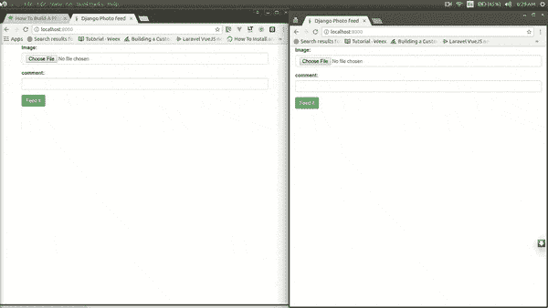
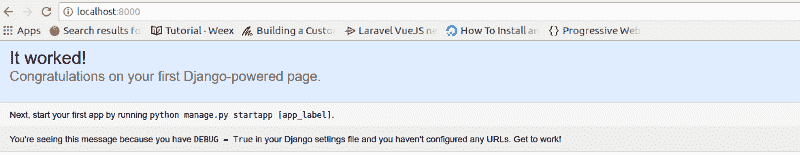
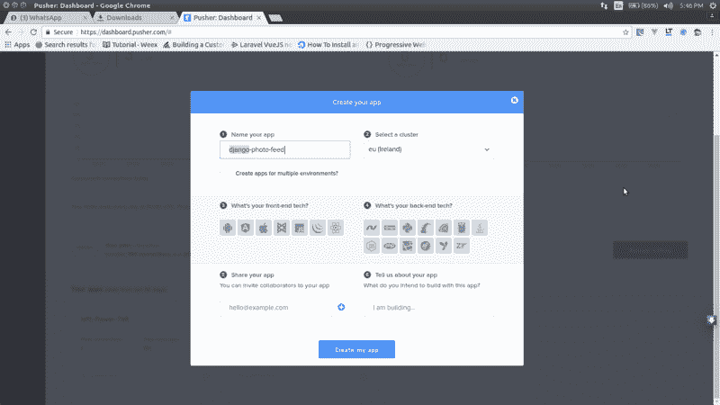

# 如何使用 Django 构建照片提要

> 原文：<https://www.freecodecamp.org/news/how-to-build-a-photo-feed-using-django-2d81c8519594/>

作者奥贡迪普·塞缪尔

# 如何使用 Django 构建照片提要

今天，我们将使用 Django 和 Pusher 制作一个实时照片馈送框架。这就像一个迷你 Instagram，但没有评论和过滤功能。

阅读本教程需要对 Django 和 jQuery 有一个基本的了解。

### 建立姜戈

首先，您需要安装 Django 库(如果我们没有的话)。

要安装 Django，我们运行:

安装完 Django 之后，就该创建我们的项目了。使用以下命令打开一个终端并创建一个新项目:

在上面的命令中，我们创建了一个名为`photofeed`的新项目。下一步将是在我们的新项目中创建一个应用程序。为此，让我们运行以下命令:

一旦我们完成了新应用的设置，Django 需要了解我们的新应用。为此，我们将进入`feed\settings.py`，将消息应用程序添加到我们已安装的应用程序中，如下所示:

完成以上工作后，就该运行应用程序了，看看是否一切顺利。在我们的终端 shell 中，我们运行:

如果我们将浏览器导航到`http://localhost:8000`，我们应该会看到以下内容:

### 在 Pusher 上设置一个应用程序

至此，Django 已经准备就绪。接下来，我们需要设置 Pusher，并获取我们的应用程序凭据。如果你还没有，注册一个免费的 [Pusher](https://pusher.com/signup) 账户，创建一个新的应用程序，然后复制你的秘密、应用程序密钥和应用程序 id。

下一步是安装所需的库:

在上面的 bash 命令中，我们安装了一个包 Pusher。— Pusher:这是 Python 的官方 Pusher 库。我们将使用这个库来触发和发送我们的消息到 Pusher HTTP API。

### 创建我们的应用程序

首先，让我们创建一个模型类，它将生成我们的数据库结构。让我们打开`feed\models.py`并用以下内容替换:

在上面的代码块中，我们定义了一个名为`Feed`的模型。提要表将由以下字段组成:

*   存储照片描述的字段
*   一个存储照片的字段在上面的代码中，在声明我们的文档字段时，我们包含了一个`upload_to`属性，我们将其设置为`static/documents`
    请注意，这个路径是相对于我们现在要设置的`DJANGO MEDIA ROOT`的路径的。

而在本文中，我们将把`MEDIA_ROOT`设置到我们的`feed`应用程序中的静态文件夹，因此它可以作为一个静态文件。为此，让我们转到我们的`photofeed/settings.py`，将下面的代码添加到我们的文件中，紧接在`STATIC_URL`声明之后。

### 运行迁移

我们需要进行迁移并运行它们，这样就可以创建我们的数据库表。为此，让我们在终端中运行以下命令:

### 创造我们的观点

我们的视图指的是支撑应用程序背后逻辑的文件，通常称为`Controller`。让我们打开`feed`文件夹中的`views.py`,用以下内容替换:

在上面的代码中，我们定义了三个主要函数，它们是:

*   指数
*   pusher _ 认证 _
*   推送进给

在`index`函数中，我们获取数据库中所有可用的照片。照片随后在视图中渲染。这使得新用户能够看到所有以前可用的提要。

在`pusher_authentication`函数中，我们验证当前用户可以访问我们的私有通道。

在`push_feed`函数中，我们检查它是否是一个 POST 请求，然后我们在将表单保存到数据库之前尝试验证它。(名为`DocumentForm`的方法中使用的表单尚不可用。我们将很快创建它。)在表单验证之后，我们调用 Pusher 库进行实时交互。

### 创建表单类

Django 表单处理用户输入、验证输入并将其转换成 Python 对象。他们也有一些方便的渲染方法。让我们在`feed`文件夹中创建一个名为`forms.py`的文件，并向其中添加以下内容:

在上面的代码块中，我们已经导入了我们的 Feed 模型，并使用它来创建一个表单。该表单现在将处理图像的验证和上传到正确的文件夹。

### 填充 URL 的. py

让我们打开我们的`photofeed\urls.py`文件，并用以下内容替换:

这个文件中有什么变化？我们在文件中添加了 3 条新路线。我们已经定义了入口点，并将其分配给我们的`index`函数。我们还定义了 push_feed URL，并将其分配给我们的`push_feed`函数。这将负责实时向 Pusher 推送更新。最后，`pusher_authentication`端点处理我们私有通道的认证。

### 创建 HTML 文件

现在我们需要创建 index.html 文件，我们引用它作为索引函数的模板。让我们在我们的`feed`文件夹中创建一个名为`templates`的新文件夹。接下来，我们在`templates`文件夹中创建一个名为`index.html`的文件，并用下面的代码替换它:

在这个 HTML 片段中，请注意我们已经包含了一些必需的库，例如:

*   Bootstrap CSS
*   jQuery JavaScript 库
*   Pusher JavaScript 库

### Pusher 绑定和 jQuery 代码片段

就是这样！现在，一旦一张照片被上传，它也会被广播，我们可以通过我们的频道实时更新。下面是我们用来处理文件上传和 Pusher 实时更新的 jQuery 代码片段。

下面是我们构建的图像:

### 结论

在本文中，我们介绍了如何使用 Django 和 Pusher 创建实时照片提要，以及如何使用 Django 在 AJAX 请求中传递 CSRF 令牌。

本教程的代码库可以在[公共 Github 库](https://github.com/samuelayo/pusher_django_photo_feed)中找到。可以下载用于教育目的。

有更好的方法，我们可以建立我们的应用程序，预订或评论，让我们知道在评论中。记住分享就是学习。

这篇文章最初发表在 Pusher 的博客[这里](https://blog.pusher.com/build-a-photo-feed-using-django/)