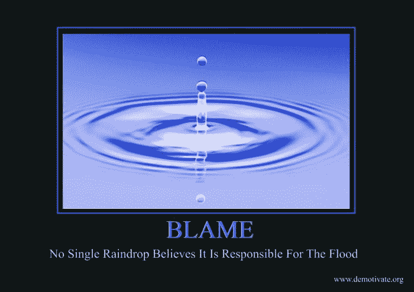

# 下面是我对 REST 的后续是新的 SOAP:让我们来谈谈原来的 REST

> 原文：<https://www.freecodecamp.org/news/follow-up-to-rest-is-the-new-soap-the-origins-of-rest-21c59d243438/>

**哲学论文我都看过了，你就不用看了！**

我预计我最近的文章(或者有些人称之为“嬉皮士式的醉酒狂言”)会受到接二连三的批评，其口号是“你对休息一无所知。”它确实发生了。

但这也引发了有趣的争论，尤其是在 Reddit 和 T2 黑客新闻上。这也触动了许多开发者的心弦，他们觉得自己像是怀疑 REST 万能性的异教徒。

引用一个[特别有见地的总结](https://news.ycombinator.com/item?id=15938460)的怨念:

> 一个简单的 RPC API 规范需要几分钟来定义。休息需要更长的时间，有一百万个小陷阱，没有真正的标准。对于应该如何做，每个人都有不同的看法。

> 数据分布在动词、URL、查询参数、头和有效负载中。每个人都认为其他人没有休息。如果你试图建议在办公室休息以外的事情，你就会成为政治迫害的对象。这真的是一种毫无意义的货物崇拜。

> 我的同事花了太多时间试图让 Swagger 正确地生成文档和客户端 API，但我们仍在处理无数的问题。它实际上是 SOAP 2.0，一个简单的 JSON/RPC 协议就足够了。

> 不要让我把 HTTP 服务器错误和应用程序错误混为一谈。并试图用一种为 CRUD 优化的思维方式来处理类似动作的请求。我们浪费了多少时间来找出 RESTfully 进行登录 API 调用的“标准”方法。

另一方面，REST 的主要倡导者之一 Phil Sturgeon 发布了一篇[回应文章](https://philsturgeon.uk/api/2017/12/18/rest-confusion-explained/)(见我的[快速评论这里](http://disq.us/p/1oy9a9l))。我很高兴我们在一些重要的问题上达成了一致，尤其是许多 API 实际上应该是 RPC，而不是以伪 REST 修补作业结束。

鉴于所有这些反馈，我对我最初的文章进行了多次编辑，现在似乎有必要写一篇新的文章来澄清其余的观点。

如果这篇文章给人的感觉是无礼的，我想提前道歉。考虑到局势的危害性，我唉不能满足于平静的语气。没有任何人身攻击的意思。所以让我们继续吧。

### 几种不同的休息方式

这个主题的一个难点是术语“休息”背后有几个概念

1)REST 的创始著作，即罗伊·菲尔丁
的论文；2)数以千计的 REST 倡导者的博客/播客(如菲尔·斯特金的博客),在网络上传播，并解释“如何正确地进行 REST”
3)互联网上公开或私下公开的大量 RESTful 服务

我的咆哮主要是针对那些浪费每个人时间的 RESTish APIs，它们的好处还没有被证实。即使在阅读了数百条评论之后，我也不得不坚持自己的立场:我在任何地方遇到的这些 API 都在不断地重新发明轮子，甚至没有利用 HTTP 语义可能带来的优势(客户端缓存、内容协商、乐观锁定……)，并且集成起来非常痛苦。

菲尔·斯特金的回应文章强调了这种无意义的缩影的主要原因:

> 各地的人们都在构建 RESTish APIs，它们基本上只是 RPC + HTTP 动词+漂亮的 URL。

一路上，我们通过一些 REST 倡导者的名言唤起了 **#2** 。至于其他方面，据我所知，rest 博客/播客经常互相矛盾。他们给出了听起来更像品味而非智慧课程的指示，回避了最重要的问题，并以实例和演示证明了不支持他们最大胆的论点的优点:*【RPC 导致冗余工作】*、*“REST 对于持续数十年的 API 是必要的”*，当然还有著名的*“客户使用它不需要任何服务的先验知识。”*

我还没有读过一页简单的散文来总结 hate as*到底是如何工作的，以及它为我们解决了哪些挑战。这本身就是一个问题。*

关于矛盾…这里有个趣闻。当我展示一个简单的(稍微面向 CRUD 的)API 时，只是为了展示为了重新定义它而必须回答的异常多的问题。尽管如此，许多评论者觉得必须用冗长的文档来解释他们将如何指定这个 API。

它导致了许多类似但不兼容的协议，一些将标准编织在一起，一些重新发明了雕刻的燧石族，一些甚至为每个资源端点指定了版本化的 MIME 类型(如*" application/vnd . my-rest-API . v1 . account-search-result+JSON "*)。

菲尔·斯特金在他的回应文章中也回答了这些半修辞性的问题。提交的建议很有意义，并且看起来是“最新的”但是它们直接违背了许多其他 REST 支持者(以及上面引用的评论者)在不同主题上的过去或现在的教导:稀疏字段、复合文档、补丁格式、删除有效载荷等等。

至少所有这些都证明了一点:当事情必须快速且一致地完成时，休息不是最好的方式。尽管如此，许多人声称我在攻击对 REST 的“误解”,并指引我去找原始论文中的这段或那段引文。这是一种说“理论”是好的方式，即使“实践”有缺陷。“是的，对，共产主义也是这样主张的，”有人可能会说。


How *some* REST advocates view its Founding Thesis

关于实践是否是 RESTful 的争论已经成为 web 开发生态系统中的一个话题。然而，出于学术诚实的考虑，回到论文 **#1** 和相关文章给出的最权威的 REST 定义上来实际上是很有趣的。至少要了解这种炒作是如何开始的，以及从中可以挽救什么。

我希望下面的摘要将被认为是足够忠实于原件。如果没有，我欢迎你对他们可能包含的其他“误解”的反馈。

### 最初的 REST 到底是什么？

罗伊·菲尔丁于 2000 年发表的[论文](https://medium.com/@pakaldebonchamp/follow-up-to-rest-is-the-new-soap-the-origins-of-rest-21c59d243438)自然很长(180 页)，所以它可能不会在 web 开发人员中被广泛阅读。

以下是其内容的分类。另外，你也可以阅读该论文的引言和结论章节。

*   第一章定义了与架构相关的术语，如元素、组件、属性、风格、模式等等。
*   第 2 章列出了基于网络的架构的关键属性:用户感知的性能、网络效率、可伸缩性、可修改性、可见性和可靠性。
*   第 3 章对现有的架构风格进行了分类(管道和过滤器、缓存、客户机-服务器、按需编码)，并展示了它们在上述关键属性方面的优缺点。
*   第 4 章总结了万维网架构的需求(低进入壁垒、可扩展性、分布式超媒体、无政府可伸缩性等等)，并解释了为什么需要一种专用的架构风格来指导其开发，尤其是在部署之前评估提议的扩展。
*   第 5 章介绍了 REST 架构风格:它所派生的现有风格，它的架构元素(资源及其标识符、表示、连接器、组件等等)，以及所有这些如何在流程和数据方面协同工作。
*   第 6 章给出了 REST 如何被用来指导 Web 协议标准(URIs、HTTP 及其众多特性和扩展)的开发的经验反馈，它在哪些地方没有被应用(cookies、报头中不同关注点的混合、URIs 的用户 id 等等)，以及从现代 Web 架构中可以学到的架构经验。


The book “An introduction to REST: Tome 1”

除了通常的[剩余约束](http://whatisrest.com/rest_constraints/index)之外，我们从这篇论文中得到了什么？

首先，正如**对“架构风格”的介绍所预期的那样，**它几乎没有提到 HTTP 方法、模式、错误处理、版本控制以及所有这些塑造现实世界 web 服务的具体主题。这就是为什么成百上千个矛盾的观点涌入来填补这个漏洞，这就是为什么有时听到休息被这篇论文“*精确地指定为*”会感到奇怪。

第二，REST 被形式化，为万维网的发展提供了理论基础。为了设计一个**互联网规模的分布式超媒体系统**，它混合了许多现有的架构风格，并继承了它们的优点和缺点。

这很有效。

*   在 web 上，我们很高兴所有网页都说 HTTP，用 GET 显示自己，用 GET 或 POST[统一接口]处理表单
*   在网络上，我们很高兴我们的浏览器理解数百种内容类型(HTML、图像、CSS、字体、Javascript、RSS…)，并根据众多内置规则(缓存、显示、安全…)处理它们[自我描述消息]
*   在网络上，我们很高兴有浏览器内缓存、内容交付网络和其他形式的共享缓存，有助于加快加载时间和吸收流量峰值(如“Slashdot effects”)。即使有时需要快速 ctrl+F5 来修复网页的奇怪行为。[分层系统和缓存]
*   在 web 上，我们很高兴代理和防火墙理解 web 协议，让它们流动，同时阻止可疑的 TCP/UDP 连接。[能见度]
*   在网络上，我们很高兴服务器可以为每个页面提供脚本，因为浏览器本身并不知道如何为提供的 HTML(按需编码)添加动态

论文中引出但未详述的一点[是“**超媒体作为应用状态的引擎**”**(hate OAS)。**在补充文章中，Roy Fielding 解释了"*超媒体控件、*"也称为"*"启示:*"一些美化的链接，向客户宣传"它接下来能做什么。"而他宣称(有点晚？)这些不仅仅是选项，而是 HATEOAS 是 REST 的核心。](https://www.ics.uci.edu/~fielding/pubs/dissertation/rest_arch_style.htm#sec_5_1_5)

> 当我说超文本的时候，我的意思是…信息和控件的同时呈现，这样信息就变成了用户获得选择和选择动作的启示。超文本不需要成为浏览器上的 HTML:当机器理解数据格式和关系类型时，它们可以跟随链接([源](http://roy.gbiv.com/talks/200711_REST_ApacheCon.pdf))。

> *信息和动作，通过令人惊叹的自我记录格式显示给用户，通过选择链接，将一个经过良好调整的客户端变成一个爬虫，而不仅仅是一个 CRUD 交换…这就是休息的全部要点([来源](https://blog.apisyouwonthate.com/representing-state-in-rest-and-graphql-9194b291d127))。*

> 自然，这就是我要解释为什么“作为应用程序状态引擎的超媒体”是一个 REST 约束的原因。不是一个选项。不是理想。超媒体是一种限制。也就是说，你要么去做，要么不休息([来源](https://www.infoq.com/articles/roy-fielding-on-versioning/))。

> *输入 REST API 时，除了初始 URI(书签)和一组适合目标受众的标准化媒体类型(即，任何可能使用该 API 的客户都应该理解的媒体类型)之外，无需任何先验知识([来源](http://roy.gbiv.com/untangled/2008/rest-apis-must-be-hypertext-driven))。*

关于这一点，网络似乎也是宁静的。从一个网站的主页，用户和网络蜘蛛能够毫不费力地浏览它，并处理沿途发现的相关媒体(图像、样式表、脚本等)。虽然 URL 会随着时间的推移而改变，表单会被添加和删除，但网站不需要版本号，这也没什么。


When I realized that the main HATEOAS example was just the world wide web

因此，我们看到最初的 REST 是一种强大的架构风格，它为服务器提供了对客户机的强大控制，并提供了可编辑超媒体的可爬行生态系统。

那么，你的 API 呢？他们的目标也是“*互联网规模的分布式超媒体系统，*”吗？

### 危险且(通常)不必要的圣杯

你可能听说过理查森成熟度模型。它评估 API 的 RESTfulness 级别，这取决于它是否使用了适当的资源(级别 1)、动词(级别 2)和超媒体控件(级别 3)。这个模型可能会给你一种感觉，你的一些“RESTish”API 是要在这些“*步骤上朝着 REST* 的荣耀进化”(正如 Martin Fowler 所描述的)。坏消息是，这很可能不会发生。

是的，您可以通过将服务器函数映射到资源 URL 来伪装 RESTfulness。是的，您可以通过将操作映射到最接近的 HTTP 动词来进一步伪装它。但是，当到了最终阶段，要真正拥有一个自描述的、可抓取的、超媒体驱动的应用程序时，您将不得不认识到一个残酷的事实:您的 API 不是 RESTful 的，它从来不是，也永远不会是。事实上，它获得“真正宁静”的机会比蛞蝓变成蝴蝶的机会还少。

还记得上一节罗伊·菲尔丁的话吗？他对休息的定义完全是关于仇恨。但这是一个极其雄心勃勃的声明。

这意味着您应该忘记无意义的 MIME 类型，如“text/xml”或“text/json”，并使用特定的内容类型，由契约支持，并可被 API 消费者识别。这意味着除非对于您的具体用例已经存在成熟的 RESTful 协议，否则您将不得不编写 RFC/IETF 风格的草案来描述您的特定内容类型的语义。您必须设计一个支持爬虫的超媒体系统，并指定其各种“启示”的含义您可能必须用客户自己的编程语言向他们提供客户端实现，因为他们除了完成如此艰巨的工作之外还有其他事情要做。

所有这些都是巨大的规范和实现工作。为了一些微不足道的好处。和令人担忧的缺点。

是的，这使得服务器端开发人员能够在不重定向的情况下控制他们的 URL 结构(*今天我将把“users/”重命名为“accounts/”——这样更流畅*)，但是代价是什么呢？除非你不断地生成新的 URL 来防止它，否则我打赌你的 API 消费者无论如何都会硬编码 URL，以避免这种额外的复杂性(启示的识别，URL 遍历缓存等)。)

是的，当最终消费者是人时，这使服务器能够控制可用的动作。但是用户体验呢？服务器任意显示和屏蔽启示是一个可怕的概念。当 [SPA](https://en.wikipedia.org/wiki/Single-page_application) 上的“删除”按钮丢失时，我想知道原因。如果我让我的 REST-crawler 程序创建“this”资源，我宁愿他失败并给出一个适当的远程错误消息，而不是说“*对不起，找不到这样的启示。*“安全规则、缺少依赖关系、并发任务和其他问题可以阻止操作。我们有权知道发生了什么，而“启示”在目前的形式下，错过了这个关键的特征。

还有，机器对机器的交互呢？如果 API 可进化性是关键，那么消费者项目如何理解新领域和新启示呢？Roy Fielding [回答](https://www.infoq.com/articles/roy-fielding-on-versioning/)“*这就是按需编码的闪光点。*“不可能。你不可能在短时间内将你的远程代码动态注入到我的 Python 程序中。

在阅读了数百页关于 REST/HATEOAS 主题的文章后，我很少会如此无动于衷。达到宁静的第三级应该是一种顿悟。我深感药物比疾病更糟糕。

现在，一些人认为 Roy Fielding 把这个概念推得太远了，认为“**轻量级 REST** ”(即“Richardson 成熟度等级 2”，没有超媒体控制)才是真正的目标。

但是，我打赌你实际上不需要这些。

*   您(很可能)不想要按需编码。您希望您的客户阅读您的规范，并按照您(和他们)的意愿准确地调用您的 API。
*   您(很可能)不想要网络级的可见性。相反，您想要尽可能多的 TLS 加密。
*   您(很可能)不想要共享缓存或客户端缓存。相反，远程缓存是你最大的敌人。如果您的 API 消费者不是浏览器，他们通常会忽略缓存头。
*   您(很可能)不需要内容协商，其他 HTTP 特性或多或少与 REST 最佳实践捆绑在一起(您知道，表示与资源)。每一种最新的语言都能理解像 Xml 和 Json 这样的格式。
*   您(很可能)不希望为 CRUD 操作公开资源，并使用这些笨拙的中间人来触发应用程序中的实际操作。

您(很可能)想要的只是向远程浏览器或服务器公开一些服务器端功能。以快速、优雅、稳健的方式。

**你的 API(极有可能)尖叫着“RPC”。在这种情况下，即使是摩天大楼大小的鞋拔子也不能让它适合非常雄心勃勃，但很少相关的 REST 建筑风格。**

当然，您可能需要 HTTP 的这个或那个属性。例如，您可能希望对源自 Ajax 的只读操作使用 GET 方法和不同的 URIs，以便从浏览器端缓存中获益。或者，您可能希望将您的数据库公开为 CRUD-over-HTTP，以利用一般的实现(如 JsonAPI 协议的活动记录风格客户端)。

但是不管你的需求是什么，生命是短暂的。您不需要像 REST 约束那样从一个抽象的“指南集”开始。你最好找一个**交钥匙协议**，匹配你真正拥有的需求。

对于轻量级 RPC、CRUD、发布/订阅、作业队列、远程文件系统、数据查询/过滤、高性能计算和双向消息传递，有大量这样的解决方案(大多数是非 RESTful 的)。很少情况下，您必须进行创新——为协议添加新功能，或者使用混合方法。但是开始“把动词变成名词”或者把抽象的原则当成教条来遵循是你最不需要做的事情。

顺便说一下，请注意 CRUD 也可以作为 RPC 的一个子集来完成。web 服务通常不再用 C 语言编码，所以如果你看到又有一个漫游者认为“*必须编码这么多样板 CRUD 函数*是很糟糕的”，请用这种高科技 API 启发他们。

```
create(type, **params) -> id
retrieve(type, id, **params)
update(type, id, **params)
delete(type, id, **params)
```

在你(很可能)不平静的道路上，你会遇到几十个坚定的演讲，声称只有休息才能让你变得可伸缩和长寿。没有必要反驳从未被证明过的东西。从个人经验来看，我只能判断:

*   一个配置良好的数据库和一个简单的服务器端缓存足以满足 99%的 web 服务；一个古老的智慧说*过早的优化是万恶之源*。
*   服务不断发展。无论它意味着远程过程中的新参数还是资源表示中的新字段，都没有多大关系。就我所知, [API 进化](https://blog.apisyouwonthate.com/api-versioning-has-no-right-way-f3c75457c0b7#API%20Evolution)的概念是，除了来自软件开发的简单古老的智慧之外，什么也不是:除非绝对需要，否则不要做出突破性的改变，并且使用兼容层来帮助每个人以合理的速度前进。
*   即使你笨拙地设计你的 API，在它有真正的兼容性问题之前，它肯定会死。也许不是因为它的目的变得无关紧要，也许不是因为粉碎竞争对手，但可能是因为你的营销部门的想法发生了变化。
*   花时间正确集成大多数 REST 风格的 API，可以实现相应轻量级 RPC webservices 的几个连续版本。让我们保持务实。
*   当一家预期寿命不到 2 年的科技初创公司花三分之一的时间编写 REST(ish)样板文件时，它的 CTO 可能应该被打一巴掌。他们所需要的只是良好的编程实践和廉价的变通方法，直到可伸缩性成为一件值得思考和花钱的事情。

最重要的是，请放弃这个被称为“HATEOAS”的圣杯任务，除非你是世界上少数关心这个任务的骑士之一。

REST/HATEOS 适用于特定的以数据为中心的 API:那些自然是 CRUD 的 API，那些通过 ActiveRecord 或 DataMapper 模式以您喜欢的语言消费的 API，那些在模型的字段之间没有大量微妙的约束和副作用的 API，以及那些旨在由人类探索的 API(目前宇宙中唯一能够理解这个新出现的" *billing contact email* "字段含义的实体)。

否则，您将会以 RESTish APIs 的笨拙而告终，而且会带来额外的复杂性。


When used inadequately, REST is like “Monty Python and the Holy Grail,” but with thousands of rabbits

HATEOS 的一个相关用例是一个通用的“数据库管理协议”，允许任何服务器通过其(SQL 或非 SQL)数据库的结构驱动同一个通用的单页应用程序:在表和记录页之间导航，为每个模式自动生成表单，动态创建/编辑/删除按钮，等等。

以类似的方式，一个专门用于浏览和编辑文档，或者探索/拉/推版本控制系统的 API，会很好地适应 REST 架构风格。但是这些离大多数网络服务的目的还很远很远。如果 Github 的 API 从 REST 切换到 GraphQL，这暗示 REST 声称的好处仅仅是 T2 还不够 T3。

### 哪里出了问题？

所以我们在这里。REST/HATEOS 当然是一种进化得很好的架构风格，但是(我觉得)只与一小部分用例相关。现在，它已经像癌症一样在 web 服务的生态系统中蔓延开来——主要是在其被称为“RESTish APIs”的删节形式下——到处都带来了不足和人为的复杂性。这种尴尬局面该怪谁？

*   最初的论文没有将 REST 与其他体系结构进行比较，并且对其优缺点过于含糊？
*   REST 倡导者，他们经常迷失在非常主观的(当不矛盾时)建议中，而不是宣传标准和解释何时(不)使用 REST？
*   是那些不可计数的文章在肥皂和休息之间展示了一个错误的困境，从而把一个默认的赢家推给了明星们？
*   互联网巨魔们在关于 web 服务设计的每个 StackOverflow 线程中宣称，“*忘记现有的 XYZ 协议，它是一个额外的层，使东西不可维护，你需要的只是手工制作的 HTTP* ”？
*   时髦的爱好者将 REST 强加给他们的团队，而没有讨论这种架构变化的影响，也没有问过他们自己"*但是为什么呢？*
*   沉默的开发人员群体，他们和我一样，多年来一直知道有些事情非常不对劲，但却没有揭发出来？



没错。我猜是所有这些的混合。

这个故事的残酷讽刺在于，[原始论文](https://www.ics.uci.edu/~fielding/pubs/dissertation/introduction.htm)本身就警告了跟风和不恰当的架构选择:

> “我们经常看到软件项目从采用最新的架构设计开始，直到后来才发现系统需求是否需要这样的架构。根据流行词进行设计是常见的事情。[……]REST 接口被设计成对于大粒度超媒体数据传输是有效的，针对 Web 的常见情况进行了优化，但是导致接口对于其他形式的架构交互不是最佳的。

然而，一些好消息是 REST 为其他协议铺平了道路，比如 GraphQL 和 HTTP2。它对高级 HTTP 特性的使用是对其他架构的启发。我们至少应该这样做。

### 如果你真的必须重新定义呢？

出于很多原因(比如公司层级，或者确实需要带有 HTTP 缓存的 CRUD)，您可能不得不休息一下。不管有没有帽子。

在我的上一篇文章中，我提到 REST 客户机和服务器的工业化是一个无解的问题。**事实证明我错了** *。*

下面是一个与 REST 相关的“标准”的非详尽列表，来自不同评论者的意见。你可以在 Phil Sturgeon 的新 [standards.rest](http://standards.rest/) 列表中找到更多信息。

*   指定补丁的语义:JSON 补丁，JSON 合并补丁
*   指定接口契约:JSON 模式、API 蓝图、OpenAPI(以前的 Swagger)、RAML、GraphQL 类型、XML 模式
*   序列化响应中的结果和/或错误:JSend 格式、RFC 7807(HTTP API 的问题细节)、稀疏字段集(限制要返回的字段)、复合文档(包括相关资源)
*   具有超媒体控制的协议:JSON 超级模式(IETF 草案)、JSON 超文本应用语言或“HAL”(IETF 草案)、Json-API、OData、Mason、Hydra/JSON-LD、JSON SIREN

这些确实是相当多的可能性。可能性的组合爆炸，因为它们中的许多只处理协议的一小部分。这些标准化的努力是受欢迎的，尽管有些晚了:在罗伊·菲尔丁的论文发表近 18 年后，最 RESTful 的(超媒体)仍在起草中。


REST APIs have standards. Like phone chargers do.

你知道为什么我在之前的咆哮中没有提到他们吗？

因为在整合大公司(想想谷歌、微软、甲骨文、Dropbox、Spotify 和其他公司)以及小企业的 API 的这些年里，**没有一次**我符合这些“标准”中的任何一个，无论是明确的还是隐含的。可能是因为我运气不好吧。也许是因为他们很少被使用。

在我看来，这种看得见的标准化的缺乏与其余的的**原罪有关:出于某种原因，它带有非常强烈的反标准心态，带有蒙昧主义的“*你所需要的只是爱和 HTTP* 哲学。因此，即使是最有才华的开发人员也有冲动在自己的角落里指定他们自己的半生不熟的协议，而忽略了成千上万已经做了同样事情的其他人。**

在您的情况下，自然地，最小的伤害将是使用现有的标准和库。最好是成熟的协议，而不是乐高式的 RFC 集合。

不过，我要警告你。这里也有龙。

有时候，细节决定成败。计算机科学中的一个古老智慧表明，错误不会消失。这就是为什么保持对象格式的一致性是一个好的实践:它们的一些字段可能被无效，但是它们无论如何都是存在的(除非客户要求)。这是防止*假阴性*(由于打字错误)的最好方法，并且如果这些字段的 *quantic* 属性(经常)没有被正确地记录，这也是避免严格客户端中随机破坏的最好方法。

我认为这个想法自然也适用于 REST 表示。太糟糕了:像 [JSON 合并补丁](https://tools.ietf.org/html/rfc7386)这样的标准强迫你删除远程字段，而不是使它们无效。这些微小却能引发天启的细节在一个声称“*帮助客户端和服务器独立发展的哲学中尤其不合适。*

有时候，魔鬼有大象那么大。听说过这个 OpenAPI(以前的 Swagger)吗，它是最雄心勃勃的 REST 标准之一？这个想法是在一个规范文件中用端点和模式来描述你的 API，并使用 OpenAPI 工具来工业化客户端和服务器的创建。听起来很好听，不是吗？

这里是 Kubernetes API 的 json 接口规范的一个[例子。是的，Json 模式本质上非常冗长。](https://raw.githubusercontent.com/kubernetes/kubernetes/master/api/openapi-spec/swagger.json)

好了，现在这里是 Python 的[对应客户端实现](https://github.com/kubernetes-incubator/client-python/tree/master/kubernetes/client)。

到今天为止，已经有超过 90，000 行 Python 代码和注释，由 OpenAPI 自动生成。而不仅仅是瘦包装器，从自动文档工具和 IDE 自动完成中获益。九万行。比他们的 json 接口规范更多。什么？的。实际。见鬼。


When you ask OpenAPI for a catamaran

每种语言，每种框架，对于如何处理 OpenAPI 都有自己的想法。有些人选择混合(并且优雅地不含杂质)方法。有些从服务器代码生成一个规范文件。大多数从所述规范文件生成大量样板文件。有时他们走得更远，也生成测试。

更多的工具和更多的代码生成器意味着更多的错误和更难的学习曲线…这一切是为了什么？Kubernetes SDK 作为一组方法向 Python 公开。使用硬编码的 URL。同样，一些 RPC-over-CRUD 系统，被许多人认为是最先进的 RESTfulness，同时忽略了 HATEOAS。我发现这一切完全令人困惑，我希望我不是唯一一个。

因此，对于您可能选择的与 REST 相关的协议和框架要特别小心。有些很方便有效，但是有些让 REST 看起来越来越像新的 SOAP。

### TL；速度三角形定位法(dead reckoning)

最初的 REST 就像火箭工程:令人兴奋，但是非常具体、非常复杂，并且相当有害，除非您确切地知道自己在做什么。

RESTish APIs 更实惠，但是请确保您会从中受益，因为这种情况很少发生。引用菲尔·斯特金的一条简单的经验法则:

> 如果一个 API 主要是动作，也许它应该是 RPC。如果一个 API 主要是 CRUD，并且操纵相关的数据，也许它应该是 REST 。

有很多 REST(ish)“标准”存在，所以不需要从头开始指定一个。但是不管你的需求是什么，小心那些时髦的词语，为正确的工作使用正确的工具(REST 和 RPC 只是数百个中的两个)，最重要的是， [KISS](https://en.wikipedia.org/wiki/KISS_principle) 。我敢打赌，使用一个通用的 JsonAPI 客户机，并在一个真正的预编程服务器上验证它，会比花几天时间生成大量样板 OpenAPI 代码更成功——只是后来发现它实际上并不匹配远程端，因为存在 bug 或其他不兼容性。

顺便说一下，其他架构也是如此:使用简单的 JsonRPC 或 JsonWSP 协议可能会节省时间，而不是用 gRPC 生成样板文件，只是后来意识到这个闪亮的协议甚至没有指定如何报告应用程序级错误。

### 收场白

休息是一个很难谈论的话题。创始论文中有许多情节漏洞，许多相互冲突的定义，许多关于如何做好这件事或那件事的矛盾观点，许多不合理的宣传和羞辱，许多(未充分利用的和部分的)标准…以及极少的 HATEOAS APIs 的真实例子(我遇到的大多数链接都是死的，持续几十年的"*"也不过如此)。*

*但是我希望这个分析能够稍微澄清一下人们所谈论的不同的“REST ”,并且它将为您节省一些我不得不花费的时间来理解最初的 REST 是什么意思。*

*至少，你现在有了一件新武器。下次您的老板希望您将一些服务器操作公开为 REST webservices 时，只需问一下:*

*对于这个 API，我们真的需要遵循一种为互联网规模的分布式超媒体系统设计的复合架构风格吗？*

*他脸上的表情会是你的答案。*

*请在下面留下你的评论。以下是媒体对这篇文章的评论:[https://medium.com/p/21c59d243438/responses/show](https://medium.com/p/21c59d243438/responses/show)*