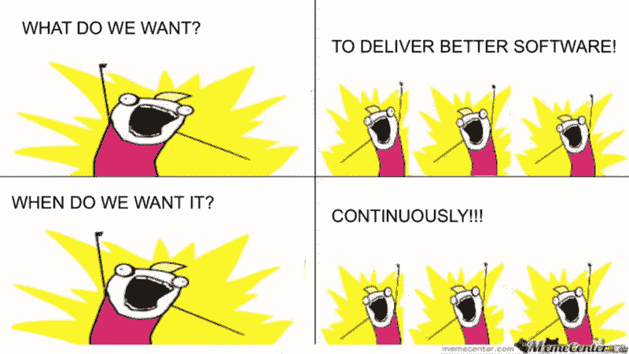

# 扩展和交付你的 SaaS 创业公司的最佳方式

> 原文：<https://www.freecodecamp.org/news/the-best-way-to-scale-and-deliver-your-saas-startup-53c0d62fb6f7/>

在竞争激烈的市场中创办一家新的 SaaS 创业公司是一项挑战。但如果执行得当，最终结果可能是有益的。对于错误和失算是不可原谅的。这篇文章将解释你应该何时以及如何在避免常见陷阱的同时扩大你的 SaaS 创业。

### 不要过早扩展

当你还没有准备好的时候，不要过早地扩大规模。如果您仍在以下任何阶段操作，请立即停止。回去工作，在你考虑扩大规模之前获得你的前十个客户。让我们来看一下这些预扩展阶段:

*   **市场验证:**你找到了一个小众问题的解决方案。你分享了你的想法，人们愿意为你的解决方案买单。太好了！你已经验证了你的市场。是时候建立你的 MVP 了。
*   **MVP 完成:**您已经为您的解决方案构建了最小可行的产品。现在是时候获得测试人员、反馈和付费客户了。找到你的营销渠道，并运行你的初始营销活动，以获得测试者。
*   付费用户:你至少有十个付费用户在使用你的软件。现在你可以开始考虑改善和扩大你的 SaaS 了。

如果你已经经历了这些阶段，那么恭喜你！现在，您已经准备好开始初始 SaaS 缩放过程。否则，手动执行所有操作。这包括客户支持、应用程序部署和计费。继续下去，直到你验证你的市场，并获得付费客户。我推荐阅读[这篇文章](https://www.chargify.com/blog/the-stages-of-a-saas-company/)来了解 SaaS 的创业阶段。

### 逐渐扩展

对 SaaS 的初创公司来说，将规模扩张视为一个渐进的过程至关重要。我目睹了许多创业公司生活在他们的软件会在一夜之间成为病毒的梦想中。他们投入时间和资源为他们的“重要时刻”做准备那个时刻永远不会发生，即使奇迹或特殊情况发生了，它也不会满足你的期望。我经历了惨痛的教训。

**缩放过程是渐进的**。不要一次扩展你的整个业务，除非你需要，否则不要扩展。每个扩展阶段都会耗费您的时间和资源，因此最好对您的需求进行优先排序，并相应地进行扩展。

在服务机器人公司，当我们打算扩大一家 SaaS 初创公司的规模时，我们通常会瞄准三个领域。计费、客户关系和云基础设施。每个领域针对您的 SaaS 业务的不同功能。您决定扩展的顺序基于您当前的客户反馈和运营渠道。基于你当前的需求，一个人可能比其他人更愿意和你交谈。让我们穿过这些区域。

### 按比例计费:自动计费，更快获得支付

大多数 SaaS 企业采用订阅计费模式。如果您正在花费时间向客户发送手动发票和提醒。如果您正在手动跟踪免费试用，并且不提供分层的 SaaS 产品，您可能希望首先扩展您的计费系统。

调整您的计费流程取决于您的计费结构。但是，任何 SaaS 企业都可以实施一些常见的改进来扩展其会计核算:

*   **分级定价**:您可能已经开始使用单一等级的产品(很好的开始方式)。但是随着客户群的增长，你会发现自己提供了更多种类的软件。分层定价功能还包括在结账时附加定价的能力。
*   **自动计费**:每个计费周期自动向客户收费。这将节省您的会计团队每月的工作日。目标是让您和客户的支付过程快速、高效、透明。
*   免费试用:对 SaaS 公司来说，让客户进入公司大门的最常见方式之一就是免费试用。这个特性比看起来更复杂。您的免费试用系统应该在试用即将到期时通知用户。试用期结束后，自动向客户收费。然后，如果客户决定不延长试用期，则自动停用软件。

其他功能包括向顾客提供退款和信用点数。它还可以对运行中的软件申请**额外费用**，并给予客户**支付审批**权限。

如果您准备开始扩展您的计费系统，请写下您的 SaaS 业务所需的功能。有许多应用程序可以帮助你扩展你的 SaaS 计费系统，例如 [Stripe](https://stripe.com/) 、 [Chargify](https://www.chargify.com/) 或 [ServiceBot](https://servicebot.io?title=howtoscaledeliver) 。

### 规模 CRM:拉近与客户的距离

你可能已经开始使用客户关系管理系统来管理你所有的客户。但是 CRM 不仅仅是管理客户。当你的客户登陆你的网站时，你和他们的关系就开始了。如果你没有收集足够的用户数据，那么你就会失去客户。

一旦你准备好扩展你的客户关系系统，有一些共同的特点需要考虑:

*   **用户管理**:您的客户数据可能分散在多个应用程序中。例如，在客户个人数据、计费信息和交互历史中。要扩展您的客户管理系统，请考虑您希望从中央平台访问的所有用户数据。
*   **即时支持**:你不想让你的客户等待答案。客户已经习惯于即时访问信息。他们对你的业务也有同样的期待。该功能将实时聊天系统集成到您的 SaaS 平台中。因此，您的客户可以在您产品的任何地方联系您。
*   **知识库**:随着客户群的增长，您会收到更多关于产品使用指南的问题。扩展您的知识库系统允许您创建一个中央文档库。当客户有问题时，您可以使用它来重定向客户。随着公司规模的扩大，编写文档总是一个好的做法。

扩展你的客户关系系统可以帮助你提高转化率。市场上有很多工具可以帮助你扩展你的 CRM 系统。与 ServiceBot 的集成是扩展您的 SaaS CRM 的良好开端。

### 扩展部署:自动化您的部署

扩展部署需要适当的架构和规划。在这个阶段，您将添加一个自动部署系统。在那里，客户可以立即访问你的软件，而不需要你做任何手工操作。

要自动化和扩展您的部署系统，您应该考虑以下步骤:

*   容器化应用程序:您可能开始考虑应用程序部署。但是你必须确保你的软件是容器化的。 [Docker](https://www.docker.com/) 是集装箱应用的行业标准。
*   **云管理**:一旦你的应用被容器化，你就可以使用云管理软件了。比如[库伯内特](https://kubernetes.io/)。这将使您的部署自动化，自动扩展/缩减，并管理您的云资源。
*   **CI/CD** : CI/CD 是持续集成/持续部署的简称。CI/CD 是一种不断开发、修补、测试和向客户发布软件新版本的现代策略。随着规模的扩大，CI/CD 将成为 SaaS 流程的核心。大型企业这样做是为了最大限度地减少维护，最大限度地创新，并增加收入。

要了解更多关于稳定云基础设施的信息，我推荐[这篇文章](https://medium.freecodecamp.org/how-to-make-your-startups-cloud-more-stable-4-practical-devops-tips-823e4202518c)。

### 结论

在您收集了所有需求并了解 SaaS 秤流程的全部范围之前，不要开始秤重。给自己足够的时间去伸缩；当开发速度过快时，没有一个软件能很好地工作。确保在开发之前有合适的架构。

利用为你准备的工具。 [**服务机器人**](https://servicebot.io/?title=howtoscaledeliver) **SaaS 管理软件**是扩大你的 SaaS 创业规模的好地方。

#### 想要缩放您的 SaaS 吗？[跟我预约免费咨询](http://bit.ly/sbotconsult)。