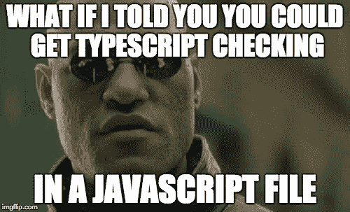
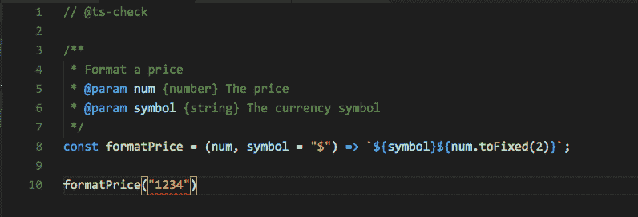
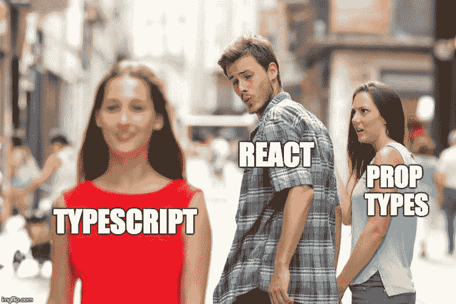
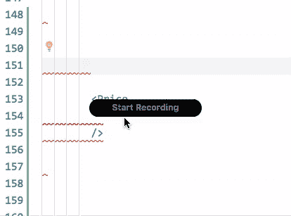
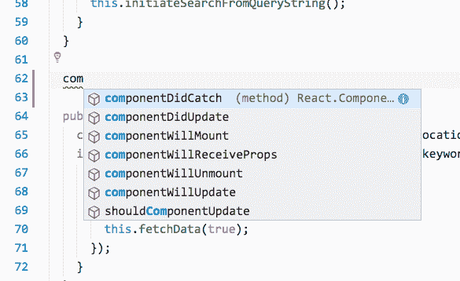

# 为什么不使用 TypeScript？

> 原文：<https://www.freecodecamp.org/news/why-would-you-not-use-typescript-67d0baa3eaca/>

乔纳森·克里默

# 为什么不使用 TypeScript？

在一个 JavaScript 可以说是当今最流行的软件开发工具的世界里，它似乎无处不在。对于 Node.js，它在后端，对于 Electron，它在你的机器上是本地的，对于 React Native，它在你的手机上是本地的。毫无疑问，JavaScript 至少在如此多的生态系统中无处不在。

所以，我的下一个问题是，如果 JavaScript 如此受欢迎，那么就本质而言，TypeScript 也应该受欢迎。毕竟，万一你没意识到…

> 任何你能写的至少是 ECMA 第三阶段的 JavaScript 都是有效的类型脚本。


### 虚拟代码

首先，如果你没有使用 Visual Studio 代码编写 JavaScript，你应该这样做，所以[去得到它](https://code.visualstudio.com/)，也去从[伯克荷兰](https://twitter.com/burkeholland)得到[所有这些东西](http://vscodecandothat.com/)。

在幕后，TypeScript 编译器将为您做许多令人惊奇的事情，而您甚至都不用再考虑它。它能够做到这一点的原因是，VS 代码正在通过 TypeScript 编译器运行您的 JavaScript，无论您是否意识到这一点。

[**微软/TypeScript**](https://github.com/Microsoft/TypeScript/wiki/JavaScript-Language-Service-in-Visual-Studio)
[*TypeScript 是 JavaScript 的一个超集，编译后清理 JavaScript 输出。*github.com](https://github.com/Microsoft/TypeScript/wiki/JavaScript-Language-Service-in-Visual-Studio)

最重要的是，它还使用了一种叫做自动类型定义的东西，使用了惊人的[明确类型化的](https://github.com/DefinitelyTyped/DefinitelyTyped)类型定义库，为成千上万个流行的 JavaScript 库自动下载类型。

### 从 JS 到 TS，TypeScript 让您

在下面的例子中，我们只是格式化一个价格字符串。

很容易忘记，如果在这里传递一个字符串，这个函数会被忽略，因为`toFixed`在字符串中不存在。

简单地添加类型可以避免运行时的错误…

但是，还有更好的消息…



您可能是也可能不是 JSDoc 的大用户，但是如果您是，您会很高兴地知道，从最近的 TypeScript 版本开始，您可以将`// @ts-check`添加到 JavaScript 文件的顶部，并在其中进行类型检查！



这里有更多关于你能用 JSDoc 做什么的信息…[https://github . com/Microsoft/TypeScript/wiki/JSDoc-support-in-JavaScript](https://github.com/Microsoft/TypeScript/wiki/JSDoc-support-in-JavaScript)

使用 VSCode，您可以通过以下用户设置选项启用完整类型检查…

```
"javascript.implicitProjectConfig.checkJs": true
```

如果您想在整个项目中定义任何接口，您可以添加一个 globals.d.ts 文件并在全局名称空间下声明内容。

```
declare global {  interface IFormatPrice {}}
```

### 反应

酷的是，TypeScript 还支持 React out of the box，方法是将以下内容添加到您的 tsconfig…

```
{ "jsx": "react" }
```

现在真正有趣的是…



PropTypes 是捕捉运行时 React 错误的好方法。但令人沮丧的是，直到你的应用程序构建完成，浏览器或热加载重新加载，并且你在控制台中看到一个神秘的红色错误消息，你才知道是否有东西坏了。

在处理组件时捕捉到那个 bug 不是很好吗？

现在，看看这个…



能在道具上获得智能感知，太神奇了。您可以开始键入，或者在 VSCode 中按 Control + Space 来打开 Intellisense 菜单。

你甚至可以在 React 类上获得智能感知…



### 结论

无论您是否决定全面使用 TypeScript，很明显，即使您坚持使用纯 JavaScript，也可以看到许多好处。

*最初发布于[jonathancreamer.com](http://jonathancreamer.com/why-would-you-not-use-typescript/)2018 年 2 月 2 日。*