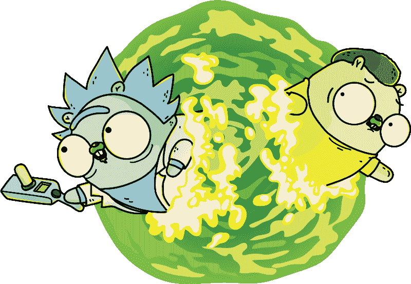
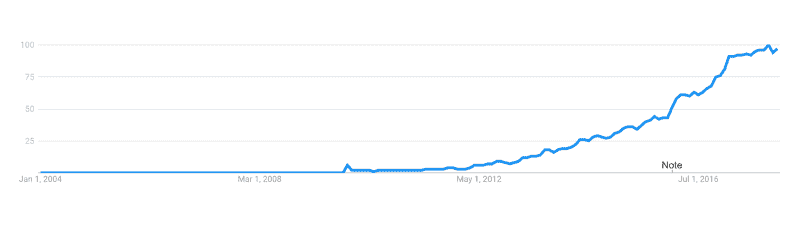

# 以下是一些你不太听说的围棋惊人优势

> 原文：<https://www.freecodecamp.org/news/here-are-some-amazing-advantages-of-go-that-you-dont-hear-much-about-1af99de3b23a/>

基里尔·罗戈沃伊

# 以下是一些你不太听说的围棋惊人优势

Artwork from [https://github.com/ashleymcnamara/gophers](https://github.com/ashleymcnamara/gophers)

在这篇文章中，我将讨论为什么你应该给 Go 一个机会以及从哪里开始。

Golang 是一种编程语言，在过去的几年里你可能听说过很多。尽管它创建于 2009 年，但直到最近几年才开始流行起来。

Golang popularity according to Google Trends

这篇文章不是你平时看到的围棋主要卖点。

相反，我想向你展示一些相当小但仍然重要的特性，只有在你决定尝试一下之后，你才会知道。

这些惊人的特性并没有在表面上展示出来，但是它们可以帮你节省几周或者几个月的时间。它们还可以让软件开发变得更加有趣。

如果围棋对你来说是新事物，也不要担心。本文不需要任何语言方面的经验。我在底部添加了一些额外的链接，以防你想了解更多。

我们将讨论以下主题:

*   戈多克
*   静态代码分析
*   内置测试和分析框架
*   竞争条件检测
*   学习曲线
*   反射
*   固执己见
*   文化

请注意，这个列表没有任何特定的顺序。也是固执己见的要命。

### 戈多克

Go 非常重视代码中的文档。简单也是。

GoDoc 是一个静态代码分析工具，可以直接从你的代码中创建漂亮的文档页面。GoDoc 的一个显著特点是，它不使用任何额外的语言，如 JavaDoc、PHPDoc 或 JSDoc 来注释代码中的结构。只有英语。

它尽可能多地使用从代码中获得的信息来概述、组织和格式化文档。它拥有所有的附加功能，比如交叉引用、代码示例和到版本控制系统存储库的直接链接。

你所能做的就是添加一个老式的注释，它也会反映在文档中。你甚至可以通过 web 界面或本地添加[代码示例](https://blog.golang.org/examples)和**实际可运行的**。

GoDoc 是整个社区唯一使用的 Go 文档引擎。这意味着用 Go 编写的每个库或应用程序都有相同的文档格式。从长远来看，在浏览这些文档时，它会节省你大量的时间。

例如，这里是我最近最喜欢的项目的 GoDoc 页面: [pullkee — GoDoc](https://godoc.org/github.com/kirillrogovoy/pullkee) 。

### 静态代码分析

Go 严重依赖静态代码分析。例子包括用于文档的 [godoc](https://godoc.org/) ，用于代码格式化的 [gofmt](https://golang.org/cmd/gofmt/) ，用于代码风格林挺的 [golint](https://github.com/golang/lint) ，等等。

它们数量如此之多，以至于有一个名为 [gometalinter](https://github.com/alecthomas/gometalinter#supported-linters) 的包罗万象的项目将它们组合成一个单一的实用程序。

这些工具通常被实现为独立的命令行应用程序，并且可以很容易地与任何编码环境集成。

对于现代编程来说，静态代码分析实际上并不是什么新鲜事物，但是 Go 却把它带到了极致。我不能过高估计它节省了我多少时间。而且，它给你一种安全感，好像有人在掩护你。

创建自己的分析器非常容易，因为 Go 有专门的内置包来解析和处理 Go 源代码。

你可以从这个演讲中学到更多: [GothamGo 启动会议:Alan Donovan 的 Go 静态分析工具](https://vimeo.com/114736889)。

### 内置测试和分析框架

你曾经尝试过为你从零开始的 Javascript 项目选择一个测试框架吗？如果是这样，你可能会理解经历这种分析瘫痪的挣扎。你可能也意识到你没有使用你选择的框架的 80%。

一旦您需要进行一些可靠的分析，这个问题就会重复出现。

Go 附带了一个内置的测试工具，旨在简化和提高效率。它为您提供了最简单的 API，并做了最少的假设。您可以使用它进行不同类型的测试、分析，甚至提供可执行代码示例。

它生成 CI 友好的开箱即用输出，使用起来通常像运行`go test`一样简单。当然，它还支持一些高级特性，比如并行运行测试，将它们标记为跳过，等等。

### 竞争条件检测

您可能已经知道 Goroutines，它在 Go 中用于实现并发代码执行。如果你不知道，这里有一个非常简单的解释。

不管采用何种技术，在复杂的应用程序中进行并发编程从来都不是一件容易的事情，部分原因是可能存在竞争条件。

简而言之，当几个并发操作以不可预测的顺序完成时，就会出现竞争情况。这可能会导致大量的 bug，而这些 bug 是很难追踪的。曾经花一天时间调试一个只在大约 80%的执行中有效的集成测试吗？这可能是一个比赛条件。

尽管如此，并发编程在 Go 中是非常重要的，幸运的是，我们有一个非常强大的工具来找出这些竞争条件。它完全集成到 Go 的工具链中。

您可以在这里阅读更多相关信息并了解如何使用它:[介绍 Go Race 检测器—Go 博客](https://blog.golang.org/race-detector)。

### 学习曲线

一个晚上就能学会所有围棋的语言特色。我是认真的。当然，还有标准库，以及不同的、更具体的领域中的最佳实践。但是两个小时完全足够让你自信地编写一个简单的 HTTP 服务器或者命令行应用程序。

这个项目有[令人惊叹的文档](https://golang.org/doc/)，并且大部分高级主题已经在他们的博客[上有所涉及:Go 编程语言博客](https://blog.golang.org/)。

与 Java(及其家族)、Javascript、Ruby、Python 甚至 PHP 相比，Go 更容易带给你的团队。该环境易于设置，并且在您的团队完成第一个产品代码之前，他们需要进行的投资要少得多。

### 反射

代码反射本质上是一种隐藏在引擎盖下并访问不同种类的关于语言结构的元信息的能力，比如变量或函数。

鉴于 Go 是一种静态类型的语言，当涉及到更松散类型的抽象编程时，它会受到许多不同的限制。尤其是与 Javascript 或 Python 这样的语言相比。

此外，Go [没有实现一个叫做 Generics](https://golang.org/doc/faq#generics) 的概念，这使得以抽象的方式处理多种类型变得更加困难。然而，许多人认为这对语言是有益的，因为泛型带来了大量的复杂性。我完全同意。

根据 Go 的哲学(这本身是一个独立的话题)，你应该努力不要过度设计你的解决方案。这也适用于动态类型的编程。尽可能坚持静态类型，当你确切地知道你正在处理哪种类型的时候使用接口。接口非常强大，在 Go 中无处不在。

然而，仍然有这样的情况，你不可能知道你面对的是什么样的数据。JSON 就是一个很好的例子。您在应用程序中来回转换各种数据。字符串、缓冲区、各种数字、嵌套结构等等。

为了实现这一点，您需要一个工具来检查运行时的所有数据，这些数据根据其类型和结构而有不同的行为。反思拯救！Go 有一个一流的 [reflect](https://golang.org/pkg/reflect/) 包，可以让你的代码像在 Javascript 这样的语言中一样动态。

一个重要的告诫是要知道你使用它的代价——只有在没有更简单的方法时才使用它。

你可以在这里阅读更多信息:[反射定律——Go 博客](https://blog.golang.org/laws-of-reflection)。

你也可以在这里读到一些来自 JSON 包源代码的真实代码:[src/encoding/JSON/encode . go—源代码](https://golang.org/src/encoding/json/encode.go)

### 固执己见

顺便问一下，有这个词吗？

来自 Javascript 世界，我面临的最令人畏惧的过程之一是决定我需要使用哪些约定和工具。我应该如何设计我的代码？我应该使用什么测试库？我应该如何着手结构？我应该依赖什么样的编程范例和方法？

这有时会让我陷入困境。我这样做，而不是写代码和满足用户。

首先，我应该指出，我完全理解这些惯例应该从何而来。总是你和你的团队。无论如何，即使是一群有经验的 Javascript 开发人员也可以很容易地发现，他们使用完全不同的工具和范例来获得相同的结果。

这使得分析瘫痪云在整个团队中爆炸，也使得个人之间更难集成。

嗯，围棋不一样。你只有一个人人都遵循的风格指南。您只有一个内置在基本工具链中的测试框架。你对如何构建和维护你的代码有很多强烈的意见。如何挑选名字？遵循什么样的结构化模式。如何更好的做并发？

虽然这看起来限制太多，但它为您和您的团队节省了大量时间。当你在编码的时候，有些限制实际上是一件很棒的事情。在设计新代码时，它为您提供了一种更直接的方法，并使您更容易对现有代码进行推理。

因此，大多数 Go 项目在代码方面看起来都非常相似。

### 文化

人们说，每当你学习一门新的口语，你也会融入说这种语言的人的文化中。因此，你学的语言越多，你可能会经历更多的个人变化。

编程语言也是一样。不管你将来打算如何应用一门新的编程语言，它总会给你一个关于编程的新视角，或者一些特定的技术。

无论是函数式编程、模式匹配还是原型继承。一旦你学会了，你就可以随身携带这些方法，作为一个软件开发人员，这些方法拓宽了你解决问题的工具集。它也改变了你看待高质量节目的方式。

围棋是一项了不起的投资。Go 文化的主要支柱是保持简单、实际的代码，而不创建许多冗余的抽象，并将可维护性放在首位。将大部分时间花在代码库上，而不是修补工具和环境，这也是文化的一部分。或者在它们的不同变体中进行选择。

围棋也是“做事应该只有一种方式”

一点小提示。当您需要构建相对复杂的抽象时，Go 通常会妨碍您，这也是部分事实。嗯，我想说这是它的简单性的代价。

如果您真的需要编写大量具有复杂关系的抽象代码，您最好使用 Java 或 Python 之类的语言。然而，即使不明显，这种情况也很少见。

永远使用最好的工具！

### 结论

你可能听说过围棋。也可能是你暂时没有注意到的事情。无论哪种方式，当你开始一个新项目或改进现有项目时，Go 都可能是你或你的团队非常体面的选择。

这并不是一个完整的关于围棋神奇之处的列表。**只看被低估的**。

请尝试参加[Go](https://tour.golang.org)之旅，这是一个不可思议的起点。

如果您希望了解更多关于 Go 的优势，您可以查看以下链接:

*   [为什么要学围棋？—凯芙拉·帕特尔—中号](https://medium.com/@kevalpatel2106/why-should-you-learn-go-f607681fad65)
*   [告别 node . js—TJ Holowaychuk—Medium](https://medium.com/@tjholowaychuk/farewell-node-js-4ba9e7f3e52b)

在评论中分享你的观察！

即使你不是特别想找一门新的语言来使用，花一两个小时去熟悉它也是值得的。也许将来它会对你很有用。

永远为你的手艺寻找最好的工具！

如果你喜欢这篇文章，请考虑关注我，点击这篇文章下面那些有趣的绿色小手来分享。？？？

查看我的 [Github](https://github.com/kirillrogovoy/) 并在[推特](https://twitter.com/krogovoy)上关注我！