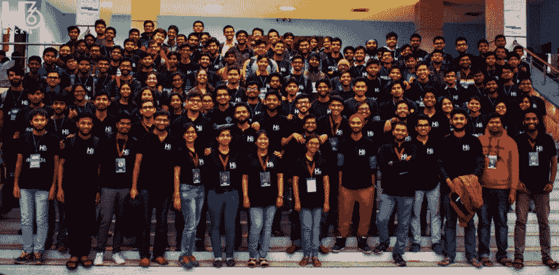
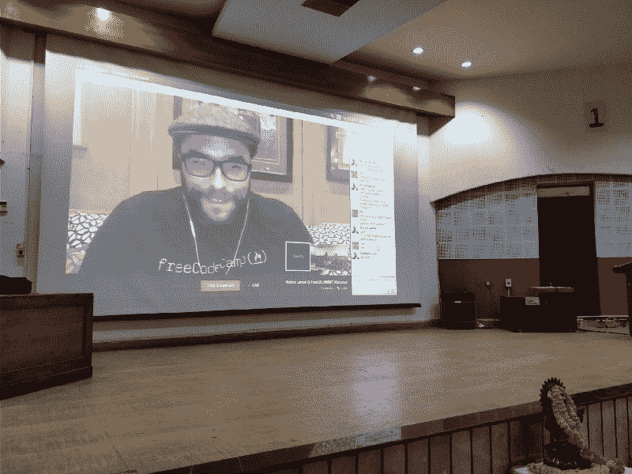
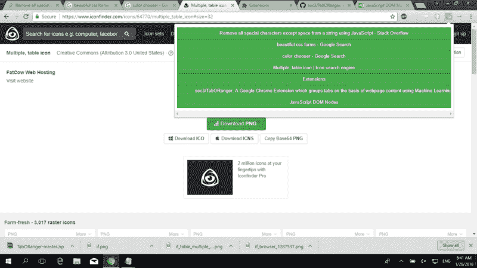
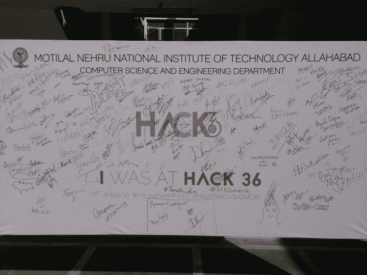

# 我们召集了 25 所大学来参加一个大型的黑客马拉松。

> 原文：<https://www.freecodecamp.org/news/top-ideas-products-from-hack36-mnnits-first-hackathon-fecc37833d6e/>

图沙尔·阿格拉瓦尔

# 我们召集了 25 所大学来参加一个大型的黑客马拉松。以下是学生们建造的顶级项目。

A formal photo-session after the prize distribution

上周末，我们举办了 Hack36，这是我们在阿拉哈巴德的莫蒂拉尔·尼赫鲁国家理工学院举办的首次黑客马拉松。这无疑是印度最大的学生领导的黑客马拉松之一。

来自印度 **21 个不同城市****的 600 多名开发者**报名参加了此次活动，争夺 **10 万印度卢比**的奖金。****

在彻底分析了他们的简历以及开源简介后，我们选择了 180 名黑客进行竞争。

我们也邀请了特邀演讲者，包括《freeCodeCamp.org》的创作者昆西·拉森。

Quincy Larson during one of the talks

作为此次活动的技术协调员，我亲自与所有 52 支队伍进行了互动。并不是所有的团队都能实现他们的想法，但是在这 36 个小时里，他们都做了值得称赞的工作。

由于我对所有开发的产品都有第一手的了解，我决定分享 Hack36 中的获胜者和我自己的最佳选择。

### 德克斯特——第一名

**队:**阿布希谢克·夏尔马、希曼舒·谢哈尔、苏维克·森、马杜尔杰亚·佩古
代号:https://github.com/himanshub16/dexter

有没有想过，你是否可以用你的自然语言和你的计算机对话，它会为你写代码，而且还是用你最喜欢的语言？嗯， **Dexter** 是一个基于人工智能的代码编辑器，它允许你通过与 JavaScript 和 Python 对话来同时用它们编码。

它支持印度最广泛使用的两种语言，印地语和英语。在我看来，它可能是所有产品中设计和界面最好的。

### 贾维斯·博特——亚军

**球队:**莫希特·哈雷，阿布黑·拉纳，普拉巴特·辛格，阿维谢克·桑特利亚
代号:https://github.com/mkfeuhrer/JarvisBot

这是一个智能机器人，可以让你像玩游戏一样进行实用和有趣的事情。Jarvis-Bot 使用 Python 和 ZulipChat-API 构建，是功能最丰富的非官方 ZulipChat Bot。它有很多功能，包括基于字典的搜索和待办事项列表。

您甚至可以使用这个 bot 通过 SSH 登录到远程系统。该机器人还具有四个有趣的游戏，如刽子手，拼字游戏等，所有这些都可以在点击一个按钮。很酷吧..？

### MedX —亚军

**战队:**拉什米塔耶拉普拉达、冈扬辛格、纳古博依娜斯拉维亚、温达阿加瓦尔
代号:https://github.com/sravya31/hacker-champs

**MedX** 是一个便于存储和访问电子病历(EMR)的平台，将彻底改变当前的医疗保健服务。它使用以太坊区块链记录病人的医疗信息。它允许用户完全控制他/她自己的医疗记录，并允许将某些方面公开或保密，同时仍以分散的方式存储。

这些文件被存放在 IPFS。此外，该应用程序还实现了特定的访问控制级别，以确保人们只能访问所需的数据，而不是患者的完整病史。

### TabORanger — Chrome 扩展

**球队:**阿比纳夫·迪克西特、瓦伊巴夫·巴德瓦伊、阿尔皮特·古普塔、苏尚特·奥贝罗伊
代号:https://github.com/soc3/TabORanger

一般来说，开发人员会在浏览器中打开很多标签页。在一定数量的标签之后，管理这些标签就变得非常困难。chrome 扩展 TabORanger 使用机器学习根据网页内容对标签进行分组。

该扩展还有一个选项，可以根据标题而不是整个页面内容对选项卡进行分类，从而使整个过程更快。

### 社交整合应用

队:yerra bala praneeth kumar、PRANAYKUMAR ANUGURTI、Poorna Chandu Gade、kantula sumanth
T3【码:[【https://github . com/pranethyra/hack 36-Android】](https://github.com/PraneethYerra/hack36-android)

这实际上是我的最爱之一，仅仅是因为它独特的想法和实现。SocioIntegrate 应用程序试图缩小脸书朋友之间的差距，让他们参与匿名聊天游戏。

这个游戏包括两个用户根据他们的兴趣随机连接(数据来自脸书图形 API)。然后，他们玩一个游戏(聊天到消息的阈值限制)来揭示他们朋友的名字。首先成功的人获得火焰点数。然后，用户可以使用他获得的火焰点数在应用程序上恶作剧朋友，而其他用户不知道他的详细信息。积分也可以在特定的网点兑换。

### 埃维斯

**球队:**阿克什特·夏尔马、迪维扬舒·卡普尔、萨蒂扬·库马尔·古普塔、阿曼·什罗夫
代号:https://github.com/khitk9738/EyeVis

这是一个基于对象检测的项目(Python/Android ),使用谷歌的张量流为盲人提供视觉，进一步实现光学字符识别，大声朗读，谷歌翻译不同的语言和场景识别，解决数百万人的日常问题。

这个想法并不独特，但应用程序被黑客利用一堆 API 和第三方服务的方式真的让它脱颖而出。该应用程序如果实施得当，并在良好的数据集上进行训练，确实可以为社区的某一部分带来变化。

### **Alexa Care Buddy**

**战队:**阿希什·贾哈，罗汉·梅蒂，索米亚·瓦尔丹，西达尔特·卡图里亚
代号:https://github.com/TheDreamSaver/hack36-alexa-healthcare

顾名思义，这是一款 Alexa 应用，旨在根据搜索到的药品找到附近的医药商店。它还建议在搜索的药物不可用的情况下使用药物的替代品。

该应用程序还有一个内置的导航功能，可以引导用户去商店。此外，该应用程序还可以指导您完成简单的急救程序，如扭伤、切纸等。它还可以教你一些常见的程序，比如紧急情况下的心肺复苏术。

### 最后的话

尽管这只是学院里的第一次此类活动，但活动取得了巨大的成功。这标志着第一次这样的开发者大会即将召开。我希望这份遗产能延续下去！！

上面的列表是我整理的，可能漏掉了一些有趣的想法。请在评论中提出这些想法。:D