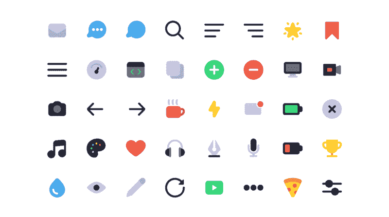
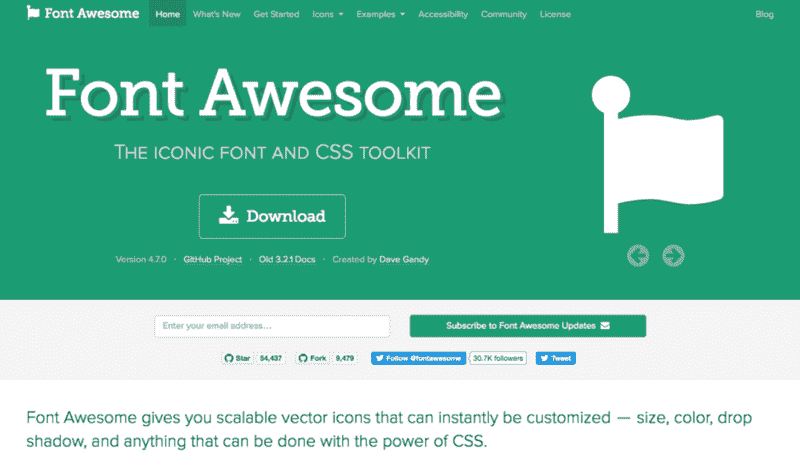
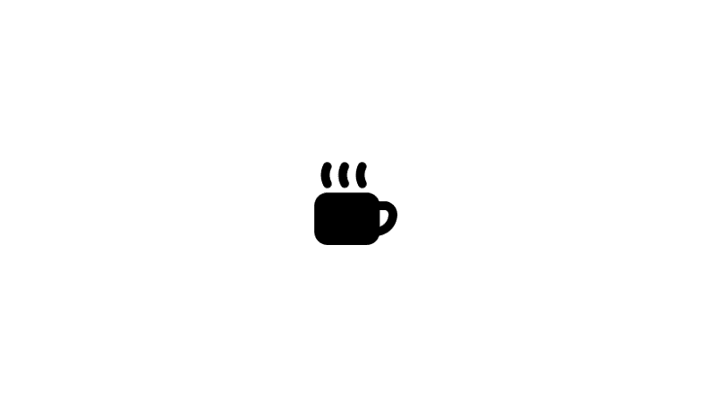
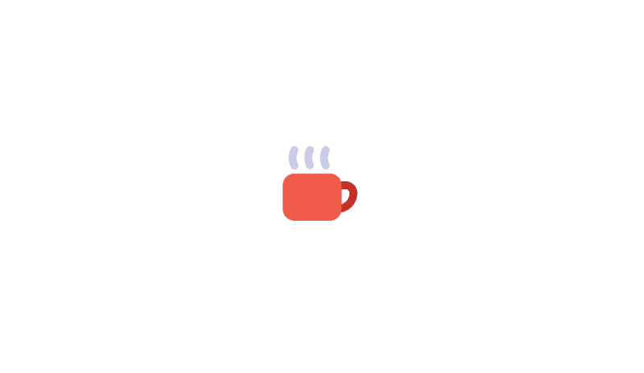

# 让我们用 SVG 符号和 CSS 变量制作多色图标

> 原文：<https://www.freecodecamp.org/news/lets-make-your-svg-symbol-icons-multi-colored-with-css-variables-cddd1769fca4/>

莎拉·达扬



[Creative Things](http://creativethings.io/) by [Kyle Adams](http://kyleadams.me/)

# 让我们用 SVG 符号和 CSS 变量制作多色图标

使用图像和 CSS 精灵为网页制作图标的日子已经一去不复返了。随着 web 字体的激增，图标字体已经成为在 web 项目中显示图标的首选解决方案。

字体是矢量，不用担心分辨率。它们受益于与文本相同的 CSS 属性。因此，您可以完全控制尺寸、颜色和样式。您可以添加变换、效果和装饰，如旋转、下划线或阴影。



*No wonder projects like Font Awesome have been downloaded [more than 15 million times on npm alone](http://npm-stats.com/~packages/font-awesome) to this day.*

尽管图标字体并不完美，这也是为什么越来越多的人喜欢使用内嵌 SVG 图像的原因。CSS Tricks 写了一个[列表，列出了图标字体与原生 SVG 元素相比的不足之处](https://css-tricks.com/icon-fonts-vs-svg):清晰度、定位，甚至是由于跨域加载、浏览器特有的错误和广告拦截器而导致的失败。现在你可以避开大部分这些问题，通常使图标字体成为一个安全的选择。

然而，有一件事对于图标字体来说是绝对不可能的:**多色支持**。只有 SVG 可以做到这一点。

***TL；*** *博士:这篇文章深入探讨了如何和为什么。如果你想理解整个思维过程，请继续阅读。否则可以在 [CodePen](https://codepen.io/sarahdayan/pen/GOzaEQ) 上看最终代码。*

### 设置 SVG 符号图标

内联 SVG 的问题在于它们有多冗长。你不希望每次需要使用同一个图标时都复制/粘贴所有这些坐标。这将是重复的，难以阅读，并且维护起来很痛苦。

对于 SVG 符号图标，每个 SVG 元素都有一个副本，可以在任何地方用引用实例化它们。

首先内嵌 SVG，隐藏它，用一个`<symb` ol >包装它，并用一个 id 属性`th`标识它。

```
<svg  style="display: none">  <symbol id="my-first-icon" viewBox="0 0 20 20">    <title>my-first-icon</title>    <path d="..." />  </symbol></svg>
```

完整的 SVG 标记只包含一次，并隐藏在 HTML 中。

然后，你所要做的就是用一个`<u` se >元素实例化图标。

```
<svg>  <use xlink:href="#my-first-icon" /></svg>
```

这将显示原始 SVG 图标的精确副本。



**就是这样！**很好看吧？

您可能注意到了有趣的`xlink:href`属性:这是您的实例和原始 SVG 之间的链接。

值得一提的是`xlink:href`是一个不推荐使用的 SVG 属性。即使大多数浏览器仍然支持，**你也应该用`href`代替**。现在的情况是，有些浏览器比如 Safari 不支持通过`href`属性进行 SVG 资源引用，所以你还是需要提供`xlink:href`。

为了安全起见，请同时提供这两个属性。

### 添加一些颜色

与字体不同，`color`对 SVG 图标没有任何影响:您必须使用`fill`属性来定义颜色。这意味着它们不会像图标字体那样继承父文本颜色，但是你仍然可以在 CSS 中设置它们的样式。

```
// HTML<svg class="icon">  <use xlink:href="#my-first-icon" /></svg>
```

```
// CSS.icon {  width: 100px;  height: 100px;  fill: red;}
```

在这里，您可以使用不同的填充颜色创建同一图标的其他实例。

```
// HTML<svg class="icon icon-red">  <use xlink:href="#my-first-icon" /></svg>
```

```
<svg class="icon icon-blue">  <use xlink:href="#my-first-icon" /></svg>
```

```
// CSS.icon {  width: 100px;  height: 100px;}.icon-red {  fill: red;}.icon-blue {  fill: blue;}
```

这是可行的，但是这并不是我们想要的。到目前为止，我们所做的一切都可以用一个常规的图标字体来实现。我们想要的是有一个图标的每个**部分**的**不同的**颜色。我们希望在不改变其他实例的情况下，用不同的颜色填充每个**路径**，并且我们希望能够在必要时覆盖它。

起初，你可能会倾向于依赖特殊性。

```
// HTML<svg  style="display: none">  <symbol id="my-first-icon" viewBox="0 0 20 20">    <title>my-first-icon</title>    <path class="path1" d="..." />    <path class="path2" d="..." />    <path class="path3" d="..." />  </symbol></svg>
```

```
<svg class="icon icon-colors">  <use xlink:href="#my-first-icon" /></svg>
```

```
// CSS.icon-colors .path1 {  fill: red;}.icon-colors .path2 {  fill: green;}.icon-colors .path3 {  fill: blue;}
```

这没用。

我们试图将`.path1`、`.path2`和`.path3`设计成嵌套在`.icon-colors`中的样式，但从技术上讲**并不是**。元素`<u` se >不是一个占位符**会被你的 SVG 定义替换。这是一个引用，该引用克隆了它所指向的内容到当前的 DOM 中？**

那我们能做什么？当孩子不在 DOM 中时，我们如何影响孩子的内容？

### 拯救 CSS 变量

在 CSS 中，[有些属性](https://developer.mozilla.org/en-US/docs/Web/CSS/inheritance)是从祖先遗传给子代的。如果你给`body`分配了一个文本颜色，页面中的所有文本都会继承这个颜色，直到它被覆盖。祖先并不知道这些孩子，但是**可继承的**风格仍然在传播。

在我们前面的例子中，我们继承了`fill`属性。再看一下，你会看到我们声明了一个`fill`颜色的类被附加在了**实例**上，而不是定义上。这就是我们能够为单个定义的每个实例获得不同颜色的方法。

现在问题来了:我们想将原始 SVG 的**不同的**颜色传递给**不同的**路径，但是我们只能继承一个`fill`属性。

遇到 **CSS 变量**。

CSS 变量在规则集中声明，就像任何其他属性一样。您可以给它们起任何您想要的名字，并给它们分配任何有效的 CSS 值。然后，你为它自己声明一个**值**，或者任何子属性，**它将被继承**。

```
.parent {  --custom-property: red;  color: var(--custom-property);}
```

*`.parent`的所有子节点都将显示红色文本。*

```
.parent {  --custom-property: red;}.child {  color: var(--custom-property);}
```

*所有嵌套在`.parent`元素中的`.child`都将显示红色文本。*

现在让我们将这个概念应用到我们的 SVG 符号中。我们将在 SVG 定义的每个路径上使用`fill`属性，并将它们设置为不同的 CSS 变量。然后，我们给它们分配不同的颜色。

```
// HTML<svg  style="display: none">  <symbol id="my-first-icon" viewBox="0 0 20 20">    <title>my-first-icon</title>    <path fill="var(--color-1)" d="..." />    <path fill="var(--color-2)" d="..." />    <path fill="var(--color-3)" d="..." />  </symbol></svg>
```

```
<svg class="icon icon-colors">  <use xlink:href="#my-first-icon" /></svg>
```

```
// CSS.icon-colors {  --color-1: #c13127;  --color-2: #ef5b49;  --color-3: #cacaea;}
```

而且… **有效**！？



从现在开始，我们需要做的就是创建一个新的类来创建一个不同配色方案的实例。

```
// HTML<svg class="icon icon-colors-alt">  <use xlink:href="#my-first-icon" /></svg>
```

```
// CSS.icon-colors-alt {  --color-1: brown;  --color-2: yellow;  --color-3: pink;}
```

如果你仍然想要单色图标，**你不必在每个 CSS 变量**上重复相同的颜色。相反，你可以声明一个单独的`fill`规则:因为 CSS 变量没有被定义，它将依赖于你的`fill`声明。

```
.icon-monochrome {  fill: grey;}
```

*您的`fill`声明将起作用，因为原始 SVG 上的`fill`属性是用未定义的 CSS 变量值设置的。*

### 用什么来命名我的 CSS 变量？

在 CSS 中命名事物时，通常有两条路线可供选择:**描述性**或**语义性**。描述性的意思是称一种颜色为**它是什么**:如果你正在存储`#ff0000`，你会称它为`--red`。语义的意思是通过颜色的应用方式来调用颜色:如果你用`#ff0000`作为咖啡杯的手柄，你会称它为`--cup-handle-color`。

描述性的名字可能是你的第一直觉。感觉更干燥，因为`#ff0000`除了咖啡杯的把手还可以用来做其他事情。一个`--red` CSS 变量可被其他需要红色的图标路径重用。毕竟，这就是效用至上的 CSS 的工作方式，而且[这是一个很好的系统](https://frontstuff.io/in-defense-of-utility-first-css)。

问题是，在我们的例子**中，我们不能将粒度类应用到我们想要样式化的元素**。实用至上的原则并不适用，因为我们对每个图标都有一个单独的引用，而且我们必须通过类的变化来设计它的样式。

使用语义类名，例如`--cup-handle-color`，对于这个用例更有意义。当你想改变一个图标的一部分的颜色时，你马上就知道它是什么，要覆盖什么。无论您指定什么颜色，类名都将保持相关。

### 违约还是不违约

将多种颜色的图标作为默认状态是很诱人的。这样，您就可以在不需要额外样式的情况下使用它们，并且只在必要时才添加自己的类。

有两种方法可以实现: **:root** 和 **var() default** 。

### :根

您可以在`:root`选择器上定义所有的 CSS 变量。这使它们都在一个地方，并允许您“共享”相似的颜色。`:root`具有最低的优先级，因此很容易被覆盖。

```
:root {  --color-1: red;  --color-2: green;  --color-3: blue;  --color-4: var(--color-1);}
```

```
.icon-colors-alt {  --color-1: brown;  --color-2: yellow;  --color-3: pink;  --color-4: orange;}
```

然而，**这种方法**有很大的缺点。首先，将颜色定义与它们各自的图标分开可能会令人困惑。当您决定覆盖它们时，您必须在类和`:root`选择器之间来回切换。但更重要的是，**它不允许你限定 CSS 变量的范围**，从而防止你重用相同的名字。

大多数时候，当一个图标只使用一种颜色时，我会使用`--fill-color`名称。这很简单，容易理解，并且对所有只需要一种填充颜色的图标使用相同的名称是有意义的。如果我必须在`:root`声明中声明所有变量，我不能有几个`--fill-color`。我将被迫定义`--fill-color-1`、`--fill-color-2`，或者使用类似`--star-fill-color`、`--cup-fill-color`的名称空间。

### var()默认值

用于将 CSS 变量分配给属性的`var()`函数可以将默认值作为第二个参数。

```
<svg  style="display: none">  <symbol id="my-first-icon" viewBox="0 0 20 20">    <title>my-first-icon</title>    <path fill="var(--color-1, red)" d="..." />    <path fill="var(--color-2, blue)" d="..." />    <path fill="var(--color-3, green)" d="..." />  </symbol></svg>
```

在您定义`--color-1`、`--color-2`和`--color-3`之前，图标将使用您为每个`<pa`到>设置的默认值。这解决了当`using` :root，但要小心:你现在有一个默认值，它正在做我的工作。因此，你不能再使用 s `ingl` e fill 声明来定义单色图标了。你必须一个接一个地给图标上使用的每个 CSS 变量分配颜色。

设置默认值可能有用，但这是一种权衡。我建议你不要把它变成一种习惯，只在对给定的项目有意义的时候去做。

### 这一切对浏览器友好吗？

CSS 变量与大多数现代浏览器兼容，但是正如你所料，Internet Explorer 根本不支持 T2。即使是 IE11 也不行，而且由于开发被 Edge 取代，它也不可能达到速度。

现在，仅仅因为你需要迎合的浏览器不支持某个功能，并不意味着你必须完全排除它。在这种情况下，选择**优雅的降级**:为现代浏览器提供多种颜色的图标，为旧浏览器提供一种后备填充颜色。

你要做的是设置一个声明，它只在 CSS 变量不被支持时才起作用。这可以通过将`fill`属性设置为回退颜色来实现:如果支持 CSS 变量，甚至不会考虑它。如果不是，您的`fill`声明将适用。

如果您使用 Sass，这可以抽象成一个`@mixin`。

```
@mixin icon-colors($fallback: black) {  fill: $fallback;  @content;}
```

我们现在可以定义配色方案，而不用担心浏览器的兼容性。

```
.cup {  @include icon-colors() {    --cup-color: red;    --smoke-color: grey;  };}
```

```
.cup-alt {  @include icon-colors(green) {    --cup-color: green;    --smoke-color: grey;  };}
```

*通过`@content`传递 mixin 中的 CSS 变量是可选的。如果在外面做，编译出来的 CSS 也是一样的。但是将它们打包在一个地方会很有帮助:您可以在编辑器中折叠代码片段，并直观地识别放在一起的声明。*

在不同的浏览器上检查这支笔。在最新版本的 Firefox、Chrome 和 Safari 上，最后两个杯子将分别是红色和灰色烟雾，蓝色和灰色烟雾。在 15 版本之前的 Internet Explorer 和 Edge 上，第三个杯子将全部为红色，第四个杯子将全部为蓝色！✨

如果你想了解更多关于 SVG 符号图标(以及一般的 SVG)的知识，我强烈建议你阅读萨拉·苏伊丹的《T2 一切》。如果你对 CSS 符号图标有任何问题，不要犹豫，在[推特](https://twitter.com/frontstuff_io)上联系我！

*最初发表于 [frontstuff.io](https://frontstuff.io/multi-colored-svg-symbol-icons-with-css-variables) 。*