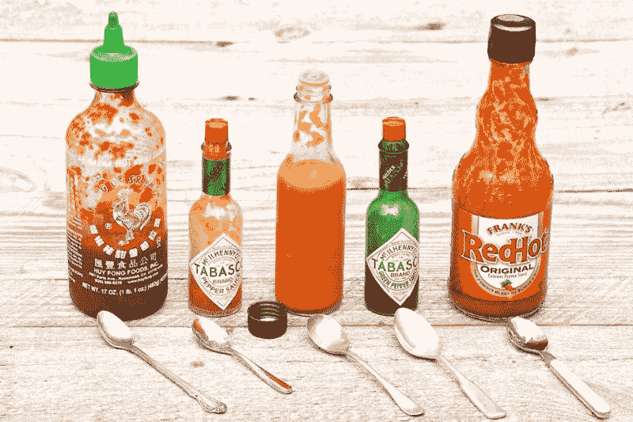
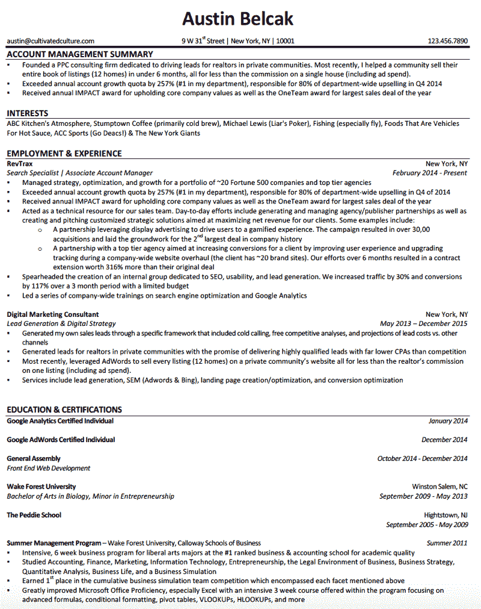
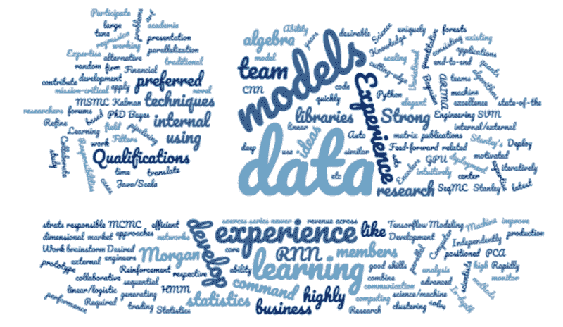

# 如何写一份真正优秀的简历，让你被录用

> 原文：<https://www.freecodecamp.org/news/how-to-write-a-really-great-resume-that-actually-gets-you-hired-e18533cd8d17/>

这是一个数据驱动的写简历指南**，它实际上让你被雇佣**。在过去的四年里，我一直在分析哪些简历建议不管经验、角色或行业都有效。下面列出的策略是我所学到的结果。他们帮助我在谷歌、微软和推特上找到工作，并帮助我的学生系统地在亚马逊、苹果、谷歌、微软、脸书等公司找到工作。

### 写简历很烂。

这是一个恶性循环。

我们首先从职业“大师”的几十篇文章中筛选，被迫比较相互矛盾的建议，并自己决定遵循什么。

第一篇文章说“最多一页”，而第二篇文章说“用两到三页，包括你所有的经历。”

下一条说“写一个简短的总结，突出你的个性和经历”，而另一条说“总结是浪费空间。”

在花了几个小时考虑你的简历应该是什么样子之后，你尽最大努力点击“提交”，把你的简历发送出去。如果没有回音，您会想哪里出了问题:

“是因为只有一页纸还是缺少摘要？老实说，谁会在这种时候在乎呢。我厌倦了每天发出 10 份简历，听到的只有蟋蟀的叫声。”

How it feels to try and get your resume read in today’s world.

写简历很糟糕，但这不是你的错。

写一份简历如此困难的真正原因是，大部分的建议都没有被证明是针对找工作的最终目标的。如果你不知道什么是持续有效的，你就不能设计一个系统来实现它。

当你多次看到“一页效果最好”时，很容易说出来。但是，当我们看 100 份不同行业、不同经验水平和不同职位的简历时，这种观点是如何成立的呢？

这就是本文旨在回答的问题。

在过去的四年里，我个人申请了数百家公司，并在求职过程中指导了数百人。这给了我一个巨大的机会来衡量、分析和测试不同简历策略的有效性。

这篇文章将详细介绍我在过去 4 年里学到的关于简历的所有知识，包括:

*   95%以上的人都会犯的错误，会导致他们的简历立即被丢弃
*   高效求职者(他们会在世界上最好的公司找到工作)的简历中不断出现的三样东西
*   这是一个快速的技巧，可以帮助你从竞争中脱颖而出，并立即与阅读你简历的人建立关系(增加你得到回复和被聘用的机会)
*   正是这份简历模板让我获得了谷歌、微软、推特、优步等公司的面试和录用

当你完成这篇文章后，你可以使用[我的免费简历生成器](https://cultivatedculture.com/resume-templates/)将你学到的一切应用到一份漂亮的、ATS 友好的简历中，这份简历实际上会收到效果。

在我们开始有助于让你脱颖而出的非常规策略之前，我们需要确保我们的基本基础已经覆盖。这要从了解大多数求职者会犯的错误开始，这样我们才能让我们的简历刀枪不入。

### 95%的人都会犯的错误

大多数通过在线门户网站或招聘人员办公桌收到的简历都会被扔掉，因为它们违反了一个简单的规则。

当招聘人员浏览简历时，他们首先寻找的是错误。你的简历可能很棒，但是如果你违反了规则，比如使用不专业的电子邮件地址或不恰当的语法，它将会被扔掉。

我们的目标是充分理解导致招聘人员/ATS 系统做出去留决定的触发因素。

为了了解这些决策者的想法，我从各行各业的招聘人员和招聘经理那里收集了数据。这些人拥有数百年的招聘经验，他们已经审查了各行业的 10 万多份简历。

他们分析了导致他们从简历堆中剔除简历的五个最常见的错误:

### 五个最常见的简历错误(根据招聘人员和招聘经理)

问题#1: 马虎(错别字、拼写错误、&语法错误)。将近 60%的简历都有一些打字错误或语法问题。

解决方案:让三个不同的来源审查你的简历——拼写检查软件、朋友和专业人士。如果你使用微软 Word 或谷歌文档来创建你的简历，拼写检查应该包括在内。

一个朋友或家庭成员可以提供第二个基础，但是要确保你信任他们来回顾整个事情。你总是可以包括一个明显的错误，看看他们是否发现它。

最后，你可以在 [Upwork](http://www.upwork.com/) 上聘请专业编辑。他们花在复习上的时间不应该超过 15-20 分钟，所以值得为那些评分高、工作时间长的人多付一点钱。

**问题#2:** 总结太长太正式。许多简历都包含了由段落组成的摘要，解释了为什么他们是一个“有动力的、以结果为导向的团队成员”当招聘经理看到简历顶部的一段文字时，你可以打赌他们不会读完整份。如果他们真的试了一下，读到了类似上面这句话的东西，他们会当场放弃。

解决方案:总结是非常有效的，但是它们应该是子弹式的，并且展示你与这个职位最相关的经历。例如，如果我申请一个新的业务销售角色，我的第一个项目符号可能是“负责在 2018 年推动 1100 万美元的新业务，实现 168%的业绩(在我的团队中排名第一)。”

第三个问题:太多流行语。还记得上一段中我们的团队精神吗？这样的措辞会让招聘经理畏缩不前，因为你想脱颖而出的努力实际上会让你听起来和其他人一样。

**解决方案:**不要用流行语，要自然地写，要用项目符号，尽可能包括量化结果。你愿意雇佣一个“负责推动医疗保健垂直行业的新业务以帮助公司实现目标”的销售人员，还是“上个季度推动了 1500 万美元的新业务，包括公司历史上最大的一笔交易”的销售人员？跳过行话，专注于结果。

拥有一份超过一页的简历。雇主平均花 6 秒钟看你的简历——如果简历超过一页，可能就不会被阅读。当被问到时，谷歌和巴克莱的招聘人员都说多页简历“是他们生存的祸根。”

**解决方案:**增加你的页边空白，减少你的字体，减少你的经历，突出与角色最相关的部分。这似乎不可能，但值得努力。当你与每天看到数百份简历的招聘人员打交道时，你希望让他们的生活尽可能轻松。

### 更多常见错误和事实(由行业研究支持)

除了个人反馈，我还梳理了几十份招聘调查结果，以填补我的联系人可能遗漏的任何空白。这里有一些你在写简历时可能需要考虑的事项:

*   面试官平均花 6 秒钟浏览你的简历
*   大多数面试官直到你走进房间才看你的简历
*   76%的简历会因为不专业的电子邮件地址而被丢弃
*   带照片的简历有 88%的拒绝率
*   58%的简历有错别字
*   由于缺少关键词和短语，申请人跟踪软件通常会删除 75%的简历

既然你已经知道了你需要避免的每一个错误，那么你的任务清单上的第一项就是梳理你现在的简历，确保它没有违反上面提到的任何事情。

一旦你有了一份干净的简历，你就可以开始关注更先进的策略，这些策略将真正让你脱颖而出。有几个独特的元素，你可以用它们来推动你的申请，最终让你梦想中的公司注意到你。

### 简历中让你被录用的三个要素

我的分析表明，高效的简历通常包括三个具体要素:量化结果、简单的设计和古怪的兴趣部分。本节将对这三个要素进行分解，并向您展示如何最大化它们的影响。

### 定量结果

大部分简历都缺少。

这是一个遗憾，因为我的数据显示，它们对通过面试的简历和最终被扔进垃圾桶的简历有着最大的影响。

下面是我最近收到的一份电子邮件简历中的一个例子:

> **经历**

> +确定政策和流程中的差距，并提出部门和机构层面的解决方案建议

> +简化流程以提高效率和质量

> +直接管理三名经理，间接管理多个项目中多达 15 名员工

> +监督内部广告策略的执行

> +实施全面的社交媒体计划

作为一个雇主，这完全没有告诉我如果我雇佣了这个人会有什么样的结果。

他们执行了内部营销策略。成功了吗？他们是如何测量的？投资回报率是多少？

他们还确定了流程中的差距并推荐了解决方案。结果如何？他们是否节省了时间和运营费用？它是否简化了流程，从而提高了产量？

最后，他们管理着一个由 3 名主管和 15 名员工组成的团队。那个队表现如何？它比公司的其他团队更好吗？在这个人的管理下，他们得到了什么结果？这些结果是如何改进的？

明白我的意思了吗？

这几类子弹说的是日常活动，但公司不会管你每天做什么。他们关心结果。通过在你的简历中加入可衡量的标准和成就，你展示了雇主雇佣你的价值。

让我们来看看这些项目符号的修订版:

> **经历**

> +管理一个由 20 人组成的团队，该团队在潜在客户开发、交易规模和总体满意度方面一直优于其他部门(基于我们的文化调查)

> +执行内部营销策略，使每月销售线索增加 15%,每次销售线索的成本下降 5%

> +在 Instagram 和 Pintrest 上实施有针对性的社交媒体活动，在 3 个月内增加了 50，000 次月度网站访问，并产生了 750 条合格线索

如果你是招聘经理，你会选择哪份简历？

这就是包含量化结果的力量。

### 吸引读者的简单、美观的设计

如今，我们很容易被“脱颖而出”的使命冲昏头脑我见过平面设计师的简历大修，视频简历，甚至藏在一盒甜甜圈里的简历[。](https://www.thrillist.com/news/nation/this-guy-hides-his-resume-in-boxes-of-donuts-to-score-job-interviews)

虽然这些方法在非常特殊的情况下可以奏效，但我们希望制定一个能持续取得成效的策略。我看到的最成功的格式是一个黑白的 Word 模板，各部分按以下顺序排列:

*   摘要
*   兴趣
*   经验
*   教育
*   志愿者工作(如果你有的话)

这个模板是有效的，因为它是读者熟悉的，容易理解。

正如我前面提到的，招聘经理扫描简历平均需要 6 秒钟。如果你的简历格式不熟悉，那 6 秒钟对招聘经理来说不会很舒服。我们的大脑更喜欢我们容易识别的东西。你要确保招聘经理在快速浏览你的简历时能一眼看出你是谁。

如果我们不依赖设计，这个挂钩需要来自你简历顶部的*总结*部分。

这一部分应该用项目符号(而不是段落形式)来完成，并且应该包含 3-4 个与你的角色最相关的经验的要点。例如，如果我申请一个新的业务销售职位，我的总结可能是这样的:

> **总结**

> 新业务的季度平均销售额为 1100 万美元，配额完成率为 128%(在我的团队中排名第一)

> 获得年度最大销售交易奖

> 开发和培训销售团队的新销售线索挖掘流程，在 3 个月内将总销售线索增加了 17%,促成了 4 笔价值 700 万美元的新交易

这些要点直接说明了如果我被录用，我能为公司增加的价值。

### 古怪、独特且相关的“兴趣”部分

这是一个小小的“窍门”，你可以用它来立即与阅读你简历的人建立个人关系和积极的联系。

大多数简历都有技能/兴趣部分，但它通常被放在底部，几乎没有价值。是时候改变现状了。

研究表明，人们依靠情绪而不是信息来做决定。大品牌一直在使用这个原则——对广告的情感反应比广告内容更能影响一个人的购买意图。

你可能还记得苹果著名的“买一台苹果电脑”活动:

当谈到规格和性能时，MAC 电脑并没有让每一台个人电脑都相形见绌。但是这些广告固化了谁是“酷”的，谁不是，这对几百万人来说值几个额外的钱。

通过抓住我们感觉“酷”的需求，苹果的活动导致市场份额增加了 42 %, macbook 创下了销售记录。

现在我们将采取同样的策略，并将其应用到你的简历中。

如果你能引起招聘人员的情绪反应，你就能影响他们给你的心理联想。这给了你一个主要的竞争优势。

让我们从一个问题开始——你能连续几个小时谈论什么？

它可能是加密货币、烹饪、第二次世界大战、魔兽世界，或者谷歌在字母表下划分公司的赌注将如何影响未来 5 年的技术领域。

一个(或两个)话题是否突然出现在一年中？太好了。

现在想象一下，如果和一个和你一样充满热情、对这个话题了解得一样多的人交谈会是什么样。会很棒的，对吧？*终于，*有人懂了！

这正是我们希望从招聘经理那里得到的情感回应。

人们喜欢谈论五个“中性”话题:

1.  食物/饮料
2.  运动
3.  大学
4.  业余爱好
5.  地理(旅行，人们来自哪里等。)

这些主题出现在很多有趣的部分，但我们想更进一步。

假设你在泰国的满月派对上度过了人生中最美好的一夜。以下两个选项中，你更愿意读哪一个:

*   旅行
*   高发岩海滩(举行满月派对的地方)

或者说，你去了杜克(一个 ACC 学校)，还跟着他们的篮球队。你对哪个更感兴趣:

*   大学体育
*   ACC 篮球(加油蓝魔！)

在这两种情况下，第二个答案可能会引起更大的情绪反应，因为它与你的经历直接相关。

我希望你考虑一下你的兴趣，这些兴趣符合我上面提到的五个类别。

现在，我希望你在原始列表旁边的括号中写下与每个类别相关联的特定收藏夹。例如，如果你写的是旅行，你可以加上(问我在印度被大象追赶的时间)或者(特别是在西藏寺庙里冥想)。

以下是我在谷歌、微软和 Twitter 面试时在简历中使用的一组确切的兴趣爱好:

ABC 厨房的氛围、Stumptown 咖啡(主要是冷泡茶)、迈克尔·刘易斯(骗子的扑克)、钓鱼(尤其是苍蝇)、辣酱的载体食物、ACC 运动(Go Deacs！)&纽约巨人队

如果你想在这里作弊，我的经验表明，关于辣酱的任何事情都是即时的话题引子。

### 成熟的即插即用简历模板

既然我们已经有了策略，是时候把这些策略应用到一份真正的简历中了。我们的目标是写一些东西，增加你从公司得到回复的机会，增强你与招聘经理的关系，并最终帮助你获得工作机会。

下面的例子就是我在微软、谷歌和推特上获得面试和录用的简历。我的目标是客户管理和销售，所以这个示例是针对这些职位量身定制的。我们将在下面分解每个部分:

首先，我要你注意这里有多干净。每一部分都有清晰的标签和分隔，从上到下都很流畅。

我的总结直接说明了我过去围绕公司文化及其底线所创造的价值:

*   我总是超出预期
*   我在这个领域开创了自己的事业(并看到了真正的成果)
*   我是一个重视文化的团队成员

我特意在我的总结下面加入了我的兴趣部分。如果我的招聘经理的六秒钟扫描集中在摘要上，我知道他们会感兴趣。这些要点涵盖了销售资格的所有潜意识标准。他们会很好奇在我的经历部分读到更多。

通过将我的兴趣夹在中间，我提高了他们的知名度，增加了建立个人联系的机会。

你永远不知道——看我简历的人可能也是辣酱鉴赏家，我不希望这一点被忽视，因为我的兴趣被放在了最后。

接下来，我的经历部分旨在充实我的总结中的观点。我在上面提到了超额完成任务，所以我列出了实现这一目标的两个具体计划，包括可衡量的结果:

*   利用展示广告推动用户体验游戏化的合作伙伴关系。该活动促成了 3000 多项收购，并为公司历史上第二大交易奠定了基础。
*   与顶级代理商的合作旨在通过改善用户体验和在全公司网站大修期间升级跟踪来增加客户的转化率(该客户有大约 20 个品牌网站)。经过我们 6 个月的努力，合同延期金额比最初的交易高出 316%。

最后，我从最相关的课程开始，把我的学历写在最下面。

**免费下载我的简历模板**

您可以在此下载上述简历样本以及即插即用模板:

**奥斯丁简历:** [点击下载](https://drive.google.com/file/d/182gN6Kt1kBCo1LgMjtsGHOQW2lzATpZr/view?usp=sharing)

**插&打简历模板:** [点击下载](https://drive.google.com/open?id=0B3WIcEDrxeYYdXFPVlcyQlJIbWc)

### 额外提示:一个非常规的简历“黑客”帮你打败求职者跟踪软件

如果你还不熟悉，申请人跟踪系统是公司用来帮助“自动化”招聘过程的软件。

在你点击在线申请上的提交后，ATS 软件会扫描你的简历，寻找特定的关键词和短语(如果你想了解更多细节，本文很好地解释了 ATS)。

如果你简历中的语言匹配，该软件会认为它非常适合这个职位，并将它传递给招聘人员。然而，即使你非常适合这个角色，但你没有使用正确的措辞，你的简历可能会被扔进黑洞。

我要教你一个小窍门，帮助你提高打败系统的几率，让你的简历落到一个人的手里:

**步骤 1:** 突出显示并选择整个职位描述页面，并将其复制到您的剪贴板。

第二步:前往 WordClouds.com 的，点击顶部的“单词列表”按钮。在弹出框的顶部，您应该会看到一个粘贴/键入文本的链接。继续点击它。

第三步:现在将整个职位描述粘贴到框中，然后点击“应用”

WordClouds 会给出一张图片，展示职位描述中的每一个单词。较大的单词是出现频率最高的单词(也是你在写简历时要确保包含的单词)。以下是一个数据科学角色的示例:

你也可以在创建你的云之后再次点击“单词列表”来获得一个量化的视图。这将显示每个单词在工作描述中出现的次数:

9 数据

6 款

4 体验

4 学习

3 体验

3 开发

三队

2 资格

2 统计数据

2 项技术

2 个图书馆

2 首选

2 研究

2 商业

在写简历的时候，你的目标是把这些词和职位描述的比例放在一起。

这不是打败在线申请过程的一个保证的方法，但是它肯定会帮助你提高获得成功的机会！

### 想要一份没有关系，没有“经验”，没有网上申请的梦想工作的内部信息吗？

点击此处获取我的学生在谷歌、微软、亚马逊等公司求职时使用的 5 个免费策略，无需在线申请。

*最初发表于[cultivatedculture.com](https://cultivatedculture.com/write-a-resume/)。*