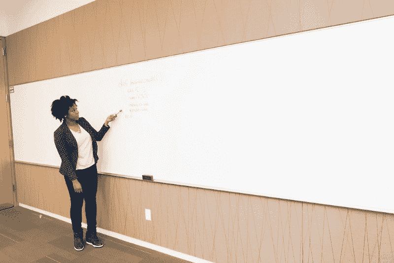

# 我从编程面试中学到了什么

> 原文：<https://www.freecodecamp.org/news/what-i-learned-from-programming-interviews-29ba49c9b851/>

埃达娜·萨利纳斯

# 我从编程面试中学到了什么

Whiteboard programming interviews

2017 年，我去参加了计算机行业女性的[格蕾丝·赫柏庆典](https://anitab.org/event/2017-grace-hopper-celebration-women-computing/)。这是此类聚会中最大的一次，去年有 17，000 名女性参加。

这个会议有一个巨大的职业博览会，公司面试与会者。有些人甚至得到了邀请。在这一带走了一圈，我注意到一些人看起来很紧张和担忧。无意中听到的对话，有的谈到自己面试怎么没考好。

我走近一群我无意中听到的人，给他们一些建议。我认为我给出的一些建议是基本的，比如“首先想到天真的解决方案是可以的。”但是人们对我给他们的大多数建议感到惊讶。

我想用这个帮助更多的人。我收集了一份对我有效的建议清单，并发布了一个关于它们的播客片段。这也是这篇文章的主题。

我参加过很多实习和全职工作的编程面试。当我在大学学习计算机科学时，每年秋季学期都有一场招聘会，第一轮面试就在那里进行。我在第一轮和最后一轮面试中都失败了。每次面试后，我都会反思我本可以做得更好的地方，并和给我反馈的朋友一起模拟面试。

无论我们是通过求职网站、人际网络还是大学招聘来找工作，这个过程的一部分都涉及到技术面试。

近年来，我们看到了不同的面试形式出现:

*   与工程师结对编程
*   在线测验和在线编码
*   白板访谈

我将把重点放在**白板面试**上，因为这是我经历过的一次。我面试过很多次。有些进展顺利，有些则不顺利。

### 我做错了什么

首先，我想回顾一下我在面试中做错的事情。这有助于发现问题并改进。

当面试官给我一个技术问题时，我立即走向白板，开始尝试解决它。*一言不发。*

我在这里犯了两个错误:

#### **没有澄清对解决问题至关重要的信息**

例如，我们是只处理数字还是也处理字符串？我们支持多种数据类型吗？如果你在开始着手一个问题之前不提问，你的面试官会觉得你在他们公司开始一个项目之前不会提问。这是在工作场所必须具备的一项重要技能。它不再像学校了。你不会得到一个包含所有详细步骤的任务。你必须找出它们是什么，并定义它们。

#### **思考而不写作或交流**

很多时候，我站在那里思考，却没有动笔。我在和一个朋友做模拟面试的时候，他告诉我他知道我在想什么，因为我们一起工作过。对一个陌生人来说，**可能看起来我很无知**，或者我在思考。**同样重要的是，不要急于马上找到解决方案。花些时间集思广益。有时候面试官会很乐意参与其中。毕竟，工作会议就是这样。**

### 想出一个解决方案

在您开始编写代码之前，如果您首先想到算法，会有所帮助。不要开始写代码，并希望在你写的时候就能解决问题。

这是对我有效的方法:

1.  脑猝病
2.  编码
3.  错误处理
4.  测试

#### 1.脑猝病

对我来说，首先通过一系列的例子来想象问题是什么会有所帮助。如果是与树相关的问题，我会从空的情况开始，一个节点，两个节点，三个节点。这可以帮助你归纳出一个解决方案。

在白板上，**写下算法需要做的事情的列表**。通过这种方式，你可以在编写任何代码之前发现错误和问题。记下时间就行了。我曾经犯过一个错误，我花了太多的时间问澄清问题和头脑风暴，而我几乎没有时间写代码。这样做的坏处是你的面试官看不到你是如何编码的。你也可以表现得好像在试图避开编码部分。戴上手表会有帮助，或者如果房间里有钟，偶尔看一下。有时候面试官会告诉你，“我想我们已经有了必要的信息，让我们开始编码吧。”

#### 2.编码和代码演练

如果你没有现成的解决方案，指出明显幼稚的解决方案总是有帮助的。当你解释这个的时候，你应该考虑如何改进它。当你陈述显而易见的事实时，指出为什么它不是最好的解决方案。为此，熟悉大 O 符号会有所帮助。可以先检查 2-3 个解决方案。面试官有时会引导你说:“我们能做得更好吗？”这有时意味着他们在寻找更有效的解决方案。

#### 3.错误处理

当你编码的时候，指出你正在为错误处理留下代码注释。有一次一个面试官说:“这个观点很好。你会怎么处理？你会抛出一个异常吗？还是返回一个特定的值？”这可以成为关于代码质量的一个很好的简短讨论。举几个错误案例。其他时候，面试官可能会说你可以假设你得到的参数已经通过了验证。然而，提出这一点仍然很重要，以表明您意识到了错误案例和质量。

#### 4.测试

在你完成解决方案的编码后，**重复使用头脑风暴中的例子来遍历你的代码，确保它能正常工作**。例如，你可以说，“让我们来看一个有一个节点，两个节点的树的例子。”

完成这些之后，面试官有时会问你如何测试你的代码，你的测试用例是什么。我建议你在不同的类别中组织你的测试用例。

一些例子是:

1.  表演
2.  错误案例
3.  阳性预期病例

对于性能，请考虑极限数量。例如，如果问题是关于列表的，说明你有一个很大的列表和一个很小的列表。如果是关于数字，你将测试最大整数和最小整数。我推荐阅读关于测试软件的文章以获得更多的想法。在这方面，我最喜欢的书是[我们如何在微软](https://www.amazon.com/How-We-Test-Software-Microsoft/dp/0735624259)测试软件。

对于错误案例，考虑什么可能会失败，并列出它们。

对于积极的预期情况，考虑用户需求是什么是有帮助的。该解决方案旨在解决哪些案例？这些是积极的测试案例。

### “你有什么问题要问我吗？”

几乎总是会有几分钟的时间专门给**你**提问。我建议你**写下在面试前你会问面试官的问题**。不要说:“我没有任何问题。”即使你觉得面试不顺利，或者你对这家公司不是很有热情，你也总有事情可以问。可以是关于这个人最喜欢和最讨厌他或她的工作的什么。也可能是与这个人的工作有关的事情，或者是公司使用的技术和实践。即使你觉得自己做得不好，也不要气馁。

### 申请工作

至于找工作和申请工作，有人告诉我，你应该只申请一个你真正有热情为之工作的地方。他们说，选择一家你喜欢的公司，或者你喜欢使用的产品，看看你是否能在那里工作。

我不建议你总是这样。通过这种方式，你可以排除很多好的选择，尤其是如果你正在寻找一份实习或入门级的工作。

你可以专注于其他目标。我想在哪些方面获得更多的经验？是云计算，web 开发，还是人工智能？当你在招聘会上与公司交谈时，了解他们的职位空缺是否在这一领域。你可能会在一家公司或者一家不在你名单上的非营利机构找到一份非常好的工作。

#### 交换团队

在我的第一个团队工作了一年半之后，我决定是时候探索一些不同的东西了。找了一个喜欢的团队，面试了 4 轮。我做得不好。

我没有练习任何东西，甚至没有简单地在白板上写字。我的逻辑是，如果我已经在这家公司工作了将近两年，为什么我还需要练习？我错了。我努力在白板上写下解决方案。像我写的字太小，没有从左上角开始而耗尽了空间，这些都导致了不及格。

我没有复习数据结构和算法。如果我有，我会更有信心。即使你已经在一家公司担任软件工程师，在你与另一个团队进行一轮面试之前，我强烈建议你在白板上完成练习题。

至于寻找一个团队，如果你想在你的公司换一个团队，与那个团队的成员进行非正式的交谈会有所帮助。对于这一点，我发现几乎所有人都愿意和你共进午餐。人们也大多在中午有空，因此缺少空和会议冲突的风险较低。这是一种非正式的方式来了解团队正在做什么，并了解潜在团队成员的个性。你可以从午餐会议中学到很多东西，这对你的正式面试有所帮助。

重要的是要知道，在一天结束时，你面试的是一个特定的团队。即使你做得很好，你也可能因为文化不适应而得不到工作。这也是为什么我会试着先认识团队中不同的人，但这并不总是可能的。不要因为被拒绝而气馁，保持你的选择，并且练习。

此内容来自[科技女性秀](https://thewomenintechshow.com)[“编程采访”](https://thewomenintechshow.com/2017/12/18/programming-interviews/)集:对科技领域杰出女性的技术采访。