# 在非线性数据中寻找相关性

> 原文：<https://www.freecodecamp.org/news/how-machines-make-predictions-finding-correlations-in-complex-data-dfd9f0d87889/>

从信号的角度来看，世界是一个嘈杂的地方。为了理解任何事情，我们必须有选择性地集中注意力。

经过数百万年的自然选择，我们人类已经变得相当善于过滤背景信号。我们学会了将特定的信号与特定的事件联系起来。

例如，想象你正在一个繁忙的办公室里打乒乓球。

为了回击对手的射门，你需要进行大量复杂的计算和判断，考虑多种相互竞争的感官信号。

为了预测球的运动，你的大脑必须重复采样球的当前位置，并估计它未来的轨迹。更高级的选手也会考虑对手击球时的任何旋转。

最后，为了打出自己的球，你需要考虑对手的位置、你自己的位置、球的速度以及你打算使用的任何旋转。

所有这些都涉及到惊人数量的潜意识微分。我们理所当然地认为，一般来说，我们的神经系统可以自动做到这一点(至少经过一点练习)。

同样令人印象深刻的是，人类大脑是如何对它接收到的无数竞争信号中的每一个赋予不同的重要性的。例如，球的位置被认为比发生在你身后的谈话或你面前的开门声更相关。

这听起来很明显，似乎不值得陈述，但这证明了我们在学习如何从嘈杂的数据中做出准确的预测。

当然，给定连续视听数据流的空白状态机将面临一项困难的任务，即知道哪些信号最能预测最佳的行动过程。

幸运的是，有统计和计算方法可以用来识别嘈杂、复杂数据中的模式。

### 相关性 101

一般来说，当我们谈论两个变量之间的“相关性”时，我们指的是它们在某种意义上的“相关性”。

相关变量是那些包含彼此信息的变量。相关性越强，一个变量告诉我们的另一个变量就越多。

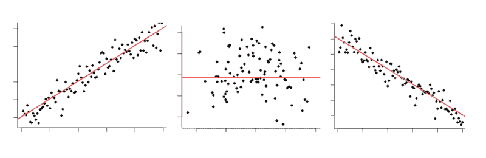

You may have seen it all before: Positive correlation, zero correlation, negative correlation

你可能已经对相关性有了一些了解，它是如何工作的，它的局限性是什么。事实上，这是数据科学的老生常谈:

> “相关性并不意味着因果关系”

这当然是真的——有充分的理由说明为什么即使两个变量之间有很强的相关性也不能保证因果关系。观察到的相关性可能是由于隐藏的第三个变量的影响，或者完全是偶然的。

也就是说，相关性*确实允许*根据一个变量预测另一个变量。有几种方法可以用来估计线性和非线性数据的相关性。让我们来看看它们是如何工作的。

我们将使用 Python 和 r 完成数学和代码实现。本文示例的代码可以在[这里](https://gist.github.com/anonymous/fabecccf33f9c3feb568384f626a2c07)找到。

### 皮尔逊相关系数

#### 这是什么？

皮尔逊相关系数(PCC，或皮尔逊的 *r* )是一种广泛使用的线性相关度量。这通常是许多初级统计课程的第一课。从数学上来说，它被定义为“两个向量之间的协方差，用它们的标准差的乘积归一化”。

#### 告诉我更多…

两个成对向量之间的协方差是它们在平均值之上或之下变化的趋势的度量。也就是说，衡量每一对是否倾向于在它们各自均值的相似或相反侧。


让我们看看这是如何用 Python 实现的:

```
def mean(x):
    return sum(x)/len(x)

def covariance(x,y):
    calc = []
    for i in range(len(x)):
        xi = x[i] - mean(x)
        yi = y[i] - mean(y)
        calc.append(xi * yi)
    return sum(calc)/(len(x) - 1)

a = [1,2,3,4,5] ; b = [5,4,3,2,1]
print(covariance(a,b))
```

协方差的计算方法是取每一对变量，并从中减去它们各自的平均值。然后，将这两个值相乘。

*   如果它们都高于平均值(或都低于平均值)，那么这将产生一个正数，因为正×正=正，同样负×负=正。
*   如果它们在均值的不同侧，那么这会产生一个负数(因为正×负=负)。

一旦我们为每一对计算了所有这些值，将它们相加，然后除以 *n-1* ，其中 *n* 是样本大小。这是**样本协方差**。

如果两者都倾向于位于各自均值的同一侧，则协方差将为正数。如果它们倾向于均值的相反方向，协方差将是负数。这种趋势越强，协方差的绝对值就越大。

如果没有整体模式，那么协方差将接近于零。这是因为正值和负值会相互抵消。

起初，协方差似乎足以衡量两个变量之间的“相关性”。但是，请看下图:

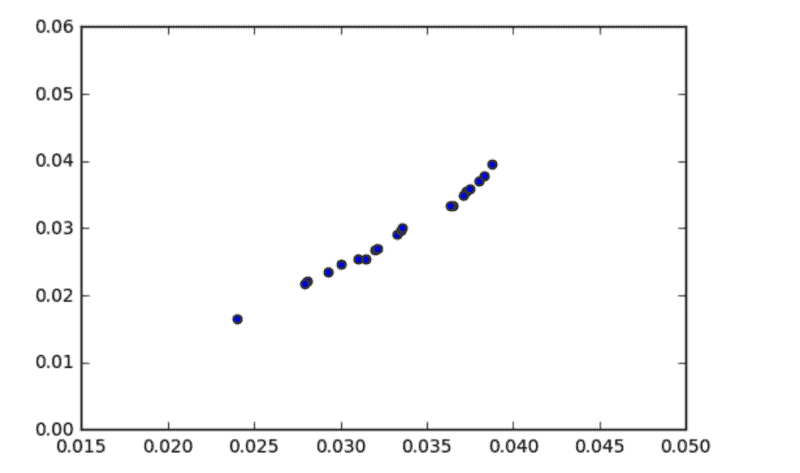

Covariance = 0.00003\. From a [question posted recently on stackexchange](https://stats.stackexchange.com/questions/320001/why-does-this-set-of-data-have-no-covariance)

看起来变量之间有很强的联系，对吗？那么为什么协方差如此之低，大约为 0.00003 呢？

这里的关键是要认识到协方差是依赖于尺度的。看看 *x* 和 *y* 轴——几乎所有的数据点都落在 0.015 到 0.04 的范围内。协方差同样会接近于零，因为它是通过从每个单独的观察值中减去平均值来计算的。

为了获得更有意义的数字，重要的是*归一化*协方差。这是通过将其除以每个向量的标准偏差的乘积来实现的。

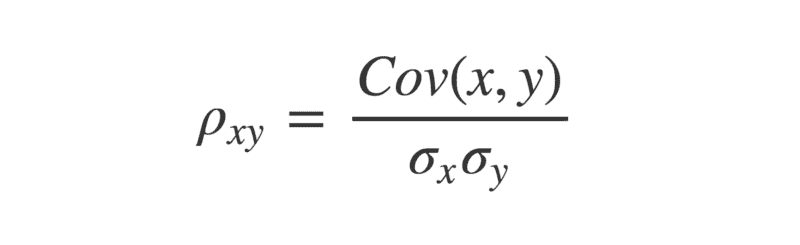

The Greek letter rho is often used to denote Pearson’s r

在 Python 中:

```
import math

def stDev(x):
    variance = 0
    for i in x:
        variance += (i - mean(x) ** 2) / len(x)
    return math.sqrt(variance)

def Pearsons(x,y):
    cov = covariance(x,y)
    return cov / (stDev(x) * stDev(y))
```

这样做的原因是因为向量的标准差是其方差的平方根。这意味着如果两个向量相同，那么乘以它们的标准差就等于它们的方差。

有趣的是，两个相同向量的协方差也等于它们的方差。


因此，两个向量之间的协方差的最大值等于它们的标准差的乘积，这发生在向量完全相关时。正是这一点限制了-1 和+1 之间的相关系数。

#### 箭头指向哪个方向？

另外，定义两个向量的 PCC 的一个更酷的方法来自线性代数。

首先，我们通过从向量的单个值中减去它们的平均值来确定向量的中心。

```
a = [1,2,3,4,5] ; b = [5,4,3,2,1]

a_centered = [i - mean(a) for i in a]
b_centered = [j - mean(b) for j in b]
```

现在，我们可以利用这样一个事实，向量可以被认为是指向给定方向的“箭头”。

例如，在 2d 中，向量[1，3]可以表示为沿 x 轴指向 1 个单位，沿 y 轴指向 3 个单位的箭头。同样，向量[2，1]可以表示为沿 x 轴指向 2 个单位，沿 y 轴指向 1 个单位的箭头。

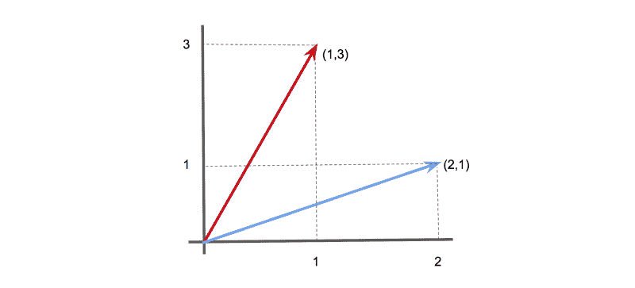

Two vectors (1,3) and (2,1) shown as arrows.

类似地，我们可以将数据向量表示为一个 *n* 维空间中的箭头(尽管不要试图想象当*n*3……)

使用两个向量的**点积**可以计算出这些箭头之间的角度θ。这被定义为:


或者，在 Python 中:

```
def dotProduct(x,y):
    calc = 0
    for i in range(len(x)):
        calc += x[i] * y[i]
    return calc
```

点积也可以定义为:


其中|| **x** ||是矢量 **x** 的大小(或‘长度’)(想想[毕达哥拉斯定理](https://www.mathplanet.com/education/pre-algebra/right-triangles-and-algebra/the-pythagorean-theorem))，θ是箭头矢量之间的角度。

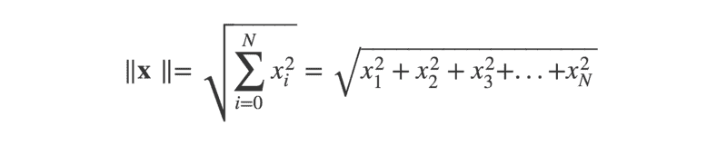

作为 Python 函数:

```
def magnitude(x):
    x_sq = [i ** 2 for i in x]
    return math.sqrt(sum(x_sq))
```

这样，我们就可以通过将点积除以两个向量的大小的乘积来求出 cos(θ)。


```
def cosTheta(x,y):
    mag_x = magnitude(x)
    mag_y = magnitude(y)
    return dotProduct(x,y) / (mag_x * mag_y)
```

现在，如果你懂一点三角学，你可能记得余弦函数产生一个在+1 和-1 之间振荡的图形。

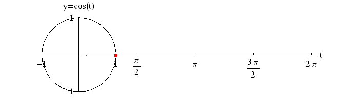

[Source](http://cda.mrs.umn.edu/~mcquarrb/teachingarchive/Precalculus/Animations/SineCosineAnim.html)

cos(θ)的值将根据两个箭头向量之间的角度而变化。

*   当角度为零时(即向量指向完全相同的方向)，cos(θ)将等于 1。
*   当角度为-180°时，(向量指向完全相反的方向)，则 cos(θ)将等于-1。
*   当角度为 90°时(矢量指向完全不相关的方向)，cos(θ)将等于零。

这可能看起来很熟悉——一种介于+1 和-1 之间的度量，似乎描述了两个向量的相关性？那不是皮尔森的 *r* 吗？

嗯——确实如此！通过将数据视为高维空间中的箭头向量，我们可以使用它们之间的角度θ作为相似性的度量。

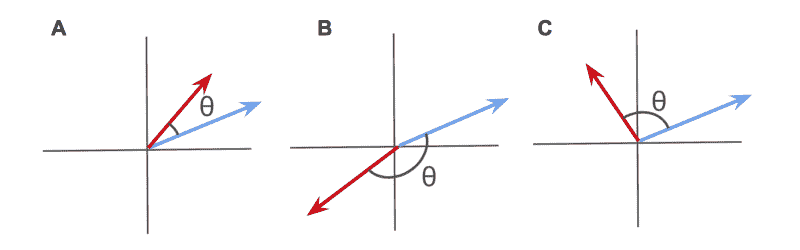

A) Positively correlated vectors; B) Negatively correlated vectors; C) Uncorrelated vectors

这个角度θ*的余弦在数学上*等同于*皮尔逊相关系数。*

*当被视为高维箭头时，正相关向量将指向相似的方向。*

*负相关向量将指向相反的方向。*

*不相关的向量会彼此成直角。*

*我个人认为这是一种非常直观的理解相关性的方式。*

#### *统计意义？*

*正如 frequentist 统计的情况一样，询问从给定样本计算的检验统计实际上有多重要是很重要的。皮尔森的 *r* 也不例外。*

*不幸的是，计算 PCC 估计值的置信区间并不完全简单。*

*这是因为皮尔逊的 *r* 介于-1 和+1 之间，因此不是正态分布。比方说，+0.95 的估计 PCC 只有这么大的误差空间，但有很大的误差空间。*

*幸运的是，有一个解决方案——使用一种叫做费希尔 z 变换的技巧:*

1.  *像往常一样计算皮尔逊的估计值。*
2.  *使用费希尔的 z 变换变换 *r* → *z* 。这可以通过使用公式 *z* =反正切( *r* )来实现，其中反正切是[反双曲正切函数](http://mathworld.wolfram.com/InverseHyperbolicTangent.html)。*
3.  *现在计算 *z* 的标准差。幸运的是，这很容易计算，由 SD *z* = 1/sqrt( *n* -3)给出，其中 *n* 是样本大小。*
4.  *选择您的显著性阈值α，并检查它对应的平均值的标准偏差。如果我们取α= 0.95，用 1.96。*
5.  *通过计算 *z* +(1.96 × SD *z* 求上界，通过计算 *z -* (1.96 × SD *z* ) *求下界。**
6.  *使用 *r* = tanh( *z* )将这些转换回 *r，*，其中 tanh 是[双曲正切函数](http://mathworld.wolfram.com/HyperbolicTangent.html)。*
7.  *如果上下界都是零的同侧，你就有统计学意义！*

*下面是一个 Python 实现:*

```
*`r = Pearsons(x,y)
z = math.atanh(r)
SD_z = 1 / math.sqrt(len(x) - 3)
z_upper = z + 1.96 * SD_z
z_lower = z - 1.96 * SD_z
r_upper = math.tanh(z_upper)
r_lower = math.tanh(z_lower)`*
```

*当然，当给定一个包含许多潜在相关变量的大型数据集时，检查每一个成对的相关性可能很有诱惑力。这通常被称为“数据挖掘”——在数据集中搜寻变量之间的任何明显关系。*

*如果您采用这种多重比较方法，您应该使用更严格的显著性阈值来降低发现假阳性的风险(也就是说，找到看起来完全偶然相关的不相关变量)。*

*一种方法是使用 [Bonferroni 校正](https://matthew-brett.github.io/teaching/bonferroni_correction.html#the-bonferroni-correction)。*

#### *小号印刷字体*

*到目前为止，一切顺利。我们已经看到了如何使用 Pearson 的 *r* 来计算两个变量之间的相关系数，以及如何评估结果的统计显著性。给定一组看不见的数据，就有可能开始挖掘变量之间的重要关系。*

*然而，有一个主要的问题——皮尔森的 *r* 只适用于线性数据。*

*看下面的图表。它们清楚地显示了看起来像非随机关系的东西，但是皮尔森的 *r* 非常接近零。*

*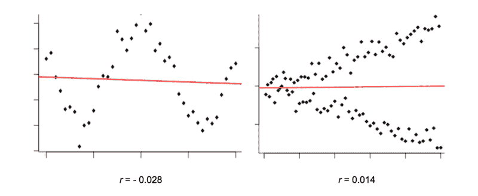*

*之所以如此，是因为这些图中的变量具有一种*非线性*关系。*

*我们通常可以把两个变量之间的关系描绘成分散在一条线两侧的点的“云”。散布越广，数据越“嘈杂”，关系越弱。*

*然而，Pearson 的 *r* 只将每个单独的数据点与另一个数据点(整体平均值)进行比较。这意味着它只能考虑直线。它不擅长检测任何非线性关系。*

*在上面的图表中，皮尔森的 *r* 并没有显示有太多的相关性可谈。*

*然而，这些变量之间的关系显然仍然是非随机的，这使得它们可能成为彼此有用的预测指标。机器如何识别这一点？幸运的是，我们可以使用不同的相关性度量方法。*

*让我们来看看其中的几个。*

### *距离相关性*

#### *这是什么？*

*[距离相关性](https://projecteuclid.org/download/pdfview_1/euclid.aos/1201012979)与皮尔森的 *r* 有一些相似之处，但实际上是使用一种相当不同的协方差概念来计算的。该方法通过用“距离”类似物代替我们日常概念中的协方差和标准差(如上定义)来工作。*

*很像皮尔森的 *r* ，“距离相关性”被定义为“距离标准差”归一化的“距离协方差”。*

*距离相关性不是评估两个变量与其各自均值的距离如何共同变化，而是评估它们与所有其他点的距离如何共同变化。*

*这开启了更好地捕捉变量之间的非线性相关性的潜力。*

#### *越精细的细节…*

*罗伯特·布朗是苏格兰植物学家，生于 1773 年。在他的显微镜下研究植物花粉时，布朗注意到微小的有机颗粒在他使用的水的表面随机抖动。*

*他一点也没有想到，他的一次偶然观察会使他作为布朗运动的(重新)发现者而名垂千古。*

*他更不知道的是，阿尔伯特·爱因斯坦花了将近一个世纪的时间才给出了对现象的解释，从而证明了原子的存在。同年，他发表了关于 E=MC、狭义相对论的论文，并帮助启动了量子理论领域。*

*布朗运动是一种物理过程，其中粒子由于与周围分子的碰撞而随机移动。*

*这个过程背后的数学可以概括为一个概念，称为[韦纳过程](http://mathworld.wolfram.com/WienerProcess.html)。除此之外，韦纳过程在数理金融最著名的模型[布莱克-斯科尔斯](https://www.investopedia.com/terms/b/blackscholes.asp)中扮演着重要的角色。*

*有趣的是，布朗运动和韦纳过程被证明与 2000 年代中期通过加博·策克利的工作开发的非线性相关性测量有关。*

**

*让我们来看看如何计算两个向量 *x* 和 *y* ，每个向量的长度为 *N* 。*

1.  *首先，我们为每个向量形成 *N* × *N* 距离矩阵。距离矩阵就像地图集中的道路距离图，每行和每列的交叉点显示了相应城市之间的距离。这里，行 *i* 和列 *j* 之间的交集给出了向量的第 I 个和第 j 个元素之间的距离。*

**

*2.接下来，矩阵是“双中心”的。这意味着对于每个元素，我们减去其行的平均值和列的平均值。然后，我们加上整个矩阵的平均值。*

*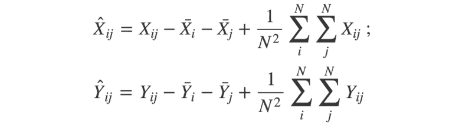

The ‘hat’ symbols mean ‘double-centred’; the ‘bar’ symbols mean ‘mean’* 

*3.利用这两个双中心矩阵，我们可以通过将 *X* 中的每个元素的平均值乘以 *Y* 中对应的元素来计算距离协方差的平方。*

**

*4.现在，我们可以使用类似的方法来找到“距离方差”。记住，两个相同向量的协方差等于它们的方差。因此，距离方差的平方可描述如下:*

**

*5.最后，我们有了计算距离相关性的所有片段。记住,(距离)标准差等于(距离)方差的平方根。*

**

*如果你喜欢通过代码而不是数学符号来工作(毕竟，人们倾向于用一种而不是另一种来写软件是有原因的……)，那么看看下面的 R 实现:*

```
*`set.seed(1234)

doubleCenter <- function(x){
  centered <- x
  for(i in 1:dim(x)[1]){
    for(j in 1:dim(x)[2]){
      centered[i,j] <- x[i,j] - mean(x[i,]) - mean(x[,j]) + mean(x)
      }
    }
  return(centered)
}

distanceCovariance <- function(x,y){
  N <- length(x)
  distX <- as.matrix(dist(x))
  distY <- as.matrix(dist(y))
  centeredX <- doubleCenter(distX)
  centeredY <- doubleCenter(distY)
  calc <- sum(centeredX * centeredY)
  return(sqrt(calc/(N^2)))
 }

distanceVariance <- function(x){
  return(distanceCovariance(x,x))
}
distanceCorrelation <- function(x,y){
  cov <- distanceCovariance(x,y)
  sd <- sqrt(distanceVariance(x)*distanceVariance(y))
  return(cov/sd)
}

# Compare with Pearson's r
x <- -10:10
y <- x^2 + rnorm(21,0,10)
cor(x,y) # --> 0.057
distanceCorrelation(x,y) # --> 0.509`*
```

*任何两个变量之间的距离相关性被限制在 0 和 1 之间。零表示变量是独立的，而接近 1 的分数表示依赖关系。*

*如果你不愿意从头开始编写自己的距离关联方法，你可以安装 R 的 [*能量*包](https://cran.r-project.org/web/packages/energy/index.html)，它是由发明该方法的研究人员编写的。这个包中可用的方法调用用 C 编写的函数，提供了很大的速度优势。*

#### *物理解释*

*与距离关联公式有关的一个更令人惊讶的结果是，它与布朗关联完全等价。*

*布朗相关是指两个布朗过程的独立性(或依赖性)。相互依赖的布朗过程将显示出相互“跟随”的趋势。*

*有助于理解距离相关性概念的一个简单比喻是，想象一队纸船漂浮在湖面上。*

*如果没有主导风向，那么每艘船都会随机漂移——有点类似布朗运动。*

*

Boats drifting under no prevailing wind* 

*如果有盛行风，那么船只漂移的方向将取决于风力。风越大，依赖性越强。*

*

Under a prevailing wind, the boats will tend to drift in the same direction* 

*以类似的方式，不相关的变量可以被认为是在没有盛行风的情况下漂流的船。相关变量可以被认为是在盛行风影响下漂流的船只。在这个比喻中，风代表了两个变量之间关系的强度。*

*如果我们允许湖面上不同点的主导风向发生变化，那么我们可以将非线性的概念引入类比。距离相关使用“船”之间的距离来推断盛行风的强度。*

**

#### *置信区间？*

*可以使用“重采样”技术为距离相关性估计建立置信区间。一个简单的例子是 **bootstrap 重采样。***

*这是一个简洁的统计技巧，要求我们通过从原始数据集中随机取样(替换)来“重建”数据。这被重复多次(例如，1000 次)，并且每次都计算感兴趣的统计量。*

*这将为我们感兴趣的统计数据产生一系列不同的估计值。我们可以用这些来估计给定置信水平的上限和下限。*

*下面是一个简单的引导函数的 R 代码:*

```
*`set.seed(1234)

bootstrap <- function(x,y,reps,alpha){
  estimates <- c()
  original <- data.frame(x,y)
  N <- dim(original)[1]
  for(i in 1:reps){
    S <- original[sample(1:N, N, replace = TRUE),]
    estimates <- append(estimates, distanceCorrelation(S$x, S$y))
  }
  u <- alpha/2 ; l <- 1-u
  interval <- quantile(estimates, c(l, u))
  return(2*(dcor(x,y)) - as.numeric(interval[1:2]))
}

# Use with 1000 reps and threshold alpha = 0.05
x <- -10:10
y <- x^2 + rnorm(21,0,10)
bootstrap(x,y,1000,0.05) # --> 0.237 to 0.546`*
```

*如果你想建立统计显著性，还有另一个重采样技巧，叫做“排列测试”。*

*这与上面定义的自举方法略有不同。这里，我们保持一个矢量不变，并通过重采样“洗牌”另一个。这接近于零假设，即变量之间没有相关性。*

*“混洗”变量然后用于计算它和常量变量之间的距离相关性。这要做很多次，结果的分布要与实际的距离相关性(从非闪烁数据中获得)进行比较。*

*然后，大于或等于“真实”结果的“混洗”结果的比例被视为 p 值，其可以与给定的显著性阈值(例如，0.05)进行比较。*

*查看代码，了解这是如何工作的:*

```
*`permutationTest <- function(x,y,reps){
  estimates <- c()
  observed <- distanceCorrelation(x,y)
  N <- length(x)
  for(i in 1:reps){
    y_i <- sample(y, length(y), replace = T)
    estimates <- append(estimates, distanceCorrelation(x, y_i))
  }
  p_value <- mean(estimates >= observed)
  return(p_value)
}

# Use with 1000 reps
x <- -10:10
y <- x^2 + rnorm(21,0,10)
permutationTest(x,y,1000) # --> 0.036`*
```

### *最大信息系数*

#### *这是什么？*

*最大信息系数(MIC)是一种用于检测变量之间非线性相关性的最新方法，[于 2011 年](https://www.ncbi.nlm.nih.gov/pmc/articles/PMC3325791/)设计。用于计算 MIC 的算法将信息论和概率的概念应用于连续数据。*

#### *潜入…*

*信息论是数学中一个迷人的领域，由克劳德·香农在二十世纪中叶开创。*

*一个关键概念是熵——给定概率分布中不确定性的度量。概率分布描述了与特定事件相关的一组给定结果的概率。*

*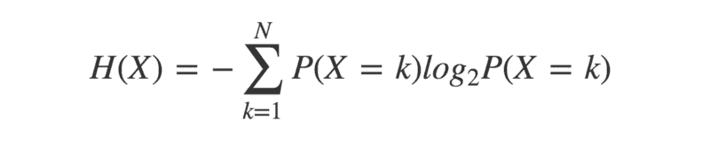

Entropy of a probability distribution is minus “the sum of the probability of each outcome, multiplied by the logarithm of itself”* 

*为了理解这是如何工作的，比较下面的两个概率分布:*

*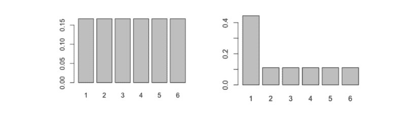

Possible outcomes are on the X-axis; their respective probabilities are on the Y-axis* 

*左边是公平的六面骰子，右边是不太公平的六面骰子的分布。*

*凭直觉，你认为哪个熵更高？哪个骰子的结果最不确定？让我们计算熵，看看答案是什么。*

```
*`entropy <- function(x){
  pr <- prop.table(table(x))
  H <- sum(pr * log(pr,2))
  return(-H)
}

dice1 <- 1:6
dice2 <- c(1,1,1,1,2:6)
entropy(dice1) # --> 2.585
entropy(dice2) # --> 2.281`*
```

*正如你所料，越公平的骰子有越高的熵。*

*这是因为每一种结果都和其他结果一样有可能发生，所以我们无法预先知道选择哪一种。*

*不公平的骰子给了我们更多的信息——一些结果比其他结果更有可能发生——所以结果的不确定性减少了。*

*通过这种推理，我们可以看到，当每种结果的可能性相等时，熵将是最高的。这种概率分布称为“均匀”分布。*

*交叉熵是熵概念的扩展，它考虑了第二种概率分布。*

*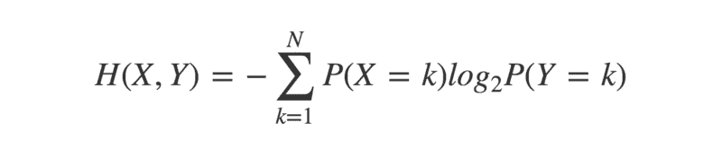*

```
*`crossEntropy <- function(x,y){
  prX <- prop.table(table(x))
  prY <- prop.table(table(y))
  H <- sum(prX * log(prY,2))
  return(-H)
}`*
```

*这具有两个相同概率分布之间的交叉熵等于它们各自的熵的性质。当考虑两个不同的概率分布时，它们的交叉熵和各自的熵会有差别。*

*这种差异或“散度”，可以通过计算它们的 **Kullback-Leibler 散度**或 KL 散度来量化。*

*两个概率分布 *X* 和 *Y* 的 KL 散度为:*

*

KL-divergence of probability distributions X and Y equals their cross-entropy, minus the entropy of X* 

*两个分布之间的 KL-散度的最小值为零。这只有在分布相同时才会发生。*

```
*`KL_divergence <- function(x,y){
  kl <- crossEntropy(x,y) - entropy(x)
  return(kl)
}`*
```

*在发现相关性的上下文中，KL-散度的一个用途是计算两个变量的互信息(MI)。*

*互信息可以定义为“两个随机变量的联合分布和边缘分布之间的 KL-散度”。如果这些相同，MI 将等于零。如果它们完全不同，那么 MI 将是一个正数。联合分布和边缘分布的差异越大，MI 越高。*

*为了更好地理解这一点，让我们花点时间来重温一些概率概念。*

*变量 *X* 和 *Y* 的联合分布就是它们同时出现的概率。例如，如果你掷两枚硬币 X 和 Y，它们的联合分布将反映每个观察结果的概率。假设你掷硬币 100 次，得到的结果是“正面，正面”40 次。联合分布将反映这一点。*

*P(X=H，Y=H) = 40/100 = 0.4*

```
*`jointDist <- function(x,y){
  N <- length(x)
  u <- unique(append(x,y))
  joint <- c()
  for(i in u){
    for(j in u){
      f <- x[paste0(x,y) == paste0(i,j)]
      joint <- append(joint, length(f)/N)
    }
  }
  return(joint)
}`*
```

*边际分布是一个变量在没有关于另一个变量的任何信息的情况下的概率分布。两个边际分布的乘积给出了独立假设下两个事件同时发生的概率。*

*对于抛硬币的例子，假设两个硬币都产生 50 个正面和 50 个反面。他们的边际分布会反映这一点。*

*p(X = H)= 50/100 = 0.5；P(Y=H) = 50/100 = 0.5*

*P(X=H) × P(Y=H) = 0.5 × 0.5 = 0.25*

```
*`marginalProduct <- function(x,y){
  N <- length(x)
  u <- unique(append(x,y))
  marginal <- c()
  for(i in u){
    for(j in u){
      fX <- length(x[x == i]) / N
      fY <- length(y[y == j]) / N 
      marginal <- append(marginal, fX * fY)
    }
  }
  return(marginal)
}`*
```

*回到掷硬币的例子，如果两个硬币是独立的，边际分布的乘积将给出观察到每个结果的概率，而联合分布将给出实际观察到的每个结果的概率。*

*如果硬币真的是独立的，那么联合分布应该(近似)等于边际分布的乘积。如果它们在某种程度上相互依赖，那么就会出现分歧。*

*在示例中，P(X=H，Y=H) > P(X=H) × P(Y=H)。这表明硬币落在头上的几率比预期的要高。*

*联合产品分布和边际产品分布之间的差异越大，事件就越有可能以某种方式相互依赖。这种差异的度量由两个变量的交互信息来定义。*

*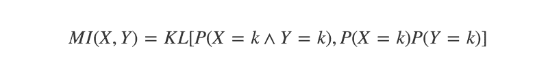

The Mutual Information of X and Y equals “the KL divergence of their joint distribution, and the product of their marginal distributions”* 

```
*`mutualInfo <- function(x,y){
  joint <- jointDist(x,y)
  marginal <- marginalProduct(x,y)
  Hjm <- - sum(joint[marginal > 0] * log(marginal[marginal > 0],2))
  Hj <- - sum(joint[joint > 0] * log(joint[joint > 0],2))
  return(Hjm - Hj)
}`*
```

*这里的一个主要假设是我们正在处理离散的概率分布。我们如何将这些概念应用于连续数据？*

#### *扔掉*

*一种方法是量化数据(使变量离散)。这是通过宁滨(将数据点分配到离散的类别)实现的。*

*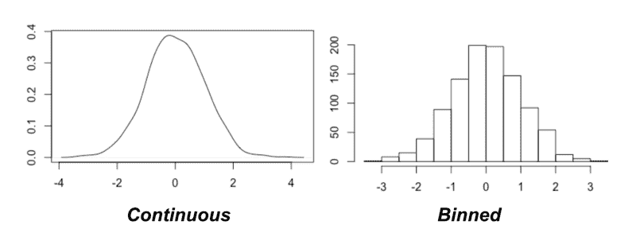*

*现在的关键问题是决定使用多少箱子。幸运的是，关于最大信息系数的原始论文提供了一个建议:尝试它们中的大多数！*

*也就是说，尝试不同数量的箱，看看哪一个产生变量之间的交互信息的结果最大。然而，这带来了两个挑战:*

1.  *试几个箱子？从技术上来说，你可以将一个变量量化成任意数量的容器，只要让容器的大小永远变小。*
2.  *互信息对所使用的箱的数量很敏感。如何公平地比较不同箱数之间的 MI？*

*第一个挑战意味着技术上不可能尝试每一个可能的箱子数量。然而，该论文的作者提供了一个**启发式**解决方案(也就是说，一个不能“保证完美”的解决方案，但却是一个非常好的近似)。他们还建议对可尝试的垃圾桶数量设置上限。*

*

The maximum number of bins to try is determined by the sample size, N* 

*至于公平地比较不同宁滨方案之间的 MI 值，有一个简单的解决办法…标准化它！这可以通过将每个 MI 分数除以该特定仓组合在理论上可能采用的最大值来实现。*

*总体上产生最高归一化 MI 的宁滨组合是要使用的组合。*

*

Mutual Information can be normalized by dividing by the logarithm of the smallest number of bins* 

*然后将最高的标准化 MI 报告为这两个变量的最大信息系数(或“MIC”)。让我们看看一些代码，将估计两个连续变量的 MIC。*

```
*`MIC <- function(x,y){
  N <- length(x)
  maxBins <- ceiling(N ** 0.6)
  MI <- c()
  for(i in 2:maxBins) {
    for (j in 2:maxBins){
      if(i * j > maxBins){
        next
      }
      Xbins <- i; Ybins <- j
      binnedX <-cut(x, breaks=Xbins, labels = 1:Xbins)
      binnedY <-cut(y, breaks=Ybins, labels = 1:Ybins)
      MI_estimate <- mutualInfo(binnedX,binnedY)
      MI_normalized <- MI_estimate / log(min(Xbins,Ybins),2)
      MI <- append(MI, MI_normalized)
    }
  }
  return(max(MI))
}

x <- runif(100,-10,10)
y <- x**2 + rnorm(100,0,10)
MIC(x,y) # --> 0.751`*
```

*上面的代码是对原始论文中概述的方法的简化。在 [R 包 *minerva*](https://cran.r-project.org/web/packages/minerva/index.html) 中有一个更忠实的算法实现。在 Python 中，可以使用 [*minepy* 模块](https://minepy.readthedocs.io/en/latest/)。*

*MIC 能够挑选出各种线性和非线性关系，并在一系列不同的应用中得到应用。它介于 0 和 1 之间，数值越高表示依赖性越大。*

#### *置信区间？*

*要建立 MIC 估计值的置信界限，可以简单地使用我们之前看到的自举技术。*

*为了推广 bootstrap 函数，我们可以利用 R 的函数式编程能力，将我们想要使用的技术作为参数进行传递。*

```
*`bootstrap <- function(x,y,func,reps,alpha){
  estimates <- c()
  original <- data.frame(x,y)
  N <- dim(original)[1]
  for(i in 1:reps){
    S <- original[sample(1:N, N, replace = TRUE),]
    estimates <- append(estimates, func(S$x, S$y))
  }
  l <- alpha/2 ; u <- 1 - l
  interval <- quantile(estimates, c(u, l))
  return(2*(func(x,y)) - as.numeric(interval[1:2]))
}

bootstrap(x,y,MIC,100,0.05) # --> 0.594 to 0.88`*
```

### *摘要*

*为了结束这次相关性之旅，让我们针对一系列人工生成的数据测试每种不同的方法。这些例子的代码可以在[这里](https://gist.github.com/anonymous/fabecccf33f9c3feb568384f626a2c07)找到。*

#### *噪音*

*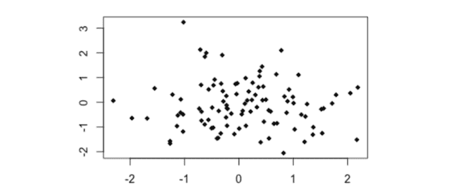*

```
*`set.seed(123)

# Noise
x0 <- rnorm(100,0,1)
y0 <- rnorm(100,0,1)
plot(y0~x0, pch = 18)

cor(x0,y0)
distanceCorrelation(x0,y0)
MIC(x0,y0)`*
```

*   *皮尔逊的 *r* = - 0.05*
*   *距离相关性= 0.157*
*   *MIC = 0.097*

#### *简单线性*

*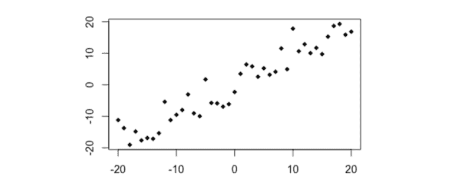*

```
*`# Simple linear relationship
x1 <- -20:20
y1 <- x1 + rnorm(41,0,4)
plot(y1~x1, pch =18)

cor(x1,y1)
distanceCorrelation(x1,y1)
MIC(x1,y1)`*
```

*   *皮尔逊的 r =+0.95*
*   *距离相关性= 0.95*
*   *MIC = 0.89*

#### *简单二次曲线*

*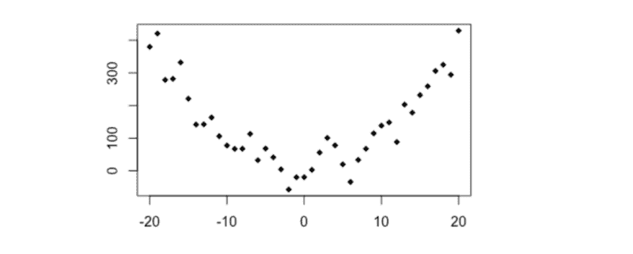*

```
*`# y ~ x**2
x2 <- -20:20
y2 <- x2**2 + rnorm(41,0,40)
plot(y2~x2, pch = 18)

cor(x2,y2)
distanceCorrelation(x2,y2)
MIC(x2,y2)`*
```

*   *皮尔逊的 r =+0.003*
*   *距离相关性= 0.474*
*   *MIC = 0.594*

#### *三角法的*

*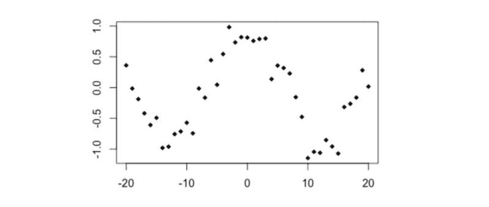*

```
*`# Cosine
x3 <- -20:20
y3 <- cos(x3/4) + rnorm(41,0,0.2)
plot(y3~x3, type='p', pch=18)

cor(x3,y3)
distanceCorrelation(x3,y3)
MIC(x3,y3)`*
```

*   *皮尔逊的 *r* = - 0.035*
*   *距离相关性= 0.382*
*   *MIC = 0.484*

#### *圆*

*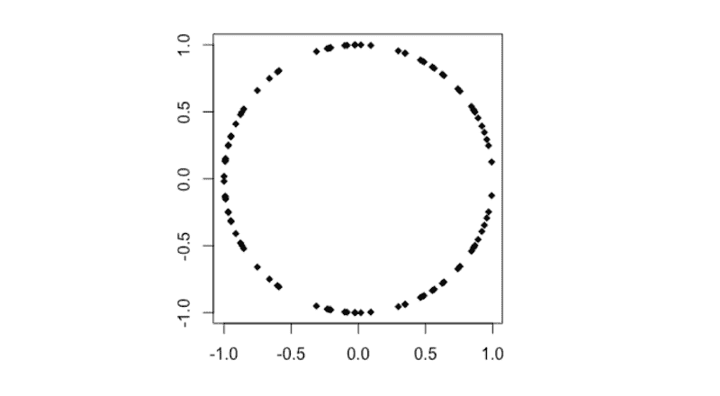*

```
*`# Circle

n <- 50
theta <- runif (n, 0, 2*pi)
x4 <- append(cos(theta), cos(theta))
y4 <- append(sin(theta), -sin(theta))
plot(x4,y4, pch=18)

cor(x4,y4)
distanceCorrelation(x4,y4)
MIC(x4,y4)`*
```

*   *皮尔逊的 *r 的*T2 的【0.001*
*   *距离相关性= 0.234*
*   *MIC = 0.218*

*感谢阅读！*