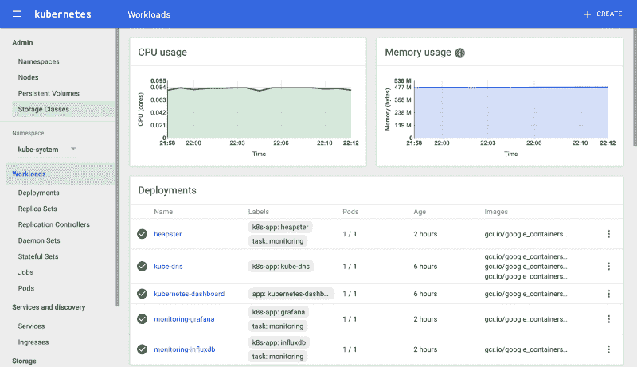

# SaaS Kubernetes 入门

> 原文：<https://www.freecodecamp.org/news/getting-started-with-kubernetes-for-your-saas-91e91116dd7d/>

Kubernetes 是一个管理和协调云基础设施的平台。它提供了一个配置驱动的框架，您可以在其中定义几个不同的部分，只需单击一下，就可以让整个网络、磁盘和应用程序以可扩展且易于管理的方式运行起来。

如果你从一开始就没有考虑到容器来设计你的应用程序，那么将你的应用程序迁移到 Kubernetes 是一项非常费力的工作。本文的目标是帮助您将 Kubernetes 集成应用程序容器化。

请注意，如果您试图在没有适当体系结构的情况下将应用程序强制导入 Kubernetes，那么实际上是在给自己搬石头砸自己的脚，浪费时间并累积技术债务。

### 步骤 1 —容器化您的应用程序？

容器基本上是操作系统的一个分区，可以作为独立的机器运行。与传统虚拟机不同，传统虚拟机依赖管理程序来模拟操作系统，容器使用各种内核功能来提供与主机隔离的环境。


Containerized apps can run predictably on all machines, not just yours

容器化是一个相当简单的过程——使用 Docker，只需定义一个 Docker 文件，列出在操作系统上安装应用程序所需的步骤(下载包、安装依赖项等等)。

然后，构建一个可供开发人员使用的映像。关于集装箱化过程的更多信息可以在 Docker 的网站上找到。

### 步骤 2 —采用多实例架构？


The decision to go with multi-tenant or multi-instance architecture will take you down different paths

在您转向 Kubernetes 之前，您需要认真审视一下当前您向最终用户交付应用程序的方式。

传统的 web 应用程序使用**多租户**架构。这意味着所有用户将共享一个数据库实例和一个应用程序实例。这可以在 Kubernetes 中实现——但是，我强烈建议您考虑实现一个**多实例**架构，以充分利用 Kubernetes 和容器化应用程序的能力。

采用多实例架构的一些主要好处是:

*   **稳定性** —每个客户可以存在于自己的实例中，而不是单点故障(单个应用程序实例)。如果一个实例失败，其他实例将不受影响。
*   **可扩展性—** 对于多实例架构，纵向扩展只需添加更多资源。然而，对于多租户架构，您可能会需要一个集群化的应用程序架构，其部署通常并不简单。
*   **安全性** —当您使用单个数据库时，您的所有数据都在一起。如果出现安全漏洞，这将成为一个主要问题，因为当一个帐户受到威胁时，所有客户的数据都会变得脆弱。在多实例体系结构中，只有单个客户的数据会面临风险。

### 步骤 3-确定应用的资源消耗⛽

为了拥有最具成本效益的基础设施，您需要确定运行应用程序的单个实例需要多少 CPU、内存和存储。

通过这种方式，您可以设置限制，以便准确地了解 Kubernetes 节点需要多少空间，并确保您的节点不会过载和不可靠。

这通常是一个试错的过程，但是你可以使用一个监控解决方案，比如 [Heapster](https://github.com/kubernetes/heapster/) 来给出一个你的 pod 正在消耗的资源的简单分类。这将让你衡量分配多少。



Heapster provides visualizations for your workload’s resource usage

在确定了资源分配之后，您可以为 Kubernetes 节点计算最佳的服务器大小，从而获得最大的收益。

您将每个实例运行所需的内存或 CPU 乘以 100(一个节点可以容纳的最大单元数)。这将给你一个大概的估计，你的节点应该有多少内存/CPU。

不过，您应该始终对您的应用程序进行压力测试，以确保它在节点填满时能够顺利运行。

### 第 4 步——与 kubernetes 整合

一旦您的 Kubernetes 集群启动并运行，您就可以开始开发许多 DevOps 实践来使您的生活更加轻松。其中一些集成点采用以下形式:

#### Kubernetes 节点的自动缩放

当您的节点变满时，通常您希望提供更多的节点，以便一切都可以顺利进行。一种方法是使用类似于 [kops](https://github.com/kubernetes/kops) 的工具。

#### 应用程序的自动扩展

一些应用程序将需要根据当前的使用情况进行放大或缩小。Kubernetes 使用自动扩展部署的触发器提供了开箱即用的功能。例如，运行以下命令:

```
kubectl autoscale deployment myapp --cpu-percent=50 --min=1 --max=10
```

当 CPU 百分比超过 50%时，将设置 myapp 部署到 10 个 pod。

#### 根据用户操作自动提供实例

对于多实例架构，最终用户将请求在 Kubernetes 中部署应用程序。要做到这一点，你应该考虑将你的应用与 Kubernetes API 集成，或者使用第三方解决方案，如 T2 服务机器人来提供一个请求实例的门户。

#### 用户操作自定义主机名定义

最近一个日益增长的趋势是最终用户将他们的域附加到应用程序上。Kubernetes 提供了一些工具来简化这一过程，甚至可以实现自助服务(用户只需点击一个按钮，就可以将自己的域指向 pod)。你可以使用一个系统，比如 [Nginx Ingress](https://github.com/kubernetes/ingress-nginx) 来完成这个任务。

### 结论

Kubernetes 是管理您的云基础设施的一个很好的方式。如果您在扩展应用程序时遇到困难，可以考虑迁移到基于 Kubernetes 的架构。在部署、集群和整体稳定性方面，您将看到 DevOps 的工作效率大幅提高。

[*ServiceBot*](https://servicebot.io) *是一个通过自动化计费、部署和销售渠道来帮助您管理 SaaS 的平台。*

#### 你想扩大你的 SaaS 吗？[我们来聊聊](http://bit.ly/sbotconsult)。