# 为什么您应该对无服务器应用单一责任原则

> 原文：<https://www.freecodecamp.org/news/why-you-should-apply-the-single-responsibility-principle-to-serverless-77810a24bd49/>

作者:崔琰

# 为什么您应该对无服务器应用单一责任原则

一个有趣的时刻(38:50)发生在蒂姆·布雷在 re:invent 2017 上的演讲期间。蒂姆问观众，我们是应该有许多单一用途的功能，还是应该有更少的单一功能，意见不一。

这是一个挑战我信念的时刻，因为我是在坚实的原则下长大的。

*   单一责任原则
*   开/关原则
*   利斯科夫替代原理
*   界面分离原理
*   从属倒置原则

很长一段时间以来，我一直认为遵循**单一责任原则** (SRP)是显而易见的。

这促使双方对争论进行了更深入的研究。

我在这场辩论中有偏见。如果你发现我的想法有缺陷，或者不同意我的观点，请在评论中指出来。

我所说的“单光函数”是指具有内部分支对数的函数。这些函数可以根据调用事件做几件事情中的一件。

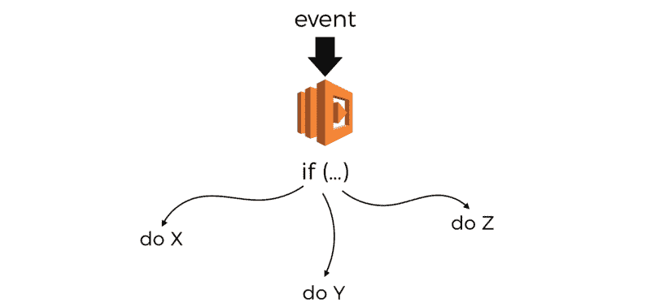

例如，一个 API 的所有端点都可以有一个函数。该功能将根据`path`和`method`参数形成不同的动作。

```
module.exports.handler = (event, context, cb) => {   const path = event.path;   const method = event.httpMethod; 
```

```
 if (path === '/user' && method === 'GET') {     .. // get user   } else if (path === '/user' && method === 'DELETE') {     .. // delete user   } else if (path === '/user' && method === 'POST') {     .. // create user   } else if {    .. // other endpoints & methods   }}
```

不先了解问题和解决方案中什么样的质量是最理想的，你就不能理性地思考和比较解决方案。

当我听到诸如“拥有如此多的功能使人变老很难”这样的抱怨时，我不知道人变老意味着什么？

*   是为了找到你正在寻找的特殊功能吗？
*   是为了揭示你的功能吗？
*   当你有 10 个函数或 100 个函数时，这是个问题吗？
*   是不是只有当你有太多的开发人员在为他们工作，以至于你无法跟踪的时候，这才成为一个问题？

从我自己的经验来看，这个问题与我们有什么功能关系不大。相反，它是关于发现我们通过这些功能所拥有的特性和能力。

毕竟，一个 Lamb 功能，就像一个 Dock container，是一个提供一些业务特性或功能的工具。

你不会问*“我们有`get-user-by-facebook-id`功能吗？”*因为你需要知道这个函数叫什么，甚至不知道这个能力是否存在，以及它是否被一个 Lamb 函数捕获。相反，你可能会问，*“我们有一个 Lamb 函数可以根据用户的 face book ID 找到他/她吗？”*

因此，真正的问题是，假设我们有一个由许多特性和功能组成的复杂系统，它主要由许多开发团队所拥有，**我们如何将这些特性和功能组织到 Lamb 函数中，从而使其朝着**方向优化

*   **发现能力**:我如何发现我们的系统中存在哪些特性和能力？
*   调试:我如何快速识别并找到调试问题所需的代码？例如，在系统 X 的日志中有错误，我在哪里可以找到开始调试系统的相关代码？
*   **扩展团队**:在维护代码的同时，我如何最小化摩擦并发展工程团队？

以下是对我来说最重要的品质。有了这些知识，我可以比较不同的方法，看看哪一种最适合我的 T2。

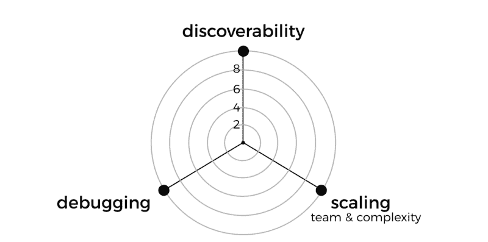

你可能关心不同的质量。例如，你可能不关心团队规模，但是成本对你来说是一个重要的考虑因素。不管它们是什么，让这些设计目标明确是有帮助的。你还应该确保他们与你的团队分享，并得到他们的理解。

### 可发现性

缺乏发现能力并不是一个新问题。根据西蒙·沃德·莱伊的说法，无论是政府还是私营部门都是如此。大多数组织缺乏一种系统的方法让团队共享和发现彼此的工作。

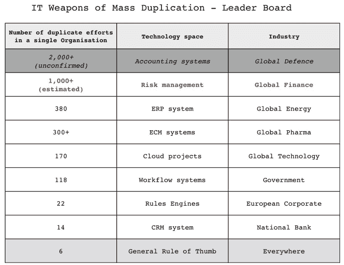

courtesy of Simon Wardley’s posts on Twitter

如前所述，发现是指通过你的功能发现你有哪些能力。仅仅知道你有什么功能是不够的。

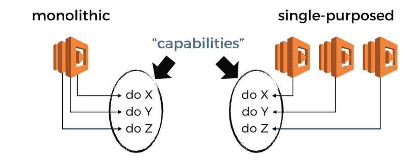

Ask not what functions you have, ask rather what your functions can do.

我经常听到的关于单一功能的争论是，它减少了功能的数量，使它们更容易老化。

从表面上看，这似乎有道理。但我越想，这个论点就越显得有缺陷。如果我们试图用手工而不是用现有的工具来管理这些功能，它们的数量只会是一个推动力。

毕竟，我们能够在一个有成千上万本书的巨大物理空间里，根据内容找到书。使用库的类比，借助我们可用的工具，我们可以将我们的功能分类，并使它们易于搜索。


例如，[无服务器](https://serverless.com/framework/)框架实施了一个简单的命名约定`{service}-{stage}-{function}`。这个简单的约定使得通过前缀查找相关函数变得容易。如果我想找到属于某个`user` API 的所有函数，我可以通过搜索`user-api`来实现。

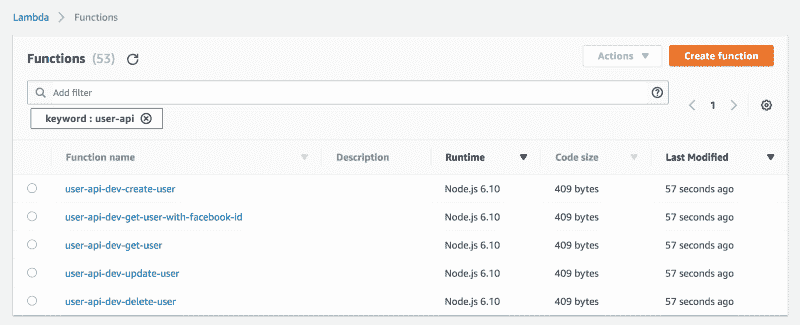

有了标签，我们可以在多维度上记录对话函数。例如，我们可以使用环境、特征名称、事件源、作者等进行分类。

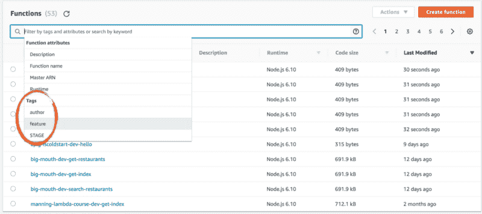

By default, the Serverless framework adds the STAGE tag to all of your functions. You can also add your own tags as well, see [documentation](https://serverless.com/framework/docs/providers/aws/guide/functions/#tags) on how to add tags.

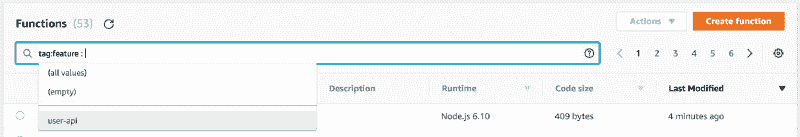

The Lambda management console also gives you a handy dropdown list of the available values when you try to search by a tag.

如果你对你要找的东西有一个粗略的想法，那么函数的数量并不妨碍你发现那里有什么。

有了单一用途的功能,`user-api`的能力就显而易见了。从相关函数中我可以看出我有基本的 CRUD 能力，因为每一个都有相应的函数。

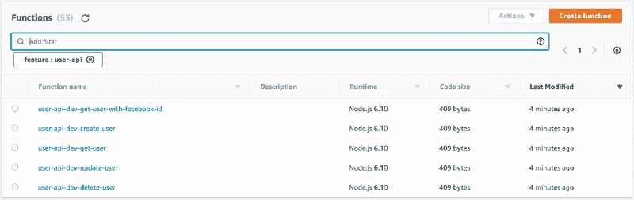

I can see what capabilities I have as part of the suite of functions that make up the user-api feature.

然而，对于单一的 lith ic 函数，这并不简单。只有一个功能，但是这个功能能做什么？我必须自己查看代码，或者咨询函数的作者。对我来说，这造成了可怜的发现能力。


正因为如此，我把单石方法记在了 discovery ability 上。


但是，有更多的功能意味着有更多的页面供你浏览。如果你只是想浏览一下，看看有什么功能，这可能会很费力。

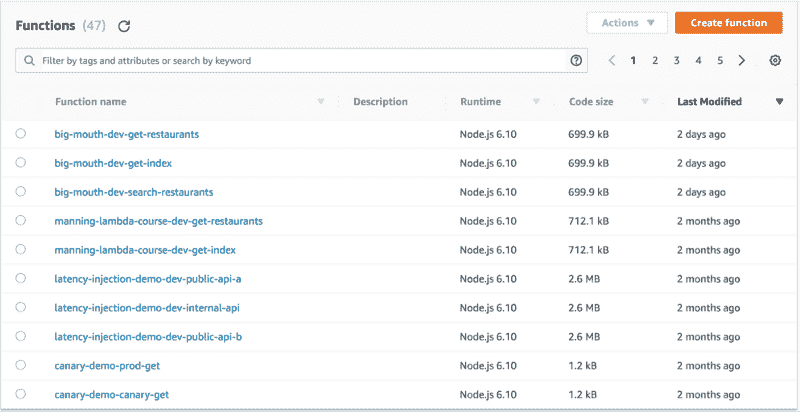

虽然，以我的经验来看，这本身从来都不是问题。由于*无服务器*框架的命名约定，所有相关的功能都很接近。实际上，看到每组函数能做什么是非常好的，而不是必须猜测一个整体函数内部发生了什么。

但是，当你有成千上万的功能时，滚动浏览每一个东西是一件痛苦的事情。所以，我要为此惩罚单目的函数。

然而，在复杂程度上，在每个功能中加入更多的功能只会使系统更难理解。假设你有一千个函数，你一看就知道每个函数是干什么的。如果你用一百个函数来代替它们，但是你不知道每个函数是干什么的，这不是更简单吗？


### 排除故障

对于调试来说，相关的问题是函数越少，越容易识别和定位错误。

根据我的经验，从一个错误到相关函数和 repo 的路径是一样的，不管这个函数是做一件事还是多件事。

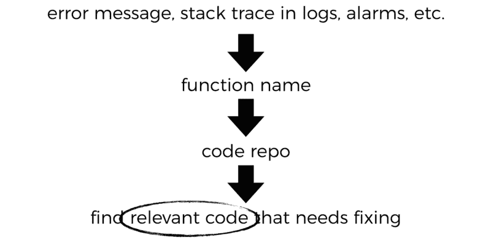

区别在于如何在 repo 中找到与您正在调查的问题相关的代码。

单一的逻辑函数有更多的分支逻辑。因此，要找到与手头问题相关的代码，需要花费更多的精力。

为此，我会稍微降低单色光的功能。当然，我们在这里谈论的是最小的差异，这就是为什么惩罚也是最小的。


### 缩放比例

在微服务的早期，微服务的一个论点是它使扩展更容易。

但事实并非如此！

如果你知道如何扩展一个系统，那么你就可以像扩展一个微服务器一样简单地扩展一个单声道系统。

我这么说是因为有人为拥有数百万活跃用户的游戏开发了 mono litic 后端系统(DAU)。超级细胞(Super cell)是像《T2》《部落冲突》和《T4》这样的顶级游戏的创造者，拥有超过 1 亿的 DAU。这些游戏的后端系统都是独一无二的，Supercell 在扩展这些系统时没有任何问题。


相反，Ama zon 和谷歌等科技巨头告诉我们，微服务使我们更容易在不同的维度上扩展——我们的工程团队。

这种类型的体系结构允许我们在系统中围绕特性和功能创建边界变量。它允许我们的工程团队扩展他们所构建的复杂性，因为他们可以更容易地在其他人已经创建的工作之上进行构建。

以 Google 的[云数据仓库](https://cloud.google.com/datastore/docs/concepts/overview)为例。团队中工程师能够通过在许多服务层的基础上构建[来生产一个智能服务。每一层都提供了下一层可以利用的强大抽象。](http://bit.ly/2CQx3C4)

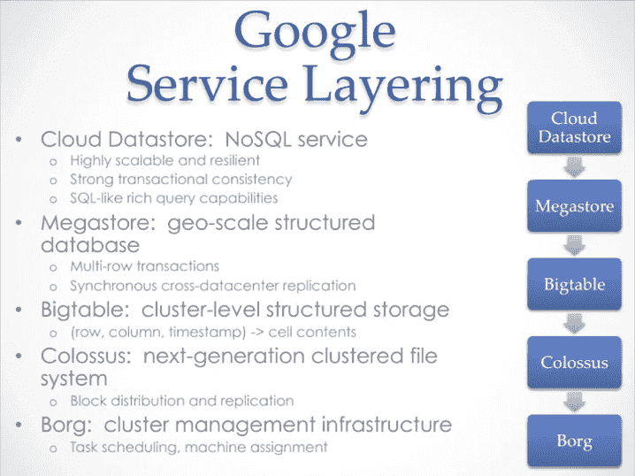

[http://bit.ly/2CQx3C4](http://bit.ly/2CQx3C4)

这些受约束的白羊座给了我们更大的分工。这允许更多的工程师在系统上工作，为他们提供相对隔离的工作区域。这样，它们就不会因为合并冲突、集成问题等等而相互绊倒。

迈克尔·尼加德也写了一篇很好的文章，从另一个角度解释了这种契合:这些束缚的白羊座和隔离帮助我们减少了 sharing men tal model 的开销。

> “如果你有一个高凝聚力的团队，而且人太多，那么团队作为一个整体行动起来就慢了……这是关于减少 T2 的问题。”

> - Michael Nygard

拥有大量单一用途的功能可能是这种任务划分的核心。当你转向单色光功能时，你会失去这种区分。尽管在实践中，你可能不会有这么多的开发人员在同一个项目上工作，以至于你感到痛苦。

将一个功能限制在做一件事情上也有助于限制一个功能变得有多复杂。为了使事情变得更复杂，你可以通过其他方式将这些简单的函数组合在一起，比如 AWS **Step 函数。**

我将把单一的功能记下来，以减少一些劳动分工，并提高功能的复杂性。


### 结论

**根据******对我来说很重要的评论**，拥有多种单一用途的功能是更好的选择。但我不认为这是一个硬性规定。**

**和其他人一样，我也有一套由我的经验形成的偏见和成见，这些偏见和成见并不完全反映你的。我不要求你同意我的观点。尽管我真的希望你能理解找出对你来说什么是重要的过程，这样你就能找到适合你的方法。**

**但是**冷启动**呢？单芯片功能不能帮助您减少冷启动次数吗？**

**简短的回答是否定的，它们不会以任何有意义的方式帮助你冷启动。这也是冷启动优化的错误位置。如果你对这个答案的更长版本感兴趣，那么请阅读我的另一篇文章[这里](https://theburningmonk.com/2018/02/aws-lambda-monolithic-functions-wont-help-you-with-cold-starts/)。**

**最后，具有单一用途功能的较小表面积减少了攻击面。您可以给予每个函数它所需要的确切权限，仅此而已。这是单一用途函数的一个重要但经常被低估的优点。**