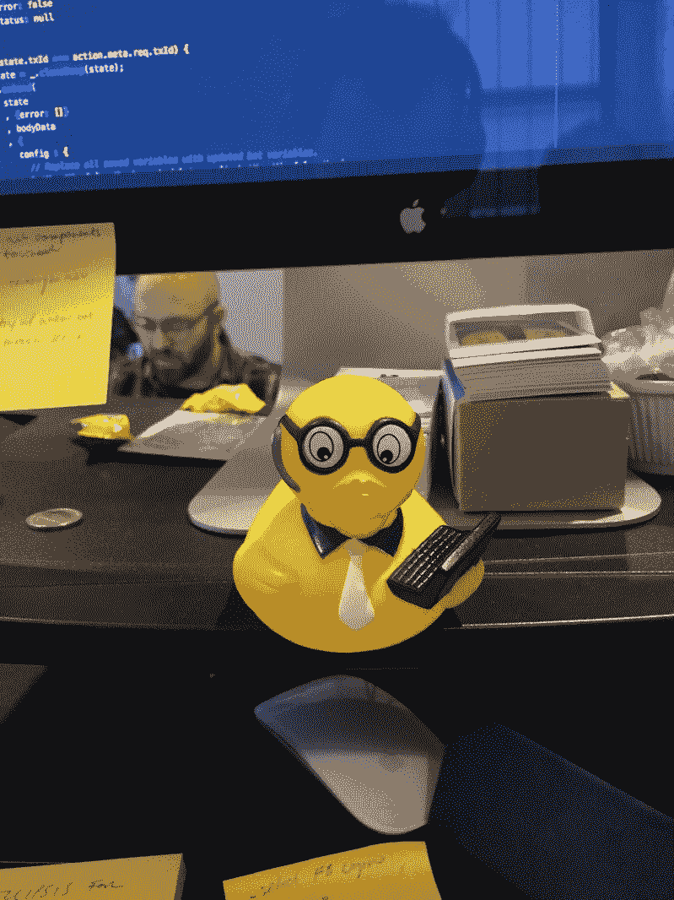
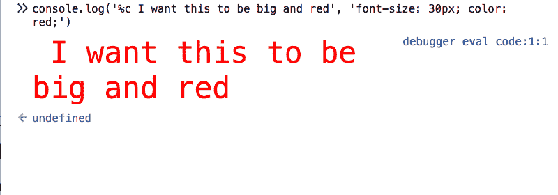

# 这是我从事软件工程工作九个月来学到的东西

> 原文：<https://www.freecodecamp.org/news/9-months-into-a-software-engineering-role-this-is-what-i-learned-823230e4be9a/>

作为一名软件开发人员，我已经在德克斯特工作了大约九个月。我写了一篇关于[最初获得这份工作的博文](https://medium.freecodecamp.org/how-i-got-my-first-dev-job-and-what-im-going-to-do-next-4837b1e9c89c)，以及一篇关于我在公司头几个月制作的[自我定位组件](https://hackernoon.com/self-positioning-react-components-7e5d99e9349f)的技术博文。找到一份工作是我最初的目标，作为一名开发人员，保持这份工作并不断成长是自然而然的下一步。

自从我开始工作以来，我对自己角色的想法有了很大的改变。我认为做一名开发人员就是要尽可能快地写出代码。这是离现实最远的东西。快速写出大量蹩脚的代码并不是在开发中建立业务或职业生涯的可扩展方式。幸运的是，我找到了一个和我有同感的雇主，他的产品是软件。

目标是写出适量的好代码，并很好地交流。你的工资不是用来写代码的，而是用来思考和解决问题的。副产品是机器以代码形式遵循的思想和指令的结晶。我宁愿用一行清晰可读的代码来解决问题，而不是用 10 行难以理解的代码。我宁愿用 5 行可读的注释代码来解决问题，也不愿用一行高度复杂的、包含多个三元运算符的多重嵌套代码。你明白了。

### 问很多问题，并记录下答案

我的老板发给我这个链接，其中包含了我作为一名新工程师感受到的压力和焦虑。说我对提问非常自觉，这是一种轻描淡写。

在向他人寻求帮助之前，我会使用以下清单:

*   这是我以前问过的问题吗？如果是，我在哪里记录了答案？
*   我可以谷歌一下这个吗？
*   这是否由其他内部人员记录在某处？
*   这是怎么回事？我遇到的错误或意外行为的根本原因是什么？
*   我真的了解我要回答的问题吗？花些时间再读一遍这个问题，而不是草率或匆忙地给出答案，这是可以的。

按照这些步骤，我自己解决问题，找到一个有文档记录的解决方案，或者问一个有更好的上下文和细节的问题，这样别人就更容易帮助我。更好的是，如果我问了一个好问题，并且可以通过聊天得到回答，我的队友不需要放下一切来帮助我。

如果我已经解决了问题的 90%,只需要最后 10%的帮助，一个高级开发人员会很乐意帮助我，因为我知道我自己已经尽了最大努力。找别人来解决你的问题并不是在团队中建立信任的好方法。

聪明人喜欢好问题——那就问吧。

### 避免犯同样的错误，一遍又一遍地问同样的问题

这说起来容易，做起来难，不仅仅是编程，任何工作都是如此。大量的新概念和信息正被抛向你，犯错误是不可避免的。意识到这一点。问之前先想想。谷歌的东西。看看文件。他们是你的朋友。如果你看到一个趋势，试着去识别它。积极努力让自己问同一个问题。把它写下来，并把它作为一个目标去解决它。

确保下次你遇到同样的问题时，你知道该怎么做。我们都会犯错，但有自知之明并努力改变是每个人变得更好的方法。

### 总是回顾你的工作

没有人喜欢通过公关告诉你删除你的控制台。日志和调试器或告诉你修复林挺错误。我不会发布这篇文章，除非我多看几遍，也让一个朋友看看。

仔细看看你的代码，问问你自己这些问题:

*   我写了一段复杂的逻辑。应用程序中是否有类似的功能，以一种更可读、更灵活或更通用的方式来实现这一点？
*   如果不是，我会记得为什么我在一周内写了这段代码吗？如果答案是否定的，我可能想修改代码或对其进行注释。审阅 PR 的人应该知道我为什么做出这个决定。
*   在把你的代码交给其他人之前，确保你的代码通过了林挺和测试。
*   我在重复我自己吗？我能把我重复的逻辑封装成一个函数吗？
*   如果这是我正在审查的其他人的代码，我会做什么评论？我想做些什么来让它变得更直接？

用全新的眼光审视你的代码(也许第二天)。是否有特定的逻辑渗入到不应该的组件中？您的组件是否处理应该放入容器的业务逻辑？

此外，良好的自我代码审查为公司节省了时间和金钱。对你来说，找到你自己的错误并自己修复它们比让别人两天后找到它们要便宜得多。

审查代码的最后一件事。触摸并点击你所做的一切。我希望我发送给任何人的代码都超级难破解。如果他们点击一个新的页面，得到一个大错误或白屏死亡，这表明我没有真正审查我的工作。对你编辑的代码进行 Grep，确保你没有破坏共享组件的其他部分。

这可能看起来很傻，但是大型代码库是复杂的，你可能会意识到你破坏了一些东西，直到你这样做。

说真的，你不会想看这篇博文的初稿的:)

### 没有什么是魔法

代码被 LGTM 化通常有一个很好的理由(被批准并在代码库中)。如果你不明白它是如何工作的，花点时间弄明白它。日志资料，break 资料，看看一些使用过的函数和模式的文档。



Image of my work rubber duck that knows more about programming than me

你能告诉你的橡皮鸭它是如何工作的吗？如果你仍然不确定，问一些关于你理解中具体差距的问题。

#### 获得舒适的调试，因为你做了很多

调试就是理解代码功能中的潜在问题，然后解决 bug。你需要了解这个东西是如何工作的，以找出它为什么不能工作的原因。能够利用浏览器的调试工具将会使你的生活和工作变得更加容易。调试器和控制台方法是你的朋友。

我找到了一些有用的资源:

*   [CSS 调试技巧](https://css-tricks.com/debugging-tips-tricks/)
*   [前端大师调试](https://frontendmasters.com/courses/debugging-javascript/)(有报酬但还不错)

*Pro-tip:* 可以使用 CSS 将 console.log 输出风格化。这使得您想要查看的日志更容易识别。

```
console.log('%c I want this to be big and red', 'font-size: 30px; color: red;');
```



console output

#### 跟着数据走

这个问题反复出现，因为不可否认这是我一直犯的错误。这是我越来越擅长的事情，但仍然需要努力。

软件开发的很大一部分涉及将数据处理成某种格式，以便用户可以从中获得可操作的见解，或者自己更新数据。

具有单向数据流和全局状态的应用程序有一条直接的数据路线可循。所有的数据都来自某个地方。一旦你发现它来自哪里，调试就更容易了。

#### 隔离你的问题，然后将它们整合到你正在做的事情中

[Codepen.io](http://codepen.io) 是我的密友，也应该是你的。当我不知道是什么导致了这个问题时，我会制作一个简单的版本。我确保它能工作，然后将它集成到我的开发环境中。在一个精简的环境中，找出可能破坏用户界面的东西会更容易。

#### 思考功能应该如何工作

从 30，000 英尺的高度写下一些东西应该如何工作，然后从技术层面写下这些帮助我了解我应该建造什么，我应该如何建造它，并帮助减轻坠落。如果我不能解释我正在建造的东西是如何工作的(从高层次和低层次)，我就是在伤害自己。如果没有一个计划，在不久的将来，我将会做很多无用功。

此外，我可以回顾我写的东西，或者向别人展示我的想法，这有助于减少沟通失误。

#### 拥抱斗争

在工作中奋斗了 10，000 个小时后，你会更擅长解决问题。无论如何你都要去做，所以享受这个经历会让你的日常生活变得更好。自嘲一下，试着真正解决这个问题。你会成功的，即使你需要一点额外的帮助。

### 接受建设性的批评，并不断重复

你的队友希望你做得更好。资深开发者想让你成为更强的开发者。按照他们的建议去做，即使你一开始不明白他们为什么要你这么做。从来没有一个人什么都知道。聊起来。

### 从容做

匆匆忙忙地完成工作会导致来来回回、许多困惑和额外的挫败感。我的老板宁愿以后看到更好的代码，而不是更早看到糟糕的代码。我是说，我们不都是吗？

### 工作之外继续学习

尽管我在工作中学到了很多，但我仍然想继续学习新的东西，而不仅仅是在我们的代码库上工作。那可能是学习 Python、构建一个机器人、完成一个视频系列或者从事一个个人项目。我用 Zenhub + Github 做了一个公告板来记录我在哪里，以及这个月我承诺了什么。保持一个月的总目标迫使我继续学习，建设，是的，用我自己的时间写博客。