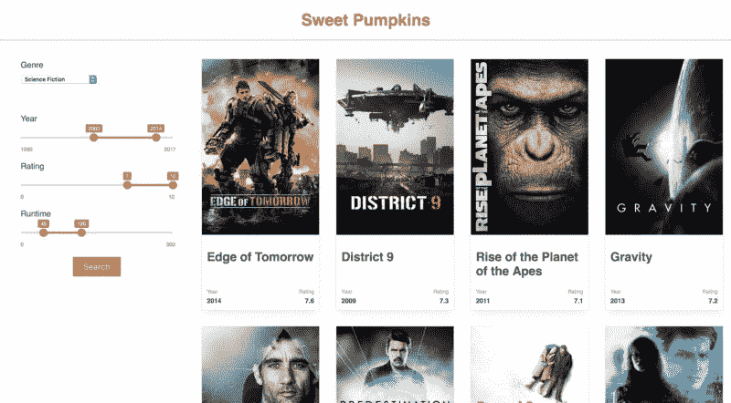

# 带有交互式示例的样式组件快速指南

> 原文：<https://www.freecodecamp.org/news/a-quick-guide-to-styled-components-with-interactive-examples-92cb203b64d/>

去纽约

# 带有交互式示例的样式组件快速指南


“这很有趣……”当我第一次读到样式化组件时，我想。然后我又回到了我屡试不爽的 React 组件。

但是随后，styled-components 的联合创始人马克斯·斯托伊伯(Max Smith)向我们展示了他在[React in Flip Flops code boot camp](https://www.codecamps.com/riff1/)的新图书馆。“那很有趣”变成了“那太令人兴奋了！”

我几乎无法抑制我的激动。我终于理解了样式化组件背后的概念。它为如何设计组件样式开辟了许多新的可能性。它简化了构建 web 应用程序的方式。它还加强了 React 应用程序风格的一致性。

### 这一切都始于带标签的模板文字

你可能会认为我有点老派，但我相信如果你想真正理解任何想法，你需要把你的头脑包裹在基本概念周围。我们可以直接进入样式组件。但首先，让我们在 Max 和 [Glen 开始项目并实际构建风格化组件之前，找出是什么激发了他们的好奇心。](https://twitter.com/glenmaddern)

ES6 的模板文字简化了混合变量和文本的方式。如果取两个变量:`name`和`mood`，分别赋值为“Alice”和“happy”，那么模板文字:

```
const sentence = `${name} is ${mood}.`;
```

会产生一句话:“爱丽丝幸福。”

带标记的模板文字将语法向前推进了一步。

标签是 JavaScript 函数。但是与常规函数相比，有两个本质的区别:

*   标记函数是使用反勾符号而不是括号来调用的。在下面的例子中，我们通过将参数放在反斜杠中来调用`greetingTag`函数:

```
greetingTag`${name} is ${mood}.`;
```

*   JavaScript 将模板文字——反斜线之间的所有内容——视为函数参数。第一步，JavaScript 将模板文字转换成字符串数组。字符串后面是提取的变量。如果我们以上面的例子为例，传递给`greetingTag`函数的转换后的参数将如下所示:

```
["", " is ", "."], name, mood
```

第一个参数是一个数组，包含了我们放在`name`和`mood`变量之前、之间和之后的所有字符串。在我们的例子中，第一个字符串是空的，因为在`name`之前没有任何东西。接下来的两个参数，`name`和`mood`，作为变量从模板文本中提取。

现在，`greetingTag`函数可以将任何逻辑应用于文本数组和`name`和`mood`变量，并返回期望的结果。

让我们创建一个标记函数`greetingTag`，它将接受三个参数:一个`texts`数组、`name,`和`mood`变量。这里是它将使用的逻辑:如果`mood`的值是“快乐”，它将返回一个常规的问候句子。在所有其他情况下，它将返回问候语的振奋版本:

```
const greetingTag = (texts, name, mood) => {   if (mood === 'happy') {     return `Hi ${name}!`;   } else {     return `Hi ${name}, you are awesome!`;   } } const greeting = greetingTag`${name} is ${mood}.`;
```

现在，如果我们将“爱丽丝”赋给`name`并将“快乐”赋给`mood`,`greetingTag`函数将返回:“嗨，爱丽丝！”。如果我们将`mood`的值改为除了“快乐”之外的任何词，比如“兴奋”或“猫”，那么`greetingTag`将返回:“嗨，爱丽丝，你真棒！”。

但是如何使用这些知识来设计 React 组件的样式呢？

### 样式组件

当 Max 和 Glenn 在寻找一种更好、更一致的方式来设计 React 组件时，这个问题困扰了他们。啊哈！他们意识到带标签的模板文字不仅接受变量，也接受函数的时候到了。如下例所示:

```
const greeting = greetingTag`${ name => `Hi ${name}!` }`;
```

这里，`greetingTag`接收一个带有函数的模板文字。一旦函数被`greetingTag`执行，`greetingTag`可以对返回值应用进一步的逻辑并返回一个结果。

样式组件也是标签函数。但是它们不接受问候模式，而是接受包含 CSS 样式的模板文字。它们返回 React 组件，而不是问候语句。

让我告诉你它是如何工作的。

**边注:** 下面的代码示例是交互式的。你可以摆弄它们，添加样式和改变赋值。您可以通过点击不同文件的标签来检查它们。或者按顶部的橙色、蓝橙色或蓝色按钮在不同视图之间切换。

如果您想在您的应用程序中使用样式化的组件，您必须首先安装`styled-components`:

```
npm install --save styled-components
```

下面，我创建了一个样式化的组件`Title`:

`styled.h1`是一个标签函数。它返回一个与下面相同的 React 组件:

```
import React from 'react'; const Title = ({children}) => <h1>{children}</h1>
```

这个解决方案的美妙之处在于，样式化组件为您完成了繁重的工作——您的组件`Title`将拥有`royalblue`的`color`。

我知道你在想什么:如果我们必须以这种方式编写每个组件的样式，这与编写 CSS 类没有太大区别。谢天谢地，样式化的组件要聪明得多！

想象一下，你想让你的标题大部分时间都是黑色的，只是偶尔用不同的颜色突出显示。有了样式化的组件，我们可以创建一个颜色感知的`Title`，默认情况下它是`black`，当我们传递给它一个`primary`属性时，它就会变成`royalblue`:

您可以将道具传递给`Title`，就像传递给任何其他 React 组件一样。这里，第二个`Title`收到了`primary`道具。我们可以访问样式化组件声明中的属性。这开启了一个全新的可能性世界。

上面，我定义了样式化的组件`Title.`，因为`props`可以在样式化的组件声明中访问，我们可以决定组件的颜色。该函数使用三元运算符，当`primary`属性为`true`时返回`royalblue`，否则返回`black`。

您不必像下面这样显式地编写它:

```
<Title primary={true}>Hi Bob, you are awesome!&lt;/Title>
```

传递没有赋值的`primary`道具就像传递
`primary={true}`。

既然大门已经敞开，那就让我们的`Title`更加通用吧。有时你可能需要你的`Title`使用较小的字体，有时使用较大的字体。有时你可能希望它有一个正常的粗细，有时你可能希望它突出，并给它一个大胆的字体粗细。有时你可能想将`Title`大写。

样式组件允许您创建单个通用组件。然后，您可以在任何地方使用它，而不再考虑样式:

在上面的例子中，`font-size`被赋予了明确的值:`48px`或`32px`。当代码库增长时，这样的代码很难维护。

### 主题

当您创建一组样式化组件供以后使用时，您希望在整个应用程序中实施一致的样式。设定造型规则总是值得的。优选地，在单独的文件中。稍后，当您必须更改样式时，您可以只在一个地方更改样式，而不是重新访问所有组件。

样式化的组件给了你一个工具——主题。

`theme`是一个 JavaScript 对象，您可以在其中定义样式参数:

```
const theme = {   colors: {     primary: "royalblue",     secondary: "teal",     text: "black"   },   fontSize: {     xl: "2.4rem",     lg: "1.8rem",     md: "1.3rem",     nm: "1rem",     sm: "0.75rem"   } }
```

上面的`theme`定义了`colors`和`fontSize`属性。您将能够在应用程序的所有样式组件中访问它们。

但是首先，您需要让应用程序知道`theme`。您必须将它作为道具传递给`ThemeProvider`——一个由 styled components 提供的包装组件:

```
import { ThemeProvider } from "styled-components"; import theme from "./theme.js";
```

```
const App = () => (   <ThemeProvider theme={theme}>     <div>       <Title>Hi, Alice!</Title>     &lt;/div>   </ThemeProvider> )
```

让我们以前面的例子来学习如何使用`theme`以及如何在样式化的组件中访问它的属性。

在`Title`中，你可以通过`props.theme`访问`theme`对象。例如，要选择`Title`的颜色，首先要检查给定的属性是否已经传递给了`Title` ( `primary`或`secondary`)。然后返回在`theme`中声明的相应的`color`值。如果没有传递，则返回标准的`text`颜色。

`Title`现在也可以决定它的字体大小。它首先检查是否已经传递了一个`xl`、`lg`、`md`或`sm`属性，并基于此给`font-size`属性分配适当的值。如果没有传递任何属性，它将分配在`theme`中定义的`fontSize.nm`的值。

我们刚刚创建了一个灵活的`Title`组件。现在，您可以使用它，而不必担心 CSS。您可以通过传递一组特定的`props`来专门决定它的外观。

### 扩展样式组件

仅仅创建一个`Title`组件是不够的。例如，在一个博客页面上，你需要一个用于文章标题的`h1`标签和一个用于副标题的`h2`标签。你也需要段落来显示文本。

样式化的组件很容易扩展。您可以创建一个带有`h2`标签的新的`Subtitle`组件，并从`Title.`中复制和粘贴所有样式规则，或者您可以用`withComponent`助手方法扩展`Title`组件。`Subtitle`将拥有`Title`的所有属性，但将使用`h2`标签:

```
const Subtitle = Title.withComponent("h2");
```

您可以扩展`Title`来创建带有`p`标签的`Text`组件，同时将其`color`固定为`theme.text`，并将`line-height`设置为`1.65`？在这里，风格化组件也大放异彩:

```
const Paragraph = Title.withComponent("p");const Text = Paragraph.extend`   color: ${props => props.theme.colors.text};   line-height: 1.65;
```

首先，我们创建了一个中间的`Paragraph`组件，它将具有`Title.`的所有样式规则，然而，我们将使用`p`标签，然后是扩展`Paragraph`并设置其`color`和`line-height`属性的`Text`组件。下面您可以查看`Title`、`Subtitle`和`Text`组件的代码:

样式组件允许你用 JavaScript 写一个普通的 CSS。此外，您可以嵌套 CSS 样式和伪类。您可以添加媒体查询和属性。最后使用`injectGlobal`辅助方法，您可以注入全局样式规则和导入字体。

### 伪类

为了学习如何使用伪类，让我们创建一个`Button`组件，当鼠标悬停在它上面时，它会改变颜色。

在上面，我嵌套了`&:hover`伪类，以便每当鼠标悬停在按钮上时更改`color`。您可以以同样的方式使用 CSS 中的任何伪类。

### 用样式化组件注入全局样式

您可以使用`injectGlobal`助手将全局样式添加到您的应用程序中，而不是导入全局样式文件。首先，您必须导入`injectGlobal`助手:

```
import styled, { ThemeProvider, injectGlobal } from "styled-components";
```

在下面的例子中，我使用`injectGlobal`来:

*   导入字体，并将所有元素的`font-family`设置为“Montserrat”。
*   重置边距、填充和边框。
*   使用小于`screen.medium`和`screen.mobile.`的屏幕尺寸的媒体查询来改变根元素`font-size`，二者都在`theme.`中定义

样式化的组件主题增强了一致性。要了解更多信息，请浏览我见过的最好的文档之一: [Styled Components Docs](https://www.styled-components.com/docs) 。

由于 Max 和 Glen 的好奇心，styled components 为您提供了一套非常棒的工具来设计 React 应用程序。风格化组件生态系统正在蓬勃发展。访问[生态系统](https://www.styled-components.com/ecosystem)页面，探索现成的组件和网格系统。检查用样式化组件构建的许多其他工具。

### 结论

在本教程中，您已经了解了带标签的模板文本是如何工作的。您还学习了如何使用样式化组件来构建通用 React 组件。现在，您已经了解了如何使用主题来实现下一个应用程序的一致风格。

样式化组件是一种新的 React 应用程序样式化方法。开箱即用、风格独特的组件:

*   让您构建可重用的通用组件
*   加强样式的一致性
*   允许您嵌套样式
*   必要时添加供应商前缀
*   简直太棒了！

如果你喜欢这篇文章？即使是 5 次 **0 次**——我真的会很感激，这对我有很大的不同。



我最近为初学者发布了一个免费的 React 教程。如果您想学习如何从头开始构建 web 应用程序，这是一个很好的起点。你将学习如何构建一个应用程序来帮助你找到最好的电影来观看？南瓜