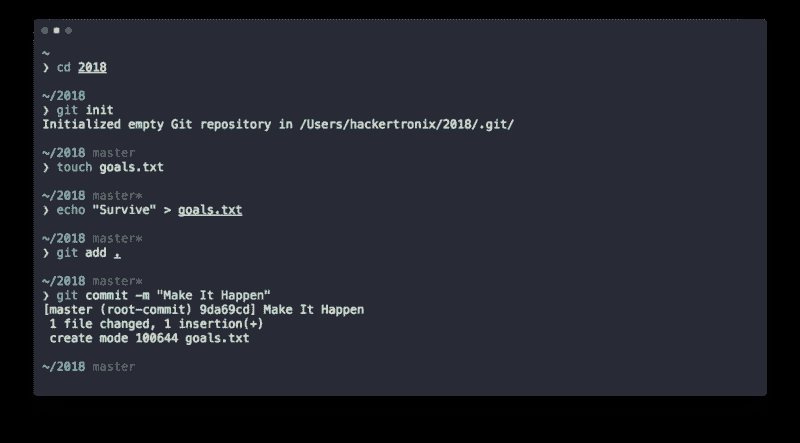
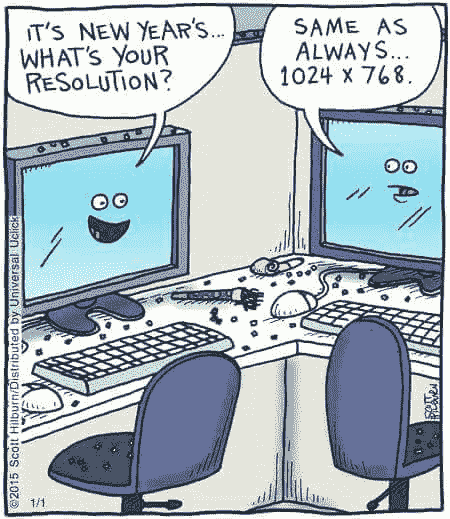
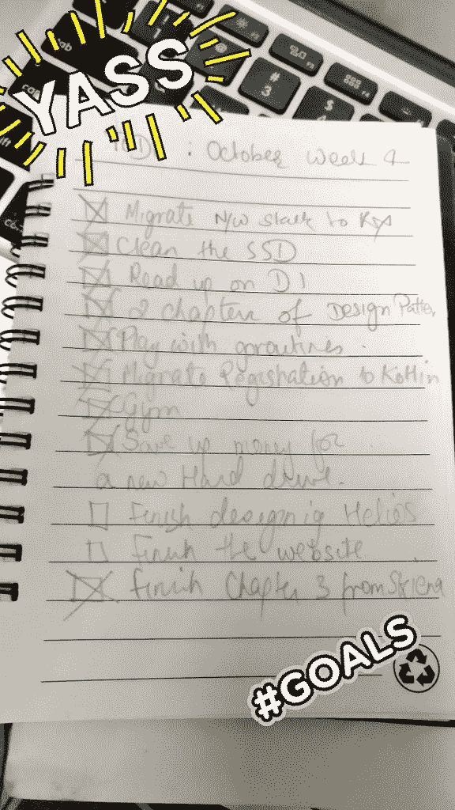
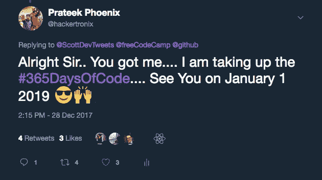
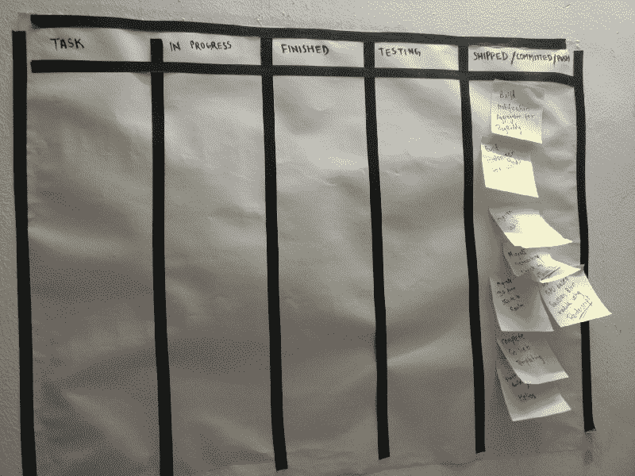

# 作为一名开发人员，以下是你如何实现 100%年度目标的方法

> 原文：<https://www.freecodecamp.org/news/heres-how-you-as-a-developer-can-achieve-100-of-your-yearly-goals-838d39f95321/>

by Prateek Phoenix

# 作为一名开发人员，以下是你如何实现 100%年度目标的方法

新的一年总是伴随着一些重复发生的事件。有一个新年前夜，人们尽情狂欢，大醉一场。我们都知道我们已经在社交媒体上完成了几个**#YOLO** 和***# liveliketheresnortomorrow*****。？**

**接下来就是新年了，这一天我们要下定决心，无论如何都要跨过终点线。**

**几天或几周后，你会面对现实，放弃那些决心，坐在那里感觉自己像垃圾。**

**这不是什么新鲜事，我自己也曾“去过那里，做过那件事”？**

**事实是，作为一个理论概念，决心似乎是一件很容易接受的事情。从第一天开始，你列出一张你想做的事情的清单，然后一个接一个地划掉它。但是当谈到执行我们的决议，这是一个完全不同的故事。我们大多数人，包括我自己，都认为自己会失败。我们设定的目标是十次有九次是不现实的。**

**一旦节奏变得单调，就赶走了追求的兴趣。**

**自从我开始下定决心，这就是我一直在做的事情。我相信每个人都会有这样的经历——以一个目标开始新的一年，然后为之奋斗几个星期，然后无聊透顶，最后我们放弃了。**

**进入 2017 年的几个星期后，通常的模式开始重复。我打算放弃我的目标，但还不到二月。在十多年未能实现我的目标后(惊喜惊喜)，去年我决定做点改变。**

**以下是我做的一系列事情，以确保我没有让自己背负不切实际的目标。我设法从这张清单上划掉了一大堆事情来结束这一年。**

**本指南不是针对特定人群的，无论你是开发人员、设计师还是文科生都没关系。这是一个大致的清单，会帮助你在年底成为一个更全面的人。**

### **第一步:停止下决心**

**接受吧，它们从来都不起作用(至少对我们大多数人来说)。当我们连续 365 天都没能坚持执行它们时，我们会感觉很糟糕。**

**相反，这里有一个更好、更“可行”的方法。与其为全年设立一个目标，不如为一年设立多个里程碑。它们可以是每周、每月或每季度的目标。**

****

**拥有更小的、孤立的和更集中的目标比试图把一个单一的目标推进到每个月要好得多。**

**我们的大脑以奇怪的方式工作。对我们来说，每个月底 10 个复选框看起来比年底的一两个更有价值。**

**每当你完成一个小目标时，奖励自己。不要因为不能完成每一项任务而感到压力——错过几项也没关系。但是这种方法总能确保你实现的不仅仅是跳过**

**还要确保你带了一个小笔记本，上面写着你的目标。不，**不要**为此使用应用程序。携带一本真正的笔记本和一支钢笔/铅笔。每周/每天/每月起草你的目标，完成后检查一下。你不会在一个应用程序上获得同样的满足感。**

**

Don’t stress about the things you couldn’t do, reward yourself for the ones you did** 

**每个复选框都很重要。让甜蜜的多巴胺流动。**

### **第二步:公开承诺某事**

**这个对我来说也是新的。我注意到公开承诺会给你带来很大的压力，促使你去实现。成为一名优秀的开发人员总是意味着你了解并跟上社区中的新事物。没有比获得第一手经验更好的方法了。**

**每天花几个小时写代码有助于保持你的技能。在我去年做这件事的一小段时间里，我发现我想出了更好的方法来写我以前已经写过的东西。从一个老项目中剔除多余的内容会给人一种非常满意的感觉。**

**我已经承诺参加 3 轮 **#100DaysOfCode** 挑战，因为我非常喜欢它。它还能帮助我获得肌肉记忆和尽快制作新事物的能力。**

**

Thanks to Scott Spence and the Isometric Contribution plugin for Chrome for pushing me to take this challenge** 

**公开承诺这件事(现在已经两次了)肯定会让我不考虑辞职。如果你能找到一个**代码伙伴**来做类似的事情，这真的很有帮助。这样，你们两个都可以竞争，同时可以确保在你开始懈怠的情况下互相推动。**

### **第三步:一直培养(一种习惯)**

**学习某样东西并擅长它的普遍真理是重复做它。我在很多场合都经历过这种情况。这就是为什么我建议任何时候都要有一个个人项目。它不仅可以作为尝试新事物的平台，还可以帮助您思考如何改进现有的解决方案。一旦养成了一直建东西的习惯，很快就会变成一种瘾。我曾经构建了一些东西，废弃了它，用一个更好的新堆栈构建了它，又废弃了它。**

**所以，想出一个你真正感到兴奋的产品/想法。每天贡献 2%,重复 365 次。如果你正在建造的东西让你感到兴奋，那就不会觉得是负担。**

****旁注:** 总是尝试使用 Scrum 或类似的东西来可视化你的进展。你可以用 Trello 或者只是一张旧的海报纸和一些贴有便利贴的胶带。记住**“这都是因为多巴胺。”****

**

Cheap DIY version of a scrum board, costs less than $0.4** 

### **第四步:读一本书(然后再读 10 本！)**

**人类的大脑，无论多么神奇，其能力都是有限的。每个人都是独一无二的，每个人对待生活的方式都不一样。对生活和问题有不同看法的唯一方法是阅读别人是如何解决这些问题的。书籍真的是唯一不会过期的东西，让你真正扩展你的想象力和能力。这就像进入别人的大脑，吸收所有的知识。**

**同样，确保你拿到的是纸质版，而不是 kindle 版本。翻过最后一页有一种与生俱来的满足感。(对不起树木？)**

**今年我读完了两本很棒的书，我后悔没有多看。(今年我一定会改变的事情)**

**以下是一些目前正在邮寄的书籍，以及我在 2017 年设法读完的两本书:**

*   **[**日常事物的设计:唐·诺曼**](https://www.amazon.com/Design-Everyday-Things-Revised-Expanded/dp/0465050654/ref=pd_lpo_sbs_14_t_0?_encoding=UTF8&psc=1&refRID=KQJJ0SJX62NZ7TE07W94) *(读)***
*   **[**横向思维:爱德华·德·波诺**](https://www.amazon.com/Lateral-Thinking-Textbook-Creativity-2009-11-12/dp/B017MYDSYG/ref=sr_1_4?s=books&ie=UTF8&qid=1514799382&sr=1-4&keywords=lateral+thinking+edward+de+bono) *(阅读)***
*   **[**上钩:近红外**](https://www.amazon.com/Hooked-How-Build-Habit-Forming-Products/dp/1591847788/ref=sr_1_1?s=books&ie=UTF8&qid=1514799525&sr=1-1&keywords=hooked)**
*   **[**冲刺:杰克·纳普&约翰·泽拉特斯基**](https://www.amazon.com/Sprint-Solve-Problems-Test-Ideas/dp/150112174X/ref=sr_1_1?s=books&ie=UTF8&qid=1514799601&sr=1-1&keywords=sprint)**
*   **[**智人:尤瓦尔·诺亚·哈拉里**](https://www.amazon.com/Sapiens-Humankind-Yuval-Noah-Harari-ebook/dp/B00ICN066A/ref=sr_1_1?s=digital-text&ie=UTF8&qid=1514799741&sr=1-1&keywords=sapien)**
*   **[**猴神的失落之城:道格拉斯·普雷斯顿**](https://www.amazon.com/gp/product/B01G1K1RTA/ref=s9_acsd_ri_bw_c_x_4_w?pf_rd_m=ATVPDKIKX0DER&pf_rd_s=merchandised-search-8&pf_rd_r=F6K6717ZY3JJHRSHNH32&pf_rd_r=F6K6717ZY3JJHRSHNH32&pf_rd_t=101&pf_rd_p=b8c0a303-a08e-4b0b-bd49-040811fd7080&pf_rd_p=b8c0a303-a08e-4b0b-bd49-040811fd7080&pf_rd_i=283155)**

**如果你读过一本书，你认为这本书改变了你的观点，不管是小说还是非小说，给我留言，我一定会去买一本。**

### **第五步:采用可持续的生活方式**

**随着互联网在我们的口袋里，像亚马逊这样的服务只需按一下按钮就可以获得，强迫性囤积现在比以往任何时候都是一个问题。我们买了一些我们很可能不需要的东西，然后在很短的时间内我们就后悔了。试着把它切下来。**

**相信我，当我说满足于简单的必需品是一种解放。我不是建议你过僧侣的生活。**

> **与其进行无意义的购买，不如进行明智的投资。**

**不要吝啬对自己的投资。你想要市场上最新最棒的电脑吗？你有资金吗？它会改善你的工作流程还是减少你的时间？转换到新型号是否有重大改进？**

**如果你对所有这些问题的回答都是肯定的，那就去购买吧。投资于你自己和你的工具从来都不是一个坏的选择，除非你只是随机地购买任何东西。你会发现，如果你投资于自己或你的装备，而不是进行无谓的购买，它会在很短的时间内开始收回成本。**

### **第六步:回报世界一点点**

**有一句很好的谚语是这样说的:“离开野营地的时候，要比你发现的时候更好。”**

**在世界上正在发生的所有令人不安的事情中，作为一个个体，你拥有引发积极变化的力量，并为某人扭转局面。**

**如果你正在阅读这篇文章，这意味着你有互联网连接和智能手机/电脑。你过着体面的生活。一个月给几块钱不会真的影响你的生活。现在世界上有人会为了一美元杀人。**

**我们生活在一个不需要太多就能积极影响他人生活的时代。选择一个你关心或能与之相关的慈善机构或事业，每个月捐出几美元。大部分都没有最低捐款额。所以 1 美元还是 10 美元真的不重要。尝试一次——它真的有助于安抚良心。**

### **第七步:开始阅读区块链**

**区块链是一项将在几年内改变我们社会一切的技术。不管你是工程师、医生还是老师。**

**这将是商业领域、教育领域、医药领域以及几乎所有领域的重要组成部分。**

**考虑到这项技术正在被广泛采用，了解它的工作原理及其应用将真正符合一个人的最佳利益。**

**我想马上澄清的一个误解是，区块链不仅限于加密货币。加密货币只是区块链技术的一个热门应用。加密生态系统的现状并不像最初那样。这是一种解决问题的方法，但它却变成了一种快速赚钱或输钱的方式。**

**这种炒作很快就会消失，为真正的创新开始让路。**

**投资加密货币完全是一个不同的话题，做不做完全由你决定。但我强烈建议大家学习区块链，并观看空间。**

### **第八步:质疑一切**

**让我们面对现实吧。我不完美，你也不完美。但你可能有我几乎不了解的领域的专业知识。我们能够作为一个社会集体进步的唯一方式，就是当我们把自我扔到窗外，问一些我们不理解的问题。最坏会发生什么？有人会说这是个愚蠢的问题？大不了！**

**请永远记住这一点，这是我虔诚遵循的——**

> **看上去愚蠢 5 分钟总比一辈子无知好**

### **危险地生活**

**不，先别把橡皮筋拿出来！**

**我说的是挑战自己，把自己推出舒适区。尝试一切，只是为了好玩！**

**在过去的一年里，我尝试和做了一些我甚至不确定我这辈子会不会做的事情。有了这些经验，我能够学到技能或技术，现在我已经把它们应用到我每天的工作中。**

**记住，你不需要在你尝试的每件事上都表现出色。失败是好的，它指出了你技能中有待填补的漏洞。拥抱它而不是害怕它。最终你会到达一个点，事情开始一步到位。老实说，你做到了却没有失败，这会让你感觉很奇怪。**

### **第十步:不要满足于“足够好”**

**这听起来可能很俗气，而且有充分的理由。一些最成功的公司已经建立起来，因为创办公司的人不满足于最低标准或“足够好”。**

**养成关心你所从事的任何工作中的小事的习惯。让它比平常多花一点时间，但是尽你最大的努力。**

**小事情很重要，它们将伟大的产品与“仅仅是好的”产品区分开来。**

**不要害怕成为团队中的新人，也不要害怕接到在细节上投入更多时间的电话。这表明你对这个项目充满热情。如果你足够有说服力，几乎所有时候人们都会同意你的观点。**

### **第十一步:真实地生活**

**最后，确保你活着。不为别人，只为自己。我以痛苦艰难的方式学会了这一点。永远记住这一点，**

> **你是，也将永远是，唯一和你一起生活最久的人。**

**你必须意识到你对自己最重要，这一点绝对重要。关心你的梦想，你的抱负不是别人的工作。所以不妨停止试图打动或取悦他人。你手上只有几十年的时间。**

**是我们的怪癖让我们独一无二。如果你发现你必须改变自己才能与人相处，那就避开他们！这个星球上有 70 亿人。找到一个喜欢你的怪癖的人并没有你想象的那么难。永远留意他们，当你发现他们时，永远不要放手！**

**我上面提到的步骤或多或少都是我们大多数人想要实现的事情。这是我如何安排一年的总体规划。如果它对像我这样的人有效，我希望它对你们大多数人也有效。**

**再次祝大家 2018 年快乐。？？**

**“愿原力与你同在？?"**

*****(我知道这句话出自《星球大战》，斯波克在《星际迷航》中……谢谢你让我扰乱你的思绪*？)****

*****鳍！*****