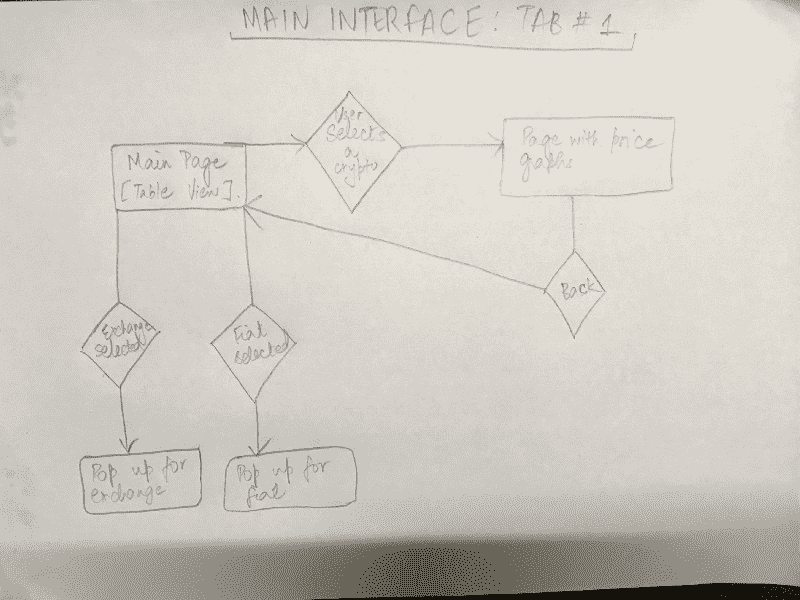
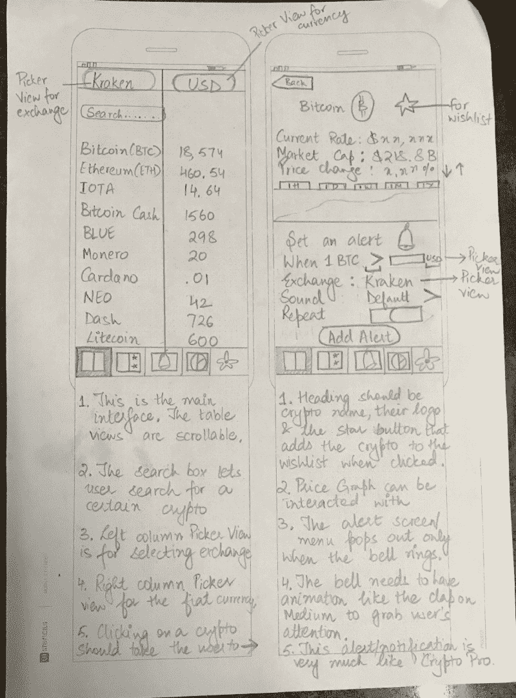
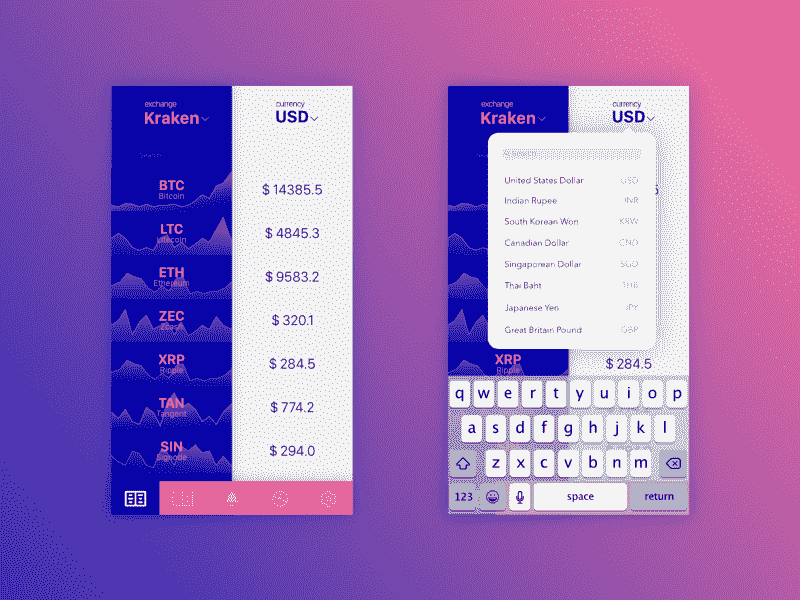
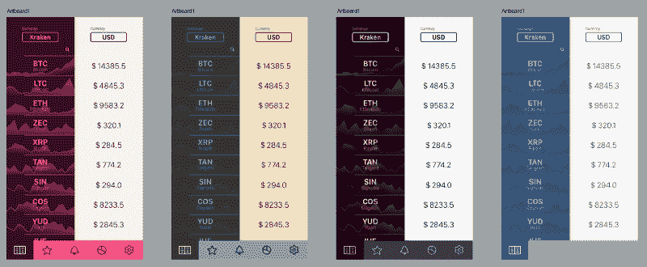
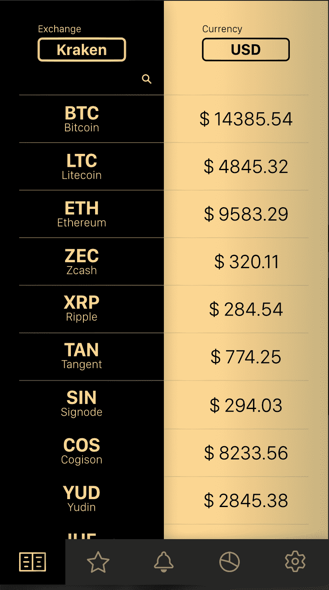
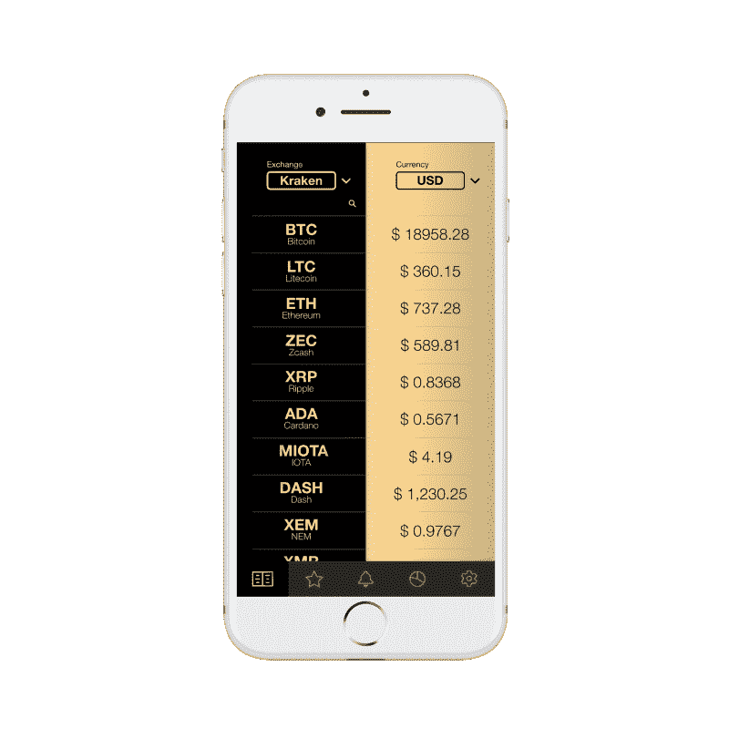

# 从头开始设计漂亮的移动应用

> 原文：<https://www.freecodecamp.org/news/designing-beautiful-mobile-apps-from-scratch-1a3441ebd604/>

作者 Harshita Arora

# 从头开始设计漂亮的移动应用

我 13 岁开始学习平面设计。我从网上课程学会了设计网站，以前整天玩 Photoshop 和 Affinity Designer。那次经历教会了我如何像设计师一样思考。

我设计和开发应用程序已经快一年了。我参加了麻省理工学院的一个项目，在那里我和一个团队一起开发了 [Universeat](http://universeatyapp.com/) y。两个月前，我开始开发一个新的应用程序，[加密价格跟踪器](https://itunes.apple.com/us/app/crypto-price-tracker/id1333696099?ls=1&mt=8)，我最近在 1 月 28 日发布了它。

在这篇文章中，我将分享我遵循的一步一步的设计过程，以及我开发的应用程序的例子。这对任何想学习或提高数字设计技能的人都有帮助。设计不仅仅是知道如何使用设计软件，这篇文章也不会教你如何使用它。网上有数百个高质量的教程可以学习。设计也是关于从里到外了解你的产品，它的特性和功能，并且在设计的时候把最终用户放在心上。这就是这篇文章的目的。

**设计过程**:

1.  为每个屏幕创建一个用户流程图。
2.  创建/绘制线框。
3.  选择设计图案和调色板。
4.  创建模型。
5.  创建一个动画应用原型，让人们测试它并提供反馈。
6.  给实体模型最后的润色，让最终的屏幕都准备好开始编码。

开始吧！

### **用户流程图**

第一步是找出你想要的应用程序的特性。一旦你有了想法，设计一个用户流程图。用户流程图是用户通过你的应用程序/网站的一个非常高层次的表现。

通常，用户流程图由 3 种形状组成。

*   矩形用来代表屏幕。
*   菱形用于表示决策(例如，点击登录按钮、向左滑动、放大)。
*   箭头将屏幕和决策连接在一起。

用户流程图非常有用，因为它们给出了应用程序如何运行的良好逻辑思路。

这是我开始设计应用程序时画的用户流程图。

User-flow diagram for the Main Interface.

### **线框**

一旦你完成了每个屏幕的用户流程图并设计了用户旅程，你将开始绘制所有屏幕的线框。线框本质上是应用程序外观的低保真度表示。本质上是图像、标签、按钮和其他东西的草图或轮廓，以及它们的布局和位置。你的应用程序将如何工作的草图。

我使用来自 [UI 模板](https://www.uistencils.com/blogs/news/ui-stencils-drafting-templates)的打印模板来绘制线框。它节省了时间，并提供了一个很好的画布来画画和做笔记。

这里有一个线框的例子。

Wireframe for the Main Interface.

画完线框后，你可以使用一个名为 [Pop](https://itunes.apple.com/us/app/pop-prototyping-on-paper/id555647796?mt=8) 的应用程序，使用该应用程序拍摄你所有的图纸，并通过按钮连接所有屏幕来制作原型。

### **设计图案和调色板**

这是我最喜欢的部分。这就像逛街一样。许多设计图案和调色板可供选择。我开始挑选我喜欢的，然后用它们做实验。

寻找设计模式的最佳平台是[移动模式](http://mobile-patterns.com/)和 [Pttrns](https://pttrns.com/) 。要找到好的调色板，去[找颜色](http://colorhunt.co/)。

### **实体模型**

这是你最终使用设计软件的时候。设计意义上的模型是你设计的高保真表现。这几乎就像你在未来进入这个应用程序，并从中截取了一些截图。它应该看起来逼真，非常像真实的东西。

有设计软件和工具来创建模型。我用亲和设计师。iOS 设计最常用的工具是[草图](https://sketchapp.com/)。

这是我的应用程序的一些早期设计的例子。

Bringing the pencil drawing to pixels!

我尝试了更多不同的调色板。

我与我的朋友分享了最初的模型，以获得他们的反馈。很多人似乎喜欢金色的渐变和黑色的设计。

乐于接受反馈并尝试新的建议！当你与用户交谈时，你会发现惊人的想法来自他们，而不是当你疯狂地浏览 Dribbble 或 Behance 时。

因此，我重新设计了模型，并删除了背景图，因为生成它们在技术上是一个耗时的过程，而且它们降低了可读性。这是重新设计的实体模型的样子。

Gold gradient with black surprisingly looks good!

我对配色方案、标签栏上的图标和整体布局非常满意。我继续按照同样的设计方针设计了其余的屏幕。这是一个漫长而有趣的过程！

一旦我的所有屏幕都准备好了，我就在 Adobe XD 中组装了一个原型，并请几个朋友进行实验并给出反馈。

经过最后的润色，这就是我最终设计的样子。

The Main Interface!

所有屏幕完成后，我将它们导入 Xcode，开始编写应用程序。

就是这样！希望这篇帖子能帮助你入门 app 设计，或者帮助你成为更好的设计师。如果你喜欢我的应用，你可以在这里下载它。

我用一句我最喜欢的关于设计的名言来结束这篇文章。

> “设计不仅仅是它的外观和感觉。设计就是它是如何工作的