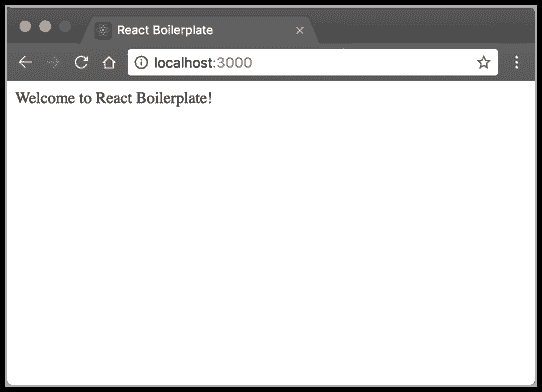
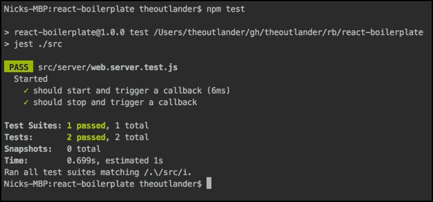
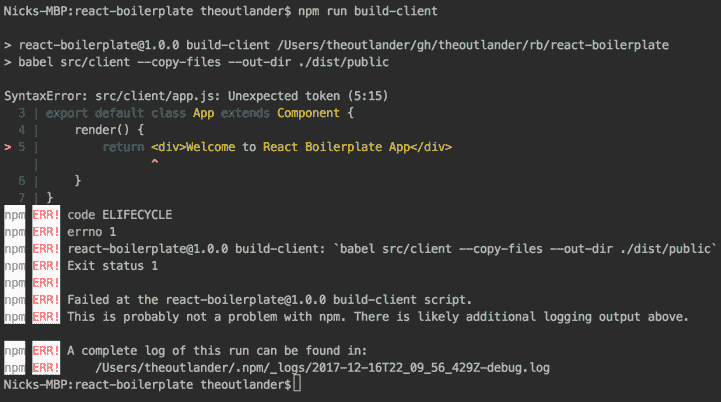
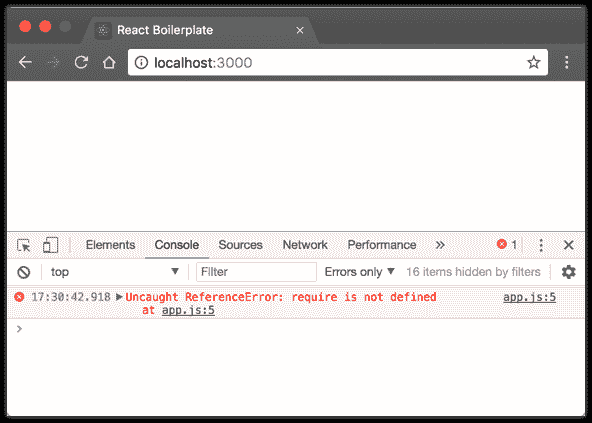
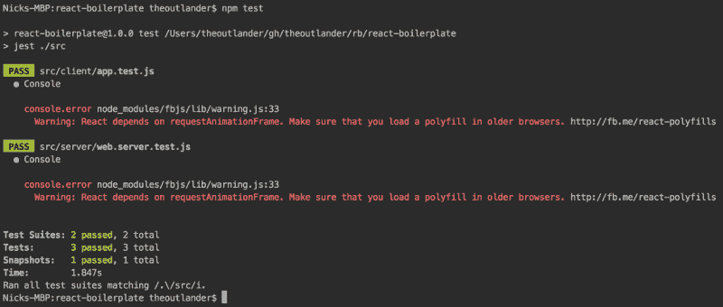
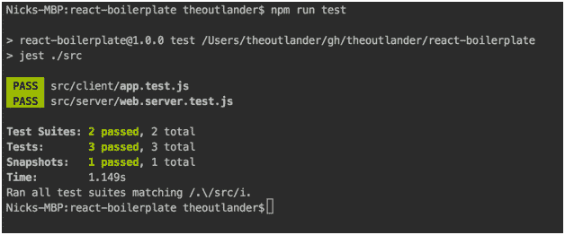
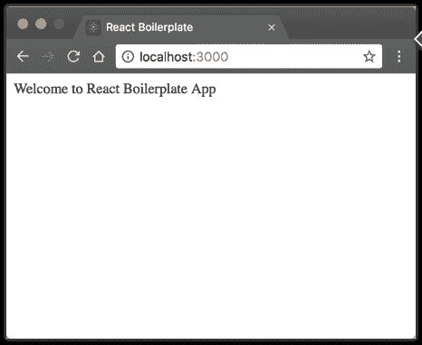
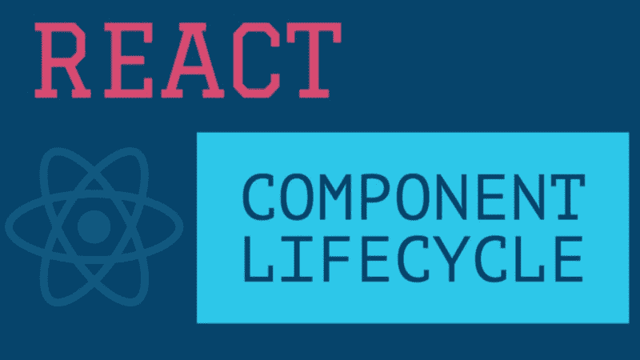

# 如何构建自己的 React 样板文件

> 原文：<https://www.freecodecamp.org/news/how-to-build-your-own-react-boilerplate-2f8cbbeb9b3f/>

尼克·卡尼克

# 如何构建自己的 React 样板文件


### 什么是样板文件？

在编程中，样板代码这个术语指的是反复使用的代码块。

让我们假设你的开发栈由几个库组成，比如 React、Babel、Express、Jest、Webpack 等。当您开始一个新的项目时，您初始化所有这些库，并配置它们以使它们相互协作。

你开始的每一个新项目，都是在重复自己。您也可以在每个项目中如何设置这些库时引入不一致。当您在项目之间切换时，这可能会造成混乱。

这就是样板文件的用武之地。样板文件是一种模板，您可以复制并在每个项目中重复使用。

模块化 Javascript 生态系统通过各种库、框架和工具简化了应用程序开发。如果您不了解其底层组件的基本原理，样板文件可能会令人望而生畏。让我们在创建自己的基础构件时了解一下这些基础构件。

> [*点击这里获取 GitHub 上的源码*](https://github.com/theoutlander/react-boilerplate)

> 我用的是 Webstorm，Git，NodeJS 8.9，NPM 5.6，React 16。启动您最喜欢的 IDE，创建一个空白项目，让我们开始吧！

### Git 储存库:设置

创建项目文件夹并初始化 Git repo:

```
mkdir react-boilerplate && cd react-boilerplategit init
```

> 你可以使用这些指令将这个项目连接到你自己在 GitHub 上的 repo。

### 自述文件

每个项目都应该包含一个登录页面，为其他开发人员提供有用的指导。让我们在项目根目录下创建一个 README.md 文件，内容如下:

```
# React-BoilerplateThis is my react-boilerplate
```

```
## Setupnpm installnpm run buildnpm start
```

GitHub 在项目的登录页面上显示 readme 文件的内容。

现在，将上述更改提交给 Git:

```
git add .git commit -m "created readme"
```

在每一节的结尾，您应该将代码提交给 Git。

### 文件夹结构

为您的项目创建以下文件夹结构:

```
react-boilerplate    |--src       |--client       |--server
```

使用命令:

```
mkdir -p src/client src/server
```

这个文件夹结构是基本的，并且会随着您在项目中集成其他库而发展。

### Git 忽略

一旦我们构建了我们的项目，将会有一些自动生成的文件和文件夹。让我们告诉 Git 忽略一些我们可以提前想到的文件。

创造。gitignore 根文件夹下有以下内容:

```
# Nodenode_modules/
```

```
# Webstorm.idea/
```

```
# Projectdist/
```

. gitignore 文件中的注释以#为前缀。

### 节点程序包管理器

节点项目的起点是初始化它的包管理器，它创建一个名为 package.json 的文件。

它通常包含:

*   你的 NPM 项目的描述
*   所有已安装软件包的参考列表
*   自定义命令行脚本
*   已安装软件包的配置

转到项目根目录，键入以下内容:

```
npm init
```

填写所有细节，在您接受它们之后，npm 将创建一个 package.json 文件，看起来像这样:

```
{  "name": "react-boilerplate",  "version": "1.0.0",  "description": "Basic React Boilerplate",  "main": "index.js",  "scripts": {    "test": "echo \"Error: no test specified\" && exit 1"  },  "repository": {    "type": "git",    "url": "git+https://github.com/theoutlander/react-boilerplate.git"  },  "keywords": [    "Node",    "React"  ],  "author": "Nick Karnik",  "license": "Apache-2.0",  "bugs": {    "url": "https://github.com/theoutlander/react-boilerplate/issues"  },  "homepage": "https://github.com/theoutlander/react-boilerplate#readme"}
```

### 静态内容

让我们用以下内容创建一个静态 HTML 文件 src/client/index.html:

```
<!DOCTYPE html><html lang="en"><head>    <meta charset="UTF-8">    <title>React Boilerplate</title></head><body>    <div id="root">        Welcome to React Boilerplate!    </div></body></html>
```

### 快速 Web 服务器

为了提供上面的静态文件，我们需要在 [ExpressJS](http://expressjs.com/) 中创建一个 web 服务器。

> NPM v5 自动将已安装的包保存在 package.json 的 dependencies 部分，因此- save *属性*是不必要的

```
npm install express
```

我建议遵循文件命名惯例，文件名用小写字母，多个单词用点分隔。您将避免跨平台遇到区分大小写的问题，并且还将简化在大型团队中用多个单词命名文件。

创建文件 src/server/web.server.js，并添加以下代码以通过 express 应用程序托管 web 服务器并提供静态 HTML 文件:

```
const express = require('express')
```

```
export default class WebServer {  constructor () {    this.app = express()    this.app.use(express.static('dist/public'))  }
```

```
 start () {    return new Promise((resolve, reject) => {      try {        this.server = this.app.listen(3000, function () {          resolve()        })      } catch (e) {        console.error(e)        reject(e)      }    })  }
```

```
 stop () {    return new Promise((resolve, reject) => {      try {        this.server.close(() => {          resolve()        })      } catch (e) {        console.error(e.message)        reject(e)      }    })  }}
```

我们在上面创建了一个简单的 web 服务器，带有启动和停止命令。

[点击此处了解更多关于承诺的信息](https://developer.mozilla.org/en-US/docs/Web/JavaScript/Reference/Global_Objects/Promise)。

### 启动文件

接下来，我们需要创建一个索引文件来初始化各种高级组件。在我们的例子中，我们将初始化 web 服务器。然而，随着项目的增长，您也可以初始化其他组件，如配置、数据库、日志等。

使用以下代码创建文件 src/server/index.js:

```
import WebServer from './web.server'
```

```
let webServer = new WebServer();webServer.start()  .then(() => {    console.log('Web server started!')  })  .catch(err => {    console.error(err)    console.error('Failed to start web server')  });
```

### 巴比伦式的城市

为了运行上面的 [ES6](http://es6-features.org/) 代码，我们需要首先通过 Babel 将其转换为 [ES5](https://es5.github.io/) 。让我们安装支持 ES2015 编译的 [Babel](http://babeljs.io/) 和 [babel-preset-env](https://github.com/babel/babel/tree/master/experimental/babel-preset-env) 依赖项:

```
npm i babel-cli babel-preset-env --save-dev
```

创建一个名为。babelrc，并向其中添加以下详细信息:

```
{  "presets": ["env"]}
```

env 预设隐式包括 babel-preset-es2015、babel-preset-es2016 和 babel-preset-es2017，这意味着您可以运行 ES6、ES7 和 ES8 代码。

### 构建命令

让我们创建命令来构建项目的服务器和客户机组件，并启动服务器。在 package.json 的脚本部分下，删除 test 命令行，并添加以下内容:

```
"scripts": {    "build": "npm run build-server && npm run build-client",    "build-server": "babel src/server --out-dir ./dist",    "build-client": "babel src/client --copy-files --out-dir ./dist/public",    "start": "node ./dist/index.js"}
```

上面的 build 命令将在根目录下创建一个 dist/public 文件夹。build-client 命令只是将 index.html 文件复制到 dist/public 文件夹中。

### 启动

您可以在上面的代码上运行 Babel transpiler，并使用以下命令启动 web 服务器:

```
npm run buildnpm start
```

打开浏览器并导航至 [http://localhost:3000](http://localhost:3000/) 。您应该会看到静态 HTML 文件的输出。



您可以通过按下 <ctrl>C 来停止网络服务器</ctrl>

### 测试线束:Jest

我再怎么强调在项目开始时引入单元测试的重要性也不为过。我们将使用 [Jest 测试框架](https://facebook.github.io/jest/)，它被设计成快速且对开发者友好。

首先，我们需要安装 Jest 并将其保存到开发依赖项中。

```
npm i jest --save-dev
```

### 单元测试

让我们添加两个测试用例来启动和停止 web 服务器。

对于测试文件，应该添加. test.js 扩展名。Jest 将扫描 src 文件夹中包含以下内容的所有文件。在文件名中测试，您可以将您的测试用例保存在与它们正在测试的文件相同的文件夹下。

创建名为 src/server/web.server.test.js 的文件，并添加以下代码:

```
import WebServer from './web.server'
```

```
describe('Started', () => {  let webServer = null
```

```
 beforeAll(() => {    webServer = new WebServer()  })
```

```
 test('should start and trigger a callback', async () => {    let promise = webServer.start()    await expect(promise).resolves.toBeUndefined()  })
```

```
 test('should stop and trigger a callback', async () => {    let promise = webServer.stop()    await expect(promise).resolves.toBeUndefined()  })})
```

### 测试命令

让我们在 package.json 的脚本部分下添加一个 npm 命令来运行测试。测试它们的文件名。我们希望将其限制为在 src 文件夹下运行测试。

```
"scripts": {...    "test": "jest ./src"...}
```

jest 安装时会自动安装 Babel-jest，如果您的项目中存在 Babel 配置，它会自动转换文件。

让我们通过下面的命令运行我们的测试:

```
npm test
```



我们的应用程序被设置为通过 *Express* web 服务器提供静态 *HTML* 文件。我们已经集成了 *Babel* 来启用 ES6 和 *Jest* 进行单元测试。让我们将注意力转移到前端设置上。

### 反应设置

安装 react 和 react-dom 库:

```
npm i react react-dom
```

使用以下内容创建名为 src/client/app.js 的文件:

```
import React, {Component} from 'react'
```

```
export default class App extends Component {    render() {        return <div>Welcome to React Boilerplate App</div>    }}
```

让我们通过 src/client/index.js 下的一个索引文件来呈现这个应用程序:

```
import React from 'react'import ReactDOM from 'react-dom'import App from './app'
```

```
ReactDOM.render(<App />, document.getElementById('root'))
```

### 巴别塔反应

如果你执行 npm run build-client，你会得到一个错误，因为我们还没有告诉 Babel 如何处理 React / JSX。



让我们通过安装 [babel-preset-react](http://babeljs.io/docs/plugins/preset-react/) 依赖关系来解决这个问题:

```
npm install --save-dev babel-preset-react
```

我们还需要修改。启用 transpiling react 的 babelrc 配置文件:

```
{  "presets": ["env", "react"]}
```

现在，当您运行 npm run build-client 时，它将在 dist/public 下创建 app.js 和 index.js，并将 ES6 代码传输到 ES5。

### 在 HTML 中加载脚本

为了将 React 应用程序连接到 HTML 文件，我们需要在 index.html 文件中加载 index.js。不要忘记清空#root 节点的文本，因为 React 应用程序将挂载到它上面:

```
<!DOCTYPE html><html lang="en"><head>    <meta charset="UTF-8">    <title>React Boilerplate</title></head><body>    <div id="root"></div>    <script src="index.js"></script></body></html>
```

### 运行服务器

如果您启动您的 web 服务器并转到 [http://localhost:3000](http://localhost:3000/) ，您将在控制台中看到一个带有错误的空白页。

未捕获的引用错误:未定义 require。



这是因为巴别只是一个 transpiler。为了支持动态加载模块，我们需要安装 Webpack。

首先将 package.json 中脚本下的构建命令改为 build-babel:

```
"scripts": {    "build-babel": "npm run build-babel-server && npm run build-babel-client",    "build-babel-server": "babel src/server --out-dir ./dist",    "build-babel-client": "babel src/client --copy-files --out-dir ./dist/public",    "start": "node ./dist/index.js",    "test": "jest ./src"  }
```

### 网络包

Webpack 允许我们轻松地将代码模块化，并将其捆绑到一个 Javascript 文件中。它受到众多插件的支持，而且有可能有一个插件可以完成你能想到的几乎任何构建任务。从安装 Webpack 开始:

> 本教程是在 webpack v4 发布之前发布的，所以我们将明确地安装 webpack v3。

```
npm i webpack@^3
```

默认情况下，Webpack 会查找一个名为 webpack.config.js 的配置文件，所以让我们在根文件夹中创建它，并定义两个入口点，一个用于 web 应用程序，另一个用于 web 服务器。让我们创建两个配置对象，并将它们导出为集合:

```
const client = {    entry: {        'client': './src/client/index.js'    }};
```

```
const server = {    entry: {        'server': './src/server/index.js'    }};
```

```
module.exports = [client, server];
```

现在，让我们指定 Webpack 将把包输出到哪里，并设置[目标](https://webpack.js.org/concepts/targets/)构建，以便它忽略本地节点模块，如“fs”和“path ”,不被捆绑。对于客户端，我们将它设置为 web，对于服务器，我们将它设置为 node。

```
let path = require('path');
```

```
const client = {    entry: {        'client': './src/client/index.js'    },    target: 'web',    output: {        filename: '[name].js',        path: path.resolve(__dirname, 'dist/public')    }};
```

```
const server = {    entry: {        'server': './src/server/index.js'    },    target: 'node',    output: {        filename: '[name].js',        path: path.resolve(__dirname, 'dist')    }};
```

```
module.exports = [client, server];
```

### 巴贝尔装载机

在运行 Webpack 之前，我们需要配置它来处理 ES6 和 JSX 代码。这是通过装载机完成的。让我们从安装 [babel-loader](https://github.com/babel/babel-loader) 开始:

```
npm install babel-loader --save-dev
```

我们需要修改 Webpack 的配置，使其包含 babel-loader，以便在所有平台上运行。js 文件。我们将创建一个共享对象，定义可以在两个目标上重用的模块部分。

```
const path = require('path');
```

```
const moduleObj = {    loaders: [        {            test: /\.js$/,            exclude: /node_modules/,            loaders: ["babel-loader"],        }    ],};
```

```
const client = {    entry: {        'client': './src/client/index.js',    },    target: 'web',    output: {        filename: '[name].js',        path: path.resolve(__dirname, 'dist/public')    },    module: moduleObj};
```

```
const server = {    entry: {        'server': './src/server/index.js'    },    target: 'node',    output: {        filename: '[name].js',        path: path.resolve(__dirname, 'dist')    },    module: moduleObj}
```

```
module.exports = [client, server];
```

对于合并嵌套的共享对象，我建议检查一下 [Webpack 合并](https://github.com/survivejs/webpack-merge)模块。

### 排除文件

Webpack 将绑定引用的库，这意味着 node_modules 中包含的所有内容都将被打包。我们不需要捆绑外部代码，因为这些包通常会缩小，而且它们也会增加构建时间和大小。

让我们配置 Webpack 以排除 node_modules 文件夹下的所有包。这可以通过 [webpack-node-externals](https://www.npmjs.com/package/webpack-node-externals) 模块轻松完成:

```
npm i webpack-node-externals --save-dev
```

然后配置 webpack.config.js 以使用它:

```
let path = require('path');let nodeExternals = require('webpack-node-externals');
```

```
const moduleObj = {    loaders: [        {            test: /\.js$/,            exclude: /node_modules/,            loaders: ["babel-loader"],        }    ],};
```

```
const client = {    entry: {        'client': './src/client/index.js',    },    target: 'web',    output: {        filename: '[name].js',        path: path.resolve(__dirname, 'dist')    },    module: moduleObj};
```

```
const server = {    entry: {        'server': './src/server/index.js'    },    target: 'node',    output: {        filename: '[name].js',        path: path.resolve(__dirname, 'dist')    },    module: moduleObj,    externals: [nodeExternals()]}
```

```
module.exports = [client, server];
```

### 更新构建命令

最后，我们需要对 package.json 下的 scripts 部分进行更改，以包含一个使用 Webpack 的构建命令，并将 index.js 重命名为 server.js 以用于 npm start，因为这是 Webpack 配置输出的内容。

```
"scripts": {    "build": "webpack",    "build-babel": "npm run build-babel-server && npm run build-babel-client",    "build-babel-server": "babel src/server --out-dir ./dist",    "build-babel-client": "babel src/client --copy-files --out-dir ./dist/public",    "start": "node ./dist/server.js",    "test": "jest ./src"  }
```

### 建造干净的

让我们添加一个命令来清理我们的 dist 和 node_modules 文件夹，这样我们就可以进行一次干净的构建，并确保我们的项目仍能按预期工作。在我们这样做之前，我们需要安装一个名为 [rimraf](https://github.com/isaacs/rimraf) 的包(它是 rm -rfcommand)。

```
npm install rimraf
```

脚本部分现在应该包含:

```
"scripts": {..."clean": "rimraf dist node_modules",...}
```

### 使用 Webpack 清理构建

现在，您可以使用 Webpack 成功清理和构建您的项目:

```
npm run cleannpm installnpm run build
```

这将在根文件夹下创建 dist/server.js 和 dist/public/client.js。

### HTML 网页包插件

然而，你可能已经注意到 index.html 不见了。这是因为，以前，我们要求 Babel 复制未传输的文件。然而，Webpack 不能做到这一点，所以我们需要使用 [HTML Webpack 插件](https://github.com/jantimon/html-webpack-plugin)。

让我们安装 HTML Webpack 插件:

```
npm i html-webpack-plugin --save-dev
```

我们需要在 webpack 配置文件的顶部包含插件:

```
const HtmlWebPackPlugin = require('html-webpack-plugin')
```

接下来，我们需要向客户端配置添加一个插件密钥:

```
const client = {  entry: {    'client': './src/client/index.js'  },  target: 'web',  output: {    filename: '[name].js',    path: path.resolve(__dirname, 'dist/public')  },  module: moduleObj,  plugins: [    new HtmlWebPackPlugin({      template: 'src/client/index.html'    })  ]}
```

在我们构建项目之前，让我们修改我们的 HTML 文件并删除对 index.js 脚本的引用，因为上面的插件会为我们添加它。当存在一个或多个具有动态文件名的文件时(例如，当生成的文件具有用于缓存破坏的唯一时间戳时)，这尤其有用。

```
<!DOCTYPE html><html lang="en"><head>    <meta charset="UTF-8">    <title>React Boilerplate</title></head><body>    <div id="root"></div></body></html>
```

让我们重新构建项目:

```
npm run cleannpm installnpm run build
```

并且，验证我们现有的测试是否仍在运行:

```
npm test
```

我们进一步更新了样板文件以集成 React 和 Webpack，创建了额外的 NPM 命令，在 HTML 文件中动态引用 index.js，并将其导出。

### 酶设置

在我们添加 react 测试之前，我们需要集成[酶](https://github.com/airbnb/enzyme)，这将允许我们断言、操作和遍历 React 组件。

让我们从安装 enzyme 和 enzyme-adapter-react-16 开始，这是将 Enzyme 连接到使用 react v16 和更高版本的项目所必需的。

> *enzyme-adapter-react-16 对 react、react-dom 和 react-test-renderer 具有对等依赖关系*

```
npm i --save-dev enzyme enzyme-adapter-react-16 react-test-renderer
```

使用以下内容创建文件 src/enzyme.setup.js:

```
import Enzyme from 'enzyme'import Adapter from 'enzyme-adapter-react-16'
```

```
Enzyme.configure({    adapter: new Adapter()})
```

我们需要将 Jest 配置为使用 package.json 中的 src/enzyme.setup.js，方法是在根对象下添加以下部分:

```
{..."jest": {    "setupTestFrameworkScriptFile": "./src/enzyme.setup.js"  }...}
```

### 反应成分测试

让我们测试应用程序组件，并确保它呈现预期的文本。此外，我们将获取该组件的快照，这样我们可以确保它的结构不会随着每次测试运行而改变。

[点击此处了解更多关于快照测试的信息](https://facebook.github.io/jest/docs/en/snapshot-testing.html)。

在 src/client/app.test.js 下创建一个测试用例，内容如下:

```
import App from './app'import React from 'react'import {shallow} from 'enzyme'
```

```
describe('App', () => {  test('should match snapshot', () => {    const wrapper = shallow(&lt;App/>)
```

```
 expect(wrapper.find('div').text()).toBe('Welcome to React Boilerplate App')    expect(wrapper).toMatchSnapshot()  })})
```

如果我们现在运行这个测试，它将通过，并带有一个警告:



让我们通过安装一个名为 [raf](https://github.com/chrisdickinson/raf) 的 polyfill 来解决这个问题:

```
npm i --saveDev raf
```

并将 package.json 下的 Jest 配置更改为:

```
{..."jest": {    "setupTestFrameworkScriptFile": "./src/enzyme.setup.js",    "setupFiles": ["raf/polyfill"]  }...}
```

现在，您可以验证我们的所有测试都通过了:

```
npm test
```



在运行 react 测试之后，您会注意到 src/client/snapshot s/app . test . js . snap 中有一个新文件。它必须被登记到 Git 中，以便可以在测试运行期间用来与动态生成的快照进行比较。

### 最终运行

让我们再次启动 web 服务器并导航到 [http://localhost:3000](http://localhost:3000/) 以确保一切正常:

```
npm start 
```



我希望这篇文章能让你对使用 Express | React | Jest | web pack | Babel 简化从零开始一个新项目的过程有所了解。创建您自己的可重用样板文件是一个好主意，这样您就可以了解幕后发生的事情，同时在创建新项目时获得先机。

我们仅仅触及了表面，还有很大的改进空间，以使这种样板产品做好准备。

这里有一些东西供你尝试:

*   启用 Webpack 中的[缓存破坏](https://webpack.js.org/guides/caching/)
*   使用 webpack 中的 [css 加载器进行 CSS 文件捆绑](https://github.com/webpack-contrib/css-loader)
*   [启用 webpack 中的](https://github.com/webpack-contrib/css-loader)源地图
*   将[调试命令](https://nodejs.org/en/docs/guides/debugging-getting-started/)添加到 package.json
*   [热模块更换](https://webpack.js.org/concepts/hot-module-replacement/)
*   通过 [nodemon](https://github.com/remy/nodemon) 检测到变化时自动重启 web 服务器

如果你想了解更多关于 react 生态系统的知识，我强烈推荐你参加由[安德鲁·米德](https://www.freecodecamp.org/news/how-to-build-your-own-react-boilerplate-2f8cbbeb9b3f/undefined)教授的[完整的 React Web 开发者课程](https://www.udemy.com/react-2nd-edition/?couponCode=LEARNING)。

#### 如果这篇文章是有帮助的？？？在推特上关注我。



[You may also like my youtube tutorial on](https://twitter.com/intent/follow?screen_name=theoutlander) [React Component Lifecycle](https://youtu.be/7iHepe36m0c)