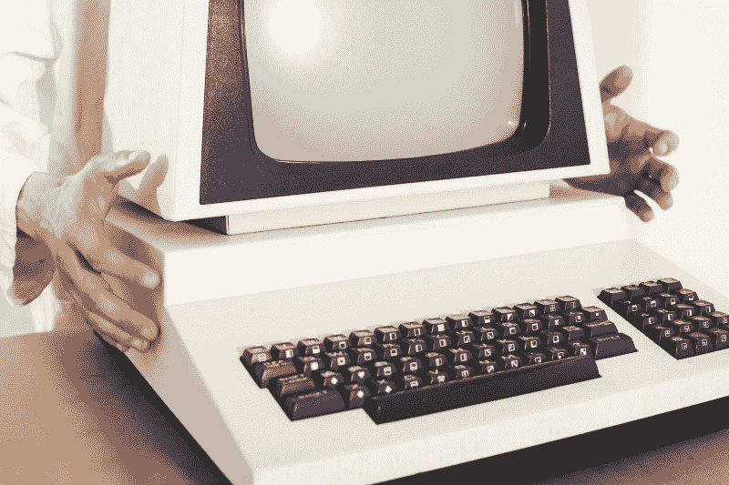

# 浏览器模式用怀旧和有史以来最悲伤的词来解释

> 原文：<https://www.freecodecamp.org/news/web-developer-interview-q-a-quirks-mode-almost-standards-mode-and-full-standards-mode-explained-847edba3dc48/>

祖扎娜·K

# 浏览器模式用怀旧和有史以来最悲伤的词来解释

Photo by [andreas160578](https://pixabay.com/en/users/andreas160578-2383079/) on [PixelBay](https://pixabay.com/en/computer-retro-old-privacy-policy-1895383/)

在我的上一篇[文章](https://medium.freecodecamp.org/web-developer-interview-q-a-what-does-a-doctype-do-146dd757d7d1)中，我讨论了 doctype——它是什么以及为什么需要它。在本文中，我将研究浏览器可以运行的各种模式之间的区别:完全标准模式、几乎标准模式和古怪模式。

这两篇文章非常相关，所以你可能想先读前一篇文章来理解我在说什么。

### 问题:完全标准模式、几乎标准模式和怪癖模式之间有什么区别？

不同的模式都与早期实施的 [W3C](https://www.w3.org/) 标准有关。

Doctype 的引入是为了告诉浏览器他们想要呈现什么样的文档。如果开发人员没有将 doctype 包含在他们的 HTML 文档中，浏览器就不知道它处理的是什么类型的文档。

因此，为了安全起见，它会以所谓的古怪模式呈现文档，以兼容旧的(古怪的)浏览器(Navigator 4、Internet Explorer 4 和 5)。

由于旧的浏览器生活在一个非常糟糕的 CSS 的土地上，这意味着你的许多 CSS 样式将不会被应用，你的网站将不会看起来像你期望的那样。

当然，有些开发人员可能会故意忽略 doctype，因为出于各种原因，他们希望自己的文档以 quirks 模式呈现。

比如，如果我想知道我的网站在 1998 年是什么样子呢？

我会说，理由很充分。

现在我们知道什么是怪癖模式，它会对我们可怜的网站(打破它)做什么，那么完全标准和几乎标准模式是怎么回事？

几乎标准模式也被称为有限怪癖模式。可以想象，在几乎标准模式下呈现的内容几乎完全符合完全标准模式。

差不多了。

史上最悲伤的一句话。

> 一.小故事

> 最悲伤的话

> 整个世界上

> 几乎这个词。

> 他几乎恋爱了。

> 她几乎对他很好。

> 他差点阻止了她。

> 她几乎在等待。

> 他差点活下来。

> 他们差点就成功了。

由尼基塔·吉尔

没关系，我们继续吧。

几乎标准模式呈现的文档只有一些与表格单元格的垂直大小有关的小问题。

另一方面，完全标准模式根据最新的 HTML 和 CSS 规范呈现文档。尽管现代浏览器在屏幕上呈现内容的方式仍有一些差异，但我们可以使用 [Normalize.css](https://necolas.github.io/normalize.css/) 或 [Reset CSS](https://meyerweb.com/eric/tools/css/reset/) 来减少不一致(并保持我们的理智)。

所以，如果你的网站有什么怪癖，那很可能是你的问题，而不是浏览器的问题。

抱歉。

好了，我们到了。如果有人问你完全标准、几乎完全标准和怪癖模式之间的区别，只要记住老浏览器、坏掉的 CSS 和有史以来最悲伤的词。

如果你想了解更多关于激活不同浏览器模式的信息，亨利·西沃宁写了一篇精彩的概述。在 [MDN](https://developer.mozilla.org/en-US/docs/Mozilla/Mozilla_quirks_mode_behavior) 上可以找到一份关于怪癖的粗略列表。

下一次我将研究 HTML 和 XHTML 之间的区别。希望你能和我一起讨论这个激动人心的话题！回头见！

我正在回答的问题列表是由来自爱尔兰都柏林[核实招聘机构](http://www.verifyrecruitment.com/)的 [Rose](http://www.verifyrecruitment.com/blog/index.php/tag/askrose/) 提供的。

如果你喜欢这篇文章，并认为它有益，请考虑给我留下评论或一些掌声。谢谢大家！