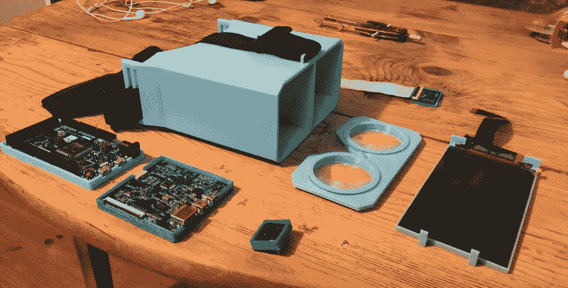
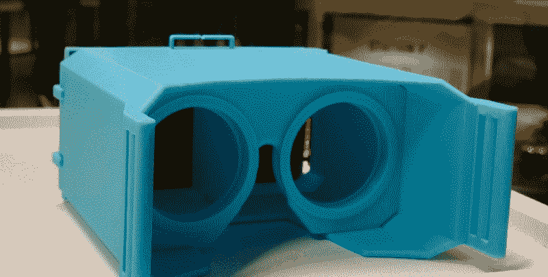
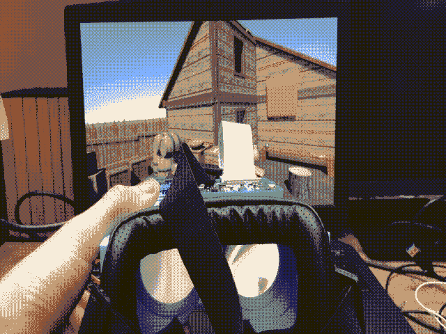
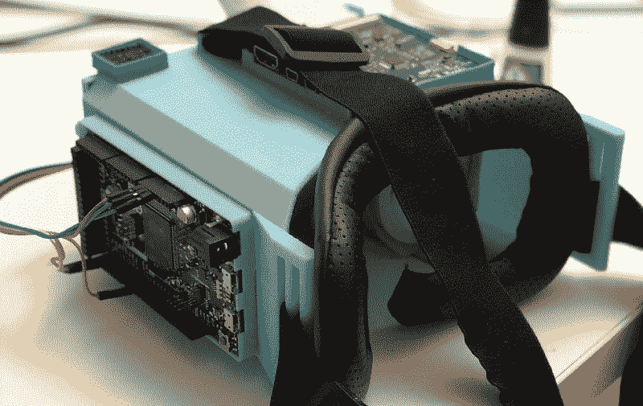

# 如何用 100 美元打造自己的虚拟现实耳机

> 原文：<https://www.freecodecamp.org/news/build-your-own-vr-headset-for-100-13d6f2b06385/>

马克西考特

# 如何用 100 美元打造自己的虚拟现实耳机

我叫马克西姆·佩鲁马尔。我 16 岁，我和我最好的朋友 Jonas Ceccon 和 Gabriel Combe 一起制作了自己的 VR 耳机。结果花了我们 100 美元。

我 13 岁开始编程，这要感谢我的数学老师。每周一和周二，我和我的朋友都去他的教室学习和练习，而不是在食堂吃饭。

我花了一年时间从零开始构建了一个非常基本的 8 位操作系统，并与朋友们一起参加机器人竞赛。

然后我对虚拟现实产生了兴趣，我和我的朋友们一致认为，在虚拟现实中创造我们自己的世界真的很酷，我们可以在放学后花时间。但面对一个 Oculus 当时 700 美元的事实，我们决定自己打造一款耳机。

3D printed parts of the headset

### 让每个人都能接触到 VR？

DARROW; J. R. EYERMAN/THE LIFE PICTURE COLLECTION/GETTY IMAGES

是因为一部叫*剑术 Online* 的动漫，主角在一个虚拟现实 RPG 里，我才爱上了 VR。我想了解它的方方面面。

我买了我能买到的最便宜的组件，我们开始学习虚拟现实背后的物理和数学基础(适当的加速度、反导数、四元数……)。然后我们重新发明了 VR。我写了 [WRMHL](https://medium.freecodecamp.org/you-can-now-create-an-arduino-and-unity3d-interactive-experience-without-latency-2d7388dcc0c) ，然后和 Gabriel 写了 [FastVR](https://github.com/relativty/fastVR-sdk) 。将所有这些放在一起，我们最终得到了一个 100 美元的 VR 耳机。

### 一个完全可破解的虚拟现实耳机和开发套件

为了加快 VR 开发时间，我们构建了 FastVR，这是一个面向开发者的开源 SDK，易于理解和定制。它是这样工作的:

*   核心耳机计算耳机在空间中的位置；
*   位置从耳机发送到 [**WRMHL**](https://medium.freecodecamp.org/you-can-now-create-an-arduino-and-unity3d-interactive-experience-without-latency-2d7388dcc0c) ，CPU 的一部分电量专用于读取那些消息；
*   然后 [**FastVR**](https://github.com/relativty/fastVR-sdk) 检索数据，用它们渲染 VR 游戏。

构建耳机所需的一切都是开源的，可以被黑客攻击。

### 为什么要开源？

我想让 VR 成为主流。所以我联系了这个家族的联合创始人之一 Oussama Ammar。我和他谈了成立公司和推出 Kickstarter 的事情。

但他让我相信，就目前而言，最好还是等一等再创业，不断遇到和自己有相同目标的人，不断学习。

我们去了趟硅谷，Oussama 向我介绍了 Oculus 的首席建筑师 Atman Brinstock。他们给了我一些宝贵的建议:把这些都开源。

### 下一步？

还有很多技术点我们想改进。

我们现在的重点是独立的 VR 头戴设备，我们已经有了一个简单的版本，和更便宜的 3D 跟踪。

所有这些都将很快发布。

### 我如何开始？

如果你想了解更多关于技术方面的知识并制作你的耳机，只需按照指南点击 [**这里**](https://github.com/relativty/Relativ) 。开始回购，如果你喜欢它⭐️

我很想听听您在制作耳机时的经历，或者您是否需要任何帮助或有任何问题。在[**ping 我 maxime@relativty.com**](mailto:maxime@relativty.com)**或者[@ maximeperumeal](https://twitter.com/MaximePeroumal)。**