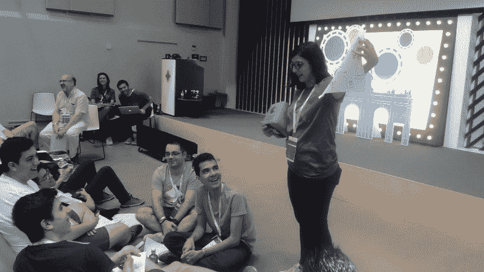
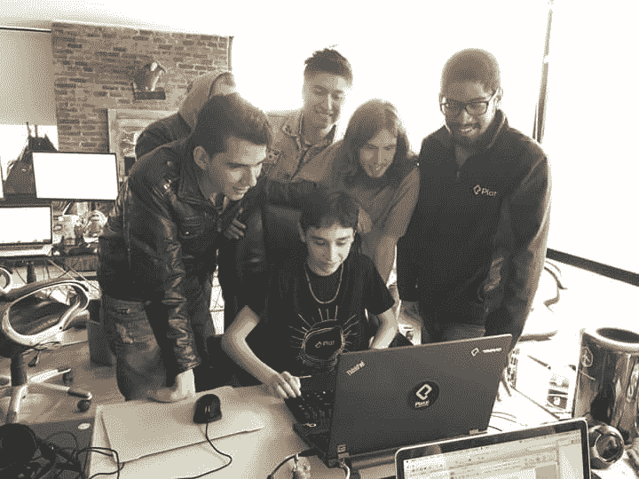
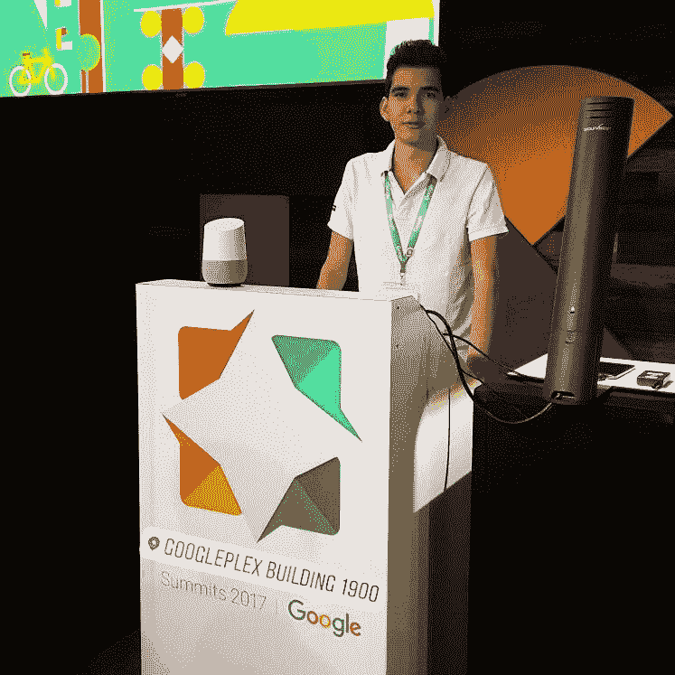

# 我从大学退学，去追求成为一名网页开发者和设计师的梦想

> 原文：<https://www.freecodecamp.org/news/i-dropped-out-of-college-to-pursue-my-dreams-of-being-a-web-developer-and-designer-1abfecb44232/>

作者 Carlos Sz

# 我从大学退学，去追求成为一名网页开发者和设计师的梦想

Google Spain. September 2016.

当我 14 岁时，我发现了 HTML。感谢我在学校的计算机科学老师。从那时起，我开始研究 HTML。几个月后，多亏了一个做平面设计师的朋友，我也发现了 Photoshop。我开始用当时的文本编辑器——记事本，把设计和代码结合起来做网页。

我是学校里最好的学生之一，这对每个人来说都意味着我成年后应该成为一名工程师。就我而言，我喜欢花时间在互联网上，阅读，发现事物，完善我的设计和网站开发知识。我创建了一个在线社区。我国高等教育入学考试研究项目。我变得很出名，以至于谷歌西班牙公司的一些人联系我参与他们的一个项目。当他们发现我是一个 14 岁的男孩时，这是不可能的，然而我第一次接触了谷歌。

高中毕业后，在父母的推荐下，我报读了大学，学习机电工程。那时我感到空虚。我觉得在我学习的六个学期中，我没有学到任何我认为有趣或想在余生中做的事情。

在大学里，我学的东西对我想实现的目标毫无帮助。课程非常无聊，和我一起学习的人对我来说并不令人难以置信，他们是我团队的同事或未来成员。我学了很多微积分、力学和电学，但只是理论上的，因为大多数大学没有基础设施来开设这些科目的实践课。他们也不鼓励你超越考试去思考。

我也有一份在西班牙做遥操作者的工作，我完全讨厌它，所以我决定离开它，以便有足够的时间。

在大学里花更少的时间，并试图把我的爱好带在身边，我开始在网上学习平台上结识很多有趣的人，在那里我开始在父母不知情的情况下偷偷摸摸。这使得我在大学的表现下降，经过思考，我决定和我的父母谈谈，告诉他们我的想法。我想从大学退学。

经过多次谈话、一些争吵和他的巨大失望，我父亲决定给我机会离开他一段时间，用我喜欢的东西去完成一些重要的事情，所以我开始了。学期一结束，我就给我参与最多的一个教育平台写信。普拉茨对我的情况发表了评论，我被邀请到他们位于我国首都的办公室，那里离我的城市有 400 公里。

Platzi HQ, 2016.

未经父母同意，我决定冒险去那里旅行。我遇到了很多人，包括我最好的朋友胡安·大卫。他们帮助我开始了新的生活方式。

我做的第一件事是重拍我的个人作品。我又联系了谷歌，参加了我因为年龄原因没能参加的项目。因为我 20 岁，我可以做到。我被录取了，两个月后，我收到了第一批确认我做了正确决定的东西。我被邀请去谷歌西班牙，所有费用由谷歌支付。作为拉丁美洲人，想到这样的旅行真的很难，我会得到所有的报酬。太不可思议了。

我回到我的国家，渴望得到一份新工作，在那里我可以应用我所学的一切。我找了几个星期，直到我再次找到工作，这一次是在一家拥有多元化团队的非常大的公司，在那里我开始作为一名数字图形设计师工作。

获得第一份工作是你将要遇到的最复杂的事情之一。大多数公司寻找年轻人，但是有丰富经验的人显然很难找到。

根据我的经验，对我找到第一份工作最有帮助的是 **:**

*   **打造个人品牌:**
    打理好你的职业社交网络。有一个好的 Linkedin 个人资料，关注你钦佩的人，写下你自己，你喜欢的事情，以及想要实现的目标。添加你正在做的课程和项目。
*   **有作品集:**
    学以致用很重要。最好的方法是创建真正的项目。创建公司并实施所有数字化流程。创建你想看到的网站或产品的改进。并在 GitHub、Dribbble、Medium 和 Twitter 等网站上分享。在大多数工作中，你的作品集比你的简历更重要。
*   教你所学:
    最好的学习方法是通过教学。参与学习平台(社区)并帮助你的同伴，参与这些论坛。加入社交网络团体，展示你所知道的。

在我的第一份工作中，我开始利用所有的空闲时间在平台上学习 web 编程，比如 [Platzi](https://platzi.com/) (西班牙语) [Treehouse](https://teamtreehouse.com/) 、 [Acamica](https://www.acamica.com/) (西班牙语)和 [Udacity](https://www.udacity.com/) 。我开始帮助开发部门，因为我向他们学习，有时还帮他们解决问题**。我告诉了我的老板正在发生的事情，在一次测试后，我可以去工程部门做一名网页开发员。第一周真是难以置信。我可以展示我所有的才能，由于这一点，我在 3 个月后被提升为开发主管。我现在所处的位置。我正在另一个国家进行新的晋升。**

Googleplex, november 2017.

我也在继续我在谷歌的项目。几周前，我再次被邀请，这次是去加州山景城的办公室。我遇到了更多不可思议的人，并与谷歌团队的一些顶级设计师和工程师度过了一些疯狂的日子。

关于我的情况，我可以说的是，从我决定离开大学到我现在成为一名开发领导者，已经有一年半了。我今年 22 岁，在这个星球上最重要的公司之一的项目中从事我喜欢的工作。了解许多国家、人民和令人惊叹的文化。

感谢追随我的心，离开了大学。正如史蒂夫·乔布斯所说，不要害怕追随你的心:

> 你的工作将占据你生活的很大一部分，而真正满足的唯一方式就是做你认为伟大的工作。做伟大工作的唯一方法是热爱你的工作。如果你还没找到，继续找。不要放弃。就像所有关于心灵的事情一样，当你找到它的时候你就会知道。

### 我从迄今为止的经历中学到的东西:

#### **1。珍惜你的时间**

大多数人把时间花在休闲上。看电视，看网飞系列电影，看电影，以及其他一些毫无意义的事情。反其道而行之，把所有的时间都花在阅读、学习、再学习上。知识就在那里，在互联网上。这只是一个小小的奉献和利用你所有可用时间的问题。这就是成功人士和不成功人士的区别。

#### *2。* **和激励你的人在一起**

身边有人帮助、支持和激励你学习是非常重要的。你总是会变得有点像你周围的人。所以你应该试着和那些帮助你变得不可思议的人在一起。

#### *3。* **参与社区**

每个城市都有一群人聚在一起谈论和学习某个特定的话题。这是一个认识你可以向其学习的人的好机会。如果你所在的城市没有找到社区，那你就有机会了。**创造你自己！**

#### *4。* **创建项目**

有些人认为，仅仅通过参加课程和阅读他们感兴趣的主题，他们就在学习，但事实并非如此。最好的方法是将你所学的知识应用到实际项目中。这将帮助你面对真正的问题，当你开始专业地应用它时，你会准备得更好。

#### *5。* **爱做什么做什么**

努力工作的人、出于义务而工作的人和出于激情而工作的人之间有很大的区别。如果你出于义务去做事情，你就不会做得那么好，或者得到和你带着热情去做一样的结果**。**热爱你所做的事情，享受压力、努力工作及其带来的不可思议的结果。

我希望你喜欢我的经历。我希望它们对那些正在经历和我一样的事情的人有所帮助。不要怕，做自己喜欢的事，就努力去做，带着激情去做。不会出错的。感谢您的阅读，并感谢您的反馈。

你可以在 [Twitter](https://twitter.com/iCarlosSz) 或者 [Instagram](https://www.instagram.com/icarlossz/) 关注我。