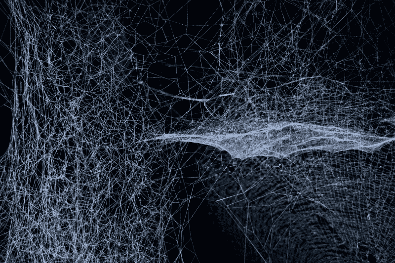

# 如何应对你的 Web 开发者面试问答:doctype 是做什么的？

> 原文：<https://www.freecodecamp.org/news/web-developer-interview-q-a-what-does-a-doctype-do-146dd757d7d1/>

祖扎娜·K

# 如何应对你的 Web 开发者面试问答:doctype 是做什么的？



Photo by [Jingyi Wang](https://unsplash.com/photos/avKPLHgASBM?utm_source=unsplash&utm_medium=referral&utm_content=creditCopyText) on [Unsplash](https://unsplash.com/search/photos/web%20developer?utm_source=unsplash&utm_medium=referral&utm_content=creditCopyText)

web 开发人员职位面试过程的一部分可能包括回答一些问题。是的，我们不仅要做网络方面的工作，还要了解网络方面的知识。

我非常有能力写一个 HTML 文档，使用语义标签，遵循最好的网络标准，但是有些东西我从来没有想过要学。

最近收到一份 web 开发者面试问题清单，第一眼看到清单的时候，我的心脏都快停止跳动了。

*   doctype 是做什么的？
*   以 application/xhtml+xml 的形式提供页面有什么问题吗？
*   特征检测、特征推断和使用 UA 字符串之间有什么区别？

嗯，老实说，我不能回答大多数问题。

我猜这就是计算机科学学位派上用场的地方。

但是，作为一名自学成才的开发人员，我专注于做，而不是知道。然而，由于我自己也在找工作，我认为准备一次 web 开发人员面试并回答其中的一些问题可能是明智的。

因此，在接下来的我不知道有多少的帖子中，我将从一个网站开发人员的面试中提出一个问题(这是由爱尔兰都柏林 Verify 招聘机构的 [Rose](http://www.verifyrecruitment.com/blog/index.php/tag/askrose/) 非常友好地提供的)，并尽我所能回答这个问题。

我将处理一些 HTML、CSS 和 JavaScript 问题。

答案不会是详尽无遗的，但如果我们想更深入一点，它们有望给你我一个良好的开端。

### 问题:a <doctype>是做什么的？</doctype>

Doctype 是“文档类型”的缩写对吧。我是说，谁会想到呢？

但是说真的，当我们将文档保存为 HTML 文件时，为什么我们需要指定 doctype，这当然意味着它是一个 HTML 文档？问题是，对于 a '，您还需要一个。包含 HTML 标记的“php”页面。

这就是让人困惑的地方。所以，让我们打开它一点。

Doctype 声明告诉浏览器预期的文档类型:HTML5、HTML4.0x、XHTML1.0(严格、过渡或框架集)、XHTML1.1、[和其他](https://www.w3.org/QA/2002/04/valid-dtd-list.html)。

但是为什么需要呢？

因为遗产的原因。

在互联网的早期，两种主要的浏览器相互竞争。网景导航器和网络浏览器。他们不断推出新功能，这些新功能通常与其他已有的功能或其他浏览器不兼容。

对于开发者来说，这是一个艰难的时期(让我们都花一分钟来数一数我们的幸运)。

因此，万维网的创始人蒂姆·伯纳斯·李爵士成立了万维网联盟(W3C ),以标准化用于构建网络的协议和技术，并使开发者和用户的生活更加轻松。

新的协议对于新的浏览器和实现来说是很棒的，但是它们会完全破坏现有的网站。

输入文档类型定义(dtd)。

dtd 告诉解析器如何将代码翻译成您在屏幕上看到的内容，以便在不同的浏览器上看起来是一致的。

要呈现 HTML4.01 文档，请在文档顶部使用以下代码:

```
<!DOCTYPE HTML PUBLIC “-//W3C//DTD HTML 4.01//EN” “http://www.w3.org/TR/html4/strict.dtd”> 
```

若要呈现 HTML5 文档，请改为包含以下代码:

```
<!doctype html>
```

不可否认，HTML5 更容易声明。

使用 doctype 声明是 W3C 对我们的要求；没有它， [HTML 验证器](https://validator.w3.org/)将无法工作(因为它们不知道根据什么标准来检查您的代码),浏览器可能会以一种奇怪的方式呈现文档。

说什么？怪癖模式？

如果不声明 doctype，浏览器可以将文档解释为 HTML 之外的其他东西，并切换到 quirks 模式，这基本上是一种用于没有 doctype 声明的文档的模式。

怪癖模式可以有很多怪癖；它几乎可以打乱你的文档在屏幕上的显示方式！

怪癖模式，几乎是标准模式，完全标准模式是我下一次要研究的内容。

现在，照顾好你的 doctype，回头见！

如果你喜欢这篇文章，并认为它有益，请考虑给我留下评论或一些掌声。谢谢大家！