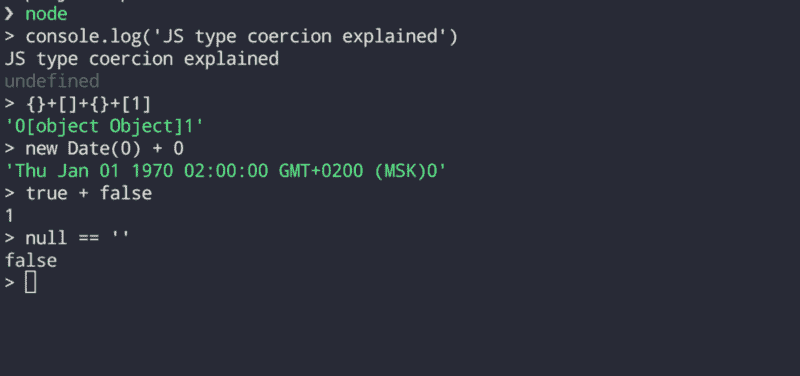

# 解释了 JavaScript 类型强制

> 原文：<https://www.freecodecamp.org/news/js-type-coercion-explained-27ba3d9a2839/>

阿列克谢·萨莫什金

# 解释了 JavaScript 类型强制

#### 了解你的引擎



Weird things can happen in JavaScript

**【2018 年 2 月 5 日编辑】**:此贴现为[俄文版](https://medium.com/@sergeybulavyk/%D0%BF%D1%80%D0%B5%D0%BE%D0%B1%D1%80%D0%B0%D0%B7%D0%BE%D0%B2%D0%B0%D0%BD%D0%B8%D0%B5-%D1%82%D0%B8%D0%BF%D0%BE%D0%B2-%D0%B2-javascript-35a15ddfc333)。为 T4 的努力鼓掌。

**类型强制**是将值从一种类型转换成另一种类型的过程(比如字符串转换成数字，对象转换成布尔，等等)。任何类型，无论是基元还是对象，都是类型强制的有效主体。回想一下，原语是:数字、字符串、布尔、空、未定义+符号(在 ES6 中添加)。

作为实际中类型强制的一个例子，请看一下 [JavaScript 对照表](https://dorey.github.io/JavaScript-Equality-Table/)，它显示了松散的等式`==`操作符对于不同的`a`和`b`类型是如何表现的。由于`==`操作符所做的隐式类型强制，这个矩阵看起来很吓人，而且几乎不可能记住所有这些组合。您不必这样做，只需学习底层的类型强制原则。

这篇文章深入探讨了类型强制在 JavaScript 中是如何工作的，并用这些基本知识武装你，这样你就可以自信地解释下面的表达式计算的结果。在文章的最后，我会给出答案并解释它们。

```
true + false
12 / "6"
"number" + 15 + 3
15 + 3 + "number"
[1] > null
"foo" + + "bar"
'true' == true
false == 'false'
null == ''
!!"false" == !!"true"
[‘x’] == ‘x’
[] + null + 1
[1,2,3] == [1,2,3]
{}+[]+{}+[1]
!+[]+[]+![]
new Date(0) - 0
new Date(0) + 0
```

是的，这个列表里都是你作为开发者可以做的非常愚蠢的事情。在 90%的用例中，最好避免隐式类型强制。请将此列表视为一个学习练习，以测试您对类型强制如何工作的了解。如果你觉得无聊，你可以在 wtfjs.com 上找到更多的例子。

顺便说一下，有时候你可能会在 JavaScript 开发人员的面试中遇到这样的问题。所以，继续读？

### 隐性与显性胁迫

类型强制可以是显式的，也可以是隐式的。

当开发人员通过编写适当的代码来表达在类型之间转换的意图时，比如`Number(value)`，这被称为**显式类型强制**(或类型转换)。

由于 JavaScript 是弱类型语言，所以值也可以在不同类型之间自动转换，称为**隐式类型强制**。这通常发生在您将运算符应用于不同类型的值时，如
、`2/’5'`、`null + new Date()`，或者它可以由周围的上下文触发，如`if (value) {…}`，其中`value`被强制为布尔值。

一个不触发隐式类型强制的操作符是`===`，它被称为严格相等操作符。另一方面，如果需要的话，松散的相等操作符`==`既做比较又做类型强制。

隐式类型强制是一把双刃剑:它是沮丧和缺陷的巨大来源，但也是一种有用的机制，它允许我们编写更少的代码，而不会失去可读性。

### 三种转换类型

要知道的第一条规则是 JavaScript 中只有三种类型的转换:

*   tostring
*   转换为布尔值
*   要编号

其次，原语和对象的转换逻辑工作方式不同，但是原语和对象都只能通过这三种方式进行转换。

我们先从原语开始。

### 字符串转换

要将值显式转换为字符串，请应用`String()`函数。当任何操作数是字符串时，隐式强制由二元`+`运算符触发:

```
String(123) // explicit
123 + ''    // implicit
```

如您所料，所有原始值都会自然地转换为字符串:

```
String(123)                   // '123'
String(-12.3)                 // '-12.3'
String(null)                  // 'null'
String(undefined)             // 'undefined'
String(true)                  // 'true'
String(false)                 // 'false'
```

符号转换有点棘手，因为它只能显式转换，不能隐式转换。[阅读更多](https://leanpub.com/understandinges6/read/#leanpub-auto-symbol-coercion)关于`Symbol`强制规则。

```
String(Symbol('my symbol'))   // 'Symbol(my symbol)'
'' + Symbol('my symbol')      // TypeError is thrown
```

### 布尔转换

要将一个值显式转换为布尔值，应用`Boolean()`函数。
隐式转换发生在逻辑语境中，或者由逻辑运算符(`||` `&&` `!`)触发。

```
Boolean(2)          // explicit
if (2) { ... }      // implicit due to logical context
!!2                 // implicit due to logical operator
2 || 'hello'        // implicit due to logical operator
```

**注意**:逻辑运算符`||`、`&&`等在内部做布尔转换，但[实际上返回的是原操作数](https://developer.mozilla.org/en-US/docs/Web/JavaScript/Guide/Expressions_and_Operators#Logical_operators)的值，即使不是布尔。

```
// returns number 123, instead of returning true
// 'hello' and 123 are still coerced to boolean internally to calculate the expression
let x = 'hello' && 123;   // x === 123
```

只要布尔转换只有两种可能的结果:`true`或`false`，就更容易记住 falsy 值的列表。

```
Boolean('')           // false
Boolean(0)            // false     
Boolean(-0)           // false
Boolean(NaN)          // false
Boolean(null)         // false
Boolean(undefined)    // false
Boolean(false)        // false
```

任何不在列表中的值都被转换为`true`，包括对象、函数、`Array`、`Date`、自定义类型等。符号是真实的价值。空对象和数组也是真值:

```
Boolean({})             // true
Boolean([])             // true
Boolean(Symbol())       // true
!!Symbol()              // true
Boolean(function() {})  // true
```

### 数字转换

对于显式转换，只需应用`Number()`函数，就像你对`Boolean()`和`String()`所做的一样。

隐式转换很棘手，因为它在更多情况下被触发:

*   比较运算符(`>`、`<`、`<=`、`>=`)
*   按位运算符(`|` `&` `^` `~`)
*   算术运算符(`-` `+` `*` `/` `%`)。注意，当任何操作数是字符串时，二进制`+`不会触发数字转换。
*   一元`+`运算符
*   宽松相等运算符`==`(包括`!=`)。
    注意，当两个操作数都是字符串时，`==`不会触发数值转换。

```
Number('123')   // explicit
+'123'          // implicit
123 != '456'    // implicit
4 > '5'         // implicit
5/null          // implicit
true | 0        // implicit
```

以下是原始值如何转换为数字:

```
Number(null)                   // 0
Number(undefined)              // NaN
Number(true)                   // 1
Number(false)                  // 0
Number(" 12 ")                 // 12
Number("-12.34")               // -12.34
Number("\n")                   // 0
Number(" 12s ")                // NaN
Number(123)                    // 123
```

将字符串转换为数字时，引擎首先修剪前导和尾随空格、`\n`、`\t`字符，如果修剪后的字符串不代表有效数字，则返回`NaN`。如果字符串为空，则返回`0`。

`null`和`undefined`处理不同:`null`变成`0`，而`undefined`变成`NaN`。

符号不能显式或隐式地转换为数字。此外，`TypeError`被抛出，而不是无声地转换成`NaN`，就像它发生在`undefined`身上一样。在 [MDN](https://developer.mozilla.org/en-US/docs/Web/JavaScript/Reference/Global_Objects/Symbol#Symbol_type_conversions) 上查看更多符号转换规则。

```
Number(Symbol('my symbol'))    // TypeError is thrown
+Symbol('123')                 // TypeError is thrown
```

有两条**特殊规则**需要记住:

1.  将`==`应用到`null`或`undefined`时，不会发生数值转换。`null`仅等于`null`或`undefined`，不等于其他。

```
null == 0               // false, null is not converted to 0
null == null            // true
undefined == undefined  // true
null == undefined       // true
```

2.南不等于任何东西，甚至本身:

```
if (value !== value) { console.log("we're dealing with NaN here") }
```

### 对象的类型强制

到目前为止，我们已经研究了原始值的类型强制。那不是很令人兴奋。

当涉及到对象和引擎遇到类似于`[1] + [2,3]`的表达式时，首先它需要将对象转换为原始值，然后再转换为最终类型。仍然只有三种类型的转换:数字、字符串和布尔。

最简单的情况是布尔转换:无论对象或数组是否为空，任何非原始值总是被强制转换为。

对象通过内部的`[[ToPrimitive]]`方法被转换成原语，该方法负责数字和字符串的转换。

下面是一个`[[ToPrimitive]]`方法的伪实现:

`[[ToPrimitive]]`通过输入值和首选转换类型传递:`Number`或`String`。`preferredType`可选。

数字和字符串转换都使用输入对象的两种方法:`valueOf`和`toString`。这两种方法都在`Object.prototype`上声明，因此可用于任何派生类型，如`Date`、`Array`等。

一般来说，算法如下:

1.  如果 input 已经是一个原语，什么都不做并返回它。

2.调用`input.toString()`，如果结果是原语，则返回。

3.调用`input.valueOf()`，如果结果是原语，则返回。

4.如果`input.toString()`和`input.valueOf()`都不产生原语，抛出`TypeError`。

数值转换首先调用`valueOf` (3)，然后返回到`toString` (2)。字符串转换则相反:`toString` (2)，然后是`valueOf` (3)。

大多数内置类型没有`valueOf`，或者有`valueOf`返回`this`对象本身，所以它被忽略，因为它不是原语。这就是为什么数字和字符串转换可能是一样的——两者最终都会调用`toString()`。

不同的操作者可以借助`preferredType`参数触发数值或字符串转换。但有两个例外:松散等式`==`和二元`+`运算符触发默认转换模式(`preferredType`未指定，或等于`default`)。在这种情况下，除了进行字符串转换的`Date`之外，大多数内置类型默认采用数字转换。

下面是一个`Date`转换行为的例子:

您可以覆盖默认的`toString()`和`valueOf()`方法，以挂钩到对象到原语的转换逻辑。

注意`obj + ‘’`如何将`‘101’`作为字符串返回。`+`操作符触发默认转换模式，如前所述`Object`默认数值转换，因此首先使用`valueOf()`方法，而不是`toString()`。

### ES6 symbol . to 原始方法

在 ES5 中，你可以通过覆盖`toString`和`valueOf`方法来挂钩到对象到原语的转换逻辑。

在 ES6 中，你可以更进一步，通过在一个对象上实现`[Symbol.toPrimtive]`方法来完全替换内部`[[ToPrimitive]]`例程。

### 例子

有了这个理论，现在让我们回到我们的例子:

```
true + false             // 1
12 / "6"                 // 2
"number" + 15 + 3        // 'number153'
15 + 3 + "number"        // '18number'
[1] > null               // true
"foo" + + "bar"          // 'fooNaN'
'true' == true           // false
false == 'false'         // false
null == ''               // false
!!"false" == !!"true"    // true
['x'] == 'x'             // true 
[] + null + 1            // 'null1'
[1,2,3] == [1,2,3]       // false
{}+[]+{}+[1]             // '0[object Object]1'
!+[]+[]+![]              // 'truefalse'
new Date(0) - 0          // 0
new Date(0) + 0          // 'Thu Jan 01 1970 02:00:00(EET)0'
```

下面你可以找到每个表达的解释。

二元运算符`+`触发`true`和`false`的数值转换

```
true + false
==> 1 + 0
==> 1
```

算术除法运算符`/`触发字符串`'6'`的数值转换:

```
12 / '6'
==> 12 / 6
==>> 2
```

运算符`+`具有从左到右的关联性，因此表达式`"number" + 15`首先运行。由于一个操作数是一个字符串，`+`操作符触发数字`15`的字符串转换。在第二步中，表达式`"number15" + 3`的计算方式类似。

```
“number” + 15 + 3 
==> "number15" + 3 
==> "number153"
```

首先计算表达式`15 + 3`。完全不需要强制，因为两个操作数都是数字。在第二步，表达式`18 + 'number'`被求值，由于一个操作数是一个字符串，它触发一个字符串转换。

```
15 + 3 + "number" 
==> 18 + "number" 
==> "18number"
```

比较运算符`&`gt；触发数字转换 f `or` [1] a `nd n`满。

```
[1] > null
==> '1' > 0
==> 1 > 0
==> true
```

一元`+`运算符的优先级高于二元`+`运算符。所以`+'bar'`表情先评价。一元加号触发字符串`'bar'`的数值转换。由于该字符串不代表有效数字，因此结果为`NaN`。在第二步，表达式`'foo' + NaN`被求值。

```
"foo" + + "bar" 
==> "foo" + (+"bar") 
==> "foo" + NaN 
==> "fooNaN"
```

`==`运算符触发数值转换，字符串`'true'`转换为 NaN，布尔型`true`转换为 1。

```
'true' == true
==> NaN == 1
==> false

false == 'false'   
==> 0 == NaN
==> false
```

`==`通常会触发数值转换，但`null`不会。`null`只等同于`null`或`undefined`，不等同于其他任何东西。

```
null == ''
==> false
```

`!!`操作符将`'true'`和`'false'`字符串转换为布尔型`true`，因为它们是非空字符串。然后，`==`只是检查两个布尔`true's`是否相等，没有任何强制。

```
!!"false" == !!"true"  
==> true == true
==> true
```

`==`运算符触发数组的数值转换。Array 的`valueOf()`方法返回数组本身，并被忽略，因为它不是一个原语。数组的`toString()`将`['x']`转换成仅仅是`'x'`字符串。

```
['x'] == 'x'  
==> 'x' == 'x'
==>  true
```

`+`操作员触发`[]`的数值转换。数组的`valueOf()`方法被忽略，因为它返回数组本身，这是非原始的。数组的`toString`返回一个空字符串。

在第二步，对表达式`'' + null + 1`求值。

```
[] + null + 1  
==>  '' + null + 1  
==>  'null' + 1  
==> 'null1'
```

逻辑`||`和`&&`操作符将操作数强制转换为布尔值，但返回原始操作数(不是布尔值)。`0`是 falsy，而`'0'`是 truthy，因为它是非空字符串。`{}`空无一物也是真理。

```
0 || "0" && {}  
==>  (0 || "0") && {}
==> (false || true) && true  // internally
==> "0" && {}
==> true && true             // internally
==> {}
```

不需要强制，因为两个操作数具有相同的类型。因为`==`检查对象身份(而不是对象相等)，并且两个数组是两个不同的实例，所以结果是`false`。

```
[1,2,3] == [1,2,3]
==>  false
```

所有操作数都是非原始值，所以`+`从最左边的触发数字转换开始。`Object’s`和`Array’s` `valueOf`方法都返回对象本身，所以被忽略。`toString()`用作退路。这里的技巧是第一个`{}`不被认为是一个对象文字，而是一个块声明语句，所以它被忽略。评估从下一个`+[]`表达式开始，该表达式通过`toString()`方法转换为空字符串，然后转换为`0`。

```
{}+[]+{}+[1]
==> +[]+{}+[1]
==> 0 + {} + [1]
==> 0 + '[object Object]' + [1]
==> '0[object Object]' + [1]
==> '0[object Object]' + '1'
==> '0[object Object]1'
```

按照操作符的优先顺序一步一步来解释这个更好。

```
!+[]+[]+![]  
==> (!+[]) + [] + (![])
==> !0 + [] + false
==> true + [] + false
==> true + '' + false
==> 'truefalse'
```

`-`操作员触发`Date`的数值转换。`Date.valueOf()`返回自 Unix 纪元以来的毫秒数。

```
new Date(0) - 0
==> 0 - 0
==> 0
```

`+`操作员触发默认转换。Date 假设字符串转换是默认的，所以使用了`toString()`方法，而不是`valueOf()`。

```
new Date(0) + 0
==> 'Thu Jan 01 1970 02:00:00 GMT+0200 (EET)' + 0
==> 'Thu Jan 01 1970 02:00:00 GMT+0200 (EET)0'
```

### 资源

我很想推荐 [Nicholas C. Zakas](https://www.freecodecamp.org/news/js-type-coercion-explained-27ba3d9a2839/undefined) 写的《了解 ES6 》这本优秀的书。这是一个很好的 ES6 学习资源，不太高级，也不太深入内部。

这里有一本关于 ES5 的好书，作者是[阿克塞尔·劳施迈尔](https://www.freecodecamp.org/news/js-type-coercion-explained-27ba3d9a2839/undefined)。

(**俄语**современныйучебникJavaScript—[https://learn.javascript.ru/](https://learn.javascript.ru/)。尤其是[这些](https://learn.javascript.ru/object-conversion) [两个](https://learn.javascript.ru/types-conversion)页面上打出的威压。

JavaScript 对照表—[https://dorey.github.io/JavaScript-Equality-Table/](https://dorey.github.io/JavaScript-Equality-Table/)

wtfjs——一个关于我们热爱的语言的小代码博客，尽管这种语言让我们恨之入骨—[https://wtfjs.com/](https://wtfjs.com/)