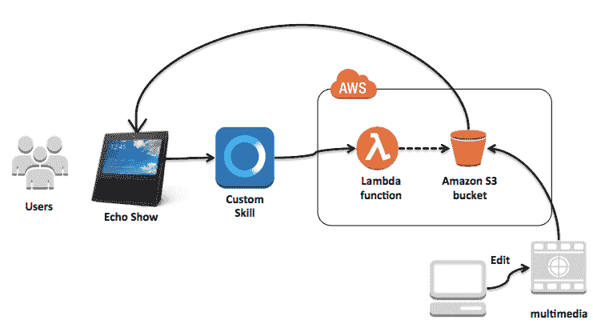
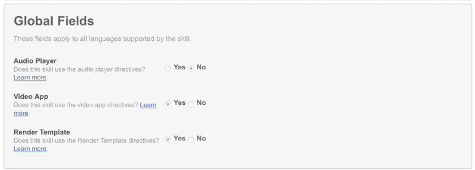
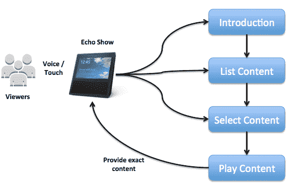
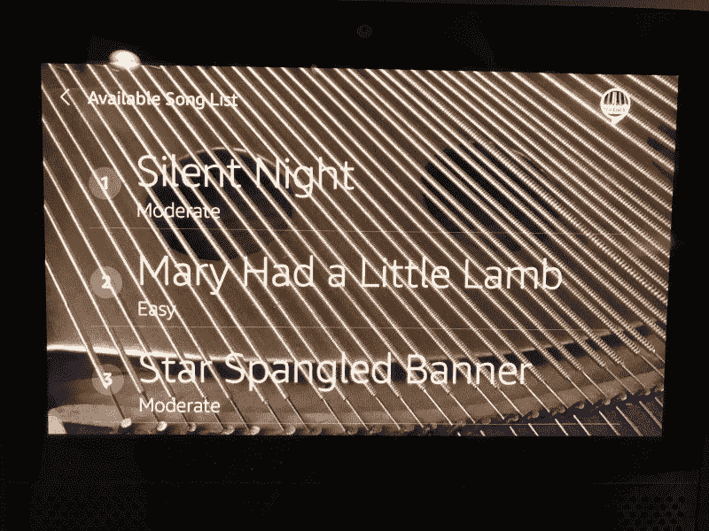
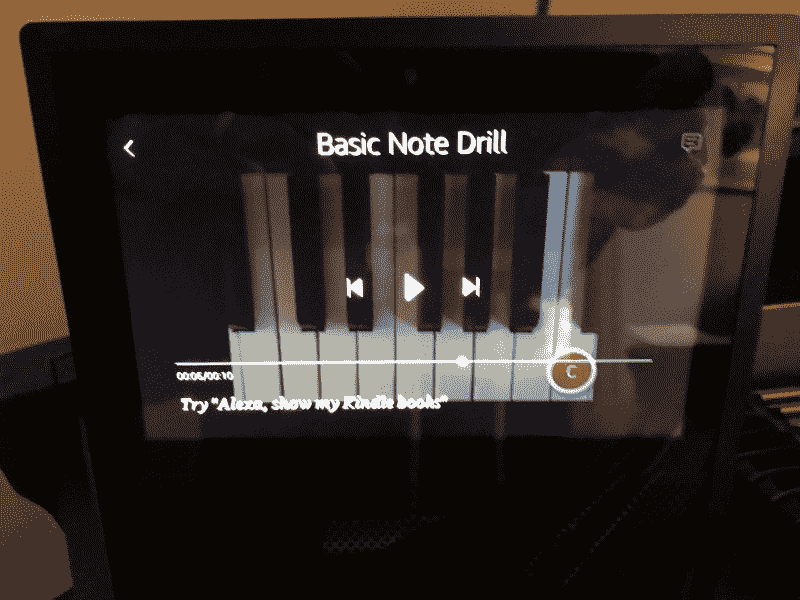

# 如何在没有 YouTube 的情况下为亚马逊 Alexa 秀创建视频频道

> 原文：<https://www.freecodecamp.org/news/how-to-create-a-video-channel-for-the-amazon-alexa-show-without-youtube-92cea2cdcb7d/>

特伦·彼得森

# 如何在没有 YouTube 的情况下为亚马逊 Alexa 秀创建视频频道


Image Courtesy of [AlexAntropov](https://pixabay.com/en/users/AlexAntropov86-2691829/) on Pixabay

我是一名软件工程师，在 Alexa 平台上发表了二十多项自定义技能。我被认为是 Alexa 的冠军，并且使用这项技术赢得了多次黑客马拉松比赛。下面重点介绍了我如何使用原生亚马逊技术为 Echo Show 构建自定义视频技能。

### 视频消费的历史

六十多年来，视频广播一直是一种成功的媒体。几十年来，电视机一直主导着娱乐业，广播信号直接传送到起居室。在 1990 年的 T2，有线电视已经覆盖了 57%的美国家庭。这迅速扩大了观众消费的内容种类。

直播正式开始于 [1995](https://www.theguardian.com/media-network/media-network-blog/2013/mar/01/history-streaming-future-connected-tv) ，但直到 2007 年，基于互联网的流媒体才开始使用标准的 HTTP 协议。像 iPhone 这样的智能手机是在使用类似的通信方式后不久加入的。随着手机的发展，小屏幕开始占据我们更多的时间。YouTube 在这个阶段取得了巨大的成功，现在每天播放[50 亿个视频](https://www.bluleadz.com/blog/25-eye-opening-youtube-statistics-infographic)。

2015 年，[亚马逊推出了第一款完全由用户语音控制的设备](https://www.androidcentral.com/amazon-echo-now-available-everyone-buy-17999-shipments-start-july-14)。像 Alexa 这样的语音平台迅速为家庭增加了另一种设备，据 T2 估计，3500 万辆 T3 已经在美国使用。在 [2017](https://www.macrumors.com/2017/05/09/amazon-echo-show-june/) ，亚马逊正式推出了他们第一个带屏幕的 Alexa 版本，名为 Echo Show。新的亚马逊 Fire TV 设备也内置了 Alexa，可以通过语音控制将视频流传输到平板显示器上。

Echo Show 最初包括播放 YouTube 视频的功能，但最近，谷歌和亚马逊[一直在就其可用性与](http://variety.com/2017/digital/news/amazon-echo-show-sales-down-youtube-1202582660/)展开争斗。鉴于视频播放的重要性，这影响了产品的受欢迎程度。

在 [2018 CES](https://www.cnet.com/news/google-home-assistant-smart-displays-echo-show-lenovo-lg-sony-jbl-ces-2018/) 上，多家消费电子公司宣布，他们将推出一款带屏幕的 Google Home 兼容设备。这使得语音市场竞争更加激烈。YouTube 兼容性挑战的一个解决方案是直接在亚马逊上托管视频内容。下面描述了如何为 Echo Show 创建一个自定义技能来实现这一点。

### 如何在 Alexa 上创建自定义视频技能

使用 Alexa 和一些 AWS 服务，建立自己的视频频道出奇地容易。这是一个具有自定义 Alexa 技能的架构，它将内容打包以在 Echo Show 上播放。AWS 存储服务(S3)存储媒体，并根据自定义技能给出的指令将其流式传输到设备。



Component Level Architecture for Custom Video Skill

为此制作内容相当于 YouTube 频道所需的内容。当前版本的 Echo Show(以及 Echo Spot)有关于媒体类型的规范可以遵循。例如，视频应该使用 mp4 扩展和标准的 [H.264 压缩](https://en.wikipedia.org/wiki/H.264/MPEG-4_AVC)格式。视频质量的分辨率应不大于 1280x720 像素大小。这些限制在该节目的 7 英寸显示屏上提供了可与高清视频播放器媲美的高质量视频流。

### 建立自定义视频技能

创建一个视频频道需要为 Alexa 创作一个自定义技能，并将其发布到公共技能商店。导航频道中的内容和播放视频需要许多功能。本节将详细介绍这些步骤。举个工作例子，试试已经在 [Alexa 商店](https://www.amazon.com/Piano-Teacher-video-Echo-Show/dp/B078M9843X/)里的钢琴老师技能。这是一项技能，包含关于如何弹奏钢琴的初学者课程的短视频，以及关于如何弹奏简单歌曲的逐音符视频指导。[这里的](https://github.com/terrenjpeterson/pianoplayer)是 repo，包含所有需要的源代码，以及配置和部署的详细说明。

制作视频通道需要三个特征。

1-技能初始启动时渲染背景图像。这建立了渠道的品牌。2 —构建导航控件来浏览和选择要播放的视频。这包括处理 Echo Show 屏幕上的触摸手势。
3 —选择内容后，将播放视频的控制权委托给设备。

#### 1-带背景图像的品牌

为了促进定制视频技能的建立，Alexa 提供了一系列模板。第一次调用技能时，我使用“BodyTemplate1”模板来呈现背景图像。当在 Alexa 开发者控制台中生成元数据时，检查全局字段屏幕上的第二个和第三个框(视频应用和渲染模板)。



设置这些属性可以在自定义技能中启用额外的 API。使用 API 需要额外的标准意图。这些是在 skills kit 中构建意图模型时创建的。它们如下:

*   亚马逊。导航设置意图
*   亚马逊。NextIntent
*   亚马逊。PageDownIntent
*   亚马逊网站。分页意图
*   亚马逊。前一句
*   亚马逊。向下滚动意图
*   亚马逊。ScrollLeftIntent
*   亚马逊。滚动右侧内容
*   亚马逊。ScrollUpIntent

这些事件不需要在 Lambda 函数中编码，因为设备会在本地处理它们。它们只需要包含在您的自定义技能意向模型中。

渲染背景图像需要两个已经在标准 Alexa SDK 中发布的实用方法。该技能创建了两个标识符来说明如何使用它们。

```
// utility methods for creating Image and TextField objects

const makePlainText = Alexa.utils.TextUtils.makePlainText;
const makeImage     = Alexa.utils.ImageUtils.makeImage;
```

接下来，我为用作背景图像的 jpg/png 文件的位置添加一个标识符。该对象需要公开可用。根据回波节目的尺寸，像素大小为 1024x600。您不需要为较小的回波点提供单独的图像。Alexa 根据节目的原始文件创建了较小的图像。

```
// This is a public endpoint - the easiest way is to host in S3
// It needs to be SSL enabled (which S3 does for you)

const backgroundImage = ‘https://s3.amazonaws.com/.../image.jpg';
```

接下来，添加以下代码来呈现技能启动时的背景图像，以及任何其他音频消息。

```
‘LaunchRequest’: function () { 
  const builder = new Alexa.templateBuilders.BodyTemplate1Builder();
  const template = builder.setTitle(‘Your Personal Instructor’)
      .setBackgroundImage(makeImage(backgroundImage))
      .setTextContent(makePlainText(‘Piano Teacher’)) 
      .build();

  // check if the device has a video screen
  if (this.event.context.System.device.supportedInterfaces.Display){      
    this.response.speak(welcomeMessage)
        .listen(repeatWelcomeMessage).renderTemplate(template);
    this.emit(‘:responseReady’);
  } else {
    // handle error of not having a video screen to play
    this.emit(‘:tell’, nonVideoMessage);
  } 
},
```

#### 2 —内容导航

内容导航利用了 Alexa 平台的灵活性。观众可以使用他们的声音或手指来浏览内容目录，准确地选择他们想要观看的内容。这需要使用 Alexa SDK 中的列表模板，以及处理用户触摸屏幕触发的事件。

这里有不同的选项，用户可以使用他们的声音或触摸屏幕来请求。



呈现可用内容列表是用户体验的核心。我使用 Alexa SDK 中的“ListTemplate1”来呈现视频列表。上下滚动可以通过语音或触摸完成，由设备处理，无需编码。

被发送来列出内容的响应对象包含一个数组，该数组列出了频道上可用的内容。在我的技能中，这个列表由 Alexa 语音读取，并在屏幕上可视化呈现。这是一个看起来像什么的例子。



Screenshot of Piano Teacher Skill on an Alexa Show

在代码中，内容被具体化为一个数组对象(songs.json ),该对象包含一个视频列表，以及关于每个媒体文件位置的元数据。列表中的每个项目都分配有唯一的令牌。以下是用标准 Javascript 对象符号编写的布局示例:

```
[ 
  { “requestName”: “Silent Night”, 
    “listSong”:true, 
    “token”:”song001", 
    “difficulty”:”Moderate”, 
    “videoObject”: “SilentNight.mp4”, 
    “audioObject”: “SilentNight.mp3” 
  }, 
  { “requestName”: “Mary Had a Little Lamb”, 
    “listSong”:true, 
    “token”:”song002", 
    “difficulty”:”Easy”, 
    “videoObject”: “MaryHadLittleLamb.mp4”, 
    “audioObject”: “MaryHadLittleLamb.mp3” 
  },
...
]
```

下面是将数组转换成 Alexa 需要的响应的代码。包括为数组中的每一项嵌入令牌。

```
// these are the songs that recordings have been made for
var songs = require("data/songs.json");

// create List
const itemImage = null; 
const listItemBuilder = new Alexa.templateBuilders.ListItemBuilder(); 
const listTemplateBuilder = new Alexa.templateBuilders.ListTemplate1Builder();

// build an array of all available songs 
for (i = 0; i < songs.length; i++ ) { 
  if (songs[i].listSong) { 
    // pull attributes from song array and apply to the list
    listItemBuilder.addItem(null, songs[i].token,
      makePlainText(songs[i].requestName),
      makePlainText(songs[i].difficulty)); 
     message = message + songs[i].requestName + “, “;
  } 
} 
message = message + “Just select on the screen a song, or request by saying something “ + “like, Teach me how to play “ + songs[0].requestName + “.”;

// now create the response object using the SDK
const listItems = listItemBuilder.build(); 
const imageLoc = pianoStrings; 
const listTemplate = listTemplateBuilder.setToken(‘listToken’)
  .setTitle(‘Available Song List’) .setListItems(listItems)
  .setBackgroundImage(makeImage(imageLoc)) 
  .build(); this.response.speak(message).listen(noSongRepeatMessage).renderTemplate(listTemplate); 
this.emit(‘:responseReady’);
```

Lambda 函数处理由 Echo Show 调用的“ElementSelected”事件。设备发送给自定义技能的请求对象包含用于翻译用户所选内容的令牌。

```
// this function is invoked from the 'ElementSelected' event
‘ScreenSongSelected’: function() { 
  console.log(“Element Selected:” + this.event.request.token);
  var videoName = “”;
  // match token to song name and find the video object to play 
  for (i = 0; i < songs.length; i++ ) { 
    if (songs[i].token === this.event.request.token) { 
      console.log(“Play “ + songs[i].requestName);
      videoName = songs[i].videoObject;
    } 
  } 
  const videoClip = videoLoc + videoName;
  this.response.playVideo(videoClip); this.emit(‘:responseReady’); 
},
```

Lambda 函数使用它接收的令牌，并找到对应于唯一标识符的媒体文件。然后，控制权会转移到带有适当视频的设备。

#### 3-将控制权委托给视频播放器

一旦找到需要播放的视频，就将媒体的端点添加到响应中。这需要 Lambda 函数中的几行代码。

首先，在 S3 存储桶中确定一个存储视频文件的文件夹。

```
// These are the folders where the mp4 files are located

const videoLoc = ‘https://s3.amazonaws.com/…/media/';
```

然后根据用户识别的内容指定确切的文件。添加包含关于视频的更多信息的元数据。

```
if (this.event.context.System.device.supportedInterfaces.VideoApp) {
  const videoClip = videoLoc + videoObject; // endpoint of the file
  // this will be rendered when the user selects video controls
  const metadata = { 
    ‘title’: slots.SongName.value 
  };
  this.response.playVideo(videoClip, metadata);
  this.emit(':responseReady');
} else {
  // handle error - and close the session
  this.emit(‘:tell’, nonVideoMessage);
}
```

这段代码执行后，Alexa 设备将接管播放视频的导航。用户可以用他们的声音或触摸屏幕来暂停、倒带、快进等。这是播放视频时屏幕的样子，包括顶部的元数据标题。



Screen shot of Piano Teacher Skill on an Alexa Show

当设备上的视频播放完成时，可以再次使用该技能来选择更多内容。

### 摘要

使用上面的例子作为模板，只需几个小时就可以建立自定义技能。Alexa 认证过程只需要一两天，然后任何人都可以使用 Echo Show 的技能(和其中的内容)。作为 YouTube 的粉丝，我希望能够很快在我的 Alexa 设备上使用它，但内容出版商也有一种方法可以绕过它。