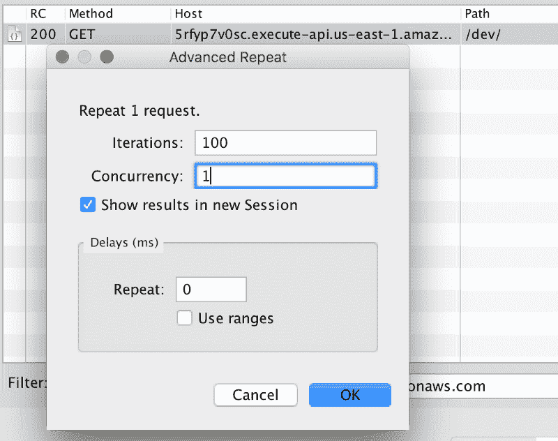
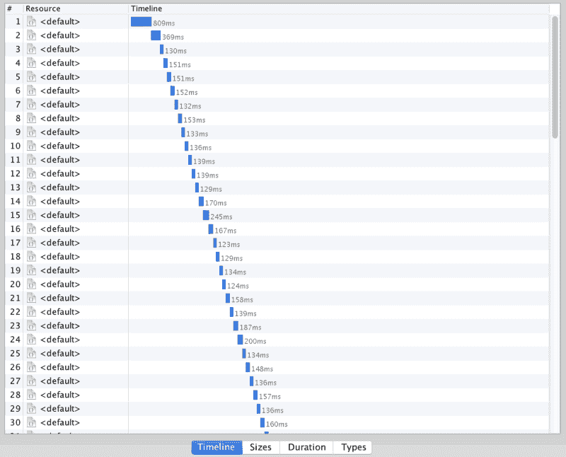
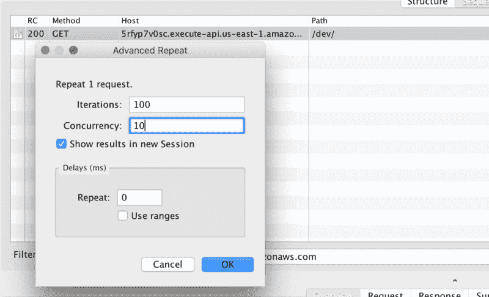
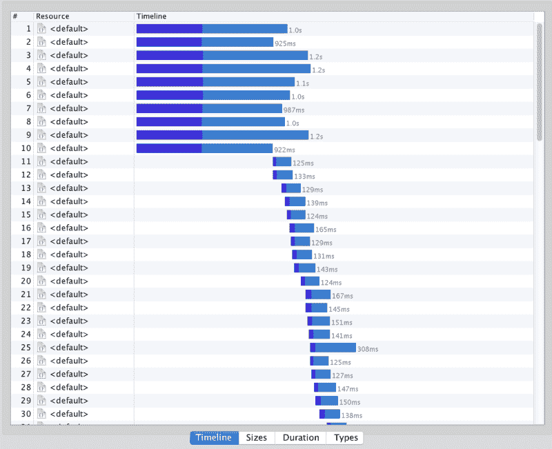
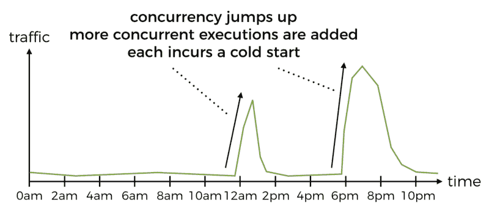
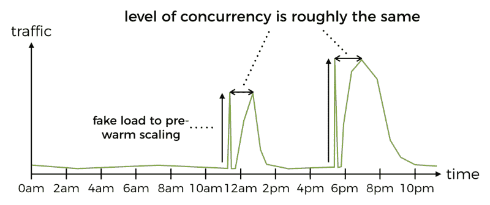
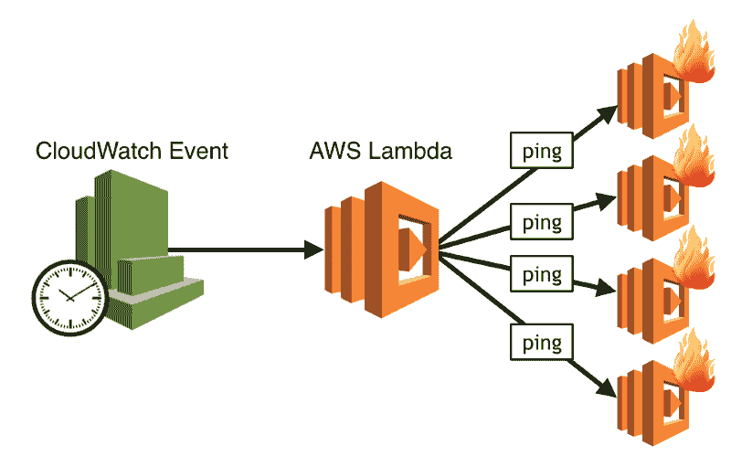
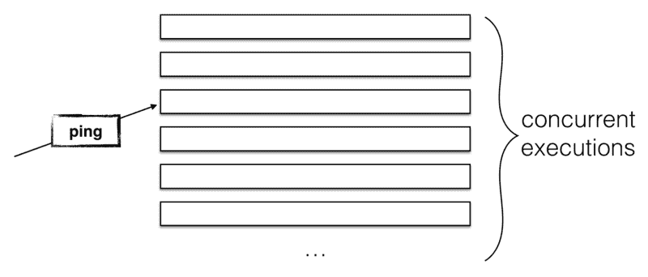

# 恐怕你对 AWS Lambda 冷启动的想法完全错了

> 原文：<https://www.freecodecamp.org/news/im-afraid-you-re-thinking-about-aws-lambda-cold-starts-all-wrong-45078231fe7c/>

作者:崔琰

# 恐怕你对 AWS Lambda 冷启动的想法完全错了

Photo by [Matthew Henry](https://unsplash.com/photos/6x-hVXXiBxs?utm_source=unsplash&utm_medium=referral&utm_content=creditCopyText) on [Unsplash](https://unsplash.com/search/photos/lazy?utm_source=unsplash&utm_medium=referral&utm_content=creditCopyText)

当我在 API Gate way 的上下文中与人们讨论 AWS Lamb da cold starts 时，我经常得到类似以下的回应:

> 呣，这只是第一个要求，对吗？所以，如果一个请求很慢，下一个一百万个请求就会很快。

不幸的是，这是对所发生事情的过于简单的描述。

对于您功能的每个**电流执行**，冷启动 hap**一次**。

如果可能，API Gate way 会重用函数的当前执行。根据我的观察，it**甚至可能将请求短时间排队，希望其中一个当前的执行程序能够找到并变得可重用*。*

*如果用户一个接一个地请求 hap pen，那么在这个过程中你只会经历一次冷启动。您可以使用 [Charles proxy](https://www.charlesproxy.com/) 通过重复当前设置为 1 的 cap turned 请求来模拟这种情况。*

**

*正如您在下面的时间线中看到的，只有第一个请求经历了冷启动。对这一请求的响应比其他请求慢得多。*

*100 分之一——那是可以承受的。见鬼，它甚至不会出现在我 99%的迟到率里。*

**

*如果用户请求成群结队地到来会怎样？毕竟，用户行为是不可预测的，不太可能遵循我们上面看到的好的顺序模式。因此，让我们假设当我们收到 100 个当前值为 10 的请求时会发生什么。*

****

*现在事情看起来不那么乐观了——前 10 个请求都是冷启动！如果您的流量模式在一天中的特定时间或特定事件发生时是突发性的，就会出现问题，例如:*

*   *点餐服务(如 JustEat 和 Deliv eroo)在用餐时间会有突发的流量*
*   *电子商务网站在一年中最受欢迎的购物日——如网络星期一和黑色 Fri 日——有高流量爆发*
*   *更好的服务在体育赛事周围有突发的交通*
*   *社交网络会围绕世界各地发生的重大事件爆发流量*

*对于这些服务，流量的突然增加意味着 API Gate way 将增加您的 Lamb 功能的当前执行。这相当于冷启动的爆发，对你来说是个坏消息。*

*当你希望你的服务处于最佳状态时，这些也是你业务最关键的时期。*

**

*如果峰值是可预测的，那么您可以通过预热 API 来减轻冷启动的影响。*

*例如，在食品订购服务的情况下，您知道在中午会有突发的流量。您可以使用 CloudWatch 调度事件在上午 11:58 调度 cron 作业，以触发 Lambda 函数。该函数将生成一系列并发请求，迫使 API Gateway 提前生成所需数量的并发执行。*

*您可以使用 HTTP 头来标记这些请求。然后，处理功能可以将它们与正常的用户请求和短路区分开来。*

**

*你不必担心扩展，这难道不是违背了无服务器计算的精神吗？*

*是的，的确如此，但是让用户开心比什么都重要。您的用户不乐意等待您的功能冷启动，这样他们就可以点餐了。如今，转向竞争对手的成本如此之低，是什么阻止了他们离开你呢？*

*您也可以通过减少冷启动的持续时间来减少冷启动的影响:*

*   *用不会导致高冷启动时间的[语言编写您的 Lamb 函数，也就是 Node.js、Python 或](https://read.acloud.guru/does-coding-language-memory-or-package-size-affect-cold-starts-of-aws-lambda-a15e26d12c76) [Go](https://aws.amazon.com/blogs/compute/announcing-go-support-for-aws-lambda/)*
*   *对关键路径上的功能使用较高的内存设置，包括中间 API*
*   *优化您的功能依赖和包装尺寸*
*   *尽可能远离 VPC！Lamb da creates ENIs(elas TIC network inter inter face)to the tar get VPC，它可以为您的冷启动增加 10 秒钟(是的，你没看错)*

*还有另外两个因素需要考虑:*

*   *[闲置一段时间的执行程序将被垃圾收集](https://read.acloud.guru/how-long-does-aws-lambda-keep-your-idle-functions-around-before-a-cold-start-bf715d3b810)*
*   *活动了一段时间(有些在 4 到 7 小时之间)的执行程序也会被垃圾收集*

*sel dom 使用的 API 呢？在这种情况下，如果调用间隔太长时间，每次调用都可能是冷启动。对你的用户来说，这些 API 总是很慢，所以用得少，这就成了恶性循环。*

*对于这些，您可以使用一个 cron 作业(例如，以 Lambda 函数为目标的 CloudWatch 预定事件)来保持它们的热度。cron 作业将每 5–10 分钟运行一次，并使用特殊请求 ping API。通过保持这些 API 温暖，你的用户将不必忍受冷启动。*

**

*对于有大量并发执行的繁忙函数，这种方法效率较低。ping 消息只会到达一个并发执行，没有办法将它定向到特定的执行。事实上，根本没有可靠的方法来知道一个函数并发执行的确切次数。*

*此外，如果并发用户请求的数量下降，那么让空闲执行被垃圾收集对您最有利。毕竟，你不想为你不需要的不必要的资源付费。*

**

*这篇文章并不打算成为你的一站式指南。它旨在说明谈论冷启动是一个比第一个要求更微妙的讨论。*

*冷启动是我们不得不面对的平台的一个特点。我们喜欢 AWS Lamb da plat form，并希望使用它，因为它在许多方面都提供了帮助。尽管如此，重要的是不要让我们自己的偏好蒙蔽了我们的双眼。**让我们的用户开心并打造他们喜欢的产品**永远是最重要的目标。*

*为此，您确实需要了解您正在构建的平台。随着实验成本如此之低，没有理由不自己动手做实验。试着去了解更多关于它的行为以及你如何充分利用它。*