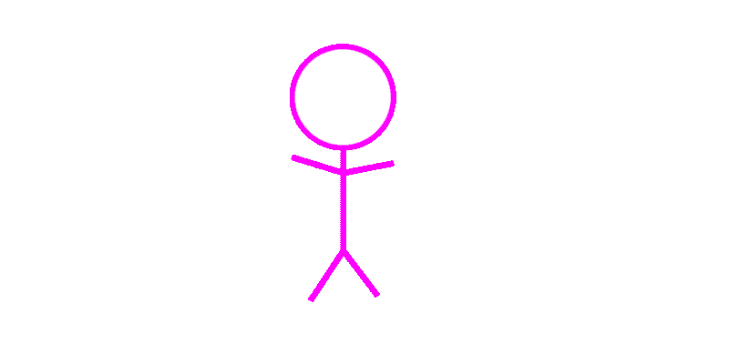
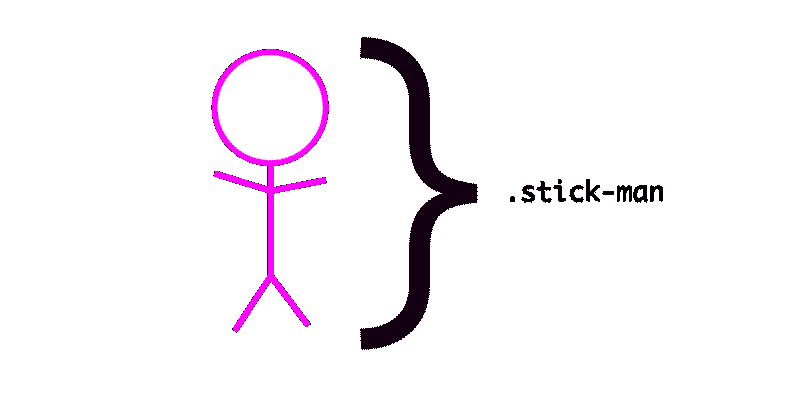
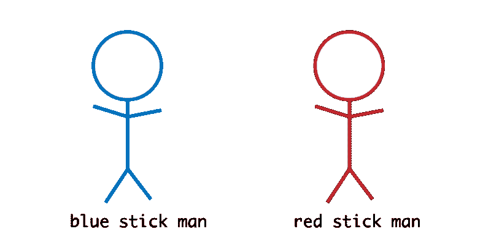
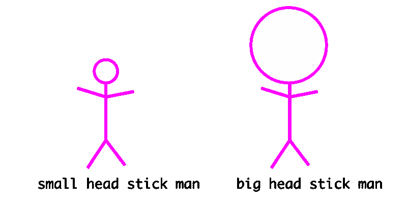

# CSS 命名约定将节省您的调试时间

> 原文：<https://www.freecodecamp.org/news/css-naming-conventions-that-will-save-you-hours-of-debugging-35cea737d849/>

我听到很多开发者说他们讨厌 CSS。根据我的经验，这是没有花时间学习 CSS 的结果。

CSS 并不是最漂亮的“语言”，但它已经成功地驱动了网络风格 20 多年了。做得还不错，是吧？

然而，随着你写的 CSS 越来越多，你很快就会发现一个很大的缺点。

维护 CSS 是非常困难的。

写得不好的 CSS 会很快变成一场噩梦。

这里有几个命名惯例，可以帮你减轻一点压力，节省大量时间。


you’ve been there before, haven’t you?

### 使用连字符分隔的字符串

如果你写了很多 JavaScript，那么用 camel case 写变量是常见的做法。

```
var redBox = document.getElementById('...')
```

很好，对吧？

问题是这种命名形式不太适合 CSS。

不要这样做:

```
.redBox {  border: 1px solid red;}
```

相反，请这样做:

```
.red-box {   border: 1px solid red;}
```

这是一个非常标准的 CSS 命名约定。可以说它更具可读性。

此外，它与 CSS 属性名称一致。

```
// Correct
```

```
.some-class {   font-weight: 10em}
```

```
// Wrong
```

```
.some-class {   fontWeight: 10em}
```

### BEM 命名约定

团队有不同的方法来编写 CSS 选择器。一些团队使用连字符分隔符，而其他团队更喜欢使用更结构化的命名约定 BEM。

通常，CSS 命名约定试图解决 3 个问题:

1.  要知道选择器是做什么的，只要看看它的名字就知道了
2.  仅仅通过观察就能知道选择器可以用在哪里
3.  要知道类名之间的关系，只需查看它们

你见过这样写的班名吗:

```
.nav--secondary {  ...}
```

```
.nav__header {  ...}
```

这就是 BEM 命名惯例。

### 向一个 5 岁的孩子解释 BEM

BEM 试图将整个用户界面分成小的可重用组件。

考虑下图:



It is an award winning image of a stick-man :)

不，不是获奖:(

棒人代表一个组件，比如一个设计块。

你可能已经猜到 BEM 中的 B 代表‘Block’。

在现实世界中，这个“块”可以代表一个网站导航、页眉、页脚或任何其他设计块。

按照上面解释的实践，这个组件的理想类名应该是`stick-man`。

组件的样式应该如下:

```
.stick-man {   }
```

我们在这里使用了分隔字符串。很好！



### e 代表元素

BEM 中的 E 代表元素。

整体设计很少孤立存在。

比如，棒人有一个`head`，两个华丽的`arms`，还有`feet`。


`head`、`feet`和`arms`都是组件中的元素。它们可以被视为子组件，即整个父组件的子组件。

使用 BEM 命名约定，元素类名是通过添加两个下划线**、**和元素名而得到的。

例如:

```
.stick-man__head {
```

```
}
```

```
.stick-man__arms {
```

```
}
```

```
.stick-man__feet {
```

```
}
```

### m 代表修饰符

BEM 中的 M 代表修饰语。

如果我们可以改装一辆`blue`或`red`的棍子车，那会怎么样？



在现实世界中，这可能是一个`red`按钮或`blue`按钮。这些是有问题的组件的修改。

使用 BEM，修饰符类名是通过在元素名后添加两个**连字符**得到的。

例如:

```
.stick-man--blue {
```

```
}
```

```
.stick-man--red {
```

```
}
```

最后一个示例显示了被修改的父组件。情况并非总是如此。

如果我们有不同尺寸的棍子会怎么样？



这次元素被修改了。记住，元素是整个包含块中的子组件。

`.stick-man`代表`Block`，`.stick-man__head`这个元素。

如上例所示，双连字符也可以这样使用:

```
.stick-man__head--small {
```

```
}
```

```
.stick-man__head--big {
```

```
}
```

同样，注意上面例子中双**连字符**的使用。这是用来表示修饰语。

现在你明白了。

这基本上就是 BEM 命名约定的工作方式。

就个人而言，对于简单的项目，我倾向于只使用连字符分隔符类名，对于更复杂的用户界面，我倾向于使用 BEM。

你可以[阅读更多关于 BEM 的](http://getbem.com/naming/)。

[**BEM - Block 元素修饰符**](http://getbem.com/naming/)
[*BEM - Block 元素修饰符是一种方法论，帮助你在…*getbem.com](http://getbem.com/naming/)中实现可重用组件和代码共享

### 为什么要使用命名约定？

> 计算机科学中只有两个难题:缓存失效和事物命名

给事物命名很难。我们正试图让事情变得更简单，并在未来用更易维护的代码来节省时间。

在 CSS 中正确命名将使你的代码更容易阅读和维护。

如果您选择使用 BEM 命名约定，那么通过查看标记就可以更容易地看到您的设计组件/模块之间的关系。

感觉自信吗？

### 带有 JavaScript 挂钩的 CSS 名称

今天是约翰第一天上班。

他被交给一个看起来像这样的`HTML`代码:

```
<div class="siteNavigation">
```

```
</div>
```

约翰读了这篇文章，意识到这可能不是给`CSS`中的事物命名的最佳方式。所以他继续重构代码库，就像这样:

```
<div class="site-navigation">
```

```
</div>
```

看起来不错，是吧？

约翰不知道，他已经破解了代码库？？？

怎么会？

在 JavaScript 代码的某个地方，有一个与前面的类名`siteNavigation`的关系:

```
//the Javasript code
```

```
const nav = document.querySelector('.siteNavigation')
```

所以，随着类名的改变，`nav`变量变成了`null`。

多么悲伤。

为了防止这种情况，开发人员想出了不同的策略。

#### 1.使用 js 类名

减少这种错误的一种方法是使用一个`**js-***` 类名来表示与所讨论的 DOM 元素的关系。

例如:

```
<div class="site-navigation js-site-navigation">
```

```
</div>
```

在 JavaScript 代码中:

```
//the Javasript code
```

```
const nav = document.querySelector('.js-site-navigation')
```

按照惯例，任何看到`**js-**site-navigation`类名的人都会理解 JavaScript 代码中与 DOM 元素有关系。

#### 2.使用 Rel 属性

我自己不使用这种技术，但我见过有人这样做。

你认识这个吗？

```
<link rel="stylesheet" type="text/css" href="main.css">
```

基本上， **rel 属性**定义了链接的资源与引用它的文档之间的关系。

在前面 John 的例子中，这种技术的支持者会这样做:

```
<div class="site-navigation" rel="js-site-navigation">
```

```
</div>
```

在 JavaScript 中:

```
const nav = document.querySelector("[rel='js-site-navigation']")
```

我对这种技术有所怀疑，但是你可能会在一些代码库中碰到它。这里的声明是，*“嗯，这与 Javascript 有关系，所以我使用 rel 属性来表示“*”。

网络是一个很大的地方，有很多不同的“方法”来解决同一个问题。

#### 3.不要使用数据属性

一些开发人员使用数据属性作为 JavaScript 挂钩。这不对。根据定义，数据属性用于**存储定制数据**。


Good use of data attributes. As seen on Twitter

编辑#1:正如一些了不起的人在评论部分提到的，如果人们使用“rel”属性，那么在某些情况下使用数据属性可能是没问题的。毕竟这是你的决定。

### 额外提示:多写 CSS 注释

这与命名约定无关，但也会节省您一些时间。

虽然许多 web 开发人员试图不写 JavaScript 注释或坚持写少数注释，但我认为您应该写更多的 CSS 注释。

由于 CSS 不是最优雅的“语言”，当你试图理解你的代码时，结构良好的注释可以节省时间。

不疼。

看看 Bootstrap [源代码](https://github.com/twbs/bootstrap/blob/v4-dev/scss/_carousel.scss)的注释有多好。

你不需要写评论说`color: red`会给出红色。但是，如果你使用的是不太明显的 CSS 技巧，请随意写下评论。

### 准备好成为职业选手了吗？

我已经创建了一个免费的 CSS 指南，让你的 CSS 技能立即得到提高。[获取免费电子书](https://pages.convertkit.com/0c2c62e04a/60e5d19f9b)。


Seven CSS Secrets you didn’t know about