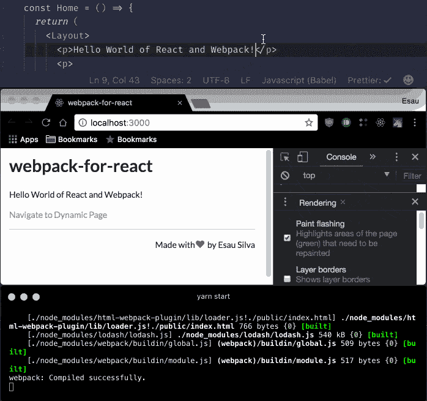
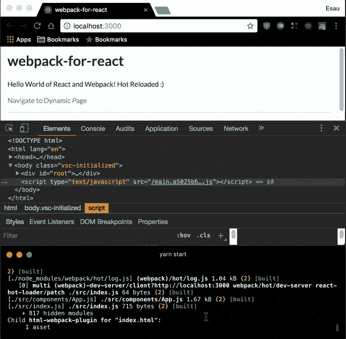
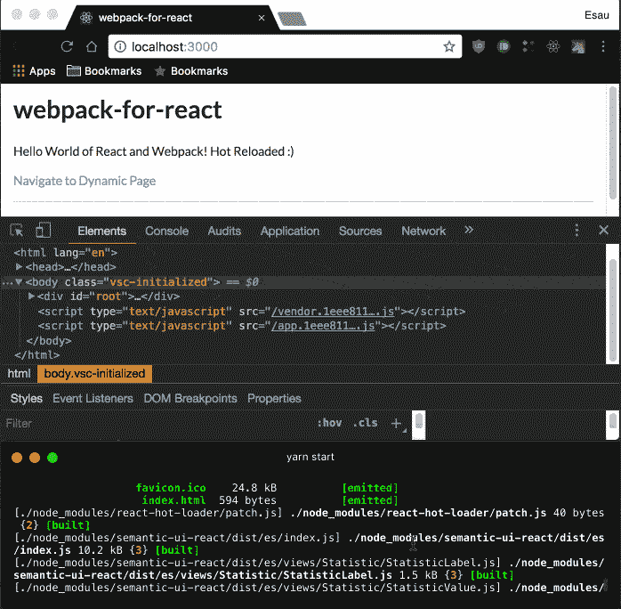
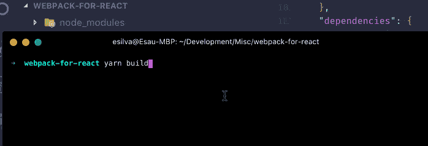
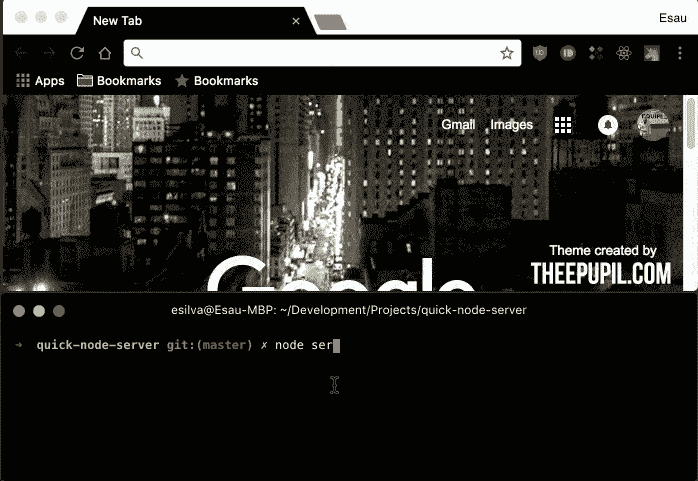
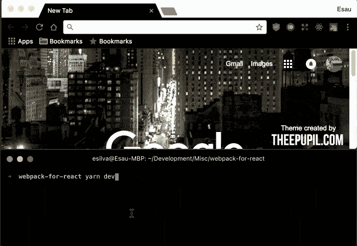

# 如何将 Webpack 与 React 一起使用:深入教程

> 原文：<https://www.freecodecamp.org/news/learn-webpack-for-react-a36d4cac5060/>

*更新到巴别塔 7*

在本教程中，我们将看到 React 的 Webpack 的基础知识，包括 [React 路由器](https://github.com/ReactTraining/react-router)、[热模块替换](https://github.com/gaearon/react-hot-loader) (HMR)、由[路由](https://github.com/theKashey/react-imported-component)和[供应商](https://webpack.js.org/plugins/commons-chunk-plugin/)进行代码拆分、生产配置等等。

在我们开始之前，这里是我们将在本教程中一起设置的功能的完整列表:

*   反应 16
*   反应路由器 5
*   作为 CSS 框架的语义 UI
*   热模块更换(HMR)
*   CSS 自动修复程序
*   CSS 模块
*   @ babel/plugin-proposal-class-properties
*   @ babel/plugin-语法-动态-导入
*   网络包 4
*   按路线和供应商进行代码拆分
*   Webpack 捆绑包分析器

#### 先决条件

预装以下软件:

*   [纱](https://yarnpkg.com/) —包装经理，类似于 [npm](https://www.npmjs.com/)
*   [节点](https://nodejs.org/en/)

您至少应该了解 React 和 React 路由器的一些基本知识。

***注意:*** *如果你愿意，可以使用 npm，虽然命令会略有不同。*

#### 初始依赖关系

让我们从创建我们的目录和`package.json`开始。

在您的终端中键入以下内容:

```
mkdir webpack-for-react && cd $_
yarn init -y
```

第一个命令将创建我们的目录并移入其中，然后我们初始化一个接受默认值的`package.json`。
如果您仔细查看，您会看到基本配置:

```
{
  "name": "webpack-for-react",
  "version": "1.0.0",
  "main": "index.js",
  "license": "MIT"
}
```

现在，我们安装初始(生产)依赖项和开发依赖项。
在您的终端中键入以下内容:

```
yarn add react react-dom prop-types react-router-dom semantic-ui-react
yarn add @babel/core babel-loader @babel/preset-env @babel/preset-react @babel/plugin-proposal-class-properties @babel/plugin-syntax-dynamic-import css-loader style-loader html-webpack-plugin webpack webpack-dev-server webpack-cli -D
```

正如所暗示的那样，开发依赖关系将只在开发阶段使用，而(生产)依赖关系是我们的应用程序在生产中所需要的。

```
{
  "name": "webpack-for-react",
  "version": "1.0.0",
  "main": "index.js",
  "license": "MIT",
  "dependencies": {
    "react": "^16.2.0",
    "react-dom": "^16.2.0",
    "prop-types": "^15.6.2",
    "react-router-dom": "^4.2.2",
    "semantic-ui-react": "^0.77.1"
  },
  "devDependencies": {
    "@babel/core": "^7.0.0",
    "@babel/plugin-proposal-class-properties": "^7.0.0",
    "@babel/plugin-syntax-dynamic-import": "^7.0.0",
    "@babel/preset-env": "^7.0.0",
    "@babel/preset-react": "^7.0.0", 
    "babel-loader": "^8.0.1",
    "css-loader": "^0.28.10",
    "html-webpack-plugin": "^3.0.4",
    "style-loader": "^0.19.1",
    "webpack": "^4.0.0",
    "webpack-cli": "^2.0.14",
    "webpack-dev-server": "^3.0.0"
  }
}
```

***注意:*** *对以前创建的文件的修改将被加粗。*
***注意:*** *依赖版本可能与您在撰写本文时的版本不同。*

*   反应——我相信你知道什么是反应
*   [react-dom](https://reactjs.org/docs/react-dom.html) —为浏览器提供特定于 dom 的方法
*   [道具类型](https://github.com/facebook/prop-types)—React 道具的运行时类型检查
*   [react-router-dom](https://github.com/ReactTraining/react-router) —为浏览器提供路由功能
*   [语义-用户界面-反应](https://react.semantic-ui.com/introduction) — CSS 框架
*   [@babel/core](https://babeljs.io/docs/en/babel-core/) —对 babel 的核心依赖
*   Babel 是一个 transpiler，它将 JavaScript ES6 编译成 JavaScript ES5，允许你编写“来自未来”的 JavaScript，以便当前的浏览器能够理解它。[详细描述见 Quora](https://www.quora.com/What-exactly-is-BabelJs-Why-does-it-understand-JSX-React-components) 。
*   这个包允许使用 babel 和 webpack 传输 JavaScript 文件
*   [@babel/preset-env](https://babeljs.io/docs/en/next/babel-preset-env.html) —有了这个你就不用指定是要写 ES2015、ES2016 还是 ES2017 了。巴别塔会自动检测并相应传送。
*   @babel/preset-react —告诉 babel 我们将使用 react
*   [@ babel/plugin-proposal-class-properties](https://babeljs.io/docs/en/babel-plugin-proposal-class-properties)—使用类属性。我们在这个项目中不使用类属性，但是您很可能会在您的项目中使用它们
*   [@ babel/plugin-syntax-dynamic-import](https://babeljs.io/docs/en/babel-plugin-syntax-dynamic-import)—能够使用动态导入
*   [css-loader](https://webpack.js.org/loaders/css-loader/) —像我`mport/require()`一样解释`@import` 和`url()`，并将解析它们
*   html-webpack-plugin —可以为您的应用程序生成一个 html 文件，或者您可以提供一个模板
*   [样式加载器](https://webpack.js.org/loaders/style-loader/) —通过注入`<sty` le >标签将 CSS 添加到 DOM 中
*   [网页包](https://webpack.js.org/)—bundler 模块
*   [webpack-cli](https://github.com/webpack/webpack-cli) —命令行界面，Webpack 4.0.1 及最新版本需要
*   [webpack-dev-server](https://webpack.js.org/configuration/dev-server/) —为您的应用程序提供开发服务器

### 建立巴别塔

在根目录(`webpack-for-react`)中，我们创建了 Babel 配置文件。

```
touch .babelrc
```

此时你可以打开你最喜欢的编辑器(顺便说一下我的是 VS 代码)，然后将编辑器指向这个项目的根目录，打开`.babelrc`文件，复制如下:

```
{
  "presets": ["@babel/preset-env", "@babel/preset-react"],
  "plugins": [
    "@babel/plugin-syntax-dynamic-import",
    "@babel/plugin-proposal-class-properties"
  ]
}
```

这告诉 Babel 使用我们之前安装的预置(插件)。稍后当我们从 Webpack 中调用`babel-loader`时，它将在这里寻找知道该做什么。

### 设置 Webpack

现在好戏开始了！让我们创建 Webpack 配置文件。

在您的终端中键入以下内容:

```
touch webpack.config.js
```

打开`webpack.config.js`并复制以下内容:

```
const webpack = require('webpack');
const HtmlWebpackPlugin = require('html-webpack-plugin');

const port = process.env.PORT || 3000;

module.exports = {
  // Webpack configuration goes here
};
```

这是 Webpack 的基本*外壳*。我们要求`webpack`和`html-webpack-plugin`。如果环境变量 port 不存在，请提供一个默认端口并导出模块。

以下将为`webpack.config.js`补充(一个接一个)。

```
...
module.exports = {
  mode: 'development',
};
```

`mode`告诉 Webpack 该配置将用于`development`或`production`。“开发模式针对速度和开发人员体验进行了优化…生产默认值将为您提供一组用于部署应用程序的默认值( [webpack 4:模式和优化](https://medium.com/webpack/webpack-4-mode-and-optimization-5423a6bc597a))”。

```
...
module.exports = {
  entry: './src/index.js',
  output: {
    filename: 'bundle.[hash].js'
  },
};
```

要获得 Webpack 的运行实例，我们需要:

*   `entry` —指定应用程序的入口点；这是你的 React 应用程序存在的地方，也是捆绑过程开始的地方( [Docs](https://webpack.js.org/concepts/entry-points/)

*Webpack 4 引入了一些默认设置，所以如果你的配置中不包含`entry`，那么 Webpack 会假设你的入口点位于`./src`目录下，使得`entry`相对于 Webpack 3 是可选的。对于本教程，我决定离开`entry`,因为它让我们的入口点在哪里变得显而易见，但是如果你决定这样做，我们非常欢迎你删除它。*

*   `output` —告诉 Webpack 如何将编译后的文件写入磁盘( [Docs](https://webpack.js.org/concepts/output/) )
*   `filename` —这将是捆绑应用程序的文件名。文件名的`[hash]`部分将被 Webpack 在每次应用程序更改和重新编译时生成的散列所替换(有助于缓存)。

```
...
module.exports = {
  ...
  devtool: 'inline-source-map',
};
```

`devtool`将创建[源地图](https://developer.mozilla.org/en-US/docs/Tools/Debugger/How_to/Use_a_source_map)来帮助你调试你的应用程序。有几种类型的源地图，这个特殊的地图(`inline-source-map`)只在开发中使用。(更多选项参见[文档](https://webpack.js.org/configuration/devtool/))。

```
...
module.exports = {
  ...
  module: {
    rules: [

      // First Rule
      {
        test: /\.(js)$/,
        exclude: /node_modules/,
        use: ['babel-loader']
      },

      // Second Rule
      {
        test: /\.css$/,
        use: [
          {
            loader: 'style-loader'
          },
          {
            loader: 'css-loader',
            options: {
              modules: true,
              localsConvention: 'camelCase',
              sourceMap: true
            }
          }
        ]
      }
    ]
  },
};
```

*   [模块](https://webpack.js.org/configuration/module/) —您的应用程序将包括什么类型的模块，在我们的例子中，我们将支持 ESNext (Babel)和 CSS 模块
*   [规则](https://webpack.js.org/configuration/module/#module-rules) —我们如何处理每种不同类型的模块

#### **第一规则**

我们测试扩展名为`.js`的文件，不包括`node_modules`目录，并使用 Babel，通过`babel-loader`，向下转换成普通的 JavaScript(基本上，寻找我们的 React 文件)。

还记得我们在`.babelrc`的配置吗？这是巴贝尔看文件的地方。

#### **第二条规则**

我们测试扩展名为`.css`的 CSS 文件。这里我们使用两个加载器，`style-loader`和`css-loader`，来处理我们的 CSS 文件。然后我们指示`css-loader`使用 *CSS 模块*，camel case 并创建源地图。

**CSS 模块和 Camel Case**

这给了我们使用`import Styles from ‘./styles.css’`语法的能力(或者像这样的析构`import { style1, style2 } from ‘./styles.css’`)。

然后我们可以像这样在 React 应用程序中使用它:

```
...
<div className={Style.style1}>Hello World</div>
// or with the destructuring syntax
<div className={style1}>Hello World</div>
...
```

Camel case 使我们能够像这样编写 CSS 规则:

```
.home-button {...}
```

并在 React 文件中使用它，如下所示:

```
...
import { homeButton } from './styles.css'
...
...
module.exports = {
  ...
  plugins: [
    new HtmlWebpackPlugin({
      template: 'public/index.html',
      favicon: 'public/favicon.ico'
    })
  ],
};
```

这个部分是我们配置(顾名思义)插件的地方。

`html-webpack-plugin`接受具有不同选项的对象。在我们的例子中，我们指定了将要使用的 HTML 模板和 favicon。(更多选项请参考[文档](https://github.com/jantimon/html-webpack-plugin#configuration))。

稍后我们将为捆绑包分析器和 HMR 添加其他插件。

```
...
module.exports = {
  ...
  devServer: {
    host: 'localhost',
    port: port,
    historyApiFallback: true,
    open: true
  }
};
```

最后，我们配置开发服务器。我们将`localhost`指定为主机，将变量`port`指定为端口(如果您还记得，我们将端口 3000 指定给了这个变量)。我们将`historyApiFallback`设置为真，将`open`设置为真。这将自动打开浏览器并在 [http://localhost:3000 中启动您的应用程序。](http://localhost:3000.) ( [文档](https://webpack.js.org/configuration/dev-server/))

现在，下面是完整的 Webpack 配置。(`webpack.config.js`):

```
const webpack = require('webpack');
const HtmlWebpackPlugin = require('html-webpack-plugin');

const port = process.env.PORT || 3000;

module.exports = {
  mode: 'development',  
  entry: './src/index.js',
  output: {
    filename: 'bundle.[hash].js'
  },
  devtool: 'inline-source-map',
  module: {
    rules: [
      {
        test: /\.(js)$/,
        exclude: /node_modules/,
        use: ['babel-loader']
      },
      {
        test: /\.css$/,
        use: [
          {
            loader: 'style-loader'
          },
          {
            loader: 'css-loader',
            options: {
              modules: true,
              localsConvention: 'camelCase',
              sourceMap: true
            }
          }
        ]
      }
    ]
  },
  plugins: [
    new HtmlWebpackPlugin({
      template: 'public/index.html',
      favicon: 'public/favicon.ico'
    })
  ],
  devServer: {
    host: 'localhost',
    port: port,
    historyApiFallback: true,
    open: true
  }
};
```

### 创建 React 应用程序

我们将创建一个简单的 Hello World 应用程序，它有三个路径:一个 *home* ，一个 *page not found* 和一个 *dynamic page* ，我们将在稍后实现代码拆分时异步加载它们。

***注:*** *假设你对 React 和 React 路由器有了基本的了解，我就不赘述很多细节，只突出与本教程相关的内容。*

我们目前有以下项目结构:

```
|-- node_modules
|-- .babelrc
|-- package.json
|-- webpack.config.js
|-- yarn.lock
```

在您的终端中键入以下内容:

```
mkdir public && cd $_
touch index.html
```

我们创建一个`public`目录，移入其中，同时创建一个`index.html`文件。这里也是我们拥有`favicon`的地方。你可以从这里的[中抓取并复制到公共目录中。](https://github.com/esausilva/react-starter-boilerplate-hmr/blob/master/public/favicon.ico)

打开`index.html`文件，复制以下内容:

```
<!DOCTYPE html>
<html lang="en">

<head>
  <meta charset="UTF-8">
  <meta name="viewport" content="width=device-width, initial-scale=1.0">
  <meta http-equiv="X-UA-Compatible" content="ie=edge">
  <link rel="stylesheet" href="//cdnjs.cloudflare.com/ajax/libs/semantic-ui/2.2.13/semantic.min.css"></link>
  <title>webpack-for-react</title>
</head>

<body>
  <div id="root"></div>
</body>

</html>
```

这里没有什么(只是一个标准的 HTML 模板)，我们添加了语义 UI 样式表，还创建了一个 ID 为`root`的`div`。这是我们的 React 应用程序将呈现的地方。

回到您的终端，键入以下内容:

```
cd ..
mkdir src && cd $_
touch index.js
```

打开`index.js`并复制以下内容:

```
import React from 'react';
import ReactDOM from 'react-dom';
import App from './components/App';

ReactDOM.render(<App />, document.getElementById('root'));
```

在您的终端中键入以下内容:

```
mkdir components && cd $_
touch App.js Layout.js Layout.css Home.js DynamicPage.js NoMatch.js 
```

创建 React 组件文件后，我们有以下项目结构:

```
|-- node_modules
|-- public
    |-- index.html
    |-- favicon.ico
|-- src
    |-- components
        |-- App.js
        |-- DynamicPage.js
        |-- Home.js
        |-- Layout.css
        |-- Layout.js
        |-- NoMatch.js
    |-- index.js
|-- .babelrc
|-- package.json
|-- webpack.config.js
|-- yarn.lock
```

打开`App.js`并复制以下内容:

```
import React from 'react';
import { Switch, BrowserRouter as Router, Route } from 'react-router-dom';

import Home from './Home';
import DynamicPage from './DynamicPage';
import NoMatch from './NoMatch';

const App = () => {
  return (
    <Router>
      <div>
        <Switch>
          <Route exact path="/" component={Home} />
          <Route exact path="/dynamic" component={DynamicPage} />
          <Route component={NoMatch} />
        </Switch>
      </div>
    </Router>
  );
};

export default App;
```

我们用 React 路由器创建了我们的基本“外壳”，并且有一个*主页*、*动态页面*和*页面未找到*路由。

打开`Layout.css`并复制以下内容:

```
.pull-right {
  display: flex;
  justify-content: flex-end;
}

.h1 {
  margin-top: 10px !important;
  margin-bottom: 20px !important;
}
```

打开`Layout.js`并复制以下内容:

```
import React from 'react';
import { Link } from 'react-router-dom';
import { Header, Container, Divider, Icon } from 'semantic-ui-react';

import { pullRight, h1 } from './layout.css';

const Layout = ({ children }) => {
  return (
    <Container>
      <Link to="/">
        <Header as="h1" className={h1}>
          webpack-for-react
        </Header>
      </Link>
      {children}
      <Divider />
      <p className={pullRight}>
        Made with <Icon name="heart" color="red" /> by Esau Silva
      </p>
    </Container>
  );
};

export default Layout;
```

这是我们定义站点布局的容器组件。利用 CSS 模块，我们从`layout.css`导入两个 CSS 规则。还要注意我们是如何将*骆驼案*用于`pullRight`的。

打开`Home.js`并复制以下内容:

```
import React from 'react';
import { Link } from 'react-router-dom';

import Layout from './Layout';

const Home = () => {
  return (
    <Layout>
      <p>Hello World of React and Webpack!</p>
      <p>
        <Link to="/dynamic">Navigate to Dynamic Page</Link>
      </p>
    </Layout>
  );
};

export default Home;
```

打开`DynamicPage.js`并复制以下内容:

```
import React from 'react';
import { Header } from 'semantic-ui-react';

import Layout from './Layout';

const DynamicPage = () => {
  return (
    <Layout>
      <Header as="h2">Dynamic Page</Header>
      <p>This page was loaded asynchronously!!!</p>
    </Layout>
  );
};

export default DynamicPage;
```

打开`NoMatch.js`并复制以下内容:

```
import React from 'react';
import { Icon, Header } from 'semantic-ui-react';

import Layout from './Layout';

const NoMatch = () => {
  return (
    <Layout>
      <Icon name="minus circle" size="big" />
      <strong>Page not found!</strong>
    </Layout>
  );
};

export default NoMatch;
```

我们已经完成了 React 组件的创建。运行我们的应用程序之前的最后一步，打开`package.json`并添加粗体行:

```
{
  "name": "webpack-for-react",
  "version": "1.0.0",
  "main": "index.js",
  "license": "MIT",
  "scripts": {
    "start": "webpack-dev-server"
  },
  "dependencies": {
    "react": "^16.2.0",
    "react-dom": "^16.2.0",
    "prop-types": "^0.4.0",
    "react-router-dom": "^4.2.2",
    "semantic-ui-react": "^0.77.1"
  },
  "devDependencies": {
    "@babel/core": "^7.0.0",
    "@babel/plugin-proposal-class-properties": "^7.0.0",
    "@babel/plugin-syntax-dynamic-import": "^7.0.0",
    "@babel/preset-env": "^7.0.0",
    "@babel/preset-react": "^7.0.0",
    "babel-loader": "^8.0.1",
    "css-loader": "^0.28.10",
    "html-webpack-plugin": "^3.0.4",
    "style-loader": "^0.19.1",
    "webpack": "^4.0.0",
    "webpack-cli": "^2.0.14",
    "webpack-dev-server": "^3.0.0"
  }
}
```

我们添加了`scripts`键和`start`键。这将允许我们使用 Webpack 开发服务器运行 React。如果不指定配置文件，`webpack-dev-server`将在根目录中寻找`webpack.config.js`文件作为默认的配置条目。

现在是关键时刻了！在您的终端中键入以下内容(记住在根目录中)，Yarn 将调用我们的`start`脚本。

```
yarn start
```


Running React

现在我们有了一个由我们自己的 Webpack 配置支持的 React 应用程序。注意，在 GIF 的末尾，我突出显示了为我们生成的捆绑 JavaScript 文件 Webpack，正如我们在配置中指出的，文件名有一个惟一的散列值`bundle.d505bbab002262a9bc07.js`。

### 设置热模块更换(HMR)

回到你的终端，安装 [React Hot Loader](https://github.com/gaearon/react-hot-loader) 作为开发依赖。

```
yarn add react-hot-loader @hot-loader/react-dom -D
```

打开`.babelrc`并添加第 3 行和第 9 行。不要忘记在第 3 行的末尾加上逗号(，):

```
{
  "presets": [
    ["@babel/preset-env", { "modules": false }],
    "@babel/preset-react"
  ],
  "plugins": [
    "@babel/plugin-syntax-dynamic-import",
    "@babel/plugin-proposal-class-properties",
    "react-hot-loader/babel"
  ]
}
```

打开`webpack.config.js`，修改如下。

为了简洁起见，我只包括了相关的代码，并省略了保持不变的代码。

```
...
module.exports = {
  entry: './src/index.js',
  output: {
    ...
    publicPath: '/'
  },
  resolve: {
    alias: {
      "react-dom": "@hot-loader/react-dom",
    },
  },
  ...
  plugins: [
    new webpack.HotModuleReplacementPlugin(),
    ...
  ],
  devServer: {
    ...
    hot: true
  }
};
```

*   `publicPath: ‘/’` —如果没有热重装，嵌套路由将无法正常工作
*   `webpack.HotModuleReplacementPlugin` —在 HMR 更新时，在浏览器终端中打印更多可读的模块名称
*   `hot: true` —在服务器上启用 HMR
*   `resolve: alias` —将`react-dom`替换为`hot-loader`中的自定义`react-dom`

打开`index.js`并更改如下。

```
import { hot } from "react-hot-loader/root";
import React from "react";
import ReactDOM from "react-dom";
import App from "./components/App";

import "./index.css";

const render = (Component) =>
  ReactDOM.render(<Component />, document.getElementById("root"));

render(hot(App));
```

现在我们准备测试 HMR！回到终端，运行你的应用程序，进行更改，然后观察应用程序的更新，无需刷新整个页面。

```
yarn start
```



HMR in action

更新文件后，页面会在没有完全刷新的情况下发生变化。为了在浏览器中显示这一变化，我在 Chrome DevTools 中选择了**渲染- >绘画闪光**，以绿色突出显示页面中发生变化的区域。我还在终端中突出显示了为实现这一点而发送给浏览器的更改 Webpack。

### 代码拆分

通过[代码分割](https://webpack.js.org/guides/code-splitting/)，你可以拥有多个包，每个包异步或并行加载，而不是将你的应用放在一个大的包中。此外，您可以将供应商代码与您的应用程序代码分开，这可能会减少加载时间。

#### 按路线

有几种方法可以通过路由实现代码分割，但是在我们的例子中，我们将使用 [react-imported-component](https://github.com/theKashey/react-imported-component) 。

我们还想在用户导航到不同的路线时显示一个*装载微调器*。这是一个很好的实践，因为我们不希望用户在等待新页面加载时盯着空白屏幕。因此，我们将创建一个*加载*组件。

然而，如果新页面加载非常快，我们不希望用户在几毫秒内看到闪烁的加载微调器，所以我们将延迟*加载*组件 300 毫秒。为此，我们将使用[反应-延迟-渲染](https://github.com/arnthor3/react-delay-render)。

首先安装两个附加的依赖项。

在您的终端中键入以下内容:

```
yarn add react-imported-component react-delay-render
```

现在我们将创建*加载*组件。

在您的终端中键入以下内容:

```
touch ./src/components/Loading.js
```

打开`Loading.js`并复制以下内容:

```
import React from 'react';
import { Loader } from 'semantic-ui-react';
import ReactDelayRender from 'react-delay-render';

const Loading = () => <Loader active size="massive" />;

export default ReactDelayRender({ delay: 300 })(Loading);
```

现在我们已经有了*加载*组件，打开`App.js`并修改如下:

```
import React from 'react';
import { Switch, BrowserRouter as Router, Route } from 'react-router-dom';
import importedComponent from 'react-imported-component';

import Home from './Home';
import Loading from './Loading';

const AsyncDynamicPAge = importedComponent(
  () => import(/* webpackChunkName:'DynamicPage' */ './DynamicPage'),
  {
    LoadingComponent: Loading
  }
);
const AsyncNoMatch = importedComponent(
  () => import(/* webpackChunkName:'NoMatch' */ './NoMatch'),
  {
    LoadingComponent: Loading
  }
);

const App = () => {
  return (
    <Router>
      <div>
        <Switch>
          <Route exact path="/" component={Home} />
          <Route exact path="/dynamic" component={AsyncDynamicPAge} />
          <Route component={AsyncNoMatch} />
        </Switch>
      </div>
    </Router>
  );
};

export default App;
```

这将创建三个包或块，一个用于`DynamicPage`组件，一个用于`NoMatch`组件，一个用于主应用程序。

让我们也改变包文件名。打开`webpack.config.js`并按如下方式进行更改:

```
...
module.exports = {
  ...
  output: {
    filename: '[name].[hash].js',
    ...
  },
}
```

是时候运行这个应用程序了，看看按路线进行代码分割的效果。

```
yarn start
```



Code Splitting by Route

在 GIF 中，我首先突出显示了 Webpack 在终端中创建的三个不同的块。然后我强调，在应用程序启动时，只加载了主卡盘。最后，我们看到点击*导航到动态页面*时，对应于该页面的块被异步加载。

我们还看到，与未找到的页面相对应的块从未被加载，从而节省了用户带宽。

#### 按供应商

现在让我们按照供应商来划分应用程序。打开`webpack.config.js`并进行以下更改:

```
...
module.exports = {
  entry: {
    vendor: ['semantic-ui-react'],
    app: './src/index.js'
  },
  ...
  optimization: {
    splitChunks: {
      cacheGroups: {
        styles: {
          name: 'styles',
          test: /\.css$/,
          chunks: 'all',
          enforce: true
        },
        vendor: {
          chunks: 'initial',
          test: 'vendor',
          name: 'vendor',
          enforce: true
        }
      }
    }
  },
  ...
};
```

*   `entry.vendor: [‘semantic-ui-react’]` —指定我们希望从我们的主应用程序中提取哪个库并放入*供应商*块中
*   `optimization` —如果您省略此条目，Webpack 仍将按供应商分割您的应用程序，但是我注意到捆绑包的大小很大，添加此条目后，捆绑包的大小显著减小。(我是从 [Webpack 4 迁移草案](https://github.com/webpack/webpack/issues/6357)CommonsChunkPlugin->初始供应商 ch unk 得到的)

***注意:*** *以前 Webpack 3 使用`CommonsChunkPlugin`来按供应商和/或公共资源分割代码，但是在 Webpack 4 中不赞成使用它，现在默认启用它的许多功能。随着`CommonsChunkPlugin`的移除，他们为那些需要对缓存策略进行细粒度控制的人增加了`optimization.splitChunks`(参见[这个](https://gist.github.com/sokra/1522d586b8e5c0f5072d7565c2bee693)以获得深入的解释)。*

在“终端”中，启动应用程序:

```
yarn start
```



Code Splitting by Vendor

在 terminal 中，我突出显示了前面的三个块以及新的*供应商*块。然后，当我们检查 HTML 时，我们看到供应商和应用程序块都已加载。

由于我们已经对我们的 Webpack 配置进行了几次更新，您将在下面找到完整的`webpack.config.js`文件。

```
const webpack = require('webpack');
const HtmlWebpackPlugin = require('html-webpack-plugin');
const port = process.env.PORT || 3000;
module.exports = {
  mode: 'development',
  entry: {
    vendor: ['semantic-ui-react'],
    app: './src/index.js'
  },
  output: {
    filename: '[name].[hash].js'
  },
  resolve: {
    alias: {
      "react-dom": "@hot-loader/react-dom",
    },
  },
  devtool: 'inline-source-map',
  module: {
    rules: [
      {
        test: /\.(js)$/,
        exclude: /node_modules/,
        use: ['babel-loader']
      },
      {
        test: /\.css$/,
        use: [
          {
            loader: 'style-loader'
          },
          {
            loader: 'css-loader',
            options: {
              modules: true,
              localsConvention: 'camelCase',
              sourceMap: true
            }
          }
        ]
      }
    ]
  },
  optimization: {
    splitChunks: {
      cacheGroups: {
        styles: {
          name: 'styles',
          test: /\.css$/,
          chunks: 'all',
          enforce: true
        },
        vendor: {
          chunks: 'initial',
          test: 'vendor',
          name: 'vendor',
          enforce: true
        }
      }
    }
  },
  plugins: [
    new webpack.HotModuleReplacementPlugin(),
    new HtmlWebpackPlugin({
      template: 'public/index.html',
      favicon: 'public/favicon.ico'
    })
  ],
  devServer: {
    host: 'localhost',
    port: port,
    historyApiFallback: true,
    open: true,
    hot: true
  }
};
```

### 生产型

将 Webpack 配置从`webpack.config.js`重命名为`webpack.config.**development**.js`。然后复制一份，命名为`webpack.config.production.js`。

在您的终端中键入以下内容:

```
mv webpack.config.js webpack.config.development.js
cp webpack.config.development.js webpack.config.production.js
```

我们将需要一个开发依赖，[提取文本插件](https://github.com/webpack-contrib/extract-text-webpack-plugin)。从他们的文档中:“它将条目块中所有需要的`*.css`模块移动到一个单独的 CSS 文件中。因此，您的样式不再内联到 JS 包中，而是在一个单独的 CSS 文件中(`styles.css`)。如果您的样式表总容量很大，它会更快，因为 CSS 包是与 JS 包并行加载的。”

在您的终端中键入以下内容:

```
yarn add mini-css-extract-plugin -D
```

打开`webpack.config.production.js`并进行以下粗体更改:

在这里做一些不同的事情…我会用行内注释添加解释。

```
const path = require('path');
const webpack = require('webpack');
const HtmlWebpackPlugin = require('html-webpack-plugin');
const MiniCssExtractPlugin = require('mini-css-extract-plugin');
module.exports = {
  mode: 'production',
  entry: {
    vendor: ['semantic-ui-react'],
    app: './src/index.js'
  },
  output: {
    // We want to create the JavaScript bundles under a 
    // 'static' directory
    filename: 'static/[name].[hash].js',
    // Absolute path to the desired output directory. In our 
    //case a directory named 'dist'
    // '__dirname' is a Node variable that gives us the absolute
    // path to our current directory. Then with 'path.resolve' we 
    // join directories
    // Webpack 4 assumes your output path will be './dist' so you 
    // can just leave this
    // entry out.
    path: path.resolve(__dirname, 'dist'),
    publicPath: '/'
  },
  // Change to production source maps
  devtool: 'source-map',
  module: {
    rules: [
      {
        test: /\.(js)$/,
        exclude: /node_modules/,
        use: ['babel-loader']
      },
      {
        test: /\.css$/,
          use: [
            {
              // We configure 'MiniCssExtractPlugin'              
              loader: MiniCssExtractPlugin.loader,
            }, 
            {
              loader: 'css-loader',
              options: {
                modules: true,
                // Allows to configure how many loaders 
                // before css-loader should be applied
                // to @import(ed) resources
                importLoaders: 1,
                localsConvention: 'camelCase',
                // Create source maps for CSS files
                sourceMap: true
              }
            },
            {
              // PostCSS will run before css-loader and will 
              // minify and autoprefix our CSS rules.
              loader: 'postcss-loader',
            }
          ]
      }
    ]
  },
  optimization: {
    splitChunks: {
      cacheGroups: {
        styles: {
          name: 'styles',
          test: /\.css$/,
          chunks: 'all',
          enforce: true
        },
        vendor: {
          chunks: 'initial',
          test: 'vendor',
          name: 'vendor',
          enforce: true
        }
      }
    }
  },
  plugins: [
    new HtmlWebpackPlugin({
      template: 'public/index.html',
      favicon: 'public/favicon.ico'
    }),

    // Create the stylesheet under 'styles' directory
    new MiniCssExtractPlugin({
      filename: 'styles/styles.[hash].css'
    })
  ]
};
```

注意我们移除了`port`变量、与 HMR 相关的插件和`devServer`条目。

此外，由于我们将 PostCSS 添加到了产品配置中，我们需要安装它并为它创建一个配置文件。

在您的终端中键入以下内容:

```
yarn add postcss-loader autoprefixer cssnano postcss-preset-env -D
touch postcss.config.js
```

打开`postcss.config.js`并复制以下内容:

```
const postcssPresetEnv = require('postcss-preset-env');
module.exports = {
  plugins: [
    postcssPresetEnv({
      browsers: ['>0.25%', 'not ie 11', 'not op_mini all']
    }),
    require('cssnano')
  ]
};
```

在这里我们指定我们想要什么浏览器来支持和缩小 CSS 输出。

现在，在我们创建产品构建之前的最后一步，我们需要在`package.json`中创建一个*构建*脚本。

打开文件，对`scripts`部分进行以下更改:

```
...
"scripts": {
  "dev":"webpack-dev-server --config webpack.config.development.js",
  "prebuild": "rimraf dist",
  "build": "cross-env NODE_ENV=production webpack -p --config webpack.config.production.js"
},
...
```

这里首先要注意的是，我们将启动脚本从`start`更改为`dev`，然后我们添加了另外两个脚本`prebuild`和`build`。

最后，我们指出在开发或生产中使用哪种配置。

*   `prebuild` —将在构建脚本之前运行，并删除我们最后一次生产构建创建的`dist`目录。为此，我们使用了库 [rimraf](https://github.com/isaacs/rimraf)
*   首先我们使用[跨环境](https://github.com/kentcdodds/cross-env)库，以防有人使用 Windows。这样用`NODE_ENV`设置环境变量就可以了。然后我们用`-p`标志调用 Webpack，告诉它为生产优化这个构建，最后我们指定生产配置。

在您的终端中安装我们在`package.json`中包含的两个新的依赖项:

```
yarn add rimraf cross-env -D
```

在创建生产构建之前，让我们看一下我们的新项目结构:

```
|-- node_modules
|-- public
    |-- index.html
    |-- favicon.ico
|-- src
    |-- components
        |-- App.js
        |-- DynamicPage.js
        |-- Home.js
        |-- Layout.css
        |-- Layout.js
        |-- Loading.js
        |-- NoMatch.js
    |-- index.js
|-- .babelrc
|-- package.json
|-- postcss.config.js
|-- webpack.config.development.js
|-- webpack.config.production.js
|-- yarn.lock
```

最后，我们可以创建我们的生产包。

在您的终端中键入以下内容:

```
yarn build
```



Build production bundle

正如您所注意到的，在我们运行了`build`脚本之后，Webpack 创建了一个包含我们的生产就绪应用程序的`dist`目录。现在检查创建的文件，注意它们被缩小了，并且每个文件都有一个对应的源映射。您还会注意到 PostCSS 在 CSS 文件中添加了自动前缀。

现在，我们拿出生产文件，启动一个节点服务器来为我们的站点提供服务，结果如下:



Running the production build

***注:*** *我用的是上面 GIF 中的[这个服务器](https://github.com/esausilva/quick-node-server)来服务我们的生产文件。*

此时，我们有两个工作的 Webpack 配置，一个用于开发，一个用于生产。但是，由于这两种配置非常相似，它们共享许多相同的设置。如果我们想添加其他内容，我们必须将它添加到两个配置文件中。让我们解决这个不便。

### Webpack 合成

让我们从安装 [webpack-merge](https://github.com/survivejs/webpack-merge) 和[粉笔](https://github.com/chalk/chalk)作为开发依赖开始。

在您的终端中键入以下内容:

```
yarn add webpack-merge chalk -D
```

我们还需要几个新目录和几个新文件。

在您的终端中键入以下内容:

```
mkdir -p build-utils/addons
cd build-utils
touch build-validations.js common-paths.js webpack.common.js webpack.dev.js webpack.prod.js
```

现在让我们看看我们的新项目结构:

```
|-- build-utils
    |-- addons
    |-- build-validations.js
    |-- common-paths.js
    |-- webpack.common.js
    |-- webpack.dev.js
    |-- webpack.prod.js
|-- node_modules
|-- public
    |-- index.html
    |-- favicon.ico
|-- src
    |-- components
        |-- App.js
        |-- DynamicPage.js
        |-- Home.js
        |-- Layout.css
        |-- Layout.js
        |-- Loading.js
        |-- NoMatch.js
    |-- index.js
|-- .babelrc
|-- package.json
|-- postcss.config.js
|-- webpack.config.development.js
|-- webpack.config.production.js
|-- yarn.lock
```

打开`common-paths.js`并复制以下内容:

```
const path = require('path');
const PROJECT_ROOT = path.resolve(__dirname, '../');

module.exports = {
  projectRoot: PROJECT_ROOT,
  outputPath: path.join(PROJECT_ROOT, 'dist'),
  appEntry: path.join(PROJECT_ROOT, 'src')
};
```

顾名思义，这里我们定义了 Webpack 配置的公共路径。`PROJECT_ROOT`需要查找一个目录，因为我们在`build-utils`目录下工作(在我们的项目中，实际根路径的下一级)。

打开`build-validations.js`并复制以下内容:

```
const chalk = require('chalk');
const ERR_NO_ENV_FLAG = chalk.red(
  `You must pass an --env.env flag into your build for webpack to work!`
);

module.exports = {
  ERR_NO_ENV_FLAG
};
```

稍后当我们修改我们的`package.json`时，我们将需要脚本中的`–env.env`标志。这些验证是为了验证该标志是否存在；如果没有，它将抛出一个错误。

在接下来的三个文件中，我们将把 Webpack 配置分为开发和生产共享的配置、仅用于开发的配置和仅用于生产的配置。

打开`webpack.common.js`并复制以下内容:

```
const commonPaths = require('./common-paths');
const webpack = require('webpack');
const HtmlWebpackPlugin = require('html-webpack-plugin');
const config = {
  entry: {
    vendor: ['semantic-ui-react']
  },
  output: {
    path: commonPaths.outputPath,
    publicPath: '/'
  },
  module: {
    rules: [
      {
        test: /\.(js)$/,
        exclude: /node_modules/,
        use: ['babel-loader']
      }
    ]
  },
  optimization: {
    splitChunks: {
      cacheGroups: {
        styles: {
          name: 'styles',
          test: /\.css$/,
          chunks: 'all',
          enforce: true
        },
        vendor: {
          chunks: 'initial',
          test: 'vendor',
          name: 'vendor',
          enforce: true
        }
      }
    }
  },
  plugins: [
    new HtmlWebpackPlugin({
      template: 'public/index.html',
      favicon: 'public/favicon.ico'
    })
  ]
};
module.exports = config;
```

我们基本上提取出了`webpack.config.development.js`和`webpack.config.production.js`之间共享的内容，并将其转移到这个文件中。在顶部，我们要求`common-paths.js`设置`output.path`。

打开`webpack.dev.js`并复制以下内容:

```
const commonPaths = require('./common-paths');
const webpack = require('webpack');
const port = process.env.PORT || 3000;
const config = {
  mode: 'development',
  entry: {
    app: `${commonPaths.appEntry}/index.js`
  },
  output: {
    filename: '[name].[hash].js'
  },
  resolve: {
    alias: {
      "react-dom": "@hot-loader/react-dom",
    },
  },
  devtool: 'inline-source-map',
  module: {
    rules: [
      {
        test: /\.css$/,
        use: [
          {
            loader: 'style-loader'
          },
          {
            loader: 'css-loader',
            options: {
              modules: true,
              localsConvention: 'camelCase',
              sourceMap: true
            }
          }
        ]
      }
    ]
  },
  plugins: [
    new webpack.HotModuleReplacementPlugin()
  ],
  devServer: {
    host: 'localhost',
    port: port,
    historyApiFallback: true,
    hot: true,
    open: true
  }
};
module.exports = config;
```

这与前一个文件的概念相同。这里我们提取了仅用于开发的配置。

打开`webpack.prod.js`并复制以下内容:

```
const commonPaths = require('./common-paths');
const webpack = require('webpack');
const MiniCssExtractPlugin = require('mini-css-extract-plugin');
const config = {
  mode: 'production',
  entry: {
    app: [`${commonPaths.appEntry}/index.js`]
  },
  output: {
    filename: 'static/[name].[hash].js'
  },
  devtool: 'source-map',
  module: {
    rules: [
      {
        test: /\.css$/,
          use: [
            {
              // We configure 'MiniCssExtractPlugin'              
              loader: MiniCssExtractPlugin.loader,
            }, 
            {
              loader: 'css-loader',
              options: {
                modules: true,
                importLoaders: 1,
                localsConvention: 'camelCase',
                sourceMap: true
              }
            },
            {
              loader: 'postcss-loader'
            }
          ]
      }
    ]
  },
  plugins: [
    new MiniCssExtractPlugin({
      filename: 'styles/styles.[hash].css'
    })
  ]
};
module.exports = config;
```

我们提取了仅用于生产的配置。

既然我们已经将共享配置和特定于开发和生产的配置放在单独的文件中，那么是时候将所有内容放在一起了。

在终端中，如果您仍在`build-utils`目录中，请向上一级到项目的根目录，然后删除以前的 Webpack 配置并创建一个新的 Webpack 配置。命名为`webpack.config.js`。

在您的终端中键入以下内容:

```
cd ..
rm webpack.config.development.js webpack.config.production.js
touch webpack.config.js
```

在配置`webpack.config.js`之前，让我们打开`package.json`并更新`scripts`部分。

按如下方式修改该部分:

```
...
"scripts": {
  "dev": "webpack-dev-server --env.env=dev",
  "prebuild": "rimraf dist",
  "build": "cross-env NODE_ENV=production webpack -p --env.env=prod"
},
...
```

由于我们移除了`–config`标志，Webpack 现在将寻找默认配置，即`webpack.config.js`。现在我们使用[–env](https://webpack.js.org/guides/environment-variables/)标志将环境变量传递给 Webpack，`env=dev`用于开发，`env=prod`用于生产。

打开`webpack.config.js`并复制以下内容:

*带行内注释的解释。*

```
const buildValidations = require('./build-utils/build-validations');
const commonConfig = require('./build-utils/webpack.common');

const webpackMerge = require('webpack-merge');

// We can include Webpack plugins, through addons, that do 
// not need to run every time we are developing.
// We will see an example when we set up 'Bundle Analyzer'
const addons = (/* string | string[] */ addonsArg) => {

  // Normalize array of addons (flatten)
  let addons = [...[addonsArg]] 
    .filter(Boolean); // If addons is undefined, filter it out

  return addons.map(addonName =>
    require(`./build-utils/addons/webpack.${addonName}.js`)
  );
};

// 'env' will contain the environment variable from 'scripts' 
// section in 'package.json'.
// console.log(env); => { env: 'dev' }
module.exports = env => {

  // We use 'buildValidations' to check for the 'env' flag
  if (!env) {
    throw new Error(buildValidations.ERR_NO_ENV_FLAG);
  }

  // Select which Webpack configuration to use; development 
  // or production
  // console.log(env.env); => dev
  const envConfig = require(`./build-utils/webpack.${env.env}.js`);

  // 'webpack-merge' will combine our shared configurations, the 
  // environment specific configurations and any addons we are
  // including
  const mergedConfig = webpackMerge(
    commonConfig,
    envConfig,
    ...addons(env.addons)
  );

  // Then return the final configuration for Webpack
  return mergedConfig;
};
```

现在，这可能看起来像很多设置，但从长远来看，它会派上用场。

此时，您可以启动应用程序或构建生产文件，一切都将按预期运行(抱歉，这次没有 GIF)。

```
yarn dev
yarn build
```

***注:*** *这种“Webpack 作文”的技巧摘自 [Webpack Academy](https://webpack.academy/) ，是肖恩·拉金的一门免费课程，我推荐上这门课是为了了解更多关于 Webpack 的知识，而不是为了具体反应。*

### 额外收获:设置 Webpack 捆绑包分析器

您不一定需要 [Webpack Bundle Analyzer](https://github.com/webpack-contrib/webpack-bundle-analyzer) ，但是当您试图优化您的构建时，它会派上用场。

首先安装依赖项并创建配置文件。

在您的终端中键入以下内容:

```
yarn add webpack-bundle-analyzer -D
touch build-utils/addons/webpack.bundleanalyzer.js
```

打开`webpack.bundleanalyzer.js`并复制以下内容:

```
const BundleAnalyzerPlugin = require('webpack-bundle-analyzer')
  .BundleAnalyzerPlugin;

module.exports = {
  plugins: [
    new BundleAnalyzerPlugin({
      analyzerMode: 'server'
    })
  ]
};
```

我们只是为 Webpack 导出插件部分，其中包括 Bundle Analyzer。然后`webpack-merge`会将其合并到最终的 Webpack 配置中。还记得`webpack.config.js`中的*插件*吗？这就是它出现的地方。

最后一步，让我们打开`package.json`并包含如下新脚本:

```
"scripts": {
  "dev": "webpack-dev-server --env.env=dev",
  "dev:bundleanalyzer": "yarn dev --env.addons=bundleanalyzer",
  "prebuild": "rimraf dist",
  "build": "cross-env NODE_ENV=production webpack -p --env.env=prod",
  "build:bundleanalyzer": "yarn build --env.addons=bundleanalyzer"
},
```

*   `dev:bundleanalyzer` —调用`dev`脚本并传递一个新的环境变量`addons=bundleanalyzer`
*   `build:bundleanalyzer` —调用`build`脚本并传递一个新的环境变量`addons=bundleanalyzer`

是时候运行带有捆绑包分析器插件的应用程序了。

在您的终端中键入以下内容:

```
yarn dev:bundleanalyzer
```



Webpack Bundle Abalyzer

该应用程序与 Webpack Bundle Analyzer 一起启动。

在 Webpack Composition 中包含插件是非常有用的，因为有很多插件你只在特定的时候想使用。

### 结论

首先，你可以在 [GitHub 库](https://github.com/esausilva/react-starter-boilerplate-hmr)上获取完整代码。

你坚持到了最后。恭喜你！！？现在，您已经了解了 React 的 Webpack 的基础知识(以及更多)，您可以继续探索和学习更高级的特性和技术。

谢谢你的阅读，我希望你喜欢它。如果你有任何问题、建议或更正，请在下面的评论中告诉我。别忘了给这篇文章一个分享和一些掌声？？。

你可以在 [Medium](https://medium.com/@_esausilva) 、 [Twitter](https://twitter.com/_esausilva) 、 [GitHub](https://github.com/esausilva/) 、 [LinkedIn](https://www.linkedin.com/in/esausilva/) 或者全部关注我。

本文原载于我的个人博客网站。

* * *

**2019 年 8 月 25 日更新:** 我一直在建一个祷告 web app，叫“**我的安静时光——祷告日志**”。如果你想继续参与，请通过以下链接报名:[http://b.link/mqt](http://b.link/mqt)

该应用程序将在年底前发布，我对这个应用程序有很大的计划。点击下面的链接可以看到一些截图:[http://pc.cd/Lpy7](http://pc.cd/Lpy7)

如果您对该应用程序有任何疑问，我在 Twitter 上的 DMs 是开放的。