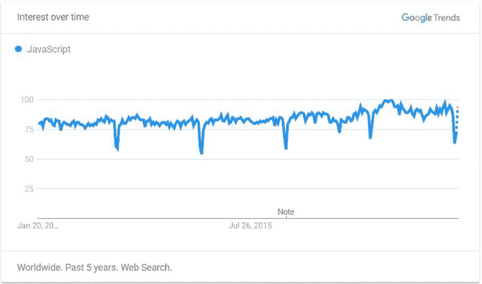
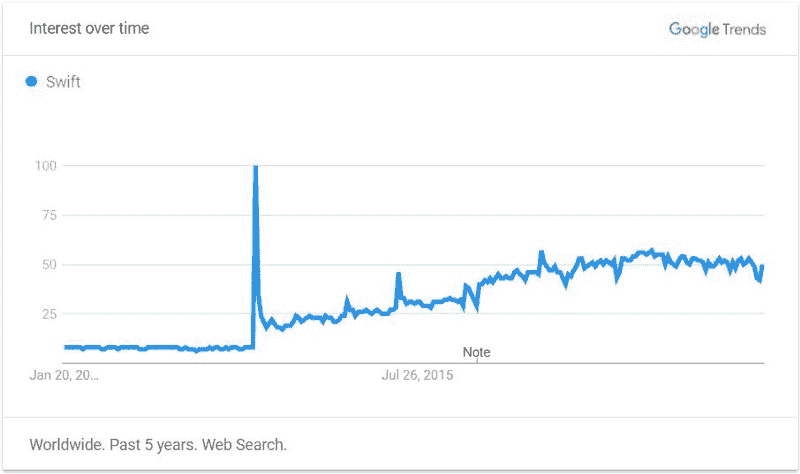
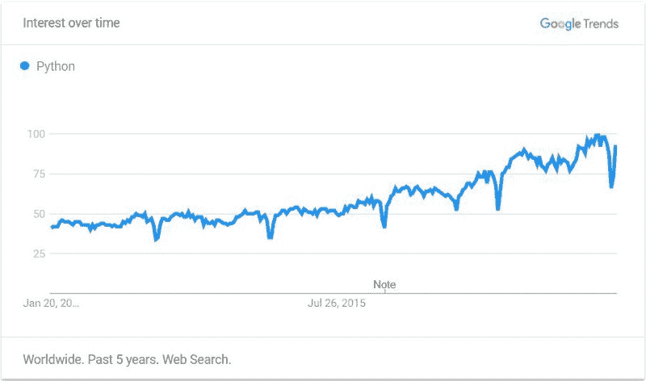
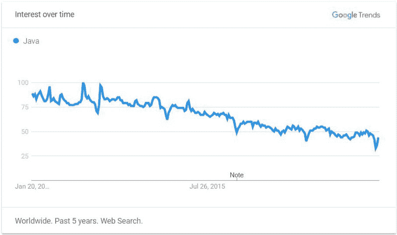
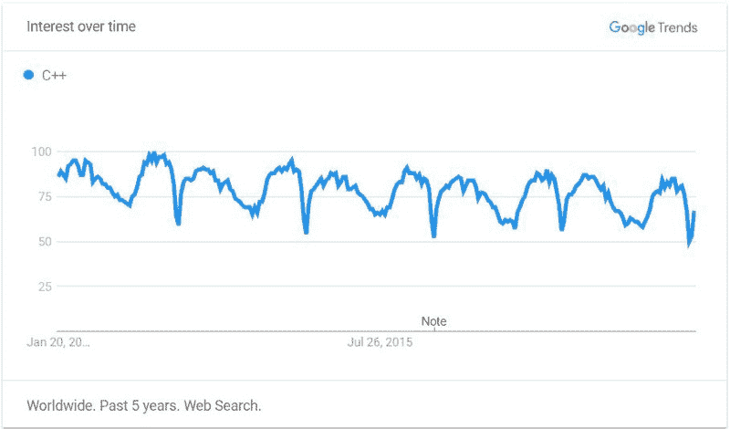
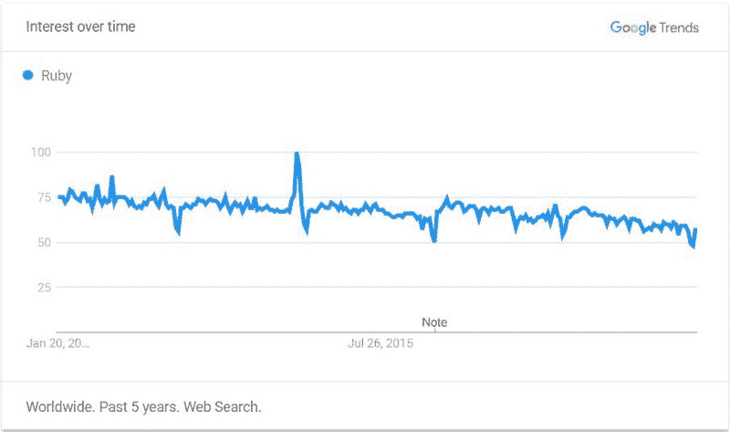
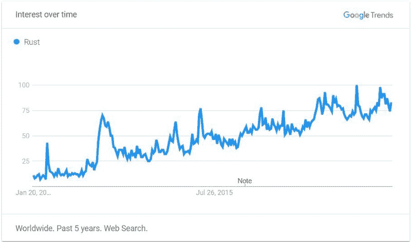
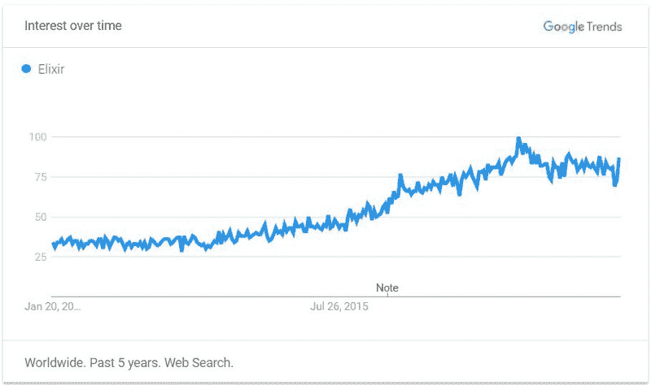
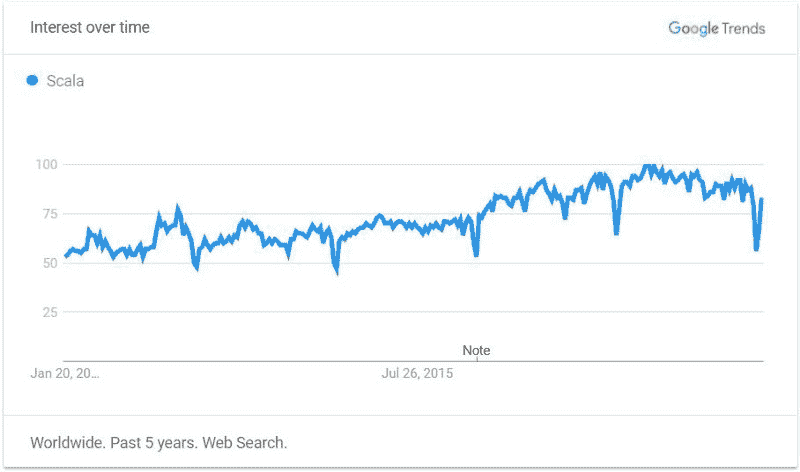
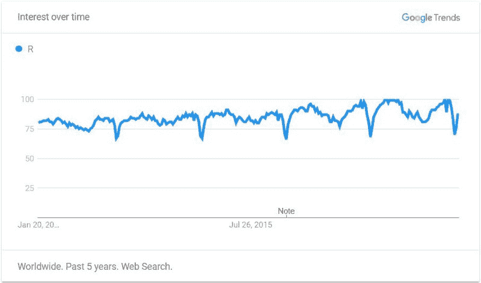

# 以下是 2018 年最值得学习的编程语言

> 原文：<https://www.freecodecamp.org/news/best-programming-languages-to-learn-in-2018-ultimate-guide-bfc93e615b35/>

亚历山大·彼得科夫

# 以下是 2018 年最值得学习的编程语言

这是任何想要在 2018 年选择正确的编程语言职业道路的人的权威指南。

让我澄清一件事:

这是*而不是*一个“热门语言”的帖子，里面有一堆名字和流行词汇。

**这是对 2018 年初 IT 行业的现状、趋势和安全的近期预测的客观而实用的回顾。**

它基于各种可靠来源的统计数据，是为期两周的深入研究的结果。

这篇文章的目标是帮助你做出明智的决定，2018 年 IT 市场需要哪些语言。它将帮助你决定哪个领域值得花时间和精力去掌握，哪个领域将帮助你作为软件开发人员 开始(或继续) [**成功且有利可图的职业生涯。**](https://www.myfirstitjob.com/career-shift/)

当试图决定哪种编程语言是最佳职业道路时，开发人员通常会寻找以下四个特征:

1.  高薪
2.  受欢迎程度——大量的工作机会，多样性
3.  未来变得更受欢迎的趋势
4.  最好是容易学习和愉快的工作

对于列表中列出的每种语言，您将看到:

1.  一个简短的介绍，让你熟悉这门语言，它可以提供什么类型的职业选择，以及它的酷之处
2.  根据 [TIOBE](https://www.tiobe.com/tiobe-index/) 和 [GitHub Octoverse](https://octoverse.github.com/) 的语言流行图
3.  基于[Indeed.com](https://www.indeed.com/)和[stack overflow 2017 年调查](https://insights.stackoverflow.com/survey/2017#technology-top-paying-technologies-by-region)数据的薪资比较
4.  根据[谷歌趋势](https://trends.google.com/trends/)显示的过去五年的需求趋势
5.  一个简短的示例代码片段，让您对该语言的语法有一个直观的了解

最后，我列出了四种不太为人所知的语言，它们在过去几年里迅速流行起来，预计在 2018 年会有很高的需求。

让我们从状元签开始吧。

### 1.Java Script 语言

根据 StackOverflow 的年度调查，JavaScript 是最受欢迎的语言，62.5%的受访者声称使用它。

毫无疑问，它是网络的主导语言，在过去的十年里，JavaScript 的发展是巨大的。为什么？环顾四周，数一数你能看到多少联网设备。Stack Overflow 的联合创始人和流行编程人物[杰夫·阿特伍德](https://en.wikipedia.org/wiki/Jeff_Atwood)著名的[说过:](https://blog.codinghorror.com/the-principle-of-least-power/)

> 任何可以用 JavaScript 编写的应用程序最终都会用 JavaScript 编写。

考虑到这一点，可以有把握地说，2018 年及以后，JavaScript 不会缺少机会。

JavaScript 知识提供给大量前端框架，如 Angular、React、Ember、Backbone 等，以及 Node.js 运行时环境，它允许您在后端高效地运行 JavaScript。

根据 StackOverflow 的数据，2017 年最受欢迎的四个框架中有三个是基于 JavaScript 的。

如果您喜欢立即看到工作的结果，例如制作交互式 web 组件，JavaScript 对您来说是个好主意。请记住，从事 JavaScript 工作意味着你也应该熟悉 HTML 和 CSS，这基本上是网页的组成部分。

像 Apache Cordova 或 T2 React Native 这样的工具允许在移动应用中使用 JavaScript。甚至有可能通过像[电子](https://electronjs.org/)这样的项目进入游戏开发或桌面应用程序开发。

让我们看看 JavaScript 背后的统计数据:

过去 5 年 JavaScript 流行趋势:**稳步增长**

JavaScript 示例代码片段:

### 2.迅速发生的

Swift 是苹果在 2014 年发布的一种相对较新的编程语言。这是一种开发原生 iOS 或 macOS 应用程序的语言。

与用于苹果 iOS 和 macOS 操作系统的 Objective-C 语言相比，它被认为在可用性和性能方面有所改进。

Swift 普遍受到开发者的青睐，继 2015 年[排名第一](https://insights.stackoverflow.com/survey/2015#tech-super)之后，在 2017 年[最受欢迎语言](https://insights.stackoverflow.com/survey/2017#technology-most-loved-dreaded-and-wanted-languages)中排名第四。如果您选择了 Swift 的职业，您很可能会喜欢它。

如果你想进入移动开发，你绝对应该考虑 Swift 作为一个高薪的职业道路。一般来说，事实证明，iOS 应用比 Android 应用更有利可图。

近 5 年流行趋势:**急剧上升**

Swift 示例代码片段:

### 3.计算机编程语言

Python 是一种通用语言，如今你几乎可以在任何地方找到它。你会发现它存在于网络应用、桌面应用、网络服务器、机器学习、媒体工具等等。

它被像 NASA 或 Google 这样的大玩家使用，Python 的创造者[吉多·范·罗苏姆](https://en.wikipedia.org/wiki/Guido_van_Rossum)在那里被雇佣了大约 8 年，主要是写……Python。

Python 代码简洁、易读、结构良好。在这里，适当的缩进不仅仅是为了美观，它决定了代码的执行。

基于 Python 的 web 开发框架，如 Django T1 和 T2 Flask T3，已经越来越受欢迎。此外，该语言还配备了高质量的机器学习和数据分析库，如 [Scikit-learn](https://en.wikipedia.org/wiki/Scikit-learn) 和 [Pandas](https://en.wikipedia.org/wiki/Pandas_(software)) 。

总的来说，Python 的职业道路是多种多样的，并且会一直保持下去。对于初学者来说，这是一个很好的选择，因为它是高级的，易于阅读和理解。

过去 5 年 Python 的流行趋势:**令人印象深刻**

Python 示例代码片段:

### 4.Java 语言(一种计算机语言，尤用于创建网站)

Java 可以说是最受欢迎的编程语言，因为 90%的财富 500 强公司大量使用它。它的著名口号[“一次编写，随处运行”](https://en.wikipedia.org/wiki/Write_once,_run_anywhere)抓住了 Java 如此有价值的关键之一——它强大的 Java 虚拟机(JVM)，这使它能够跨平台兼容。

Java 的热门职业路径是后端开发人员、大数据开发人员、嵌入式系统工程师或 Android 开发人员。尽管目前 Java 还不是最“时髦”的语言，但它已经被广泛使用，我们几乎可以保证它在未来十年甚至更长的时间里不会有任何发展。

正因为如此，你可以相信在你所在的城市和偏远地区都有大量的 Java 工作岗位，这对于这个列表中一些不太受欢迎的语言来说就不一定了。因此，如果你熟悉 Java，找到合适的位置只是时间问题。

过去 5 年 Java 的流行趋势:**下降**

Java 示例代码片段:

### 5.C++

C++是一种高效灵活的语言，最早创建于 1985 年。由于它的性能、可靠性和多种多样的使用环境，它的需求量一直很大。

许多大型系统都是用 C++成功创建和维护的，包括微软、甲骨文、PayPal 和 Adobe。

C++的职业生涯通常包括开发桌面应用程序，尤其是性能密集型任务。虽然相当复杂，但熟悉 C++会让你对语言如何工作有更深的理解，例如，通过提供低级内存操作的工具。

过去 5 年 C++流行趋势:**起伏**

C++示例代码片段:

### 6.红宝石

Ruby 是最受欢迎的编程语言之一。它被设计成对开发者友好且易于使用，因为甚至它自己的标语也是“[程序员最好的朋友](https://www.ruby-lang.org/en/)”

Ruby 是一种高级语言，旨在用几行简洁易读的代码完成很多事情。这有时需要“在幕后”付出巨大的努力，这使得 Ruby 在效率方面比其他流行语言相对较慢——但它确实提高了您的生产率。

写得好的 Ruby 代码看起来就像用简单的英语写的句子。对于学习第一语言来说，这是一个很好的选择，因为初学者通常会很快掌握它，并在学习过程中享受它。

Ruby 主要用于其最流行的框架— [Ruby on Rails](http://rubyonrails.org/) 。Ruby on Rails 是一个 web 框架，它将 Ruby 的所有想法封装成一个强大的 web 工具。Rails 实现的巨大生产力使得它成为那些想要快速起步的初创公司的[的普遍选择。](https://medium.com/@RubyGarage/what-are-the-benefits-of-using-ruby-on-rails-for-your-startup-f3d6f6b9938d)

Ruby on Rails 的职业生涯绝对是一个很好的选择，因为这个框架是为程序员的快乐而优化的，而且报酬也很高。从事 Ruby 职业的唯一主要缺点是，与上面提到的语言相比，这种语言不太受欢迎。因此，Ruby 的职位空缺在某些地方可能会受到限制。

过去 5 年红宝石的受欢迎程度:**下降**

Ruby 示例代码片段:

### 7.锈

Rust 由 Mozilla 赞助，并在 StackOverflow 调查中连续第二年被选为最受开发者喜欢的游戏。这是一种相对较新的语言，首次出现于 2010 年，已经获得了显著的普及，预计未来会有更大的进步。

Rust 是一种编译语言，在用例及性能方面经常被拿来与 C 语言相比较。主要区别在于 Rust 是内存安全的。C 代码中最常见的错误之一是悬空指针、缓冲区溢出或任何其他类型的内存错误。Rust 就是为了避免这些而创建的——这种语言实际上使得*不可能*在编译期间(在代码运行之前)发现这样的错误。

对于初学者来说，Rust 可能有点难学，因为它坚持各种规则来实现内存安全。然而，有经验的开发人员[喜欢它](https://medium.com/mozilla-tech/why-rust-is-the-most-loved-language-by-developers-666add782563)，并且很有可能在未来几年 Rust 将会有非常高的需求。

就薪酬而言，Rust 被认为薪酬丰厚，[在 stack overflow 2017 年的调查中排名全球第二](https://insights.stackoverflow.com/survey/2017#technology-top-paying-technologies-by-region)。

选择 Rust 的另一个原因是这种语言是由 IT 界一个家喻户晓的名字 Mozilla 开发的。

近 5 年流行趋势:**上升**

Rust 示例代码片段:

### 8.长生不老药

Elixir 是另一种新语言，首次出现在 2011 年，很快就流行起来。

Elixir 的灵感来自于 Erlang，这是一种由 Ericsson 在 20 世纪 80 年代开发的语言，可以说是重型并发的最佳工具之一。Elixir 的作者 José Valim 本人[说](http://www.creativedeletion.com/2015/04/19/elixir_next_language.html)他喜欢 Erlang 的一切，但也看到了改进的空间。对于开发人员来说，Erlang 最大的缺点是其古怪的语法和可用性，以及缺乏直观的包管理。

因此，Elixir 出现了——结合了 Ruby(一种对开发人员高度友好的语言和生态系统)和 Erlang 的一些方面。

Elixir 主要用于 web 开发，职业选择通常报酬丰厚但有限。该语言的受欢迎程度逐年增加，因此如果您所在的城市周围有各种 IT 公司，Elixir 开发者可能会非常受欢迎。

就薪水而言，在 stack overflow 2017 年的调查中，Elixir 通常收入丰厚，在全球排名第三位。

近 5 年来仙丹流行趋势:**上升**

酏剂示例代码片段:

### 9.斯卡拉

Scala 代表可伸缩语言，是“重写 Java”同时改进其缺点的众多尝试之一。Scala 代码被编译成在 Java 虚拟机(JVM)上运行。

鉴于 LinkedIn、Twitter 和 The Guardian [等大公司在其代码库中使用 Scala](http://www.scala-lang.org/old/node/1658)这一事实，我们可以有把握地认为 Scala 已经取得了成功。

Scala 素有初级开发人员学习复杂语言的名声。但是那些通过学习曲线的人可能会享受一个伟大的职业生涯，因为 Scala 开发人员的空缺职位肯定会越来越多。

根据 StackOverflow 的 2017 年报告，Scala 在薪资调查中排名很高，在全球排名前十位，在美国排名第一。

过去 5 年 Scala 的流行趋势:**上升**

Scala 示例代码片段:

### 10.稀有

r 是一种用于统计、图形表示和数据分析的编程语言和环境。这是数据科学家的首选。如果你发现自己对这个领域感兴趣，那么 R 对你来说是一个稳定且有利可图的职业选择。

r 过去 5 年的流行趋势:**稳步上升**

r 示例代码片段:

以上是 2018 年你应该考虑学习的十大编程语言。

如果你正在寻找免费的课程来尝试上述任何一种语言，你可以看看我们关于从最好的教程中选择的建议，甚至有一个 T2 的专门网站为你浏览教程。

如果你对软件开发人员的未来职业有任何疑问，请使用我们免费的[特色材料](https://www.myfirstitjob.com/)或[联系我们](https://www.myfirstitjob.com/about/)进一步寻求专业意见。

### 下一步是什么？

选择正确的语言职业道路是很好的——但通常问题是在试图做到“足够好”并被录用时开始的。

接下来，我将重点介绍我的研究结果，即为什么许多开发人员在找到工作之前就放弃了。主要原因其实挺简单的。

Did you like the read? Medium doesn’t offer partner program in my country―so I ask people to buy me coffee instead.