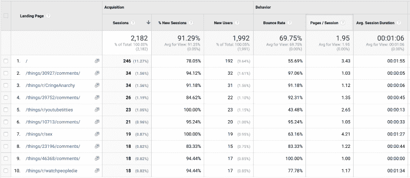
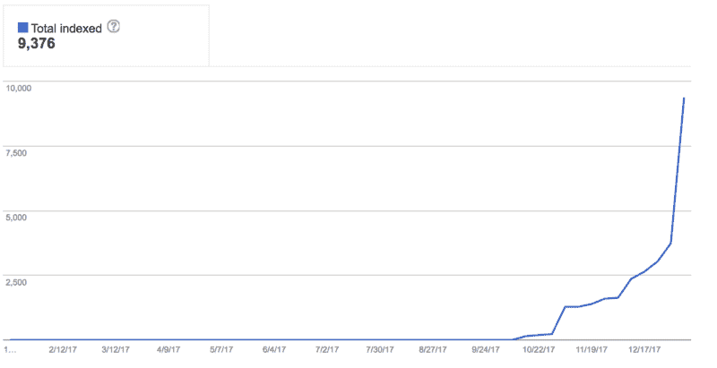
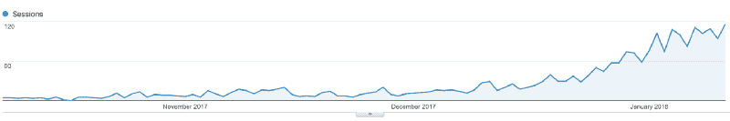
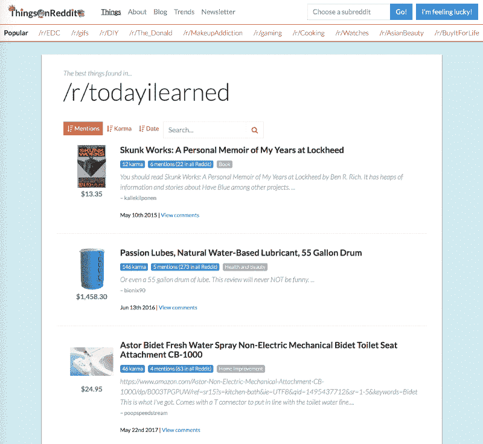
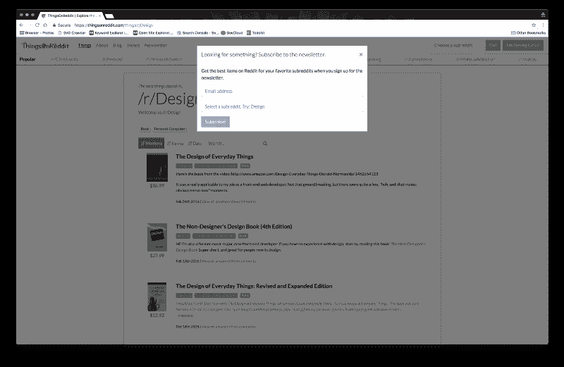
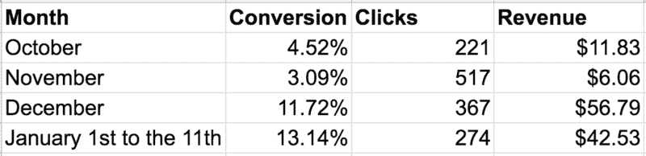

# 为什么你不应该忘记长尾搜索引擎优化

> 原文：<https://www.freecodecamp.org/news/why-you-shouldnt-forget-about-long-tail-seo-34782120b855/>

本·鲁道夫


# 为什么你不应该忘记长尾搜索引擎优化

几个月前，我写了一篇关于我如何建立 T2 的文章。这是一个寻找发布到 Reddit 上的最佳亚马逊产品的网站，并使用亚马逊子公司来赚钱。我在 HN 出名了几天左右，然后慢慢地消失在人们的记忆中。这时候我意识到，我最终会耗尽那些让我点击率快速飙升的网站，并需要专注于为网站构建 SEO。

我最初遇到了一些障碍，但慢慢地建立了一个可预测的和不断增长的网站流量。在这个过程中，我了解了更多关于我的站点是如何被使用的，并专注于改进这个用例的站点。

### 重新思考 SEO 策略

一开始，我试图优化那些有可能让用户登陆我主页的关键词。我的思考过程是这样的:用户登陆主页，找到一个感兴趣的子页面和/或产品，然后在亚马逊上购买该产品。我甚至为用户创建了一个更加友好的新主页，并提供了一种更简单的导航子页面的方式。

这是个糟糕的策略。

改变我的范式的表格如下:



Breakdown of which pages users are landing on for the last 30 days

很难看出，但登陆时浏览量最多的主页，只占总浏览量的 11.27%。大多数用户要么直接登陆子页面，要么直接登陆产品页面。

很明显，我的 SEO 方法应该基于我网站的页面宽度。



This graph shows how many pages Google has indexed over time

那是我开始意识到长尾 SEO 的力量的时候。**长尾 SEO 是指你针对竞争度低的小众 Google 关键词(通常是 3+或更多的词)**。这很自然地发生在我的网站上——有成千上万的产品页面，上面有各种奇怪的关键字，来自 Redditors 对该产品的评论。

#### 网站地图

网站地图告诉搜索引擎你网站的结构。如果你的网站很小并且链接良好，通常不需要，但是我的网站非常庞大。

我创建了一个站点地图来包含最大数量的 URL，50，000 个。ThingsOnReddit 为 Reddit 上提到的每一个 subreddit 和亚马逊产品都有一个页面，所以有许多潜在的页面需要索引(远远超过 50，000)。谷歌花了很长时间索引你的页面，但是当它索引我的页面时，我的搜索引擎优化增加了 1000%。



Users coming to ThingsOnReddit via organic search

#### 链接标签

获得这些权利对于优化你的 SEO 表现是至关重要的。我最初推出 ThingsOnReddit 时没有考虑到这一点。那是个错误。

`**<link rel="canonical" href="**` "/ >

如果你有一个做任何分页的站点，这是非常重要的。这个标签告诉 Google 当前页面实际上与`href`属性中的 URL 相同。这通常在博客(如 Medium)转贴其他网站的帖子时使用，但当您有如下 URL 模式时也很有必要:

```
https://thingsonreddit.com/things/r/buildapc?page=1https://thingsonreddit.com/things/r/buildapc?page=2https://thingsonreddit.com/things/r/buildapc?page=3
```

或者甚至:

```
https://thingsonreddit.com/things/r/buildapc?order_by=n_references_in_subreddithttps://thingsonreddit.com/things/r/buildapc?order_by=created_utchttps://thingsonreddit.com/things/r/buildapc?order_by=score
```

我遇到的问题是谷歌会索引网址:

```
https://thingsonreddit.com/things/r/buildapc?page=7
```

这个网址会出现在谷歌搜索结果中。然后，当我显然希望用户登陆第 1 页时，用户会登陆第 7 页。`rel="canonical”`将告诉谷歌忽略所有的 URL 参数，只索引`https://thingsonreddit.com/things/r/buildapc`。

`**<link rel="next|prev" href="**` "/ >

这告诉 Google 下一个逻辑页面(或者上一个，如果您指定了`prev`)是在`href`属性中的 URL。谷歌[说](https://support.google.com/webmasters/answer/1663744?hl=en)他们通常可以自己解决，但以我的经验来看，他们没有做对。谷歌需要一段时间来进行调整，所以第一次就要做对。

#### 内部链接

当建立代销商链接网站时，建立你的网站来让用户尽快到达亚马逊(或任何代销商网站)是很有诱惑力的。最初，这就是我想要做的。



在第一个实现中，用户被直接带到亚马逊，以尽可能快地获得会员点击。

我最终了解到，如果用户想要某个产品，他们最终会点击亚马逊链接。为每种产品创建单独的产品页面更为重要，这样每种产品都可以被单独索引并显示在搜索结果中。

#### 分析学

拥有更好的 SEO 表现的一部分是建立良好的用户体验。用户体验越好，你的跳出率越低，谷歌对你的网站就越有利。了解如何创造良好体验的一个关键部分是跟踪所有的事情。

除非你做一些 A/B 测试，否则很难判断改变用户体验如何直接改变你的跳出率或谷歌搜索排名，但分析可以为你指出正确的方向。

例如，我的印象是建立一个邮件列表总是好的。因此，当用户滚动到页面底部时，我开始积极地显示时事通讯注册模式:



My friendly newsletter signup modal

我试了几个月，在展示了 609 次**之后，我得到了 0 次的注册。不用说，这是一个非常令人讨厌的功能，它没有产生注册，所以我杀了它。**

### **结果呢**

**在让 ThingsOnReddit 自己运行一段时间后，我很高兴地宣布一些更好的结果。**

****

**到目前为止，亚马逊网站点击量最多的月份是 11 月，但它也是收入最少的月份。当我试图通过各种社交媒体网站向人们灌输这个网站时，大多数点击都是通过社交流量产生的。**

**事实证明，**专注于有机搜索不仅对可持续的经常性用户更好，而且对真正希望*购买产品并且更有可能转化***的用户也更好。**

**展望未来，我将继续努力提高该网站的谷歌搜索排名，既改善网站的体验，也努力增加链接到 ThingsOnReddit 的网站数量。**