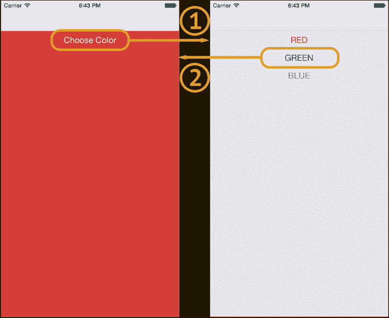
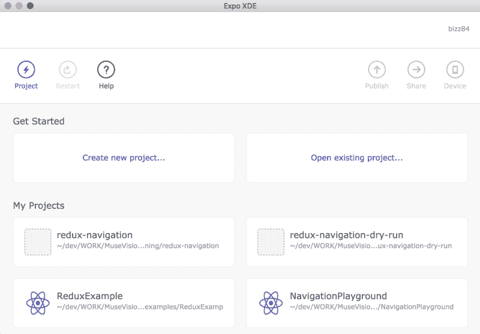
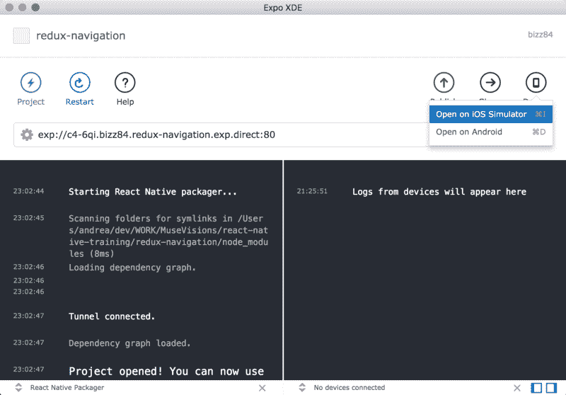
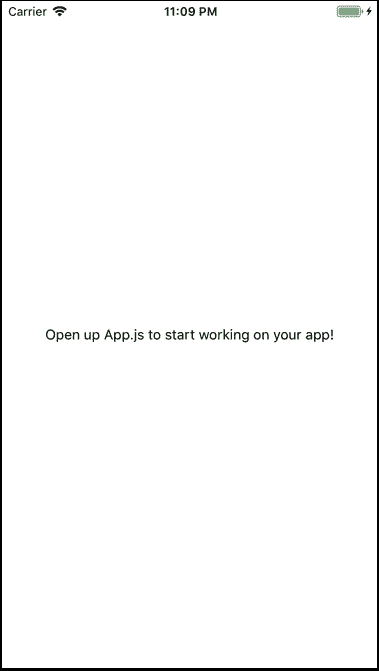
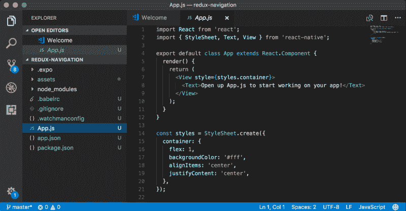
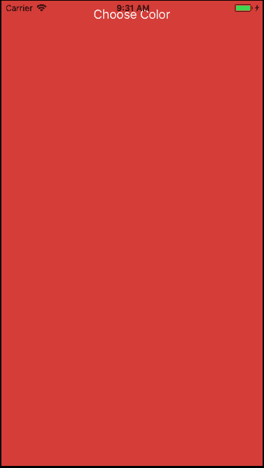
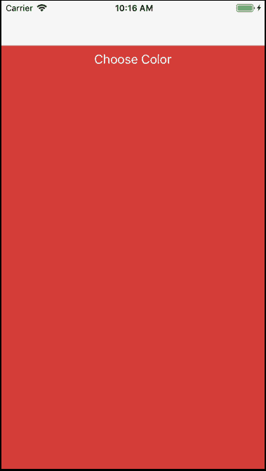
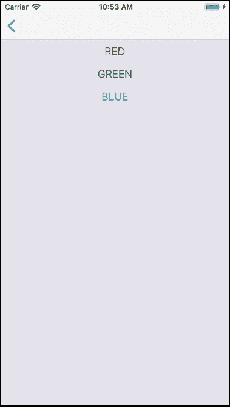

# 使用 Redux 管理 React 导航应用程序中的状态

> 原文：<https://www.freecodecamp.org/news/managing-state-in-a-react-navigation-app-with-redux-6d0b680fb595/>

安德里亚·比佐托

# 使用 Redux 管理 React 导航应用程序中的状态


Image Credit: [Petar Petkovski](https://unsplash.com/@petkovski)

在本教程中，我将通过用 [React 导航](https://github.com/react-navigation/react-navigation)和 [Redux](https://github.com/reactjs/redux) 构建一个简单的 app，展示如何管理**导航**和**应用状态**。

**先决条件**:你应该已经熟悉 React Native、React Navigation、Redux。如果您刚刚开始使用 React Native，我强烈推荐您学习本课程:

*   [完整的反应原生和还原过程](https://www.udemy.com/the-complete-react-native-and-redux-course/learn/v4/overview)

### 应用概述

我们将构建一个由两个页面组成的应用程序:



*   **主页**:这显示了一个带有特定背景颜色的容器视图，以及一个按钮。当按钮被按下时，第二页出现。
*   **选择彩色页面**:显示红色、绿色和蓝色按钮。当选择一种颜色时，应用程序返回到主页面，并显示更新的背景颜色。

通过构建此应用程序，您将了解到:

*   如何使用[反应导航](https://github.com/react-navigation/react-navigation)在不同屏幕之间导航
*   如何使用 reducers 和 actions 来更新应用程序状态，以便一个屏幕上的**动作驱动另一个**上的 UI 变化

有了这些知识，你将能够构建更复杂的应用程序。

**注意:**在本教程的剩余部分，我将使用术语“页面”和“屏幕”来表示相同的东西。

### 项目设置(博览会)

我们将与 XDE 世博会合作开发这个应用程序。

你可以从 [Expo XDE GitHub 页面](https://github.com/expo/xde)为你的操作系统下载 Expo。

然后前往博览会文件上的[安装说明](https://docs.expo.io/versions/latest/introduction/installation.html)。这些将向您展示如何在您的桌面上安装 XDE，并在模拟器/设备上运行 Expo 中的应用程序。

由于我们将在模拟器上运行应用程序，你还需要下载 [Xcode](https://developer.apple.com/download/) 或 [Android Studio](https://developer.android.com/studio/index.html) 。

启动 Expo 后，将显示以下页面:



*   选择“创建新项目…”
*   选择空白模板，并将项目命名为`**redux-navigation**`

项目将被创建，然后 React 本机打包程序将启动。



要在模拟器中运行应用程序，在 iOS Simula tor 中选择**设备- >打开。**

模拟器启动后，将出现以下屏幕:



现在项目已经创建好了，可以用您选择的编辑器打开它。我使用 [Visual Studio 代码](https://code.visualstudio.com/Download)和 [React 本地工具扩展](https://marketplace.visualstudio.com/items?itemName=vsmobile.vscode-react-native)。



### 构建应用程序

在我们编写应用程序之前，我们需要安装它需要的所有依赖项。

打开终端，移动到您在 Expo 中创建的项目文件夹，然后键入:

```
npm install --save react-navigation redux react-reduxnpm install
```

然后，**确保点击 Expo** 中的重启按钮。如果您不这样做，新的依赖项将不会被识别，如果您试图使用它们，模拟器将会抛出一个红色的错误屏幕。

是时候构建我们的应用程序了。我是这样组织我的项目文件夹的:

```
/src  /actions    ColorChangedAction.js  /components    AppNavigator.js    ChooseColorPage.js    MainPage.js  /reducers    AppReducer.js    ColorReducer.js    NavReducer.js  /state    Colors.js
```

您可以从您的终端复制相同的结构:

```
cd redux-navigationmkdir src && cd srcmkdir actions && cd actions && touch ColorChangedAction.js && cd ..mkdir components && cd components && touch AppNavigator.js ChooseColorPage.js MainPage.js && cd ..mkdir reducers && cd reducers && touch AppReducer.js ColorReducer.js NavReducer.js && cd ..mkdir state && cd state && touch Colors.js && cd ..
```

将以下代码复制粘贴到`**Colors.js**`文件中:

接下来，用默认背景颜色和一个按钮创建`**MainPage**`:

一些注意事项:

*   `**MainPage**`是一个 React 组件，而不是一个无状态功能组件，因为它需要访问应用程序状态
*   我使用`flex: 1, alignSelf: 'stretch'`让容器视图扩展到整个屏幕
*   容器视图的颜色在`selectedColor()`方法中定义，该方法从我们的`**COLORS**`表中抽取`**RED**`，并返回相应的十六进制代码
*   我为按钮按压事件添加了一个空的`onChooseColor()`处理程序。我们将在后面添加这个方法的主体。

是时候将我们的`**MainPage**`连接到我们的根`**App.js**`文件中了。用以下内容替换旧内容:

刷新模拟器会产生以下结果:



不漂亮，但它显示了背景颜色和我们的按钮。

这里是我们到目前为止构建的快照: [GitHub 代码快照 1](https://github.com/bizz84/redux-navigation-color-picker/releases/tag/01-main-page) 。

### 添加导航

我们现在准备给我们的应用程序添加一些导航。

为此，打开`**AppNavigator.js**`文件并添加以下内容:

这段代码借用了 [react-navigation](https://github.com/react-navigation/react-navigation) 项目中的 [Redux 示例](https://github.com/react-navigation/react-navigation/tree/master/examples/ReduxExample)。

它定义了一个`StackNavigator`，使用我们的`**MainPage**`作为它的主屏幕。

它还设置了`AppWithNavigationState`，一个保存导航状态的顶级容器。如果这看起来不清楚，不要担心。这是 React 导航中的标准样板代码，我们现在只使用它来开始工作。

是时候编写导航缩减器了，它将在 Redux 存储中保存导航状态。打开`**NavReducer.js**`文件并添加以下内容:

这个缩减器定义了我们应用程序的初始导航状态。同样，样板代码。

现在，让我们打开`**AppReducer.js**`文件并添加以下内容:

随着我们应用的增长，除了我们的`NavReducer`之外，我们可能还需要其他的减速器。所以我们可以在`AppReducer`中将它们组合在一起。

最后，我们能够更新我们的`**App.js**`来使用所有这些新的好东西:

render 方法使用创建的 redux 存储返回一个提供者，并保存我们的顶级组件。同样，这只是用 Redux 连接东西所需的样板代码。

如果我们刷新模拟器，我们现在会看到顶部出现一个导航栏:



完成所有这些代码后，如果缺少任何东西，您可能会在模拟器上看到一些错误。如果是这样，使用这个代码快照回到正轨: [GitHub 代码快照 2](https://github.com/bizz84/redux-navigation-color-picker/releases/tag/02-add-navigation) 。

### 显示选择颜色页面

现在我们在`StackNavigator`中有了一个`**MainPage**`，我们准备添加`**ChooseColorPage**`，这样我们就可以导航到它。

打开`**ChooseColorPage.js**`文件并添加以下代码:

一些注意事项:

*   `**render()**`方法中的代码遍历每种颜色，并将其映射到一个`Button`中。设置了`title`和`color`属性。
*   当点击按钮时，用适当的颜色键调用`onSelectColor()`处理程序。
*   通过`props`可以访问`navigation`对象。事实上，它被注入到我们`**AppNavigator**`的所有屏幕中。
*   调用`this.props.navigation.goBack()`会将我们带回`**AppNavigator**`中的上一个屏幕。
*   在这个阶段，`colorName`还没有被用来设置任何状态。

接下来，我们必须让我们的`**AppNavigator**`意识到新的`**ChooseColorPage**`屏幕。让我们在`**AppNavigator.js**`文件中更新它:

最后，添加当在`**MainPage**`上点击`**Choose Color**`按钮时导航到`ChooseColorPage`的代码。

如果我们现在刷新模拟器并点击`**Choose Color**`，应用程序将导航至新屏幕，其中显示三个按钮:



**注意:**调用`navigation.navigate('ChooseColor')`有效，因为我们已经将`**ChooseColor**`命名为我们`**AppNavigator**`中的一条路线。

点击返回按钮或任何颜色按钮会将我们带回主页，但背景颜色不会根据我们的选择而改变。

让我们在下一节中解决这个问题。

同样，如果有什么不工作，你可以得到我保存的代码快照到这一点: [GitHub 代码快照 3](https://github.com/bizz84/redux-navigation-color-picker/releases/tag/03-add-choose-color-page) 。

### 管理应用程序状态

我们将使用 Redux 来设置我们的`**MainPage**`的背景颜色作为我们的应用程序状态。

要做到这一点，我们需要定义一个颜色改变的动作，和一个减色器。

打开`**ColorChangedAction.js**`文件并添加以下内容:

然后，打开`**ColorReducer.js**` add add this:

为了使用该减速器，我们需要将其添加到`**AppReducer.js**`中，如下所示:

现在，当用户在`**ChooseColorPage**`中选择一种颜色时，我们准备调用我们的`colorChanged`动作。这是更新后的`**ChooseColorPage.js**`文件:

请注意，我们做了三处更改:

*   在顶部导入了`**colorChanged**`动作
*   用`connect()`和`**mapStateToProps**`连接
*   在`onSelectColor(colorName)`里面用过

在这个阶段，我们可以刷新模拟器并运行。如果我们选择不同的颜色，`**MainPage**`的背景颜色仍然不会改变。

这是因为我们还没有告诉`**MainPage**`使用新的状态。

容易修理。打开`**MainPage.js**`并添加所需代码:

一些注意事项:

*   `**mapStateToProps**` 现在将`colorName`从`**ColorReducer**`中的状态设置为
*   这可以通过`props`对象访问，并且可以在`selectedColor()`内部使用
*   不要忘记`import { connect } from 'react-redux';`在顶端

如果我们在模拟器中再次尝试该应用程序，我们现在可以更改背景颜色。？

更新快照: [GitHub 代码快照 4](https://github.com/bizz84/redux-navigation-color-picker/releases/tag/04-color-application-state) 。

### 好处:有模式地呈现颜色选择页面

当我们点击`**MainPage**`中的`**Choose Color**` 按钮时，`**ChooseColorPage**`从右边滑入。这是`**StackNavigator**`里面默认的导航动画。

如果我们想用模态来表示`**ChooseColorPage**`呢？

这很容易做到，只需像这样更改我们的`**AppNavigator**`的配置:

注意在`**ChooseColor**`中添加了带有`**headerLeft: null**` 属性的`**navigationOptions**`和`**mode: ‘modal’**`参数。

如果我们在模拟器上尝试，现在`**ChooseColorPage**`从底部滑入。

React 导航是非常可定制的。我建议花些时间阅读项目的文档[，了解你可以用它做的所有事情。](https://github.com/react-navigation/react-navigation)

### 包裹

我们已经学会了如何:

*   设置并使用 Expo 在模拟器上运行移动应用程序
*   构建一个具有两个不同页面的应用程序，并使用 React 导航在它们之间导航
*   使用 actions 和 reducers 来修改屏幕上的状态，并使用它来更新另一个屏幕上的 UI

你可以在 GitHub 上找到完整的源代码[在这里](https://github.com/bizz84/redux-navigation-color-picker)。

我也在 Expo 上公开分享了这个项目[。](https://expo.io/@bizz84/redux-navigation)

我希望你喜欢这个教程。从这里开始的下一个好的步骤是查看官方的 [React 导航示例](https://github.com/react-navigation/react-navigation/tree/master/examples)，以及来自社区的其他[教程](https://github.com/react-navigation/react-navigation#community-contributions)。

欢迎评论和反馈。？

如果你呢？？？，我甚至可能会做一个循序渐进的视频教程。？

**关于我:**我是一名自由的 iOS 开发人员，在合同工作、开源、兼职项目和博客之间周旋。

我是推特上的 [@biz84](https://twitter.com/biz84) 。你也可以看到我的 [GitHub](https://github.com/bizz84) 页面。反馈，推文，搞笑 gif，都欢迎！我的最爱？很多吗？？？。哦，还有巧克力饼干。