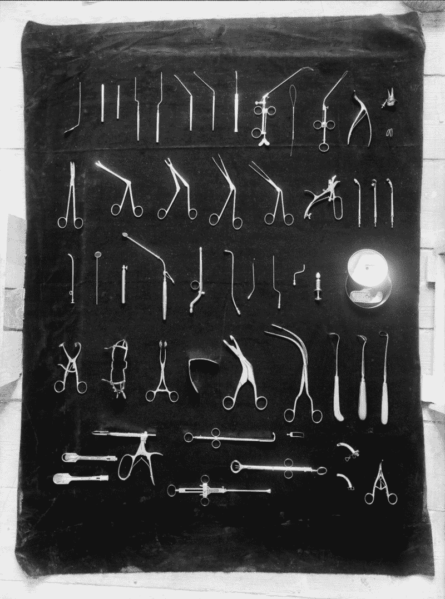
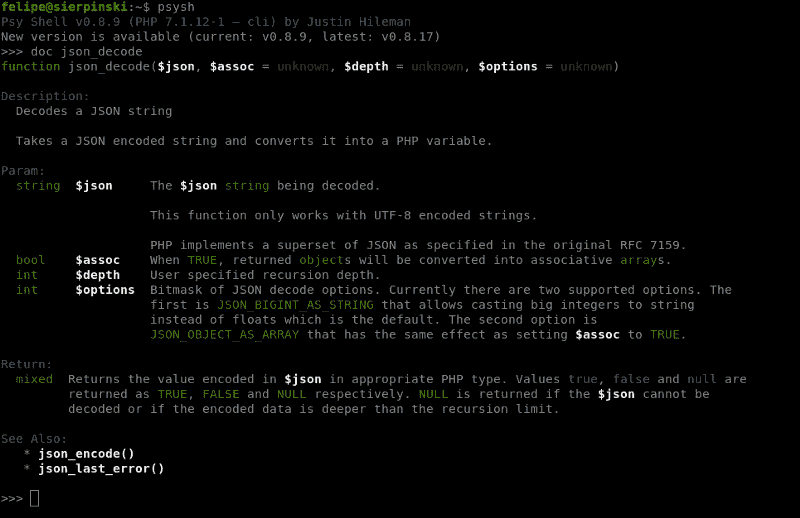
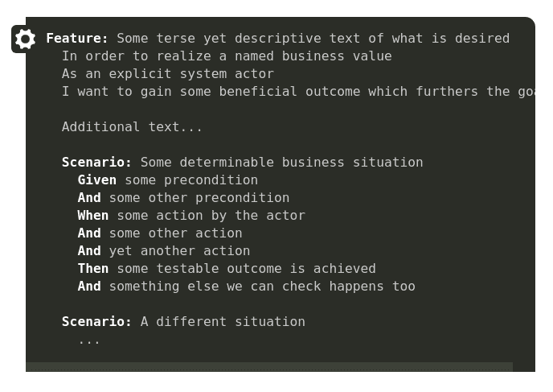

# 这就是现代 PHP 的样子

> 原文：<https://www.freecodecamp.org/news/this-is-what-modern-php-looks-like-769192a1320/>

菲利普·洛佩斯

# 这就是现代 PHP 的样子


By Faraz Usmani (Flickr) [CC BY 2.0 ([http://creativecommons.org/licenses/by/2.0](http://creativecommons.org/licenses/by/2.0))], via Wikimedia Commons

标题真的很装逼不是吗？是啊，它是。尽管我已经从事 PHP 工作多年，但我如何能说出这项工作的最佳实践和工具是什么呢？我不能，但我打算这么做。

我看到开发人员使用 PHP 的工作方式发生了真正的变化，不仅是这种语言随着新版本和改进而变得更加成熟和健壮，而且围绕它的整个生态系统也在发生变化。

新的工具、库、框架和文章正在被创建，模式正在被定义以使代码更加优雅和易于理解。一些人正在想办法让工作(以及你作为开发人员的生活)更有效率、更干净、更有趣。

我不是一个新趋势的早期采纳者，事实上，我只在我确信一个新工具背后有一个社区，并且我真的认为它会改进我的工作时才采用它。我总是尝试按照最佳实践来编写我的代码。

正因为如此，我花了一些时间才开始使用 Composer 和 PHPUnit 之类的东西。大约一年前，或多或少，我对所有这些闪亮的新事物敞开了心扉。

首先是 PSR，然后是 Composer、PHPUnit、Travis-ci 和其他几个库和令人惊叹的工具。我现在甚至正在使用一个 IDE(Vim FTW，但是集成了 XDebug 的 PHPStorm 对于一个 sane 工作流是必须的)！

### 什么是现代？


By [Karen Roe](https://www.flickr.com/photos/karen_roe/ "Go to Karen Roe's photostream") (Flickr) [CC BY 2.0 ([http://creativecommons.org/licenses/by/2.0](http://creativecommons.org/licenses/by/2.0))]

网上有大量的文章讲述 PHP 有多糟糕，如果你不得不使用 PHP 代码，你的生活会有多糟糕，这种语言有多丑陋，以及你能想到的任何其他东西！

如果你打算使用遗留代码，也许你的生活不会那么好，但是如果你有机会从事一个新项目，并且能够使用所有的新工具，你将会看到我将要谈到的这个新 PHP。

我在日常使用 PHP 时遇到了一些问题，但是人们不能对语言、社区和生态系统中发生的变化视而不见。前面还有很长的路要走，但是在 PHP 的土地上事情正在变得成熟。

我开始为我工作的公司的内部 API 创建 SDK，就像一个宠物项目一样，并决定遵循最佳实践。其中大部分我已经在做了，但我在做一些事情的方式上做了一些改变。这些变化和我在去年学到的东西是这篇文章的主题，我称之为现代 PHP。

### 让我们从工作流程开始


TRIO FABRIKKER — [https://nos.twnsnd.co](https://nos.twnsnd.co)

正如我所说的，我是这方面的新手，但这是一见钟情。PHPStorm 是一款非常棒的软件。这是我第一个也是唯一一个 IDE。这是我的第一次尝试，我甚至不需要尝试任何其他的。

与 XDebug 的集成是完美的，PHP 名称空间解析，composer 集成，git 集成，自动完成，代码生成，代码重构。我可以一直说下去。

我不认为你必须使用 IDE，实际上，这一点完全是个人的。您应该使用任何适合您需要的东西——Vim、Atom、Emacs、Bracket、NetBeans、PHPStorm、Eclipse 等等。这里的两个要点是生产力和人体工程学。您的 IDE/文本编辑器必须能够帮助您。

然而，对我来说，一个伟大的点是调试器集成。要为大项目(实际上也为小项目)写代码，你必须使用一个像样的调试器。让我们忘记那些变量转储和打印。您需要在运行时挖掘这些变量，分析堆栈跟踪，设置断点。这些东西是必不可少的，并使开发和重构更容易。

我甚至不知道这里有没有其他选项，XDebug 有你需要的一切。你有几分钟时间吗？如果您还没有这样做，请花点时间设置 XDebug 并将其集成到您的 IDE 或文本编辑器中。使用正确的工具开始调试代码。

我想让你们注意的另一个工具是 GitHub。另一整篇文章可以讨论 Git 和 GitHub 有多好，以及为什么您必须开始将代码置于版本控制系统之下。但我想告诉你另一个原因。

这里的重点是集成。

有几个工具可以与 GitHub 集成，您应该开始使用它们。这些工具可以在持续集成过程中为您生成指标、运行测试、运行作业，并在您的工作流程中做各种事情。集成是你开始使用 GitHub 的一个很好的理由，其他的都是另外一个话题。

### 依赖性管理



INSTITUTO PASTEUR. LISBOA, PORTUGAL — [https://nos.twnsnd.co](https://nos.twnsnd.co)

现代 PHP 生态系统中的另一点是依赖性管理，Composer 是完成这项工作的工具。

作曲家已经 5 岁了，但在我看来，大规模的收养发生在几年前。可能是因为我不是早期采用者，也可能是因为 PHP 开发人员不愿意改变。

这个工具为 Packagist 提供了一个前端，它是一个 PHP 包库，由 PHP 库、项目和工具组成，其源代码存储在 Github(或者其他类似 BitBucket 的地方)。

我在本文中谈到的所有库，也许是您最喜欢的项目之一，都可以通过一个简单的

```
$ composer require package_vendor/package_name
```

如果你不知道软件包的供应商，你可以`search` for a package 来找到并安装正确的软件包。

```
$ composer search package_name
```

如果 Composer 只是做这项工作，管理依赖关系，那么它将是一个很好的工具，但是它做得更多。花点时间安装 Composer 并阅读[文档](https://getcomposer.org/doc/)。

### 命令行界面运行正常

我真的喜欢使用 CLI 界面快速尝试想法。对我来说，最伟大的 REPL 工具之一是 IPython。它帮助你自动完成你的代码，让你轻松地定义函数，轻松地访问文档和其他几个惊人的功能。对我们来说不利的一面是，这个工具是针对 Python 的，而不是 PHP。

在 PHP 世界中，我们有一种叫做“交互模式”的东西，可以通过终端访问，只需输入

```
$ php -aInteractive mode enabled
```

```
php >
```

此时，您处于交互模式，可以开始测试一些东西。它可以工作，但是这个工具太不直观了。我已经尝试了几次，但是，因为我知道 IPython 能够做什么，我不能继续使用它。

幸运的是，这个模块上有一个很酷的新 CLI(命令行界面),它的名字叫 Psysh。Psysh 是一个神奇的工具，充满了有趣的功能，可以安装在全球或每个项目使用 composer。

对我来说最好的心理特征是内联文档。不用去 Php.net 就能访问 PHP 函数的文档是很棒的。缺点是，在它完全发挥作用之前，您需要做的事情很少。

安装完成后，输入下面的命令(我这里用的是 Debian，这可能不是对每个人都有效)来让它正常工作

```
$ apt-get install php7.1-sqlite3$ mkdir /usr/local/share/psysh$ wget http://psysh.org/manual/en/php_manual.sqlite -o /usr/local/share/psysh/php_manual.sqlite
```

第一个命令不是强制性的，如果您已经安装了 Sqlite，可以跳过这一步。第二个命令创建存储文档的目录，第三行下载并保存文档到之前创建的目录中。请记住，所有这些命令都必须以 root 用户身份运行。

现在你有了这个



Screenshot of psysh doc in action, showing information about json_decode

前往 [Psysh](http://psysh.org) 网站，了解更多关于这个令人敬畏的工具的信息。

### 你应该开始测试

这是我每天对自己说的一句咒语。像许多人一样，我没有像 TDD 建议的那样测试我的代码。我现在正在进入测试阶段，并且在过去的半年里一直在这样做，前面还有很长的路要走。

我决定在处理复杂的遗留项目时学习测试。代码是如此的脆弱和僵化，以至于每当我们添加一些代码时，它都会破坏一些东西。新功能？实现和打破一些东西！修复 bug？再创建一个。

这是一个大问题，我在另一篇文章中讨论过，并让我开始给测试一个机会。

我看到的第一个工具是 [PHPUnit](https://phpunit.de/) 。如官方网站所述

> PHPUnit 是一个面向程序员的 PHP 测试框架。它是用于单元测试框架的 xUnit 架构的一个实例。

所以，PHPUnit 是一个帮助你为你的项目创建测试的框架，单一测试。它为您提供了几个函数来测试代码的结果，并根据这些测试的结果生成一个很好的输出。

自从我开始思考测试，阅读并与人们谈论它，我发现了另一个伟大的工具，它补充了你在那些单一测试中所做的工作，它被称为 Behat，这是 PHP 的 BDD 框架。

BDD(行为驱动开发)是一种源于 TDD(测试驱动开发)的开发过程。这些缩写现在并不重要，重要的是你可以用一种更自然的语言来说明你的测试，一种非技术人员也能理解的语言。

这种语言被称为 Gherkin，用于描述被测试的预期行为。使用小黄瓜的测试描述如下所示



在这些行的后面是 PHP 代码，每当有一行与方法的 PhpDoc 中指定的 regex 模式匹配时，就会调用这些代码。这些代码使用你的 SDK、应用程序或 web 系统实现了这些步骤以及真实用户会做的事情。

Behat 的工作流程非常顺畅。在一切都正确配置之后，您开始编写测试一个特性的所有可能的场景。第一次运行 Behat 时，它会给出所有应该添加到 PHP 上下文类中的方法模板，以便实现场景中的每一步。

之后，您开始为每个步骤编写实际代码，并不断重复这个循环。

*   为一个步骤实现 PHP 代码
*   运行测试
*   如果一切正常，编写下一步的 PHP 代码
*   如果有东西坏了，修好它

经过半个小时的配置和阅读文档，你已经准备好使用 Behat 了，你会看到最终它都是 PHP 代码，你已经知道如何用它编程。

### 连续累计

持续集成(CI)是一个过程——一种做事情的方式，而这件事，对于我们软件工程师来说，就是创造软件。

用简单的英语来说，就是不断地(可能一天几次)将小块代码合并到你的代码库中的行为。代码已经过测试，没有破坏任何东西。CI 帮助您自动化应用程序的构建、测试和部署。

只需点击几下，您就可以将 GitHub 项目与 Travis CI 集成在一起，每次推送到您的存储库时，都会运行您用 PHPUnit 和 Behat 创建的测试，告诉您您实现的最后一个特性是否已经准备好进行合并。除此之外，您可以使用 Travis CI 将您的代码部署到生产和试运行中。

拥有一个定义良好的工作流程非常重要，Travis CI 可以帮助您完成这项工作。跟随这个不错的[入门](https://docs.travis-ci.com/user/getting-started/)，发现思考软件开发过程而不仅仅是代码本身是多么有趣。

### 遵守 PSR 协议一和 PSR 协议二

如果你不知道 PSR 是什么，你应该知道。实际上，PSR 代表 PHP 标准建议，是由 PHP 框架互操作小组(PHP Framework Interop Group)提出的，这是一个由来自最大的 PHP 项目、框架和 CMSs 的成员组成的联盟，他们正在思考语言、生态系统的未来，并讨论应该遵循的标准。

很长一段时间，PHP 没有编码风格。我没那么老，但是每次我查看别人的项目或库，它都遵循不同的风格。有时括号被留在一个位置，有时被放在下一行，不同的方法被用来处理长行和你能想到的风格和偏好的每一种组合。真是一团糟。

PHP-FIG 做了许多其他的工作，但是通过提出一个单一的统一代码，他们在说“让我们停止担心代码风格，让每个人都遵循一个标准，开始考虑创建伟大的软件”。现在，每当你看某人的代码时，你只是担心理解它是如何工作的，而不是责怪格式和结构。

在本文结束之前，有 9 个公认的 PSR 为常见问题提出了通用解决方案。但是如果你对那些标准一无所知，就从 PSR-1 号和 T2-2 号开始吧。

这些标准提出了现代 PHP 编码风格。在开始使用它们之前，请务必阅读它们。不要以为编码的时候你会记住所有的，这是一个过程，但是为了让你确定，有工具可以帮助你。

PHP 代码嗅探器是一个你可以在 Packagist 上找到的工具，可以和 Composer 一起安装。我不认为存储库名称是最好的选择，因为它提供了两种不同的工具，phpcs 和 phpcbf。

Phpcs 是代码嗅探器，它会扫描你的整个代码，寻找不符合配置编码标准的部分。

你可以在 phpcs 上使用几种编码标准，甚至可以创建自己的标准。在代码扫描结束时，phpcs 会向您显示不符合标准的代码片段列表。太棒了。

现在，如何改变一切是错误的？您可以打开每个文件，更改代码，再次运行 phpcs，看到错误没有显示出来，然后重复这个过程。会特别无聊。

为了解决这个问题，PHP CodeSniffer 附带了另一个工具，叫做 phpcbf，或者 PHP Code Beautifier。您运行 phpcbf，遵循相同的规则集，瞧，它会为您修复一切，或者在不破坏您的代码的情况下尽力而为。

在将代码中的任何更改推送到存储库之前，尝试养成运行 phpcs 和 phpcbf 的习惯，这将确保您的所有代码都符合标准，并且如果有人喜欢您的工具/项目并希望做出贡献，他们会毫无问题地阅读它。

### 结构

我不打算花太多时间讨论框架。有几个好的，每一个都有起伏。我个人更喜欢不用那些大框架，里面什么都有。我喜欢你必须只使用你需要的东西的想法。

如果你需要一个 HTTP 客户端，使用 Guzzle。如果你需要一个模板引擎，使用 Twig。如果你需要一个路由器，找一个适合你需要的好的组件并使用它。将这些组件粘合在一起，创建您的应用程序。

Symfony 在这个概念上做得很好。你可以在一个项目中使用整个框架，或者你可以随意选择并使用它。就这么简单。

然而，每当我需要一个框架来编写应用程序时，我都会选择所谓的微框架。它们真的很小，只提供基本的东西，很容易定制，也更容易让它们遵循你的项目结构。

我选择的微框架是 [Slimframework](https://www.slimframework.com/) ,我认为你应该阅读一下。对于做小项目来说很简单，但是对于大项目来说就有点复杂了。

顺便说一下，这是给那些刚开始编程的人的，我真的认为在采用一个框架并为之献身之前，你应该试着创建你自己的框架。这将使你了解整个机制，并容易采用大的机制。

### 现代 PHP 工具集

让我们用一个链接列表来结束这篇文章。对我来说，这些组件、工具和库代表了现代 PHP 的本质:

*   一个漂亮又酷的微框架
*   Symfony :一个更大的框架，充满了伟大的和可重用的组件
*   一个简单易用的 HTTP 客户端
*   PHPUnit:一个单一测试的框架
*   行为:行为驱动开发的框架
*   PHPCS/CBF :代码嗅探器和代码美化器
*   [Faker](https://github.com/fzaninotto/Faker) :伪造数据生成器
*   Psysh :一个充满惊人特性的运行时开发人员控制台(CLI)
*   [Composer](https://getcomposer.org/) :依赖管理和其他有用的特性
*   [包装商](https://packagist.org/):包装仓库
*   [Twig](https://twig.symfony.com/) :模板引擎

我知道这个标题很做作。我在这里真正想展示的是，PHP 在发展，生态系统也在以同样(也许更快)的速度发展。