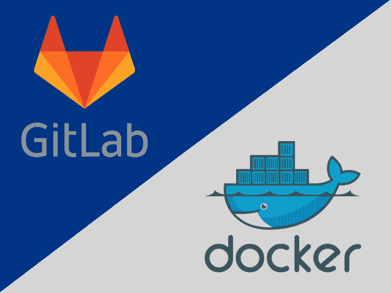
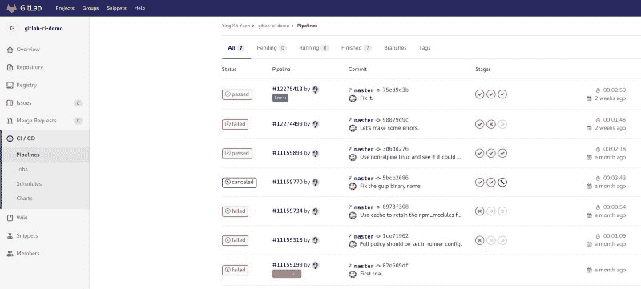
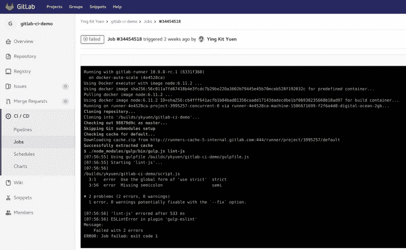

# 如何使用 Docker 在 GitLab 上设置 CI

> 原文：<https://www.freecodecamp.org/news/how-to-setup-ci-on-gitlab-using-docker-66e1e04dcdc2/>

作者:应洁媛

# 如何使用 Docker 在 GitLab 上设置 CI

一个使用 Docker 测试和构建管道的例子

过去，您可能尝试过不同的工具来有效地管理应用程序的部署。在本教程中，我将向您展示一种使用 GitLab 和 Docker 为您的环境设置持续集成的快速而简单的方法。所以让我们开始吧。

下面是我们将要设置的内容:

*   版本控制
*   问题跟踪器
*   证明文件
*   连续累计
*   连续交货
*   存储库(工件/docker 图像)

像 [Jenkins](https://jenkins.io/) 这样的工具有利于持续集成和交付。[螳螂](https://www.mantisbt.org/)帮助跟踪问题。但是为了提高我们项目的效率和质量，我们需要将所有这些工具结合在一起。例如，我们可能希望 git 提交与现有问题挂钩，或者在将提交推送到主分支后触发自动化测试。

通常，大多数工具已经提供了与其他公共服务的现成集成，但有时仍然很难配置它们。此外，如果链中的任何一个服务停止运行，工作流就会中断。因此，如果有一个平台可以满足所有这些要求，那就太好了，这就是我们选择 [GitLab](https://gitlab.com) 的原因。

### GitLab CI

GitLab.com 是一个基于 SAAS 的服务，你可以托管你的 Git 库，跟踪问题，用 markdown 写维基。 [GitLab CI](https://about.gitlab.com/features/gitlab-ci-cd/) 还允许您利用 [Docker Hub](https://hub.docker.com/) 上可用的任何 Docker**映像来设置持续集成。让我们看看下面的例子。**

#### 吉塔实验室 CI YML

GitLab CI 使用一个 YAML 文件`.gitlab-ci.yml`来定义项目配置，其中包括在响应 git 推送/合并而触发 CI/CD 管道后需要运行的所有阶段的定义。在这个例子中，我们有一个简单的 Node.js 项目，我们希望通过林挺和运行单元测试来确保代码是好的。为了配合，分叉这个[库](https://gitlab.com/ykyuen/gitlab-ci-demo)并检查它。

在上面的 YAML 配置文件中，我们定义了 3 个阶段。每个阶段只是`gulpfile.js`中定义的一个吞咽任务。只要安装了 Node.js，任何人都可以在本地运行该任务。但是在 [GitLab CI](https://about.gitlab.com/features/gitlab-ci-cd/) 中，我们只需要提到需要哪个 Docker 形象就可以了。在我们的例子中，这是节点:6.11.2。此外，这个图像属性可以在阶段定义中定义，以便您可以为每个阶段使用不同的工具。

#### 阶段定义

让我们更深入地了解一下阶段定义。

`before_script`和`script`的属性可以有多个值(数组 in。yml)。如果脚本执行失败，该阶段将被归类为失败。

#### 触发管道

只需在主分支上做一些更改，您就可以在页面上找到正在运行的管道。

The pipeline history

#### 详细查看舞台

点击一个特定的管道，你可以读取每个阶段的控制台输出。这在阶段/作业失败时很有用。

The stage output

### 将 GitLab CI 与 Docker 一起使用的好处

不同的项目可能需要不同的依赖项，比如 Node.js、Ant、Maven。过去，当使用像 [Jenkins](https://jenkins.io/) 这样的工具时，我必须确保所有这些工具都安装在服务器上。通过使用 [Docker](https://www.docker.com/) ，开发者可以引用 [Docker Hub](https://hub.docker.com/) 上可用的依赖项，而无需每次都要求服务器管理员在服务器上设置这样的依赖项。事实上，Jenkins 也有一个管道插件，它可以与 Docker 一起工作，达到完全相同的目的。但是正如我之前提到的，集成 Jenkins 和版本控制需要额外的努力。

虽然我更喜欢使用 [GitLab CI](https://about.gitlab.com/features/gitlab-ci-cd/) ，但这并不意味着它可以完全取代 [Jenkins](https://jenkins.io/) 。 [Jenkins](https://jenkins.io/) 提供了一个可配置的用户界面，方便 QA 等非开发人员执行某些任务，如部署和集成测试。

### 选择一个合适的工具——它不必是完美的

关键不在于选择完美的工具。相反，更多的是关于使用它的人。所以在寻找新的工具之前，试着先确定你想解决的问题。

—最初发布在[水手长博客](https://blog.boatswain.io/post/a-simple-gitlab-ci-example/)上。